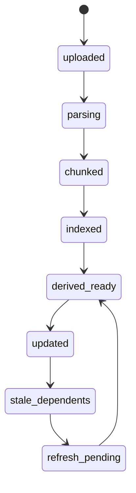

# Einstein Tutor App Full Reference

Generated: 2026-04-19 23:46:42

> **STALE — historical snapshot only.** This document was generated on
> 2026-04-19 against the legacy frontend. Since then:
>
> - The legacy single-file frontend (`app.js`, `app.js.extract`,
>   `app.html.legacy`, `EINSTEIN_FRONTEND` flag, `--frontend legacy`,
>   `FrontendSelector`, `test_frontend_selector.sh`) has been **removed
>   in full**. Any reference to those filenames or paths in the
>   sections below is no longer accurate; the active UI lives in
>   `frontend/` (Preact + Signals + Vite, code-split per route).
> - The macOS shell still loads the same bundled HTML, but it now comes
>   from `frontend/scripts/build-macos.mjs` writing
>   `macos-app/Resources/app.new.html`.
> - The app was renamed Einstein → **Carrel**. References to "Einstein"
>   below are historical.
>
> Do not treat this file as authoritative. For current state read
> `CLAUDE.md`, `AUDIT.md`, and `git log`. Regenerate this doc only if a
> new full-snapshot handoff is genuinely useful — otherwise let it
> stand as a historical artifact.

This file is a single-place handoff for the current app: stack summary, architecture notes, repo inventory, and the full source contents of the main code that powers the app today.

## What This Covers

- Native macOS shell built with SwiftPM.
- Primary app UI bundled as a local HTML/CSS/JavaScript app inside a `WKWebView`.
- Local Python FastAPI backend and service layer.
- SQLite schema and supporting templates/tests/docs.
- The active ingestion, flashcard, artifact, tutor, and workspace code paths.

## Tech Stack

- Desktop shell: Swift, SwiftPM, AppKit, WebKit, Vision, PDFKit.
- Frontend: vanilla HTML/CSS/JavaScript, bundled into the macOS app resource directory.
- Backend: Python, FastAPI, Pydantic, sqlite3.
- Data store: SQLite.
- Document processing: PyPDF2 plus format-specific Python parsers and a native macOS OCR bridge.
- Test/build tooling: `unittest`, shell scripts, SwiftPM.

## Repo Shape

- `ai/`: 2 files
- `services/`: 19 files
- `routes/`: 10 files
- `macos-app/`: 8 files
- `script/`: 1 files
- `tests/`: 2 files
- `templates/`: 6 files
- `implementation/`: 2 files
- `static/`: 9 files
- `chatgpt-app/`: 5 files
- `data/`: 14 files
- `dist/`: 5 files
- `handoff/`: 6 files

## Included Source Snapshot

- Included files: 71
- Included total lines: 39891
- Excluded on purpose: `.git`, virtualenvs, `node_modules`, build products, packaged app bundles, caches, uploaded user files, and SQLite database binaries.

## File Manifest

### Project overview

- `README.md` (35 lines)
### AI provider integration

- `ai/__init__.py` (1 lines)
- `ai/claude.py` (477 lines)
### API documentation

- `api-contracts.md` (46 lines)
### Legacy root JS entry

- `app.js` (1881 lines)
### Secondary widget / ChatGPT app assets

- `chatgpt-app/README.md` (122 lines)
- `chatgpt-app/package.json` (16 lines)
- `chatgpt-app/public/einstein-widget.html` (3993 lines)
### Database bootstrap helpers

- `db.py` (173 lines)
### Architecture and implementation docs

- `implementation/LEARNING_OS_API_V2.md` (410 lines)
- `implementation/LEARNING_OS_IMPLEMENTATION.md` (467 lines)
### Legacy root HTML

- `index.html` (623 lines)
### Swift package definition

- `macos-app/Package.swift` (30 lines)
### Primary macOS app UI resources

- `macos-app/Resources/app.html` (5782 lines)
- `macos-app/Resources/app.js` (4102 lines)
- `macos-app/Resources/app.js.extract` (4204 lines)
### Native macOS shell

- `macos-app/Sources/EinsteinDesktopApp/EinsteinDesktopApp.swift` (40 lines)
- `macos-app/Sources/EinsteinDesktopApp/NativeBridge.swift` (78 lines)
- `macos-app/Sources/EinsteinDesktopApp/WebAppView.swift` (311 lines)
### Native OCR / ingestion bridge

- `macos-app/Sources/EinsteinIngestionBridge/main.swift` (197 lines)
### FastAPI application entry point

- `main.py` (1938 lines)
### Python dependencies

- `requirements.txt` (14 lines)
### FastAPI route modules

- `routes/__init__.py` (21 lines)
- `routes/concepts.py` (5 lines)
- `routes/documents.py` (8 lines)
- `routes/evidence.py` (54 lines)
- `routes/exports.py` (45 lines)
- `routes/studio.py` (4 lines)
- `routes/study.py` (13 lines)
- `routes/synthesis.py` (3 lines)
- `routes/tutor.py` (10 lines)
- `routes/workspace.py` (10 lines)
### Database schema

- `schema.sql` (115 lines)
### Build and run tooling

- `script/build_and_run.sh` (192 lines)
### Backend application services

- `services/__init__.py` (1 lines)
- `services/adaptive_tutor.py` (287 lines)
- `services/artifact_prompts.py` (97 lines)
- `services/artifact_studio.py` (886 lines)
- `services/documents.py` (482 lines)
- `services/export_service.py` (167 lines)
- `services/extraction_pipeline.py` (1491 lines)
- `services/graph.py` (56 lines)
- `services/helpers.py` (77 lines)
- `services/ingestion.py` (2031 lines)
- `services/mastery_engine.py` (142 lines)
- `services/provenance_service.py` (338 lines)
- `services/review_scheduler.py` (220 lines)
- `services/session_engine.py` (187 lines)
- `services/stale_tracker.py` (130 lines)
- `services/study.py` (81 lines)
- `services/synthesis.py` (284 lines)
- `services/tutor.py` (404 lines)
- `services/workspace.py` (457 lines)
### Legacy web frontend assets

- `static/js/api.js` (160 lines)
- `static/js/bootstrap.js` (237 lines)
- `static/js/main.js` (1205 lines)
- `static/js/state.js` (292 lines)
- `static/js/views/concepts.js` (818 lines)
- `static/js/views/library.js` (77 lines)
- `static/js/views/study.js` (31 lines)
- `static/js/views/workspace.js` (615 lines)
- `static/styles.css` (1268 lines)
### Legacy root styles

- `styles.css` (994 lines)
### Export / integration templates

- `templates/make/README.md` (18 lines)
- `templates/make/chunk-content.json` (19 lines)
- `templates/make/generate-quiz.json` (19 lines)
- `templates/notion/README.md` (29 lines)
- `templates/retool/README.md` (9 lines)
- `templates/retool/queries.js` (60 lines)
### Automated tests

- `tests/test_einstein_tutor.py` (482 lines)
- `tests/test_learning_os.py` (320 lines)

## Full Source Contents

### README.md

- Category: Project overview
- Absolute path: `/Users/madu/Desktop/Codex/README.md`

~~~~markdown
# Einstein Tutor

This workspace now includes a working local app:

- FastAPI backend
- SQLite persistence
- TXT/MD/PDF ingestion
- The original dashboard UI wired to live local endpoints
- Database schema and integration templates based on the original planning docs

## Quick Start

1. Start the server:
   `python3 -m uvicorn main:app --reload --app-dir /Users/madu/Desktop/Codex`
2. Open `http://127.0.0.1:8000`
3. Upload a TXT, MD, or PDF file from the Upload tab.

## What Is Included

- `main.py` - FastAPI app, ingestion pipeline, and persistence layer
- `index.html` - UI shell served by FastAPI
- `styles.css` - visual system and responsive layout
- `app.js` - browser app wired to live API endpoints
- `schema.sql` - SQLite schema derived from the system design
- `api-contracts.md` - REST endpoints for a future backend
- `templates/make/` - Make HTTP payloads and workflow guide
- `templates/retool/` - Retool queries and JavaScript snippets
- `templates/notion/` - Notion database setup reference

## Notes

- The app creates its SQLite database in `/Users/madu/Desktop/Codex/data/einstein_tutor.db`.
- Uploaded files are stored in `/Users/madu/Desktop/Codex/data/uploads/`.
- The current tutoring, question generation, and explanations are deterministic local logic so phase 1 works without a live LLM.
- Make, Retool, and Notion templates are still included for later external integrations.
~~~~

### ai/__init__.py

- Category: AI provider integration
- Absolute path: `/Users/madu/Desktop/Codex/ai/__init__.py`

~~~~python
# AI integration package for Einstein Tutor.
~~~~

### ai/claude.py

- Category: AI provider integration
- Absolute path: `/Users/madu/Desktop/Codex/ai/claude.py`

~~~~python
import json
import os
from typing import Any, Callable, Dict, List, Optional

try:
    from dotenv import load_dotenv
except ImportError:  # pragma: no cover - optional dependency
    load_dotenv = None

try:
    import anthropic
except ImportError:  # pragma: no cover - optional dependency
    anthropic = None

if load_dotenv:
    import pathlib as _pathlib
    _env_path = _pathlib.Path(__file__).resolve().parent.parent / ".env"
    load_dotenv(_env_path, override=True)


DEFAULT_MODEL = os.getenv("ANTHROPIC_MODEL", "claude-3-5-sonnet-latest")


def _client():
    api_key = os.getenv("ANTHROPIC_API_KEY")
    if not api_key or anthropic is None:
        return None
    return anthropic.Anthropic(api_key=api_key)


def ai_enabled() -> bool:
    return _client() is not None


def _extract_text_block(content: Any) -> str:
    if isinstance(content, str):
        return content
    if isinstance(content, list):
        parts = []
        for item in content:
            if isinstance(item, dict) and item.get("type") == "text":
                parts.append(item.get("text", ""))
            elif hasattr(item, "text"):
                parts.append(getattr(item, "text", ""))
        return "\n".join(part for part in parts if part)
    return str(content or "")


def _request_text(system: str, prompt: str, max_tokens: int = 1600) -> Optional[str]:
    client = _client()
    if client is None:
        return None
    try:
        response = client.messages.create(
            model=DEFAULT_MODEL,
            max_tokens=max_tokens,
            system=system,
            messages=[{"role": "user", "content": prompt}],
        )
        return _extract_text_block(response.content).strip()
    except Exception:
        return None


def _request_json(system: str, prompt: str, fallback: Any, max_tokens: int = 1600):
    text = _request_text(system, prompt, max_tokens=max_tokens)
    if not text:
        return fallback
    try:
        return json.loads(text)
    except json.JSONDecodeError:
        start = text.find("{")
        alt_start = text.find("[")
        index = min([pos for pos in [start, alt_start] if pos != -1], default=-1)
        if index == -1:
            return fallback
        try:
            return json.loads(text[index:])
        except json.JSONDecodeError:
            return fallback


def generate_summary(text: str, fallback: Callable[[], str]) -> str:
    response = _request_text(
        system="You summarize study material into concise, grounded learning summaries.",
        prompt=(
            "Summarize the following study material in 2-3 sentences. Focus on the main mechanisms, relationships, "
            "and study-worthy ideas. Do not invent details.\n\n"
            f"{text[:12000]}"
        ),
        max_tokens=500,
    )
    return response or fallback()


def extract_concepts(text: str, doc_title: str, fallback: Callable[[], List[Dict[str, Any]]]) -> List[Dict[str, Any]]:
    payload = _request_json(
        system="You extract key study concepts and return strict JSON only.",
        prompt=(
            "Return a JSON array with 5-10 key concepts for this document. "
            "Each item must include: name, description, mastery, related_terms.\n\n"
            f"Document title: {doc_title}\n\n"
            f"Document text:\n{text[:16000]}"
        ),
        fallback=None,
        max_tokens=1800,
    )
    if not isinstance(payload, list) or not payload:
        return fallback()
    concepts: List[Dict[str, Any]] = []
    for item in payload:
        if not isinstance(item, dict) or not item.get("name"):
            continue
        mastery = item.get("mastery", 0.5)
        try:
            mastery = max(0.05, min(1.0, float(mastery)))
        except (TypeError, ValueError):
            mastery = 0.5
        concepts.append(
            {
                "name": str(item["name"]).strip(),
                "description": str(item.get("description") or item["name"]).strip(),
                "summary": str(item.get("description") or item["name"]).strip(),
                "mastery": round(mastery, 2),
                "difficulty_label": "Hard" if mastery >= 0.7 else "Medium" if mastery >= 0.45 else "Easy",
                "related_terms": [str(term).strip() for term in item.get("related_terms", []) if str(term).strip()],
            }
        )
    return concepts or fallback()


def curate_concept_options(
    doc_title: str,
    goal: str,
    concepts: List[Dict[str, Any]],
    context: str,
    fallback: Callable[[], List[Dict[str, Any]]],
) -> List[Dict[str, Any]]:
    payload = _request_json(
        system="You curate concept selector options for a study workspace and return strict JSON only.",
        prompt=(
            "Return a JSON array with 4-8 concept selector items chosen only from the provided concept ids. "
            "Each item must include: concept_id, display_name, reason. "
            "Pick the concepts that are most central, readable, and study-worthy for a learner. "
            "Rewrite noisy OCR-like labels into short learner-friendly labels. "
            "Avoid boilerplate, copyright fragments, and duplicate concepts.\n\n"
            f"Document title: {doc_title}\n"
            f"Learning goal: {goal or 'No goal set'}\n\n"
            f"Candidate concepts: {json.dumps(concepts)}\n\n"
            f"Document context:\n{context[:12000]}"
        ),
        fallback=None,
        max_tokens=1600,
    )
    if not isinstance(payload, list) or not payload:
        return fallback()
    curated: List[Dict[str, Any]] = []
    for item in payload:
        if not isinstance(item, dict) or not item.get("concept_id") or not item.get("display_name"):
            continue
        curated.append(
            {
                "concept_id": str(item["concept_id"]).strip(),
                "display_name": str(item["display_name"]).strip(),
                "reason": str(item.get("reason") or "").strip(),
            }
        )
    return curated or fallback()


def generate_questions(
    concepts: List[str],
    context: str,
    fallback: Callable[[], List[Dict[str, Any]]],
) -> List[Dict[str, Any]]:
    payload = _request_json(
        system="You create grounded multiple-choice questions from study material and return strict JSON only.",
        prompt=(
            "Return a JSON array with one multiple-choice question per concept. "
            "Each item must include: concept, question, answer, distractors, explanation, difficulty_value.\n\n"
            f"Concepts: {json.dumps(concepts)}\n\nContext:\n{context[:12000]}"
        ),
        fallback=None,
        max_tokens=1800,
    )
    if not isinstance(payload, list) or not payload:
        return fallback()
    normalized = []
    for item in payload:
        if not isinstance(item, dict) or not item.get("question") or not item.get("answer"):
            continue
        distractors = item.get("distractors", [])
        if not isinstance(distractors, list):
            distractors = []
        try:
            difficulty_value = float(item.get("difficulty_value", 0.5))
        except (TypeError, ValueError):
            difficulty_value = 0.5
        normalized.append(
            {
                "concept": str(item.get("concept") or "").strip(),
                "question": str(item["question"]).strip(),
                "answer": str(item["answer"]).strip(),
                "distractors": [str(choice).strip() for choice in distractors if str(choice).strip()][:3],
                "explanation": str(item.get("explanation") or "").strip(),
                "difficulty_value": max(0.05, min(1.0, difficulty_value)),
            }
        )
    return normalized or fallback()


def generate_srs_cards(
    concept: str,
    context: str,
    fallback: Callable[[], List[Dict[str, Any]]],
) -> List[Dict[str, Any]]:
    payload = _request_json(
        system="You create compact spaced-repetition cards and return strict JSON only.",
        prompt=(
            "Return a JSON array with 2 flashcards for the concept. "
            "Each card must include: card_type, front, back, difficulty.\n\n"
            f"Concept: {concept}\n\nContext:\n{context[:9000]}"
        ),
        fallback=None,
        max_tokens=1200,
    )
    if not isinstance(payload, list) or not payload:
        return fallback()
    cards = []
    for item in payload:
        if not isinstance(item, dict) or not item.get("front") or not item.get("back"):
            continue
        try:
            difficulty = float(item.get("difficulty", 0.5))
        except (TypeError, ValueError):
            difficulty = 0.5
        cards.append(
            {
                "card_type": str(item.get("card_type") or "definition"),
                "front": str(item["front"]).strip(),
                "back": str(item["back"]).strip(),
                "difficulty": max(0.05, min(0.95, difficulty)),
            }
        )
    return cards or fallback()


def generate_concept_edges(
    concepts: List[Dict[str, Any]],
    text: str,
    fallback: Callable[[], List[Dict[str, Any]]],
) -> List[Dict[str, Any]]:
    payload = _request_json(
        system="You identify semantic relationships between study concepts and return strict JSON only.",
        prompt=(
            "Return a JSON array of concept relationships. "
            "Each item must include: source_name, target_name, relationship.\n\n"
            f"Concepts: {json.dumps([item.get('name') for item in concepts])}\n\nText:\n{text[:12000]}"
        ),
        fallback=None,
        max_tokens=1200,
    )
    if not isinstance(payload, list) or not payload:
        return fallback()
    edges = []
    for item in payload:
        if not isinstance(item, dict) or not item.get("source_name") or not item.get("target_name"):
            continue
        edges.append(
            {
                "source_name": str(item["source_name"]).strip(),
                "target_name": str(item["target_name"]).strip(),
                "relationship": str(item.get("relationship") or "relates to").strip(),
            }
        )
    return edges or fallback()


def tutor_response(
    question: str,
    chunks: List[str],
    concepts: List[str],
    fallback: Callable[[], Dict[str, Any]],
) -> Dict[str, Any]:
    response = _request_text(
        system=(
            "You are Einstein Tutor. Answer using only the supplied study material, keep the answer concise, "
            "and avoid unsupported claims."
        ),
        prompt=(
            f"Question: {question}\n\nConcepts: {json.dumps(concepts)}\n\nStudy material:\n"
            + "\n\n".join(chunks[:8])
        ),
        max_tokens=900,
    )
    if not response:
        return fallback()
    payload = fallback()
    payload["answer"] = response
    return payload


def compare_documents(
    left_context: str,
    right_context: str,
    question: str,
    fallback: Callable[[], Dict[str, Any]],
) -> Dict[str, Any]:
    payload = _request_json(
        system="You compare study concepts and return strict JSON only.",
        prompt=(
            "Return JSON with keys: similarities, differences, study_prompt.\n\n"
            f"Question: {question}\n\nLeft:\n{left_context[:5000]}\n\nRight:\n{right_context[:5000]}"
        ),
        fallback=None,
        max_tokens=1200,
    )
    if not isinstance(payload, dict):
        return fallback()
    result = fallback()
    if isinstance(payload.get("similarities"), list) and payload["similarities"]:
        result["similarities"] = [str(item) for item in payload["similarities"]]
    if isinstance(payload.get("differences"), list) and payload["differences"]:
        result["differences"] = [str(item) for item in payload["differences"]]
    if payload.get("study_prompt"):
        result["study_prompt"] = str(payload["study_prompt"])
    return result


# ── Artifact generation ────────────────────────────────────────────────────────

def generate_artifact(
    artifact_kind: str,
    context: str,
    concepts: List[str],
    goal: str,
    audience: str = "student",
    depth: str = "standard",
    output_length: str = "medium",
    custom_prompt: Optional[str] = None,
    fallback: Optional[Callable[[], str]] = None,
) -> str:
    """Generate a Markdown artifact powered by Claude."""
    length_hint = {"short": "300-500 words", "medium": "600-1200 words", "long": "1400-2500 words"}.get(output_length, "600-1200 words")
    token_limit = {"short": 1200, "medium": 2400, "long": 4000}.get(output_length, 2400)

    system = (
        f"You generate high-quality {artifact_kind.replace('_', ' ')} study artifacts in Markdown. "
        f"Audience: {audience}. Depth: {depth}. Target length: {length_hint}. "
        "Ground every claim in the supplied study material. Do not invent facts."
    )
    user_prompt = (
        f"Generate a {artifact_kind.replace('_', ' ')} from the following study material.\n\n"
        f"Concepts: {json.dumps(concepts)}\n"
        f"{'Goal: ' + goal + chr(10) if goal else ''}"
        f"{'Custom instructions: ' + custom_prompt + chr(10) if custom_prompt else ''}\n"
        f"Study material:\n{context[:14000]}"
    )
    response = _request_text(system, user_prompt, max_tokens=token_limit)
    if response:
        return response
    if fallback:
        return fallback()
    return f"# {artifact_kind.replace('_', ' ').title()}\n\nArtifact generation requires a valid ANTHROPIC_API_KEY."


# ── Enhanced tutor response (with citations, scaffolds, misconceptions) ───────

def tutor_response_v2(
    question: str,
    chunks: List[Dict[str, Any]],
    concepts: List[str],
    learner_confidence: int = 50,
    selected_text: Optional[str] = None,
    response_mode: str = "standard",
    fallback: Optional[Callable[[], Dict[str, Any]]] = None,
) -> Optional[Dict[str, Any]]:
    """Enhanced tutor response returning structured JSON with citations, scaffolds, misconceptions."""
    chunk_context = "\n\n".join(
        f"[chunk_id={ch.get('id', i)}, source={ch.get('filename', 'Unknown')}, page={ch.get('page_num', '?')}]\n{ch.get('content', '')}"
        for i, ch in enumerate(chunks[:8])
    )
    sel_block = f"\nThe learner selected this text: \"{selected_text}\"\n" if selected_text else ""
    mode_hint = {
        "easier": "Use simpler language, shorter sentences, and concrete analogies.",
        "deeper": "Go deeper into mechanisms and edge cases. Be thorough.",
        "exam": "Frame the answer as exam preparation with key facts to remember.",
    }.get(response_mode, "")

    payload = _request_json(
        system=(
            "You are Einstein Tutor, a source-grounded adaptive tutor. "
            "Answer ONLY from the supplied study material. Never invent claims. "
            "Return a JSON object with these keys:\n"
            "  answer: string (the main explanation, Markdown OK)\n"
            "  citations: array of {label, chunk_id, snippet, page_num} — reference chunks used\n"
            "  scaffolds: array of strings — 2-3 follow-up study steps\n"
            "  misconceptions: array of strings — common mistakes related to this topic\n"
            "  confidence_model: float 0-1 — how confident YOU are in the answer based on evidence\n"
            f"Learner self-reported confidence: {learner_confidence}%. "
            f"{mode_hint}"
        ),
        prompt=f"Question: {question}\n{sel_block}\nConcepts: {json.dumps(concepts)}\n\nStudy material:\n{chunk_context}",
        fallback=None,
        max_tokens=2000,
    )
    if isinstance(payload, dict) and payload.get("answer"):
        return payload
    return None


# ── Synthesis: AI-powered cross-source analysis ───────────────────────────────

def synthesize_sources(
    synthesis_type: str,
    source_chunks: Dict[str, List[Dict[str, Any]]],
    concept_names: List[str],
    fallback: Optional[Callable[[], Dict[str, Any]]] = None,
) -> Optional[Dict[str, Any]]:
    """Cross-source synthesis using Claude."""
    type_instructions = {
        "compare": "Compare all sources. Return JSON with: contradictions (array), agreements (array), gaps (array), themes (array of strings).",
        "agreement": "Find all points of agreement across sources. Return JSON with: shared_concepts (array of {name, source_count}), themes (array of strings), source_count (int).",
        "gaps": "Find concepts that appear in some sources but not others. Return JSON with: gaps (array of {concept_name, present_in (array), missing_in (array)}).",
        "terminology": "Find terms that mean similar things but use different names. Return JSON with: alignments (array of {term_a, term_b, source_a, source_b, overlap_reason}).",
    }.get(synthesis_type, "Compare all sources and return JSON with contradictions, agreements, gaps, themes.")

    source_text = ""
    for source_name, chunks in list(source_chunks.items())[:4]:
        chunk_text = "\n".join(ch.get("content", "")[:800] for ch in chunks[:4])
        source_text += f"\n\n--- SOURCE: {source_name} ---\n{chunk_text}"

    payload = _request_json(
        system=(
            "You perform cross-source synthesis for adaptive learning. "
            "Ground every finding in the actual source text. Do not invent. "
            f"{type_instructions}"
        ),
        prompt=f"Concepts: {json.dumps(concept_names)}\n\nSources:{source_text[:16000]}",
        fallback=None,
        max_tokens=2400,
    )
    if isinstance(payload, dict):
        return payload
    return None


# ── Evaluate learner response ─────────────────────────────────────────────────

def evaluate_response(
    exchange_context: str,
    learner_response: str,
    concept_name: str,
    fallback: Optional[Callable[[], Dict[str, Any]]] = None,
) -> Optional[Dict[str, Any]]:
    """Classify a learner's self-check answer and suggest a repair path."""
    payload = _request_json(
        system=(
            "You are an examiner for an adaptive tutor. Classify the learner's response. "
            "Return JSON with:\n"
            "  classification: one of 'omission', 'misconception', 'wrong_relation', 'wrong_example', 'shallow_but_correct', 'robust_and_transferable'\n"
            "  explanation: string — brief feedback\n"
            "  repair_path: {strategy: string, next_action: string, surface: string (one of 'tutor','review','concept')}\n"
            "  revisit: {schedule_in_minutes: int}\n"
            "  score: float 0-1"
        ),
        prompt=(
            f"Concept: {concept_name}\n\n"
            f"Exchange context:\n{exchange_context[:4000]}\n\n"
            f"Learner response: {learner_response}"
        ),
        fallback=None,
        max_tokens=800,
    )
    if isinstance(payload, dict) and payload.get("classification"):
        return payload
    return None
~~~~

### api-contracts.md

- Category: API documentation
- Absolute path: `/Users/madu/Desktop/Codex/api-contracts.md`

~~~~markdown
# Einstein Tutor API Contracts

## Document Management

- `POST /api/documents/upload`
  - Request: multipart form with `file`
  - Response: `{ "doc_id": "string", "status": "processing" }`
- `GET /api/documents`
  - Response: document list
- `GET /api/documents/:id/status`
  - Response: `{ "doc_id": "string", "status": "processing|ready|error" }`
- `DELETE /api/documents/:id`
  - Response: `{ "deleted": true }`

## Quiz Engine

- `POST /api/quiz/generate`
  - Request: `{ "concepts": ["optional"], "count": 7, "difficulty": "easy|medium|hard" }`
  - Response: `{ "questions": [...] }`
- `POST /api/quiz/answer`
  - Request: `{ "question_id": "string", "response": "string", "time_taken": 12 }`
  - Response: `{ "correct": true, "feedback": "string", "mastery": 0.61 }`

## Concept Map

- `GET /api/concepts/graph`
  - Response: `{ "nodes": [...], "edges": [...] }`
- `GET /api/concepts/:id/explain?level=1`
  - Response: `{ "concept": "string", "level": 1, "explanation": "string", "takeaway": "string" }`

## SRS

- `GET /api/srs/due`
  - Response: `{ "cards": [...] }`
- `POST /api/srs/review`
  - Request: `{ "card_id": "string", "rating": "again|hard|good|easy" }`
  - Response: `{ "next_due_date": "2026-04-14", "interval": 3, "ease": 2.43 }`

## Socratic Dialogue

- `POST /api/dialogue/start`
  - Request: `{ "concept_id": "string" }`
  - Response: `{ "session_id": "string", "opening_prompt": "string" }`
- `POST /api/dialogue/message`
  - Request: `{ "session_id": "string", "message": "string" }`
  - Response: `{ "reply": "string", "understanding": 3 }`
~~~~

### app.js

- Category: Legacy root JS entry
- Absolute path: `/Users/madu/Desktop/Codex/app.js`

~~~~javascript
function buildDefaultMomentum() {
  return {
    headline: "Upload a source to start building momentum",
    reason: "The engine will prioritize the highest-leverage next step once it can see your concepts and study history.",
    actions: [{ label: "Upload a source", type: "upload" }],
    signals: [],
    momentum_score: 0,
    focus_concept_id: null,
    focus_concept_name: null
  };
}

const state = {
  documents: [],
  selectedDocumentId: null,
  documentDetail: null,
  questions: [],
  dueCards: [],
  graph: { nodes: [], edges: [] },
  stats: {
    documents: 0,
    questions: 0,
    due: 0,
    retention: 0,
    mastered: 0,
    weakestConcept: "-"
  },
  workspace: {
    goal: "",
    momentum: buildDefaultMomentum(),
    timeline: [],
    mastery: [],
    notes: [],
    compareOptions: [],
    subjects: []
  },
  currentCardIndex: 0,
  showAnswer: false,
  selectedConceptId: null,
  explanation: null,
  chat: [],
  sessionId: null,
  workspaceView: "tutor",
  tutorMessages: [],
  latestTutorResponse: null,
  lastTutorQuery: null,
  confidence: 62,
  selectedText: "",
  selectedPreview: null,
  focusMode: false,
  noteDraft: {
    noteId: null,
    title: "",
    content: "",
    sourceSnippet: ""
  },
  noteTransforms: {
    flashcards: [],
    quiz: []
  },
  compare: null,
  compareLeftId: null,
  compareRightId: null,
  graphFilters: {
    subjectName: "",
    docId: ""
  },
  commandPaletteOpen: false,
  commandQuery: ""
};

async function api(path, options = {}) {
  const response = await fetch(path, options);
  if (!response.ok) {
    const payload = await response.json().catch(() => ({}));
    throw new Error(payload.detail || "Request failed");
  }
  return response.json();
}

function escapeHtml(value) {
  return String(value ?? "")
    .replaceAll("&", "&amp;")
    .replaceAll("<", "&lt;")
    .replaceAll(">", "&gt;")
    .replaceAll('"', "&quot;")
    .replaceAll("'", "&#39;");
}

function truncate(text, maxLength = 160) {
  const value = String(text ?? "").trim();
  if (value.length <= maxLength) {
    return value;
  }
  return `${value.slice(0, maxLength - 1)}...`;
}

function formatDocumentMeta(document) {
  const type = (document.file_type || "file").toUpperCase();
  const pageInfo = document.page_count ? `${document.page_count} pages` : "text document";
  const subject = document.subject_name ? ` · ${document.subject_name}` : "";
  return `${type}${subject} · ${document.status} · ${pageInfo}`;
}

function shortFileLabel(filename) {
  const value = String(filename || "Source");
  return value.length > 22 ? `${value.slice(0, 21)}...` : value;
}

function selectedConceptOptions() {
  if (state.documentDetail?.concepts?.length) {
    return state.documentDetail.concepts;
  }
  return state.graph.nodes.map((node) => ({
    id: node.id,
    name: node.label,
    description: node.description,
    mastery: node.mastery
  }));
}

function getConceptById(conceptId) {
  if (!conceptId) {
    return null;
  }
  return selectedConceptOptions().find((concept) => concept.id === conceptId)
    || state.workspace.compareOptions.find((concept) => concept.id === conceptId)
    || null;
}

function graphDocuments() {
  const subjectName = state.graphFilters.subjectName;
  return subjectName
    ? state.documents.filter((docItem) => docItem.subject_name === subjectName)
    : state.documents;
}

function syncGraphFiltersWithSelection() {
  const selectedDoc = state.documents.find((docItem) => docItem.id === state.selectedDocumentId);
  if (selectedDoc) {
    if (!state.graphFilters.subjectName || !state.documents.some((docItem) => docItem.subject_name === state.graphFilters.subjectName)) {
      state.graphFilters.subjectName = selectedDoc.subject_name || "";
    }
    if (!state.graphFilters.docId || !state.documents.some((docItem) => docItem.id === state.graphFilters.docId)) {
      state.graphFilters.docId = selectedDoc.id;
    }
  } else if (!state.documents.length) {
    state.graphFilters.subjectName = "";
    state.graphFilters.docId = "";
  }
}

function defaultNoteTitle() {
  const concept = getConceptById(state.selectedConceptId);
  if (concept?.name) {
    return `${concept.name} note`;
  }
  if (state.documentDetail?.document?.filename) {
    return `${state.documentDetail.document.filename} note`;
  }
  return "Study note";
}

function eventLabel(eventType) {
  const labels = {
    goal_updated: "Goal updated",
    tutor_query: "Grounded tutor used",
    note_saved: "Note saved",
    note_transformed: "Note converted to study assets",
    compare_opened: "Compare mode opened",
    card_reviewed: "Card reviewed",
    document_uploaded: "Source uploaded",
    document_deleted: "Source removed",
    dialogue_started: "Socratic session started",
    dialogue_message: "Socratic exchange",
    focus_mode_toggled: "Focus mode toggled",
    source_previewed: "Source previewed",
    momentum_action: "Momentum action used"
  };
  return labels[eventType] || eventType.replaceAll("_", " ");
}

function switchTab(tabId) {
  document.querySelectorAll(".tab").forEach((button) => {
    button.classList.toggle("active", button.dataset.tab === tabId);
  });
  document.querySelectorAll(".panel").forEach((panel) => {
    panel.classList.toggle("active", panel.id === tabId);
  });
}

function openWorkspaceView(view) {
  state.workspaceView = view;
  document.querySelectorAll(".view-button").forEach((button) => {
    button.classList.toggle("active", button.dataset.workspaceView === view);
  });
  document.querySelectorAll(".workspace-view").forEach((panel) => {
    panel.classList.toggle("active", panel.id === `${view}View`);
  });
}

function ensureCompareSelections() {
  const options = state.workspace.compareOptions;
  if (!options.length) {
    state.compareLeftId = null;
    state.compareRightId = null;
    return;
  }
  const optionIds = new Set(options.map((option) => option.id));
  if (!state.compareLeftId || !optionIds.has(state.compareLeftId)) {
    state.compareLeftId = state.selectedConceptId && optionIds.has(state.selectedConceptId)
      ? state.selectedConceptId
      : options[0].id;
  }
  if (!state.compareRightId || !optionIds.has(state.compareRightId) || state.compareRightId === state.compareLeftId) {
    const fallback = options.find((option) => option.id !== state.compareLeftId);
    state.compareRightId = fallback ? fallback.id : state.compareLeftId;
  }
}

function setPreviewFromDocument() {
  if (state.documentDetail) {
    state.selectedPreview = {
      type: "document",
      item: state.documentDetail
    };
  } else {
    state.selectedPreview = null;
  }
}

function setPreviewFromCitation(citation) {
  state.selectedPreview = {
    type: "citation",
    item: citation
  };
}

async function logEvent(eventType, options = {}) {
  try {
    await api("/api/events", {
      method: "POST",
      headers: { "Content-Type": "application/json" },
      body: JSON.stringify({
        event_type: eventType,
        doc_id: options.docId ?? state.selectedDocumentId,
        concept_id: options.conceptId ?? state.selectedConceptId,
        confidence: options.confidence ?? null,
        duration_seconds: options.durationSeconds ?? null,
        payload: options.payload ?? {}
      })
    });
  } catch (_error) {
    // Best-effort analytics should not block the app.
  }
}

async function loadWorkspaceState() {
  state.workspace = await api("/api/workspace");
  ensureCompareSelections();
}

async function loadGraph() {
  const params = new URLSearchParams();
  if (state.graphFilters.docId) {
    params.set("doc_id", state.graphFilters.docId);
  } else if (state.graphFilters.subjectName) {
    params.set("subject_name", state.graphFilters.subjectName);
  }
  const suffix = params.toString() ? `?${params.toString()}` : "";
  state.graph = await api(`/api/concepts/graph${suffix}`);
  if (!state.selectedConceptId || !state.graph.nodes.some((node) => node.id === state.selectedConceptId)) {
    state.selectedConceptId = state.graph.nodes[0]?.id || null;
  }
}

async function loadCurrentNote() {
  const params = new URLSearchParams({ limit: "1" });
  if (state.selectedDocumentId) {
    params.set("doc_id", state.selectedDocumentId);
  }
  if (state.selectedConceptId) {
    params.set("concept_id", state.selectedConceptId);
  }
  const payload = await api(`/api/notes?${params.toString()}`);
  const note = payload.notes?.[0];
  state.noteTransforms = {
    flashcards: [],
    quiz: []
  };
  if (note) {
    state.noteDraft = {
      noteId: note.id,
      title: note.title || defaultNoteTitle(),
      content: note.content || "",
      sourceSnippet: note.source_snippet || ""
    };
  } else {
    state.noteDraft = {
      noteId: null,
      title: defaultNoteTitle(),
      content: "",
      sourceSnippet: state.selectedText || ""
    };
  }
}

async function loadDocumentDetail(docId, shouldRender = true) {
  if (!docId) {
    state.selectedDocumentId = null;
    state.documentDetail = null;
    setPreviewFromDocument();
    if (shouldRender) {
      renderAll();
    }
    return;
  }

  const detail = await api(`/api/documents/${docId}`);
  state.selectedDocumentId = docId;
  state.documentDetail = detail;
  state.graphFilters.subjectName = detail.document.subject_name || "";
  state.graphFilters.docId = detail.document.id;

  if (detail.concepts.length) {
    const currentConceptStillVisible = detail.concepts.some((concept) => concept.id === state.selectedConceptId);
    if (!currentConceptStillVisible) {
      state.selectedConceptId = detail.concepts[0].id;
    }
  } else if (!state.graph.nodes.some((concept) => concept.id === state.selectedConceptId)) {
    state.selectedConceptId = state.graph.nodes[0]?.id || null;
  }

  ensureCompareSelections();
  setPreviewFromDocument();
  await loadGraph();
  if (state.selectedConceptId) {
    await loadExplanation();
  }
  await loadCurrentNote();

  if (shouldRender) {
    renderAll();
  }
}

async function loadExplanation() {
  if (!state.selectedConceptId) {
    state.explanation = null;
    return;
  }
  const level = Number(document.getElementById("depthSlider")?.value || 2);
  state.explanation = await api(`/api/concepts/${state.selectedConceptId}/explain?level=${level}`);
}

async function startDialogue() {
  const payload = await api("/api/dialogue/start", {
    method: "POST",
    headers: { "Content-Type": "application/json" },
    body: JSON.stringify({ concept_id: state.selectedConceptId })
  });
  state.sessionId = payload.session_id;
  state.chat = [{ role: "assistant", text: payload.opening_prompt }];
}

async function sendDialogue(message) {
  const payload = await api("/api/dialogue/message", {
    method: "POST",
    headers: { "Content-Type": "application/json" },
    body: JSON.stringify({
      session_id: state.sessionId,
      concept_id: state.selectedConceptId,
      message
    })
  });
  state.sessionId = payload.session_id;
  state.chat.push({ role: "assistant", text: payload.reply });
}

async function loadBootstrap(options = {}) {
  const { preserveTutor = true } = options;
  const payload = await api("/api/bootstrap");
  state.documents = payload.documents || [];
  state.questions = payload.questions || [];
  state.dueCards = payload.dueCards || [];
  state.graph = payload.graph || { nodes: [], edges: [] };
  state.stats = payload.stats || state.stats;
  state.workspace = payload.workspace || state.workspace;
  state.currentCardIndex = 0;
  state.showAnswer = false;
  syncGraphFiltersWithSelection();

  if (state.documents.length) {
    const hasSelectedDocument = state.documents.some((docItem) => docItem.id === state.selectedDocumentId);
    if (!hasSelectedDocument) {
      state.selectedDocumentId = state.documents[0].id;
    }
    await loadDocumentDetail(state.selectedDocumentId, false);
  } else {
    state.selectedDocumentId = null;
    state.documentDetail = null;
    setPreviewFromDocument();
    state.noteDraft = {
      noteId: null,
      title: "Study note",
      content: "",
      sourceSnippet: ""
    };
  }

  if (!state.selectedConceptId && state.graph.nodes.length) {
    state.selectedConceptId = state.graph.nodes[0].id;
  } else if (state.selectedConceptId && !state.graph.nodes.some((concept) => concept.id === state.selectedConceptId)) {
    state.selectedConceptId = state.graph.nodes[0]?.id || null;
  }

  if (state.selectedConceptId) {
    await loadExplanation();
  }

  ensureCompareSelections();
  await loadGraph();

  if (!preserveTutor) {
    state.tutorMessages = [];
    state.latestTutorResponse = null;
    state.lastTutorQuery = null;
  }

  if (!state.chat.length) {
    await startDialogue();
  }

  renderAll();
}

async function refreshSummaryData() {
  await loadBootstrap({ preserveTutor: true });
}

async function saveGoal() {
  const goal = document.getElementById("goalInput").value.trim();
  state.workspace = await api("/api/goal", {
    method: "POST",
    headers: { "Content-Type": "application/json" },
    body: JSON.stringify({ goal })
  });
  renderWorkspace();
}

async function askTutor(question, mode = "standard", selectedText = state.selectedText) {
  const cleanQuestion = question.trim();
  if (!cleanQuestion) {
    return;
  }

  const confidence = Number(document.getElementById("confidenceSlider").value || state.confidence);
  state.confidence = confidence;
  state.lastTutorQuery = {
    question: cleanQuestion,
    responseMode: mode,
    selectedText
  };
  state.tutorMessages.push({
    role: "user",
    text: cleanQuestion,
    confidence
  });

  renderWorkspace();

  const response = await api("/api/tutor/query", {
    method: "POST",
    headers: { "Content-Type": "application/json" },
    body: JSON.stringify({
      question: cleanQuestion,
      doc_id: state.selectedDocumentId,
      concept_id: state.selectedConceptId,
      selected_text: selectedText || null,
      confidence,
      response_mode: mode
    })
  });

  state.latestTutorResponse = response;
  state.tutorMessages.push({
    role: "assistant",
    text: response.answer,
    citations: response.citations || [],
    misconceptions: response.misconceptions || [],
    scaffolds: response.scaffolds || [],
    actions: response.actions || []
  });

  if (response.citations?.length) {
    setPreviewFromCitation(response.citations[0]);
  }

  await loadWorkspaceState();
  renderAll();
}

async function rerunTutor(mode) {
  if (!state.lastTutorQuery) {
    return;
  }
  await askTutor(state.lastTutorQuery.question, mode, state.lastTutorQuery.selectedText);
}

async function saveNote() {
  const payload = {
    note_id: state.noteDraft.noteId,
    doc_id: state.selectedDocumentId,
    concept_id: state.selectedConceptId,
    title: state.noteDraft.title,
    content: state.noteDraft.content,
    source_snippet: state.noteDraft.sourceSnippet || state.selectedText || null
  };
  const response = await api("/api/notes", {
    method: "POST",
    headers: { "Content-Type": "application/json" },
    body: JSON.stringify(payload)
  });
  state.noteDraft.noteId = response.note.id;
  state.noteDraft.title = response.note.title;
  state.noteDraft.content = response.note.content;
  state.noteDraft.sourceSnippet = response.note.source_snippet || "";
  state.workspace = response.workspace;
  renderWorkspace();
}

async function transformCurrentNote() {
  const response = await api("/api/notes/transform", {
    method: "POST",
    headers: { "Content-Type": "application/json" },
    body: JSON.stringify({
      content: state.noteDraft.content,
      doc_id: state.selectedDocumentId,
      concept_id: state.selectedConceptId
    })
  });
  state.noteTransforms = response;
  await loadWorkspaceState();
  renderWorkspace();
}

async function saveDocumentSubject() {
  if (!state.selectedDocumentId) {
    return;
  }
  const subjectInput = document.getElementById("documentSubjectInput");
  const subjectName = subjectInput.value.trim() || "General";
  const response = await api(`/api/documents/${state.selectedDocumentId}/subject`, {
    method: "POST",
    headers: { "Content-Type": "application/json" },
    body: JSON.stringify({ subject_name: subjectName })
  });
  state.workspace = response.workspace;
  await refreshSummaryData();
}

async function runCompare() {
  if (!state.compareLeftId || !state.compareRightId) {
    return;
  }
  if (state.compareLeftId === state.compareRightId) {
    throw new Error("Choose two different concepts to compare.");
  }
  state.compare = await api("/api/compare", {
    method: "POST",
    headers: { "Content-Type": "application/json" },
    body: JSON.stringify({
      left_id: state.compareLeftId,
      right_id: state.compareRightId
    })
  });
  if (state.compare.citations?.length) {
    setPreviewFromCitation(state.compare.citations[0]);
  }
  await loadWorkspaceState();
  renderWorkspace();
}

async function submitReview(rating) {
  const current = state.dueCards[state.currentCardIndex];
  if (!current) {
    return;
  }

  await api("/api/srs/review", {
    method: "POST",
    headers: { "Content-Type": "application/json" },
    body: JSON.stringify({ card_id: current.id, rating })
  });

  state.dueCards.splice(state.currentCardIndex, 1);
  if (state.currentCardIndex >= state.dueCards.length) {
    state.currentCardIndex = Math.max(state.dueCards.length - 1, 0);
  }
  state.showAnswer = false;
  await refreshSummaryData();
}

async function uploadDocument(file) {
  if (!file) {
    return;
  }
  const formData = new FormData();
  formData.append("file", file);
  const subjectName = document.getElementById("uploadSubjectInput").value.trim() || "General";
  formData.append("subject_name", subjectName);
  const status = document.getElementById("uploadStatus");
  status.textContent = `Uploading ${file.name}...`;

  try {
    const result = await api("/api/documents/upload", {
      method: "POST",
      body: formData
    });
    status.textContent = `${file.name} processed and saved under ${subjectName}.`;
    state.selectedDocumentId = result.doc_id;
    await refreshSummaryData();
    switchTab("library");
  } catch (error) {
    status.textContent = error.message;
  }
}

async function deleteSelectedDocument() {
  if (!state.selectedDocumentId || !state.documentDetail) {
    return;
  }
  const filename = state.documentDetail.document.filename;
  const shouldDelete = window.confirm(`Remove "${filename}" from Einstein Tutor?`);
  if (!shouldDelete) {
    return;
  }

  await api(`/api/documents/${state.selectedDocumentId}`, {
    method: "DELETE"
  });

  document.getElementById("uploadStatus").textContent = `${filename} was removed from the library.`;
  state.selectedDocumentId = null;
  state.documentDetail = null;
  state.selectedPreview = null;
  await refreshSummaryData();
  switchTab("library");
}

function renderHeaderStats() {
  document.getElementById("documentsCount").textContent = state.stats.documents;
  document.getElementById("questionsCount").textContent = state.stats.questions;
  document.getElementById("dueCount").textContent = state.stats.due;
}

function renderMomentum() {
  const momentum = state.workspace.momentum || buildDefaultMomentum();
  document.getElementById("momentumHeadline").textContent = momentum.headline;
  document.getElementById("momentumReason").textContent = momentum.reason;
  document.getElementById("momentumScore").textContent = Math.round(momentum.momentum_score || 0);

  const signals = document.getElementById("momentumSignals");
  signals.innerHTML = momentum.signals?.length
    ? momentum.signals.map((signal) => `<span class="signal-pill">${escapeHtml(signal)}</span>`).join("")
    : `<span class="signal-pill">No study signals yet</span>`;

  const actions = document.getElementById("momentumActions");
  actions.innerHTML = momentum.actions?.length
    ? momentum.actions
        .map(
          (action, index) => `
            <button
              class="${index === 0 ? "primary-button momentum-button" : "ghost-button momentum-button"}"
              type="button"
              data-momentum-index="${index}"
            >
              ${escapeHtml(action.label)}
            </button>
          `
        )
        .join("")
    : `<button class="ghost-button momentum-button" type="button" data-momentum-index="0">Upload a source</button>`;
}

function renderMastery() {
  const masteryItems = state.workspace.mastery || [];
  document.getElementById("masterySummary").textContent = `${masteryItems.length} tracked`;
  document.getElementById("masteryList").innerHTML = masteryItems.length
    ? masteryItems
        .map(
          (item) => `
            <article class="mastery-item">
              <div class="mastery-row">
                <div>
                  <strong>${escapeHtml(item.name)}</strong>
                  <span>${escapeHtml(item.band)} · ${item.due_cards} cards due</span>
                </div>
                <strong>${item.mastery}%</strong>
              </div>
              <div class="mini-progress"><span style="width: ${item.mastery}%"></span></div>
              <p>${escapeHtml(item.description)}</p>
            </article>
          `
        )
        .join("")
    : `<p class="empty-state">Mastery indicators will appear after concepts are generated.</p>`;
}

function renderWorkspaceControls() {
  const goalInput = document.getElementById("goalInput");
  if (document.activeElement !== goalInput) {
    goalInput.value = state.workspace.goal || "";
  }

  const docSelect = document.getElementById("workspaceDocumentSelect");
  docSelect.innerHTML = state.documents.length
    ? state.documents
        .map(
          (document) => `
            <option value="${escapeHtml(document.id)}" ${document.id === state.selectedDocumentId ? "selected" : ""}>
              ${escapeHtml(document.filename)}
            </option>
          `
        )
        .join("")
    : `<option value="">No sources loaded</option>`;
  docSelect.disabled = !state.documents.length;

  const concepts = selectedConceptOptions();
  const conceptSelect = document.getElementById("workspaceConceptSelect");
  conceptSelect.innerHTML = concepts.length
    ? concepts
        .map(
          (concept) => `
            <option value="${escapeHtml(concept.id)}" ${concept.id === state.selectedConceptId ? "selected" : ""}>
              ${escapeHtml(concept.name || concept.label)}${concept.document_name ? ` · ${escapeHtml(shortFileLabel(concept.document_name))}` : ""}
            </option>
          `
        )
        .join("")
    : `<option value="">No concepts yet</option>`;
  conceptSelect.disabled = !concepts.length;

  const confidenceSlider = document.getElementById("confidenceSlider");
  confidenceSlider.value = String(state.confidence);
  document.getElementById("confidenceValue").textContent = `${state.confidence}%`;

  document.querySelectorAll(".view-button").forEach((button) => {
    button.classList.toggle("active", button.dataset.workspaceView === state.workspaceView);
  });
  document.querySelectorAll(".workspace-view").forEach((panel) => {
    panel.classList.toggle("active", panel.id === `${state.workspaceView}View`);
  });

  const contextCaption = state.selectedDocumentId
    ? `${state.documentDetail?.document?.filename || "Selected source"} · ${getConceptById(state.selectedConceptId)?.name || "General concept context"}`
    : "No source selected yet.";
  document.getElementById("tutorContextCaption").textContent = contextCaption;
}

function renderGraphControls() {
  const subjectSelect = document.getElementById("graphSubjectSelect");
  const documentSelect = document.getElementById("graphDocumentSelect");
  const subjects = state.workspace.subjects || [];
  subjectSelect.innerHTML = `
    <option value="">All Subjects</option>
    ${subjects
      .map(
        (subject) => `
          <option value="${escapeHtml(subject.subject_name)}" ${subject.subject_name === state.graphFilters.subjectName ? "selected" : ""}>
            ${escapeHtml(subject.subject_name)} (${subject.document_count})
          </option>
        `
      )
      .join("")}
  `;

  const docs = graphDocuments();
  documentSelect.innerHTML = `
    <option value="">All Documents</option>
    ${docs
      .map(
        (docItem) => `
          <option value="${escapeHtml(docItem.id)}" ${docItem.id === state.graphFilters.docId ? "selected" : ""}>
            ${escapeHtml(docItem.filename)}
          </option>
        `
      )
      .join("")}
  `;
}

function renderTutorFeed() {
  const feed = document.getElementById("tutorFeed");
  if (!state.tutorMessages.length) {
    feed.innerHTML = `
      <article class="tutor-message assistant">
        <span class="message-meta">Grounded tutor</span>
        <p>Ask a question about your selected source. I will answer with citations, scaffolds, and misconception checks.</p>
      </article>
    `;
    return;
  }

  feed.innerHTML = state.tutorMessages
    .map((message, messageIndex) => {
      const citations = message.citations || [];
      const citationHtml = citations.length
        ? `
          <div class="citation-chip-list">
            ${citations
              .map(
                (citation, citationIndex) => `
                  <button
                    class="citation-chip"
                    type="button"
                    data-message-index="${messageIndex}"
                    data-citation-index="${citationIndex}"
                  >
                    ${escapeHtml(citation.label)}
                  </button>
                `
              )
              .join("")}
          </div>
        `
        : "";
      const confidence = message.confidence != null
        ? `<span class="message-badge">Confidence ${Math.round(message.confidence)}%</span>`
        : "";
      return `
        <article class="tutor-message ${escapeHtml(message.role)}">
          <div class="message-header">
            <span class="message-meta">${message.role === "assistant" ? "Grounded tutor" : "You"}</span>
            ${confidence}
          </div>
          <p>${escapeHtml(message.text)}</p>
          ${citationHtml}
        </article>
      `;
    })
    .join("");

  feed.scrollTop = feed.scrollHeight;
}

function renderTutorSupport() {
  const scaffolds = state.latestTutorResponse?.scaffolds || [];
  const misconceptions = state.latestTutorResponse?.misconceptions || [];

  document.getElementById("scaffoldList").innerHTML = scaffolds.length
    ? scaffolds.map((item) => `<li>${escapeHtml(item)}</li>`).join("")
    : `<li class="empty-state">Scaffolded next steps will appear after a tutor response.</li>`;

  document.getElementById("misconceptionList").innerHTML = misconceptions.length
    ? misconceptions.map((item) => `<li>${escapeHtml(item)}</li>`).join("")
    : `<li class="empty-state">Misconception detection is watching for overgeneralization and concept blending.</li>`;

  const bar = document.getElementById("selectedTextBar");
  bar.classList.toggle("hidden", !state.selectedText);
  document.getElementById("selectedTextLabel").textContent = state.selectedText
    ? truncate(state.selectedText, 220)
    : "No text selected.";
}

function renderNotesView() {
  const titleInput = document.getElementById("noteTitleInput");
  const editor = document.getElementById("noteEditor");
  if (document.activeElement !== titleInput) {
    titleInput.value = state.noteDraft.title;
  }
  if (document.activeElement !== editor) {
    editor.value = state.noteDraft.content;
  }
  document.getElementById("noteSourceSnippet").textContent = state.noteDraft.sourceSnippet
    || state.selectedText
    || "Select source text or ask the tutor to anchor this note.";

  document.getElementById("noteFlashcards").innerHTML = state.noteTransforms.flashcards.length
    ? state.noteTransforms.flashcards
        .map(
          (card) => `
            <article class="generated-card">
              <strong>${escapeHtml(card.front)}</strong>
              <p>${escapeHtml(card.back)}</p>
            </article>
          `
        )
        .join("")
    : `<p class="empty-state">Generate flashcards from this note when it is ready.</p>`;

  document.getElementById("noteQuiz").innerHTML = state.noteTransforms.quiz.length
    ? state.noteTransforms.quiz
        .map(
          (item) => `
            <article class="generated-card">
              <strong>${escapeHtml(item.question)}</strong>
              <p>${escapeHtml(item.answer)}</p>
            </article>
          `
        )
        .join("")
    : `<p class="empty-state">Quiz drafts will appear here after transformation.</p>`;

  document.getElementById("recentNotesCount").textContent = `${state.workspace.notes.length} saved`;
  document.getElementById("recentNotesList").innerHTML = state.workspace.notes.length
    ? state.workspace.notes
        .map(
          (note) => `
            <button class="recent-note" type="button" data-note-id="${escapeHtml(note.id)}">
              <strong>${escapeHtml(note.title)}</strong>
              <small>${escapeHtml(note.concept_name || note.document_name || "General note")}</small>
              <p>${escapeHtml(truncate(note.content, 120))}</p>
            </button>
          `
        )
        .join("")
    : `<p class="empty-state">Saved notes will appear here.</p>`;
}

function renderCompareView() {
  const options = state.workspace.compareOptions || [];
  const leftSelect = document.getElementById("compareLeftSelect");
  const rightSelect = document.getElementById("compareRightSelect");
  const optionHtml = options.length
    ? options
        .map(
          (option) => `<option value="${escapeHtml(option.id)}">${escapeHtml(option.name)}${option.document_name ? ` · ${escapeHtml(shortFileLabel(option.document_name))}` : ""}</option>`
        )
        .join("")
    : `<option value="">No concepts available</option>`;

  leftSelect.innerHTML = optionHtml;
  rightSelect.innerHTML = optionHtml;
  leftSelect.disabled = !options.length;
  rightSelect.disabled = !options.length;

  if (state.compareLeftId) {
    leftSelect.value = state.compareLeftId;
  }
  if (state.compareRightId) {
    rightSelect.value = state.compareRightId;
  }

  document.getElementById("compareSimilarities").innerHTML = state.compare?.similarities?.length
    ? state.compare.similarities.map((item) => `<li>${escapeHtml(item)}</li>`).join("")
    : `<li class="empty-state">Choose two concepts to compare shared structure.</li>`;

  document.getElementById("compareDifferences").innerHTML = state.compare?.differences?.length
    ? state.compare.differences.map((item) => `<li>${escapeHtml(item)}</li>`).join("")
    : `<li class="empty-state">Important contrasts will appear here.</li>`;

  document.getElementById("comparePrompt").textContent = state.compare?.study_prompt
    || "Choose two concepts to generate a contrast prompt.";

  document.getElementById("compareCitationList").innerHTML = state.compare?.citations?.length
    ? state.compare.citations
        .map(
          (citation, index) => `
            <button class="citation-chip" type="button" data-compare-citation-index="${index}">
              ${escapeHtml(citation.label)}
            </button>
          `
        )
        .join("")
    : "";
}

function renderSourceCards() {
  const sourceCount = document.getElementById("sourceCount");
  const container = document.getElementById("sourceCardList");
  sourceCount.textContent = `${state.documents.length} source${state.documents.length === 1 ? "" : "s"}`;

  if (!state.documents.length) {
    container.innerHTML = `<p class="empty-state">Upload a document to create source cards.</p>`;
    return;
  }

  const citedDocuments = new Set((state.latestTutorResponse?.citations || []).map((citation) => citation.document_id));
  container.innerHTML = state.documents
    .map(
      (document) => `
        <button
          class="source-card ${document.id === state.selectedDocumentId ? "active" : ""} ${citedDocuments.has(document.id) ? "cited" : ""}"
          type="button"
          data-doc-id="${escapeHtml(document.id)}"
        >
          <div class="source-card-head">
            <strong>${escapeHtml(document.filename)}</strong>
            ${citedDocuments.has(document.id) ? `<span class="source-badge">Cited</span>` : ""}
          </div>
          <small>${escapeHtml(formatDocumentMeta(document))}</small>
          <p>${escapeHtml(truncate(document.summary || "No summary available yet.", 140))}</p>
          <small>${document.concept_count} concepts · ${document.question_count} questions</small>
        </button>
      `
    )
    .join("");
}

function renderPreview() {
  const previewMeta = document.getElementById("citationPreviewMeta");
  const previewBody = document.getElementById("citationPreview");
  const preview = state.selectedPreview || (state.documentDetail ? { type: "document", item: state.documentDetail } : null);

  if (!preview) {
    previewMeta.textContent = "Select a citation chip or source card to inspect the evidence.";
    previewBody.innerHTML = `<p class="empty-state">No source selected.</p>`;
    return;
  }

  if (preview.type === "citation") {
    const citation = preview.item;
    previewMeta.textContent = `${citation.label}${citation.page_num ? ` · page ${citation.page_num}` : ""}`;
    previewBody.innerHTML = `
      <article class="preview-block">
        <span class="section-kicker">Evidence snippet</span>
        <p>${escapeHtml(citation.snippet)}</p>
      </article>
      <article class="preview-block">
        <span class="section-kicker">Full chunk</span>
        <p>${escapeHtml(citation.content)}</p>
      </article>
    `;
    return;
  }

  const detail = preview.item;
  previewMeta.textContent = `${detail.document.filename} · ${formatDocumentMeta(detail.document)}`;
  previewBody.innerHTML = `
    <article class="preview-block">
      <span class="section-kicker">Document summary</span>
      <p>${escapeHtml(detail.summary)}</p>
    </article>
    ${(detail.chunks || [])
      .slice(0, 2)
      .map(
        (chunk) => `
          <article class="preview-block">
            <span class="section-kicker">${escapeHtml(chunk.section || `Section ${chunk.chunk_index + 1}`)}</span>
            <p>${escapeHtml(chunk.content)}</p>
          </article>
        `
      )
      .join("")}
  `;
}

function renderTimeline() {
  const timeline = document.getElementById("timelineList");
  const items = state.workspace.timeline || [];
  timeline.innerHTML = items.length
    ? items
        .map(
          (item) => `
            <li class="timeline-item">
              <div class="timeline-dot"></div>
              <div>
                <strong>${escapeHtml(eventLabel(item.event_type))}</strong>
                <p>${escapeHtml(item.concept_name || item.document_name || "General workspace activity")}</p>
                <small>${escapeHtml(String(item.created_at || "").replace("T", " ").slice(0, 16))}</small>
              </div>
            </li>
          `
        )
        .join("")
    : `<li class="empty-state">Your session timeline will populate as you study.</li>`;
}

function renderWorkspace() {
  document.getElementById("workspaceShell").classList.toggle("focus-mode", state.focusMode);
  document.getElementById("focusModeToggle").textContent = state.focusMode ? "Exit Focus Mode" : "Focus Mode";
  renderMomentum();
  renderMastery();
  renderWorkspaceControls();
  renderTutorFeed();
  renderTutorSupport();
  renderNotesView();
  renderCompareView();
  renderSourceCards();
  renderPreview();
  renderTimeline();
}

function renderLibrary() {
  const list = document.getElementById("documentList");
  const title = document.getElementById("documentDetailTitle");
  const meta = document.getElementById("documentDetailMeta");
  const summary = document.getElementById("documentSummary");
  const conceptList = document.getElementById("documentConceptList");
  const questionList = document.getElementById("documentQuestionList");
  const chunkList = document.getElementById("documentChunkList");
  const deleteButton = document.getElementById("deleteDocumentBtn");

  document.getElementById("libraryCount").textContent = `${state.documents.length} file${state.documents.length === 1 ? "" : "s"}`;
  list.innerHTML = "";
  deleteButton.disabled = !state.documentDetail;

  if (!state.documents.length) {
    list.innerHTML = `<p class="empty-state">No documents yet. Upload a TXT, MD, or PDF file to start building your library.</p>`;
  } else {
    state.documents.forEach((docItem) => {
      const button = window.document.createElement("button");
      button.className = `document-button${state.selectedDocumentId === docItem.id ? " active" : ""}`;
      button.type = "button";
      button.innerHTML = `
        <strong>${escapeHtml(docItem.filename)}</strong>
        <small>${escapeHtml(formatDocumentMeta(docItem))}</small>
        <p>${escapeHtml(docItem.summary || "No summary available yet.")}</p>
        <small>${docItem.concept_count} concepts · ${docItem.question_count} questions</small>
      `;
      button.addEventListener("click", async () => {
        try {
          await loadDocumentDetail(docItem.id);
        } catch (error) {
          document.getElementById("uploadStatus").textContent = error.message;
        }
      });
      list.appendChild(button);
    });
  }

  if (!state.documentDetail) {
    title.textContent = "Select a document";
    meta.textContent = "Your uploaded files will appear here.";
    summary.textContent = "Click a file on the left to inspect the extracted concepts, generated questions, and document sections.";
    document.getElementById("documentSubjectName").textContent = "General";
    document.getElementById("documentChunkCount").textContent = "0";
    document.getElementById("documentConceptCount").textContent = "0";
    document.getElementById("documentQuestionCount").textContent = "0";
    document.getElementById("documentSubjectInput").value = "";
    conceptList.innerHTML = `<li class="empty-state">No document selected.</li>`;
    questionList.innerHTML = `<li class="empty-state">No document selected.</li>`;
    chunkList.innerHTML = `<p class="empty-state">No extracted sections yet.</p>`;
    return;
  }

  const { document: selectedDoc, counts, concepts, questions, chunks } = state.documentDetail;
  title.textContent = selectedDoc.filename;
  meta.textContent = formatDocumentMeta(selectedDoc);
  summary.textContent = state.documentDetail.summary;
  document.getElementById("documentSubjectName").textContent = selectedDoc.subject_name || "General";
  document.getElementById("documentSubjectInput").value = selectedDoc.subject_name || "";
  document.getElementById("documentChunkCount").textContent = counts.chunks;
  document.getElementById("documentConceptCount").textContent = counts.concepts;
  document.getElementById("documentQuestionCount").textContent = counts.questions;

  conceptList.innerHTML = concepts.length
    ? concepts.map((concept) => `<li><strong>${escapeHtml(concept.name)}</strong><br />${escapeHtml(concept.description)}<br /><small>${escapeHtml(concept.document_name)} · ${escapeHtml(concept.subject_name)}</small></li>`).join("")
    : `<li class="empty-state">No concepts extracted.</li>`;

  questionList.innerHTML = questions.length
    ? questions
        .map(
          (question) =>
            `<li><strong>${escapeHtml(question.concept)}</strong> · ${escapeHtml(question.difficulty)}<br />${escapeHtml(question.question)}</li>`
        )
        .join("")
    : `<li class="empty-state">No generated questions yet.</li>`;

  chunkList.innerHTML = chunks.length
    ? chunks
        .map(
          (chunk) => `
            <article class="chunk-item">
              <strong>${escapeHtml(chunk.section || `Section ${chunk.chunk_index + 1}`)}</strong>
              <small>${chunk.token_count} tokens</small>
              <p>${escapeHtml(chunk.content)}</p>
            </article>
          `
        )
        .join("")
    : `<p class="empty-state">No extracted sections yet.</p>`;
}

function renderStudyCard() {
  const current = state.dueCards[state.currentCardIndex];
  const label = document.getElementById("studyProgressLabel");
  const fill = document.getElementById("studyProgressFill");
  const front = document.getElementById("cardFront");
  const back = document.getElementById("cardBack");
  const showAnswerBtn = document.getElementById("showAnswerBtn");
  const ratingButtons = document.querySelectorAll(".rating-button");
  const progressCount = current ? state.currentCardIndex + 1 : state.dueCards.length;

  label.textContent = `${progressCount} / ${state.dueCards.length}`;
  fill.style.width = state.dueCards.length ? `${(state.currentCardIndex / state.dueCards.length) * 100}%` : "0%";

  if (!current) {
    front.textContent = "No cards due";
    back.textContent = "Your review queue is clear right now. Upload another document to generate more cards.";
    back.classList.remove("hidden");
    showAnswerBtn.classList.add("hidden");
    ratingButtons.forEach((button) => button.classList.add("hidden"));
    return;
  }

  document.getElementById("socraticTopic").textContent = `Topic: ${current.concept}`;
  front.textContent = current.front;
  back.textContent = current.back;
  back.classList.toggle("hidden", !state.showAnswer);
  showAnswerBtn.classList.toggle("hidden", state.showAnswer);
  ratingButtons.forEach((button) => button.classList.toggle("hidden", !state.showAnswer));
}

function renderConceptMap() {
  const svg = document.getElementById("conceptMap");
  svg.innerHTML = "";
  renderGraphControls();

  if (!state.graph.nodes.length) {
    const empty = document.createElementNS("http://www.w3.org/2000/svg", "text");
    empty.setAttribute("x", "380");
    empty.setAttribute("y", "210");
    empty.setAttribute("text-anchor", "middle");
    empty.setAttribute("font-size", "18");
    empty.setAttribute("fill", "#5e6c76");
    empty.textContent = "No concepts available for this subject/document filter.";
    svg.appendChild(empty);
    return;
  }

  state.graph.edges.forEach((edge) => {
    const source = state.graph.nodes.find((concept) => concept.id === edge.source);
    const target = state.graph.nodes.find((concept) => concept.id === edge.target);
    if (!source || !target) {
      return;
    }

    const line = document.createElementNS("http://www.w3.org/2000/svg", "line");
    line.setAttribute("x1", source.x);
    line.setAttribute("y1", source.y);
    line.setAttribute("x2", target.x);
    line.setAttribute("y2", target.y);
    line.setAttribute("stroke", "rgba(23, 34, 45, 0.18)");
    line.setAttribute("stroke-width", "2");
    svg.appendChild(line);

    const text = document.createElementNS("http://www.w3.org/2000/svg", "text");
    text.setAttribute("x", (source.x + target.x) / 2);
    text.setAttribute("y", (source.y + target.y) / 2 - 8);
    text.setAttribute("text-anchor", "middle");
    text.setAttribute("font-size", "12");
    text.setAttribute("fill", "#5e6c76");
    text.textContent = edge.relationship;
    svg.appendChild(text);
  });

  state.graph.nodes.forEach((concept) => {
    const group = document.createElementNS("http://www.w3.org/2000/svg", "g");
    const circle = document.createElementNS("http://www.w3.org/2000/svg", "circle");
    const label = document.createElementNS("http://www.w3.org/2000/svg", "text");
    const subtitle = document.createElementNS("http://www.w3.org/2000/svg", "text");
    const masteryColor = concept.mastery >= 0.75 ? "#0f766e" : concept.mastery >= 0.45 ? "#d97706" : "#b42318";

    circle.setAttribute("cx", concept.x);
    circle.setAttribute("cy", concept.y);
    circle.setAttribute("r", "48");
    circle.setAttribute("fill", masteryColor);
    circle.setAttribute("fill-opacity", state.selectedConceptId === concept.id ? "1" : "0.86");
    circle.style.cursor = "pointer";

    label.setAttribute("x", concept.x);
    label.setAttribute("y", concept.y + 4);
    label.setAttribute("text-anchor", "middle");
    label.setAttribute("font-size", "14");
    label.setAttribute("font-weight", "700");
    label.setAttribute("fill", "#ffffff");
    label.textContent = concept.label;
    label.style.pointerEvents = "none";

    subtitle.setAttribute("x", concept.x);
    subtitle.setAttribute("y", concept.y + 20);
    subtitle.setAttribute("text-anchor", "middle");
    subtitle.setAttribute("font-size", "9");
    subtitle.setAttribute("fill", "#f8fafc");
    subtitle.textContent = shortFileLabel(concept.document_name);
    subtitle.style.pointerEvents = "none";

    const title = document.createElementNS("http://www.w3.org/2000/svg", "title");
    title.textContent = `${concept.label} · ${concept.document_name} · ${concept.subject_name}`;

    group.appendChild(circle);
    group.appendChild(label);
    group.appendChild(subtitle);
    group.appendChild(title);
    group.addEventListener("click", async () => {
      state.selectedConceptId = concept.id;
      state.graphFilters.docId = concept.document_id;
      state.graphFilters.subjectName = concept.subject_name || "";
      state.selectedDocumentId = concept.document_id;
      await loadDocumentDetail(concept.document_id, false);
      ensureCompareSelections();
      await loadExplanation();
      await loadCurrentNote();
      renderAll();
    });
    svg.appendChild(group);
  });
}

function renderConceptExplanation() {
  const title = document.getElementById("conceptTitle");
  const explanation = document.getElementById("conceptExplanation");
  const takeaway = document.getElementById("conceptTakeaway");

  if (!state.explanation) {
    title.textContent = "Select a concept";
    explanation.textContent = "Click any node in the graph to generate an explanation at the chosen depth.";
    takeaway.textContent = "";
    return;
  }

  title.textContent = state.explanation.concept;
  explanation.textContent = state.explanation.explanation;
  takeaway.textContent = `Key takeaway: ${state.explanation.takeaway}`;
}

function renderChatLog() {
  const chatLog = document.getElementById("chatLog");
  chatLog.innerHTML = "";
  state.chat.forEach((message) => {
    const bubble = document.createElement("div");
    bubble.className = `message ${message.role}`;
    bubble.textContent = message.text;
    chatLog.appendChild(bubble);
  });
  chatLog.scrollTop = chatLog.scrollHeight;
}

function getCommandActions() {
  const actions = [
    { id: "open-tutor", label: "Open grounded tutor", hint: "Jump to tutor view" },
    { id: "open-notes", label: "Open smart notes", hint: "Capture and transform notes" },
    { id: "open-compare", label: "Open compare mode", hint: "Contrast two concepts" },
    { id: "open-library", label: "Open library", hint: "Inspect loaded sources" },
    { id: "open-upload", label: "Upload a new source", hint: "Ingest another document" },
    { id: "review-sprint", label: "Start review sprint", hint: "Go to spaced repetition" },
    { id: "toggle-focus", label: state.focusMode ? "Exit focus mode" : "Enter focus mode", hint: "Reduce visual load" }
  ];

  const primaryMomentumAction = state.workspace.momentum?.actions?.[0];
  if (primaryMomentumAction) {
    actions.unshift({
      id: "momentum-primary",
      label: primaryMomentumAction.label,
      hint: state.workspace.momentum.headline
    });
  }

  return actions;
}

function renderCommandPalette() {
  const palette = document.getElementById("commandPalette");
  palette.classList.toggle("hidden", !state.commandPaletteOpen);
  palette.setAttribute("aria-hidden", state.commandPaletteOpen ? "false" : "true");

  const query = state.commandQuery.trim().toLowerCase();
  const actions = getCommandActions().filter((action) => {
    if (!query) {
      return true;
    }
    return `${action.label} ${action.hint}`.toLowerCase().includes(query);
  });

  document.getElementById("commandResults").innerHTML = actions.length
    ? actions
        .map(
          (action) => `
            <button class="command-item" type="button" data-command-id="${escapeHtml(action.id)}">
              <strong>${escapeHtml(action.label)}</strong>
              <small>${escapeHtml(action.hint)}</small>
            </button>
          `
        )
        .join("")
    : `<p class="empty-state">No matching actions.</p>`;
}

function renderAll() {
  renderHeaderStats();
  renderWorkspace();
  renderLibrary();
  renderStudyCard();
  renderConceptMap();
  renderConceptExplanation();
  renderChatLog();
  renderCommandPalette();
}

function openCommandPalette() {
  state.commandPaletteOpen = true;
  renderCommandPalette();
  const input = document.getElementById("commandInput");
  input.value = state.commandQuery;
  input.focus();
}

function closeCommandPalette() {
  state.commandPaletteOpen = false;
  state.commandQuery = "";
  renderCommandPalette();
}

async function runCommand(commandId) {
  switch (commandId) {
    case "momentum-primary":
      await handleMomentumAction(state.workspace.momentum?.actions?.[0]);
      break;
    case "open-tutor":
      openWorkspaceView("tutor");
      renderWorkspace();
      break;
    case "open-notes":
      openWorkspaceView("notes");
      renderWorkspace();
      break;
    case "open-compare":
      openWorkspaceView("compare");
      renderWorkspace();
      break;
    case "open-library":
      switchTab("library");
      break;
    case "open-upload":
      switchTab("upload");
      break;
    case "review-sprint":
      switchTab("study");
      break;
    case "toggle-focus":
      state.focusMode = !state.focusMode;
      await logEvent("focus_mode_toggled", {
        payload: { focus_mode: state.focusMode }
      });
      renderWorkspace();
      break;
    default:
      break;
  }
  closeCommandPalette();
}

async function handleMomentumAction(action) {
  if (!action) {
    switchTab("upload");
    return;
  }

  if (action.concept_id) {
    state.selectedConceptId = action.concept_id;
    await loadExplanation();
    await loadCurrentNote();
    ensureCompareSelections();
  }

  switch (action.type) {
    case "upload":
      switchTab("upload");
      break;
    case "focus":
      state.focusMode = true;
      openWorkspaceView("tutor");
      switchTab("dashboard");
      break;
    case "tutor":
      openWorkspaceView("tutor");
      switchTab("dashboard");
      document.getElementById("tutorInput").value = `Help me understand ${getConceptById(state.selectedConceptId)?.name || "this concept"} using the source evidence.`;
      break;
    case "review":
      switchTab("study");
      break;
    case "note":
      openWorkspaceView("notes");
      switchTab("dashboard");
      break;
    case "compare":
      openWorkspaceView("compare");
      switchTab("dashboard");
      state.compareLeftId = action.concept_id || state.compareLeftId;
      state.compareRightId = action.related_concept_id || state.compareRightId;
      await runCompare();
      break;
    default:
      break;
  }

  await logEvent("momentum_action", {
    conceptId: action.concept_id,
    payload: { action_type: action.type }
  });
  renderAll();
}

function applySelectedTextToNote() {
  if (!state.selectedText) {
    return;
  }
  state.noteDraft.sourceSnippet = state.selectedText;
  state.noteDraft.content = `${state.noteDraft.content.trim()}\n\nSource anchor: ${state.selectedText}`.trim();
  openWorkspaceView("notes");
  renderWorkspace();
}

function captureSelectedText() {
  const selection = window.getSelection();
  const value = selection ? selection.toString().trim() : "";
  if (!value) {
    return;
  }
  state.selectedText = value;
  state.noteDraft.sourceSnippet = value;
  renderWorkspace();
}

function bindEvents() {
  document.querySelectorAll(".tab").forEach((button) => {
    button.addEventListener("click", () => switchTab(button.dataset.tab));
  });

  document.getElementById("focusModeToggle").addEventListener("click", async () => {
    state.focusMode = !state.focusMode;
    await logEvent("focus_mode_toggled", {
      payload: { focus_mode: state.focusMode }
    });
    renderWorkspace();
  });

  document.getElementById("commandPaletteToggle").addEventListener("click", openCommandPalette);
  document.getElementById("paletteBackdrop").addEventListener("click", closeCommandPalette);
  document.getElementById("commandInput").addEventListener("input", (event) => {
    state.commandQuery = event.target.value;
    renderCommandPalette();
  });

  document.getElementById("commandResults").addEventListener("click", async (event) => {
    const button = event.target.closest("[data-command-id]");
    if (!button) {
      return;
    }
    await runCommand(button.dataset.commandId);
  });

  document.querySelectorAll(".view-button").forEach((button) => {
    button.addEventListener("click", () => {
      openWorkspaceView(button.dataset.workspaceView);
      renderWorkspace();
    });
  });

  document.getElementById("saveGoalBtn").addEventListener("click", async () => {
    try {
      await saveGoal();
    } catch (error) {
      document.getElementById("uploadStatus").textContent = error.message;
    }
  });

  document.getElementById("workspaceDocumentSelect").addEventListener("change", async (event) => {
    try {
      await loadDocumentDetail(event.target.value);
    } catch (error) {
      document.getElementById("uploadStatus").textContent = error.message;
    }
  });

  document.getElementById("workspaceConceptSelect").addEventListener("change", async (event) => {
    state.selectedConceptId = event.target.value || null;
    ensureCompareSelections();
    await loadExplanation();
    await loadCurrentNote();
    renderAll();
  });

  document.getElementById("graphSubjectSelect").addEventListener("change", async (event) => {
    state.graphFilters.subjectName = event.target.value;
    state.graphFilters.docId = "";
    await loadGraph();
    await loadExplanation();
    renderAll();
  });

  document.getElementById("graphDocumentSelect").addEventListener("change", async (event) => {
    state.graphFilters.docId = event.target.value;
    if (state.graphFilters.docId) {
      const docItem = state.documents.find((item) => item.id === state.graphFilters.docId);
      state.graphFilters.subjectName = docItem?.subject_name || state.graphFilters.subjectName;
      await loadDocumentDetail(state.graphFilters.docId, false);
    }
    await loadGraph();
    await loadExplanation();
    renderAll();
  });

  document.getElementById("confidenceSlider").addEventListener("input", (event) => {
    state.confidence = Number(event.target.value);
    document.getElementById("confidenceValue").textContent = `${state.confidence}%`;
  });

  document.getElementById("tutorForm").addEventListener("submit", async (event) => {
    event.preventDefault();
    const input = document.getElementById("tutorInput");
    const question = input.value.trim();
    if (!question) {
      return;
    }
    input.value = "";
    try {
      await askTutor(question);
    } catch (error) {
      state.tutorMessages.push({ role: "assistant", text: error.message });
      renderWorkspace();
    }
  });

  document.getElementById("clearTutorBtn").addEventListener("click", () => {
    state.tutorMessages = [];
    state.latestTutorResponse = null;
    state.lastTutorQuery = null;
    renderWorkspace();
  });

  document.getElementById("useMomentumAction").addEventListener("click", async () => {
    await handleMomentumAction(state.workspace.momentum?.actions?.[0]);
  });

  document.getElementById("momentumActions").addEventListener("click", async (event) => {
    const button = event.target.closest("[data-momentum-index]");
    if (!button) {
      return;
    }
    const action = state.workspace.momentum?.actions?.[Number(button.dataset.momentumIndex)];
    await handleMomentumAction(action);
  });

  document.querySelector(".action-rail").addEventListener("click", async (event) => {
    const button = event.target.closest("[data-action]");
    if (!button) {
      return;
    }
    const action = button.dataset.action;
    if (action === "reask") {
      await rerunTutor(button.dataset.mode);
      return;
    }
    if (action === "view") {
      openWorkspaceView(button.dataset.view);
      renderWorkspace();
      return;
    }
    if (action === "review") {
      switchTab("study");
    }
  });

  document.getElementById("askSelectionBtn").addEventListener("click", async () => {
    if (!state.selectedText) {
      return;
    }
    await askTutor("Explain this selected passage using the source.", "standard", state.selectedText);
  });

  document.getElementById("noteSelectionBtn").addEventListener("click", () => {
    applySelectedTextToNote();
  });

  document.getElementById("simplifySelectionBtn").addEventListener("click", async () => {
    if (!state.selectedText) {
      return;
    }
    await askTutor("Explain this selected passage using simpler language.", "easier", state.selectedText);
  });

  document.getElementById("sourceCardList").addEventListener("click", async (event) => {
    const button = event.target.closest("[data-doc-id]");
    if (!button) {
      return;
    }
    await loadDocumentDetail(button.dataset.docId);
    await logEvent("source_previewed", {
      docId: button.dataset.docId,
      payload: { source: "source_card" }
    });
  });

  document.getElementById("tutorFeed").addEventListener("click", async (event) => {
    const chip = event.target.closest("[data-message-index][data-citation-index]");
    if (!chip) {
      return;
    }
    const message = state.tutorMessages[Number(chip.dataset.messageIndex)];
    const citation = message?.citations?.[Number(chip.dataset.citationIndex)];
    if (!citation) {
      return;
    }
    setPreviewFromCitation(citation);
    await logEvent("source_previewed", {
      docId: citation.document_id,
      payload: { source: "tutor_citation", chunk_id: citation.chunk_id }
    });
    renderPreview();
  });

  document.getElementById("compareCitationList").addEventListener("click", async (event) => {
    const chip = event.target.closest("[data-compare-citation-index]");
    if (!chip) {
      return;
    }
    const citation = state.compare?.citations?.[Number(chip.dataset.compareCitationIndex)];
    if (!citation) {
      return;
    }
    setPreviewFromCitation(citation);
    await logEvent("source_previewed", {
      docId: citation.document_id,
      payload: { source: "compare_citation", chunk_id: citation.chunk_id }
    });
    renderPreview();
  });

  document.getElementById("citationPreview").addEventListener("mouseup", captureSelectedText);
  document.getElementById("citationPreview").addEventListener("keyup", captureSelectedText);

  document.getElementById("openLibraryBtn").addEventListener("click", () => {
    switchTab("library");
  });

  document.getElementById("refreshWorkspaceBtn").addEventListener("click", async () => {
    await loadWorkspaceState();
    renderWorkspace();
  });

  document.getElementById("noteTitleInput").addEventListener("input", (event) => {
    state.noteDraft.title = event.target.value;
  });

  document.getElementById("noteEditor").addEventListener("input", (event) => {
    state.noteDraft.content = event.target.value;
  });

  document.getElementById("saveNoteBtn").addEventListener("click", async () => {
    try {
      await saveNote();
    } catch (error) {
      document.getElementById("uploadStatus").textContent = error.message;
    }
  });

  document.getElementById("transformNoteBtn").addEventListener("click", async () => {
    try {
      await transformCurrentNote();
    } catch (error) {
      document.getElementById("uploadStatus").textContent = error.message;
    }
  });

  document.getElementById("recentNotesList").addEventListener("click", (event) => {
    const button = event.target.closest("[data-note-id]");
    if (!button) {
      return;
    }
    const note = state.workspace.notes.find((item) => item.id === button.dataset.noteId);
    if (!note) {
      return;
    }
    state.noteDraft = {
      noteId: note.id,
      title: note.title || defaultNoteTitle(),
      content: note.content || "",
      sourceSnippet: note.source_snippet || ""
    };
    openWorkspaceView("notes");
    renderWorkspace();
  });

  document.getElementById("compareLeftSelect").addEventListener("change", (event) => {
    state.compareLeftId = event.target.value;
  });

  document.getElementById("compareRightSelect").addEventListener("change", (event) => {
    state.compareRightId = event.target.value;
  });

  document.getElementById("runCompareBtn").addEventListener("click", async () => {
    try {
      await runCompare();
    } catch (error) {
      document.getElementById("uploadStatus").textContent = error.message;
    }
  });

  document.getElementById("showAnswerBtn").addEventListener("click", () => {
    state.showAnswer = true;
    renderStudyCard();
  });

  document.querySelectorAll(".rating-button").forEach((button) => {
    button.addEventListener("click", async () => {
      try {
        await submitReview(button.dataset.rating);
      } catch (error) {
        document.getElementById("uploadStatus").textContent = error.message;
      }
    });
  });

  document.getElementById("depthSlider").addEventListener("input", async () => {
    await loadExplanation();
    renderConceptExplanation();
  });

  document.getElementById("chatForm").addEventListener("submit", async (event) => {
    event.preventDefault();
    const input = document.getElementById("chatInput");
    const message = input.value.trim();
    if (!message) {
      return;
    }
    state.chat.push({ role: "user", text: message });
    renderChatLog();
    input.value = "";
    try {
      await sendDialogue(message);
      renderChatLog();
    } catch (error) {
      state.chat.push({ role: "assistant", text: error.message });
      renderChatLog();
    }
  });

  document.getElementById("docInput").addEventListener("change", async (event) => {
    await uploadDocument(event.target.files[0]);
    event.target.value = "";
  });

  document.getElementById("deleteDocumentBtn").addEventListener("click", async () => {
    try {
      await deleteSelectedDocument();
    } catch (error) {
      document.getElementById("uploadStatus").textContent = error.message;
    }
  });

  document.getElementById("saveDocumentSubjectBtn").addEventListener("click", async () => {
    try {
      await saveDocumentSubject();
    } catch (error) {
      document.getElementById("uploadStatus").textContent = error.message;
    }
  });

  window.addEventListener("keydown", async (event) => {
    if ((event.metaKey || event.ctrlKey) && event.key.toLowerCase() === "k") {
      event.preventDefault();
      if (state.commandPaletteOpen) {
        closeCommandPalette();
      } else {
        openCommandPalette();
      }
      return;
    }

    if (event.key === "Escape" && state.commandPaletteOpen) {
      closeCommandPalette();
      return;
    }

    if (event.key === "Escape" && state.selectedText) {
      state.selectedText = "";
      renderWorkspace();
    }
  });
}

bindEvents();
loadBootstrap({ preserveTutor: true }).catch((error) => {
  document.getElementById("uploadStatus").textContent = error.message;
});
~~~~

### chatgpt-app/README.md

- Category: Secondary widget / ChatGPT app assets
- Absolute path: `/Users/madu/Desktop/Codex/chatgpt-app/README.md`

~~~~markdown
# Einstein ChatGPT App

This folder contains the first Apps SDK scaffold for running Einstein Tutor inside ChatGPT.

It follows OpenAI's current Apps SDK pattern:

- an MCP server that exposes tools to ChatGPT
- a widget UI rendered inside ChatGPT
- a public `/mcp` endpoint that ChatGPT connects to

The scaffold is intentionally narrow but real. It wraps the existing FastAPI backend instead of reimplementing Einstein from scratch.

## Included

- `server.js`
  - Node MCP server using `@modelcontextprotocol/sdk` and `@modelcontextprotocol/ext-apps`
  - exposes:
    - `get_workspace_overview`
    - `set_learning_goal`
    - `ask_einstein`
    - `start_study_session`
- `public/einstein-widget.html`
  - first embedded Einstein widget for ChatGPT
  - uses the MCP Apps bridge (`ui/initialize`, `tools/call`, `ui/notifications/tool-result`)

## Run locally

1. Start the existing Einstein backend:

```bash
cd /Users/madu/Desktop/Codex
python3 -m uvicorn main:app --reload --app-dir /Users/madu/Desktop/Codex
```

If Einstein is already running on `127.0.0.1:8000`, do not start a second copy.
If some other service is using port `8000`, start Einstein on another port and point the ChatGPT app at it:

```bash
cd /Users/madu/Desktop/Codex
python3 -m uvicorn main:app --reload --host 127.0.0.1 --port 8001 --app-dir /Users/madu/Desktop/Codex
```

2. Install the Apps SDK dependencies:

```bash
cd /Users/madu/Desktop/Codex/chatgpt-app
npm install
```

3. Start the MCP server:

```bash
npm start
```

By default, the ChatGPT app server runs on `http://127.0.0.1:8787/mcp` and proxies Einstein API calls to `http://127.0.0.1:8000`.

## Environment

- `PORT`
  - Defaults to `8787`
- `MCP_PATH`
  - Defaults to `/mcp`
- `EINSTEIN_API_BASE_URL`
  - Defaults to `http://127.0.0.1:8000`
- `CHATGPT_APP_DOMAIN`
  - Optional. Set this when you host the widget on a dedicated origin for production/app submission.

Example:

```bash
PORT=8787 EINSTEIN_API_BASE_URL=http://127.0.0.1:8000 npm start
```

If Einstein is running on `8001` instead:

```bash
PORT=8787 EINSTEIN_API_BASE_URL=http://127.0.0.1:8001 npm start
```

## Local checks

- Health:

```bash
curl http://127.0.0.1:8787/health
```

- Widget preview:

```bash
open http://127.0.0.1:8787/widget-preview
```

The widget preview is only a visual shell. Real tool calls require the ChatGPT Apps bridge.

## Connect to ChatGPT

OpenAI's current Apps SDK flow is:

1. Enable developer mode in ChatGPT.
2. Expose the local MCP server to the public internet, for example with `ngrok`.
3. Add a connector in ChatGPT using your public HTTPS URL plus `/mcp`.

Typical tunnel command:

```bash
ngrok http 8787
```

Then use:

```text
https://<your-subdomain>.ngrok.app/mcp
```

## Next steps

- add `complete_study_session`
- add file upload and source selection support
- add richer session controls and evidence interactions in the widget
- move more of the standalone Einstein surfaces into ChatGPT-safe iframe components
~~~~

### chatgpt-app/package.json

- Category: Secondary widget / ChatGPT app assets
- Absolute path: `/Users/madu/Desktop/Codex/chatgpt-app/package.json`

~~~~json
{
  "name": "einstein-chatgpt-app",
  "version": "0.1.0",
  "private": true,
  "type": "module",
  "description": "Apps SDK scaffold for running Einstein Tutor inside ChatGPT.",
  "scripts": {
    "start": "node server.js",
    "dev": "node --watch server.js"
  },
  "dependencies": {
    "@modelcontextprotocol/ext-apps": "^1.0.1",
    "@modelcontextprotocol/sdk": "^1.20.2",
    "zod": "^3.25.76"
  }
}
~~~~

### chatgpt-app/public/einstein-widget.html

- Category: Secondary widget / ChatGPT app assets
- Absolute path: `/Users/madu/Desktop/Codex/chatgpt-app/public/einstein-widget.html`

~~~~html
<!DOCTYPE html>
<html lang="en">
  <head>
    <meta charset="UTF-8" />
    <meta name="viewport" content="width=device-width, initial-scale=1.0" />
    <title>Einstein Learning OS</title>
    <style>
      :root {
        --n-0: #07080b;
        --n-1: #0b0d12;
        --n-2: #0f1219;
        --n-3: #141822;
        --n-4: #1a1f2b;
        --n-5: #222836;
        --n-6: #2c3343;
        --n-7: #3a4253;
        --n-8: #565d6e;
        --n-9: #858b99;
        --n-10: #b1b6c2;
        --n-11: #d9dce3;
        --n-12: #f4f5f8;
        --a: #e8b86b;
        --a-hi: #f0c87e;
        --a-lo: #8a6a3b;
        --a-deep: #4a3a22;
        --a-glow: rgba(232, 184, 107, 0.2);
        --a-glow-hi: rgba(232, 184, 107, 0.35);
        --c: #7aa5c9;
        --c-lo: #2a3d4e;
        --c-glow: rgba(122, 165, 201, 0.18);
        --success: #6faa7a;
        --warning: #d4a574;
        --danger: #c9776b;
        --danger-glow: rgba(201, 119, 107, 0.18);
        --b: rgba(255, 255, 255, 0.055);
        --b-hi: rgba(255, 255, 255, 0.09);
        --b-hi2: rgba(255, 255, 255, 0.14);
        --b-focus: rgba(232, 184, 107, 0.45);
        --e-1: 0 1px 0 rgba(255, 255, 255, 0.025) inset,
          0 1px 2px rgba(0, 0, 0, 0.35);
        --e-2: 0 1px 0 rgba(255, 255, 255, 0.035) inset,
          0 4px 14px rgba(0, 0, 0, 0.38);
        --e-3: 0 1px 0 rgba(255, 255, 255, 0.05) inset,
          0 10px 28px rgba(0, 0, 0, 0.48);
        --e-4: 0 1px 0 rgba(255, 255, 255, 0.06) inset,
          0 20px 56px rgba(0, 0, 0, 0.6);
        --e-enter: cubic-bezier(0.22, 1, 0.36, 1);
        --e-micro: cubic-bezier(0.2, 0.8, 0.2, 1);
        --e-spring: cubic-bezier(0.34, 1.56, 0.64, 1);
        --d-1: 120ms;
        --d-2: 180ms;
        --d-3: 260ms;
        --d-4: 380ms;
        --d-5: 600ms;
        --font-sans: -apple-system, BlinkMacSystemFont, "SF Pro Text", "Segoe UI",
          sans-serif;
        --font-serif: "Iowan Old Style", "Palatino", "Georgia", serif;
        --font-mono: ui-monospace, "SF Mono", "Menlo", "Consolas", monospace;
        --r-1: 5px;
        --r-2: 8px;
        --r-3: 12px;
        --r-4: 16px;
      }

      *,
      *::before,
      *::after {
        box-sizing: border-box;
      }

      * {
        margin: 0;
        padding: 0;
      }

      *::-webkit-scrollbar {
        width: 10px;
        height: 10px;
      }

      *::-webkit-scrollbar-track {
        background: transparent;
      }

      *::-webkit-scrollbar-thumb {
        background: var(--n-5);
        border-radius: 10px;
        border: 2px solid transparent;
        background-clip: padding-box;
      }

      html,
      body {
        min-height: 100%;
        font-family: var(--font-sans);
        font-size: 14px;
        line-height: 1.55;
        color: var(--n-11);
        background: var(--n-0);
        -webkit-font-smoothing: antialiased;
        -moz-osx-font-smoothing: grayscale;
        text-rendering: optimizeLegibility;
      }

      body {
        overflow: hidden;
        position: relative;
      }

      body::before,
      body::after {
        content: "";
        position: fixed;
        inset: 0;
        pointer-events: none;
        z-index: -1;
      }

      body::before {
        background:
          radial-gradient(
            ellipse 80% 50% at 20% 0%,
            rgba(232, 184, 107, 0.055),
            transparent 60%
          ),
          radial-gradient(
            ellipse 60% 40% at 100% 100%,
            rgba(122, 165, 201, 0.04),
            transparent 60%
          ),
          var(--n-0);
      }

      body::after {
        inset: -50%;
        background:
          radial-gradient(circle at 30% 30%, rgba(232, 184, 107, 0.025), transparent 40%),
          radial-gradient(circle at 70% 70%, rgba(122, 165, 201, 0.02), transparent 40%);
        opacity: 0.6;
        animation: ambientRotate 60s linear infinite;
      }

      @keyframes ambientRotate {
        from {
          transform: rotate(0deg);
        }
        to {
          transform: rotate(360deg);
        }
      }

      button,
      input,
      select,
      textarea {
        font: inherit;
        color: inherit;
      }

      button {
        cursor: pointer;
        background: none;
        border: none;
      }

      a {
        color: var(--a);
        text-decoration: none;
      }

      .eyebrow {
        font-size: 10px;
        font-weight: 600;
        letter-spacing: 0.16em;
        text-transform: uppercase;
        color: var(--n-8);
      }

      .caption {
        font-size: 12px;
        color: var(--n-9);
      }

      .metadata {
        font-size: 11px;
        color: var(--n-8);
        letter-spacing: 0.02em;
        font-family: var(--font-mono);
      }

      .app {
        display: grid;
        grid-template-columns: 244px 1fr 360px;
        grid-template-rows: 56px 1fr;
        height: min(980px, calc(100vh - 8px));
        min-height: 860px;
        width: 100%;
        position: relative;
      }

      .topbar {
        grid-column: 1 / -1;
        display: flex;
        align-items: center;
        gap: 16px;
        padding: 0 20px;
        border-bottom: 1px solid var(--b);
        background: linear-gradient(
          180deg,
          rgba(11, 13, 18, 0.9),
          rgba(11, 13, 18, 0.7)
        );
        backdrop-filter: blur(24px) saturate(140%);
        z-index: 20;
      }

      .brand {
        display: flex;
        align-items: center;
        gap: 11px;
        width: 224px;
        flex-shrink: 0;
      }

      .brand-mark {
        width: 32px;
        height: 32px;
        border-radius: 8px;
        background: linear-gradient(
          135deg,
          rgba(232, 184, 107, 0.18),
          rgba(138, 106, 59, 0.12)
        );
        display: grid;
        place-items: center;
        box-shadow: 0 0 0 1px var(--b), 0 4px 14px var(--a-glow);
        color: var(--a);
        font-family: var(--font-serif);
        font-size: 17px;
        font-weight: 600;
      }

      .brand-name {
        font-family: var(--font-serif);
        font-size: 16px;
        font-weight: 500;
        color: var(--n-12);
        letter-spacing: -0.015em;
        line-height: 1;
      }

      .brand-sub {
        font-size: 9.5px;
        color: var(--n-8);
        letter-spacing: 0.16em;
        text-transform: uppercase;
        margin-top: 3px;
        font-weight: 600;
      }

      .topbar-center {
        flex: 1;
        display: flex;
        justify-content: center;
      }

      .cmd-trigger {
        display: flex;
        align-items: center;
        gap: 10px;
        padding: 7px 14px 7px 12px;
        background: var(--n-2);
        border: 1px solid var(--b);
        border-radius: 9px;
        color: var(--n-9);
        font-size: 12px;
        min-width: 360px;
        transition: all var(--d-2) var(--e-micro);
      }

      .cmd-trigger:hover {
        border-color: var(--b-hi2);
        color: var(--n-10);
        background: var(--n-3);
      }

      .cmd-trigger .kbd {
        margin-left: auto;
        font-family: var(--font-mono);
        font-size: 10px;
        color: var(--n-9);
        padding: 2px 6px;
        background: var(--n-3);
        border-radius: 4px;
        border: 1px solid var(--b);
      }

      .topbar-right {
        display: flex;
        align-items: center;
        gap: 8px;
      }

      .top-chip {
        display: flex;
        align-items: center;
        gap: 7px;
        padding: 5px 11px;
        background: var(--n-2);
        border: 1px solid var(--b);
        border-radius: 7px;
        font-size: 11px;
        color: var(--n-10);
      }

      .top-chip .dot {
        width: 6px;
        height: 6px;
        border-radius: 50%;
        background: var(--a);
        box-shadow: 0 0 8px var(--a-glow-hi);
        animation: pulseDot 2.4s ease-in-out infinite;
      }

      @keyframes pulseDot {
        0%,
        100% {
          box-shadow: 0 0 4px var(--a-glow);
          transform: scale(1);
        }
        50% {
          box-shadow: 0 0 12px var(--a-glow-hi);
          transform: scale(1.15);
        }
      }

      .rail-left {
        border-right: 1px solid var(--b);
        background: linear-gradient(180deg, var(--n-1) 0%, var(--n-0) 100%);
        overflow-y: auto;
        padding: 20px 0;
        display: flex;
        flex-direction: column;
        position: relative;
      }

      .rail-section {
        padding: 0 12px;
        margin-bottom: 22px;
        position: relative;
      }

      .rail-section-title {
        font-size: 9.5px;
        font-weight: 700;
        letter-spacing: 0.18em;
        text-transform: uppercase;
        color: var(--n-8);
        padding: 0 10px 10px;
      }

      .rail-active-pill {
        position: absolute;
        left: 0;
        width: 3px;
        height: 22px;
        background: linear-gradient(180deg, var(--a-hi), var(--a-lo));
        border-radius: 0 3px 3px 0;
        box-shadow: 0 0 14px var(--a-glow-hi), 0 0 4px var(--a);
        transition:
          top var(--d-3) var(--e-spring),
          opacity var(--d-3) var(--e-enter);
        opacity: 0;
        z-index: 1;
        pointer-events: none;
      }

      .rail-active-pill.visible {
        opacity: 1;
      }

      .rail-item {
        display: flex;
        align-items: center;
        gap: 11px;
        width: 100%;
        padding: 8px 11px;
        border-radius: 8px;
        color: var(--n-10);
        font-size: 13px;
        font-weight: 500;
        transition: all var(--d-2) var(--e-micro);
        text-align: left;
        border: 1px solid transparent;
        position: relative;
      }

      .rail-item:hover {
        background: var(--n-2);
        color: var(--n-12);
        transform: translateX(1px);
      }

      .rail-item.active {
        background: linear-gradient(90deg, var(--n-3), var(--n-2));
        color: var(--n-12);
        border-color: var(--b);
        box-shadow: var(--e-1), inset 0 0 0 1px var(--b-hi);
      }

      .rail-item .icon {
        width: 16px;
        height: 16px;
        flex-shrink: 0;
        color: var(--n-8);
      }

      .rail-item.active .icon {
        color: var(--a);
      }

      .rail-item .count {
        margin-left: auto;
        font-size: 10px;
        font-family: var(--font-mono);
        color: var(--n-8);
        padding: 1px 6px;
        background: var(--n-3);
        border-radius: 10px;
        min-width: 22px;
        text-align: center;
      }

      .rail-item.active .count {
        background: var(--a-deep);
        color: var(--a);
      }

      .rail-footer {
        margin-top: auto;
        padding: 16px 12px;
        border-top: 1px solid var(--b);
      }

      .focus-ring-compact {
        display: flex;
        align-items: center;
        gap: 11px;
        padding: 10px;
        border-radius: 9px;
        background: var(--n-2);
        border: 1px solid var(--b);
      }

      .focus-ring-compact.live {
        background: linear-gradient(135deg, var(--n-3), var(--n-2));
        border-color: var(--a-lo);
        box-shadow: 0 0 20px var(--a-glow);
      }

      .focus-ring-svg {
        width: 34px;
        height: 34px;
        flex-shrink: 0;
      }

      .focus-ring-text {
        flex: 1;
        min-width: 0;
      }

      .focus-ring-title {
        font-size: 11px;
        color: var(--n-11);
        font-weight: 600;
      }

      .focus-ring-sub {
        font-size: 10px;
        color: var(--n-8);
        font-family: var(--font-mono);
        margin-top: 2px;
      }

      .canvas {
        overflow-y: auto;
        overflow-x: hidden;
        padding: 36px 40px 80px;
      }

      .view {
        display: none;
        opacity: 0;
      }

      .view.active {
        display: block;
        animation: viewEnter var(--d-4) var(--e-enter) forwards;
      }

      @keyframes viewEnter {
        from {
          opacity: 0;
          transform: translateY(14px);
          filter: blur(4px);
        }
        to {
          opacity: 1;
          transform: translateY(0);
          filter: blur(0);
        }
      }

      .view-header {
        margin-bottom: 28px;
        padding-bottom: 22px;
        border-bottom: 1px solid var(--b);
        position: relative;
      }

      .view-header::after {
        content: "";
        position: absolute;
        bottom: -1px;
        left: 0;
        width: 60px;
        height: 1px;
        background: linear-gradient(90deg, var(--a), transparent);
      }

      .view-eyebrow {
        font-size: 10px;
        font-weight: 700;
        letter-spacing: 0.2em;
        text-transform: uppercase;
        color: var(--a);
        margin-bottom: 10px;
      }

      .view-title {
        font-family: var(--font-serif);
        font-size: 34px;
        font-weight: 500;
        color: var(--n-12);
        letter-spacing: -0.025em;
        line-height: 1.08;
        margin-bottom: 8px;
      }

      .view-subtitle {
        font-size: 14px;
        color: var(--n-9);
        max-width: 720px;
        line-height: 1.6;
      }

      .rail-right {
        border-left: 1px solid var(--b);
        background: linear-gradient(180deg, var(--n-1), var(--n-0));
        overflow-y: auto;
        padding: 20px;
        display: flex;
        flex-direction: column;
        gap: 14px;
      }

      .rail-right-header {
        display: flex;
        align-items: center;
        justify-content: space-between;
        padding-bottom: 14px;
        border-bottom: 1px solid var(--b);
      }

      .rail-right-title {
        font-family: var(--font-serif);
        font-size: 15px;
        color: var(--n-12);
        font-weight: 500;
      }

      .rail-right-badge {
        font-size: 10px;
        font-family: var(--font-mono);
        color: var(--n-8);
        padding: 3px 9px;
        background: var(--n-3);
        border-radius: 10px;
        border: 1px solid var(--b);
      }

      .evidence-card {
        background: var(--n-2);
        border: 1px solid var(--b);
        border-radius: var(--r-3);
        padding: 14px;
        transition: all var(--d-3) var(--e-micro);
        position: relative;
        overflow: hidden;
      }

      .evidence-card:hover {
        border-color: var(--b-hi2);
        background: var(--n-3);
        transform: translateY(-2px);
        box-shadow: var(--e-2);
      }

      .evidence-head {
        display: flex;
        align-items: center;
        gap: 8px;
        margin-bottom: 10px;
      }

      .source-pill {
        display: inline-flex;
        align-items: center;
        gap: 5px;
        padding: 3px 8px;
        background: var(--c-lo);
        color: var(--c);
        border-radius: 4px;
        font-size: 10px;
        font-weight: 700;
        font-family: var(--font-mono);
      }

      .source-pill.primary {
        background: var(--a-deep);
        color: var(--a);
        box-shadow: 0 0 10px var(--a-glow);
      }

      .confidence-track {
        flex: 1;
        height: 3px;
        background: var(--n-4);
        border-radius: 2px;
        overflow: hidden;
      }

      .confidence-fill {
        height: 100%;
        background: linear-gradient(90deg, var(--a-lo), var(--a));
        border-radius: 2px;
        box-shadow: 0 0 8px var(--a-glow);
      }

      .evidence-title {
        font-size: 12px;
        font-weight: 600;
        color: var(--n-12);
        margin-bottom: 6px;
      }

      .evidence-excerpt {
        font-size: 12px;
        color: var(--n-10);
        line-height: 1.65;
        font-family: var(--font-serif);
        font-style: italic;
        border-left: 2px solid var(--a-lo);
        padding-left: 10px;
        margin: 8px 0;
      }

      .evidence-meta {
        display: flex;
        align-items: center;
        justify-content: space-between;
        font-size: 10px;
        color: var(--n-8);
        font-family: var(--font-mono);
      }

      .evidence-empty,
      .empty {
        text-align: center;
        padding: 32px 20px;
        color: var(--n-9);
        border: 1px dashed var(--b-hi);
        border-radius: var(--r-3);
        background: radial-gradient(ellipse at center, var(--n-2), transparent 70%);
      }

      .empty-title {
        font-family: var(--font-serif);
        font-size: 17px;
        color: var(--n-11);
        margin-bottom: 6px;
        font-weight: 500;
      }

      .empty-sub {
        font-size: 12px;
        color: var(--n-8);
        line-height: 1.6;
      }

      .btn {
        display: inline-flex;
        align-items: center;
        justify-content: center;
        gap: 6px;
        padding: 8px 14px;
        border-radius: 8px;
        font-size: 13px;
        font-weight: 500;
        transition:
          transform var(--d-1) var(--e-micro),
          background var(--d-2) var(--e-micro),
          border-color var(--d-2) var(--e-micro),
          box-shadow var(--d-2) var(--e-micro),
          color var(--d-2) var(--e-micro);
        border: 1px solid transparent;
      }

      .btn:focus-visible {
        outline: 2px solid var(--b-focus);
        outline-offset: 2px;
      }

      .btn-primary {
        background: linear-gradient(180deg, var(--a-hi), var(--a-lo));
        color: var(--n-0);
        box-shadow:
          0 1px 0 rgba(255, 255, 255, 0.25) inset,
          0 1px 2px rgba(0, 0, 0, 0.4),
          0 4px 14px var(--a-glow);
        font-weight: 600;
      }

      .btn-primary:hover {
        transform: translateY(-1px);
        box-shadow:
          0 1px 0 rgba(255, 255, 255, 0.3) inset,
          0 2px 5px rgba(0, 0, 0, 0.5),
          0 10px 28px var(--a-glow-hi);
      }

      .btn-ghost {
        background: var(--n-2);
        color: var(--n-11);
        border-color: var(--b);
      }

      .btn-ghost:hover {
        background: var(--n-3);
        border-color: var(--b-hi2);
        color: var(--n-12);
      }

      .btn-subtle {
        background: transparent;
        color: var(--n-10);
      }

      .btn-subtle:hover {
        background: var(--n-2);
        color: var(--n-12);
      }

      .btn-danger {
        background: transparent;
        color: var(--danger);
        border-color: rgba(201, 119, 107, 0.22);
      }

      .btn-danger:hover {
        background: rgba(201, 119, 107, 0.1);
        border-color: rgba(201, 119, 107, 0.4);
      }

      .btn-sm {
        padding: 5px 10px;
        font-size: 11px;
      }

      .btn-lg {
        padding: 12px 22px;
        font-size: 14px;
        border-radius: 10px;
      }

      .btn:disabled {
        opacity: 0.45;
        cursor: not-allowed;
        transform: none !important;
      }

      .input,
      .select,
      .textarea {
        width: 100%;
        background: var(--n-2);
        border: 1px solid var(--b);
        border-radius: 9px;
        padding: 10px 12px;
        font-size: 13px;
        color: var(--n-12);
        transition:
          border-color var(--d-2) var(--e-micro),
          box-shadow var(--d-2) var(--e-micro),
          background var(--d-2) var(--e-micro);
      }

      .input:hover,
      .select:hover,
      .textarea:hover {
        border-color: var(--b-hi);
        background: var(--n-3);
      }

      .input:focus,
      .select:focus,
      .textarea:focus {
        outline: none;
        border-color: var(--a-lo);
        box-shadow: 0 0 0 3px var(--a-glow), 0 0 24px var(--a-glow);
        background: var(--n-3);
      }

      .textarea {
        resize: vertical;
        min-height: 90px;
      }

      .input::placeholder,
      .textarea::placeholder {
        color: var(--n-8);
      }

      .field {
        margin-bottom: 14px;
      }

      .field-label {
        display: block;
        font-size: 10.5px;
        font-weight: 700;
        color: var(--n-9);
        margin-bottom: 6px;
        letter-spacing: 0.08em;
        text-transform: uppercase;
      }

      .panel {
        background: var(--n-1);
        border: 1px solid var(--b);
        border-radius: var(--r-3);
        padding: 22px;
        position: relative;
      }

      .panel::before {
        content: "";
        position: absolute;
        top: 0;
        left: 0;
        right: 0;
        height: 1px;
        background: linear-gradient(90deg, transparent, var(--b-hi2), transparent);
        opacity: 0.5;
        border-radius: inherit;
      }

      .card-head {
        display: flex;
        align-items: center;
        justify-content: space-between;
        gap: 12px;
        margin-bottom: 14px;
      }

      .card-title {
        font-size: 13px;
        font-weight: 600;
        color: var(--n-12);
        letter-spacing: -0.01em;
      }

      .grid {
        display: grid;
        gap: 16px;
      }

      .grid-2 {
        grid-template-columns: repeat(2, minmax(0, 1fr));
      }

      .grid-4 {
        grid-template-columns: repeat(4, minmax(0, 1fr));
      }

      .stat {
        background: var(--n-1);
        border: 1px solid var(--b);
        border-radius: var(--r-3);
        padding: 18px 20px;
        position: relative;
        overflow: hidden;
      }

      .stat::before {
        content: "";
        position: absolute;
        top: 0;
        left: 0;
        right: 0;
        height: 1px;
        background: linear-gradient(90deg, transparent, var(--b-hi2), transparent);
      }

      .stat-label {
        font-size: 10px;
        font-weight: 700;
        letter-spacing: 0.14em;
        text-transform: uppercase;
        color: var(--n-8);
        margin-bottom: 10px;
      }

      .stat-value {
        font-family: var(--font-serif);
        font-size: 34px;
        font-weight: 500;
        color: var(--n-12);
        letter-spacing: -0.025em;
        line-height: 1;
      }

      .stat-delta {
        font-size: 11px;
        color: var(--n-9);
        margin-top: 8px;
        font-family: var(--font-mono);
        letter-spacing: 0.02em;
      }

      .row {
        display: flex;
        align-items: flex-start;
        gap: 14px;
        padding: 12px 14px;
        background: var(--n-2);
        border: 1px solid var(--b);
        border-radius: 10px;
        margin-bottom: 8px;
        position: relative;
        overflow: hidden;
      }

      .row::before {
        content: "";
        position: absolute;
        left: 0;
        top: 0;
        bottom: 0;
        width: 2px;
        background: var(--a);
        transform: scaleY(0);
        transform-origin: center;
        transition: transform var(--d-3) var(--e-spring);
      }

      .row:hover,
      .row.active {
        background: var(--n-3);
        border-color: var(--b-hi);
      }

      .row:hover::before,
      .row.active::before {
        transform: scaleY(1);
      }

      .row-content {
        flex: 1;
        min-width: 0;
      }

      .row-title {
        font-size: 13px;
        font-weight: 500;
        color: var(--n-12);
        margin-bottom: 3px;
      }

      .row-sub {
        font-size: 11px;
        color: var(--n-8);
        font-family: var(--font-mono);
      }

      .row-actions {
        display: flex;
        gap: 4px;
        flex-wrap: wrap;
        justify-content: flex-end;
      }

      .badge {
        display: inline-flex;
        align-items: center;
        gap: 4px;
        padding: 2px 8px;
        border-radius: 4px;
        font-size: 9.5px;
        font-weight: 700;
        font-family: var(--font-mono);
        letter-spacing: 0.06em;
        text-transform: uppercase;
      }

      .badge-urgent {
        background: rgba(201, 119, 107, 0.15);
        color: var(--danger);
        border: 1px solid rgba(201, 119, 107, 0.28);
      }

      .badge-soon {
        background: rgba(212, 165, 116, 0.13);
        color: var(--warning);
        border: 1px solid rgba(212, 165, 116, 0.25);
      }

      .badge-later {
        background: rgba(122, 165, 201, 0.1);
        color: var(--c);
        border: 1px solid rgba(122, 165, 201, 0.22);
      }

      .badge-fresh {
        background: rgba(111, 170, 122, 0.1);
        color: var(--success);
        border: 1px solid rgba(111, 170, 122, 0.22);
      }

      .badge-stale {
        background: rgba(201, 119, 107, 0.1);
        color: var(--danger);
        border: 1px solid rgba(201, 119, 107, 0.2);
      }

      .state-card {
        background: linear-gradient(135deg, var(--n-1), var(--n-2));
        border: 1px solid var(--b);
        border-radius: var(--r-3);
        padding: 20px;
      }

      .state-card-head {
        font-family: var(--font-serif);
        font-size: 18px;
        color: var(--n-12);
        font-weight: 500;
        letter-spacing: -0.01em;
        margin-bottom: 4px;
      }

      .state-card-sub {
        font-size: 11px;
        color: var(--n-8);
        font-family: var(--font-mono);
        letter-spacing: 0.04em;
        margin-bottom: 12px;
        text-transform: uppercase;
      }

      .state-card-copy {
        font-size: 13px;
        color: var(--n-10);
        line-height: 1.65;
      }

      .state-card-chips {
        display: flex;
        gap: 6px;
        flex-wrap: wrap;
        margin-top: 12px;
      }

      .state-mini-chip {
        font-size: 10.5px;
        font-family: var(--font-mono);
        padding: 3px 9px;
        background: var(--n-3);
        border: 1px solid var(--b);
        border-radius: 5px;
        color: var(--n-10);
      }

      .quick-actions {
        display: grid;
        grid-template-columns: repeat(auto-fit, minmax(180px, 1fr));
        gap: 10px;
        margin-bottom: 24px;
      }

      .quick-tile {
        display: flex;
        align-items: center;
        gap: 12px;
        background: var(--n-1);
        border: 1px solid var(--b);
        border-radius: var(--r-3);
        padding: 14px 16px;
        text-align: left;
      }

      .quick-tile:hover {
        border-color: var(--a-lo);
        background: var(--n-2);
        transform: translateY(-2px);
      }

      .quick-tile-icon {
        width: 36px;
        height: 36px;
        border-radius: 9px;
        background: var(--n-3);
        display: grid;
        place-items: center;
        border: 1px solid var(--b);
      }

      .quick-tile:hover .quick-tile-icon {
        background: var(--a-deep);
        color: var(--a);
      }

      .quick-tile-label {
        font-size: 13px;
        color: var(--n-11);
        font-weight: 600;
      }

      .quick-tile-sub {
        font-size: 10.5px;
        color: var(--n-8);
        margin-top: 2px;
        font-family: var(--font-mono);
      }

      .session-hero {
        background: linear-gradient(180deg, var(--n-1), var(--n-2));
        border: 1px solid var(--b);
        border-radius: var(--r-4);
        padding: 36px;
        display: flex;
        align-items: center;
        gap: 36px;
        position: relative;
        overflow: hidden;
      }

      .session-hero::before {
        content: "";
        position: absolute;
        top: -40%;
        right: -20%;
        width: 480px;
        height: 480px;
        background: radial-gradient(circle, var(--a-glow), transparent 60%);
        opacity: 0.5;
      }

      .session-hero.live {
        border-color: var(--a-lo);
        box-shadow: 0 0 0 1px var(--a-lo), 0 0 60px var(--a-glow);
      }

      .session-ring-wrap {
        position: relative;
        flex-shrink: 0;
      }

      .session-ring {
        width: 200px;
        height: 200px;
        transform: rotate(-90deg);
      }

      .session-ring-bg {
        fill: none;
        stroke: var(--n-3);
        stroke-width: 3;
      }

      .session-ring-fg {
        fill: none;
        stroke: url(#ringGrad);
        stroke-width: 4;
        stroke-linecap: round;
        transition: stroke-dashoffset 400ms ease;
        filter: drop-shadow(0 0 8px var(--a-glow-hi));
      }

      .session-ring-time {
        position: absolute;
        inset: 0;
        display: flex;
        flex-direction: column;
        align-items: center;
        justify-content: center;
        font-family: var(--font-serif);
        font-weight: 500;
        color: var(--n-12);
        letter-spacing: -0.025em;
      }

      .session-ring-time-main {
        font-size: 42px;
        line-height: 1;
      }

      .session-ring-time-sub {
        font-size: 10px;
        font-family: var(--font-mono);
        color: var(--n-8);
        letter-spacing: 0.18em;
        text-transform: uppercase;
        margin-top: 6px;
      }

      .session-info {
        flex: 1;
        min-width: 0;
      }

      .session-course-tag {
        display: inline-block;
        padding: 4px 11px;
        background: var(--c-lo);
        color: var(--c);
        border-radius: 5px;
        font-size: 10px;
        font-weight: 700;
        font-family: var(--font-mono);
        letter-spacing: 0.08em;
        text-transform: uppercase;
        margin-bottom: 14px;
      }

      .session-hero.live .session-course-tag {
        background: var(--a-deep);
        color: var(--a);
      }

      .session-objective {
        font-family: var(--font-serif);
        font-size: 26px;
        color: var(--n-12);
        margin-bottom: 10px;
        font-weight: 500;
        letter-spacing: -0.02em;
        line-height: 1.2;
      }

      .session-controls {
        display: flex;
        gap: 10px;
        flex-wrap: wrap;
        margin-top: 22px;
      }

      .session-status {
        font-size: 11px;
        color: var(--n-8);
        font-family: var(--font-mono);
        margin-top: 14px;
        letter-spacing: 0.08em;
        text-transform: uppercase;
      }

      .tutor-stage {
        display: flex;
        flex-direction: column;
        gap: 28px;
        min-height: 220px;
      }

      .msg {
        display: flex;
        gap: 14px;
      }

      .msg-avatar {
        width: 34px;
        height: 34px;
        border-radius: 9px;
        display: grid;
        place-items: center;
        flex-shrink: 0;
        font-size: 11px;
        font-weight: 700;
        font-family: var(--font-mono);
      }

      .msg.user .msg-avatar {
        background: var(--n-4);
        color: var(--n-11);
        box-shadow: var(--e-1);
      }

      .msg.ai .msg-avatar {
        background: linear-gradient(135deg, var(--a), var(--a-lo));
        color: var(--n-0);
        box-shadow: 0 0 14px var(--a-glow-hi);
      }

      .msg-content {
        flex: 1;
        min-width: 0;
      }

      .msg-role {
        font-size: 10px;
        letter-spacing: 0.16em;
        text-transform: uppercase;
        color: var(--n-8);
        font-weight: 700;
        margin-bottom: 8px;
      }

      .msg-body {
        font-size: 14px;
        line-height: 1.7;
        color: var(--n-11);
        white-space: pre-wrap;
      }

      .msg.ai .msg-body {
        font-family: var(--font-serif);
        font-size: 15px;
        color: var(--n-12);
      }

      .tutor-input-dock {
        position: sticky;
        bottom: -12px;
        background: linear-gradient(180deg, transparent 0%, var(--n-0) 50%);
        padding: 40px 0 12px;
        margin-top: 24px;
        z-index: 10;
      }

      .tutor-input-wrap {
        display: flex;
        flex-direction: column;
        gap: 10px;
        background: linear-gradient(180deg, var(--n-2), var(--n-1));
        border: 1px solid var(--b-hi);
        border-radius: 16px;
        padding: 16px 18px;
        box-shadow: var(--e-2);
      }

      .tutor-input-wrap:focus-within {
        border-color: var(--a-lo);
        box-shadow: 0 0 0 3px var(--a-glow), var(--e-3);
      }

      .tutor-textarea {
        background: transparent;
        border: none;
        resize: none;
        min-height: 30px;
        max-height: 200px;
        color: var(--n-12);
        font-size: 14px;
        line-height: 1.55;
        width: 100%;
      }

      .tutor-textarea:focus {
        outline: none;
      }

      .tutor-toolbar {
        display: flex;
        align-items: center;
        gap: 8px;
        padding-top: 10px;
        border-top: 1px solid var(--b);
        flex-wrap: wrap;
      }

      .tutor-quick {
        display: flex;
        gap: 4px;
        flex: 1;
        flex-wrap: wrap;
      }

      .note-card {
        background: var(--n-2);
        border: 1px solid var(--b);
        border-radius: var(--r-3);
        padding: 18px;
        position: relative;
        overflow: hidden;
      }

      .note-card::before {
        content: "";
        position: absolute;
        top: 0;
        left: 0;
        width: 2px;
        height: 100%;
        background: linear-gradient(180deg, var(--a), transparent);
      }

      .note-title {
        font-size: 13.5px;
        font-weight: 600;
        color: var(--n-12);
        margin-bottom: 8px;
      }

      .note-body {
        font-size: 12.5px;
        color: var(--n-10);
        line-height: 1.65;
      }

      .note-footer {
        display: flex;
        align-items: center;
        justify-content: space-between;
        gap: 10px;
        margin-top: 14px;
        padding-top: 12px;
        border-top: 1px solid var(--b);
      }

      .artifact-tile {
        background: var(--n-2);
        border: 1px solid var(--b);
        border-radius: var(--r-3);
        padding: 18px;
        position: relative;
        overflow: hidden;
      }

      .artifact-kind {
        display: inline-flex;
        align-items: center;
        gap: 4px;
        padding: 3px 8px;
        background: var(--a-deep);
        color: var(--a);
        border-radius: 4px;
        font-size: 9.5px;
        font-weight: 700;
        font-family: var(--font-mono);
        letter-spacing: 0.1em;
        text-transform: uppercase;
        margin-bottom: 12px;
      }

      .artifact-title {
        font-family: var(--font-serif);
        font-size: 15px;
        font-weight: 500;
        color: var(--n-12);
        margin-bottom: 8px;
      }

      .artifact-meta {
        font-size: 10.5px;
        color: var(--n-8);
        font-family: var(--font-mono);
      }

      .artifact-preview {
        font-size: 12px;
        color: var(--n-10);
        line-height: 1.65;
        margin-top: 10px;
      }

      .split-grid {
        display: grid;
        gap: 16px;
        grid-template-columns: 1.05fr 1fr;
      }

      .stack {
        display: flex;
        flex-direction: column;
        gap: 12px;
      }

      .mini-list {
        display: flex;
        flex-direction: column;
        gap: 8px;
      }

      .hint {
        font-size: 11px;
        color: var(--n-8);
        font-family: var(--font-mono);
      }

      .footer-copy {
        margin-top: 14px;
        font-size: 12px;
        color: var(--n-9);
      }

      @media (max-width: 1180px) {
        .app {
          grid-template-columns: 72px 1fr;
        }

        .rail-right {
          display: none;
        }

        .rail-section-title,
        .rail-item span:not(.icon):not(.count) {
          display: none;
        }

        .rail-item {
          justify-content: center;
          padding: 10px;
        }

        .rail-active-pill {
          display: none;
        }

        .brand-name,
        .brand-sub {
          display: none;
        }

        .brand {
          width: 44px;
          justify-content: center;
        }

        .focus-ring-text {
          display: none;
        }
      }

      @media (max-width: 840px) {
        .app {
          min-height: 920px;
        }

        .canvas {
          padding: 28px 20px 80px;
        }

        .view-title {
          font-size: 28px;
        }

        .grid-4,
        .grid-2,
        .split-grid {
          grid-template-columns: 1fr;
        }

        .session-hero {
          flex-direction: column;
          padding: 28px;
          gap: 24px;
        }

        .top-chip {
          display: none;
        }

        .cmd-trigger {
          min-width: auto;
        }
      }

      @media (prefers-reduced-motion: reduce) {
        *,
        *::before,
        *::after {
          animation-duration: 0.01ms !important;
          animation-iteration-count: 1 !important;
          transition-duration: 0.01ms !important;
        }
      }
    </style>
  </head>
  <body>
    <div class="app">
      <header class="topbar">
        <div class="brand">
          <div class="brand-mark">E</div>
          <div>
            <div class="brand-name">Einstein</div>
            <div class="brand-sub">Learning OS</div>
          </div>
        </div>
        <div class="topbar-center">
          <button class="cmd-trigger" id="refreshButton" type="button" data-busy-key="refresh">
            <svg
              class="cmd-icon"
              width="14"
              height="14"
              viewBox="0 0 24 24"
              fill="none"
              stroke="currentColor"
              stroke-width="2"
              stroke-linecap="round"
            >
              <path d="M20 11a8 8 0 1 0 2 5.3" />
              <path d="M20 4v7h-7" />
            </svg>
            <span>Refresh full learning state</span>
            <span class="kbd">hydrate</span>
          </button>
        </div>
        <div class="topbar-right">
          <div class="top-chip" id="statusChip">
            <span class="dot"></span>
            <span>Waiting</span>
          </div>
          <div class="top-chip">
            <span class="dot"></span>
            <span id="topGoal">No goal</span>
          </div>
          <button class="btn btn-ghost btn-sm" id="fullscreenButton" type="button">
            Fullscreen
          </button>
        </div>
      </header>

      <aside class="rail-left">
        <div class="rail-active-pill" id="railPill"></div>

        <div class="rail-section">
          <div class="rail-section-title">Workspace</div>
          <button class="rail-item active" data-view="dashboard" type="button">
            <svg
              class="icon"
              viewBox="0 0 24 24"
              fill="none"
              stroke="currentColor"
              stroke-width="1.8"
              stroke-linecap="round"
            >
              <rect x="3" y="3" width="7" height="9" />
              <rect x="14" y="3" width="7" height="5" />
              <rect x="14" y="12" width="7" height="9" />
              <rect x="3" y="16" width="7" height="5" />
            </svg>
            <span>Dashboard</span>
          </button>
          <button class="rail-item" data-view="session" type="button">
            <svg
              class="icon"
              viewBox="0 0 24 24"
              fill="none"
              stroke="currentColor"
              stroke-width="1.8"
              stroke-linecap="round"
            >
              <circle cx="12" cy="12" r="10" />
              <polyline points="12 6 12 12 16 14" />
            </svg>
            <span>Session</span>
          </button>
          <button class="rail-item" data-view="tutor" type="button">
            <svg
              class="icon"
              viewBox="0 0 24 24"
              fill="none"
              stroke="currentColor"
              stroke-width="1.8"
              stroke-linecap="round"
            >
              <path
                d="M21 11.5a8.38 8.38 0 0 1-.9 3.8 8.5 8.5 0 0 1-7.6 4.7 8.38 8.38 0 0 1-3.8-.9L3 21l1.9-5.7a8.38 8.38 0 0 1-.9-3.8 8.5 8.5 0 0 1 4.7-7.6 8.38 8.38 0 0 1 3.8-.9h.5a8.48 8.48 0 0 1 8 8v.5Z"
              />
            </svg>
            <span>Tutor</span>
          </button>
        </div>

        <div class="rail-section">
          <div class="rail-section-title">Library</div>
          <button class="rail-item" data-view="materials" type="button">
            <svg
              class="icon"
              viewBox="0 0 24 24"
              fill="none"
              stroke="currentColor"
              stroke-width="1.8"
              stroke-linecap="round"
            >
              <path d="M14 2H6a2 2 0 0 0-2 2v16a2 2 0 0 0 2 2h12a2 2 0 0 0 2-2V8Z" />
              <polyline points="14 2 14 8 20 8" />
            </svg>
            <span>Sources</span>
            <span class="count" id="materialCount">0</span>
          </button>
          <button class="rail-item" data-view="notes" type="button">
            <svg
              class="icon"
              viewBox="0 0 24 24"
              fill="none"
              stroke="currentColor"
              stroke-width="1.8"
              stroke-linecap="round"
            >
              <path d="M11 4H4a2 2 0 0 0-2 2v14a2 2 0 0 0 2 2h14a2 2 0 0 0 2-2v-7" />
              <path d="M18.5 2.5a2.121 2.121 0 0 1 3 3L12 15l-4 1 1-4 9.5-9.5Z" />
            </svg>
            <span>Notes</span>
            <span class="count" id="noteCount">0</span>
          </button>
          <button class="rail-item" data-view="artifacts" type="button">
            <svg
              class="icon"
              viewBox="0 0 24 24"
              fill="none"
              stroke="currentColor"
              stroke-width="1.8"
              stroke-linecap="round"
            >
              <rect x="3" y="3" width="18" height="18" rx="2" />
              <path d="M3 9h18M9 21V9" />
            </svg>
            <span>Artifacts</span>
            <span class="count" id="artifactCount">0</span>
          </button>
        </div>

        <div class="rail-footer">
          <div class="focus-ring-compact" id="railFocusRing">
            <svg class="focus-ring-svg" viewBox="0 0 36 36">
              <circle
                cx="18"
                cy="18"
                r="15"
                fill="none"
                stroke="var(--n-3)"
                stroke-width="3"
              />
              <circle
                id="railRing"
                cx="18"
                cy="18"
                r="15"
                fill="none"
                stroke="var(--a)"
                stroke-width="3"
                stroke-linecap="round"
                stroke-dasharray="94.25"
                stroke-dashoffset="94.25"
                transform="rotate(-90 18 18)"
              />
            </svg>
            <div class="focus-ring-text">
              <div class="focus-ring-title" id="railRingTitle">No active session</div>
              <div class="focus-ring-sub" id="railRingSub">Hydrate to start</div>
            </div>
          </div>
        </div>
      </aside>

      <main class="canvas">
        <section id="dashboard" class="view active">
          <div class="view-header">
            <div class="view-eyebrow" id="greetingEyebrow">Today</div>
            <h1 class="view-title" id="greetingTitle">Learning overview</h1>
            <p class="view-subtitle" id="greetingSub">
              Einstein is ready to show your next best action, grounded tutor context,
              due review, and recent work.
            </p>
          </div>

          <div class="panel" style="margin-bottom: 24px">
            <div class="card-head">
              <h3 class="card-title">Goal and momentum</h3>
              <div class="eyebrow" id="dashboardStatusEyebrow">Pending hydrate</div>
            </div>
            <div class="grid grid-2">
              <div>
                <div class="field">
                  <label class="field-label" for="goalInput">Current goal</label>
                  <input
                    class="input"
                    id="goalInput"
                    placeholder="Set a study target for this thread"
                    autocomplete="off"
                  />
                </div>
                <div style="display: flex; gap: 8px; flex-wrap: wrap">
                  <button
                    class="btn btn-primary"
                    id="goalButton"
                    type="button"
                    data-busy-key="goal"
                  >
                    Save goal
                  </button>
                  <button class="btn btn-ghost" type="button" data-jump="tutor">
                    Ask from this goal
                  </button>
                </div>
                <p class="footer-copy" id="dashboardErrorCopy"></p>
              </div>
              <div class="state-card">
                <div class="state-card-head" id="momentumHeadline">Workspace not loaded</div>
                <div class="state-card-sub" id="nextActionTitle">No next action yet</div>
                <div class="state-card-copy" id="momentumReason">
                  Refresh to load Einstein's current workspace summary.
                </div>
                <div class="state-card-chips" id="dashboardStateChips"></div>
              </div>
            </div>
          </div>

          <div class="quick-actions">
            <button class="quick-tile" type="button" data-jump="session">
              <div class="quick-tile-icon">S</div>
              <div>
                <div class="quick-tile-label">Start session</div>
                <div class="quick-tile-sub">Create a focused study block</div>
              </div>
            </button>
            <button class="quick-tile" type="button" data-jump="tutor">
              <div class="quick-tile-icon">T</div>
              <div>
                <div class="quick-tile-label">Ask tutor</div>
                <div class="quick-tile-sub">Grounded answer with evidence</div>
              </div>
            </button>
            <button class="quick-tile" type="button" data-jump="notes">
              <div class="quick-tile-icon">N</div>
              <div>
                <div class="quick-tile-label">Capture note</div>
                <div class="quick-tile-sub">Turn momentum into retention</div>
              </div>
            </button>
            <button class="quick-tile" type="button" data-jump="artifacts">
              <div class="quick-tile-icon">A</div>
              <div>
                <div class="quick-tile-label">Generate artifact</div>
                <div class="quick-tile-sub">Produce a study guide or quiz</div>
              </div>
            </button>
          </div>

          <div class="grid grid-4" style="margin-bottom: 24px">
            <div class="stat">
              <div class="stat-label">Sources</div>
              <div class="stat-value" id="statSources">0</div>
              <div class="stat-delta">documents available</div>
            </div>
            <div class="stat">
              <div class="stat-label">Notes</div>
              <div class="stat-value" id="statNotes">0</div>
              <div class="stat-delta">captured insights</div>
            </div>
            <div class="stat">
              <div class="stat-label">Artifacts</div>
              <div class="stat-value" id="statArtifacts">0</div>
              <div class="stat-delta">generated outputs</div>
            </div>
            <div class="stat">
              <div class="stat-label">Review</div>
              <div class="stat-value" id="statReview">0</div>
              <div class="stat-delta">due items right now</div>
            </div>
          </div>

          <div class="split-grid" style="margin-bottom: 24px">
            <div class="panel">
              <div class="card-head">
                <h3 class="card-title">Due review</h3>
                <div class="eyebrow" id="reviewDueLabel">No cards due</div>
              </div>
              <div id="dashboardReviewList"></div>
            </div>
            <div class="panel">
              <div class="card-head">
                <h3 class="card-title">Recent sources</h3>
                <button class="btn btn-subtle btn-sm" type="button" data-jump="materials">
                  Open sources
                </button>
              </div>
              <div id="dashboardDocumentsList"></div>
            </div>
          </div>

          <div class="split-grid">
            <div class="panel">
              <div class="card-head">
                <h3 class="card-title">Recent notes</h3>
                <button class="btn btn-subtle btn-sm" type="button" data-jump="notes">
                  Open notes
                </button>
              </div>
              <div id="dashboardNotesList"></div>
            </div>
            <div class="panel">
              <div class="card-head">
                <h3 class="card-title">Recent artifacts</h3>
                <button class="btn btn-subtle btn-sm" type="button" data-jump="artifacts">
                  Open artifacts
                </button>
              </div>
              <div id="dashboardArtifactsList"></div>
            </div>
          </div>
        </section>

        <section id="session" class="view">
          <div class="view-header">
            <div class="view-eyebrow">Session engine</div>
            <h1 class="view-title">Enter deep work</h1>
            <p class="view-subtitle">
              Start a focused Einstein session, then complete it when you want the
              post-session recommendations and refreshed queue.
            </p>
          </div>

          <div class="session-hero" id="sessionHero">
            <svg width="0" height="0" style="position: absolute">
              <defs>
                <linearGradient id="ringGrad" x1="0%" y1="0%" x2="100%" y2="100%">
                  <stop offset="0%" stop-color="#f0c87e"></stop>
                  <stop offset="100%" stop-color="#d4a574"></stop>
                </linearGradient>
              </defs>
            </svg>
            <div class="session-ring-wrap">
              <svg class="session-ring" viewBox="0 0 200 200">
                <circle class="session-ring-bg" cx="100" cy="100" r="90"></circle>
                <circle
                  id="sessionRing"
                  class="session-ring-fg"
                  cx="100"
                  cy="100"
                  r="90"
                  stroke-dasharray="565.49"
                  stroke-dashoffset="565.49"
                ></circle>
              </svg>
              <div class="session-ring-time">
                <div class="session-ring-time-main" id="timerDisplay">Ready</div>
                <div class="session-ring-time-sub" id="timerModeLabel">idle</div>
              </div>
            </div>
            <div class="session-info">
              <div class="session-course-tag" id="sessionTag">No session active</div>
              <div class="session-objective" id="sessionObjective">
                Configure your next session below
              </div>
              <div class="session-status" id="timerStatus">
                Hydrate or start a new session to populate this hero.
              </div>
              <div class="session-controls">
                <button
                  class="btn btn-primary btn-lg"
                  id="sessionButton"
                  type="button"
                  data-busy-key="session"
                >
                  Begin session
                </button>
                <button
                  class="btn btn-danger btn-lg"
                  id="completeSessionButton"
                  type="button"
                  data-busy-key="completeSession"
                >
                  Complete current session
                </button>
              </div>
            </div>
          </div>

          <div class="panel" style="margin-top: 24px">
            <h3 class="card-title" style="margin-bottom: 14px">Session setup</h3>
            <div class="grid grid-2">
              <div class="field">
                <label class="field-label" for="sessionMode">Mode</label>
                <select class="select" id="sessionMode">
                  <option value="focus_sprint">Focus sprint</option>
                  <option value="review">Review</option>
                  <option value="tutor">Tutor</option>
                  <option value="exam_prep">Exam prep</option>
                  <option value="mixed">Mixed</option>
                </select>
              </div>
              <div class="field">
                <label class="field-label" for="sessionDuration">Minutes</label>
                <select class="select" id="sessionDuration">
                  <option value="10">10</option>
                  <option value="20" selected>20</option>
                  <option value="30">30</option>
                  <option value="45">45</option>
                  <option value="60">60</option>
                </select>
              </div>
            </div>
            <div class="field">
              <label class="field-label" for="sessionObjectiveInput">Objective</label>
              <input
                class="input"
                id="sessionObjectiveInput"
                placeholder="What do you want to understand by the end of this session?"
                autocomplete="off"
              />
            </div>
          </div>

          <div class="panel" style="margin-top: 24px">
            <div class="card-head">
              <h3 class="card-title">Recent sessions</h3>
              <div class="eyebrow">From workspace</div>
            </div>
            <div id="sessionList"></div>
          </div>
        </section>

        <section id="tutor" class="view">
          <div class="view-header">
            <div class="view-eyebrow">Grounded tutor</div>
            <h1 class="view-title">Ask Einstein</h1>
            <p class="view-subtitle">
              Each answer comes from your current study context and the evidence rail
              updates in place after every exchange.
            </p>
          </div>

          <div id="tutorChat" class="tutor-stage"></div>

          <div class="tutor-input-dock">
            <div class="tutor-input-wrap">
              <textarea
                class="tutor-textarea"
                id="tutorInput"
                placeholder="Ask anything about your sources, notes, or weak areas..."
                rows="1"
              ></textarea>
              <div class="tutor-toolbar">
                <div class="tutor-quick">
                  <button class="btn btn-subtle btn-sm" type="button" data-prompt="Quiz me on my weakest concept.">
                    Weak concept
                  </button>
                  <button class="btn btn-subtle btn-sm" type="button" data-prompt="Explain the main idea using my uploaded sources.">
                    Explain source
                  </button>
                  <button class="btn btn-subtle btn-sm" type="button" data-prompt="Give me a 3-step study plan for this goal.">
                    Study plan
                  </button>
                </div>
                <button class="btn btn-primary btn-sm" id="askButton" type="button" data-busy-key="ask">
                  Send
                </button>
              </div>
            </div>
          </div>
        </section>

        <section id="materials" class="view">
          <div class="view-header">
            <div class="view-eyebrow">Source ingestion</div>
            <h1 class="view-title">Sources</h1>
            <p class="view-subtitle">
              Browse the current source library, inspect a source in detail, and pull
              graph or concept comparisons on demand.
            </p>
          </div>

          <div class="split-grid">
            <div class="panel">
              <div class="card-head">
                <h3 class="card-title">Source library</h3>
                <button class="btn btn-subtle btn-sm" id="loadDocumentsButton" type="button">
                  Refresh list
                </button>
              </div>
              <div id="documentsList"></div>
            </div>

            <div class="panel">
              <div class="card-head">
                <h3 class="card-title">Selected source</h3>
                <button
                  class="btn btn-ghost btn-sm"
                  id="graphButton"
                  type="button"
                  data-busy-key="conceptGraph"
                >
                  Load concept graph
                </button>
              </div>
              <div id="documentDetail"></div>
            </div>
          </div>

          <div class="panel" style="margin-top: 24px">
            <div class="card-head">
              <h3 class="card-title">Concept graph and compare</h3>
              <div class="eyebrow">View-specific tools</div>
            </div>
            <div class="split-grid">
              <div>
                <div id="conceptGraphSummary"></div>
              </div>
              <div>
                <div class="field">
                  <label class="field-label" for="compareLeftSelect">Left concept</label>
                  <select class="select" id="compareLeftSelect"></select>
                </div>
                <div class="field">
                  <label class="field-label" for="compareRightSelect">Right concept</label>
                  <select class="select" id="compareRightSelect"></select>
                </div>
                <button
                  class="btn btn-primary"
                  id="compareButton"
                  type="button"
                  data-busy-key="compare"
                >
                  Compare concepts
                </button>
                <div id="compareResult" style="margin-top: 16px"></div>
              </div>
            </div>
          </div>
        </section>

        <section id="notes" class="view">
          <div class="view-header">
            <div class="view-eyebrow">Workbench</div>
            <h1 class="view-title">Notes</h1>
            <p class="view-subtitle">
              Save a grounded note into Einstein and refresh the workbench without
              hydrating the whole app again.
            </p>
          </div>

          <div class="panel" style="margin-bottom: 24px">
            <div class="grid grid-2">
              <div class="field">
                <label class="field-label" for="noteDocSelect">Source</label>
                <select class="select" id="noteDocSelect"></select>
              </div>
              <div class="field">
                <label class="field-label" for="noteConceptSelect">Concept</label>
                <select class="select" id="noteConceptSelect"></select>
              </div>
            </div>
            <div class="field">
              <label class="field-label" for="noteTitleInput">Title</label>
              <input
                class="input"
                id="noteTitleInput"
                placeholder="Short title for this note"
                autocomplete="off"
              />
            </div>
            <div class="field">
              <label class="field-label" for="noteBodyInput">Note</label>
              <textarea
                class="textarea"
                id="noteBodyInput"
                placeholder="Capture the idea in your own words..."
                style="min-height: 140px"
              ></textarea>
            </div>
            <div style="display: flex; gap: 8px; flex-wrap: wrap">
              <button class="btn btn-primary" id="noteButton" type="button" data-busy-key="note">
                Save note
              </button>
              <button class="btn btn-ghost" id="loadNotesButton" type="button">
                Refresh notes
              </button>
            </div>
          </div>

          <div id="notesList" class="grid grid-2"></div>
        </section>

        <section id="artifacts" class="view">
          <div class="view-header">
            <div class="view-eyebrow">Artifact studio</div>
            <h1 class="view-title">Generate</h1>
            <p class="view-subtitle">
              Turn a source into a study guide, outline, quiz, or glossary using the
              lighter artifact tools.
            </p>
          </div>

          <div class="panel" style="margin-bottom: 24px">
            <div class="grid grid-2">
              <div class="field">
                <label class="field-label" for="artifactSourceSelect">Source</label>
                <select class="select" id="artifactSourceSelect"></select>
              </div>
              <div class="field">
                <label class="field-label" for="artifactKindSelect">Artifact kind</label>
                <select class="select" id="artifactKindSelect">
                  <option value="study_guide">Study guide</option>
                  <option value="summary">Summary</option>
                  <option value="outline">Outline</option>
                  <option value="quiz">Quiz</option>
                  <option value="glossary">Glossary</option>
                </select>
              </div>
            </div>
            <div class="field">
              <label class="field-label" for="artifactPromptInput">Prompt</label>
              <textarea
                class="textarea"
                id="artifactPromptInput"
                placeholder="Optional focus area or instruction..."
                style="min-height: 100px"
              ></textarea>
            </div>
            <div style="display: flex; gap: 8px; flex-wrap: wrap">
              <button
                class="btn btn-primary"
                id="artifactButton"
                type="button"
                data-busy-key="artifact"
              >
                Generate artifact
              </button>
              <button class="btn btn-ghost" id="loadArtifactsButton" type="button">
                Refresh artifacts
              </button>
            </div>
          </div>

          <div class="panel">
            <div class="card-head">
              <h3 class="card-title">Your artifacts</h3>
              <div class="eyebrow">Latest outputs</div>
            </div>
            <div id="artifactList"></div>
          </div>
        </section>
      </main>

      <aside class="rail-right">
        <div class="rail-right-header">
          <div class="rail-right-title">Evidence</div>
          <div class="rail-right-badge" id="evidenceCount">0</div>
        </div>
        <div id="evidenceList"></div>
      </aside>
    </div>

    <script type="module">
      const sampleLearningState = {
        workspace: {
          scope: { surface: "tutor" },
          goal: "Master valuation logic before Friday",
          momentum: {
            headline: "Turn free cash flow into a 3-bullet note",
            reason:
              "Einstein sees source coverage and an open tutor thread, but not yet a compressed note you can review later.",
            focus_concept_name: "Free Cash Flow",
          },
          next_action: {
            label: "Ask a grounded tutor question",
            type: "tutor",
            concept_id: "concept-free-cash-flow",
          },
          mastery: [
            {
              id: "concept-free-cash-flow",
              name: "Free Cash Flow",
              mastery: 0.24,
              band: "Building",
              due_cards: 3,
            },
          ],
          left_rail: {
            sources: [
              {
                id: "doc-finance",
                filename: "Finance_Week_4.pdf",
                subject_name: "Finance",
                status: "ready",
                concept_count: 8,
                question_count: 5,
                summary:
                  "Lecture notes covering discounted cash flow, enterprise value, and stock valuation assumptions.",
              },
            ],
            notes: [
              {
                id: "note-preview",
                title: "DCF hinges on assumptions",
                content:
                  "Discounted cash flow is highly sensitive to discount rate, growth, and terminal value assumptions.",
                note_type: "saved_insight",
                document_name: "Finance_Week_4.pdf",
                concept_name: "Free Cash Flow",
                updated_at: "2026-04-18T16:15:00Z",
              },
            ],
            artifacts: [
              {
                id: "artifact-preview",
                artifact_kind: "study_guide",
                status: "ready",
                stale: false,
                preview:
                  "A short study guide covering discounted cash flow, enterprise value, and terminal value.",
                created_at: "2026-04-18T16:30:00Z",
              },
            ],
            sessions: [],
          },
          center_canvas: {
            surface: "tutor",
            payload: {
              active_exchange: {
                question: "What is discounted cash flow in simple language?",
                answer:
                  "Discounted cash flow estimates what a business is worth by adding up the cash it can generate in the future and discounting that back to today.",
                model_confidence: 0.91,
              },
              recent_exchanges: [
                {
                  question: "What is discounted cash flow in simple language?",
                  answer:
                    "Discounted cash flow estimates what a business is worth by adding up future cash and discounting it back to the present.",
                },
              ],
            },
          },
          right_rail: {
            confidence: {
              model: 0.91,
              learner: 62,
              evidence_count: 1,
            },
            evidence: [
              {
                id: "evidence-preview",
                label: "Finance_Week_4.pdf - Section 12",
                document_name: "Finance_Week_4.pdf",
                page_num: 12,
                anchor_text:
                  "Discounted cash flow methods incorporate specific assumptions about cost of capital and future growth.",
                confidence: 0.84,
              },
            ],
            next_actions: [
              {
                label: "Capture a note",
                type: "note",
                concept_id: "concept-free-cash-flow",
              },
            ],
          },
          compatibility: {
            compareOptions: [
              {
                id: "concept-free-cash-flow",
                name: "Free Cash Flow",
                document_name: "Finance_Week_4.pdf",
              },
              {
                id: "concept-enterprise-value",
                name: "Enterprise Value",
                document_name: "Finance_Week_4.pdf",
              },
            ],
          },
        },
        documents: [
          {
            id: "doc-finance",
            filename: "Finance_Week_4.pdf",
            subject_name: "Finance",
            status: "ready",
            concept_count: 8,
            question_count: 5,
            summary:
              "Lecture notes covering discounted cash flow, enterprise value, and stock valuation assumptions.",
          },
        ],
        notes: [
          {
            id: "note-preview",
            title: "DCF hinges on assumptions",
            content:
              "Discounted cash flow is highly sensitive to discount rate, growth, and terminal value assumptions.",
            note_type: "saved_insight",
            document_name: "Finance_Week_4.pdf",
            concept_name: "Free Cash Flow",
            updated_at: "2026-04-18T16:15:00Z",
          },
        ],
        artifacts: [
          {
            id: "artifact-preview",
            artifact_kind: "study_guide",
            status: "ready",
            stale: false,
            preview:
              "A short study guide covering discounted cash flow, enterprise value, and terminal value.",
            created_at: "2026-04-18T16:30:00Z",
          },
        ],
        review: [
          {
            id: "card-preview",
            concept_name: "Free Cash Flow",
            source_name: "Finance_Week_4.pdf",
            state: "new",
            due_date: "2026-04-18",
            missed_recently: false,
          },
        ],
        evidence: [
          {
            id: "evidence-preview",
            label: "Finance_Week_4.pdf - Section 12",
            document_name: "Finance_Week_4.pdf",
            page_num: 12,
            anchor_text:
              "Discounted cash flow methods incorporate specific assumptions about cost of capital and future growth.",
            confidence: 0.84,
          },
        ],
        concept_options: [
          {
            id: "concept-free-cash-flow",
            name: "Free Cash Flow",
            document_name: "Finance_Week_4.pdf",
          },
          {
            id: "concept-enterprise-value",
            name: "Enterprise Value",
            document_name: "Finance_Week_4.pdf",
          },
        ],
      };

      const busyKeys = [
        "refresh",
        "goal",
        "ask",
        "session",
        "completeSession",
        "documentDetail",
        "conceptGraph",
        "compare",
        "note",
        "artifact",
        "review",
      ];

      const state = {
        preview: window.parent === window,
        activeView: "dashboard",
        data: JSON.parse(JSON.stringify(sampleLearningState)),
        tutor: null,
        session: null,
        documentDetail: null,
        comparison: null,
        conceptGraph: null,
        reviewResult: null,
        completion: null,
        error: null,
        busy: Object.fromEntries(busyKeys.map((key) => [key, false])),
        drafts: {
          goal: "",
          question: "",
          sessionObjective: "",
          noteTitle: "",
          noteBody: "",
          artifactPrompt: "",
        },
        selections: {
          selectedDocumentId: "doc-finance",
          noteDocId: "doc-finance",
          noteConceptId: "concept-free-cash-flow",
          artifactSourceId: "doc-finance",
          compareLeftId: "concept-free-cash-flow",
          compareRightId: "concept-enterprise-value",
        },
      };

      const els = {
        refreshButton: document.getElementById("refreshButton"),
        fullscreenButton: document.getElementById("fullscreenButton"),
        statusChip: document.getElementById("statusChip"),
        topGoal: document.getElementById("topGoal"),
        railPill: document.getElementById("railPill"),
        materialCount: document.getElementById("materialCount"),
        noteCount: document.getElementById("noteCount"),
        artifactCount: document.getElementById("artifactCount"),
        railRing: document.getElementById("railRing"),
        railRingTitle: document.getElementById("railRingTitle"),
        railRingSub: document.getElementById("railRingSub"),
        railFocusRing: document.getElementById("railFocusRing"),
        greetingEyebrow: document.getElementById("greetingEyebrow"),
        greetingTitle: document.getElementById("greetingTitle"),
        greetingSub: document.getElementById("greetingSub"),
        dashboardStatusEyebrow: document.getElementById("dashboardStatusEyebrow"),
        dashboardErrorCopy: document.getElementById("dashboardErrorCopy"),
        goalInput: document.getElementById("goalInput"),
        goalButton: document.getElementById("goalButton"),
        momentumHeadline: document.getElementById("momentumHeadline"),
        nextActionTitle: document.getElementById("nextActionTitle"),
        momentumReason: document.getElementById("momentumReason"),
        dashboardStateChips: document.getElementById("dashboardStateChips"),
        statSources: document.getElementById("statSources"),
        statNotes: document.getElementById("statNotes"),
        statArtifacts: document.getElementById("statArtifacts"),
        statReview: document.getElementById("statReview"),
        reviewDueLabel: document.getElementById("reviewDueLabel"),
        dashboardReviewList: document.getElementById("dashboardReviewList"),
        dashboardDocumentsList: document.getElementById("dashboardDocumentsList"),
        dashboardNotesList: document.getElementById("dashboardNotesList"),
        dashboardArtifactsList: document.getElementById("dashboardArtifactsList"),
        sessionHero: document.getElementById("sessionHero"),
        sessionTag: document.getElementById("sessionTag"),
        sessionObjective: document.getElementById("sessionObjective"),
        timerDisplay: document.getElementById("timerDisplay"),
        timerModeLabel: document.getElementById("timerModeLabel"),
        timerStatus: document.getElementById("timerStatus"),
        sessionRing: document.getElementById("sessionRing"),
        sessionMode: document.getElementById("sessionMode"),
        sessionDuration: document.getElementById("sessionDuration"),
        sessionObjectiveInput: document.getElementById("sessionObjectiveInput"),
        sessionButton: document.getElementById("sessionButton"),
        completeSessionButton: document.getElementById("completeSessionButton"),
        sessionList: document.getElementById("sessionList"),
        tutorChat: document.getElementById("tutorChat"),
        tutorInput: document.getElementById("tutorInput"),
        askButton: document.getElementById("askButton"),
        loadDocumentsButton: document.getElementById("loadDocumentsButton"),
        documentsList: document.getElementById("documentsList"),
        documentDetail: document.getElementById("documentDetail"),
        graphButton: document.getElementById("graphButton"),
        conceptGraphSummary: document.getElementById("conceptGraphSummary"),
        compareLeftSelect: document.getElementById("compareLeftSelect"),
        compareRightSelect: document.getElementById("compareRightSelect"),
        compareButton: document.getElementById("compareButton"),
        compareResult: document.getElementById("compareResult"),
        noteDocSelect: document.getElementById("noteDocSelect"),
        noteConceptSelect: document.getElementById("noteConceptSelect"),
        noteTitleInput: document.getElementById("noteTitleInput"),
        noteBodyInput: document.getElementById("noteBodyInput"),
        noteButton: document.getElementById("noteButton"),
        loadNotesButton: document.getElementById("loadNotesButton"),
        notesList: document.getElementById("notesList"),
        artifactSourceSelect: document.getElementById("artifactSourceSelect"),
        artifactKindSelect: document.getElementById("artifactKindSelect"),
        artifactPromptInput: document.getElementById("artifactPromptInput"),
        artifactButton: document.getElementById("artifactButton"),
        loadArtifactsButton: document.getElementById("loadArtifactsButton"),
        artifactList: document.getElementById("artifactList"),
        evidenceCount: document.getElementById("evidenceCount"),
        evidenceList: document.getElementById("evidenceList"),
      };

      const viewToSurface = {
        dashboard: "tutor",
        session: "session",
        tutor: "tutor",
        materials: "tutor",
        notes: "notes",
        artifacts: "tutor",
      };

      function safeArray(value) {
        return Array.isArray(value) ? value : [];
      }

      function escapeHtml(value) {
        return String(value ?? "")
          .replaceAll("&", "&amp;")
          .replaceAll("<", "&lt;")
          .replaceAll(">", "&gt;")
          .replaceAll('"', "&quot;")
          .replaceAll("'", "&#39;");
      }

      function truncate(value, limit = 180) {
        const text = String(value ?? "").trim();
        if (!text) return "";
        if (text.length <= limit) return text;
        return `${text.slice(0, limit - 1)}...`;
      }

      function formatDate(value) {
        if (!value) return "No date";
        const date = new Date(value);
        if (Number.isNaN(date.getTime())) return String(value);
        return date.toLocaleDateString(undefined, {
          month: "short",
          day: "numeric",
        });
      }

      function formatDateTime(value) {
        if (!value) return "No timestamp";
        const date = new Date(value);
        if (Number.isNaN(date.getTime())) return String(value);
        return date.toLocaleString(undefined, {
          month: "short",
          day: "numeric",
          hour: "numeric",
          minute: "2-digit",
        });
      }

      function currentWorkspace() {
        return state.data?.workspace || null;
      }

      function currentDocuments() {
        const documents = safeArray(state.data?.documents);
        return documents.length
          ? documents
          : safeArray(currentWorkspace()?.left_rail?.sources);
      }

      function currentNotes() {
        const notes = safeArray(state.data?.notes);
        return notes.length ? notes : safeArray(currentWorkspace()?.left_rail?.notes);
      }

      function currentArtifacts() {
        const artifacts = safeArray(state.data?.artifacts);
        return artifacts.length
          ? artifacts
          : safeArray(currentWorkspace()?.left_rail?.artifacts);
      }

      function currentReviewQueue() {
        return safeArray(state.data?.review);
      }

      function currentConceptOptions() {
        const options = safeArray(state.data?.concept_options);
        return options.length
          ? options
          : safeArray(currentWorkspace()?.compatibility?.compareOptions);
      }

      function currentEvidence() {
        const evidence = safeArray(state.data?.evidence);
        if (evidence.length) return evidence;
        const workspaceEvidence = safeArray(currentWorkspace()?.right_rail?.evidence);
        if (workspaceEvidence.length) return workspaceEvidence;
        return safeArray(state.tutor?.evidence);
      }

      function currentSessions() {
        return safeArray(currentWorkspace()?.left_rail?.sessions);
      }

      function activeSession() {
        return (
          state.session ||
          currentSessions().find((item) => item.status === "active") ||
          currentWorkspace()?.center_canvas?.payload?.session ||
          null
        );
      }

      function recentExchanges() {
        const recent = safeArray(currentWorkspace()?.center_canvas?.payload?.recent_exchanges);
        if (state.tutor) {
          return [state.tutor, ...recent].slice(0, 4);
        }
        return recent;
      }

      function nextAction() {
        return (
          currentWorkspace()?.next_action ||
          currentWorkspace()?.right_rail?.next_actions?.[0] ||
          null
        );
      }

      function ensureSelections() {
        const documents = currentDocuments();
        const concepts = currentConceptOptions();
        const sessions = currentSessions();

        if (!state.selections.selectedDocumentId && documents[0]?.id) {
          state.selections.selectedDocumentId = documents[0].id;
        }
        if (
          state.selections.selectedDocumentId &&
          !documents.some((item) => item.id === state.selections.selectedDocumentId)
        ) {
          state.selections.selectedDocumentId = documents[0]?.id || "";
        }

        if (!state.selections.noteDocId) {
          state.selections.noteDocId = state.selections.selectedDocumentId || documents[0]?.id || "";
        }
        if (!state.selections.artifactSourceId) {
          state.selections.artifactSourceId =
            state.selections.selectedDocumentId || documents[0]?.id || "";
        }

        if (!state.selections.noteConceptId) {
          state.selections.noteConceptId =
            currentWorkspace()?.momentum?.focus_concept_id || concepts[0]?.id || "";
        }

        if (
          state.selections.noteConceptId &&
          !concepts.some((item) => item.id === state.selections.noteConceptId)
        ) {
          state.selections.noteConceptId = concepts[0]?.id || "";
        }

        if (!state.selections.compareLeftId) {
          state.selections.compareLeftId = concepts[0]?.id || "";
        }
        if (!state.selections.compareRightId) {
          state.selections.compareRightId = concepts[1]?.id || concepts[0]?.id || "";
        }

        if (
          state.selections.compareLeftId &&
          !concepts.some((item) => item.id === state.selections.compareLeftId)
        ) {
          state.selections.compareLeftId = concepts[0]?.id || "";
        }
        if (
          state.selections.compareRightId &&
          !concepts.some((item) => item.id === state.selections.compareRightId)
        ) {
          state.selections.compareRightId = concepts[1]?.id || concepts[0]?.id || "";
        }

        if (!state.drafts.goal) {
          state.drafts.goal = currentWorkspace()?.goal || "";
        }

        if (!state.drafts.sessionObjective && activeSession()?.objective) {
          state.drafts.sessionObjective = activeSession().objective;
        }

        if (!sessions.length && state.session?.status === "active") {
          state.session = null;
        }
      }

      function syncSelectOptions(select, options, selectedValue, placeholderLabel = "None") {
        const html = [
          `<option value="">${escapeHtml(placeholderLabel)}</option>`,
          ...options.map((item) => {
            const label =
              item.label ||
              item.name ||
              item.filename ||
              item.title ||
              item.document_name ||
              item.id;
            const meta = item.document_name || item.subject_name || "";
            const suffix = meta ? ` - ${meta}` : "";
            return `<option value="${escapeHtml(item.id)}">${escapeHtml(label + suffix)}</option>`;
          }),
        ].join("");

        if (select.innerHTML !== html) {
          select.innerHTML = html;
        }
        select.value = selectedValue || "";
      }

      function saveWidgetState() {
        if (!window.openai?.setWidgetState) return;
        window.openai.setWidgetState({
          activeView: state.activeView,
          data: state.data,
          tutor: state.tutor,
          session: state.session,
          documentDetail: state.documentDetail,
          comparison: state.comparison,
          conceptGraph: state.conceptGraph,
          reviewResult: state.reviewResult,
          completion: state.completion,
          error: state.error,
          drafts: state.drafts,
          selections: state.selections,
        });
      }

      function restoreWidgetState() {
        const persisted = window.openai?.widgetState;
        if (!persisted) return;
        state.activeView = persisted.activeView || state.activeView;
        state.data = persisted.data || state.data;
        state.tutor = persisted.tutor || state.tutor;
        state.session = persisted.session || state.session;
        state.documentDetail = persisted.documentDetail || state.documentDetail;
        state.comparison = persisted.comparison || state.comparison;
        state.conceptGraph = persisted.conceptGraph || state.conceptGraph;
        state.reviewResult = persisted.reviewResult || state.reviewResult;
        state.completion = persisted.completion || state.completion;
        state.error = persisted.error || state.error;
        state.drafts = { ...state.drafts, ...(persisted.drafts || {}) };
        state.selections = { ...state.selections, ...(persisted.selections || {}) };
      }

      function notifyIntrinsicHeight() {
        window.openai?.notifyIntrinsicHeight?.(document.documentElement.scrollHeight);
      }

      function setBusy(key, value) {
        state.busy[key] = value;
        document
          .querySelectorAll(`[data-busy-key="${key}"]`)
          .forEach((el) => {
            el.disabled = value;
          });
      }

      function renderEmpty(title, subtitle) {
        return `
          <div class="empty">
            <div class="empty-title">${escapeHtml(title)}</div>
            <div class="empty-sub">${escapeHtml(subtitle)}</div>
          </div>
        `;
      }

      function renderStatusChip() {
        let label = "Connected";
        if (state.error) label = state.error.message || "Error";
        else if (state.preview) label = "Preview mode";

        els.statusChip.innerHTML = `
          <span class="dot"></span>
          <span>${escapeHtml(label)}</span>
        `;
      }

      function renderTopbar() {
        const workspace = currentWorkspace();
        const active = activeSession();
        els.topGoal.textContent = truncate(workspace?.goal || "No goal", 28) || "No goal";

        const progress = active ? 0.72 : 0;
        const circumference = 94.25;
        els.railRing.style.strokeDashoffset = String(
          circumference - circumference * progress
        );
        els.railRingTitle.textContent = active
          ? truncate(active.objective || "Active session", 28)
          : "No active session";
        els.railRingSub.textContent = active
          ? `${active.mode || "focus"} - ${active.duration_minutes || "?"} min`
          : "Start one anytime";
        els.railFocusRing.classList.toggle("live", Boolean(active));

        renderStatusChip();
      }

      function renderCounts() {
        els.materialCount.textContent = String(currentDocuments().length);
        els.noteCount.textContent = String(currentNotes().length);
        els.artifactCount.textContent = String(currentArtifacts().length);
      }

      function renderDashboard() {
        const workspace = currentWorkspace();
        const momentum = workspace?.momentum || {};
        const review = currentReviewQueue();
        const documents = currentDocuments();
        const notes = currentNotes();
        const artifacts = currentArtifacts();
        const action = nextAction();
        const hour = new Date().getHours();

        let greeting = "Learning overview";
        if (hour < 12) greeting = "Good morning";
        else if (hour < 18) greeting = "Good afternoon";
        else greeting = "Good evening";

        els.greetingEyebrow.textContent = momentum.focus_concept_name
          ? `Focus: ${momentum.focus_concept_name}`
          : "Today";
        els.greetingTitle.textContent = greeting;
        els.greetingSub.textContent = workspace?.goal
          ? `Goal: ${workspace.goal}. Einstein can route you into tutor, session, notes, and artifact workflows without losing context.`
          : "Einstein can route you into tutor, session, notes, and artifact workflows without losing context.";
        els.dashboardStatusEyebrow.textContent = state.preview
          ? "Preview data"
          : currentWorkspace()
            ? `Hydrated ${formatDateTime(state.data?.hydrated_at)}`
            : "Pending hydrate";
        els.dashboardErrorCopy.textContent = state.error
          ? state.error.message || "Something went wrong."
          : "";

        els.momentumHeadline.textContent =
          momentum.headline || "Workspace not loaded";
        els.nextActionTitle.textContent =
          action?.label || "No next action";
        els.momentumReason.textContent =
          momentum.reason ||
          "Refresh to load Einstein's current workspace summary.";
        els.dashboardStateChips.innerHTML = [
          `<span class="state-mini-chip">${escapeHtml(
            `${documents.length} sources`
          )}</span>`,
          `<span class="state-mini-chip">${escapeHtml(
            `${notes.length} notes`
          )}</span>`,
          `<span class="state-mini-chip">${escapeHtml(
            `${artifacts.length} artifacts`
          )}</span>`,
          `<span class="state-mini-chip">${escapeHtml(
            `${review.length} due`
          )}</span>`,
        ].join("");

        els.statSources.textContent = String(documents.length);
        els.statNotes.textContent = String(notes.length);
        els.statArtifacts.textContent = String(artifacts.length);
        els.statReview.textContent = String(review.length);
        els.reviewDueLabel.textContent = review.length
          ? `${review.length} items due`
          : "No cards due";

        els.dashboardReviewList.innerHTML = review.length
          ? review
              .slice(0, 4)
              .map((item) => {
                const badgeClass = item.missed_recently
                  ? "badge-urgent"
                  : item.state === "new"
                    ? "badge-soon"
                    : "badge-later";
                return `
                  <div class="row">
                    <div class="row-content">
                      <div class="row-title">${escapeHtml(item.concept_name || "Review item")}</div>
                      <div class="row-sub">${escapeHtml(
                        `${item.source_name || "Source"} - due ${item.due_date || "now"}`
                      )}</div>
                    </div>
                    <div class="row-actions">
                      <span class="badge ${badgeClass}">${escapeHtml(item.state || "due")}</span>
                      <button class="btn btn-ghost btn-sm" type="button" data-review-id="${escapeHtml(
                        item.id
                      )}" data-rating="good">Good</button>
                    </div>
                  </div>
                `;
              })
              .join("")
          : renderEmpty(
              "No review due",
              "Einstein will surface due cards here after hydrate or after you complete a session."
            );

        els.dashboardDocumentsList.innerHTML = documents.length
          ? documents
              .slice(0, 4)
              .map(
                (item) => `
                  <button class="row" type="button" data-doc-id="${escapeHtml(item.id)}">
                    <div class="row-content">
                      <div class="row-title">${escapeHtml(item.filename || "Untitled source")}</div>
                      <div class="row-sub">${escapeHtml(
                        `${item.subject_name || "General"} - ${item.concept_count || 0} concepts - ${item.question_count || 0} questions`
                      )}</div>
                    </div>
                    <span class="badge badge-fresh">${escapeHtml(item.status || "ready")}</span>
                  </button>
                `
              )
              .join("")
          : renderEmpty("No sources yet", "Hydrate to pull the current source library.");

        els.dashboardNotesList.innerHTML = notes.length
          ? notes
              .slice(0, 3)
              .map(
                (item) => `
                  <div class="row">
                    <div class="row-content">
                      <div class="row-title">${escapeHtml(item.title || "Untitled note")}</div>
                      <div class="row-sub">${escapeHtml(
                        `${item.concept_name || "General"} - ${formatDate(item.updated_at || item.created_at)}`
                      )}</div>
                    </div>
                  </div>
                `
              )
              .join("")
          : renderEmpty("No notes yet", "Write one from the notes workbench.");

        els.dashboardArtifactsList.innerHTML = artifacts.length
          ? artifacts
              .slice(0, 3)
              .map(
                (item) => `
                  <div class="row">
                    <div class="row-content">
                      <div class="row-title">${escapeHtml(item.artifact_kind || "artifact")}</div>
                      <div class="row-sub">${escapeHtml(
                        `${item.status || "ready"} - ${item.stale ? "stale" : "fresh"}`
                      )}</div>
                    </div>
                  </div>
                `
              )
              .join("")
          : renderEmpty("No artifacts yet", "Generate one from a source in the artifacts view.");
      }

      function renderSession() {
        const session = activeSession();
        const sessions = currentSessions();
        const circumference = 565.49;
        const progress = state.completion ? 1 : session ? 0.72 : 0;

        els.sessionHero.classList.toggle("live", Boolean(session));
        els.sessionTag.textContent = session
          ? `${session.mode || "session"} active`
          : "No session active";
        els.sessionObjective.textContent = session
          ? truncate(session.objective || "Active session", 72)
          : "Configure your next session below";
        els.timerDisplay.textContent = session
          ? `${session.duration_minutes || "?"}m`
          : state.completion
            ? "Done"
            : "Ready";
        els.timerModeLabel.textContent = session
          ? session.mode || "focus"
          : state.completion
            ? "complete"
            : "idle";
        els.timerStatus.textContent = session
          ? `Session id ${session.id || "unknown"}`
          : state.completion?.revision_recommendation
            ? truncate(state.completion.revision_recommendation, 80)
            : "Hydrate or start a new session to populate this hero.";
        els.sessionRing.style.strokeDashoffset = String(
          circumference - circumference * progress
        );
        els.completeSessionButton.disabled = !session || state.busy.completeSession;

        els.sessionList.innerHTML = sessions.length
          ? sessions
              .slice(0, 6)
              .map((item) => {
                const badgeClass =
                  item.status === "active" ? "badge-soon" : "badge-later";
                return `
                  <div class="row ${item.id === session?.id ? "active" : ""}">
                    <div class="row-content">
                      <div class="row-title">${escapeHtml(
                        item.objective || "Session"
                      )}</div>
                      <div class="row-sub">${escapeHtml(
                        `${item.mode || "focus"} - ${item.duration_minutes || "?"} min`
                      )}</div>
                    </div>
                    <span class="badge ${badgeClass}">${escapeHtml(item.status || "planned")}</span>
                  </div>
                `;
              })
              .join("")
          : renderEmpty("No sessions yet", "Start a session to seed this timeline.");
      }

      function renderTutor() {
        const exchanges = recentExchanges();
        const workspace = currentWorkspace();
        const action = nextAction();

        els.tutorChat.innerHTML = exchanges.length
          ? exchanges
              .slice(0, 3)
              .map((item) => {
                const question = item.question || "What should I study next?";
                const answer = item.answer || "No answer yet.";
                return `
                  <div class="msg user">
                    <div class="msg-avatar">You</div>
                    <div class="msg-content">
                      <div class="msg-role">Prompt</div>
                      <div class="msg-body">${escapeHtml(question)}</div>
                    </div>
                  </div>
                  <div class="msg ai">
                    <div class="msg-avatar">AI</div>
                    <div class="msg-content">
                      <div class="msg-role">Einstein</div>
                      <div class="msg-body">${escapeHtml(answer)}</div>
                    </div>
                  </div>
                `;
              })
              .join("")
          : renderEmpty(
              "No tutor exchanges yet",
              action?.label
                ? `Next action: ${action.label}. Ask Einstein something grounded to get started.`
                : workspace?.goal
                  ? `Goal loaded: ${workspace.goal}. Ask Einstein to explain, compare, or quiz you.`
                  : "Hydrate and ask Einstein something grounded."
            );
      }

      function renderMaterials() {
        const documents = currentDocuments();
        const detail = state.documentDetail;
        const selectedId = state.selections.selectedDocumentId;

        els.documentsList.innerHTML = documents.length
          ? documents
              .map((item) => {
                const activeClass = item.id === selectedId ? "active" : "";
                return `
                  <button class="row ${activeClass}" type="button" data-doc-id="${escapeHtml(
                    item.id
                  )}">
                    <div class="row-content">
                      <div class="row-title">${escapeHtml(item.filename || "Untitled source")}</div>
                      <div class="row-sub">${escapeHtml(
                        `${item.subject_name || "General"} - ${item.concept_count || 0} concepts - ${item.question_count || 0} questions`
                      )}</div>
                    </div>
                    <span class="badge badge-fresh">${escapeHtml(item.status || "ready")}</span>
                  </button>
                `;
              })
              .join("")
          : renderEmpty("No sources loaded", "Use hydrate or refresh list to populate sources.");

        if (detail?.document?.id === selectedId) {
          els.documentDetail.innerHTML = `
            <div class="stack">
              <div class="state-card">
                <div class="state-card-head">${escapeHtml(
                  detail.document.filename || "Selected source"
                )}</div>
                <div class="state-card-sub">${escapeHtml(
                  `${detail.document.subject_name || "General"} - ${detail.document.page_count || 0} pages - ${detail.document.status || "ready"}`
                )}</div>
                <div class="state-card-copy">${escapeHtml(
                  detail.summary || "No summary available."
                )}</div>
                <div class="state-card-chips">
                  <span class="state-mini-chip">${escapeHtml(
                    `${detail.counts?.concepts || 0} concepts`
                  )}</span>
                  <span class="state-mini-chip">${escapeHtml(
                    `${detail.counts?.questions || 0} questions`
                  )}</span>
                  <span class="state-mini-chip">${escapeHtml(
                    `${detail.counts?.chunks || 0} chunks`
                  )}</span>
                </div>
              </div>
              <div class="panel">
                <div class="card-head">
                  <h3 class="card-title">Concepts in this source</h3>
                  <div class="eyebrow">Detail tool</div>
                </div>
                <div class="mini-list">
                  ${
                    safeArray(detail.concepts).length
                      ? safeArray(detail.concepts)
                          .map(
                            (item) => `
                              <div class="row">
                                <div class="row-content">
                                  <div class="row-title">${escapeHtml(item.name || "Concept")}</div>
                                  <div class="row-sub">${escapeHtml(
                                    `mastery ${Math.round((item.mastery || 0) * 100)}%`
                                  )}</div>
                                </div>
                              </div>
                            `
                          )
                          .join("")
                      : renderEmpty(
                          "No concept detail",
                          "This source detail did not include concept rows."
                        )
                  }
                </div>
              </div>
            </div>
          `;
        } else if (selectedId) {
          els.documentDetail.innerHTML = renderEmpty(
            "Select a source",
            "Click a source on the left to load full detail with the view-specific tool."
          );
        } else {
          els.documentDetail.innerHTML = renderEmpty(
            "No source selected",
            "Hydrate to load the source library first."
          );
        }

        if (state.conceptGraph) {
          const graph = state.conceptGraph;
          els.conceptGraphSummary.innerHTML = `
            <div class="state-card">
              <div class="state-card-head">Concept graph loaded</div>
              <div class="state-card-sub">${escapeHtml(
                `${safeArray(graph.nodes).length} nodes - ${safeArray(graph.edges).length} edges`
              )}</div>
              <div class="state-card-copy">
                ${escapeHtml(
                  safeArray(graph.nodes)
                    .slice(0, 4)
                    .map((item) => item.label || item.raw_label || item.name || item.id)
                    .join(", ") || "No nodes available."
                )}
              </div>
            </div>
          `;
        } else {
          els.conceptGraphSummary.innerHTML = renderEmpty(
            "Graph not loaded",
            "Use the concept graph button to fetch a lighter graph payload for the selected source."
          );
        }

        if (state.comparison) {
          els.compareResult.innerHTML = `
            <div class="state-card">
              <div class="state-card-head">${escapeHtml(
                `${state.comparison.left?.name || "Left"} vs ${state.comparison.right?.name || "Right"}`
              )}</div>
              <div class="state-card-sub">Comparison ready</div>
              <div class="state-card-copy">
                ${escapeHtml(
                  safeArray(state.comparison.similarities).length
                    ? `Similarities: ${safeArray(state.comparison.similarities).join(", ")}`
                    : "No similarity list returned."
                )}
              </div>
              <div class="footer-copy">${escapeHtml(
                truncate(state.comparison.study_prompt || "", 180) ||
                  "No study prompt returned."
              )}</div>
            </div>
          `;
        } else {
          els.compareResult.innerHTML = renderEmpty(
            "No comparison yet",
            "Select two concepts and compare them without refreshing the full widget."
          );
        }
      }

      function renderNotes() {
        const documents = currentDocuments();
        const concepts = currentConceptOptions();
        const notes = currentNotes();

        syncSelectOptions(els.noteDocSelect, documents, state.selections.noteDocId, "Any source");
        syncSelectOptions(
          els.noteConceptSelect,
          concepts,
          state.selections.noteConceptId,
          "Any concept"
        );

        els.notesList.innerHTML = notes.length
          ? notes
              .map(
                (item) => `
                  <div class="note-card">
                    <div class="note-title">${escapeHtml(item.title || "Untitled note")}</div>
                    <div class="note-body">${escapeHtml(
                      truncate(item.content || item.source_snippet || "", 220)
                    )}</div>
                    <div class="note-footer">
                      <span class="metadata">${escapeHtml(
                        item.concept_name || item.document_name || "General"
                      )}</span>
                      <span class="metadata">${escapeHtml(
                        formatDate(item.updated_at || item.created_at)
                      )}</span>
                    </div>
                  </div>
                `
              )
              .join("")
          : renderEmpty("No notes yet", "Save a note from the form above.");
      }

      function renderArtifacts() {
        const documents = currentDocuments();
        const artifacts = currentArtifacts();

        syncSelectOptions(
          els.artifactSourceSelect,
          documents,
          state.selections.artifactSourceId,
          "Any source"
        );

        els.artifactList.innerHTML = artifacts.length
          ? artifacts
              .map((item) => {
                const freshnessClass = item.stale ? "badge-stale" : "badge-fresh";
                const freshnessLabel = item.stale ? "stale" : "fresh";
                return `
                  <div class="artifact-tile">
                    <div class="artifact-kind">${escapeHtml(item.artifact_kind || "artifact")}</div>
                    <div class="artifact-title">${escapeHtml(
                      `${item.artifact_kind || "Artifact"} - ${item.status || "ready"}`
                    )}</div>
                    <div class="artifact-meta">
                      <span class="badge ${freshnessClass}">${escapeHtml(freshnessLabel)}</span>
                      <span style="margin-left: 8px">${escapeHtml(
                        formatDate(item.updated_at || item.created_at)
                      )}</span>
                    </div>
                    <div class="artifact-preview">${escapeHtml(
                      truncate(item.preview || "", 220) || "No preview available."
                    )}</div>
                  </div>
                `;
              })
              .join("")
          : renderEmpty(
              "No artifacts yet",
              "Generate one from a selected source using the form above."
            );
      }

      function renderEvidenceRail() {
        const evidence = currentEvidence();
        els.evidenceCount.textContent = String(evidence.length);
        els.evidenceList.innerHTML = evidence.length
          ? evidence
              .slice(0, 8)
              .map((item) => {
                const confidence = Math.max(
                  8,
                  Math.min(100, Math.round((item.confidence || 0.5) * 100))
                );
                const detail = [item.document_name, item.page_num ? `p${item.page_num}` : ""]
                  .filter(Boolean)
                  .join(" - ");
                return `
                  <div class="evidence-card">
                    <div class="evidence-head">
                      <span class="source-pill primary">${escapeHtml(
                        item.label || item.document_name || "Evidence"
                      )}</span>
                      <div class="confidence-track">
                        <div class="confidence-fill" style="width: ${confidence}%"></div>
                      </div>
                    </div>
                    <div class="evidence-title">${escapeHtml(
                      detail || "Grounded excerpt"
                    )}</div>
                    <div class="evidence-excerpt">${escapeHtml(
                      truncate(item.anchor_text || item.excerpt || "", 220)
                    )}</div>
                    <div class="evidence-meta">
                      <span>${escapeHtml(detail || item.document_name || "Einstein source")}</span>
                      <span>${escapeHtml(`${confidence}%`)}</span>
                    </div>
                  </div>
                `;
              })
              .join("")
          : `
              <div class="evidence-empty">
                <div class="empty-title">No evidence loaded</div>
                <div class="empty-sub">
                  Tutor answers and workspace context will surface supporting excerpts here.
                </div>
              </div>
            `;
      }

      function positionRailPill() {
        const activeButton = document.querySelector(`.rail-item[data-view="${state.activeView}"]`);
        if (!activeButton) {
          els.railPill.classList.remove("visible");
          return;
        }
        const parentRect = activeButton.closest(".rail-left").getBoundingClientRect();
        const buttonRect = activeButton.getBoundingClientRect();
        els.railPill.style.top = `${buttonRect.top - parentRect.top + 8}px`;
        els.railPill.classList.add("visible");
      }

      function updateActiveView() {
        document.querySelectorAll(".view").forEach((view) => {
          view.classList.toggle("active", view.id === state.activeView);
        });

        document.querySelectorAll(".rail-item[data-view]").forEach((button) => {
          button.classList.toggle("active", button.dataset.view === state.activeView);
        });

        positionRailPill();
      }

      function render() {
        ensureSelections();

        els.goalInput.value = state.drafts.goal;
        els.sessionObjectiveInput.value = state.drafts.sessionObjective;
        els.tutorInput.value = state.drafts.question;
        els.noteTitleInput.value = state.drafts.noteTitle;
        els.noteBodyInput.value = state.drafts.noteBody;
        els.artifactPromptInput.value = state.drafts.artifactPrompt;

        renderTopbar();
        renderCounts();
        renderDashboard();
        renderSession();
        renderTutor();
        renderMaterials();
        renderNotes();
        renderArtifacts();
        renderEvidenceRail();
        updateActiveView();
        saveWidgetState();
        requestAnimationFrame(notifyIntrinsicHeight);
      }

      function mergeWorkspace(workspace) {
        if (!workspace) return;
        state.data = state.data || {};
        state.data.workspace = workspace;
        if (safeArray(workspace.right_rail?.evidence).length) {
          state.data.evidence = safeArray(workspace.right_rail?.evidence);
        }
        if (safeArray(workspace.compatibility?.compareOptions).length) {
          state.data.concept_options = safeArray(workspace.compatibility.compareOptions);
        }
        if (!safeArray(state.data.documents).length) {
          state.data.documents = safeArray(workspace.left_rail?.sources);
        }
        if (!safeArray(state.data.notes).length || state.activeView === "notes") {
          state.data.notes = safeArray(workspace.left_rail?.notes);
        }
        if (!safeArray(state.data.artifacts).length || state.activeView === "artifacts") {
          state.data.artifacts = safeArray(workspace.left_rail?.artifacts);
        }
        if (workspace.center_canvas?.payload?.session) {
          state.session = workspace.center_canvas.payload.session;
        }
      }

      function applyToolPayload(response) {
        const widgetMeta = response?._meta?.widget || {};

        state.error = widgetMeta.error || null;

        if (widgetMeta.learning_os_state) {
          state.data = widgetMeta.learning_os_state;
        }
        if (widgetMeta.workspace) {
          mergeWorkspace(widgetMeta.workspace);
        }
        if (widgetMeta.documents) {
          state.data.documents = widgetMeta.documents;
        }
        if (widgetMeta.notes) {
          state.data.notes = widgetMeta.notes;
        }
        if (widgetMeta.artifacts) {
          state.data.artifacts = widgetMeta.artifacts;
        }
        if (widgetMeta.review_queue) {
          state.data.review = widgetMeta.review_queue;
        }
        if (widgetMeta.tutor) {
          state.tutor = widgetMeta.tutor;
          if (widgetMeta.workspace?.right_rail?.evidence) {
            state.data.evidence = safeArray(widgetMeta.workspace.right_rail.evidence);
          }
        }
        if (widgetMeta.session) {
          state.session = widgetMeta.session;
        }
        if (widgetMeta.document_detail) {
          state.documentDetail = widgetMeta.document_detail;
          state.selections.selectedDocumentId =
            widgetMeta.document_detail.document?.id || state.selections.selectedDocumentId;
        }
        if (widgetMeta.comparison) {
          state.comparison = widgetMeta.comparison;
        }
        if (widgetMeta.concept_graph) {
          state.conceptGraph = widgetMeta.concept_graph;
        }
        if (widgetMeta.review_result) {
          state.reviewResult = widgetMeta.review_result;
        }
        if (widgetMeta.completion) {
          state.completion = widgetMeta.completion;
          state.session = null;
        }
        if (widgetMeta.goal?.goal) {
          state.drafts.goal = widgetMeta.goal.goal;
        }
        if (widgetMeta.note) {
          state.drafts.noteTitle = "";
          state.drafts.noteBody = "";
        }
        if (widgetMeta.artifact) {
          state.drafts.artifactPrompt = "";
        }

        render();
      }

      let rpcId = 0;
      const pendingRequests = new Map();

      function rpcNotify(method, params) {
        window.parent.postMessage({ jsonrpc: "2.0", method, params }, "*");
      }

      function rpcRequest(method, params) {
        return new Promise((resolve, reject) => {
          const id = ++rpcId;
          pendingRequests.set(id, { resolve, reject });
          window.parent.postMessage({ jsonrpc: "2.0", id, method, params }, "*");
        });
      }

      async function callTool(name, args = {}) {
        if (state.preview) {
          state.error = {
            message:
              "This widget is in preview mode. Connect it through ChatGPT to call real Einstein tools.",
          };
          render();
          return null;
        }

        state.error = null;
        const response = await rpcRequest("tools/call", {
          name,
          arguments: args,
        });
        applyToolPayload(response);
        return response;
      }

      window.addEventListener(
        "message",
        (event) => {
          if (event.source !== window.parent) return;
          const message = event.data;
          if (!message || message.jsonrpc !== "2.0") return;

          if (typeof message.id === "number") {
            const pending = pendingRequests.get(message.id);
            if (!pending) return;
            pendingRequests.delete(message.id);
            if (message.error) {
              pending.reject(message.error);
              return;
            }
            pending.resolve(message.result);
            return;
          }

          if (typeof message.method !== "string") return;
          if (message.method === "ui/notifications/tool-result") {
            applyToolPayload(message.params);
          }
        },
        { passive: true }
      );

      async function initializeBridge() {
        restoreWidgetState();

        if (state.preview) {
          render();
          return;
        }

        await rpcRequest("ui/initialize", {
          appInfo: { name: "einstein-widget", version: "0.2.1" },
          appCapabilities: {},
          protocolVersion: "2026-01-26",
        });
        rpcNotify("ui/notifications/initialized", {});
        render();
      }

      const bridgeReady = initializeBridge();

      async function refreshWorkspace() {
        setBusy("refresh", true);
        try {
          await bridgeReady;
          await callTool("get_learning_os_state", {
            surface: viewToSurface[state.activeView] || "tutor",
          });
        } catch (error) {
          state.error = {
            message: error?.message || "Failed to refresh the learning state.",
          };
          render();
        } finally {
          setBusy("refresh", false);
        }
      }

      async function saveGoal() {
        const goal = state.drafts.goal.trim();
        if (!goal) return;
        setBusy("goal", true);
        try {
          await bridgeReady;
          await callTool("set_learning_goal", { goal });
        } catch (error) {
          state.error = { message: error?.message || "Failed to save goal." };
          render();
        } finally {
          setBusy("goal", false);
        }
      }

      async function askEinstein() {
        const question = state.drafts.question.trim();
        if (!question) return;
        setBusy("ask", true);
        try {
          await bridgeReady;
          await callTool("ask_einstein", {
            question,
            response_mode: "standard",
            learner_confidence: 62,
          });
          state.drafts.question = "";
          render();
        } catch (error) {
          state.error = { message: error?.message || "Failed to ask Einstein." };
          render();
        } finally {
          setBusy("ask", false);
        }
      }

      async function startStudySession() {
        const objective = state.drafts.sessionObjective.trim();
        if (!objective) return;
        setBusy("session", true);
        try {
          await bridgeReady;
          await callTool("start_study_session", {
            objective,
            mode: els.sessionMode.value,
            duration_minutes: Number(els.sessionDuration.value || 20),
          });
          state.activeView = "session";
          render();
        } catch (error) {
          state.error = {
            message: error?.message || "Failed to start the study session.",
          };
          render();
        } finally {
          setBusy("session", false);
        }
      }

      async function completeStudySession() {
        const session = activeSession();
        if (!session?.id) return;
        setBusy("completeSession", true);
        try {
          await bridgeReady;
          await callTool("complete_study_session", {
            session_id: session.id,
          });
        } catch (error) {
          state.error = {
            message: error?.message || "Failed to complete the session.",
          };
          render();
        } finally {
          setBusy("completeSession", false);
        }
      }

      async function loadDocumentDetail(docId) {
        if (!docId) return;
        state.selections.selectedDocumentId = docId;
        render();
        if (state.documentDetail?.document?.id === docId) return;
        setBusy("documentDetail", true);
        try {
          await bridgeReady;
          await callTool("get_document_detail", { doc_id: docId });
        } catch (error) {
          state.error = {
            message: error?.message || "Failed to load document detail.",
          };
          render();
        } finally {
          setBusy("documentDetail", false);
        }
      }

      async function loadConceptGraph() {
        const docId = state.selections.selectedDocumentId;
        setBusy("conceptGraph", true);
        try {
          await bridgeReady;
          await callTool("get_concept_graph", docId ? { doc_id: docId } : {});
        } catch (error) {
          state.error = {
            message: error?.message || "Failed to load the concept graph.",
          };
          render();
        } finally {
          setBusy("conceptGraph", false);
        }
      }

      async function compareConceptsAction() {
        const leftId = state.selections.compareLeftId;
        const rightId = state.selections.compareRightId;
        if (!leftId || !rightId) return;
        setBusy("compare", true);
        try {
          await bridgeReady;
          await callTool("compare_concepts", {
            left_id: leftId,
            right_id: rightId,
          });
        } catch (error) {
          state.error = {
            message: error?.message || "Failed to compare concepts.",
          };
          render();
        } finally {
          setBusy("compare", false);
        }
      }

      async function saveNote() {
        const content = state.drafts.noteBody.trim();
        if (!content) return;
        setBusy("note", true);
        try {
          await bridgeReady;
          await callTool("save_note", {
            title: state.drafts.noteTitle.trim() || null,
            content,
            doc_id: state.selections.noteDocId || null,
            concept_id: state.selections.noteConceptId || null,
            note_type: "saved_insight",
          });
        } catch (error) {
          state.error = { message: error?.message || "Failed to save note." };
          render();
        } finally {
          setBusy("note", false);
        }
      }

      async function generateArtifact() {
        setBusy("artifact", true);
        try {
          await bridgeReady;
          await callTool("generate_artifact", {
            artifact_kind: els.artifactKindSelect.value,
            source_scope: state.selections.artifactSourceId
              ? [state.selections.artifactSourceId]
              : [],
            custom_prompt: state.drafts.artifactPrompt.trim() || null,
          });
        } catch (error) {
          state.error = {
            message: error?.message || "Failed to generate artifact.",
          };
          render();
        } finally {
          setBusy("artifact", false);
        }
      }

      async function reviewCard(cardId, rating) {
        if (!cardId || !rating) return;
        setBusy("review", true);
        try {
          await bridgeReady;
          await callTool("review_card", {
            card_id: cardId,
            rating,
          });
        } catch (error) {
          state.error = {
            message: error?.message || "Failed to save the review result.",
          };
          render();
        } finally {
          setBusy("review", false);
        }
      }

      async function loadNotes() {
        try {
          await bridgeReady;
          await callTool("list_notes", { limit: 50 });
        } catch (error) {
          state.error = { message: error?.message || "Failed to load notes." };
          render();
        }
      }

      async function loadArtifacts() {
        try {
          await bridgeReady;
          await callTool("list_artifacts", { limit: 12 });
        } catch (error) {
          state.error = { message: error?.message || "Failed to load artifacts." };
          render();
        }
      }

      async function loadDocuments() {
        try {
          await bridgeReady;
          await callTool("list_documents", {});
        } catch (error) {
          state.error = { message: error?.message || "Failed to load sources." };
          render();
        }
      }

      async function switchView(view) {
        state.activeView = view;
        render();

        if (view === "materials" && state.selections.selectedDocumentId) {
          if (state.documentDetail?.document?.id !== state.selections.selectedDocumentId) {
            await loadDocumentDetail(state.selections.selectedDocumentId);
          }
        }
      }

      function autosizeTutorInput() {
        els.tutorInput.style.height = "0px";
        els.tutorInput.style.height = `${Math.min(els.tutorInput.scrollHeight, 200)}px`;
      }

      document.addEventListener("click", async (event) => {
        const nav = event.target.closest("[data-view]");
        if (nav) {
          await switchView(nav.dataset.view);
          return;
        }

        const jump = event.target.closest("[data-jump]");
        if (jump) {
          await switchView(jump.dataset.jump);
          return;
        }

        const prompt = event.target.closest("[data-prompt]");
        if (prompt) {
          state.activeView = "tutor";
          state.drafts.question = prompt.dataset.prompt || "";
          render();
          autosizeTutorInput();
          els.tutorInput.focus();
          return;
        }

        const documentRow = event.target.closest("[data-doc-id]");
        if (documentRow) {
          await switchView("materials");
          await loadDocumentDetail(documentRow.dataset.docId);
          return;
        }

        const reviewButton = event.target.closest("[data-review-id]");
        if (reviewButton) {
          await reviewCard(reviewButton.dataset.reviewId, reviewButton.dataset.rating);
        }
      });

      els.refreshButton.addEventListener("click", refreshWorkspace);
      els.fullscreenButton.addEventListener("click", async () => {
        if (window.openai?.requestDisplayMode) {
          await window.openai.requestDisplayMode({ mode: "fullscreen" }).catch(() => {});
          return;
        }
        state.error = {
          message:
            "Fullscreen is only available inside a ChatGPT host that exposes the Apps bridge.",
        };
        render();
      });
      els.goalButton.addEventListener("click", saveGoal);
      els.sessionButton.addEventListener("click", startStudySession);
      els.completeSessionButton.addEventListener("click", completeStudySession);
      els.askButton.addEventListener("click", askEinstein);
      els.loadDocumentsButton.addEventListener("click", loadDocuments);
      els.graphButton.addEventListener("click", loadConceptGraph);
      els.compareButton.addEventListener("click", compareConceptsAction);
      els.noteButton.addEventListener("click", saveNote);
      els.loadNotesButton.addEventListener("click", loadNotes);
      els.artifactButton.addEventListener("click", generateArtifact);
      els.loadArtifactsButton.addEventListener("click", loadArtifacts);

      els.goalInput.addEventListener("input", (event) => {
        state.drafts.goal = event.target.value;
      });
      els.sessionObjectiveInput.addEventListener("input", (event) => {
        state.drafts.sessionObjective = event.target.value;
      });
      els.tutorInput.addEventListener("input", (event) => {
        state.drafts.question = event.target.value;
        autosizeTutorInput();
      });
      els.tutorInput.addEventListener("keydown", async (event) => {
        if (event.key === "Enter" && !event.shiftKey) {
          event.preventDefault();
          await askEinstein();
        }
      });
      els.noteTitleInput.addEventListener("input", (event) => {
        state.drafts.noteTitle = event.target.value;
      });
      els.noteBodyInput.addEventListener("input", (event) => {
        state.drafts.noteBody = event.target.value;
      });
      els.artifactPromptInput.addEventListener("input", (event) => {
        state.drafts.artifactPrompt = event.target.value;
      });
      els.noteDocSelect.addEventListener("change", (event) => {
        state.selections.noteDocId = event.target.value;
      });
      els.noteConceptSelect.addEventListener("change", (event) => {
        state.selections.noteConceptId = event.target.value;
      });
      els.artifactSourceSelect.addEventListener("change", (event) => {
        state.selections.artifactSourceId = event.target.value;
      });
      els.compareLeftSelect.addEventListener("change", (event) => {
        state.selections.compareLeftId = event.target.value;
      });
      els.compareRightSelect.addEventListener("change", (event) => {
        state.selections.compareRightId = event.target.value;
      });

      render();
      autosizeTutorInput();

      bridgeReady
        .then(refreshWorkspace)
        .catch(() => {
          if (!state.preview) {
            state.error = {
              message:
                "The widget could not initialize the ChatGPT Apps bridge. Refresh the draft app tools and try again.",
            };
            render();
          }
        });
    </script>
  </body>
</html>
~~~~

### db.py

- Category: Database bootstrap helpers
- Absolute path: `/Users/madu/Desktop/Codex/db.py`

~~~~python
import sqlite3
from pathlib import Path


BASE_DIR = Path("/Users/madu/Desktop/Codex")
DATA_DIR = BASE_DIR / "data"
UPLOAD_DIR = DATA_DIR / "uploads"
DB_PATH = DATA_DIR / "einstein_tutor.db"
SCHEMA_PATH = BASE_DIR / "schema.sql"


class ManagedConnection(sqlite3.Connection):
    def __exit__(self, exc_type, exc_value, traceback):
        try:
            return super().__exit__(exc_type, exc_value, traceback)
        finally:
            self.close()


def configure_paths(
    *,
    base_dir: Path,
    data_dir: Path,
    upload_dir: Path,
    db_path: Path,
    schema_path: Path,
) -> None:
    global BASE_DIR, DATA_DIR, UPLOAD_DIR, DB_PATH, SCHEMA_PATH
    BASE_DIR = base_dir
    DATA_DIR = data_dir
    UPLOAD_DIR = upload_dir
    DB_PATH = db_path
    SCHEMA_PATH = schema_path


def get_db() -> sqlite3.Connection:
    conn = sqlite3.connect(DB_PATH, factory=ManagedConnection)
    conn.row_factory = sqlite3.Row
    return conn


def table_exists(conn: sqlite3.Connection, table_name: str) -> bool:
    row = conn.execute(
        "SELECT name FROM sqlite_master WHERE type = 'table' AND name = ?",
        (table_name,),
    ).fetchone()
    return bool(row)


def column_exists(conn: sqlite3.Connection, table_name: str, column_name: str) -> bool:
    if not table_exists(conn, table_name):
        return False
    columns = conn.execute(f"PRAGMA table_info({table_name})").fetchall()
    return any(row["name"] == column_name for row in columns)


def apply_migrations(conn: sqlite3.Connection) -> None:
    migrations_dir = SCHEMA_PATH.parent / "migrations"
    if not migrations_dir.exists():
        return

    conn.execute(
        """
        CREATE TABLE IF NOT EXISTS schema_migrations (
            name TEXT PRIMARY KEY,
            applied_at DATETIME DEFAULT CURRENT_TIMESTAMP
        )
        """
    )
    applied = {
        row["name"]
        for row in conn.execute("SELECT name FROM schema_migrations").fetchall()
    }

    for migration_path in sorted(migrations_dir.glob("*.sql")):
        if migration_path.name in applied:
            continue
        conn.executescript(migration_path.read_text(encoding="utf-8"))
        conn.execute(
            "INSERT INTO schema_migrations (name) VALUES (?)",
            (migration_path.name,),
        )
    conn.commit()


def initialize_database() -> None:
    from services.ingestion import ingest_document_record

    DATA_DIR.mkdir(exist_ok=True)
    UPLOAD_DIR.mkdir(exist_ok=True)
    schema = SCHEMA_PATH.read_text(encoding="utf-8")
    with get_db() as conn:
        conn.executescript(schema)
        apply_migrations(conn)
        document_columns = {
            row["name"]
            for row in conn.execute("PRAGMA table_info(documents)").fetchall()
        }
        if "storage_name" not in document_columns:
            conn.execute("ALTER TABLE documents ADD COLUMN storage_name TEXT")
        if "subject_name" not in document_columns:
            conn.execute("ALTER TABLE documents ADD COLUMN subject_name TEXT DEFAULT 'General'")
            conn.execute("UPDATE documents SET subject_name = 'General' WHERE subject_name IS NULL OR TRIM(subject_name) = ''")
        if column_exists(conn, "documents", "updated_at"):
            conn.execute(
                """
                UPDATE documents
                SET updated_at = COALESCE(updated_at, upload_date, CURRENT_TIMESTAMP)
                WHERE updated_at IS NULL
                """
            )

        concept_columns = {
            row["name"]
            for row in conn.execute("PRAGMA table_info(concepts)").fetchall()
        }
        if "doc_id" not in concept_columns:
            conn.execute("ALTER TABLE concepts ADD COLUMN doc_id TEXT REFERENCES documents(id)")
            conn.execute(
                """
                UPDATE concepts
                SET doc_id = (
                    SELECT ch.doc_id
                    FROM chunks ch
                    WHERE ch.id = json_extract(concepts.source_chunks, '$[0]')
                    LIMIT 1
                )
                WHERE doc_id IS NULL
                """
            )

        edge_columns = {
            row["name"]
            for row in conn.execute("PRAGMA table_info(concept_edges)").fetchall()
        }
        if "doc_id" not in edge_columns:
            conn.execute("ALTER TABLE concept_edges ADD COLUMN doc_id TEXT REFERENCES documents(id)")
            conn.execute(
                """
                UPDATE concept_edges
                SET doc_id = (
                    SELECT c.doc_id
                    FROM concepts c
                    WHERE c.id = concept_edges.source_id
                    LIMIT 1
                )
                WHERE doc_id IS NULL
                """
            )
        conn.commit()
        seed_demo_data(conn, ingest_document_record)


def seed_demo_data(conn: sqlite3.Connection, ingest_document_record) -> None:
    existing = conn.execute("SELECT COUNT(*) AS total FROM documents").fetchone()["total"]
    if existing:
        return

    sample_text = """
Cell division allows living organisms to grow, repair tissue, and reproduce.
Mitosis creates two genetically identical daughter cells and is used for growth and maintenance.
Meiosis creates haploid cells for sexual reproduction and increases variation through recombination.
Chromosomes package DNA so it can be copied and separated accurately during division.
Cell-cycle checkpoints pause progression if DNA is damaged or if spindle attachment is incomplete.
"""
    ingest_document_record(
        conn=conn,
        filename="seed-biology-notes.md",
        file_type="md",
        extracted_text=sample_text,
        page_count=None,
        subject_name="Biology",
    )
~~~~

### implementation/LEARNING_OS_API_V2.md

- Category: Architecture and implementation docs
- Absolute path: `/Users/madu/Desktop/Codex/implementation/LEARNING_OS_API_V2.md`

~~~~markdown
# Learning OS API Contracts v2

These contracts are additive over the current API surface. Legacy routes can be preserved temporarily behind compatibility wrappers.

## Source ingestion

### `POST /api/sources/upload`

Request:

```json
{
  "file": "multipart",
  "source_name": "Cell Biology Week 2.pdf",
  "goal_id": "optional-goal-id",
  "source_kind": "uploaded_file",
  "metadata": {
    "subject_name": "Biology",
    "course_name": "BIO101"
  }
}
```

Response:

```json
{
  "source_id": "src_123",
  "status": "parsing",
  "source_version": 1,
  "duplicate_of": null
}
```

### `GET /api/sources`

Response fields:

- `id`
- `filename`
- `source_kind`
- `subject_name`
- `source_hash`
- `source_version`
- `parser_status`
- `duplicate_of`
- `artifact_stale_count`
- `health`

### `GET /api/sources/{source_id}`

Response fields:

- `source`
- `chunks`
- `diagnostics`
- `derived_counts`
- `stale_dependencies`

### `POST /api/sources/{source_id}/refresh`

Purpose:

- reparse and reindex the source
- detect changed chunks
- mark dependent artifacts stale

## Unified workspace

### `GET /api/workspace/v2`

Query params:

- `source_ids`
- `concept_ids`
- `goal_id`
- `surface`
- `session_id`

Response:

```json
{
  "scope": {},
  "next_action": {},
  "left_rail": {
    "sources": [],
    "goals": [],
    "notes": [],
    "sessions": [],
    "artifacts": []
  },
  "center_canvas": {
    "surface": "tutor",
    "payload": {}
  },
  "right_rail": {
    "evidence": [],
    "contradictions": [],
    "related_concepts": [],
    "next_actions": []
  }
}
```

## Tutor

### `POST /api/tutor/exchanges`

Request:

```json
{
  "session_id": "optional-session-id",
  "goal_id": "optional-goal-id",
  "source_scope": ["src_123"],
  "concept_scope": ["concept_123"],
  "mode": "tutor",
  "depth": "standard",
  "evidence_strictness": "citation-heavy",
  "question": "Explain mitosis vs meiosis",
  "selected_text": "optional excerpt",
  "learner_confidence": 62
}
```

Response:

```json
{
  "exchange_id": "tx_123",
  "answer": "string",
  "mode": "tutor",
  "classification": null,
  "evidence": [],
  "related_concepts": [],
  "next_actions": [],
  "confidence": 0.82
}
```

### `POST /api/tutor/exchanges/{exchange_id}/evaluate`

Request:

```json
{
  "learner_response": "The difference is that...",
  "mode": "examiner"
}
```

Response:

```json
{
  "classification": "wrong_relation",
  "repair_path": {
    "surface": "concept",
    "strategy": "causal_visual"
  },
  "revisit": {
    "schedule_in_minutes": 20
  },
  "evidence": []
}
```

## Concept graph

### `GET /api/concepts/graph/v2`

Query params:

- `source_ids`
- `concept_ids`
- `goal_id`
- `include_mastery=true`
- `include_misconceptions=true`

Node fields:

- `id`
- `title`
- `mastery_score`
- `source_count`
- `unresolved_question_count`
- `misconception_count`
- `related_cards`
- `evidence_refs`

### `GET /api/concepts/{concept_id}`

Response fields:

- `concept`
- `claims`
- `examples`
- `misconceptions`
- `related_concepts`
- `evidence`
- `artifacts`
- `review_summary`

## Notes

### `POST /api/notes`

Request:

```json
{
  "note_id": "optional",
  "note_type": "saved_insight",
  "goal_id": "optional-goal-id",
  "session_id": "optional-session-id",
  "source_id": "optional-source-id",
  "concept_id": "optional-concept-id",
  "title": "Chromosome checkpoint trap",
  "content": "string",
  "evidence_reference_ids": ["ev_1", "ev_2"]
}
```

### `POST /api/notes/{note_id}/transform`

Request fields:

- `target_kind`: `flashcard|quiz|outline|study_guide`
- `difficulty`
- `audience`

## Review

### `GET /api/review/queue`

Query params:

- `goal_id`
- `source_ids`
- `session_id`
- `include_missed=true`

### `POST /api/review/events`

Request:

```json
{
  "item_id": "card_123",
  "item_kind": "flashcard",
  "outcome": "missed",
  "classification": "misconception",
  "confidence": 28,
  "duration_seconds": 19
}
```

Response:

```json
{
  "next_due_at": "2026-04-13T10:00:00Z",
  "mastery_state": {},
  "next_action": {}
}
```

## Studio

### `POST /api/studio/artifacts`

Request:

```json
{
  "artifact_kind": "study_guide",
  "source_scope": ["src_123", "src_456"],
  "concept_scope": ["concept_1"],
  "goal_id": "goal_123",
  "audience": "self",
  "difficulty": "exam",
  "depth": "rigorous",
  "style": "concise",
  "output_length": "medium",
  "evidence_strictness": "citation-heavy",
  "custom_prompt": "Focus on causes and contrasts"
}
```

Response:

```json
{
  "artifact_id": "art_123",
  "status": "generating"
}
```

### `GET /api/studio/artifacts/{artifact_id}`

Response fields:

- `artifact`
- `versions`
- `prompt_text`
- `source_snapshot_hash`
- `evidence`
- `stale`
- `transforms`
- `exports`

### `POST /api/studio/artifacts/{artifact_id}/transform`

Request fields:

- `target_kind`
- `style`
- `difficulty`

## Cross-source synthesis

### `POST /api/synthesis/compare`

Request:

```json
{
  "source_scope": ["src_123", "src_456"],
  "concept_scope": ["concept_1", "concept_2"],
  "mode": "compare",
  "output_format": "report"
}
```

Response fields:

- `agreements`
- `contradictions`
- `gaps`
- `terminology_mismatches`
- `evidence`
- `artifact_id`

## Sessions

### `POST /api/sessions`

Request:

```json
{
  "goal_id": "goal_123",
  "source_scope": ["src_123"],
  "concept_scope": ["concept_1"],
  "mode": "focus_sprint",
  "difficulty_target": "standard",
  "duration_minutes": 20,
  "objective": "Understand checkpoints and cell-cycle control"
}
```

### `POST /api/sessions/{session_id}/complete`

Response fields:

- `mastery_delta`
- `weak_concepts`
- `generated_cards`
- `unresolved_items`
- `stretch_question`
- `revision_recommendation`
- `suggested_next_session`

## Export

### `POST /api/exports`

Request:

```json
{
  "object_kind": "artifact",
  "object_id": "art_123",
  "format": "markdown"
}
```

Response fields:

- `export_id`
- `status`
- `download_url`

## Staleness

### `GET /api/staleness`

Query params:

- `source_id`
- `status=stale`

### `POST /api/staleness/refresh`

Request fields:

- `source_id`
- `object_ids`
- `object_kind`
~~~~

### implementation/LEARNING_OS_IMPLEMENTATION.md

- Category: Architecture and implementation docs
- Absolute path: `/Users/madu/Desktop/Codex/implementation/LEARNING_OS_IMPLEMENTATION.md`

~~~~markdown
# Learning OS Implementation

This document turns the product brief into executable project output for Einstein Tutor.

The target product is a source-grounded adaptive learning OS with a unified workspace, first-class provenance, generated study artifacts, adaptive tutoring, continuous review, and explicit orchestration across sessions.

## 1. Implementation Plan With Milestones

| Milestone | Goal | Primary Deliverables | Exit Criteria |
|---|---|---|---|
| M0. Stabilize Current Refactor | Finish current modularization and static asset correctness | thin `main.py`, stable `routes/`, browser smoke tests, static asset fixes | upload/library/tutor/notes/graph/review all work in-browser |
| M1. Unified Workspace Foundation | Replace mode-heavy navigation with one progressive workspace | `UnifiedWorkspace`, `SourceRail`, `TutorCanvas`, `EvidenceRail`, `NotesWorkbench`, `ReviewPanel`, `GoalController` | user can upload, set goal, ask grounded question, inspect evidence, save note, create card without switching top-level modes |
| M2. Provenance And Memory | Make provenance explicit for every derived object | `provenance_service`, `TutorExchange`, `EvidenceReference`, note provenance, card provenance | every answer, card, note, and quiz item shows source chips and anchors |
| M3. Adaptive Tutoring Loop | Move from one-shot answers to diagnosis-driven teaching | `adaptive_tutor`, error classification, repair path generation, tutor modes | tutor produces diagnosis label, repair action, and revisit scheduling |
| M4. Review Engine | Turn review into a continuous system | `review_scheduler`, `mastery_engine`, persistent review events, missed-item reruns | review state persists across sessions and updates mastery and next-best-action |
| M5. Studio Layer | Add a NotebookLM-style artifact studio | `artifact_studio`, `ArtifactViewer`, study guide/report/FAQ/map/cards/quiz generation | artifacts are generated from explicit scope and retain provenance |
| M6. Notebook Intelligence | Add cross-source synthesis and stale detection | contradiction detection, synthesis reports, `staleness_detector` | source update marks dependent artifacts stale and offers refresh |
| M7. Session Engine | Make focus work explicit and durable | `session_engine`, session summaries, next session recommendations | every sprint generates summary, mastery delta, unresolved items, and next step |
| M8. Export Layer | Make learning outputs portable | `export_service`, Markdown/PDF/JSON/CSV exports | artifacts and flashcards can be exported with provenance preserved |
| M9. Advanced Modalities | Add high-cost artifact types behind capability flags | audio recap, infographic, slide deck, debate mode | advanced artifact jobs can be generated or intentionally deferred per capability flag |

### Sprint sequencing

| Sprint | Scope | Concrete changes |
|---|---|---|
| Sprint 1 | Finish workspace shell | remove old tab-first flow, land three-pane layout, add right-rail evidence shell |
| Sprint 2 | Grounded tutor + notes | persist tutor exchanges, add evidence chips, attach evidence to notes and cards |
| Sprint 3 | Review + mastery | persist review events, missed-item reruns, mastery deltas, next best action |
| Sprint 4 | Concept graph integration | turn map into a workspace surface with node actions and provenance |
| Sprint 5 | Studio foundation | artifact generation jobs, artifact viewer, prompt visibility, stale dependency records |
| Sprint 6 | Cross-source synthesis | agreement/tension/gap reports, contradiction surfacing, source scope controls |
| Sprint 7 | Session engine | session start/end flows, interruption tracking, summary drawer |
| Sprint 8 | Export + advanced generation | exports, deck/infographic/audio stubs, regression hardening |

## 2. Updated Architecture

### Runtime layers

| Layer | Responsibility | Concrete modules |
|---|---|---|
| Source layer | upload, sync, parsing, duplicate detection, source diagnostics | `source_ingestion`, `chunking_and_indexing` |
| Knowledge layer | concepts, claims, examples, misconceptions, graph updates | `concept_graph` |
| Grounding layer | evidence lookup, provenance hydration, contradiction checks | `provenance_service` |
| Tutor layer | diagnosis, explanation, probing, repair paths, exchange persistence | `adaptive_tutor` |
| Review layer | mastery estimation, spaced repetition scheduling, review events | `mastery_engine`, `review_scheduler` |
| Artifact layer | studio jobs, prompt capture, artifact transforms, export | `artifact_studio`, `export_service` |
| Orchestration layer | session objects, next best action, stale dependency refresh | `session_engine`, `staleness_detector` |
| UI layer | unified workspace, rails, canvas surfaces, artifact viewer, session drawer | `UnifiedWorkspace`, `SourceRail`, `EvidenceRail`, `TutorCanvas`, `ConceptMapPanel`, `StudioPanel`, `NotesWorkbench`, `ReviewPanel`, `ArtifactViewer`, `SessionSummaryDrawer`, `GoalController` |

### Target backend module map

| Module | Primary interfaces | Notes |
|---|---|---|
| `services/source_ingestion.py` | `ingest_source(file, metadata)`, `reingest_source(source_id)`, `detect_duplicates(source_id)` | wraps current document upload/parsing path |
| `services/chunking_and_indexing.py` | `chunk_source(source_id)`, `index_chunks(source_id)`, `compute_chunk_delta(source_id, version)` | owns chunk hashes and change detection |
| `services/concept_graph.py` | `extract_concepts(source_scope)`, `extract_claims(concept_scope)`, `extract_misconceptions(concept_scope)`, `refresh_graph(scope)` | replaces passive graph fetching with graph lifecycle |
| `services/provenance_service.py` | `build_evidence_reference(anchor)`, `hydrate_provenance(object_id)`, `find_contradictions(scope)` | explicit provenance subsystem |
| `services/artifact_studio.py` | `create_artifact(request)`, `refresh_artifact(artifact_id)`, `transform_artifact(artifact_id, target_kind)` | all studio generation jobs route here |
| `services/adaptive_tutor.py` | `run_exchange(request)`, `classify_response(exchange_id, learner_text)`, `build_repair_path(exchange_id)` | owns tutoring loop and modes |
| `services/mastery_engine.py` | `update_mastery(event)`, `get_mastery_state(concept_id, scope)`, `compute_mastery_delta(session_id)` | event-driven mastery layer |
| `services/review_scheduler.py` | `schedule_review(item_id, trigger)`, `complete_review(item_id, outcome)`, `get_due_queue(scope)` | continuous review instead of separate mode |
| `services/session_engine.py` | `start_session(request)`, `pause_session(session_id)`, `finish_session(session_id)`, `suggest_next_session(goal_id)` | session object lifecycle |
| `services/staleness_detector.py` | `mark_stale_for_source_change(source_id, version)`, `refresh_dependents(source_id)` | depends on source snapshot hashes |
| `services/export_service.py` | `export_artifact(artifact_id, format)`, `export_flashcards(scope, format)` | Markdown, PDF, JSON, CSV, deck PDF |

### Target frontend module map

| Module | Responsibility | Primary state inputs |
|---|---|---|
| `UnifiedWorkspace` | layout, surface switching, action routing | `workspace.surface`, `scope`, `active_session_id` |
| `SourceRail` | sources, filters, source diagnostics, stale banners | `sources`, `source_scope`, `source_health` |
| `EvidenceRail` | excerpts, confidence, contradictions, related evidence, provenance actions | `active_evidence`, `evidence_scope`, `contradictions` |
| `TutorCanvas` | grounded tutor, modes, diagnosis loop, evidence-backed actions | `active_exchange`, `tutor_mode`, `classification` |
| `ConceptMapPanel` | mastery-aware graph, node actions, unresolved questions | `graph`, `mastery_states`, `graph_scope` |
| `StudioPanel` | artifact generation and transforms | `artifact_requests`, `artifact_scope`, `artifact_jobs` |
| `NotesWorkbench` | persistent notes, note types, transforms | `notes`, `selected_note_id`, `note_filters` |
| `ReviewPanel` | due queue, missed reruns, confidence-aware review | `review_queue`, `review_session` |
| `SessionSummaryDrawer` | end-of-session summary and next action | `session_summary`, `mastery_delta`, `follow_up_plan` |
| `ArtifactViewer` | prompt visibility, artifact status, stale markers, export | `artifacts`, `artifact_versions`, `artifact_exports` |
| `GoalController` | goal management and scope alignment | `goals`, `active_goal_id` |

### Unified workspace surface states

| Surface | Entry triggers | Main actions | Exit triggers |
|---|---|---|---|
| `ingestion` | first upload, parsing in progress, source update | inspect parser diagnostics, set goal, approve scope | parsing complete |
| `tutor` | ask question, open next best action, session start | inspect evidence, save note, convert to card, probe learner | learner requests other artifact or review |
| `concept` | select graph node, unresolved concept, contradiction | teach, quiz, compare, note, inspect evidence | concept complete or switch node |
| `review` | due queue, missed items, sprint recommendation | rate items, rerun misses, inspect linked evidence | queue empty or pause session |
| `session` | focus sprint | guided workflow, interruption tracking | session complete |
| `synthesis` | artifact generation, compare sources, report flow | generate study guide/report/FAQ/deck | artifact opened or exported |

## 3. Database And Schema Changes

### Entity mapping

| Target entity | Current state | Migration approach |
|---|---|---|
| `Source` | current `documents` | keep table, extend metadata and versioning |
| `SourceChunk` | current `chunks` | keep table, add chunk hash and version alignment |
| `Concept` | current `concepts` | extend with counts and canonical fields |
| `Claim` | missing | new table |
| `Example` | missing | new table |
| `Misconception` | partial heuristic only | new table |
| `Note` | current `notes` | extend note type, goal, session, provenance |
| `Flashcard` | current `srs_cards` | extend provenance and source snapshot support |
| `Quiz` | current `questions` | extend provenance and artifact linkage |
| `Artifact` | missing | new table |
| `Session` | partial dialogue session only | new session table separate from Socratic dialogue log |
| `Goal` | settings key only | new goals table |
| `TutorExchange` | implicit in chat payloads | new table |
| `EvidenceReference` | implicit | new table |
| `MasteryState` | implicit concept mastery float | new table |
| `StaleDependency` | missing | new table |

### Schema deliverable

The concrete SQL migration lives in:

- `/Users/madu/Desktop/Codex/migrations/20260412_learning_os.sql`

### Ownership model

| Object | Owned by | Version basis |
|---|---|---|
| source summary | `documents.source_hash` | source version |
| concept graph node/edge | source snapshot hash | source version + chunk hash set |
| flashcard | concept + evidence references | concept snapshot hash |
| quiz item | concept + evidence references | concept snapshot hash |
| note | user authored, optionally derived | explicit provenance list |
| artifact | source scope + prompt + snapshot hash | artifact snapshot hash |
| session summary | session scope + outputs | session snapshot hash |

## 4. UI Component Map

### Left rail sections

| Section | Data | Actions |
|---|---|---|
| Sources | source list, health, sync state, duplicates | upload, filter, select scope, inspect diagnostics |
| Goals | goal list, active goal | create, switch, archive |
| Notes | note list, note filters | open, create, convert |
| Sessions | active, recent, suggested | resume, start sprint, inspect summary |
| Artifacts | ready, generating, stale | open, refresh, export |
| Filters | source scope, concept scope, strictness, difficulty | update workspace context |

### Center canvas surfaces

| Surface | Primary widget | Supporting widgets |
|---|---|---|
| grounded tutor | answer thread | diagnosis bar, evidence actions, follow-up probes |
| concept view | concept detail card | related graph branch, misconceptions, open questions |
| review | active card queue | missed queue, source excerpt drawer |
| studio | generator form + artifact viewer | prompt preview, stale badge, transform chain |
| synthesis | report canvas | compare sources, contradictions, gaps, export |
| session sprint | step list | timer, interruption log, mastery delta panel |

### Right rail sections

| Section | Data | Actions |
|---|---|---|
| Evidence | excerpts, anchors, pages, chunk IDs | open excerpt, open full context, copy citation |
| Confidence | model confidence, evidence density, learner confidence | change strictness, inspect weak grounding |
| Contradictions | conflicting claims or terminology mismatch | compare sources, open tension report |
| Related concepts | graph neighbors, dependent concepts | teach this, compare, quiz |
| Next actions | orchestration suggestions | start sprint, generate artifact, review due items |

## 5. State Machine Definitions

### Source lifecycle



### Tutor exchange lifecycle

| State | Entry | Exit |
|---|---|---|
| `idle` | no question yet | submit question |
| `retrieving` | question submitted | evidence ranked |
| `answering` | evidence ready | answer emitted |
| `inspecting_evidence` | user opens evidence rail | save/convert/compare |
| `probing` | tutor asks follow-up | learner reply submitted |
| `classified` | learner reply scored | repair path or promotion |
| `repairing` | misconception/omission detected | revisit scheduled |
| `promoted` | robust answer | longer interval scheduled |

### Artifact lifecycle

| State | Meaning | Trigger to next |
|---|---|---|
| `draft` | request created, not yet run | queue job |
| `generating` | worker executing | output ready |
| `ready` | current and viewable | source change or prompt change |
| `stale` | dependent source snapshot no longer current | refresh requested |
| `regenerating` | stale artifact being rebuilt | new version created |
| `archived` | hidden from active workspace | restore |

### Session lifecycle

| State | Stored fields |
|---|---|
| `planned` | objective, scope, duration, difficulty |
| `active` | start time, interruptions, current surface |
| `paused` | pause timestamp, interruption reason |
| `completed` | mastery delta, cards generated, unresolved items |
| `follow_up_suggested` | next session recommendation, stretch question |

### Review item lifecycle

| State | Transition rules |
|---|---|
| `new` | first review event |
| `learning` | missed or shallow answer |
| `review` | correct answer, stable recall |
| `relearning` | error after review |
| `mastered` | repeated robust performance across intervals |

## 6. Provenance Model

### EvidenceReference contract

| Field | Type | Description |
|---|---|---|
| `id` | string | stable provenance object ID |
| `source_id` | string | owning source |
| `chunk_id` | string | source chunk anchor |
| `concept_id` | string nullable | linked concept |
| `anchor_text` | text | exact cited excerpt |
| `anchor_start` | integer nullable | character offset or page-local start |
| `anchor_end` | integer nullable | character offset or page-local end |
| `page_num` | integer nullable | PDF or paginated source anchor |
| `section_label` | string nullable | human-readable anchor |
| `confidence` | real | grounding confidence |
| `contradiction_group` | string nullable | linked contradiction cluster |
| `snapshot_hash` | string | source snapshot used when reference was created |

### Provenance rules

| Rule | Enforcement |
|---|---|
| every tutor answer must emit at least one `EvidenceReference` when evidence exists | fail closed to "needs more evidence" state |
| every flashcard and quiz item must retain provenance | store join rows from card/question to `EvidenceReference` |
| every artifact must retain prompt text and source snapshot hash | store on artifact version |
| every note can be either freeform or citation-backed | `note_type` plus optional provenance join rows |
| contradictions are evidence-linked, not heuristic-only strings | contradiction clusters point to at least two evidence refs |

## 7. Artifact Generation Pipeline

### Pipeline stages

| Stage | Input | Output |
|---|---|---|
| scope resolution | selected sources, concepts, goal, audience, difficulty | normalized generation scope |
| retrieval | scope + evidence strictness | ranked chunks and evidence refs |
| synthesis plan | scope + retrieval set + artifact kind | structured generation prompt |
| generation | synthesis plan | artifact body + structured metadata |
| provenance binding | artifact output + evidence refs | artifact-evidence joins |
| version snapshot | artifact + source hash set + prompt | immutable artifact version |
| stale registration | artifact version + source snapshot hashes | `stale_dependencies` rows |
| transform chain | artifact kind + target kind | derived artifact linked to parent |

### Required artifact kinds

| Kind | Status |
|---|---|
| study guide | phase 2 ship |
| briefing | phase 2 ship |
| report | phase 2 ship |
| FAQ | phase 2 ship |
| concept map | phase 1/2 bridge |
| flashcards | phase 1 ship |
| quiz | phase 1 ship |
| audio recap | phase 3 |
| slide deck | phase 3 |
| infographic | phase 3 |

### Transform chain rules

| From | To |
|---|---|
| tutor answer | note, flashcard, quiz item |
| note | flashcard, quiz item, outline, study guide input |
| concept map node | tutor prompt, quiz, compare prompt |
| report | slide deck, briefing, FAQ |
| study guide | flashcards, quiz, export package |

## 8. Review Scheduling Logic

### Inputs

| Signal | Source |
|---|---|
| response correctness | review action, tutor evaluation |
| response label | omission, misconception, wrong relation, wrong example, shallow, robust |
| learner confidence | explicit slider or response metadata |
| evidence density | count and quality of supporting evidence refs |
| source volatility | whether the linked source snapshot changed recently |
| session context | sprint objective and duration |

### Scheduling policy

| Outcome | Interval policy | Next action |
|---|---|---|
| omission | keep or shorten to 1 day | concise recap plus evidence excerpt |
| misconception | 10-30 minute revisit within session, then 1 day | contrastive explanation and counterexample |
| wrong relation | same session revisit | dependency/causal visual |
| wrong example | 1 day | corrected example and counterexample |
| shallow but correct | modest growth, 2-3 day interval | application question |
| robust and transferable | strong growth, 5-14 day interval | promote and reduce coaching |

### MasteryState shape

| Field | Meaning |
|---|---|
| `recall_score` | retention estimate |
| `transfer_score` | ability to apply beyond definition |
| `misconception_risk` | probability of specific error recurrence |
| `confidence_alignment` | mismatch between reported and observed confidence |
| `last_evidence_quality` | density and diversity of grounding |
| `next_due_at` | review scheduler output |

## 9. Regression Test Plan

### Backend tests

| Area | Cases |
|---|---|
| ingestion | upload, duplicate detection, parser diagnostics, re-upload changes |
| provenance | tutor answer emits evidence refs, card/question provenance joins, citation copy payload |
| concept graph | node lineage, contradiction group assignment, stale edge refresh |
| review | interval changes per classification label, missed-item reruns, source-linked scheduling |
| artifacts | prompt capture, version snapshot hash, stale dependency creation |
| sessions | start/pause/finish session, mastery delta generation, next session suggestion |

### Browser or UI tests

| Flow | Assertions |
|---|---|
| upload to first study cycle | summary, concept map, notes, cards, quiz visible without tab hunting |
| tutor answer to durable memory | evidence rail opens, note saved, card created, due item scheduled |
| concept repair | wrong answer classification, repair panel, revisit queued |
| source update | stale badge appears on affected artifacts, refresh action regenerates new version |

### Fixture matrix

| Fixture type | Purpose |
|---|---|
| single short text file | happy-path upload |
| two overlapping sources | cross-source synthesis and contradictions |
| revised source version | stale detection |
| noisy PDF | parser diagnostics and health |
| misconception-heavy study guide | tutor repair and review scheduling |

## 10. Migration Plan From Current Product State

| Step | Action |
|---|---|
| 1 | freeze current route behavior and keep compatibility shims in `main.py` |
| 2 | apply additive migration for goals, sessions, artifacts, evidence, mastery, stale dependencies |
| 3 | backfill `documents` as `Source`, `chunks` as `SourceChunk`, existing `notes`, `questions`, and `srs_cards` into provenance-ready shape |
| 4 | start writing all new tutor outputs through `TutorExchange` and `EvidenceReference` |
| 5 | replace old top-nav-first flow with `UnifiedWorkspace` and route old tabs to internal surfaces |
| 6 | move flashcards/quizzes from isolated review surface into continuous due queue widgets |
| 7 | introduce studio job creation behind feature flags while preserving existing note/card generation |
| 8 | enable stale artifact detector after source hash backfill is complete |
| 9 | add exports and advanced modalities behind capability flags |

### Backfill priorities

| Priority | Backfill |
|---|---|
| P0 | source hashes, source versions, chunk hashes |
| P1 | note/card/question provenance joins |
| P2 | mastery states from existing review history |
| P3 | artifact records for legacy summaries, quizzes, and cards |

## 11. Final Checklist

| Capability | Covered now | Delivery phase |
|---|---|---|
| source upload and parsing | yes | phase 1 |
| source-grounded tutoring with visible evidence | yes | phase 1 |
| cross-source synthesis | yes | phase 2 |
| interactive concept maps | yes | phase 1/2 |
| generated study artifacts | yes | phase 2 |
| adaptive practice and spaced repetition | yes | phase 1 |
| persistent notes and memory | yes | phase 1 |
| session orchestration | yes | phase 1 |
| stale artifact detection | yes | phase 2 |
| exportable learning artifacts | yes | phase 2 |
| audio recap | intentionally deferred | phase 3 |
| infographic generation | intentionally deferred | phase 3 |
| slide deck generation | intentionally deferred | phase 3 |
| debate mode | intentionally deferred | phase 3 |

## 12. End-To-End User Flows

### Flow A: upload to first study cycle

1. `POST /api/sources/upload`
2. source enters `parsing`
3. chunking and indexing complete
4. concept graph, starter notes, starter flashcards, starter quiz, and source summary are created
5. goal prompt appears in `GoalController`
6. workspace computes next best action
7. center canvas opens grounded tutor or sprint surface

### Flow B: tutor answer to durable memory

1. user submits tutor prompt
2. `adaptive_tutor.run_exchange()` retrieves evidence
3. answer and `EvidenceReference` rows persist
4. user opens right rail excerpt
5. user saves citation-backed note
6. note converts into flashcard or quiz item
7. review scheduler creates or updates due item
8. mastery state updates

### Flow C: concept repair

1. learner answers incorrectly
2. tutor classifies error
3. repair path and evidence surface open
4. learner gets contrastive follow-up
5. revisit is scheduled
6. concept node shows new misconception or unresolved badge

### Flow D: source update and stale artifact handling

1. source is re-uploaded or synced
2. changed chunk hashes are computed
3. `staleness_detector` marks dependent artifacts stale
4. workspace shows refresh actions in left rail and artifact viewer
5. regenerated artifact stores new snapshot hash and preserves version history

## Appendix: Explicit mode controls

Every major tutor or studio action must expose:

| Control | Values |
|---|---|
| source scope | selected sources, all sources |
| concept scope | selected concept, related concepts, all concepts |
| depth | quick, standard, rigorous |
| mode | explain, test, compare, challenge, synthesize |
| evidence strictness | light, normal, citation-heavy, citation-only |
| output format | prose, bullets, table, cards, outline |
| difficulty | intro, standard, exam, advanced |
| audience | self, peer, beginner, expert |
| session length | 5, 10, 20, 45 minutes |

## Related deliverable

Detailed API contracts live in:

- `/Users/madu/Desktop/Codex/implementation/LEARNING_OS_API_V2.md`
~~~~

### index.html

- Category: Legacy root HTML
- Absolute path: `/Users/madu/Desktop/Codex/index.html`

~~~~html
<!DOCTYPE html>
<html lang="en">
  <head>
    <meta charset="UTF-8" />
    <meta name="viewport" content="width=device-width, initial-scale=1.0" />
    <title>Einstein Tutor</title>
    <link rel="stylesheet" href="/static/styles.css" />
  </head>
  <body>
  <div class="os-shell">

    <!-- ═══════════════════════════════════════════════════════════ HEADER -->
    <header class="os-header">
      <div class="os-header-brand">
        <span class="brand-name">Einstein Tutor</span>
      </div>
      <div class="os-header-scope">
        <select id="headerDocSelect" class="scope-select" aria-label="Active source"></select>
        <select id="headerConceptSelect" class="scope-select" aria-label="Active concept"></select>
      </div>
      <div class="os-header-stats">
        <div class="header-stat"><strong id="headerDocs">0</strong><span>sources</span></div>
        <div class="header-stat"><strong id="headerQuestions">0</strong><span>questions</span></div>
        <div class="header-stat"><strong id="headerDue">0</strong><span>due</span></div>
        <div class="header-stat"><strong id="headerRetention">0</strong><span>% retention</span></div>
      </div>
      <div class="os-header-actions">
        <button id="uploadTriggerBtn" class="ghost-button" type="button">Upload</button>
        <button id="commandPaletteToggle" class="ghost-button" type="button" title="⌘K">⌘K</button>
        <button id="focusModeToggle" class="ghost-button" type="button">Focus</button>
      </div>
    </header>

    <!-- ════════════════════════════════════════════════════════ 3-PANE OS -->
    <div class="os-workspace">

      <!-- ─────────────────────────────── LEFT RAIL: Sources / Goals / Notes -->
      <aside class="source-rail" id="sourceRail">
        <button class="rail-collapse-btn" id="sourceRailToggle" type="button" title="Collapse">‹</button>

        <section class="rail-section">
          <div class="rail-section-head">
            <h3>Sources</h3>
            <span id="railSourceCount" class="rail-badge">0</span>
          </div>
          <div id="railSourceList" class="rail-list"></div>
        </section>

        <section class="rail-section">
          <div class="rail-section-head"><h3>Goal</h3></div>
          <textarea id="goalInput" class="rail-textarea" placeholder="What do you want to master?"></textarea>
          <button id="saveGoalBtn" class="action-link" type="button">Save goal</button>
        </section>

        <section class="rail-section">
          <div class="rail-section-head">
            <h3>Mastery</h3>
            <span id="railMasterySummary" class="rail-badge"></span>
          </div>
          <div id="railMasteryList" class="rail-list"></div>
        </section>

        <section class="rail-section">
          <div class="rail-section-head">
            <h3>Notes</h3>
            <span id="railNotesCount" class="rail-badge">0</span>
          </div>
          <div id="railNotesList" class="rail-list"></div>
        </section>

        <section class="rail-section">
          <div class="rail-section-head">
            <h3>Sessions</h3>
            <button id="railNewSessionBtn" class="action-link" type="button">New</button>
          </div>
          <div id="railSessionsList" class="rail-list"></div>
        </section>

        <section class="rail-section">
          <div class="rail-section-head"><h3>Artifacts</h3></div>
          <div id="railArtifactsList" class="rail-list"></div>
        </section>
      </aside>

      <!-- ─────────────────────────────────────────────── CENTER CANVAS -->
      <main class="canvas" id="canvas">
        <nav class="canvas-nav" aria-label="Learning surfaces">
          <div class="surface-tabs">
            <button class="surface-btn active" data-surface="tutor"     type="button">Tutor</button>
            <button class="surface-btn"         data-surface="concept"   type="button">Concepts</button>
            <button class="surface-btn"         data-surface="review"    type="button">
              Review
              <span id="dueCountBadge" class="nav-badge hidden">0</span>
            </button>
            <button class="surface-btn"         data-surface="session"   type="button">Session</button>
            <button class="surface-btn"         data-surface="notes"     type="button">Notes</button>
            <button class="surface-btn"         data-surface="compare"   type="button">Compare</button>
            <button class="surface-btn"         data-surface="studio"    type="button">Studio</button>
            <button class="surface-btn"         data-surface="synthesis" type="button">Synthesis</button>
          </div>
          <div class="canvas-nav-right">
            <label class="confidence-inline" title="How sure you feel about this material right now. Lower values trigger more scaffolding; higher values unlock deeper challenges.">
              Confidence
              <input id="confidenceSlider" type="range" min="0" max="100" value="62" aria-label="Self-reported confidence" title="Drag to reflect how confident you feel — lower values = more scaffolding, higher values = harder challenges." />
              <strong id="confidenceValue">62%</strong>
            </label>
            <button id="momentumActionBtn" class="primary-button compact-btn" type="button">Next Best Step</button>
          </div>
        </nav>

        <div class="canvas-body">

          <!-- ━━━━━━━━━━━━━━━━━━━━━━━━━━━━━━━━━━━━━ TUTOR SURFACE -->
          <div class="canvas-surface active" id="tutorSurface">
            <div class="surface-head">
              <div>
                <p class="section-kicker">Source-Grounded Instruction</p>
                <h2>Tutor</h2>
              </div>
              <div class="button-row compact">
                <button id="clearTutorBtn" class="ghost-button" type="button">Clear</button>
              </div>
            </div>

            <div id="tutorFeed" class="tutor-feed"></div>

            <div class="selected-text-bar hidden" id="selectedTextBar">
              <div>
                <span class="section-kicker">Selected text</span>
                <p id="selectedTextLabel"></p>
              </div>
              <div class="button-row compact">
                <button id="askSelectionBtn"      class="ghost-button" type="button">Ask</button>
                <button id="noteSelectionBtn"     class="ghost-button" type="button">Note</button>
                <button id="simplifySelectionBtn" class="ghost-button" type="button">Simplify</button>
              </div>
            </div>

            <form id="tutorForm" class="tutor-form">
              <textarea id="tutorInput" placeholder="Ask a grounded question about your sources…"></textarea>
              <div class="tutor-form-row">
                <span class="context-caption" id="tutorContextCaption">No source selected.</span>
                <button type="submit" class="primary-button">Ask Tutor</button>
              </div>
            </form>

            <div class="support-grid">
              <article class="support-card">
                <h3>Scaffolded Help</h3>
                <ul id="scaffoldList" class="support-list"></ul>
              </article>
              <article class="support-card">
                <h3>Misconception Watch</h3>
                <ul id="misconceptionList" class="support-list"></ul>
              </article>
              <article class="support-card">
                <h3>Check Understanding</h3>
                <textarea id="selfCheckInput" class="compact-editor" placeholder="Answer in your own words, then let the tutor classify and repair it…"></textarea>
                <div class="button-row compact">
                  <button id="submitSelfCheckBtn" class="ghost-button" type="button">Evaluate</button>
                </div>
                <div id="tutorEvaluationPanel" class="generated-stack"></div>
              </article>
            </div>
          </div>

          <!-- ━━━━━━━━━━━━━━━━━━━━━━━━━━━━━━━━━━━━ CONCEPT SURFACE -->
          <div class="canvas-surface" id="conceptSurface">
            <div class="surface-head">
              <div>
                <p class="section-kicker">Knowledge Structure</p>
                <h2>Concept Map</h2>
              </div>
              <label class="depth-inline">
                Depth
                <input id="depthSlider" type="range" min="1" max="5" value="2" />
              </label>
            </div>
            <div class="graph-controls">
              <select id="graphSubjectSelect" class="scope-select"></select>
              <select id="graphDocumentSelect" class="scope-select"></select>
            </div>
            <svg id="conceptMap" viewBox="0 0 760 380" role="img" aria-label="Concept map"></svg>

            <article class="concept-detail-card card" id="conceptDetailCard">
              <div class="card-head">
                <div>
                  <h3 id="conceptTitle">Select a concept</h3>
                  <p id="conceptExplanation" class="supporting-copy"></p>
                </div>
                <div class="button-row compact">
                  <button id="teachConceptBtn"    class="ghost-button" type="button">Teach This</button>
                  <button id="quizConceptBtn"     class="ghost-button" type="button">Quiz This</button>
                  <button id="addConceptNoteBtn"  class="ghost-button" type="button">Add Note</button>
                  <button id="compareConceptBtn"  class="ghost-button" type="button">Compare</button>
                </div>
              </div>
              <p class="key-takeaway" id="conceptTakeaway"></p>
              <div class="support-grid cols-3">
                <article class="support-card">
                  <h3>Mastery</h3>
                  <div id="conceptMasteryDetail"></div>
                </article>
                <article class="support-card">
                  <h3>Related</h3>
                  <div id="conceptRelated" class="generated-stack"></div>
                </article>
                <article class="support-card">
                  <h3>Evidence</h3>
                  <div id="conceptEvidencePanel" class="generated-stack"></div>
                </article>
              </div>
              <!-- Concept depth: claims, examples, misconceptions -->
              <div id="conceptDepthPanel" class="concept-depth-panel hidden"></div>
            </article>
          </div>

          <!-- ━━━━━━━━━━━━━━━━━━━━━━━━━━━━━━━━━━━━ REVIEW SURFACE -->
          <div class="canvas-surface" id="reviewSurface">
            <div class="surface-head">
              <div>
                <p class="section-kicker">Spaced Repetition</p>
                <h2>Review</h2>
              </div>
              <div class="button-row compact">
                <button id="rerunMissedBtn"  class="ghost-button" type="button">Rerun Missed</button>
                <button id="shuffleReviewBtn" class="ghost-button" type="button">Shuffle</button>
              </div>
            </div>
            <div class="review-progress-bar">
              <span id="reviewProgressLabel" class="review-progress-label">0 / 0</span>
              <div class="progress-track"><div class="progress-fill" id="reviewProgressFill"></div></div>
            </div>
            <div id="reviewQueue" class="review-queue"></div>
          </div>

          <!-- ━━━━━━━━━━━━━━━━━━━━━━━━━━━━━━━━━━━ SESSION SURFACE -->
          <div class="canvas-surface" id="sessionSurface">
            <div class="surface-head">
              <div>
                <p class="section-kicker">Focus Sprint</p>
                <h2>Session Engine</h2>
              </div>
              <div class="button-row compact">
                <button id="startSessionBtn"    class="primary-button" type="button">Start Session</button>
                <button id="completeSessionBtn" class="ghost-button"   type="button">Complete</button>
              </div>
            </div>
            <div class="session-form card" id="sessionConfigForm">
              <label class="context-field">
                <span>Objective</span>
                <input id="sessionObjective" type="text" placeholder="What do you want to accomplish this session?" />
              </label>
              <div class="session-form-grid">
                <label class="context-field">
                  <span>Duration</span>
                  <select id="sessionDuration">
                    <option value="15">15 min</option>
                    <option value="25" selected>25 min</option>
                    <option value="45">45 min</option>
                    <option value="60">60 min</option>
                  </select>
                </label>
                <label class="context-field">
                  <span>Mode</span>
                  <select id="sessionMode">
                    <option value="focus_sprint">Focus Sprint</option>
                    <option value="review">Review</option>
                    <option value="synthesis">Synthesis</option>
                  </select>
                </label>
                <label class="context-field">
                  <span>Difficulty</span>
                  <select id="sessionDifficulty">
                    <option value="easy">Easy</option>
                    <option value="standard" selected>Standard</option>
                    <option value="challenging">Challenging</option>
                  </select>
                </label>
              </div>
            </div>
            <div class="support-grid">
              <article class="support-card">
                <h3>Active Session</h3>
                <div id="activeSessionPanel" class="generated-stack"></div>
              </article>
              <article class="support-card">
                <h3>Session Summary</h3>
                <div id="sessionSummaryPanel" class="generated-stack"></div>
              </article>
            </div>
            <article class="support-card">
              <h3>Recent Sessions</h3>
              <div id="recentSessionsList" class="rail-list"></div>
            </article>
          </div>

          <!-- ━━━━━━━━━━━━━━━━━━━━━━━━━━━━━━━━━━━━ NOTES SURFACE -->
          <div class="canvas-surface" id="notesSurface">
            <div class="surface-head">
              <div>
                <p class="section-kicker">Compression Before Recall</p>
                <h2>Notes Workbench</h2>
              </div>
              <div class="button-row compact">
                <select id="noteTypeSelect" class="scope-select" aria-label="Note type">
                  <option value="saved_insight">Saved Insight</option>
                  <option value="confusion">Confusion</option>
                  <option value="exam_trap">Exam Trap</option>
                  <option value="unresolved_question">Unresolved Question</option>
                  <option value="comparison">Comparison</option>
                  <option value="memory_peg">Memory Peg</option>
                  <option value="citation_backed_claim">Citation-Backed Claim</option>
                </select>
                <button id="saveNoteBtn"      class="primary-button" type="button">Save Note</button>
                <button id="transformNoteBtn" class="ghost-button"   type="button">Make Cards + Quiz</button>
                <button id="exportNotesBtn"   class="ghost-button"   type="button" title="Export all notes">Export Notes</button>
              </div>
            </div>
            <div class="note-meta-grid">
              <label class="context-field">
                <span>Title</span>
                <input id="noteTitleInput" type="text" placeholder="Note title…" />
              </label>
              <div class="source-snippet-card">
                <span class="section-kicker">Source Anchor</span>
                <p id="noteSourceSnippet">Select source text or use a citation chip to anchor this note.</p>
              </div>
            </div>
            <textarea id="noteEditor" class="note-editor" placeholder="Core idea, mechanism, contrast, one lingering question…"></textarea>
            <div class="support-grid">
              <article class="support-card">
                <h3>Flashcard Drafts</h3>
                <div id="noteFlashcards" class="generated-stack"></div>
              </article>
              <article class="support-card">
                <h3>Quiz Drafts</h3>
                <div id="noteQuiz" class="generated-stack"></div>
              </article>
            </div>
            <article class="support-card">
              <div class="card-head">
                <h3>All Notes</h3>
                <div class="button-row compact">
                  <select id="noteFilterType" class="scope-select" aria-label="Filter by type">
                    <option value="">All types</option>
                    <option value="saved_insight">Insights</option>
                    <option value="confusion">Confusions</option>
                    <option value="exam_trap">Exam Traps</option>
                    <option value="unresolved_question">Questions</option>
                    <option value="comparison">Comparisons</option>
                    <option value="memory_peg">Memory Pegs</option>
                    <option value="citation_backed_claim">Claims</option>
                  </select>
                  <span id="recentNotesCount" class="detail-meta">0 notes</span>
                </div>
              </div>
              <div id="recentNotesList" class="recent-notes-list"></div>
            </article>
          </div>

          <!-- ━━━━━━━━━━━━━━━━━━━━━━━━━━━━━━━━━━━ COMPARE SURFACE -->
          <div class="canvas-surface" id="compareSurface">
            <div class="surface-head">
              <div>
                <p class="section-kicker">Contrast for Deeper Retention</p>
                <h2>Compare Mode</h2>
              </div>
              <button id="runCompareBtn" class="primary-button" type="button">Compare</button>
            </div>
            <div class="compare-selectors">
              <label class="context-field">
                <span>Left Concept</span>
                <select id="compareLeftSelect"></select>
              </label>
              <label class="context-field">
                <span>Right Concept</span>
                <select id="compareRightSelect"></select>
              </label>
            </div>
            <div class="compare-grid" id="compareGrid">
              <article class="support-card">
                <h3>Shared Ground</h3>
                <ul id="compareSimilarities" class="support-list"></ul>
              </article>
              <article class="support-card">
                <h3>Important Differences</h3>
                <ul id="compareDifferences" class="support-list"></ul>
              </article>
            </div>
            <article class="support-card">
              <h3>Study Prompt</h3>
              <p id="comparePrompt">Choose two concepts to generate a contrast prompt.</p>
              <div id="compareCitationList" class="citation-chip-list"></div>
            </article>
          </div>

          <!-- ━━━━━━━━━━━━━━━━━━━━━━━━━━━━━━━━━━━━ STUDIO SURFACE -->
          <div class="canvas-surface" id="studioSurface">
            <div class="surface-head">
              <div>
                <p class="section-kicker">Artifact Generation</p>
                <h2>Studio</h2>
              </div>
              <div class="button-row compact">
                <button id="generateArtifactBtn" class="primary-button" type="button">Generate</button>
                <button id="exportArtifactMdBtn" class="ghost-button" type="button" title="Export as Markdown">Export .md</button>
                <button id="exportArtifactTxtBtn" class="ghost-button" type="button" title="Export as plain text">Export .txt</button>
                <button id="exportArtifactJsonBtn" class="ghost-button" type="button" title="Export as JSON">Export .json</button>
                <button id="copyArtifactBtn" class="ghost-button" type="button" title="Copy artifact content to clipboard">Copy</button>
              </div>
            </div>
            <div class="studio-config card">
              <div class="studio-config-grid">
                <label class="context-field">
                  <span>Type</span>
                  <select id="artifactKindSelect">
                    <option value="study_guide">Study Guide</option>
                    <option value="briefing">Briefing</option>
                    <option value="faq">FAQ</option>
                    <option value="flashcards">Flashcard Set</option>
                    <option value="quiz">Quiz</option>
                    <option value="outline">Outline</option>
                    <option value="summary">Summary</option>
                    <option value="report">Report</option>
                  </select>
                </label>
                <label class="context-field">
                  <span>Audience</span>
                  <select id="artifactAudience">
                    <option value="student">Student</option>
                    <option value="expert">Expert</option>
                    <option value="general">General</option>
                  </select>
                </label>
                <label class="context-field">
                  <span>Depth</span>
                  <select id="artifactDepth">
                    <option value="quick">Quick</option>
                    <option value="standard" selected>Standard</option>
                    <option value="rigorous">Rigorous</option>
                  </select>
                </label>
                <label class="context-field">
                  <span>Length</span>
                  <select id="artifactLength">
                    <option value="short">Short</option>
                    <option value="medium" selected>Medium</option>
                    <option value="long">Long</option>
                  </select>
                </label>
              </div>
              <label class="context-field">
                <span>Custom prompt (optional)</span>
                <textarea id="artifactCustomPrompt" class="compact-editor" placeholder="Additional instructions or focus areas…"></textarea>
              </label>
            </div>
            <div id="studioOutput" class="studio-output"></div>
            <article class="support-card">
              <h3>Recent Artifacts</h3>
              <div id="recentArtifactsList" class="rail-list"></div>
            </article>
          </div>

          <!-- ━━━━━━━━━━━━━━━━━━━━━━━━━━━━━━━━━ SYNTHESIS SURFACE -->
          <div class="canvas-surface" id="synthesisSurface">
            <div class="surface-head">
              <div>
                <p class="section-kicker">Notebook-Level Reasoning</p>
                <h2>Cross-Source Synthesis</h2>
              </div>
              <div class="button-row compact">
                <button id="detectContradictionsBtn" class="ghost-button"   type="button">Find Contradictions</button>
                <button id="runSynthesisBtn"         class="primary-button" type="button">Synthesize</button>
              </div>
            </div>
            <div class="card synthesis-config-card">
              <label class="context-field">
                <span>Mode</span>
                <select id="synthesisType">
                  <option value="compare">Full Compare</option>
                  <option value="agreement">Agreement Summary</option>
                  <option value="gaps">Gap Analysis</option>
                  <option value="terminology">Terminology Alignment</option>
                </select>
              </label>
            </div>
            <div id="synthesisOutput" class="synthesis-output"></div>
            <div class="support-grid cols-3">
              <article class="support-card">
                <h3>Contradictions</h3>
                <div id="synthesisContradictions" class="generated-stack"></div>
              </article>
              <article class="support-card">
                <h3>Shared Themes</h3>
                <div id="synthesisAgreements" class="generated-stack"></div>
              </article>
              <article class="support-card">
                <h3>Gaps</h3>
                <div id="synthesisGaps" class="generated-stack"></div>
              </article>
            </div>
          </div>

        </div><!-- /canvas-body -->
      </main>

      <!-- ──────────────────────────── RIGHT RAIL: Evidence / Provenance -->
      <aside class="evidence-rail" id="evidenceRail">
        <button class="rail-collapse-btn rail-collapse-right" id="evidenceRailToggle" type="button" title="Collapse">›</button>

        <!-- Momentum -->
        <section class="rail-section">
          <div class="rail-section-head">
            <h3>Momentum</h3>
            <span id="momentumScoreBadge" class="momentum-badge">0</span>
          </div>
          <p class="momentum-headline" id="momentumHeadline">Upload a source to begin</p>
          <p class="momentum-reason detail-meta" id="momentumReason"></p>
          <div id="momentumSignals" class="signal-list"></div>
          <div id="momentumActions" class="action-stack"></div>
        </section>

        <!-- Evidence -->
        <section class="rail-section">
          <div class="rail-section-head">
            <h3>Evidence</h3>
            <span id="evidenceCountLabel" class="rail-badge">0</span>
          </div>
          <div id="evidenceList" class="evidence-list"></div>
        </section>

        <!-- Confidence -->
        <section class="rail-section">
          <div class="rail-section-head"><h3>Confidence</h3></div>
          <div class="confidence-panel">
            <div class="confidence-row">
              <span class="detail-meta" id="modelConfidenceLabel">Model —</span>
              <span class="detail-meta" id="learnerConfidenceLabel">You —</span>
            </div>
          </div>
        </section>

        <!-- Contradictions -->
        <section class="rail-section" id="contradictionsRailSection">
          <div class="rail-section-head"><h3>Contradictions</h3></div>
          <div id="contradictionsList" class="generated-stack"></div>
        </section>

        <!-- Related Concepts -->
        <section class="rail-section">
          <div class="rail-section-head"><h3>Related Concepts</h3></div>
          <div id="relatedConceptsList" class="related-list"></div>
        </section>

        <!-- Next Actions -->
        <section class="rail-section">
          <div class="rail-section-head"><h3>Next Actions</h3></div>
          <div id="nextActionsList" class="action-stack"></div>
        </section>

        <!-- Activity Timeline -->
        <section class="rail-section">
          <div class="rail-section-head">
            <h3>Activity</h3>
            <button id="refreshWorkspaceBtn" class="action-link" type="button">Refresh</button>
          </div>
          <ul id="timelineList" class="timeline-list"></ul>
        </section>

      </aside>

    </div><!-- /os-workspace -->
  </div><!-- /os-shell -->

  <!-- ═══════════════════════════════════════════════════ UPLOAD OVERLAY -->
  <div class="modal-overlay hidden" id="uploadOverlay">
    <div class="modal-dialog">
      <div class="modal-head">
        <h2>Upload Study Material</h2>
        <button id="uploadCloseBtn" class="ghost-button" type="button">Close</button>
      </div>
      <label class="upload-zone" for="docInput">
        <input id="docInput" type="file" accept=".pdf,.txt,.md,.docx,.doc,.pptx,.ppt,.xlsx,.xls,.csv,.tsv,.html,.htm,.json,.jsonl,.epub,.rtf,.xml,.py,.js,.ts,.java,.c,.cpp,.rs,.go,.rb,.tex,.yaml,.yml,.toml,.ini,.log,.swift,.r,.cfg,.conf" />
        <span>Drop a document here or click to browse</span>
        <small>PDF, DOCX, PPTX, XLSX, CSV, EPUB, HTML, JSON, RTF, code files, and more</small>
      </label>
      <label class="context-field">
        <span>Subject Group</span>
        <input id="uploadSubjectInput" type="text" placeholder="Biology Unit 2, Organic Chemistry…" />
      </label>
      <p id="uploadStatus" class="upload-status">Ready to upload.</p>
    </div>
  </div>

  <!-- ══════════════════════════════════════════════ COMMAND PALETTE -->
  <div class="command-palette hidden" id="commandPalette" aria-hidden="true">
    <button class="palette-backdrop" id="paletteBackdrop" type="button" aria-label="Close command palette"></button>
    <div class="palette-dialog" role="dialog" aria-modal="true" aria-label="Command palette">
      <input
        id="commandInput"
        class="palette-input"
        type="text"
        placeholder="Search actions, surfaces, study moves…"
        autocomplete="off"
      />
      <div id="commandResults" class="command-results"></div>
    </div>
  </div>

  <!-- ══════════════════════════════════════════════ TOAST CONTAINER -->
  <div id="toastContainer" class="toast-container" aria-live="polite" aria-atomic="true"></div>

  <!-- ══════════════════════════════════════════════ STALE BANNER -->
  <div id="staleBanner" class="stale-banner hidden" role="status">
    <span class="stale-banner-icon" aria-hidden="true">⚠</span>
    <span id="staleBannerText" class="stale-banner-text">Some artifacts may be out of date.</span>
    <button id="staleBannerDismiss" class="stale-banner-dismiss" type="button" aria-label="Dismiss stale warning">×</button>
  </div>

  <script type="module" src="/static/js/main.js"></script>
  </body>
</html>
~~~~

### macos-app/Package.swift

- Category: Swift package definition
- Absolute path: `/Users/madu/Desktop/Codex/macos-app/Package.swift`

~~~~swift
// swift-tools-version: 6.0

import PackageDescription

let package = Package(
    name: "EinsteinDesktop",
    platforms: [
        .macOS(.v14)
    ],
    products: [
        .executable(
            name: "EinsteinDesktop",
            targets: ["EinsteinDesktop"]
        ),
        .executable(
            name: "EinsteinIngestionBridge",
            targets: ["EinsteinIngestionBridge"]
        )
    ],
    targets: [
        .executableTarget(
            name: "EinsteinDesktop",
            path: "Sources/EinsteinDesktopApp"
        ),
        .executableTarget(
            name: "EinsteinIngestionBridge",
            path: "Sources/EinsteinIngestionBridge"
        )
    ]
)
~~~~

### macos-app/Resources/app.html

- Category: Primary macOS app UI resources
- Absolute path: `/Users/madu/Desktop/Codex/macos-app/Resources/app.html`

~~~~html
<!DOCTYPE html>
<html lang="en">
<head>
<meta charset="UTF-8">
<meta name="viewport" content="width=device-width, initial-scale=1.0">
<title>Einstein — Learning OS</title>
<link rel="stylesheet" href="https://cdnjs.cloudflare.com/ajax/libs/KaTeX/0.16.9/katex.min.css">
<script defer src="https://cdnjs.cloudflare.com/ajax/libs/KaTeX/0.16.9/katex.min.js"></script>
<script defer src="https://cdnjs.cloudflare.com/ajax/libs/KaTeX/0.16.9/contrib/auto-render.min.js"></script>
<style>
:root {
  --n-0:#07080b; --n-1:#0b0d12; --n-2:#0f1219; --n-3:#141822; --n-4:#1a1f2b;
  --n-5:#222836; --n-6:#2c3343; --n-7:#3a4253; --n-8:#565d6e; --n-9:#858b99;
  --n-10:#b1b6c2; --n-11:#d9dce3; --n-12:#f4f5f8;
  --a:#e8b86b; --a-hi:#f0c87e; --a-lo:#8a6a3b; --a-deep:#4a3a22;
  --a-glow:rgba(232,184,107,0.2); --a-glow-hi:rgba(232,184,107,0.35);
  --c:#7aa5c9; --c-lo:#2a3d4e; --c-glow:rgba(122,165,201,0.18);
  --success:#6faa7a; --warning:#d4a574; --danger:#c9776b;
  --danger-glow:rgba(201,119,107,0.18);
  --b:rgba(255,255,255,0.055); --b-hi:rgba(255,255,255,0.09); --b-hi2:rgba(255,255,255,0.14);
  --b-focus:rgba(232,184,107,0.45);
  --e-1:0 1px 0 rgba(255,255,255,0.025) inset,0 1px 2px rgba(0,0,0,0.35);
  --e-2:0 1px 0 rgba(255,255,255,0.035) inset,0 4px 14px rgba(0,0,0,0.38);
  --e-3:0 1px 0 rgba(255,255,255,0.05) inset,0 10px 28px rgba(0,0,0,0.48);
  --e-4:0 1px 0 rgba(255,255,255,0.06) inset,0 20px 56px rgba(0,0,0,0.6);
  --e-enter:cubic-bezier(0.22,1,0.36,1);
  --e-exit:cubic-bezier(0.4,0,1,1);
  --e-micro:cubic-bezier(0.2,0.8,0.2,1);
  --e-spring:cubic-bezier(0.34,1.56,0.64,1);
  --d-1:120ms; --d-2:180ms; --d-3:260ms; --d-4:380ms; --d-5:600ms;
  --font-sans:-apple-system,BlinkMacSystemFont,'SF Pro Text','Segoe UI','Inter',Roboto,sans-serif;
  --font-serif:'New York','Iowan Old Style','Palatino','Georgia',serif;
  --font-mono:ui-monospace,'SF Mono','Cascadia Mono','JetBrains Mono',Menlo,Consolas,monospace;
  --r-1:5px; --r-2:8px; --r-3:12px; --r-4:16px; --r-5:22px;
}
*,*::before,*::after{margin:0;padding:0;box-sizing:border-box}
*::-webkit-scrollbar{width:10px;height:10px}
*::-webkit-scrollbar-track{background:transparent}
*::-webkit-scrollbar-thumb{background:var(--n-5);border-radius:10px;border:2px solid transparent;background-clip:padding-box;transition:background var(--d-2) var(--e-micro)}
*::-webkit-scrollbar-thumb:hover{background:var(--n-7);background-clip:padding-box;border:2px solid transparent}
html,body{height:100%;font-family:var(--font-sans);font-size:14px;line-height:1.55;color:var(--n-11);background:var(--n-0);-webkit-font-smoothing:antialiased;-moz-osx-font-smoothing:grayscale;font-feature-settings:"ss01","cv11","kern";text-rendering:optimizeLegibility}
body{min-height:100vh;overflow:hidden;position:relative}
body::before,body::after{content:"";position:fixed;pointer-events:none;z-index:-1}
body::before{inset:0;background:radial-gradient(ellipse 80% 50% at 20% 0%,rgba(232,184,107,0.055),transparent 60%),radial-gradient(ellipse 60% 40% at 100% 100%,rgba(122,165,201,0.04),transparent 60%),var(--n-0);animation:ambientDrift 24s ease-in-out infinite alternate}
body::after{inset:-50%;background:radial-gradient(circle at 30% 30%,rgba(232,184,107,0.025) 0%,transparent 40%),radial-gradient(circle at 70% 70%,rgba(122,165,201,0.02) 0%,transparent 40%);animation:ambientRotate 60s linear infinite;opacity:0.6}
@keyframes ambientDrift{0%{transform:translate3d(0,0,0) scale(1)}50%{transform:translate3d(1%,-1%,0) scale(1.02)}100%{transform:translate3d(-1%,0.5%,0) scale(1)}}
@keyframes ambientRotate{from{transform:rotate(0deg)}to{transform:rotate(360deg)}}
button,input,select,textarea{font:inherit;color:inherit}
button{cursor:pointer;background:none;border:none}
a{color:var(--a);text-decoration:none}

.eyebrow{font-size:10px;font-weight:600;letter-spacing:0.16em;text-transform:uppercase;color:var(--n-8)}
.caption{font-size:12px;color:var(--n-9)}
.metadata{font-size:11px;color:var(--n-8);letter-spacing:0.02em;font-family:var(--font-mono)}

.app{display:grid;grid-template-columns:244px 1fr 380px;grid-template-rows:56px 1fr;height:100vh;gap:0;position:relative}

.topbar{grid-column:1/-1;display:flex;align-items:center;padding:0 20px;border-bottom:1px solid var(--b);background:linear-gradient(180deg,rgba(11,13,18,0.9),rgba(11,13,18,0.7));backdrop-filter:blur(24px) saturate(140%);-webkit-backdrop-filter:blur(24px) saturate(140%);z-index:50;gap:16px;position:relative}
.topbar::after{content:"";position:absolute;bottom:-1px;left:0;right:0;height:1px;background:linear-gradient(90deg,transparent 10%,var(--b-hi2) 50%,transparent 90%);opacity:0.6}

.brand{display:flex;align-items:center;gap:11px;width:224px;flex-shrink:0;cursor:pointer;transition:opacity var(--d-2) var(--e-micro)}
.brand:hover{opacity:0.85}
.brand:hover .brand-mark{transform:rotate(-6deg) scale(1.06)}
.brand-mark{width:32px;height:32px;border-radius:8px;background:linear-gradient(135deg,rgba(232,184,107,0.18) 0%,rgba(138,106,59,0.12) 100%);display:grid;place-items:center;box-shadow:0 0 0 1px var(--b),0 4px 14px var(--a-glow);transition:transform var(--d-3) var(--e-spring);position:relative;overflow:hidden;flex-shrink:0}
.brand-mark svg{width:28px;height:28px;display:block;position:relative;z-index:2}
.brand-mark::after{content:"";position:absolute;inset:0;background:linear-gradient(135deg,transparent 30%,rgba(255,255,255,0.15) 50%,transparent 70%);transform:translateX(-100%);animation:shineBrand 5s ease-in-out infinite;pointer-events:none;z-index:3}
@keyframes shineBrand{0%,70%{transform:translateX(-100%)}85%,100%{transform:translateX(100%)}}
.brand-name{font-family:var(--font-serif);font-size:16px;font-weight:500;color:var(--n-12);letter-spacing:-0.015em;line-height:1}
.brand-sub{font-size:9.5px;color:var(--n-8);letter-spacing:0.16em;text-transform:uppercase;margin-top:3px;font-weight:600}

.topbar-center{flex:1;display:flex;justify-content:center}
.cmd-trigger{display:flex;align-items:center;gap:10px;padding:7px 14px 7px 12px;background:var(--n-2);border:1px solid var(--b);border-radius:9px;color:var(--n-9);font-size:12px;min-width:360px;transition:all var(--d-2) var(--e-micro);position:relative;overflow:hidden}
.cmd-trigger::before{content:"";position:absolute;inset:0;background:linear-gradient(90deg,transparent,var(--a-glow),transparent);transform:translateX(-100%);transition:transform 0ms}
.cmd-trigger:hover{border-color:var(--b-hi2);color:var(--n-10);background:var(--n-3)}
.cmd-trigger:hover::before{transform:translateX(100%);transition:transform 1.2s var(--e-enter)}
.cmd-trigger .cmd-icon{transition:transform var(--d-2) var(--e-micro);color:var(--n-8)}
.cmd-trigger:hover .cmd-icon{transform:rotate(10deg) scale(1.1);color:var(--a)}
.cmd-trigger .kbd{margin-left:auto;font-family:var(--font-mono);font-size:10px;color:var(--n-9);padding:2px 6px;background:var(--n-3);border-radius:4px;border:1px solid var(--b);transition:all var(--d-2) var(--e-micro)}
.cmd-trigger:hover .kbd{background:var(--n-4);color:var(--n-10);border-color:var(--b-hi)}

.topbar-right{display:flex;align-items:center;gap:8px}
.top-chip{display:flex;align-items:center;gap:7px;padding:5px 11px;background:var(--n-2);border:1px solid var(--b);border-radius:7px;font-size:11px;color:var(--n-10);transition:all var(--d-2) var(--e-micro)}
.top-chip:hover{border-color:var(--b-hi);background:var(--n-3)}
.top-chip .dot{width:6px;height:6px;border-radius:50%;background:var(--a);box-shadow:0 0 8px var(--a-glow-hi);animation:pulsDot 2.4s ease-in-out infinite}
@keyframes pulsDot{0%,100%{box-shadow:0 0 4px var(--a-glow);transform:scale(1)}50%{box-shadow:0 0 12px var(--a-glow-hi);transform:scale(1.15)}}

.rail-left{border-right:1px solid var(--b);background:linear-gradient(180deg,var(--n-1) 0%,var(--n-0) 100%);overflow-y:auto;padding:20px 0;display:flex;flex-direction:column;position:relative}
.rail-section{padding:0 12px;margin-bottom:22px;position:relative}
.rail-section-title{font-size:9.5px;font-weight:700;letter-spacing:0.18em;text-transform:uppercase;color:var(--n-8);padding:0 10px 10px}

.rail-active-pill{position:absolute;left:0;width:3px;height:22px;background:linear-gradient(180deg,var(--a-hi),var(--a-lo));border-radius:0 3px 3px 0;box-shadow:0 0 14px var(--a-glow-hi),0 0 4px var(--a);transition:top var(--d-3) var(--e-spring),opacity var(--d-3) var(--e-enter);opacity:0;z-index:1;pointer-events:none}
.rail-active-pill.visible{opacity:1}

.rail-item{display:flex;align-items:center;gap:11px;padding:8px 11px;border-radius:8px;color:var(--n-10);font-size:13px;font-weight:500;transition:all var(--d-2) var(--e-micro);cursor:pointer;width:100%;text-align:left;position:relative;border:1px solid transparent;overflow:hidden}
.rail-item:hover{background:var(--n-2);color:var(--n-12);transform:translateX(1px)}
.rail-item.active{background:linear-gradient(90deg,var(--n-3),var(--n-2));color:var(--n-12);border-color:var(--b);box-shadow:var(--e-1),inset 0 0 0 1px var(--b-hi)}
.rail-item .icon{width:16px;height:16px;flex-shrink:0;color:var(--n-8);transition:color var(--d-2) var(--e-micro),transform var(--d-3) var(--e-spring)}
.rail-item:hover .icon{color:var(--n-11);transform:scale(1.08)}
.rail-item.active .icon{color:var(--a);filter:drop-shadow(0 0 4px var(--a-glow))}
.rail-item .count{margin-left:auto;font-size:10px;font-family:var(--font-mono);color:var(--n-8);padding:1px 6px;background:var(--n-3);border-radius:10px;transition:all var(--d-3) var(--e-spring);min-width:22px;text-align:center}
.rail-item.active .count{background:var(--a-deep);color:var(--a)}
.count.bump{animation:countBump var(--d-3) var(--e-spring)}
@keyframes countBump{0%{transform:scale(1)}50%{transform:scale(1.25);background:var(--a);color:var(--n-0)}100%{transform:scale(1)}}

.rail-footer{margin-top:auto;padding:16px 12px;border-top:1px solid var(--b)}
.focus-ring-compact{display:flex;align-items:center;gap:11px;padding:10px;border-radius:9px;background:var(--n-2);border:1px solid var(--b);transition:all var(--d-3) var(--e-micro)}
.focus-ring-compact:hover{border-color:var(--b-hi);background:var(--n-3)}
.focus-ring-compact.live{background:linear-gradient(135deg,var(--n-3),var(--n-2));border-color:var(--a-lo);box-shadow:0 0 20px var(--a-glow)}
.focus-ring-svg{width:34px;height:34px;flex-shrink:0}
.focus-ring-text{flex:1;min-width:0}
.focus-ring-title{font-size:11px;color:var(--n-11);font-weight:600}
.focus-ring-sub{font-size:10px;color:var(--n-8);font-family:var(--font-mono);margin-top:2px}

.canvas{overflow-y:auto;overflow-x:hidden;padding:36px 56px 80px;position:relative}
.view{display:none;opacity:0}
.view.active{display:block;animation:viewEnter var(--d-4) var(--e-enter) forwards}
@keyframes viewEnter{from{opacity:0;transform:translateY(14px);filter:blur(4px)}to{opacity:1;transform:translateY(0);filter:blur(0)}}
.view.active > *{opacity:0;animation:viewChild var(--d-4) var(--e-enter) forwards}
.view.active > *:nth-child(1){animation-delay:40ms}
.view.active > *:nth-child(2){animation-delay:90ms}
.view.active > *:nth-child(3){animation-delay:140ms}
.view.active > *:nth-child(4){animation-delay:190ms}
.view.active > *:nth-child(5){animation-delay:240ms}
.view.active > *:nth-child(6){animation-delay:290ms}
.view.active > *:nth-child(n+7){animation-delay:340ms}
@keyframes viewChild{from{opacity:0;transform:translateY(10px)}to{opacity:1;transform:translateY(0)}}

.view-header{margin-bottom:36px;padding-bottom:24px;border-bottom:1px solid var(--b);position:relative}
.view-header::after{content:"";position:absolute;bottom:-1px;left:0;width:60px;height:1px;background:linear-gradient(90deg,var(--a),transparent);animation:accentSlide var(--d-5) var(--e-enter) 200ms both}
@keyframes accentSlide{from{width:0;opacity:0}to{width:60px;opacity:1}}
.view-eyebrow{font-size:10px;font-weight:700;letter-spacing:0.2em;text-transform:uppercase;color:var(--a);margin-bottom:10px;display:flex;align-items:center;gap:8px}
.view-eyebrow::before{content:"";display:inline-block;width:4px;height:4px;border-radius:50%;background:var(--a);box-shadow:0 0 8px var(--a-glow-hi)}
.view-title{font-family:var(--font-serif);font-size:34px;font-weight:500;color:var(--n-12);letter-spacing:-0.025em;line-height:1.08;margin-bottom:8px}
.view-subtitle{font-size:14px;color:var(--n-9);max-width:660px;line-height:1.6}

.rail-right{border-left:1px solid var(--b);background:linear-gradient(180deg,var(--n-1),var(--n-0));overflow-y:auto;padding:20px;display:flex;flex-direction:column;gap:14px}
.rail-right-header{display:flex;align-items:center;justify-content:space-between;padding-bottom:14px;border-bottom:1px solid var(--b)}
.rail-right-title{font-family:var(--font-serif);font-size:15px;color:var(--n-12);font-weight:500;letter-spacing:-0.01em}
.rail-right-badge{font-size:10px;font-family:var(--font-mono);color:var(--n-8);padding:3px 9px;background:var(--n-3);border-radius:10px;border:1px solid var(--b);transition:all var(--d-3) var(--e-spring)}

.evidence-card{background:var(--n-2);border:1px solid var(--b);border-radius:var(--r-3);padding:14px;transition:all var(--d-3) var(--e-micro);cursor:pointer;position:relative;overflow:hidden;animation:evidenceIn var(--d-4) var(--e-enter)}
.evidence-card::before{content:"";position:absolute;inset:0;background:linear-gradient(135deg,transparent,var(--a-glow) 50%,transparent);opacity:0;transition:opacity var(--d-3) var(--e-micro);pointer-events:none}
.evidence-card:hover{border-color:var(--b-hi2);background:var(--n-3);transform:translateY(-2px);box-shadow:var(--e-2)}
.evidence-card:hover::before{opacity:0.5}
@keyframes evidenceIn{from{opacity:0;transform:translateY(10px) scale(0.98)}to{opacity:1;transform:translateY(0) scale(1)}}
.evidence-head{display:flex;align-items:center;gap:8px;margin-bottom:10px}
.source-pill{display:inline-flex;align-items:center;gap:5px;padding:3px 8px;background:var(--c-lo);color:var(--c);border-radius:4px;font-size:10px;font-weight:700;font-family:var(--font-mono);letter-spacing:0.02em;transition:transform var(--d-2) var(--e-micro)}
.source-pill.primary{background:var(--a-deep);color:var(--a);box-shadow:0 0 10px var(--a-glow)}
.evidence-card:hover .source-pill{transform:scale(1.05)}
.confidence-track{flex:1;height:3px;background:var(--n-4);border-radius:2px;overflow:hidden}
.confidence-fill{height:100%;background:linear-gradient(90deg,var(--a-lo),var(--a));border-radius:2px;box-shadow:0 0 8px var(--a-glow);transform-origin:left;animation:confidenceFill 800ms var(--e-enter)}
@keyframes confidenceFill{from{transform:scaleX(0)}to{transform:scaleX(1)}}
.evidence-title{font-size:12px;font-weight:600;color:var(--n-12);margin-bottom:6px;letter-spacing:-0.005em}
.evidence-excerpt{font-size:12px;color:var(--n-10);line-height:1.65;font-family:var(--font-serif);font-style:italic;border-left:2px solid var(--a-lo);padding-left:10px;margin:8px 0;transition:border-color var(--d-2) var(--e-micro)}
.evidence-card:hover .evidence-excerpt{border-color:var(--a)}
.evidence-meta{display:flex;align-items:center;justify-content:space-between;font-size:10px;color:var(--n-8);font-family:var(--font-mono);letter-spacing:0.04em}
.evidence-empty{padding:32px 16px;text-align:center;border:1px dashed var(--b-hi);border-radius:var(--r-3);background:radial-gradient(ellipse at center,var(--n-2),transparent 70%);position:relative;overflow:hidden}
.evidence-empty::before{content:"";position:absolute;top:50%;left:50%;width:100px;height:100px;transform:translate(-50%,-50%);background:radial-gradient(circle,var(--a-glow),transparent 60%);animation:emptyPulse 4s ease-in-out infinite}
@keyframes emptyPulse{0%,100%{opacity:0.25;transform:translate(-50%,-50%) scale(1)}50%{opacity:0.5;transform:translate(-50%,-50%) scale(1.15)}}

.btn{display:inline-flex;align-items:center;justify-content:center;gap:6px;padding:8px 14px;border-radius:8px;font-size:13px;font-weight:500;transition:transform var(--d-1) var(--e-micro),background var(--d-2) var(--e-micro),border-color var(--d-2) var(--e-micro),box-shadow var(--d-2) var(--e-micro),color var(--d-2) var(--e-micro);border:1px solid transparent;white-space:nowrap;letter-spacing:-0.005em;position:relative;overflow:hidden;user-select:none}
.btn:active{transform:scale(0.97);transition-duration:var(--d-1)}
.btn:focus-visible{outline:2px solid var(--b-focus);outline-offset:2px}
.btn-primary{background:linear-gradient(180deg,var(--a-hi) 0%,var(--a-lo) 100%);color:var(--n-0);box-shadow:0 1px 0 rgba(255,255,255,0.25) inset,0 1px 2px rgba(0,0,0,0.4),0 4px 14px var(--a-glow),0 0 0 1px rgba(0,0,0,0.15);font-weight:600}
.btn-primary::after{content:"";position:absolute;inset:0;background:linear-gradient(180deg,rgba(255,255,255,0.18),transparent 50%);border-radius:inherit;pointer-events:none}
.btn-primary:hover{transform:translateY(-1px);box-shadow:0 1px 0 rgba(255,255,255,0.3) inset,0 2px 5px rgba(0,0,0,0.5),0 10px 28px var(--a-glow-hi),0 0 0 1px rgba(0,0,0,0.15)}
.btn-primary:active{transform:translateY(0) scale(0.97)}
.btn-ghost{background:var(--n-2);color:var(--n-11);border-color:var(--b)}
.btn-ghost:hover{background:var(--n-3);border-color:var(--b-hi2);color:var(--n-12)}
.btn-subtle{background:transparent;color:var(--n-10)}
.btn-subtle:hover{background:var(--n-2);color:var(--n-12)}
.btn-danger{background:transparent;color:var(--danger);border-color:rgba(201,119,107,0.22)}
.btn-danger:hover{background:rgba(201,119,107,0.1);border-color:rgba(201,119,107,0.4)}
.btn-sm{padding:5px 10px;font-size:11px;border-radius:6px}
.btn-lg{padding:12px 22px;font-size:14px;border-radius:10px}
.btn-icon{padding:7px;border-radius:7px}
.btn:disabled{opacity:0.4;cursor:not-allowed;transform:none !important}

.input,.select,.textarea{width:100%;background:var(--n-2);border:1px solid var(--b);border-radius:9px;padding:10px 12px;font-size:13px;color:var(--n-12);transition:border-color var(--d-2) var(--e-micro),box-shadow var(--d-2) var(--e-micro),background var(--d-2) var(--e-micro);font-family:inherit}
.input:hover,.select:hover,.textarea:hover{border-color:var(--b-hi);background:var(--n-3)}
.input:focus,.select:focus,.textarea:focus{outline:none;border-color:var(--a-lo);box-shadow:0 0 0 3px var(--a-glow),0 0 24px var(--a-glow);background:var(--n-3)}
.textarea{resize:vertical;min-height:90px;line-height:1.55}
.input::placeholder,.textarea::placeholder{color:var(--n-8)}

.field{margin-bottom:14px}
.field-label{display:block;font-size:10.5px;font-weight:700;color:var(--n-9);margin-bottom:6px;letter-spacing:0.08em;text-transform:uppercase}

.panel{background:var(--n-1);border:1px solid var(--b);border-radius:var(--r-3);padding:22px;transition:border-color var(--d-3) var(--e-micro);position:relative}
.panel::before{content:"";position:absolute;top:0;left:0;right:0;height:1px;background:linear-gradient(90deg,transparent,var(--b-hi2),transparent);opacity:0.5;pointer-events:none;border-radius:inherit}
.panel:hover{border-color:var(--b-hi)}
.card-head{display:flex;align-items:center;justify-content:space-between;margin-bottom:14px}
.card-title{font-size:13px;font-weight:600;color:var(--n-12);letter-spacing:-0.01em}

.grid{display:grid;gap:16px}
.grid-2{grid-template-columns:repeat(2,1fr)}
.grid-3{grid-template-columns:repeat(3,1fr)}
.grid-4{grid-template-columns:repeat(4,1fr)}

.stat{background:var(--n-1);border:1px solid var(--b);border-radius:var(--r-3);padding:18px 20px;position:relative;overflow:hidden;transition:transform var(--d-3) var(--e-micro),border-color var(--d-3) var(--e-micro),box-shadow var(--d-3) var(--e-micro);cursor:default}
.stat::before{content:"";position:absolute;top:0;left:0;right:0;height:1px;background:linear-gradient(90deg,transparent,var(--b-hi2) 50%,transparent)}
.stat:hover{border-color:var(--b-hi);transform:translateY(-2px);box-shadow:var(--e-2)}
.stat-label{font-size:10px;font-weight:700;letter-spacing:0.14em;text-transform:uppercase;color:var(--n-8);margin-bottom:10px}
.stat-value{font-family:var(--font-serif);font-size:34px;font-weight:500;color:var(--n-12);letter-spacing:-0.025em;line-height:1;font-variant-numeric:tabular-nums;display:inline-block}
.stat-delta{font-size:11px;color:var(--n-9);margin-top:8px;font-family:var(--font-mono);letter-spacing:0.02em}

.row{display:flex;align-items:center;gap:14px;padding:12px 14px;background:var(--n-2);border:1px solid var(--b);border-radius:10px;transition:background var(--d-2) var(--e-micro),border-color var(--d-2) var(--e-micro),transform var(--d-2) var(--e-micro);margin-bottom:8px;position:relative;overflow:hidden}
.row::before{content:"";position:absolute;left:0;top:0;bottom:0;width:2px;background:var(--a);transform:scaleY(0);transform-origin:center;transition:transform var(--d-3) var(--e-spring)}
.row:hover{background:var(--n-3);border-color:var(--b-hi);transform:translateX(2px)}
.row:hover::before{transform:scaleY(1)}
.row.inserting{animation:rowInsert 400ms var(--e-spring)}
.row.removing{animation:rowRemove 280ms var(--e-exit) forwards}
@keyframes rowInsert{from{opacity:0;transform:translateY(-8px) scale(0.98)}to{opacity:1;transform:translateY(0) scale(1)}}
@keyframes rowRemove{from{opacity:1;max-height:80px}to{opacity:0;max-height:0;padding-top:0;padding-bottom:0;margin:0;transform:translateX(-20px)}}
.row-content{flex:1;min-width:0}
.row-title{font-size:13px;font-weight:500;color:var(--n-12);margin-bottom:3px;letter-spacing:-0.005em}
.row-sub{font-size:11px;color:var(--n-8);font-family:var(--font-mono);letter-spacing:0.01em}
.row-actions{display:flex;gap:4px}

.badge{display:inline-flex;align-items:center;gap:4px;padding:2px 8px;border-radius:4px;font-size:9.5px;font-weight:700;font-family:var(--font-mono);letter-spacing:0.06em;text-transform:uppercase;transition:transform var(--d-2) var(--e-micro)}
.badge-urgent{background:rgba(201,119,107,0.15);color:var(--danger);border:1px solid rgba(201,119,107,0.28);animation:urgentPulse 2.5s ease-in-out infinite}
@keyframes urgentPulse{0%,100%{box-shadow:0 0 0 rgba(201,119,107,0)}50%{box-shadow:0 0 10px rgba(201,119,107,0.2)}}
.badge-soon{background:rgba(212,165,116,0.13);color:var(--warning);border:1px solid rgba(212,165,116,0.25)}
.badge-later{background:rgba(122,165,201,0.1);color:var(--c);border:1px solid rgba(122,165,201,0.22)}
.badge-stale{background:rgba(201,119,107,0.1);color:var(--danger);border:1px solid rgba(201,119,107,0.2)}
.badge-fresh{background:rgba(111,170,122,0.1);color:var(--success);border:1px solid rgba(111,170,122,0.22)}

.chip-row{display:flex;gap:6px;flex-wrap:wrap;margin-bottom:16px;position:relative}
.chip{padding:6px 13px;background:var(--n-2);border:1px solid var(--b);border-radius:16px;font-size:11px;font-weight:500;color:var(--n-10);cursor:pointer;transition:all var(--d-2) var(--e-micro);position:relative;overflow:hidden}
.chip:hover{border-color:var(--b-hi);color:var(--n-12);transform:translateY(-1px)}
.chip.active{background:linear-gradient(135deg,var(--a-deep),var(--n-3));color:var(--a);border-color:var(--a-lo);box-shadow:0 0 16px var(--a-glow)}
.chip.active::after{content:"";position:absolute;inset:0;background:linear-gradient(90deg,transparent,var(--a-glow),transparent);transform:translateX(-100%);animation:chipSweep 2s var(--e-enter) infinite}
@keyframes chipSweep{0%{transform:translateX(-100%)}100%{transform:translateX(100%)}}

.segmented{display:inline-flex;background:var(--n-2);border:1px solid var(--b);border-radius:9px;padding:3px;gap:2px;position:relative}
.segmented button{padding:6px 13px;font-size:11px;font-weight:500;color:var(--n-9);border-radius:6px;transition:color var(--d-2) var(--e-micro)}
.segmented button:hover{color:var(--n-11)}
.segmented button.active{color:var(--n-12);background:var(--n-4);box-shadow:var(--e-1),inset 0 0 0 1px var(--b-hi);transition:all var(--d-3) var(--e-spring)}

.empty{text-align:center;padding:52px 24px;color:var(--n-9);border:1px dashed var(--b-hi);border-radius:var(--r-3);background:radial-gradient(ellipse at center,var(--n-2) 0%,transparent 70%);position:relative;overflow:hidden}
.empty::before{content:"";position:absolute;top:50%;left:50%;width:200px;height:200px;transform:translate(-50%,-50%);background:radial-gradient(circle,var(--a-glow),transparent 60%);animation:emptyPulse 5s ease-in-out infinite}
.empty-icon{font-size:30px;margin-bottom:14px;opacity:0.6;position:relative;z-index:1;display:inline-block;animation:float 4s ease-in-out infinite}
@keyframes float{0%,100%{transform:translateY(0)}50%{transform:translateY(-6px)}}
.empty-title{font-family:var(--font-serif);font-size:17px;color:var(--n-11);margin-bottom:6px;font-weight:500;letter-spacing:-0.01em;position:relative;z-index:1}
.empty-sub{font-size:12px;color:var(--n-8);max-width:340px;margin:0 auto;position:relative;z-index:1;line-height:1.6}

.modal-scrim{position:fixed;inset:0;background:rgba(7,8,11,0.7);backdrop-filter:blur(8px) saturate(120%);-webkit-backdrop-filter:blur(8px) saturate(120%);display:none;align-items:center;justify-content:center;z-index:1000;padding:24px}
.modal-scrim.active{display:flex;animation:scrimIn var(--d-3) var(--e-enter)}
.modal-scrim.closing{animation:scrimOut var(--d-3) var(--e-exit) forwards}
@keyframes scrimIn{from{opacity:0}to{opacity:1}}
@keyframes scrimOut{to{opacity:0}}
.modal{background:var(--n-1);border:1px solid var(--b-hi);border-radius:var(--r-4);padding:28px;max-width:540px;width:100%;max-height:85vh;overflow-y:auto;box-shadow:var(--e-4);animation:modalIn 450ms var(--e-spring);position:relative}
.modal::before{content:"";position:absolute;top:0;left:10%;right:10%;height:1px;background:linear-gradient(90deg,transparent,var(--b-hi2),transparent);opacity:0.8}
.modal-scrim.closing .modal{animation:modalOut var(--d-3) var(--e-exit) forwards}
@keyframes modalIn{from{opacity:0;transform:translateY(24px) scale(0.96)}to{opacity:1;transform:translateY(0) scale(1)}}
@keyframes modalOut{to{opacity:0;transform:translateY(8px) scale(0.98)}}
.modal-head{display:flex;align-items:center;justify-content:space-between;margin-bottom:22px;padding-bottom:18px;border-bottom:1px solid var(--b)}
.modal-title{font-family:var(--font-serif);font-size:22px;color:var(--n-12);font-weight:500;letter-spacing:-0.015em}

.toast-stack{position:fixed;bottom:24px;right:24px;display:flex;flex-direction:column;gap:8px;z-index:2000;pointer-events:none}
.toast{background:var(--n-2);border:1px solid var(--b-hi2);border-left:3px solid var(--a);border-radius:9px;padding:12px 16px;font-size:12.5px;color:var(--n-12);box-shadow:var(--e-3);animation:toastIn 400ms var(--e-spring);max-width:340px;position:relative;overflow:hidden;font-weight:500;letter-spacing:-0.005em}
.toast::before{content:"";position:absolute;bottom:0;left:0;height:2px;width:100%;background:var(--a);transform-origin:left;animation:toastProgress 3s linear forwards}
.toast.error{border-left-color:var(--danger)}
.toast.error::before{background:var(--danger)}
.toast.success{border-left-color:var(--success)}
.toast.success::before{background:var(--success)}
.toast.out{animation:toastOut 300ms var(--e-exit) forwards}
@keyframes toastIn{from{opacity:0;transform:translateX(40px) scale(0.95)}to{opacity:1;transform:translateX(0) scale(1)}}
@keyframes toastOut{to{opacity:0;transform:translateX(40px) scale(0.95)}}
@keyframes toastProgress{from{transform:scaleX(1)}to{transform:scaleX(0)}}

.cmd-palette-scrim{position:fixed;inset:0;background:rgba(7,8,11,0.55);backdrop-filter:blur(10px) saturate(130%);-webkit-backdrop-filter:blur(10px) saturate(130%);display:none;align-items:flex-start;justify-content:center;z-index:1500;padding-top:120px}
.cmd-palette-scrim.active{display:flex;animation:scrimIn var(--d-3) var(--e-enter)}
.cmd-palette-scrim.closing{animation:scrimOut var(--d-3) var(--e-exit) forwards}
.cmd-palette{background:linear-gradient(180deg,var(--n-2),var(--n-1));border:1px solid var(--b-hi2);border-radius:14px;width:600px;max-width:92vw;box-shadow:var(--e-4),0 0 0 1px var(--b-hi);overflow:hidden;animation:cmdIn 380ms var(--e-spring);position:relative}
.cmd-palette::before{content:"";position:absolute;top:0;left:5%;right:5%;height:1px;background:linear-gradient(90deg,transparent,var(--a),transparent);opacity:0.4}
.cmd-palette-scrim.closing .cmd-palette{animation:cmdOut var(--d-3) var(--e-exit) forwards}
@keyframes cmdIn{from{opacity:0;transform:translateY(-20px) scale(0.97)}to{opacity:1;transform:translateY(0) scale(1)}}
@keyframes cmdOut{to{opacity:0;transform:translateY(-10px) scale(0.98)}}
.cmd-input-wrap{display:flex;align-items:center;gap:10px;padding:18px 22px;border-bottom:1px solid var(--b);position:relative}
.cmd-input-icon{color:var(--n-8);transition:color var(--d-2) var(--e-micro)}
.cmd-input-wrap.thinking .cmd-input-icon{color:var(--a);animation:cmdThink 1.2s ease-in-out infinite}
@keyframes cmdThink{0%,100%{opacity:0.4}50%{opacity:1}}
.cmd-ai-hint{position:absolute;right:22px;top:50%;transform:translateY(-50%);font-size:10px;font-family:var(--font-mono);color:var(--n-8);letter-spacing:0.12em;text-transform:uppercase;font-weight:600;padding:3px 8px;background:var(--a-deep);color:var(--a);border-radius:4px;border:1px solid rgba(232,184,107,0.25);opacity:0;transition:opacity var(--d-2) var(--e-micro);pointer-events:none}
.cmd-ai-hint.visible{opacity:1}
.cmd-input{flex:1;background:transparent;border:none;font-size:15px;color:var(--n-12);letter-spacing:-0.01em;padding-right:90px}
.cmd-input:focus{outline:none}
.cmd-input::placeholder{color:var(--n-8)}
.cmd-list{max-height:420px;overflow-y:auto;padding:8px}
.cmd-item{display:flex;align-items:center;gap:12px;padding:10px 14px;border-radius:8px;cursor:pointer;font-size:13px;color:var(--n-11);transition:all var(--d-2) var(--e-micro);position:relative;animation:cmdItemIn 300ms var(--e-enter) both}
@keyframes cmdItemIn{from{opacity:0;transform:translateX(-6px)}to{opacity:1;transform:translateX(0)}}
.cmd-item:nth-child(1){animation-delay:40ms}
.cmd-item:nth-child(2){animation-delay:60ms}
.cmd-item:nth-child(3){animation-delay:80ms}
.cmd-item:nth-child(4){animation-delay:100ms}
.cmd-item:nth-child(5){animation-delay:120ms}
.cmd-item:nth-child(n+6){animation-delay:140ms}
.cmd-item:hover,.cmd-item.selected{background:var(--n-3);color:var(--n-12)}
.cmd-item.selected{background:linear-gradient(90deg,var(--n-3),var(--n-2));box-shadow:inset 0 0 0 1px var(--b-hi)}
.cmd-item.selected::before{content:"";position:absolute;left:0;width:2px;height:60%;background:var(--a);border-radius:0 2px 2px 0;box-shadow:0 0 8px var(--a-glow)}
.cmd-item-icon{width:24px;height:24px;border-radius:6px;background:var(--n-3);display:grid;place-items:center;color:var(--n-9);font-size:12px;flex-shrink:0;transition:all var(--d-2) var(--e-micro)}
.cmd-item:hover .cmd-item-icon,.cmd-item.selected .cmd-item-icon{background:var(--a-deep);color:var(--a)}
.cmd-item-sub{font-size:10.5px;color:var(--n-8);margin-top:2px;font-family:var(--font-mono);letter-spacing:0.01em}
.cmd-item-body{flex:1;min-width:0;display:flex;flex-direction:column;gap:1px}
.cmd-item-kind{font-size:10px;font-family:var(--font-mono);color:var(--n-8);margin-left:auto;text-transform:uppercase;letter-spacing:0.1em;flex-shrink:0}
.cmd-ai-divider{font-size:9.5px;font-family:var(--font-mono);color:var(--n-8);letter-spacing:0.2em;text-transform:uppercase;font-weight:700;padding:10px 14px 6px;display:flex;align-items:center;gap:8px}
.cmd-ai-divider::after{content:"";flex:1;height:1px;background:linear-gradient(90deg,var(--b-hi),transparent)}
.cmd-ai-item{background:linear-gradient(90deg,var(--a-deep),transparent);border:1px solid rgba(232,184,107,0.15)}
.cmd-ai-item .cmd-item-icon{background:linear-gradient(135deg,var(--a),var(--a-lo));color:var(--n-0);box-shadow:0 0 10px var(--a-glow)}
.cmd-ai-empty{padding:32px 20px;text-align:center;color:var(--n-9);font-size:12px}
.cmd-ai-empty .typing-dots{margin:8px auto 0;justify-content:center}

.tutor-stage{display:flex;flex-direction:column;gap:28px;min-height:200px}
.msg{display:flex;gap:14px;animation:msgIn 500ms var(--e-enter)}
@keyframes msgIn{from{opacity:0;transform:translateY(12px);filter:blur(3px)}to{opacity:1;transform:translateY(0);filter:blur(0)}}
.msg-avatar{width:34px;height:34px;border-radius:9px;display:grid;place-items:center;flex-shrink:0;font-size:11px;font-weight:700;font-family:var(--font-mono);position:relative;overflow:hidden}
.msg.user .msg-avatar{background:var(--n-4);color:var(--n-11);box-shadow:var(--e-1)}
.msg.ai .msg-avatar{background:linear-gradient(135deg,var(--a),var(--a-lo));box-shadow:0 0 14px var(--a-glow-hi),inset 0 1px 0 rgba(255,255,255,0.25)}
.msg.ai .msg-avatar svg{width:26px;height:26px;position:relative;z-index:2}
.msg.ai .msg-avatar::after{content:"";position:absolute;inset:0;background:linear-gradient(135deg,transparent 30%,rgba(255,255,255,0.3) 50%,transparent 70%);transform:translateX(-100%);animation:avatarShine 6s ease-in-out infinite;z-index:1}
@keyframes avatarShine{0%,80%{transform:translateX(-100%)}90%,100%{transform:translateX(100%)}}
.msg-content{flex:1;min-width:0}
.msg-role{font-size:10px;letter-spacing:0.16em;text-transform:uppercase;color:var(--n-8);font-weight:700;margin-bottom:8px}
.msg-body{font-size:14px;line-height:1.7;color:var(--n-11)}
.msg.ai .msg-body{font-family:var(--font-serif);font-size:15.5px;color:var(--n-12);letter-spacing:-0.005em}
.msg-body strong{color:var(--n-12);font-weight:600}
.msg-body em{color:var(--a);font-style:italic}
.msg-body code{font-family:var(--font-mono);font-size:12.5px;background:var(--n-3);padding:2px 6px;border-radius:4px;color:var(--a);border:1px solid var(--b)}
.msg-body ul,.msg-body ol{margin:10px 0;padding-left:22px}
.msg-body li{margin-bottom:5px}
.msg-body .katex{font-size:1.05em}
.msg-body .katex-display{margin:14px 0;padding:10px 0;overflow-x:auto;overflow-y:hidden}
.msg-body .katex-display > .katex{color:var(--n-12)}
.msg-body pre{background:var(--n-3);border:1px solid var(--b);border-radius:8px;padding:12px 14px;overflow-x:auto;margin:10px 0;font-size:12.5px;line-height:1.5}
.msg-body pre code{background:none;border:none;padding:0;color:var(--n-11)}
.msg-body table{border-collapse:collapse;margin:12px 0;width:100%;font-size:13px}
.msg-body th,.msg-body td{border:1px solid var(--b);padding:8px 12px;text-align:left}
.msg-body th{background:var(--n-3);color:var(--n-12);font-weight:600}
.msg-cite{display:inline-flex;align-items:center;justify-content:center;min-width:20px;height:20px;padding:0 6px;background:var(--a-deep);color:var(--a);border-radius:4px;font-size:10px;font-family:var(--font-mono);font-weight:700;margin:0 3px;cursor:pointer;font-style:normal;transition:all var(--d-2) var(--e-micro);border:1px solid rgba(232,184,107,0.25)}
.msg-cite:hover{background:var(--a);color:var(--n-0);transform:scale(1.1) translateY(-1px);box-shadow:0 4px 12px var(--a-glow-hi)}

.tutor-input-dock{position:sticky;bottom:-12px;background:linear-gradient(180deg,transparent 0%,var(--n-0) 50%);padding:40px 0 12px;margin-top:24px;z-index:10}
.tutor-input-wrap{display:flex;flex-direction:column;gap:10px;background:linear-gradient(180deg,var(--n-2),var(--n-1));border:1px solid var(--b-hi);border-radius:16px;padding:16px 18px;transition:all var(--d-3) var(--e-micro);box-shadow:var(--e-2);position:relative}
.tutor-input-wrap::before{content:"";position:absolute;top:0;left:5%;right:5%;height:1px;background:linear-gradient(90deg,transparent,var(--b-hi2),transparent)}
.tutor-input-wrap:focus-within{border-color:var(--a-lo);box-shadow:0 0 0 3px var(--a-glow),var(--e-3),0 0 40px var(--a-glow);transform:translateY(-2px)}
.tutor-textarea{background:transparent;border:none;resize:none;min-height:24px;max-height:180px;color:var(--n-12);font-size:14.5px;line-height:1.55;width:100%;font-family:var(--font-sans);letter-spacing:-0.005em}
.tutor-textarea:focus{outline:none}
.tutor-textarea::placeholder{color:var(--n-8)}
.tutor-toolbar{display:flex;align-items:center;gap:8px;padding-top:10px;border-top:1px solid var(--b)}
.tutor-quick{display:flex;gap:4px;flex:1;flex-wrap:wrap}

.typing-dots{display:inline-flex;gap:4px;align-items:center;padding:6px 0}
.typing-dots span{width:6px;height:6px;border-radius:50%;background:var(--a);animation:typingBounce 1.4s ease-in-out infinite;opacity:0.4}
.typing-dots span:nth-child(2){animation-delay:0.2s}
.typing-dots span:nth-child(3){animation-delay:0.4s}
@keyframes typingBounce{0%,60%,100%{transform:translateY(0);opacity:0.3}30%{transform:translateY(-4px);opacity:1}}

/* ============ EINSTEIN SVG MASCOT ============ */
/* Idle bob shared by all sizes */
@keyframes ceIdleBob{0%,100%{transform:translateY(0)}50%{transform:translateY(-4px)}}
/* Hair wisps */
@keyframes ceHair1{0%,100%{transform:rotate(0deg)}50%{transform:rotate(-3deg)}}
@keyframes ceHair2{0%,100%{transform:rotate(0deg)}50%{transform:rotate(3deg)}}
@keyframes ceHair3{0%,100%{transform:rotate(0deg) translateY(0)}50%{transform:rotate(2deg) translateY(-1px)}}
/* Blink */
@keyframes ceBlink{0%,92%,100%{transform:scaleY(1)}94%,97%{transform:scaleY(0.08)}}
/* Moustache */
@keyframes ceMoustache{0%,100%{transform:scaleX(1)}50%{transform:scaleX(1.03)}}
/* Idle arm / finger bounce */
@keyframes ceArmIdle{0%,100%{transform:rotate(0deg)}50%{transform:rotate(-4deg) translateY(-2px)}}
/* Thinking arm — scratch head */
@keyframes ceArmThink{0%,100%{transform:rotate(-20deg) translate(-8px,6px)}50%{transform:rotate(-10deg) translate(-5px,3px)}}
/* Thinking eyes — squint */
@keyframes ceEyeThink{0%,40%,65%,100%{transform:scaleY(1)}50%{transform:scaleY(0.45)}}
/* Thinking brow furrow */
@keyframes ceBrowThink{0%,100%{transform:translateY(0) rotate(0deg)}50%{transform:translateY(2px) rotate(-4deg)}}
/* Thinking question marks float up */
@keyframes ceQmark{0%{opacity:0;transform:translateY(0) scale(0.6)}30%{opacity:1;transform:translateY(-8px) scale(1)}70%{opacity:1;transform:translateY(-16px) scale(1)}100%{opacity:0;transform:translateY(-24px) scale(0.7)}}
/* Lightbulb OFF dim flicker */
@keyframes ceBulbOff{0%,100%{opacity:0.18}50%{opacity:0.28}}
/* Lightbulb ON glow pulse */
@keyframes ceBulbOn{0%,100%{filter:drop-shadow(0 0 6px #ffe066) drop-shadow(0 0 16px #ffc300);opacity:1}50%{filter:drop-shadow(0 0 14px #ffe066) drop-shadow(0 0 32px #ffc300) drop-shadow(0 0 48px rgba(255,200,0,0.5));opacity:1}}
/* Halo for lit bulb */
@keyframes ceBulbHalo{0%,100%{opacity:0.3;r:18}50%{opacity:0.7;r:24}}
/* Sparks around lit bulb */
@keyframes ceSpark{0%,100%{opacity:0;transform:scale(0.4) translate(0,0)}40%{opacity:1;transform:scale(1.1) translate(var(--sx),var(--sy))}70%{opacity:0.6}90%{opacity:0}}
/* Answer "aha" bounce */
@keyframes ceAhaBounce{0%{transform:translateY(0)}25%{transform:translateY(-10px)}50%{transform:translateY(-4px)}75%{transform:translateY(-8px)}100%{transform:translateY(0)}}
/* Cheeks */
@keyframes ceCheek{0%,100%{opacity:0.5}50%{opacity:0.7}}
/* Tutor empty state */
.tutor-empty{display:flex;flex-direction:column;align-items:center;justify-content:center;text-align:center;padding:40px 24px 48px;position:relative;min-height:360px;border:1px dashed var(--b-hi);border-radius:var(--r-4);background:radial-gradient(ellipse at center,var(--n-2) 0%,transparent 70%);overflow:hidden}
.tutor-empty::before{content:"";position:absolute;top:50%;left:50%;width:380px;height:380px;transform:translate(-50%,-50%);background:radial-gradient(circle,var(--a-glow),transparent 60%);animation:emptyPulse 5s ease-in-out infinite;pointer-events:none}
.tutor-empty-chibi{width:200px;height:240px;margin-bottom:18px;position:relative;z-index:1}
/* Thinking state — compact */
.thinking-einstein{display:flex;align-items:center;gap:16px;padding:4px 0}
.thinking-einstein-chibi{width:68px;height:82px;flex-shrink:0;position:relative}
.thinking-einstein-text{display:flex;flex-direction:column;gap:3px}
.thinking-einstein-label{font-family:var(--font-serif);font-size:14px;color:var(--n-12);font-weight:500;letter-spacing:-0.005em}
.thinking-einstein-sub{font-size:11px;color:var(--n-8);font-family:var(--font-mono);letter-spacing:0.02em;display:inline-flex;align-items:center;gap:6px}
.tutor-empty-title{font-family:var(--font-serif);font-size:22px;color:var(--n-12);margin-bottom:8px;font-weight:500;letter-spacing:-0.015em;position:relative;z-index:1}
.tutor-empty-sub{font-size:13px;color:var(--n-9);max-width:380px;margin:0 auto 20px;line-height:1.6;position:relative;z-index:1}
.tutor-empty-suggestions{display:flex;gap:8px;flex-wrap:wrap;justify-content:center;max-width:520px;position:relative;z-index:1}
.tutor-empty-chip{padding:8px 14px;background:var(--n-2);border:1px solid var(--b);border-radius:20px;font-size:12px;color:var(--n-10);cursor:pointer;transition:all var(--d-2) var(--e-micro);font-family:var(--font-sans)}
.tutor-empty-chip:hover{border-color:var(--a-lo);background:var(--n-3);color:var(--n-12);transform:translateY(-2px);box-shadow:0 0 20px var(--a-glow)}

.session-hero{background:linear-gradient(180deg,var(--n-1),var(--n-2));border:1px solid var(--b);border-radius:var(--r-4);padding:44px;display:flex;align-items:center;gap:44px;position:relative;overflow:hidden;transition:all var(--d-4) var(--e-enter)}
.session-hero::before{content:"";position:absolute;top:-40%;right:-20%;width:500px;height:500px;background:radial-gradient(circle,var(--a-glow),transparent 60%);opacity:0.5;pointer-events:none;animation:heroGlow 12s ease-in-out infinite alternate}
.session-hero::after{content:"";position:absolute;bottom:-30%;left:-10%;width:300px;height:300px;background:radial-gradient(circle,var(--c-glow),transparent 60%);opacity:0.3;pointer-events:none;animation:heroGlow 16s ease-in-out infinite alternate-reverse}
@keyframes heroGlow{from{transform:translate(0,0) scale(1);opacity:0.4}to{transform:translate(-5%,3%) scale(1.1);opacity:0.7}}
.session-hero.live{border-color:var(--a-lo);box-shadow:0 0 0 1px var(--a-lo),0 0 60px var(--a-glow)}
.session-ring-wrap{position:relative;flex-shrink:0}
.session-ring{width:200px;height:200px;transform:rotate(-90deg)}
.session-ring-bg{fill:none;stroke:var(--n-3);stroke-width:3}
.session-ring-fg{fill:none;stroke:url(#ringGrad);stroke-width:4;stroke-linecap:round;transition:stroke-dashoffset 1s linear;filter:drop-shadow(0 0 8px var(--a-glow-hi))}
.session-ring-time{position:absolute;inset:0;display:flex;flex-direction:column;align-items:center;justify-content:center;font-family:var(--font-serif);font-weight:500;color:var(--n-12);letter-spacing:-0.025em;font-variant-numeric:tabular-nums}
.session-ring-time-main{font-size:42px;line-height:1}
.session-ring-time-sub{font-size:10px;font-family:var(--font-mono);color:var(--n-8);letter-spacing:0.18em;text-transform:uppercase;margin-top:6px;font-weight:600}
.session-hero.live .session-ring-time-sub{color:var(--a)}
.session-info{flex:1;min-width:0;z-index:1;position:relative}
.session-course-tag{display:inline-block;padding:4px 11px;background:var(--c-lo);color:var(--c);border-radius:5px;font-size:10px;font-weight:700;font-family:var(--font-mono);letter-spacing:0.08em;text-transform:uppercase;margin-bottom:14px;transition:all var(--d-3) var(--e-micro)}
.session-hero.live .session-course-tag{background:var(--a-deep);color:var(--a);box-shadow:0 0 12px var(--a-glow)}
.session-objective{font-family:var(--font-serif);font-size:26px;color:var(--n-12);margin-bottom:10px;font-weight:500;letter-spacing:-0.02em;line-height:1.2}
.session-controls{display:flex;gap:10px;margin-top:22px}
.session-status{font-size:11px;color:var(--n-8);font-family:var(--font-mono);margin-top:14px;letter-spacing:0.08em;text-transform:uppercase;font-weight:600}
.session-hero.live .session-status{color:var(--a)}

.mode-grid{display:grid;grid-template-columns:repeat(auto-fit,minmax(150px,1fr));gap:10px}
.mode-tile{background:var(--n-2);border:1px solid var(--b);border-radius:var(--r-3);padding:16px;cursor:pointer;transition:all var(--d-3) var(--e-micro);position:relative;overflow:hidden;text-align:left}
.mode-tile::before{content:"";position:absolute;inset:0;background:radial-gradient(circle at 100% 0%,var(--a-glow),transparent 50%);opacity:0;transition:opacity var(--d-3) var(--e-micro);pointer-events:none}
.mode-tile:hover{border-color:var(--b-hi2);transform:translateY(-2px);box-shadow:var(--e-2)}
.mode-tile:hover::before{opacity:1}
.mode-tile.selected{border-color:var(--a-lo);background:linear-gradient(135deg,var(--a-deep),var(--n-2));box-shadow:0 0 24px var(--a-glow),var(--e-2)}
.mode-tile.selected::before{opacity:1}
.mode-tile-icon{font-size:22px;margin-bottom:10px;transition:transform var(--d-3) var(--e-spring)}
.mode-tile:hover .mode-tile-icon{transform:scale(1.12) rotate(-4deg)}
.mode-tile.selected .mode-tile-icon{transform:scale(1.1)}
.mode-tile-name{font-size:13px;color:var(--n-12);font-weight:600;margin-bottom:4px;letter-spacing:-0.005em}
.mode-tile-desc{font-size:11px;color:var(--n-8);line-height:1.5}

.flashcard-controls{background:var(--n-1);border:1px solid var(--b);border-radius:var(--r-3);padding:16px 18px;margin-bottom:18px;display:flex;align-items:center;gap:16px;flex-wrap:wrap;position:relative;overflow:hidden}
.flashcard-controls::before{content:"";position:absolute;top:0;left:0;right:0;height:1px;background:linear-gradient(90deg,transparent,var(--b-hi2),transparent);opacity:0.5}
.flashcard-counter{display:flex;align-items:center;gap:10px;padding:6px 12px;background:linear-gradient(135deg,var(--a-deep),var(--n-3));border:1px solid rgba(232,184,107,0.2);border-radius:8px;font-family:var(--font-mono);font-size:12px;color:var(--a);font-weight:700;letter-spacing:0.03em;flex-shrink:0;box-shadow:0 0 12px var(--a-glow)}
.flashcard-counter-current{font-size:15px;font-family:var(--font-serif);font-weight:500;letter-spacing:-0.01em;color:var(--n-12);line-height:1}
.flashcard-counter-total{color:var(--n-8);font-size:12px;font-family:var(--font-mono)}
.flashcard-counter-divider{color:var(--n-7);margin:0 1px}
.flashcard-filter-group{display:flex;flex-direction:column;gap:4px;flex:1;min-width:200px}
.flashcard-filter-label{font-size:9.5px;font-weight:700;color:var(--n-9);letter-spacing:0.14em;text-transform:uppercase}
.flashcard-deck-select{background:var(--n-2);border:1px solid var(--b);border-radius:8px;padding:7px 10px;font-size:12px;color:var(--n-12);cursor:pointer;transition:all var(--d-2) var(--e-micro);font-family:var(--font-sans);min-width:180px}
.flashcard-deck-select:hover{border-color:var(--b-hi);background:var(--n-3)}
.flashcard-deck-select:focus{outline:none;border-color:var(--a-lo);box-shadow:0 0 0 3px var(--a-glow)}
.flashcard-nav-buttons{display:flex;gap:4px;flex-shrink:0}
.flashcard-nav-btn{width:34px;height:34px;border-radius:8px;background:var(--n-2);border:1px solid var(--b);color:var(--n-10);display:grid;place-items:center;cursor:pointer;transition:all var(--d-2) var(--e-micro)}
.flashcard-nav-btn:hover:not(:disabled){background:var(--n-3);border-color:var(--b-hi2);color:var(--n-12);transform:translateY(-1px)}
.flashcard-nav-btn:active:not(:disabled){transform:translateY(0) scale(0.94)}
.flashcard-nav-btn:disabled{opacity:0.3;cursor:not-allowed}
.flashcard-shuffle-btn{padding:7px 12px;border-radius:8px;background:var(--n-2);border:1px solid var(--b);color:var(--n-10);font-size:11px;font-weight:500;display:inline-flex;align-items:center;gap:6px;cursor:pointer;transition:all var(--d-2) var(--e-micro);letter-spacing:-0.005em}
.flashcard-shuffle-btn:hover{background:var(--n-3);border-color:var(--b-hi2);color:var(--n-12)}
.flashcard-shuffle-btn.active{background:var(--a-deep);border-color:var(--a-lo);color:var(--a);box-shadow:0 0 12px var(--a-glow)}
.flashcard-stage{background:linear-gradient(180deg,var(--n-1),var(--n-2));border:1px solid var(--b);border-radius:var(--r-4);padding:36px;min-height:400px;display:flex;flex-direction:column;align-items:center;justify-content:center;position:relative;overflow:hidden;perspective:1000px}
.flashcard-stage::before{content:"";position:absolute;top:0;left:10%;right:10%;height:1px;background:linear-gradient(90deg,transparent,var(--a-lo),transparent);opacity:0.6}
.flashcard-stage::after{content:"";position:absolute;inset:0;background:radial-gradient(ellipse at center,var(--a-glow) 0%,transparent 50%);opacity:0.3;pointer-events:none;animation:stageGlow 8s ease-in-out infinite alternate}
@keyframes stageGlow{from{opacity:0.15}to{opacity:0.35}}
.flashcard-progress{position:absolute;top:22px;left:22px;right:22px;display:flex;gap:3px;z-index:2}
.flashcard-progress-seg{flex:1;height:3px;background:var(--n-4);border-radius:3px;overflow:hidden;position:relative}
.flashcard-progress-seg.done{background:linear-gradient(90deg,var(--a-lo),var(--a));box-shadow:0 0 6px var(--a-glow)}
.flashcard-3d{position:relative;width:100%;max-width:620px;min-height:220px;transform-style:preserve-3d;transition:transform 700ms var(--e-enter);cursor:pointer}
.flashcard-3d.flipped{transform:rotateY(180deg)}
.flashcard-face{font-family:var(--font-serif);text-align:center;line-height:1.4;font-weight:500;padding:30px 20px;position:absolute;inset:0;display:flex;align-items:center;justify-content:center;backface-visibility:hidden;-webkit-backface-visibility:hidden}
.flashcard-face-q{font-size:24px;color:var(--n-12);letter-spacing:-0.015em}
.flashcard-face-a{font-size:22px;color:var(--a);transform:rotateY(180deg);letter-spacing:-0.01em}
.flashcard-hint{position:absolute;bottom:24px;font-size:10px;color:var(--n-8);letter-spacing:0.18em;text-transform:uppercase;font-weight:700;animation:hintPulse 2.5s ease-in-out infinite;z-index:2}
@keyframes hintPulse{0%,100%{opacity:0.4}50%{opacity:0.9}}
.flashcard-rating{display:flex;gap:8px;margin-top:22px;justify-content:center;animation:ratingIn 400ms var(--e-spring)}
.flashcard-rating.hidden{display:none !important}

/* State modal sliders */
.state-slider-row{margin-bottom:16px}
.state-slider-head{display:flex;justify-content:space-between;align-items:baseline;margin-bottom:8px}
.state-slider-label{font-size:11px;font-weight:700;color:var(--n-10);letter-spacing:0.08em;text-transform:uppercase}
.state-slider-val{font-family:var(--font-mono);font-size:13px;color:var(--a);font-weight:600;padding:2px 8px;background:var(--a-deep);border-radius:5px;border:1px solid rgba(232,184,107,0.2)}
.state-slider{-webkit-appearance:none;appearance:none;width:100%;height:5px;border-radius:3px;background:linear-gradient(90deg,var(--n-4),var(--n-5));outline:none;cursor:pointer;transition:background var(--d-2) var(--e-micro)}
.state-slider:hover{background:linear-gradient(90deg,var(--n-5),var(--n-6))}
.state-slider::-webkit-slider-thumb{-webkit-appearance:none;appearance:none;width:20px;height:20px;border-radius:50%;background:linear-gradient(180deg,var(--a-hi),var(--a-lo));cursor:grab;box-shadow:0 2px 8px var(--a-glow),0 0 0 1px rgba(0,0,0,0.3);transition:transform var(--d-2) var(--e-spring)}
.state-slider::-webkit-slider-thumb:hover{transform:scale(1.15)}
.state-slider::-webkit-slider-thumb:active{cursor:grabbing;transform:scale(1.2)}
.state-slider::-moz-range-thumb{width:20px;height:20px;border-radius:50%;background:linear-gradient(180deg,var(--a-hi),var(--a-lo));cursor:grab;border:none;box-shadow:0 2px 8px var(--a-glow)}
.state-slider-ends{display:flex;justify-content:space-between;margin-top:4px;font-size:10px;color:var(--n-8);font-family:var(--font-mono);letter-spacing:0.06em;text-transform:uppercase}

/* State summary card on dashboard */
.state-card{background:linear-gradient(135deg,var(--n-1),var(--n-2));border:1px solid var(--b);border-radius:var(--r-3);padding:20px;display:flex;gap:20px;align-items:center;position:relative;overflow:hidden;transition:all var(--d-3) var(--e-micro)}
.state-card::before{content:"";position:absolute;top:0;left:0;right:0;height:1px;background:linear-gradient(90deg,transparent,var(--b-hi2),transparent);opacity:0.6}
.state-card:hover{border-color:var(--b-hi)}
.state-card-ring{width:76px;height:76px;flex-shrink:0;position:relative}
.state-card-ring svg{transform:rotate(-90deg)}
.state-card-ring-num{position:absolute;inset:0;display:flex;align-items:center;justify-content:center;font-family:var(--font-serif);font-size:22px;font-weight:500;color:var(--n-12);letter-spacing:-0.02em}
.state-card-body{flex:1;min-width:0}
.state-card-head{font-family:var(--font-serif);font-size:16px;color:var(--n-12);font-weight:500;letter-spacing:-0.01em;margin-bottom:4px}
.state-card-sub{font-size:11px;color:var(--n-8);font-family:var(--font-mono);letter-spacing:0.04em;margin-bottom:12px;text-transform:uppercase}
.state-card-chips{display:flex;gap:6px;flex-wrap:wrap}
.state-mini-chip{font-size:10.5px;font-family:var(--font-mono);padding:3px 9px;background:var(--n-3);border:1px solid var(--b);border-radius:5px;color:var(--n-10);letter-spacing:0.04em}
.state-mini-chip.warn{background:rgba(212,165,116,0.12);color:var(--warning);border-color:rgba(212,165,116,0.25)}
.state-mini-chip.alert{background:rgba(201,119,107,0.12);color:var(--danger);border-color:rgba(201,119,107,0.25)}
.state-mini-chip.good{background:rgba(111,170,122,0.12);color:var(--success);border-color:rgba(111,170,122,0.25)}
.state-card-empty{text-align:center;padding:8px 0;color:var(--n-9);font-size:13px}
@keyframes ratingIn{from{opacity:0;transform:translateY(10px)}to{opacity:1;transform:translateY(0)}}
.flashcard-rating button{padding:10px 18px;border-radius:9px;font-size:12px;font-weight:600;border:1px solid var(--b);background:var(--n-2);color:var(--n-11);transition:all var(--d-2) var(--e-micro);letter-spacing:0.02em}
.flashcard-rating button:hover{transform:translateY(-2px);box-shadow:var(--e-2)}
.flashcard-rating button:active{transform:translateY(0) scale(0.96)}
.rate-again{border-color:rgba(201,119,107,0.25);color:var(--danger)}
.rate-again:hover{background:rgba(201,119,107,0.08);border-color:rgba(201,119,107,0.5)}
.rate-hard{color:var(--warning);border-color:rgba(212,165,116,0.25)}
.rate-hard:hover{background:rgba(212,165,116,0.08);border-color:rgba(212,165,116,0.5)}
.rate-easy{color:var(--success);border-color:rgba(111,170,122,0.25)}
.rate-easy:hover{background:rgba(111,170,122,0.08);border-color:rgba(111,170,122,0.5)}

.artifact-tile{background:var(--n-2);border:1px solid var(--b);border-radius:var(--r-3);padding:18px;transition:all var(--d-3) var(--e-micro);cursor:pointer;position:relative;overflow:hidden}
.artifact-tile::before{content:"";position:absolute;inset:0;background:linear-gradient(135deg,transparent,var(--a-glow) 60%,transparent);opacity:0;transition:opacity var(--d-3) var(--e-micro);pointer-events:none}
.artifact-tile:hover{border-color:var(--b-hi2);transform:translateY(-3px);box-shadow:var(--e-3)}
.artifact-tile:hover::before{opacity:0.6}
.artifact-kind{display:inline-flex;align-items:center;gap:4px;padding:3px 8px;background:var(--a-deep);color:var(--a);border-radius:4px;font-size:9.5px;font-weight:700;font-family:var(--font-mono);letter-spacing:0.1em;text-transform:uppercase;margin-bottom:12px;border:1px solid rgba(232,184,107,0.2)}
.artifact-title{font-family:var(--font-serif);font-size:15px;font-weight:500;color:var(--n-12);margin-bottom:8px;letter-spacing:-0.01em;line-height:1.35}
.artifact-meta{font-size:10.5px;color:var(--n-8);font-family:var(--font-mono);letter-spacing:0.02em}
.artifact-stale-dot{position:absolute;top:16px;right:16px;width:7px;height:7px;border-radius:50%;background:var(--danger);box-shadow:0 0 10px var(--danger-glow);animation:staleDot 2s ease-in-out infinite}
@keyframes staleDot{0%,100%{transform:scale(1)}50%{transform:scale(1.2);box-shadow:0 0 16px var(--danger-glow)}}

.note-card{background:var(--n-2);border:1px solid var(--b);border-radius:var(--r-3);padding:18px;position:relative;transition:all var(--d-3) var(--e-micro);overflow:hidden}
.note-card::before{content:"";position:absolute;top:0;left:0;width:2px;height:100%;background:linear-gradient(180deg,var(--a),transparent);opacity:0;transition:opacity var(--d-3) var(--e-micro)}
.note-card:hover{border-color:var(--b-hi);transform:translateY(-2px);box-shadow:var(--e-2)}
.note-card:hover::before{opacity:1}
.note-card.pinned{background:linear-gradient(135deg,var(--a-deep) -20%,var(--n-2) 30%)}
.note-pin{position:absolute;top:14px;right:14px;font-size:12px;color:var(--a)}
.note-title{font-size:13.5px;font-weight:600;color:var(--n-12);margin-bottom:8px;letter-spacing:-0.005em}
.note-body{font-size:12.5px;color:var(--n-10);line-height:1.65;max-height:110px;overflow:hidden;position:relative}
.note-body::after{content:"";position:absolute;bottom:0;left:0;right:0;height:36px;background:linear-gradient(transparent,var(--n-2))}
.note-footer{display:flex;align-items:center;justify-content:space-between;margin-top:14px;padding-top:12px;border-top:1px solid var(--b)}

.progress{height:5px;background:var(--n-3);border-radius:3px;overflow:hidden;position:relative}
.progress-fill{height:100%;background:linear-gradient(90deg,var(--a-lo),var(--a));border-radius:3px;transition:width var(--d-5) var(--e-enter);box-shadow:0 0 10px var(--a-glow);transform-origin:left;animation:progressIn 800ms var(--e-enter);position:relative}
.progress-fill::after{content:"";position:absolute;inset:0;background:linear-gradient(90deg,transparent,rgba(255,255,255,0.2),transparent);transform:translateX(-100%);animation:progressShine 3s ease-in-out infinite}
@keyframes progressIn{from{transform:scaleX(0)}to{transform:scaleX(1)}}
@keyframes progressShine{0%,50%{transform:translateX(-100%)}100%{transform:translateX(100%)}}

.timeline-chart{display:flex;gap:4px;align-items:flex-end;height:140px;padding:20px 0 16px;position:relative}
.timeline-bar{flex:1;background:var(--n-4);border-radius:3px 3px 0 0;min-height:3px;transition:all var(--d-3) var(--e-micro);position:relative;cursor:pointer;transform-origin:bottom;animation:barIn 700ms var(--e-enter) both}
@keyframes barIn{from{transform:scaleY(0)}to{transform:scaleY(1)}}
.timeline-bar:nth-child(1){animation-delay:30ms}
.timeline-bar:nth-child(2){animation-delay:60ms}
.timeline-bar:nth-child(3){animation-delay:90ms}
.timeline-bar:nth-child(4){animation-delay:120ms}
.timeline-bar:nth-child(5){animation-delay:150ms}
.timeline-bar:nth-child(6){animation-delay:180ms}
.timeline-bar:nth-child(7){animation-delay:210ms}
.timeline-bar:nth-child(8){animation-delay:240ms}
.timeline-bar:nth-child(9){animation-delay:270ms}
.timeline-bar:nth-child(10){animation-delay:300ms}
.timeline-bar:nth-child(11){animation-delay:330ms}
.timeline-bar:nth-child(12){animation-delay:360ms}
.timeline-bar:nth-child(13){animation-delay:390ms}
.timeline-bar:nth-child(14){animation-delay:420ms}
.timeline-bar.has-data{background:linear-gradient(180deg,var(--a),var(--a-lo));box-shadow:0 0 12px var(--a-glow)}
.timeline-bar:hover{transform:scaleY(1.08);filter:brightness(1.15)}
.timeline-bar-tip{position:absolute;bottom:100%;left:50%;transform:translateX(-50%) translateY(4px);background:var(--n-4);border:1px solid var(--b-hi);border-radius:5px;padding:4px 9px;font-size:10px;font-family:var(--font-mono);color:var(--n-12);white-space:nowrap;opacity:0;pointer-events:none;transition:opacity var(--d-2) var(--e-micro),transform var(--d-2) var(--e-micro);margin-bottom:6px;box-shadow:var(--e-2)}
.timeline-bar:hover .timeline-bar-tip{opacity:1;transform:translateX(-50%) translateY(0)}

.quick-actions{display:grid;grid-template-columns:repeat(auto-fit,minmax(200px,1fr));gap:10px;margin-bottom:28px}
.quick-tile{display:flex;align-items:center;gap:12px;background:var(--n-1);border:1px solid var(--b);border-radius:var(--r-3);padding:14px 16px;cursor:pointer;transition:all var(--d-3) var(--e-micro);text-align:left;position:relative;overflow:hidden}
.quick-tile:hover{border-color:var(--a-lo);background:var(--n-2);transform:translateY(-2px);box-shadow:var(--e-2)}
.quick-tile:active{transform:translateY(0) scale(0.98)}
.quick-tile-icon{width:36px;height:36px;border-radius:9px;background:var(--n-3);display:grid;place-items:center;font-size:16px;flex-shrink:0;transition:all var(--d-3) var(--e-spring);border:1px solid var(--b)}
.quick-tile:hover .quick-tile-icon{background:var(--a-deep);color:var(--a);transform:scale(1.08) rotate(-6deg);border-color:rgba(232,184,107,0.25)}
.quick-tile-label{font-size:13px;color:var(--n-11);font-weight:600;letter-spacing:-0.005em}
.quick-tile-sub{font-size:10.5px;color:var(--n-8);margin-top:2px;font-family:var(--font-mono)}

.integration-grid{display:grid;grid-template-columns:repeat(auto-fit,minmax(170px,1fr));gap:10px}
.integration-tile{background:var(--n-2);border:1px solid var(--b);border-radius:10px;padding:18px;cursor:pointer;transition:all var(--d-3) var(--e-micro);display:flex;flex-direction:column;align-items:flex-start;gap:6px;position:relative;overflow:hidden}
.integration-tile::before{content:"";position:absolute;top:0;left:0;width:100%;height:2px;background:linear-gradient(90deg,transparent,var(--a),transparent);opacity:0;transition:opacity var(--d-3) var(--e-micro)}
.integration-tile:hover{border-color:var(--b-hi2);background:var(--n-3);transform:translateY(-2px);box-shadow:var(--e-2)}
.integration-tile:hover::before{opacity:1}
.integration-tile-icon{font-size:22px;margin-bottom:6px;transition:transform var(--d-3) var(--e-spring)}
.integration-tile:hover .integration-tile-icon{transform:scale(1.15) rotate(-6deg)}
.integration-tile-name{font-size:12.5px;color:var(--n-12);font-weight:600;letter-spacing:-0.005em}
.integration-tile-status{font-size:10px;color:var(--n-8);font-family:var(--font-mono);text-transform:uppercase;letter-spacing:0.12em;transition:color var(--d-2) var(--e-micro);font-weight:600}
.integration-tile:hover .integration-tile-status{color:var(--a)}

.divider{height:1px;background:var(--b);margin:28px 0}
.hidden{display:none !important}

@media (max-width:1100px){
  .app{grid-template-columns:64px 1fr}
  .rail-right{display:none}
  .rail-left{padding:16px 0}
  .rail-section-title,.rail-item span:not(.icon):not(.count){display:none}
  .rail-item{justify-content:center;padding:10px}
  .rail-active-pill{display:none}
  .brand-name,.brand-sub{display:none}
  .brand{width:44px;justify-content:center}
  .focus-ring-text{display:none}
  .cmd-trigger{min-width:auto}
}
@media (max-width:720px){
  .canvas{padding:24px 20px 80px}
  .view-title{font-size:26px}
  .grid-3,.grid-4{grid-template-columns:1fr 1fr}
  .session-hero{flex-direction:column;padding:28px;gap:24px}
  .top-chip{display:none}
}
@media (prefers-reduced-motion:reduce){
  *,*::before,*::after{animation-duration:0.01ms !important;animation-iteration-count:1 !important;transition-duration:0.01ms !important}
  body::before,body::after{animation:none}
}
</style>
</head>
<body>

<div class="app">
  <header class="topbar">
    <div class="brand" onclick="switchView('dashboard')">
      <div class="brand-mark" id="brandMark"></div>
      <div>
        <div class="brand-name">Einstein</div>
        <div class="brand-sub">Learning OS</div>
      </div>
    </div>
    <div class="topbar-center">
      <button class="cmd-trigger" onclick="openCmdPalette()">
        <svg class="cmd-icon" width="14" height="14" viewBox="0 0 24 24" fill="none" stroke="currentColor" stroke-width="2" stroke-linecap="round"><circle cx="11" cy="11" r="8"/><line x1="21" y1="21" x2="16.65" y2="16.65"/></svg>
        <span>Search, jump, or command</span>
        <span class="kbd">⌘K</span>
      </button>
    </div>
    <div class="topbar-right">
      <button class="top-chip" id="stateChip" title="Daily state"><span class="dot"></span><span>Check in</span></button>
      <div class="top-chip"><span class="dot"></span><span id="topStreak">0 day streak</span></div>
      <button class="btn btn-ghost btn-sm" onclick="switchView('studio')">✦ Generate</button>
    </div>
  </header>

  <aside class="rail-left">
    <div class="rail-active-pill" id="railPill"></div>
    <div class="rail-section">
      <div class="rail-section-title">Workspace</div>
      <button class="rail-item active" data-view="dashboard">
        <svg class="icon" viewBox="0 0 24 24" fill="none" stroke="currentColor" stroke-width="1.8" stroke-linecap="round"><rect x="3" y="3" width="7" height="9"/><rect x="14" y="3" width="7" height="5"/><rect x="14" y="12" width="7" height="9"/><rect x="3" y="16" width="7" height="5"/></svg>
        <span>Dashboard</span>
      </button>
      <button class="rail-item" data-view="session">
        <svg class="icon" viewBox="0 0 24 24" fill="none" stroke="currentColor" stroke-width="1.8" stroke-linecap="round"><circle cx="12" cy="12" r="10"/><polyline points="12 6 12 12 16 14"/></svg>
        <span>Session</span>
      </button>
      <button class="rail-item" data-view="tutor">
        <svg class="icon" viewBox="0 0 24 24" fill="none" stroke="currentColor" stroke-width="1.8" stroke-linecap="round"><path d="M21 11.5a8.38 8.38 0 0 1-.9 3.8 8.5 8.5 0 0 1-7.6 4.7 8.38 8.38 0 0 1-3.8-.9L3 21l1.9-5.7a8.38 8.38 0 0 1-.9-3.8 8.5 8.5 0 0 1 4.7-7.6 8.38 8.38 0 0 1 3.8-.9h.5a8.48 8.48 0 0 1 8 8v.5z"/></svg>
        <span>Tutor</span>
      </button>
      <button class="rail-item" data-view="review">
        <svg class="icon" viewBox="0 0 24 24" fill="none" stroke="currentColor" stroke-width="1.8" stroke-linecap="round"><rect x="2" y="7" width="20" height="14" rx="2"/><path d="M16 21V5a2 2 0 0 0-2-2h-4a2 2 0 0 0-2 2v16"/></svg>
        <span>Review</span>
        <span class="count" id="flashcardCount">0</span>
      </button>
      <button class="rail-item" data-view="studio">
        <svg class="icon" viewBox="0 0 24 24" fill="none" stroke="currentColor" stroke-width="1.8" stroke-linecap="round"><polygon points="12 2 15.09 8.26 22 9.27 17 14.14 18.18 21.02 12 17.77 5.82 21.02 7 14.14 2 9.27 8.91 8.26 12 2"/></svg>
        <span>Studio</span>
      </button>
    </div>
    <div class="rail-section">
      <div class="rail-section-title">Library</div>
      <button class="rail-item" data-view="courses">
        <svg class="icon" viewBox="0 0 24 24" fill="none" stroke="currentColor" stroke-width="1.8" stroke-linecap="round"><path d="M4 19.5A2.5 2.5 0 0 1 6.5 17H20"/><path d="M6.5 2H20v20H6.5A2.5 2.5 0 0 1 4 19.5v-15A2.5 2.5 0 0 1 6.5 2z"/></svg>
        <span>Courses</span>
        <span class="count" id="courseCount">0</span>
      </button>
      <button class="rail-item" data-view="materials">
        <svg class="icon" viewBox="0 0 24 24" fill="none" stroke="currentColor" stroke-width="1.8" stroke-linecap="round"><path d="M14 2H6a2 2 0 0 0-2 2v16a2 2 0 0 0 2 2h12a2 2 0 0 0 2-2V8z"/><polyline points="14 2 14 8 20 8"/></svg>
        <span>Sources</span>
        <span class="count" id="materialCount">0</span>
      </button>
      <button class="rail-item" data-view="notes">
        <svg class="icon" viewBox="0 0 24 24" fill="none" stroke="currentColor" stroke-width="1.8" stroke-linecap="round"><path d="M11 4H4a2 2 0 0 0-2 2v14a2 2 0 0 0 2 2h14a2 2 0 0 0 2-2v-7"/><path d="M18.5 2.5a2.121 2.121 0 0 1 3 3L12 15l-4 1 1-4 9.5-9.5z"/></svg>
        <span>Notes</span>
        <span class="count" id="noteCount">0</span>
      </button>
      <button class="rail-item" data-view="artifacts">
        <svg class="icon" viewBox="0 0 24 24" fill="none" stroke="currentColor" stroke-width="1.8" stroke-linecap="round"><rect x="3" y="3" width="18" height="18" rx="2"/><path d="M3 9h18M9 21V9"/></svg>
        <span>Artifacts</span>
        <span class="count" id="artifactCount">0</span>
      </button>
    </div>
    <div class="rail-section">
      <div class="rail-section-title">Context</div>
      <button class="rail-item" data-view="wellness">
        <svg class="icon" viewBox="0 0 24 24" fill="none" stroke="currentColor" stroke-width="1.8" stroke-linecap="round"><path d="M20.84 4.61a5.5 5.5 0 0 0-7.78 0L12 5.67l-1.06-1.06a5.5 5.5 0 0 0-7.78 7.78l1.06 1.06L12 21.23l7.78-7.78 1.06-1.06a5.5 5.5 0 0 0 0-7.78z"/></svg>
        <span>Wellness</span>
      </button>
      <button class="rail-item" data-view="analytics">
        <svg class="icon" viewBox="0 0 24 24" fill="none" stroke="currentColor" stroke-width="1.8" stroke-linecap="round"><line x1="12" y1="20" x2="12" y2="10"/><line x1="18" y1="20" x2="18" y2="4"/><line x1="6" y1="20" x2="6" y2="16"/></svg>
        <span>Analytics</span>
      </button>
      <button class="rail-item" data-view="integrations">
        <svg class="icon" viewBox="0 0 24 24" fill="none" stroke="currentColor" stroke-width="1.8" stroke-linecap="round"><circle cx="12" cy="12" r="3"/><path d="M12 1v6m0 10v6M4.22 4.22l4.24 4.24m7.08 7.08 4.24 4.24M1 12h6m10 0h6M4.22 19.78l4.24-4.24m7.08-7.08 4.24-4.24"/></svg>
        <span>Integrations</span>
      </button>
    </div>
    <div class="rail-footer">
      <div class="focus-ring-compact" id="railFocusRing">
        <svg class="focus-ring-svg" viewBox="0 0 36 36">
          <circle cx="18" cy="18" r="15" fill="none" stroke="var(--n-3)" stroke-width="3"/>
          <circle cx="18" cy="18" r="15" fill="none" stroke="var(--a)" stroke-width="3" stroke-linecap="round" stroke-dasharray="94.25" stroke-dashoffset="94.25" transform="rotate(-90 18 18)" id="railRing"/>
        </svg>
        <div class="focus-ring-text">
          <div class="focus-ring-title" id="railRingTitle">No active session</div>
          <div class="focus-ring-sub" id="railRingSub">Start one anytime</div>
        </div>
      </div>
    </div>
  </aside>

  <main class="canvas">

    <div id="dashboard" class="view active">
      <div class="view-header">
        <div class="view-eyebrow" id="greetingEyebrow">Today</div>
        <h1 class="view-title" id="greetingTitle">Good morning</h1>
        <p class="view-subtitle" id="greetingSub">Your study environment is ready. Start a session, review what you've learned, or generate something new.</p>
      </div>
      <div id="stateSummaryCard" style="margin-bottom:20px;"></div>
      <div id="inactivityCard" style="margin-bottom:20px;"></div>
      <div id="nextBestActionCard" style="margin-bottom:28px;"></div>
      <div class="quick-actions">
        <button class="quick-tile" onclick="switchView('session')"><div class="quick-tile-icon">⏱</div><div><div class="quick-tile-label">Start session</div><div class="quick-tile-sub">Focused deep work</div></div></button>
        <button class="quick-tile" onclick="switchView('tutor')"><div class="quick-tile-icon">◎</div><div><div class="quick-tile-label">Ask tutor</div><div class="quick-tile-sub">Grounded in sources</div></div></button>
        <button class="quick-tile" onclick="switchView('review')"><div class="quick-tile-icon">◧</div><div><div class="quick-tile-label">Review cards</div><div class="quick-tile-sub" id="reviewDueLabel">No cards due</div></div></button>
        <button class="quick-tile" onclick="switchView('studio')"><div class="quick-tile-icon">✦</div><div><div class="quick-tile-label">Generate artifact</div><div class="quick-tile-sub">Summary, flashcards, quiz</div></div></button>
      </div>
      <div class="grid grid-4" style="margin-bottom:28px;">
        <div class="stat"><div class="stat-label">Streak</div><div class="stat-value" id="statStreak">0</div><div class="stat-delta">consecutive days</div></div>
        <div class="stat"><div class="stat-label">This Week</div><div class="stat-value" id="statHours">0.0</div><div class="stat-delta">hours studied</div></div>
        <div class="stat"><div class="stat-label">Deadlines</div><div class="stat-value" id="statDeadlines">0</div><div class="stat-delta">upcoming</div></div>
        <div class="stat"><div class="stat-label">Sessions</div><div class="stat-value" id="statSessions">0</div><div class="stat-delta">completed total</div></div>
      </div>
      <div class="grid" style="grid-template-columns:1.3fr 1fr; margin-bottom:28px;">
        <div class="panel">
          <div class="card-head"><h3 class="card-title">Upcoming deadlines</h3><button class="btn btn-subtle btn-sm" onclick="openDeadlineModal()">+ Add</button></div>
          <div id="deadlineList"></div>
        </div>
        <div class="panel">
          <div class="card-head"><h3 class="card-title">Today's goals</h3></div>
          <div id="goalList" style="margin-bottom:12px;"></div>
          <div style="display:flex; gap:6px;">
            <input class="input" id="newGoal" placeholder="Add a goal..." style="flex:1">
            <button class="btn btn-ghost btn-sm" onclick="addGoal()">Add</button>
          </div>
        </div>
      </div>
      <div class="panel">
        <div class="card-head"><h3 class="card-title">Smart insights</h3><div class="eyebrow">Based on your data</div></div>
        <div id="insightsList"></div>
      </div>
    </div>

    <div id="session" class="view">
      <div class="view-header">
        <div class="view-eyebrow">Session engine</div>
        <h1 class="view-title">Enter deep work</h1>
        <p class="view-subtitle">Set your objective, pick a mode, and start. Einstein tracks every session and correlates with your wellness.</p>
      </div>
      <div class="session-hero" id="sessionHero">
        <svg width="0" height="0" style="position:absolute"><defs><linearGradient id="ringGrad" x1="0%" y1="0%" x2="100%" y2="100%"><stop offset="0%" stop-color="#f0c87e"/><stop offset="100%" stop-color="#d4a574"/></linearGradient></defs></svg>
        <div class="session-ring-wrap">
          <svg class="session-ring" viewBox="0 0 200 200">
            <circle class="session-ring-bg" cx="100" cy="100" r="90"/>
            <circle class="session-ring-fg" cx="100" cy="100" r="90" stroke-dasharray="565.49" stroke-dashoffset="565.49" id="sessionRing"/>
          </svg>
          <div class="session-ring-time">
            <div class="session-ring-time-main" id="timerDisplay">25:00</div>
            <div class="session-ring-time-sub" id="timerModeLabel">ready</div>
          </div>
        </div>
        <div class="session-info">
          <div class="session-course-tag" id="sessionTag">No session active</div>
          <div class="session-objective" id="sessionObjective">Configure your session below</div>
          <div class="session-status" id="timerStatus">Set course and topic, then start</div>
          <div class="session-controls">
            <button class="btn btn-primary btn-lg" id="startBtn" onclick="startTimer()">Begin session</button>
            <button class="btn btn-ghost btn-lg" id="pauseBtn" onclick="pauseTimer()" disabled>Pause</button>
            <button class="btn btn-danger btn-lg" id="stopBtn" onclick="stopTimer()" disabled>End</button>
          </div>
        </div>
      </div>
      <div class="panel" style="margin-top:24px;">
        <h3 class="card-title" style="margin-bottom:14px;">Choose a mode</h3>
        <div class="mode-grid">
          <button class="mode-tile selected" data-mode="pomodoro"><div class="mode-tile-icon">⏱</div><div class="mode-tile-name">Pomodoro</div><div class="mode-tile-desc">Timed focus with breaks</div></button>
          <button class="mode-tile" data-mode="flowtime"><div class="mode-tile-icon">⎔</div><div class="mode-tile-name">Flowtime</div><div class="mode-tile-desc">Open-ended, stop when ready</div></button>
          <button class="mode-tile" data-mode="summary"><div class="mode-tile-icon">✎</div><div class="mode-tile-name">Notes</div><div class="mode-tile-desc">Writing-first with AI expand</div></button>
          <button class="mode-tile" data-mode="flashcards"><div class="mode-tile-icon">◧</div><div class="mode-tile-name">Flashcards</div><div class="mode-tile-desc">Spaced repetition review</div></button>
        </div>
      </div>
      <div class="panel" style="margin-top:24px;">
        <h3 class="card-title" style="margin-bottom:14px;">Session setup</h3>
        <div class="grid grid-2">
          <div class="field"><label class="field-label">Course</label><select class="select" id="sessionCourse"><option value="">Select course...</option></select></div>
          <div class="field" id="pomodoroSettings"><label class="field-label">Focus duration (minutes)</label><input type="number" class="input" id="pomodoroMinutes" value="25" min="5" max="90"></div>
        </div>
        <div class="field"><label class="field-label">Objective / Topic</label><input type="text" class="input" id="sessionTopic" placeholder="e.g. Bond valuation, Chapter 7"></div>
      </div>
      <div id="summaryNotesSection" style="display:none; margin-top:24px;">
        <div class="panel">
          <h3 class="card-title" style="margin-bottom:14px;">Write & expand</h3>
          <textarea class="textarea" id="summaryNotesInput" placeholder="Write what you're learning. Claude can expand or clarify..." style="min-height:200px;"></textarea>
          <div style="display:flex; gap:8px; margin-top:12px;">
            <button class="btn btn-primary" onclick="saveSummaryNote()">Save note</button>
            <button class="btn btn-ghost" onclick="expandNoteWithAI()">✦ Expand with AI</button>
          </div>
        </div>
      </div>
    </div>

    <div id="tutor" class="view">
      <div class="view-header">
        <div class="view-eyebrow">Grounded tutor</div>
        <h1 class="view-title">Ask Einstein</h1>
        <p class="view-subtitle">Every answer is grounded in your sources. Citations appear as <span class="msg-cite">1</span> tokens linking to the evidence rail.</p>
      </div>
      <div class="field" style="max-width:400px;"><label class="field-label">Context course</label><select class="select" id="tutorCourse"><option value="">General</option></select></div>
      <div id="tutorChat" class="tutor-stage"></div>
      <div class="tutor-input-dock">
        <div class="tutor-input-wrap">
          <textarea class="tutor-textarea" id="tutorInput" placeholder="Ask anything — 'Explain bond duration', 'Quiz me on EU law'..." rows="1"></textarea>
          <div class="tutor-toolbar">
            <div class="tutor-quick">
              <button class="btn btn-subtle btn-sm" onclick="quickPrompt('Quiz me on my most recent material.')">Quiz me</button>
              <button class="btn btn-subtle btn-sm" onclick="quickPrompt('Create a study plan for this week.')">Plan week</button>
              <button class="btn btn-subtle btn-sm" onclick="quickPrompt('Synthesize across my sources.')">Synthesize</button>
              <button class="btn btn-subtle btn-sm" onclick="quickPrompt('What am I weakest on?')">Weak points</button>
            </div>
            <button class="btn btn-primary btn-sm" onclick="sendTutorMessage()">Send ↵</button>
          </div>
        </div>
      </div>
    </div>

    <div id="courses" class="view">
      <div class="view-header">
        <div class="view-eyebrow">Library</div>
        <h1 class="view-title">Courses</h1>
        <p class="view-subtitle">Organize your curriculum. Every course becomes context for sessions, sources, and the tutor.</p>
      </div>
      <div class="panel" style="margin-bottom:24px;">
        <h3 class="card-title" style="margin-bottom:14px;">Add course</h3>
        <div class="grid grid-2">
          <div class="field"><label class="field-label">Name</label><input type="text" class="input" id="newCourseName" placeholder="e.g. Finance"></div>
          <div class="field"><label class="field-label">Term (optional)</label><input type="text" class="input" id="newCourseTerm" placeholder="e.g. Jan-Mar 2026"></div>
        </div>
        <button class="btn btn-primary" onclick="addCourse()">+ Add course</button>
      </div>
      <div id="courseList"></div>
    </div>

    <div id="materials" class="view">
      <div class="view-header">
        <div class="view-eyebrow">Source ingestion</div>
        <h1 class="view-title">Sources</h1>
        <p class="view-subtitle">Upload or paste course material. Einstein indexes it, grounds tutor responses, and detects when artifacts become stale.</p>
      </div>
      <div class="panel" style="margin-bottom:24px;">
        <h3 class="card-title" style="margin-bottom:14px;">Add source</h3>
        <div class="grid grid-2">
          <div class="field"><label class="field-label">Course</label><select class="select" id="materialCourse"><option value="">Select course...</option></select></div>
          <div class="field"><label class="field-label">Title override</label><input type="text" class="input" id="materialTitle" placeholder="Optional label for manual text or a single uploaded file"></div>
        </div>
        <div class="field"><label class="field-label">Manual text override</label><textarea class="textarea" id="materialContent" placeholder="Optional recovery text when a file is corrupt or unsupported. Direct file extraction is the normal path now." style="min-height:140px;"></textarea></div>
        <div class="field" id="materialUploadField"><label class="field-label">Upload files</label><input type="file" class="input" id="materialFile" multiple accept=".txt,.md,.pdf,.docx,.doc,.pptx,.ppt,.xlsx,.xls,.csv,.tsv,.rtf,.html,.htm,.json,.xml,.epub,.tex,.log,.srt,.vtt,.png,.jpg,.jpeg,.heic,.tiff,.tif,.bmp,.gif,.webp"><div class="caption" style="margin-top:6px;">PDF, DOCX, slides, sheets, and document images ingest directly. Pasted text is only a fallback now.</div></div>
        <div style="display:flex; gap:8px;">
          <button class="btn btn-primary" onclick="addMaterial()">Save source</button>
          <button class="btn btn-ghost" onclick="generateFlashcardsFromMaterial()">✦ Generate flashcards</button>
        </div>
      </div>
      <div id="materialList"></div>
    </div>

    <div id="notes" class="view">
      <div class="view-header">
        <div class="view-eyebrow">Workbench</div>
        <h1 class="view-title">Notes</h1>
        <p class="view-subtitle">Your research annotations. Transform any note into flashcards, summaries, or tutor prompts.</p>
      </div>
      <div class="panel" style="margin-bottom:24px;">
        <div class="grid grid-2">
          <div class="field"><label class="field-label">Course</label><select class="select" id="newNoteCourse"><option value="">General</option></select></div>
          <div class="field"><label class="field-label">Topic</label><input type="text" class="input" id="newNoteTopic" placeholder="e.g. Duration formula"></div>
        </div>
        <div class="field"><label class="field-label">Note</label><textarea class="textarea" id="newNoteBody" placeholder="Write a research annotation..." style="min-height:120px;"></textarea></div>
        <button class="btn btn-primary" onclick="addNote()">+ Save note</button>
      </div>
      <div id="notesList" class="grid grid-2"></div>
    </div>

    <div id="review" class="view">
      <div class="view-header">
        <div class="view-eyebrow">Adaptive review</div>
        <h1 class="view-title">Flashcards</h1>
        <p class="view-subtitle">Spaced repetition. Cards you miss come back sooner; cards you master come back less often.</p>
      </div>
      <div id="flashcardArea"></div>
    </div>

    <div id="studio" class="view">
      <div class="view-header">
        <div class="view-eyebrow">Artifact studio</div>
        <h1 class="view-title">Generate</h1>
        <p class="view-subtitle">Transform your sources into study artifacts, including deck-aware flashcards. Every artifact tracks provenance.</p>
      </div>
      <div class="panel" style="margin-bottom:24px;">
        <h3 class="card-title" style="margin-bottom:14px;">Compose</h3>
        <div class="field">
          <label class="field-label">Preset</label>
          <div class="chip-row" id="studioPresets">
            <button class="chip active" data-preset="summary">Executive summary</button>
            <button class="chip" data-preset="cheatsheet">Cheat sheet</button>
            <button class="chip" data-preset="outline">Study outline</button>
            <button class="chip" data-preset="flashcards">Flashcard deck</button>
            <button class="chip" data-preset="quiz">Practice quiz</button>
            <button class="chip" data-preset="exam">Mock exam</button>
            <button class="chip" data-preset="glossary">Glossary</button>
            <button class="chip" data-preset="custom">Custom</button>
          </div>
        </div>
        <div class="grid grid-2">
          <div class="field"><label class="field-label">Source course</label><select class="select" id="studioCourse"><option value="">Any</option></select></div>
          <div class="field"><label class="field-label">Source material</label><select class="select" id="studioMaterial"><option value="">Pick material...</option></select></div>
        </div>
        <div class="field"><label class="field-label">Custom prompt (optional)</label><textarea class="textarea" id="studioPrompt" placeholder="Add extra instructions or focus areas..." style="min-height:80px;"></textarea></div>
        <button class="btn btn-primary btn-lg" onclick="generateArtifact()">✦ Generate artifact</button>
      </div>
      <div class="panel">
        <div class="card-head">
          <h3 class="card-title">Your artifacts</h3>
          <div class="segmented" id="artifactFilter">
            <button class="active" data-filter="all">All</button>
            <button data-filter="fresh">Fresh</button>
            <button data-filter="stale">Stale</button>
          </div>
        </div>
        <div id="artifactList"></div>
      </div>
    </div>

    <div id="artifacts" class="view">
      <div class="view-header">
        <div class="view-eyebrow">Library</div>
        <h1 class="view-title">Artifacts</h1>
        <p class="view-subtitle">Everything you've generated. Click any artifact to reopen it.</p>
      </div>
      <div id="artifactLibraryList"></div>
    </div>

    <div id="wellness" class="view">
      <div class="view-header">
        <div class="view-eyebrow">Context</div>
        <h1 class="view-title">Wellness</h1>
        <p class="view-subtitle">Einstein correlates your daily state with study performance.</p>
      </div>
      <div class="panel" style="margin-bottom:24px;">
        <h3 class="card-title" style="margin-bottom:14px;">Log today</h3>
        <div class="grid grid-3">
          <div class="field"><label class="field-label">Water (cups)</label><input type="number" class="input" id="wellWater" min="0" max="20" value="0"></div>
          <div class="field"><label class="field-label">Sleep (hours)</label><input type="number" class="input" id="wellSleep" min="0" max="14" step="0.5" value="0"></div>
          <div class="field"><label class="field-label">Exercise (min)</label><input type="number" class="input" id="wellExercise" min="0" value="0"></div>
          <div class="field"><label class="field-label">Stress (1–10)</label><input type="number" class="input" id="wellStress" min="1" max="10" value="5"></div>
          <div class="field"><label class="field-label">Mood (1–10)</label><input type="number" class="input" id="wellMood" min="1" max="10" value="5"></div>
          <div class="field"><label class="field-label">Meals</label><input type="number" class="input" id="wellMeals" min="0" max="10" value="0"></div>
        </div>
        <button class="btn btn-primary" onclick="logWellness()">Log today</button>
      </div>
      <div class="panel"><h3 class="card-title" style="margin-bottom:14px;">Last 7 days</h3><div id="wellnessHistory"></div></div>
    </div>

    <div id="analytics" class="view">
      <div class="view-header">
        <div class="view-eyebrow">Insights</div>
        <h1 class="view-title">Analytics</h1>
        <p class="view-subtitle">Pattern recognition across your study life.</p>
      </div>
      <div class="panel" style="margin-bottom:20px;"><h3 class="card-title" style="margin-bottom:14px;">Weak points</h3><div id="analyticsWeakPoints"></div></div>
      <div class="panel" style="margin-bottom:20px;"><h3 class="card-title" style="margin-bottom:14px;">Weak points</h3><div id="analyticsWeakPoints"></div></div>
      <div class="panel" style="margin-bottom:20px;"><h3 class="card-title" style="margin-bottom:14px;">Study by course</h3><div id="analyticsCourseBreakdown"></div></div>
      <div class="panel" style="margin-bottom:20px;"><h3 class="card-title" style="margin-bottom:14px;">Last 14 days</h3><div id="analyticsTimeline"></div></div>
      <div class="panel" style="margin-bottom:20px;"><h3 class="card-title" style="margin-bottom:14px;">Performance indicators</h3><div id="analyticsIndicators"></div></div>
      <div class="panel" style="margin-bottom:20px;"><h3 class="card-title" style="margin-bottom:14px;">Wellness × study correlation</h3><div id="analyticsCorrelation"></div></div>
      <div class="panel">
        <h3 class="card-title" style="margin-bottom:14px;">Data controls</h3>
        <button class="btn btn-ghost" onclick="exportAllData()">Export all data (JSON)</button>
        <button class="btn btn-danger" onclick="confirmReset()" style="margin-left:8px;">Reset all data</button>
      </div>
    </div>

    <div id="integrations" class="view">
      <div class="view-header">
        <div class="view-eyebrow">Connect</div>
        <h1 class="view-title">Integrations</h1>
        <p class="view-subtitle">Tutor and AI workflows run on Einstein's local study engine with no API key, plus launch shortcuts for the tools you use alongside it.</p>
      </div>
      <div class="panel" style="margin-bottom:20px;">
        <h3 class="card-title" style="margin-bottom:14px;">AI Providers</h3>
        <div id="providerSettings"></div>
      </div>
      <div class="panel" style="margin-bottom:20px;">
        <h3 class="card-title" style="margin-bottom:14px;">Google Workspace <span class="badge badge-later" style="margin-left:8px;">Requires backend</span></h3>
        <p class="caption" style="margin-bottom:12px;">Calendar, Gmail, Drive, and Docs integrations need a server with OAuth credentials. The launch buttons below open the web apps directly.</p>
        <div class="integration-grid">
          <div class="integration-tile" onclick="openTool('https://calendar.google.com')"><div class="integration-tile-icon">📅</div><div class="integration-tile-name">Calendar</div><div class="integration-tile-status">Launch</div></div>
          <div class="integration-tile" onclick="openTool('https://mail.google.com')"><div class="integration-tile-icon">✉️</div><div class="integration-tile-name">Gmail</div><div class="integration-tile-status">Launch</div></div>
          <div class="integration-tile" onclick="openTool('https://drive.google.com')"><div class="integration-tile-icon">☁️</div><div class="integration-tile-name">Drive</div><div class="integration-tile-status">Launch</div></div>
          <div class="integration-tile" onclick="openTool('https://docs.google.com')"><div class="integration-tile-icon">📄</div><div class="integration-tile-name">Docs</div><div class="integration-tile-status">Launch</div></div>
        </div>
      </div>
      <div class="panel" style="margin-bottom:20px;">
        <h3 class="card-title" style="margin-bottom:14px;">Blackboard / LMS <span class="badge badge-later" style="margin-left:8px;">Requires backend</span></h3>
        <p class="caption" style="margin-bottom:12px;">LMS sync (courses, announcements, deadlines, grades) requires a server with institution-approved OAuth or LTI credentials. Use the launch button to access the LMS directly.</p>
        <div class="integration-grid">
          <div class="integration-tile" onclick="openTool('https://learn.escp.eu')"><div class="integration-tile-icon">📚</div><div class="integration-tile-name">Blackboard</div><div class="integration-tile-status">Launch</div></div>
        </div>
      </div>
      <div class="panel" style="margin-bottom:20px;">
        <h3 class="card-title" style="margin-bottom:14px;">Academic tools</h3>
        <div class="integration-grid">
          <div class="integration-tile" onclick="openTool('https://notebooklm.google.com')"><div class="integration-tile-icon">📓</div><div class="integration-tile-name">NotebookLM</div><div class="integration-tile-status">Launch</div></div>
          <div class="integration-tile" onclick="openTool('https://scholar.google.com')"><div class="integration-tile-icon">🎓</div><div class="integration-tile-name">Scholar</div><div class="integration-tile-status">Launch</div></div>
          <div class="integration-tile" onclick="openTool('https://app.clickup.com')"><div class="integration-tile-icon">✅</div><div class="integration-tile-name">ClickUp</div><div class="integration-tile-status">Launch</div></div>
          <div class="integration-tile" onclick="openTool('https://claude.ai')"><div class="integration-tile-icon">🤖</div><div class="integration-tile-name">Claude</div><div class="integration-tile-status">Launch</div></div>
          <div class="integration-tile" onclick="openTool('https://chat.openai.com')"><div class="integration-tile-icon">◎</div><div class="integration-tile-name">ChatGPT</div><div class="integration-tile-status">Launch</div></div>
        </div>
      </div>
    </div>

  </main>

  <aside class="rail-right" id="evidenceRail">
    <div class="rail-right-header">
      <div class="rail-right-title">Evidence</div>
      <div class="rail-right-badge" id="evidenceCount">0</div>
    </div>
    <div id="evidenceList"></div>
  </aside>
</div>

<div id="deadlineModal" class="modal-scrim">
  <div class="modal">
    <div class="modal-head"><div class="modal-title">Add deadline</div><button class="btn btn-subtle btn-icon" onclick="closeDeadlineModal()">✕</button></div>
    <div class="field"><label class="field-label">Title</label><input type="text" class="input" id="dlTitle" placeholder="e.g. Finance Exam"></div>
    <div class="grid grid-2">
      <div class="field"><label class="field-label">Course</label><select class="select" id="dlCourse"><option value="">None</option></select></div>
      <div class="field"><label class="field-label">Date</label><input type="date" class="input" id="dlDate"></div>
    </div>
    <div class="field"><label class="field-label">Notes</label><textarea class="textarea" id="dlNotes"></textarea></div>
    <div style="display:flex; gap:8px; justify-content:flex-end;">
      <button class="btn btn-ghost" onclick="closeDeadlineModal()">Cancel</button>
      <button class="btn btn-primary" onclick="saveDeadline()">Save deadline</button>
    </div>
  </div>
</div>

<div id="artifactModal" class="modal-scrim">
  <div class="modal" style="max-width:780px;">
    <div class="modal-head"><div class="modal-title" id="artifactModalTitle">Artifact</div><button class="btn btn-subtle btn-icon" onclick="closeArtifactModal()">✕</button></div>
    <div id="artifactModalMeta" class="caption" style="margin-bottom:16px;"></div>
    <div id="artifactModalBody" class="msg-body" style="max-height:60vh; overflow-y:auto;"></div>
    <div style="display:flex; gap:8px; margin-top:20px; padding-top:16px; border-top:1px solid var(--b);">
      <div id="artifactModalActions" style="display:flex; gap:8px;"></div>
      <button class="btn btn-ghost" onclick="copyArtifact()">Copy</button>
      <button class="btn btn-ghost" onclick="downloadArtifact()">Download</button>
      <button class="btn btn-ghost" onclick="regenerateArtifact()">Regenerate</button>
      <button class="btn btn-danger" style="margin-left:auto;" onclick="deleteCurrentArtifact()">Delete</button>
    </div>
  </div>
</div>

<div id="cmdPalette" class="cmd-palette-scrim">
  <div class="cmd-palette">
    <div class="cmd-input-wrap" id="cmdInputWrap">
      <svg class="cmd-input-icon" width="16" height="16" viewBox="0 0 24 24" fill="none" stroke="currentColor" stroke-width="2" stroke-linecap="round"><circle cx="11" cy="11" r="8"/><line x1="21" y1="21" x2="16.65" y2="16.65"/></svg>
      <input id="cmdInput" class="cmd-input" placeholder="Search, jump, or describe what you want..." autocomplete="off">
      <div class="cmd-ai-hint" id="cmdAiHint">↵ ask AI</div>
    </div>
    <div id="cmdList" class="cmd-list"></div>
  </div>
</div>

<div id="einsteinImageModal" class="modal-scrim">
  <div class="modal">
    <div class="modal-head"><div class="modal-title">Set Einstein image</div><button class="btn btn-subtle btn-icon" onclick="closeEinsteinImageModal()">✕</button></div>
    <div class="field">
      <label class="field-label">Image URL</label>
      <input type="text" class="input" id="einsteinImageInput" placeholder="https://i.imgur.com/UrczFLD.png" autocomplete="off">
      <div class="caption" style="margin-top:8px;">Paste a direct image URL (must end in .png, .jpg, .webp, etc.). Leave blank to remove.</div>
    </div>
    <div id="einsteinImagePreview" style="display:flex;justify-content:center;padding:16px;background:var(--n-2);border-radius:10px;margin:12px 0;min-height:120px;align-items:center;"></div>
    <div style="display:flex; gap:8px; justify-content:flex-end;">
      <button class="btn btn-danger" onclick="clearEinsteinImage()">Remove image</button>
      <button class="btn btn-ghost" onclick="closeEinsteinImageModal()">Cancel</button>
      <button class="btn btn-primary" onclick="saveEinsteinImage()">Save</button>
    </div>
  </div>
</div>

<div id="stateModal" class="modal-scrim">
  <div class="modal" style="max-width:520px;">
    <div class="modal-head">
      <div>
        <div class="modal-title" id="stateModalTitle">How are you today?</div>
        <div class="caption" id="stateModalSub" style="margin-top:4px;">A fast snapshot so Einstein can tailor today.</div>
      </div>
      <button class="btn btn-subtle btn-icon" onclick="closeStateModal(true)">✕</button>
    </div>
    <div id="stateModalBody"></div>
    <div style="display:flex; gap:8px; margin-top:20px; padding-top:16px; border-top:1px solid var(--b); align-items:center;">
      <button class="btn btn-subtle btn-sm" id="stateRushBtn" onclick="openStateModal('rush', stateModalPending)">I'm in a rush</button>
      <button class="btn btn-ghost btn-sm" onclick="closeStateModal(true)">Skip</button>
      <button class="btn btn-primary" style="margin-left:auto;" onclick="submitStateCheckin()">Save state</button>
    </div>
  </div>
</div>

<div id="breakModal" class="modal-scrim">
  <div class="modal" style="max-width:480px;">
    <div class="modal-head">
      <div class="modal-title">Adaptive break</div>
      <button class="btn btn-subtle btn-icon" onclick="closeBreakModal()">✕</button>
    </div>
    <div id="breakModalBody"></div>
    <div id="breakModalActions" style="display:flex; gap:8px; margin-top:20px; padding-top:16px; border-top:1px solid var(--b); align-items:center;"></div>
  </div>
</div>

<div id="reflectionModal" class="modal-scrim">
  <div class="modal" style="max-width:480px;">
    <div class="modal-head">
      <div>
        <div class="modal-title">Quick reflection</div>
        <div class="caption" style="margin-top:4px;">Three sliders. Feeds your break recommendation.</div>
      </div>
      <button class="btn btn-subtle btn-icon" onclick="submitReflection(true)">✕</button>
    </div>
    <div id="reflectionModalBody"></div>
    <div style="display:flex; gap:8px; margin-top:20px; padding-top:16px; border-top:1px solid var(--b); align-items:center;">
      <button class="btn btn-subtle btn-sm" onclick="submitReflection(true)">Skip</button>
      <button class="btn btn-primary" onclick="submitReflection()" style="margin-left:auto;">Continue</button>
    </div>
  </div>
</div>

<div id="toastStack" class="toast-stack"></div>

<script>
let state = { courses:[], deadlines:[], goals:[], sessions:[], materials:[], flashcards:[], wellnessLogs:[], tutorChat:[], notes:[], artifacts:[], evidence:[], dailyStates:[], inactivityEvents:[], breakRecs:[], learnerSignals:[], flags:{} };
let currentMode = 'pomodoro';
let currentStudioPreset = 'summary';
let currentArtifact = null;
const prefersReducedMotion = window.matchMedia('(prefers-reduced-motion: reduce)').matches;

// ----- Storage -----
async function saveState() {
  try { if (window.storage?.set) await window.storage.set('einstein:state', JSON.stringify(state)); }
  catch(e) { console.error('Save failed:', e); }
}
async function loadState() {
  try {
    if (window.storage?.get) {
      const r = await window.storage.get('einstein:state');
      if (r?.value) state = { ...state, ...JSON.parse(r.value) };
    }
  } catch(e) { console.log('Fresh start'); }
  try { renderAll(); } catch(e) { console.error(e); }
  // Gate runs after load so we know today's check-in status
  try { checkDailyStateGate(); } catch(e) { console.error('gate', e); }
}

// ============================================================================
// STATE CAPTURE SERVICE — daily check-in, freshness, readiness scoring
// ============================================================================

const STATE_FRESH_MS = 6 * 3600 * 1000;   // <6h = fresh
const STATE_SOFT_STALE_MS = 10 * 3600 * 1000; // 6-10h = soft stale
// >10h or next calendar day = hard stale

function todayKey() {
  return new Date().toDateString();
}

function getLatestState() {
  if (!state.dailyStates || state.dailyStates.length === 0) return null;
  return state.dailyStates[state.dailyStates.length - 1];
}

function getStateFreshness() {
  const s = getLatestState();
  if (!s) return { status: 'missing', age_ms: Infinity };
  const age = Date.now() - s.created_at;
  const sameDay = new Date(s.created_at).toDateString() === todayKey();
  if (!sameDay) return { status: 'hard_stale', age_ms: age };
  if (age < STATE_FRESH_MS) return { status: 'fresh', age_ms: age };
  if (age < STATE_SOFT_STALE_MS) return { status: 'soft_stale', age_ms: age };
  return { status: 'hard_stale', age_ms: age };
}

function hasCheckedInToday() {
  const s = getLatestState();
  if (!s) return false;
  return new Date(s.created_at).toDateString() === todayKey();
}

// Bounded, interpretable readiness score
function computeReadiness(checkin) {
  const mood = +checkin.mood || 3;
  const energy = +checkin.energy || 3;
  const stress = +checkin.stress || 3;
  const sleep = +checkin.sleep_hours || 7;
  const workload = +checkin.workload_pressure || 3;

  // Each slider normalized to 0..1
  const moodN = (mood - 1) / 4;
  const energyN = (energy - 1) / 4;
  const stressN = (stress - 1) / 4;
  const workloadN = (workload - 1) / 4;

  // Sleep component: optimal around 7-9h
  let sleepComp = 0;
  if (sleep >= 7 && sleep <= 9) sleepComp = 25;
  else if (sleep >= 6 && sleep < 7) sleepComp = 18;
  else if (sleep >= 5 && sleep < 6) sleepComp = 12;
  else if (sleep >= 9 && sleep <= 10) sleepComp = 20;
  else if (sleep < 5) sleepComp = 6;
  else sleepComp = 14;

  const energyComp = Math.round(energyN * 25);
  const moodComp = Math.round(moodN * 15);
  const stressPenalty = Math.round(stressN * 20);
  const workloadPenalty = Math.round(workloadN * 10);

  // Consistency bonus: check last 7 days of study
  let consistencyBonus = 0;
  const weekAgo = Date.now() - 7 * 86400000;
  const recentDays = new Set();
  state.sessions.forEach(s => {
    if (s.endTime && s.endTime > weekAgo && (s.elapsed || 0) > 600) {
      recentDays.add(new Date(s.endTime).toDateString());
    }
  });
  if (recentDays.size >= 5) consistencyBonus = 5;
  else if (recentDays.size >= 3) consistencyBonus = 3;
  else if (recentDays.size >= 1) consistencyBonus = 1;

  let score = sleepComp + energyComp + moodComp + consistencyBonus - stressPenalty - workloadPenalty;
  score = Math.max(0, Math.min(100, score));

  // Derived fields
  let fatigue_risk = 'low';
  if (sleep < 6 || energy <= 2) fatigue_risk = 'high';
  else if (sleep < 7 || energy <= 3 || stress >= 4) fatigue_risk = 'medium';

  let coaching_tone = 'neutral';
  if (mood <= 2 || stress >= 4) coaching_tone = 'supportive';
  else if (mood >= 4 && energy >= 4 && stress <= 2) coaching_tone = 'push';

  let challenge_tolerance = 'medium';
  if (score >= 70 && fatigue_risk === 'low') challenge_tolerance = 'high';
  else if (score < 45 || fatigue_risk === 'high') challenge_tolerance = 'low';

  let recommended_session_mode = 'pomodoro';
  if (score < 40) recommended_session_mode = 'flashcards'; // guided review
  else if (score < 55) recommended_session_mode = 'pomodoro';
  else if (score >= 75 && challenge_tolerance === 'high') recommended_session_mode = 'flowtime';
  else recommended_session_mode = 'pomodoro';

  let max_focus_minutes = 25;
  if (challenge_tolerance === 'high') max_focus_minutes = 50;
  else if (challenge_tolerance === 'low') max_focus_minutes = 20;
  else max_focus_minutes = 30;

  let break_bias_minutes = 5;
  if (fatigue_risk === 'high') break_bias_minutes = 15;
  else if (fatigue_risk === 'medium') break_bias_minutes = 10;

  let state_confidence = 'high';
  if (checkin.source_type === 'rush') state_confidence = 'medium';
  if (checkin.source_type === 'mini_refresh') state_confidence = 'medium';

  const freshness_expires_at = checkin.created_at + STATE_FRESH_MS;

  return {
    readiness_score: score,
    fatigue_risk,
    coaching_tone,
    challenge_tolerance,
    recommended_session_mode,
    max_focus_minutes,
    break_bias_minutes,
    state_confidence,
    freshness_expires_at,
    components: { sleepComp, energyComp, moodComp, stressPenalty, workloadPenalty, consistencyBonus }
  };
}

async function saveDailyState(fields, sourceType = 'daily_open') {
  const checkin = {
    id: Date.now(),
    local_date: todayKey(),
    source_type: sourceType,
    mood: fields.mood || null,
    energy: fields.energy || null,
    stress: fields.stress || null,
    sleep_hours: fields.sleep_hours || null,
    workload_pressure: fields.workload_pressure || null,
    time_available_today_minutes: fields.time_available_today_minutes || null,
    note: fields.note || '',
    created_at: Date.now()
  };
  const summary = computeReadiness(checkin);
  checkin.summary = summary;
  state.dailyStates.push(checkin);
  // Keep only last 60 days to bound storage
  if (state.dailyStates.length > 180) state.dailyStates = state.dailyStates.slice(-180);
  await saveState();
  return checkin;
}

// Produce a compact structured context for AI prompts
function buildStateContextForAI() {
  const s = getLatestState();
  const fresh = getStateFreshness();
  if (!s) {
    return {
      state_present: false,
      freshness: 'missing',
      adaptation_hints: ['no_state_yet_use_neutral_tone']
    };
  }
  const sum = s.summary || computeReadiness(s);
  const hints = [];
  if (sum.fatigue_risk === 'high') hints.push('shorter_chunked_responses', 'protect_recovery');
  if (s.stress >= 4) hints.push('calmer_tone', 'one_thing_at_a_time');
  if (s.mood <= 2) hints.push('supportive_not_patronizing', 'lead_with_small_win');
  if (sum.challenge_tolerance === 'high') hints.push('allow_deeper_challenge');
  if ((s.time_available_today_minutes || 999) <= 30) hints.push('shortest_high_yield_task');
  if (sum.coaching_tone === 'push') hints.push('momentum_language');

  return {
    state_present: true,
    freshness: fresh.status,
    readiness_score: sum.readiness_score,
    fatigue_risk: sum.fatigue_risk,
    mood: s.mood,
    energy: s.energy,
    stress: s.stress,
    sleep_hours: s.sleep_hours,
    workload_pressure: s.workload_pressure,
    time_available_today_minutes: s.time_available_today_minutes,
    state_confidence: sum.state_confidence,
    coaching_tone: sum.coaching_tone,
    challenge_tolerance: sum.challenge_tolerance,
    break_bias_minutes: sum.break_bias_minutes,
    adaptation_hints: hints
  };
}

// ============================================================================
// STUDY ACTIVITY SERVICE — weighted activity scoring
// ============================================================================

function computeActivityScore(activity) {
  // Returns a meaning score 0..10 for an activity
  switch (activity.activity_type) {
    case 'session':
      if ((activity.duration_minutes || 0) >= 10 && activity.course) return 10;
      if ((activity.duration_minutes || 0) >= 5) return 4;
      return 2;
    case 'flashcard_review':
      if ((activity.count || 0) >= 10) return 8;
      if ((activity.count || 0) >= 5) return 5;
      return 3;
    case 'tutor_exchange':
      if ((activity.length || 0) > 200) return 7;
      return 4;
    case 'note_substantive':
      if ((activity.length || 0) > 100) return 7;
      return 3;
    case 'artifact_used':
      return 5;
    default:
      return 1;
  }
}

function getLastMeaningfulActivityAt() {
  let latest = 0;
  // Sessions >= 10 min with course
  state.sessions.forEach(s => {
    if (s.endTime && s.course && (s.elapsed || 0) >= 600) latest = Math.max(latest, s.endTime);
  });
  // Flashcard reviews
  state.flashcards.forEach(c => {
    if (c.lastReviewed && (c.reviewCount || 0) >= 1) latest = Math.max(latest, c.lastReviewed);
  });
  // Tutor exchanges
  state.tutorChat.forEach(m => {
    if (m.role === 'user' && m.content && m.content.length > 20) latest = Math.max(latest, m.time || 0);
  });
  // Notes
  state.notes.forEach(n => {
    if (n.body && n.body.length > 100) latest = Math.max(latest, n.createdAt || 0);
  });
  return latest || null;
}

function computeBaselineStudyCadence() {
  // Average daily study minutes over last 28 days (floored 10, capped 240)
  const cutoff = Date.now() - 28 * 86400000;
  const dayBuckets = {};
  state.sessions.forEach(s => {
    if (s.endTime && s.endTime > cutoff) {
      const d = new Date(s.endTime).toDateString();
      dayBuckets[d] = (dayBuckets[d] || 0) + (s.elapsed || 0) / 60;
    }
  });
  const days = Object.values(dayBuckets);
  if (days.length === 0) return { avg_minutes: 45, active_days: 0 }; // default goal
  const avg = days.reduce((a,b) => a+b, 0) / Math.max(days.length, 1);
  return {
    avg_minutes: Math.max(10, Math.min(240, Math.round(avg))),
    active_days: days.length,
    days_span: 28
  };
}

function getDeadlinePressure(courseName = null) {
  const now = Date.now();
  let urgency = 0;
  let soonest = null;
  state.deadlines.forEach(d => {
    if (courseName && d.course !== courseName) return;
    const dt = new Date(d.date).getTime();
    if (dt < now) return;
    const daysOut = (dt - now) / 86400000;
    if (daysOut <= 3) urgency = Math.max(urgency, 3);
    else if (daysOut <= 7) urgency = Math.max(urgency, 2);
    else if (daysOut <= 14) urgency = Math.max(urgency, 1);
    if (!soonest || dt < soonest.time) soonest = { title: d.title, course: d.course, date: d.date, time: dt, days: daysOut };
  });
  return { urgency, soonest };
}

// ============================================================================
// INACTIVITY ENGINE
// ============================================================================

function computeInactivity() {
  const last = getLastMeaningfulActivityAt();
  const now = Date.now();
  const baseline = computeBaselineStudyCadence();
  const deadline = getDeadlinePressure();

  if (!last) {
    return {
      severity: 'soft_gap',
      gap_hours: null,
      gap_days: null,
      baseline_avg_minutes: baseline.avg_minutes,
      deadline_urgency: deadline.urgency,
      soonest_deadline: deadline.soonest,
      next_actions: computeNextActions('soft_gap', deadline, baseline),
      headline: 'Ready when you are',
      subtext: 'No study history yet. One short session gets the engine running.'
    };
  }

  const gapMs = now - last;
  const gapHours = gapMs / 3600000;
  const gapDays = gapMs / 86400000;

  // Severity bands
  let severity = 'on_track';
  if (gapDays >= 4) severity = 'critical_gap';
  else if (gapDays >= 2) severity = 'concerning_gap';
  else if (gapHours >= 36) severity = 'soft_gap';
  else severity = 'on_track';

  // Escalate on deadline pressure
  if (deadline.urgency >= 3 && gapHours >= 18) severity = 'critical_gap';
  else if (deadline.urgency >= 2 && gapDays >= 2) severity = 'critical_gap';
  else if (deadline.urgency >= 2 && gapHours >= 36) severity = 'concerning_gap';

  // Demote if user has studied lightly but not meaningfully recently
  // (covered by last meaningful only picking real activity)

  const headline = {
    on_track: 'Good rhythm',
    soft_gap: 'Easing back in',
    concerning_gap: 'Been a minute',
    critical_gap: 'Long pause'
  }[severity];

  const subtext = {
    on_track: `Last meaningful study ${formatRelative(last)}. Baseline ~${baseline.avg_minutes}min/day.`,
    soft_gap: `Last study ${formatRelative(last)}. A short reset fits today.`,
    concerning_gap: `${Math.floor(gapDays)} days since last real session. Low-friction restart works best.`,
    critical_gap: `${Math.floor(gapDays)} days off. Pick one small thing and start there.`
  }[severity];

  return {
    severity,
    gap_hours: gapHours,
    gap_days: gapDays,
    baseline_avg_minutes: baseline.avg_minutes,
    deadline_urgency: deadline.urgency,
    soonest_deadline: deadline.soonest,
    next_actions: computeNextActions(severity, deadline, baseline),
    headline,
    subtext
  };
}

function formatRelative(ts) {
  const diff = Date.now() - ts;
  const h = diff / 3600000;
  if (h < 1) return 'just now';
  if (h < 24) return `${Math.floor(h)}h ago`;
  const d = h / 24;
  if (d < 7) return `${Math.floor(d)} day${Math.floor(d)===1?'':'s'} ago`;
  return `${Math.floor(d/7)}w ago`;
}

function computeNextActions(severity, deadline, baseline) {
  const actions = [];
  if (severity === 'critical_gap' || severity === 'concerning_gap') {
    actions.push({ label: 'Start a 15-min reset session', kind: 'reset_session', minutes: 15 });
    actions.push({ label: 'Review weak points', kind: 'review_weak' });
    if (deadline.soonest) {
      actions.push({ label: `Plan for ${deadline.soonest.title}`, kind: 'plan_deadline', deadline: deadline.soonest });
    }
  } else if (severity === 'soft_gap') {
    actions.push({ label: 'Warm up with 10 flashcards', kind: 'warmup_flashcards' });
    actions.push({ label: 'Start a 25-min session', kind: 'standard_session', minutes: 25 });
  } else {
    actions.push({ label: 'Keep going', kind: 'standard_session', minutes: Math.min(50, baseline.avg_minutes || 25) });
    actions.push({ label: 'Review flashcards', kind: 'review_flashcards' });
  }
  return actions;
}

function executeNextAction(kind, payload = {}) {
  switch (kind) {
    case 'reset_session':
      switchView('session');
      setTimeout(() => {
        const pm = document.getElementById('pomodoroMinutes');
        if (pm) pm.value = payload.minutes || 15;
        toast('✓ 15-min reset session ready. Pick a course.', 'success');
      }, 200);
      break;
    case 'standard_session':
      switchView('session');
      setTimeout(() => {
        const pm = document.getElementById('pomodoroMinutes');
        if (pm) pm.value = payload.minutes || 25;
      }, 200);
      break;
    case 'review_weak':
    case 'review_flashcards':
    case 'warmup_flashcards':
      switchView('review');
      break;
    case 'plan_deadline':
      switchView('tutor');
      setTimeout(() => {
        const ti = document.getElementById('tutorInput');
        if (ti && payload.deadline) {
          ti.value = `Build a study plan for "${payload.deadline.title}" (${payload.deadline.course || ''}) due ${payload.deadline.date}. Consider my current state and time available.`;
          sendTutorMessage();
        }
      }, 300);
      break;
  }
}

// ============================================================================
// ADAPTIVE BREAK ENGINE
// ============================================================================

const ALLOWED_BREAK_MINUTES = [5, 10, 15, 20, 25, 30];
const ALLOWED_BREAK_TYPES = ['hydrate', 'stretch', 'walk', 'breathing', 'eyes_off_screen', 'snack', 'reset'];

function computeBreakRecommendation(session) {
  const stateSum = getLatestState();
  const sum = stateSum ? stateSum.summary : null;

  const dur = (session.elapsed || 0) / 60; // minutes
  const completedNormally = !!session.completed;

  // Base
  let base = 5;
  if (dur >= 75) base = 15;
  else if (dur >= 50) base = 10;
  else if (dur >= 25) base = 5;
  else base = 5;

  // Modifiers
  let add = 0;
  const reasons = [];
  if (dur >= 50) { add += 5; reasons.push(`long session (${Math.round(dur)}min) · +5`); }
  if (dur >= 75) { add += 5; reasons.push('extended session · +5'); }

  if (sum && stateSum) {
    if ((stateSum.sleep_hours || 8) < 6) { add += 5; reasons.push(`sleep ${stateSum.sleep_hours}h · +5`); }
    if ((stateSum.energy || 5) <= 2) { add += 5; reasons.push(`low energy (${stateSum.energy}/5) · +5`); }
    if ((stateSum.stress || 1) >= 4) { add += 5; reasons.push(`high stress (${stateSum.stress}/5) · +5`); }
    if (sum.fatigue_risk === 'high') { add += 5; reasons.push('fatigue risk high · +5'); }
  }

  // Consecutive sessions today
  const todayStart = new Date(new Date().toDateString()).getTime();
  const todaySessions = state.sessions.filter(s => s.endTime && s.endTime >= todayStart);
  if (todaySessions.length >= 2) { add += 5; reasons.push(`${todaySessions.length} sessions today · +5`); }

  // Break skip pattern
  const recentBreaks = (state.breakRecs || []).slice(-5);
  const skipped = recentBreaks.filter(b => b.skipped).length;
  if (skipped >= 3) { add += 5; reasons.push('recent skip pattern · +5'); }

  // Minor reduction for high readiness + short + low stress, but never below 5
  let total = base + add;
  if (sum && stateSum && sum.readiness_score >= 75 && dur < 30 && (stateSum.stress || 3) <= 2 && add === 0) {
    total = Math.max(5, total);
  }

  // Clamp to allowed set
  const clamped = ALLOWED_BREAK_MINUTES.reduce((prev, curr) =>
    Math.abs(curr - total) < Math.abs(prev - total) ? curr : prev
  );

  // Break type
  let type = 'hydrate';
  if (stateSum && (stateSum.energy || 3) <= 2) type = 'walk';
  else if (stateSum && (stateSum.stress || 3) >= 4) type = 'breathing';
  else if (dur >= 45) type = 'eyes_off_screen';
  else if (stateSum && (stateSum.mood || 3) <= 2) type = 'reset';
  else if (dur >= 25) type = 'stretch';

  // Urgency
  let urgency = 'normal';
  if (total >= 20 || (sum && sum.fatigue_risk === 'high')) urgency = 'protect_recovery';
  else if (total <= 5) urgency = 'light';

  const titles = {
    walk: 'Step away and walk',
    hydrate: 'Water and air',
    breathing: 'Slow breathing',
    stretch: 'Stretch it out',
    eyes_off_screen: 'Eyes off screen',
    reset: 'Soft reset',
    snack: 'Refuel'
  };
  const bodies = {
    walk: 'A short walk clears cognitive residue. Even 5 minutes helps.',
    hydrate: 'Glass of water, fresh air if you can. Stand for a minute.',
    breathing: 'Box breathing: 4 in, 4 hold, 4 out, 4 hold. Repeat 4 cycles.',
    stretch: 'Roll your shoulders, stretch your neck, open your chest.',
    eyes_off_screen: 'Look at something 20 feet away for 20 seconds. Repeat.',
    reset: 'Short break, then one small win to build momentum back.',
    snack: 'Small snack if overdue. Protein plus water.'
  };

  return {
    session_id: session.id,
    recommended_minutes: clamped,
    break_type: type,
    urgency_level: urgency,
    rationale: reasons,
    message_title: titles[type] || 'Take a break',
    message_body: bodies[type] || 'Step away briefly.',
    recommended_return_time: Date.now() + clamped * 60000,
    base_minutes: base,
    added_minutes: add,
    final_minutes: total
  };
}

async function logBreakOutcome(recId, outcome) {
  const rec = state.breakRecs.find(b => b.id === recId);
  if (!rec) return;
  Object.assign(rec, outcome);
  rec.updated_at = Date.now();
  await saveState();
}

// ============================================================================
// INACTIVITY CARD + BREAK MODAL UI
// ============================================================================

function renderInactivityCard() {
  const box = document.getElementById('inactivityCard');
  if (!box) return;
  const inact = computeInactivity();

  if (inact.severity === 'on_track' && !inact.gap_hours) {
    box.innerHTML = '';
    return;
  }

  const severityColor = {
    on_track: 'var(--success)',
    soft_gap: 'var(--a)',
    concerning_gap: 'var(--warning)',
    critical_gap: 'var(--danger)'
  }[inact.severity];

  const actionsHtml = inact.next_actions.map(a =>
    `<button class="btn btn-ghost btn-sm" data-action="${a.kind}" data-minutes="${a.minutes || ''}">${escapeHtml(a.label)}</button>`
  ).join(' ');

  box.innerHTML = `
    <div class="panel" style="border-left:3px solid ${severityColor}; background:linear-gradient(90deg, rgba(${inact.severity === 'critical_gap' ? '201,119,107' : inact.severity === 'concerning_gap' ? '212,165,116' : '232,184,107'},0.05), var(--n-1));">
      <div class="card-head">
        <div>
          <div class="eyebrow" style="color:${severityColor}; margin-bottom:4px;">${inact.severity.replace('_', ' ').toUpperCase()}</div>
          <h3 class="card-title" style="font-family:var(--font-serif); font-size:18px; font-weight:500; letter-spacing:-0.01em;">${escapeHtml(inact.headline)}</h3>
        </div>
      </div>
      <div class="caption" style="margin-bottom:14px; color:var(--n-10); font-size:13px;">${escapeHtml(inact.subtext)}</div>
      <div style="display:flex; gap:6px; flex-wrap:wrap;">${actionsHtml}</div>
    </div>`;

  box.querySelectorAll('[data-action]').forEach(btn => {
    btn.addEventListener('click', () => {
      const kind = btn.dataset.action;
      const minutes = parseInt(btn.dataset.minutes) || undefined;
      const action = inact.next_actions.find(a => a.kind === kind);
      executeNextAction(kind, action || { minutes });
    });
  });
}

// Break modal
let currentBreakRec = null;
let breakCountdownInterval = null;

function showBreakModal(rec) {
  currentBreakRec = rec;
  const modal = document.getElementById('breakModal');
  const body = document.getElementById('breakModalBody');

  const reasonsHtml = rec.rationale.length > 0
    ? `<div style="margin-top:16px; padding:12px 14px; background:var(--n-3); border-radius:8px; border:1px solid var(--b);">
         <div class="eyebrow" style="margin-bottom:8px;">Why this length</div>
         ${rec.rationale.map(r => `<div style="font-size:12px; color:var(--n-10); font-family:var(--font-mono); margin-bottom:3px;">· ${escapeHtml(r)}</div>`).join('')}
       </div>`
    : '';

  body.innerHTML = `
    <div style="text-align:center; margin-bottom:20px;">
      <div class="eyebrow" style="color:var(--a); margin-bottom:8px;">${rec.urgency_level.replace('_', ' ').toUpperCase()}</div>
      <div style="font-family:var(--font-serif); font-size:48px; font-weight:500; color:var(--n-12); letter-spacing:-0.03em; line-height:1;">${rec.recommended_minutes}<span style="font-size:20px; color:var(--n-8); margin-left:4px;">min</span></div>
      <div style="font-family:var(--font-serif); font-size:18px; color:var(--a); font-weight:500; margin-top:12px; letter-spacing:-0.01em;">${escapeHtml(rec.message_title)}</div>
      <div style="font-size:13px; color:var(--n-10); margin-top:6px; line-height:1.6; max-width:340px; margin-left:auto; margin-right:auto;">${escapeHtml(rec.message_body)}</div>
    </div>
    ${reasonsHtml}
    <div id="breakCountdown" style="display:none; text-align:center; margin-top:20px; padding:20px; background:var(--n-3); border-radius:10px; border:1px solid var(--b-hi);">
      <div class="eyebrow">On break</div>
      <div id="breakCountdownTime" style="font-family:var(--font-serif); font-size:42px; color:var(--a); margin:8px 0;"></div>
      <button class="btn btn-ghost btn-sm" onclick="endBreakEarly()">Come back now</button>
    </div>`;

  document.getElementById('breakModalActions').innerHTML = `
    <button class="btn btn-subtle btn-sm" onclick="skipBreak()">Skip</button>
    <button class="btn btn-ghost btn-sm" onclick="shortenBreak()">Shorten (5m)</button>
    <button class="btn btn-primary" onclick="startBreak()" style="margin-left:auto;">Start break</button>`;

  modal.classList.add('active');
}

function startBreak() {
  if (!currentBreakRec) return;
  const mins = currentBreakRec.chosen_minutes || currentBreakRec.recommended_minutes;
  currentBreakRec.accepted = true;
  currentBreakRec.chosen_minutes = mins;
  currentBreakRec.break_started_at = Date.now();
  document.getElementById('breakCountdown').style.display = 'block';
  document.getElementById('breakModalActions').innerHTML = '';

  const until = Date.now() + mins * 60000;
  breakCountdownInterval = setInterval(() => {
    const left = Math.max(0, until - Date.now());
    const m = Math.floor(left / 60000);
    const s = Math.floor((left % 60000) / 1000);
    const el = document.getElementById('breakCountdownTime');
    if (el) el.textContent = `${String(m).padStart(2,'0')}:${String(s).padStart(2,'0')}`;
    if (left <= 0) {
      clearInterval(breakCountdownInterval);
      breakCountdownInterval = null;
      onBreakEnd();
    }
  }, 500);
  saveState();
}

function endBreakEarly() {
  if (breakCountdownInterval) { clearInterval(breakCountdownInterval); breakCountdownInterval = null; }
  if (currentBreakRec) {
    currentBreakRec.returned_early = true;
    currentBreakRec.returned_at = Date.now();
  }
  onBreakEnd();
}

async function shortenBreak() {
  if (!currentBreakRec) return;
  const idx = ALLOWED_BREAK_MINUTES.indexOf(currentBreakRec.recommended_minutes);
  const newMins = idx > 0 ? ALLOWED_BREAK_MINUTES[idx - 1] : 5;
  currentBreakRec.chosen_minutes = newMins;
  currentBreakRec.shortened = true;
  toast(`✓ Break set to ${newMins} min`, 'success');
  // Re-render the minutes display
  const display = document.querySelector('#breakModalBody div > div:nth-child(2)');
  if (display) display.innerHTML = `${newMins}<span style="font-size:20px; color:var(--n-8); margin-left:4px;">min</span>`;
}

async function skipBreak() {
  if (!currentBreakRec) return;
  currentBreakRec.skipped = true;
  currentBreakRec.accepted = false;
  await saveState();
  closeBreakModal();
  toast('Break skipped. Protect recovery when you can.', 'error');
}

async function onBreakEnd() {
  if (!currentBreakRec) return;
  currentBreakRec.returned_on_time = !currentBreakRec.returned_early;
  await saveState();
  const body = document.getElementById('breakModalBody');
  body.innerHTML = `
    <div style="text-align:center; padding:20px 0;">
      <div style="font-family:var(--font-serif); font-size:26px; color:var(--n-12); font-weight:500; margin-bottom:8px;">Welcome back</div>
      <div style="font-size:13px; color:var(--n-9); margin-bottom:20px;">What's next?</div>
    </div>`;
  document.getElementById('breakModalActions').innerHTML = `
    <button class="btn btn-ghost" onclick="closeBreakModal(); switchView('session');">Continue studying</button>
    <button class="btn btn-ghost" onclick="closeBreakModal(); switchView('review');">Switch to review</button>
    <button class="btn btn-subtle" onclick="closeBreakModal();" style="margin-left:auto;">Wrap up</button>`;
}

function closeBreakModal() {
  if (breakCountdownInterval) { clearInterval(breakCountdownInterval); breakCountdownInterval = null; }
  const m = document.getElementById('breakModal');
  m.classList.add('closing');
  setTimeout(() => { m.classList.remove('active', 'closing'); }, 260);
  currentBreakRec = null;
}

// ============================================================================
// POST-SESSION REFLECTION
// ============================================================================

let pendingSessionForReflection = null;

function showPostSessionReflection(session) {
  pendingSessionForReflection = session;
  const modal = document.getElementById('reflectionModal');
  const body = document.getElementById('reflectionModalBody');
  body.innerHTML = `
    <div class="caption" style="margin-bottom:18px;">
      <strong style="color:var(--n-12);">${escapeHtml(session.topic)}</strong> · ${Math.round(session.elapsed/60)} min · ${escapeHtml(session.course)}
    </div>
    <div class="state-slider-row">
      <div class="state-slider-head">
        <label class="state-slider-label">Progress rating</label>
        <span class="state-slider-val" id="refl_progress_val">3</span>
      </div>
      <input type="range" class="state-slider" id="refl_progress" min="1" max="5" step="1" value="3" oninput="document.getElementById('refl_progress_val').textContent = this.value">
      <div class="state-slider-ends"><span>nothing</span><span>major</span></div>
    </div>
    <div class="state-slider-row">
      <div class="state-slider-head">
        <label class="state-slider-label">Fatigue now</label>
        <span class="state-slider-val" id="refl_fatigue_val">3</span>
      </div>
      <input type="range" class="state-slider" id="refl_fatigue" min="1" max="5" step="1" value="3" oninput="document.getElementById('refl_fatigue_val').textContent = this.value">
      <div class="state-slider-ends"><span>fresh</span><span>spent</span></div>
    </div>
    <div class="state-slider-row">
      <div class="state-slider-head">
        <label class="state-slider-label">Moments of confusion</label>
        <span class="state-slider-val" id="refl_confusion_val">0</span>
      </div>
      <input type="range" class="state-slider" id="refl_confusion" min="0" max="10" step="1" value="0" oninput="document.getElementById('refl_confusion_val').textContent = this.value">
      <div class="state-slider-ends"><span>none</span><span>many</span></div>
    </div>`;
  modal.classList.add('active');
}

async function submitReflection(skip = false) {
  const session = pendingSessionForReflection;
  if (session && !skip) {
    session.reflection = {
      progress: parseInt(document.getElementById('refl_progress').value),
      fatigue: parseInt(document.getElementById('refl_fatigue').value),
      confusion: parseInt(document.getElementById('refl_confusion').value),
      captured_at: Date.now()
    };
    // Save signal
    state.learnerSignals.push({
      id: Date.now(),
      type: 'session_reflection',
      session_id: session.id,
      course_id: session.course,
      numeric_value: session.reflection.progress,
      metadata: session.reflection,
      created_at: Date.now()
    });
    await saveState();
  }
  closeReflectionModal();
  if (session) {
    // Produce break recommendation
    const rec = computeBreakRecommendation(session);
    rec.id = Date.now();
    rec.created_at = Date.now();
    state.breakRecs.push(rec);
    await saveState();
    setTimeout(() => showBreakModal(rec), 220);
  }
  pendingSessionForReflection = null;
}

function closeReflectionModal() {
  const m = document.getElementById('reflectionModal');
  m.classList.add('closing');
  setTimeout(() => { m.classList.remove('active', 'closing'); }, 260);
}

function stateContextAsPromptText() {
  const ctx = buildStateContextForAI();
  if (!ctx.state_present) return '\n\nSTUDENT STATE: not yet captured today. Use a neutral supportive tone.\n';
  const inact = computeInactivity();
  return `\n\nSTUDENT STATE (respect these signals when replying):
- Readiness: ${ctx.readiness_score}/100 (confidence: ${ctx.state_confidence}, freshness: ${ctx.freshness})
- Mood ${ctx.mood}/5 · Energy ${ctx.energy}/5 · Stress ${ctx.stress}/5 · Sleep ${ctx.sleep_hours}h · Workload ${ctx.workload_pressure}/5
- Time available today: ${ctx.time_available_today_minutes || 'unspecified'} min
- Coaching tone: ${ctx.coaching_tone} · Challenge tolerance: ${ctx.challenge_tolerance} · Fatigue risk: ${ctx.fatigue_risk}
- Activity: ${inact.severity}${inact.gap_days ? ` (${inact.gap_days.toFixed(1)} days since last real study)` : ''}
- Adaptation hints: ${ctx.adaptation_hints.join(', ') || 'none'}
Adapt tone, length, and depth accordingly. Do not mention this block verbatim.\n`;
}

// ============================================================================
// STATE CAPTURE UI — Gate modal, rush path, mini refresh
// ============================================================================

let stateModalMode = 'full'; // 'full' | 'rush' | 'mini'
let stateModalPending = null; // callback after completion

function openStateModal(mode = 'full', afterCb = null) {
  stateModalMode = mode;
  stateModalPending = afterCb;
  const prev = getLatestState();
  // Prefill sliders with last known values
  const defaults = prev || { mood: 3, energy: 3, stress: 3, sleep_hours: 7, workload_pressure: 3, time_available_today_minutes: 60 };
  renderStateModal(mode, defaults);
  document.getElementById('stateModal').classList.add('active');
}

function closeStateModal(skipped = false) {
  const m = document.getElementById('stateModal');
  m.classList.add('closing');
  setTimeout(() => { m.classList.remove('active', 'closing'); }, 260);
  if (skipped && stateModalPending) stateModalPending('skipped');
  stateModalPending = null;
}

function renderStateModal(mode, d) {
  const body = document.getElementById('stateModalBody');
  const title = mode === 'mini' ? 'Quick refresh' : mode === 'rush' ? "Quick check-in" : 'How are you today?';
  const sub = mode === 'mini'
    ? 'Your state is getting stale. Two quick sliders and you can keep going.'
    : mode === 'rush'
      ? "Three sliders, fifteen seconds. You'll still get tailored sessions."
      : 'A fast snapshot so Einstein can tailor today. Takes under 15 seconds.';
  document.getElementById('stateModalTitle').textContent = title;
  document.getElementById('stateModalSub').textContent = sub;

  const slider = (id, label, min, max, val, step = 1, lo = '', hi = '') => `
    <div class="state-slider-row">
      <div class="state-slider-head">
        <label class="state-slider-label">${label}</label>
        <span class="state-slider-val" id="${id}_val">${val}</span>
      </div>
      <input type="range" class="state-slider" id="${id}" min="${min}" max="${max}" step="${step}" value="${val}" oninput="document.getElementById('${id}_val').textContent = this.value">
      ${lo || hi ? `<div class="state-slider-ends"><span>${lo}</span><span>${hi}</span></div>` : ''}
    </div>`;

  let content = '';
  if (mode === 'rush') {
    content = `
      ${slider('st_energy', 'Energy', 1, 5, d.energy, 1, 'drained', 'charged')}
      ${slider('st_stress', 'Stress', 1, 5, d.stress, 1, 'calm', 'tense')}
      <div class="state-slider-row">
        <div class="state-slider-head">
          <label class="state-slider-label">Time available today</label>
          <span class="state-slider-val" id="st_time_val">${d.time_available_today_minutes || 60} min</span>
        </div>
        <input type="range" class="state-slider" id="st_time" min="15" max="240" step="15" value="${d.time_available_today_minutes || 60}" oninput="document.getElementById('st_time_val').textContent = this.value + ' min'">
        <div class="state-slider-ends"><span>short</span><span>all day</span></div>
      </div>`;
  } else if (mode === 'mini') {
    content = `
      ${slider('st_energy', 'Energy now', 1, 5, d.energy, 1, 'drained', 'charged')}
      ${slider('st_stress', 'Stress now', 1, 5, d.stress, 1, 'calm', 'tense')}`;
  } else {
    content = `
      ${slider('st_mood', 'Mood', 1, 5, d.mood, 1, 'low', 'good')}
      ${slider('st_energy', 'Energy', 1, 5, d.energy, 1, 'drained', 'charged')}
      ${slider('st_stress', 'Stress', 1, 5, d.stress, 1, 'calm', 'tense')}
      ${slider('st_workload', 'Workload pressure', 1, 5, d.workload_pressure, 1, 'light', 'heavy')}
      <div class="state-slider-row">
        <div class="state-slider-head">
          <label class="state-slider-label">Sleep last night</label>
          <span class="state-slider-val" id="st_sleep_val">${d.sleep_hours} h</span>
        </div>
        <input type="range" class="state-slider" id="st_sleep" min="0" max="12" step="0.5" value="${d.sleep_hours}" oninput="document.getElementById('st_sleep_val').textContent = this.value + ' h'">
        <div class="state-slider-ends"><span>none</span><span>12h+</span></div>
      </div>
      <div class="state-slider-row">
        <div class="state-slider-head">
          <label class="state-slider-label">Time available today</label>
          <span class="state-slider-val" id="st_time_val">${d.time_available_today_minutes || 60} min</span>
        </div>
        <input type="range" class="state-slider" id="st_time" min="15" max="240" step="15" value="${d.time_available_today_minutes || 60}" oninput="document.getElementById('st_time_val').textContent = this.value + ' min'">
        <div class="state-slider-ends"><span>15 min</span><span>4 h+</span></div>
      </div>
      <div class="field" style="margin-top:14px;">
        <label class="field-label">Short note (optional)</label>
        <input type="text" class="input" id="st_note" placeholder="Anything on your mind..." value="${escapeAttr(d.note || '')}">
      </div>`;
  }

  body.innerHTML = content;
}

async function submitStateCheckin() {
  const mode = stateModalMode;
  const prev = getLatestState() || {};
  const read = (id, def) => {
    const el = document.getElementById(id);
    return el ? parseFloat(el.value) : def;
  };
  const fields = {
    mood: read('st_mood', prev.mood || 3),
    energy: read('st_energy', prev.energy || 3),
    stress: read('st_stress', prev.stress || 3),
    sleep_hours: read('st_sleep', prev.sleep_hours || 7),
    workload_pressure: read('st_workload', prev.workload_pressure || 3),
    time_available_today_minutes: read('st_time', prev.time_available_today_minutes || 60),
    note: document.getElementById('st_note')?.value || ''
  };
  const sourceType = mode === 'rush' ? 'rush' : mode === 'mini' ? 'mini_refresh' : 'daily_open';
  await saveDailyState(fields, sourceType);
  closeStateModal(false);
  renderStateChip();
  renderDashboard();
  toast('✓ State captured', 'success');
  if (stateModalPending) {
    const cb = stateModalPending;
    stateModalPending = null;
    cb('ok');
  }
}

// Gate on app open — show modal if no check-in today
function checkDailyStateGate() {
  if (state.flags?.disable_state_gate) return;
  if (!hasCheckedInToday()) {
    setTimeout(() => openStateModal('full'), 600);
  }
}

// Called before starting a session — request mini refresh if stale
function ensureFreshStateForSession(onReady) {
  const fresh = getStateFreshness();
  if (fresh.status === 'fresh') { onReady(); return; }
  if (fresh.status === 'soft_stale') {
    openStateModal('mini', () => onReady());
    return;
  }
  // hard_stale or missing — full check-in
  openStateModal('full', () => onReady());
}

// ============================================================================
// STATE CHIP — small summary on topbar
// ============================================================================

function renderStateChip() {
  const chip = document.getElementById('stateChip');
  if (!chip) return;
  const s = getLatestState();
  if (!s) {
    chip.innerHTML = `<span class="dot"></span><span>Check in</span>`;
    chip.onclick = () => openStateModal('full');
    return;
  }
  const sum = s.summary;
  const fresh = getStateFreshness();
  const dotColor = fresh.status === 'fresh' ? 'var(--success)' : fresh.status === 'soft_stale' ? 'var(--warning)' : 'var(--danger)';
  chip.innerHTML = `<span class="dot" style="background:${dotColor}; box-shadow:0 0 8px ${dotColor}"></span><span>${sum.readiness_score} · ${fresh.status === 'fresh' ? 'fresh' : fresh.status === 'soft_stale' ? 'stale' : 'refresh'}</span>`;
  chip.onclick = () => openStateModal(fresh.status === 'fresh' ? 'mini' : 'full');
}

// ----- Nav -----
const railPill = document.getElementById('railPill');
function positionRailPill() {
  const active = document.querySelector('.rail-item.active');
  if (!active || !railPill) return;
  const railRect = document.querySelector('.rail-left').getBoundingClientRect();
  const r = active.getBoundingClientRect();
  railPill.style.top = `${r.top - railRect.top + (r.height - 22) / 2}px`;
  railPill.classList.add('visible');
}
document.querySelectorAll('.rail-item[data-view]').forEach(btn => btn.addEventListener('click', () => switchView(btn.dataset.view)));

function switchView(view) {
  document.querySelectorAll('.view').forEach(v => v.classList.remove('active'));
  const target = document.getElementById(view);
  if (target) { target.offsetHeight; target.classList.add('active'); }
  document.querySelectorAll('.rail-item').forEach(r => r.classList.remove('active'));
  const rb = document.querySelector(`.rail-item[data-view="${view}"]`);
  if (rb) rb.classList.add('active');
  positionRailPill();
  if (view === 'review') renderFlashcardArea();
  if (view === 'analytics') renderAnalytics();
  if (view === 'notes') renderNotesList();
  if (view === 'artifacts') renderArtifactLibrary();
  if (view === 'studio') { renderArtifactList(); renderMaterialSelectForStudio(); }
  if (view === 'integrations') { renderProviderSettings(); }
}
window.switchView = switchView;
window.addEventListener('resize', positionRailPill);
setTimeout(positionRailPill, 80);

// ----- Modes -----
document.querySelectorAll('.mode-tile').forEach(tile => {
  tile.addEventListener('click', () => {
    document.querySelectorAll('.mode-tile').forEach(t => t.classList.remove('selected'));
    tile.classList.add('selected');
    currentMode = tile.dataset.mode;
    updateModeUI();
  });
});
function updateModeUI() {
  const ps = document.getElementById('pomodoroSettings');
  const sn = document.getElementById('summaryNotesSection');
  if (ps) ps.style.display = currentMode === 'pomodoro' ? 'block' : 'none';
  if (sn) sn.style.display = currentMode === 'summary' ? 'block' : 'none';
}

// ----- Studio presets -----
document.querySelectorAll('#studioPresets .chip').forEach(chip => {
  chip.addEventListener('click', () => {
    document.querySelectorAll('#studioPresets .chip').forEach(c => c.classList.remove('active'));
    chip.classList.add('active');
    currentStudioPreset = chip.dataset.preset;
  });
});
document.querySelectorAll('#artifactFilter button').forEach(btn => {
  btn.addEventListener('click', () => {
    document.querySelectorAll('#artifactFilter button').forEach(b => b.classList.remove('active'));
    btn.classList.add('active');
    renderArtifactList(btn.dataset.filter);
  });
});

// ----- Timer -----
let timerInterval=null, timerStart=null, timerElapsed=0, timerDuration=1500, timerRunning=false, currentSession=null;
const RING_CIRC = 565.49;
function formatTime(secs) {
  const m = Math.floor(Math.abs(secs) / 60);
  const s = Math.abs(secs) % 60;
  return `${String(m).padStart(2,'0')}:${String(s).padStart(2,'0')}`;
}
function updateRing(p) {
  const ring = document.getElementById('sessionRing');
  if (ring) ring.style.strokeDashoffset = RING_CIRC - (RING_CIRC * p);
  const rr = document.getElementById('railRing');
  if (rr) rr.style.strokeDashoffset = 94.25 - (94.25 * p);
}
function startTimer() {
  const course = document.getElementById('sessionCourse').value;
  const topic = document.getElementById('sessionTopic').value.trim();
  if (!course) { toast('Select a course first', 'error'); shakeEl('sessionCourse'); return; }
  if (!topic) { toast('Enter an objective first', 'error'); shakeEl('sessionTopic'); return; }
  // Gate on state freshness before major workflow
  const fresh = getStateFreshness();
  if (fresh.status !== 'fresh' && !state.flags?.disable_state_gate) {
    ensureFreshStateForSession(() => startTimerInner());
    return;
  }
  startTimerInner();
}

function startTimerInner() {
  const course = document.getElementById('sessionCourse').value;
  const topic = document.getElementById('sessionTopic').value.trim();
  if (currentMode === 'pomodoro') timerDuration = parseInt(document.getElementById('pomodoroMinutes').value) * 60;
  if (!currentSession) currentSession = { id:Date.now(), course, topic, mode:currentMode, startTime:Date.now(), elapsed:0 };
  timerRunning = true;
  timerStart = Date.now();
  document.getElementById('startBtn').disabled = true;
  document.getElementById('pauseBtn').disabled = false;
  document.getElementById('stopBtn').disabled = false;
  document.getElementById('sessionTag').textContent = course;
  document.getElementById('sessionObjective').textContent = topic;
  document.getElementById('timerStatus').textContent = `In flow · ${currentMode.toUpperCase()}`;
  document.getElementById('timerModeLabel').textContent = currentMode;
  document.getElementById('railRingTitle').textContent = topic;
  document.getElementById('railRingSub').textContent = course;
  document.getElementById('sessionHero').classList.add('live');
  document.getElementById('railFocusRing').classList.add('live');
  timerInterval = setInterval(() => {
    const since = Math.floor((Date.now() - timerStart) / 1000);
    const total = timerElapsed + since;
    if (currentMode === 'pomodoro') {
      const rem = timerDuration - total;
      document.getElementById('timerDisplay').textContent = formatTime(rem >= 0 ? rem : 0);
      updateRing(Math.min(total / timerDuration, 1));
      if (rem <= 0) { stopTimer(true); toast('🎉 Pomodoro complete. Break time.', 'success'); }
    } else {
      document.getElementById('timerDisplay').textContent = formatTime(total);
      updateRing((total % 3600) / 3600);
    }
  }, 1000);
}
function pauseTimer() {
  if (!timerRunning) return;
  clearInterval(timerInterval);
  timerElapsed += Math.floor((Date.now() - timerStart) / 1000);
  timerRunning = false;
  document.getElementById('startBtn').disabled = false;
  document.getElementById('pauseBtn').disabled = true;
  document.getElementById('timerStatus').textContent = 'Paused';
  document.getElementById('sessionHero').classList.remove('live');
}
async function stopTimer(completed=false) {
  if (timerInterval) clearInterval(timerInterval);
  if (timerRunning) timerElapsed += Math.floor((Date.now() - timerStart) / 1000);
  timerRunning = false;
  let endedSession = null;
  if (currentSession && timerElapsed > 30) {
    currentSession.elapsed = timerElapsed;
    currentSession.endTime = Date.now();
    currentSession.completed = completed;
    state.sessions.push(currentSession);
    endedSession = currentSession;
    await saveState();
    toast(`✓ Session saved — ${Math.round(timerElapsed/60)} min on ${currentSession.topic}`, 'success');
    renderDashboard();
  }
  currentSession = null;
  timerElapsed = 0;
  document.getElementById('timerDisplay').textContent = formatTime(timerDuration);
  document.getElementById('timerModeLabel').textContent = 'ready';
  document.getElementById('sessionTag').textContent = 'No session active';
  document.getElementById('sessionObjective').textContent = 'Configure your session below';
  document.getElementById('startBtn').disabled = false;
  document.getElementById('pauseBtn').disabled = true;
  document.getElementById('stopBtn').disabled = true;
  document.getElementById('timerStatus').textContent = '';
  document.getElementById('railRingTitle').textContent = 'No active session';
  document.getElementById('railRingSub').textContent = 'Start one anytime';
  document.getElementById('sessionHero').classList.remove('live');
  document.getElementById('railFocusRing').classList.remove('live');
  updateRing(0);
  // Post-session flow
  if (endedSession && !state.flags?.disable_post_session) {
    setTimeout(() => showPostSessionReflection(endedSession), 500);
  }
}
function shakeEl(id) {
  const el = document.getElementById(id);
  if (!el || prefersReducedMotion) return;
  el.animate([
    {transform:'translateX(0)'},{transform:'translateX(-4px)'},
    {transform:'translateX(4px)'},{transform:'translateX(-2px)'},{transform:'translateX(0)'}
  ], {duration:280, easing:'ease-in-out'});
}

// ----- Courses -----
async function addCourse() {
  const name = document.getElementById('newCourseName').value.trim();
  const term = document.getElementById('newCourseTerm').value.trim();
  if (!name) { toast('Enter a course name', 'error'); shakeEl('newCourseName'); return; }
  state.courses.push({ id:Date.now(), name, term, createdAt:Date.now() });
  document.getElementById('newCourseName').value = '';
  document.getElementById('newCourseTerm').value = '';
  await saveState();
  renderCourses(true);
  renderCourseSelects();
  bumpCount('courseCount');
  toast(`✓ Added ${name}`, 'success');
}
async function deleteCourse(id) {
  if (!confirm('Delete this course?')) return;
  const row = document.querySelector(`[data-course-id="${id}"]`);
  if (row) { row.classList.add('removing'); await new Promise(r => setTimeout(r, 260)); }
  state.courses = state.courses.filter(c => c.id !== id);
  await saveState();
  renderCourses();
  renderCourseSelects();
}
function renderCourses(opt=false) {
  const list = document.getElementById('courseList');
  if (!list) return;
  if (state.courses.length === 0) { list.innerHTML = emptyState('◫', 'No courses yet', 'Add your first course above to begin building your workspace.'); return; }
  list.innerHTML = state.courses.map((c,i) => {
    const hrs = getHoursByCourse(c.name);
    const sc = state.materials.filter(m => m.course === c.name).length;
    const nc = state.notes.filter(n => n.course === c.name).length;
    return `<div class="row ${opt && i === state.courses.length - 1 ? 'inserting' : ''}" data-course-id="${c.id}">
      <div class="row-content">
        <div class="row-title">${escapeHtml(c.name)}</div>
        <div class="row-sub">${escapeHtml(c.term || 'no term')} · ${hrs.toFixed(1)}h studied · ${sc} sources · ${nc} notes</div>
      </div>
      <div class="row-actions"><button class="btn btn-danger btn-sm" onclick="deleteCourse(${c.id})">Delete</button></div>
    </div>`;
  }).join('');
}
function renderCourseSelects() {
  ['sessionCourse','materialCourse','tutorCourse','dlCourse','newNoteCourse','studioCourse'].forEach(id => {
    const el = document.getElementById(id);
    if (!el) return;
    const cur = el.value;
    const first = el.options[0] ? el.options[0].outerHTML : '<option value="">Select...</option>';
    el.innerHTML = first + state.courses.map(c => `<option value="${escapeHtml(c.name)}">${escapeHtml(c.name)}</option>`).join('');
    if (cur) el.value = cur;
  });
  const cc = document.getElementById('courseCount');
  if (cc) cc.textContent = state.courses.length;
}

// ----- Deadlines -----
function openDeadlineModal() {
  document.getElementById('deadlineModal').classList.add('active');
  const d = new Date(); d.setDate(d.getDate() + 7);
  document.getElementById('dlDate').value = d.toISOString().slice(0, 10);
  setTimeout(() => document.getElementById('dlTitle').focus(), 120);
}
function closeDeadlineModal() {
  const s = document.getElementById('deadlineModal');
  s.classList.add('closing');
  setTimeout(() => { s.classList.remove('active', 'closing'); }, 260);
  document.getElementById('dlTitle').value = '';
  document.getElementById('dlNotes').value = '';
}
async function saveDeadline() {
  const title = document.getElementById('dlTitle').value.trim();
  const course = document.getElementById('dlCourse').value;
  const date = document.getElementById('dlDate').value;
  const notes = document.getElementById('dlNotes').value.trim();
  if (!title || !date) { toast('Title and date required', 'error'); return; }
  state.deadlines.push({ id:Date.now(), title, course, date, notes });
  await saveState();
  closeDeadlineModal();
  renderDashboard();
  toast('✓ Deadline added', 'success');
}
async function deleteDeadline(id) {
  const row = document.querySelector(`[data-deadline-id="${id}"]`);
  if (row) { row.classList.add('removing'); await new Promise(r => setTimeout(r, 260)); }
  state.deadlines = state.deadlines.filter(d => d.id !== id);
  await saveState();
  renderDashboard();
}
function renderDeadlines() {
  const list = document.getElementById('deadlineList');
  if (!list) return;
  const active = state.deadlines.filter(d => new Date(d.date) >= new Date(new Date().toDateString())).sort((a,b) => new Date(a.date) - new Date(b.date));
  if (active.length === 0) { list.innerHTML = emptyState('◇', 'Nothing scheduled', 'Add upcoming exams or deadlines.'); return; }
  list.innerHTML = active.slice(0,5).map(d => {
    const days = Math.ceil((new Date(d.date) - new Date()) / 86400000);
    let badge = days <= 2 ? '<span class="badge badge-urgent">Urgent</span>' : days <= 7 ? '<span class="badge badge-soon">Soon</span>' : '<span class="badge badge-later">Later</span>';
    return `<div class="row" data-deadline-id="${d.id}">
      <div class="row-content"><div class="row-title">${escapeHtml(d.title)} ${badge}</div><div class="row-sub">${escapeHtml(d.course || 'unassigned')} · ${d.date} · in ${days} day${days===1?'':'s'}</div></div>
      <div class="row-actions"><button class="btn btn-subtle btn-sm" onclick="deleteDeadline(${d.id})">✕</button></div>
    </div>`;
  }).join('');
}

// ----- Goals -----
async function addGoal() {
  const text = document.getElementById('newGoal').value.trim();
  if (!text) return;
  state.goals.push({ id:Date.now(), text, date:new Date().toDateString(), done:false });
  document.getElementById('newGoal').value = '';
  await saveState();
  renderGoals();
}
async function toggleGoal(id) { const g = state.goals.find(g => g.id === id); if (g) g.done = !g.done; await saveState(); renderGoals(); }
async function deleteGoal(id) { state.goals = state.goals.filter(g => g.id !== id); await saveState(); renderGoals(); }
function renderGoals() {
  const list = document.getElementById('goalList');
  if (!list) return;
  const today = new Date().toDateString();
  const tg = state.goals.filter(g => g.date === today);
  if (tg.length === 0) { list.innerHTML = '<div class="caption" style="padding:20px 0; text-align:center;">No goals yet for today.</div>'; return; }
  list.innerHTML = tg.map(g => `
    <div class="row" style="padding:8px 12px; margin-bottom:6px;">
      <button class="btn btn-icon btn-sm" onclick="toggleGoal(${g.id})" style="color:${g.done?'var(--success)':'var(--n-8)'}; padding:4px;">${g.done?'●':'○'}</button>
      <div class="row-content" style="${g.done?'text-decoration:line-through;opacity:0.5':''}"><div class="row-title" style="font-size:12px;">${escapeHtml(g.text)}</div></div>
      <button class="btn btn-subtle btn-sm" onclick="deleteGoal(${g.id})">✕</button>
    </div>
  `).join('');
}

// ----- Materials -----
const LOCAL_API_BASE = 'http://127.0.0.1:8000';

function stableHash(text = '') {
  let hash = 0;
  for (let i = 0; i < text.length; i++) {
    hash = ((hash << 5) - hash + text.charCodeAt(i)) | 0;
  }
  return String(hash >>> 0);
}

function materialSyncKey(material) {
  return [
    material.course || '',
    material.title || '',
    material.version || 1,
    stableHash(material.content || '')
  ].join('::');
}

async function apiJson(path, options = {}) {
  const init = {
    method: options.method || 'GET',
    headers: { ...(options.headers || {}) }
  };
  if (options.signal) init.signal = options.signal;
  if (options.body !== undefined) {
    if (options.body instanceof FormData || typeof options.body === 'string') {
      init.body = options.body;
    } else {
      init.body = JSON.stringify(options.body);
      init.headers['Content-Type'] = 'application/json';
    }
  }

  let response;
  try {
    response = await fetch(`${LOCAL_API_BASE}${path}`, init);
  } catch (error) {
    const offline = new Error('LOCAL_BACKEND_OFFLINE');
    offline.cause = error;
    throw offline;
  }

  if (!response.ok) {
    let detail = '';
    try {
      const payload = await response.json();
      detail = payload?.detail || payload?.message || '';
    } catch (_) {
      detail = await response.text().catch(() => '');
    }
    const err = new Error(`LOCAL_API_${response.status}${detail ? ':' + detail : ''}`);
    err.status = response.status;
    err.detail = detail;
    throw err;
  }

  if (response.status === 204) return null;
  const text = await response.text();
  return text ? JSON.parse(text) : null;
}

async function removeBackendDocument(docId) {
  if (!docId) return;
  try {
    await apiJson(`/api/documents/${encodeURIComponent(docId)}`, { method: 'DELETE' });
  } catch (error) {
    if (error?.status !== 404) throw error;
  }
}

function buildUploadedMaterial(file, created, course, titleOverride = '') {
  const extraction = created?.extraction || {};
  const quality = extraction?.quality || {};
  return {
    id: Date.now() + Math.floor(Math.random() * 100000),
    course,
    title: titleOverride || created?.filename || file.name,
    content: created?.preview_text || created?.summary || '',
    createdAt: Date.now(),
    version: 1,
    backendDocId: created?.doc_id || null,
    backendSyncKey: `backend::${created?.doc_id || file.name}`,
    backendSyncStatus: created?.status || 'ready',
    backendSyncedAt: Date.now(),
    fileType: created?.file_type || (file.name.split('.').pop() || '').toLowerCase(),
    parserStatus: created?.parser_status || 'ready',
    pageCount: created?.page_count ?? quality?.metrics?.page_count ?? null,
    extraction,
    parser: quality?.parser || created?.parser_status || 'ingestion',
    sourceFilename: created?.filename || file.name,
    duplicateOf: created?.duplicate_of || null,
    isUploadedFile: true
  };
}

async function uploadMaterialFile(file, course, titleOverride = '') {
  const form = new FormData();
  form.append('file', file);
  form.append('subject_name', course || 'General');
  const created = await apiJson('/api/documents/upload', { method: 'POST', body: form });
  return buildUploadedMaterial(file, created, course, titleOverride);
}

async function syncMaterialToBackend(material) {
  if (material?.backendDocId && (material.isUploadedFile || String(material.backendSyncKey || '').startsWith('backend::'))) {
    material.backendSyncStatus = 'ready';
    return material.backendDocId;
  }
  if (material?.backendDocId && !((material.content || '').trim())) {
    material.backendSyncStatus = 'ready';
    return material.backendDocId;
  }
  if (!material || !(material.content || '').trim()) return null;
  const syncKey = materialSyncKey(material);
  if (material.backendDocId && material.backendSyncKey === syncKey) {
    material.backendSyncStatus = 'ready';
    return material.backendDocId;
  }

  if (material.backendDocId && material.backendSyncKey && material.backendSyncKey !== syncKey) {
    await removeBackendDocument(material.backendDocId).catch(err => console.warn('Backend cleanup failed:', err));
  }

  const created = await apiJson('/api/documents/text', {
    method: 'POST',
    body: {
      title: material.title || 'Untitled',
      content: material.content,
      file_type: 'txt',
      subject_name: material.course || 'General'
    }
  });
  material.backendDocId = created?.doc_id || null;
  material.backendSyncKey = syncKey;
  material.backendSyncStatus = created?.status || 'ready';
  material.backendSyncedAt = Date.now();
  return material.backendDocId;
}

async function ensureMaterialsSynced(materials, { persist = true } = {}) {
  const ids = [];
  let changed = false;
  for (const material of materials || []) {
    if (!material) continue;
    const before = JSON.stringify({
      docId: material.backendDocId || null,
      key: material.backendSyncKey || null,
      status: material.backendSyncStatus || null,
      at: material.backendSyncedAt || null
    });
    const docId = await syncMaterialToBackend(material);
    if (docId) ids.push(docId);
    const after = JSON.stringify({
      docId: material.backendDocId || null,
      key: material.backendSyncKey || null,
      status: material.backendSyncStatus || null,
      at: material.backendSyncedAt || null
    });
    if (before !== after) changed = true;
  }
  if (changed && persist) await saveState();
  return ids;
}

function buildEvidenceFromCitations(citations, fallbackCourse = '') {
  if (!Array.isArray(citations) || citations.length === 0) return [];
  const maxScore = citations.reduce((max, citation) => Math.max(max, Number(citation?.score) || 0), 0) || 1;
  return citations.map((citation, index) => {
    const score = Number(citation?.score) || 0;
    const confidence = Math.min(0.96, Math.max(0.52, score ? score / maxScore : 0.62));
    return {
      id: citation?.chunk_id || citation?.document_id || `${index + 1}`,
      idx: index + 1,
      title: citation?.document_name || citation?.label || 'Source',
      excerpt: citation?.snippet || String(citation?.content || '').slice(0, 220),
      course: fallbackCourse || '',
      confidence,
      isPrimary: index === 0
    };
  });
}

function appendCitationFooter(answer, citations) {
  const text = String(answer || '').trim();
  if (!Array.isArray(citations) || citations.length === 0) return text;
  const lines = citations.map((citation, index) => {
    const label = citation?.document_name || citation?.label || 'Source';
    const section = citation?.section ? ` · ${citation.section}` : '';
    return `[${index + 1}] ${label}${section}`;
  });
  return `${text}\n\n## Sources\n${lines.join('\n')}`;
}

function inferBackendArtifactKind(preset, customPrompt = '') {
  const normalized = `${preset || ''} ${customPrompt || ''}`.toLowerCase();
  if (preset === 'summary') return 'summary';
  if (preset === 'cheatsheet') return 'study_guide';
  if (preset === 'outline') return 'outline';
  if (preset === 'quiz') return 'quiz';
  if (preset === 'exam') return 'mock_exam';
  if (preset === 'glossary') return 'faq';
  if (normalized.includes('flashcard')) return 'flashcards';
  if (normalized.includes('brief')) return 'briefing';
  if (normalized.includes('report')) return 'report';
  if (normalized.includes('outline') || normalized.includes('map')) return 'outline';
  if (normalized.includes('glossary') || normalized.includes('term') || normalized.includes('faq')) return 'faq';
  if (normalized.includes('exam')) return 'mock_exam';
  if (normalized.includes('quiz') || normalized.includes('test')) return 'quiz';
  if (normalized.includes('summary')) return 'summary';
  return 'study_guide';
}

function setupMaterialDropZone() {
  const field = document.getElementById('materialUploadField');
  const input = document.getElementById('materialFile');
  if (!field || !input || field.dataset.dropReady === 'true') return;
  field.dataset.dropReady = 'true';

  const highlight = on => {
    field.style.outline = on ? '1px dashed var(--a)' : 'none';
    field.style.outlineOffset = on ? '8px' : '0';
  };

  ['dragenter', 'dragover'].forEach(eventName => {
    field.addEventListener(eventName, event => {
      event.preventDefault();
      highlight(true);
    });
  });

  ['dragleave', 'dragend', 'drop'].forEach(eventName => {
    field.addEventListener(eventName, event => {
      event.preventDefault();
      highlight(false);
    });
  });

  field.addEventListener('drop', event => {
    const files = Array.from(event.dataTransfer?.files || []);
    if (files.length === 0) return;
    const transfer = new DataTransfer();
    files.forEach(file => transfer.items.add(file));
    input.files = transfer.files;
    toast(`Queued ${files.length} file${files.length === 1 ? '' : 's'} for ingestion`, 'success');
  });
}

async function addMaterial() {
  const course = document.getElementById('materialCourse').value;
  const title = document.getElementById('materialTitle').value.trim();
  const content = document.getElementById('materialContent').value.trim();
  const files = Array.from(document.getElementById('materialFile').files || []);
  const createdMaterials = [];
  const failures = [];

  if (files.length > 0) {
    for (const file of files) {
      try {
        const uploaded = await uploadMaterialFile(file, course, files.length === 1 ? title : '');
        state.materials.push(uploaded);
        createdMaterials.push(uploaded);
      } catch (error) {
        console.error('File ingestion failed:', error);
        failures.push(friendlyApiError(error));
      }
    }
    if (createdMaterials.length === 0 && content) {
      const fallbackMaterial = {
        id: Date.now() + Math.floor(Math.random() * 100000),
        course,
        title: title || files[0].name,
        content,
        createdAt: Date.now(),
        version: 1,
        backendSyncStatus: 'pending',
        parser: 'manual override',
        fileType: 'txt'
      };
      state.materials.push(fallbackMaterial);
      createdMaterials.push(fallbackMaterial);
      try {
        await syncMaterialToBackend(fallbackMaterial);
      } catch (error) {
        fallbackMaterial.backendSyncStatus = 'error';
        console.error('Fallback material sync failed:', error);
        failures.push(friendlyApiError(error));
      }
    }
  } else {
    if (!content) { toast('Add a file or manual text', 'error'); return; }
    const material = {
      id: Date.now() + Math.floor(Math.random() * 100000),
      course,
      title: title || 'Untitled source',
      content,
      createdAt: Date.now(),
      version: 1,
      backendSyncStatus: 'pending',
      parser: 'manual override',
      fileType: 'txt'
    };
    state.materials.push(material);
    createdMaterials.push(material);
    try {
      await syncMaterialToBackend(material);
    } catch (error) {
      material.backendSyncStatus = 'error';
      console.error('Material sync failed:', error);
      failures.push(friendlyApiError(error));
    }
  }

  if (createdMaterials.length === 0) {
    toast(failures[0] || 'No source could be ingested', 'error');
    return;
  }

  state.artifacts.forEach(a => { if (a.course === course) a.stale = true; });
  document.getElementById('materialTitle').value = '';
  document.getElementById('materialContent').value = '';
  document.getElementById('materialFile').value = '';
  await saveState();
  renderMaterials();
  renderMaterialSelectForStudio();
  bumpCount('materialCount');
  if (failures.length > 0) toast(`Saved ${createdMaterials.length} source(s). ${failures[0]}`, 'error');
  else toast(`✓ Saved ${createdMaterials.length} source${createdMaterials.length === 1 ? '' : 's'}`, 'success');
}
async function deleteMaterial(id) {
  if (!confirm('Delete this source?')) return;
  const material = state.materials.find(m => m.id === id);
  const row = document.querySelector(`[data-material-id="${id}"]`);
  if (row) { row.classList.add('removing'); await new Promise(r => setTimeout(r, 260)); }
  if (material?.backendDocId) {
    try { await removeBackendDocument(material.backendDocId); }
    catch (e) { console.warn('Backend delete failed:', e); }
  }
  state.materials = state.materials.filter(m => m.id !== id);
  await saveState();
  renderMaterials();
  renderMaterialSelectForStudio();
}
function renderMaterials() {
  const list = document.getElementById('materialList');
  if (!list) return;
  const mc = document.getElementById('materialCount');
  if (mc) mc.textContent = state.materials.length;
  if (state.materials.length === 0) { list.innerHTML = emptyState('▤', 'No sources yet', 'Upload PDFs, DOCX, slides, sheets, or document images.'); return; }
  list.innerHTML = state.materials.slice().reverse().map(m => `
    <div class="row" data-material-id="${m.id}">
      <div class="row-content">
        <div class="row-title">${escapeHtml(m.title)}</div>
        <div class="row-sub">${escapeHtml(m.course || 'unassigned')} · ${escapeHtml(m.fileType || 'text')} · ${escapeHtml(m.parser || (m.extraction?.quality?.parser || 'manual'))}${m.pageCount ? ` · ${m.pageCount} page${m.pageCount === 1 ? '' : 's'}` : ''} · ${new Date(m.createdAt).toLocaleDateString()}</div>
        <div class="row-sub" style="margin-top:4px;">${escapeHtml((m.content || '').slice(0, 220) || 'No preview available yet.')}${(m.content || '').length > 220 ? '…' : ''}</div>
        ${(m.extraction?.quality?.warnings || []).length > 0 ? `<div class="caption" style="margin-top:6px; color:var(--warning);">${escapeHtml(m.extraction.quality.warnings[0])}</div>` : ''}
      </div>
      <div class="row-actions">
        <button class="btn btn-subtle btn-sm" onclick="summarizeMaterial(${m.id})">✦ Ask tutor</button>
        <button class="btn btn-danger btn-sm" onclick="deleteMaterial(${m.id})">Delete</button>
      </div>
    </div>`).join('');
}
async function summarizeMaterial(id) {
  const m = state.materials.find(x => x.id === id);
  if (!m) return;
  switchView('tutor');
  document.getElementById('tutorInput').value = `Summarize "${m.title}" and list the 5 most important concepts.`;
  setTimeout(() => sendTutorMessage(), 300);
}
async function generateFlashcardsFromMaterial() {
  const course = document.getElementById('materialCourse').value;
  const title = document.getElementById('materialTitle').value.trim() || 'General';
  const content = document.getElementById('materialContent').value.trim();
  const latestBackendSource = [...state.materials].reverse().find(m => m.backendDocId && (!course || m.course === course));
  const sourceScope = latestBackendSource?.backendDocId ? [latestBackendSource.backendDocId] : null;
  if (!content && !sourceScope) { toast('Add a file or manual text first', 'error'); return; }
  toast('✦ Generating flashcards...');
  try {
    const response = await apiJson('/api/flashcards/draft', {
      method: 'POST',
      body: { title, content: content || null, source_scope: sourceScope, count: 8 }
    });
    const cards = Array.isArray(response?.cards) ? response.cards : [];
    if (cards.length === 0) throw new Error('LOCAL_API_EMPTY');
    let added = 0;
    cards.forEach(c => { if (c?.q && c?.a) { state.flashcards.push({ id:Date.now()+Math.random(), course, topic:title, question:c.q, answer:c.a, createdAt:Date.now(), reviewCount:0, difficulty:0 }); added++; } });
    await saveState();
    renderCounts();
    bumpCount('flashcardCount');
    toast(`✓ Created ${added} flashcards`, 'success');
  } catch(e) { console.error(e); toast(friendlyApiError(e), 'error'); }
}

// ----- Notes -----
async function addNote() {
  const course = document.getElementById('newNoteCourse').value;
  const topic = document.getElementById('newNoteTopic').value.trim();
  const body = document.getElementById('newNoteBody').value.trim();
  if (!body) { toast('Write something first', 'error'); shakeEl('newNoteBody'); return; }
  state.notes.push({ id:Date.now(), course, topic, body, createdAt:Date.now(), pinned:false });
  document.getElementById('newNoteTopic').value = '';
  document.getElementById('newNoteBody').value = '';
  await saveState();
  renderNotesList();
  renderCounts();
  bumpCount('noteCount');
  toast('✓ Note saved', 'success');
}
async function deleteNote(id) {
  const card = document.querySelector(`[data-note-id="${id}"]`);
  if (card && !prefersReducedMotion) {
    card.style.transition = 'all 280ms cubic-bezier(0.4,0,1,1)';
    card.style.transform = 'scale(0.9) translateY(-10px)';
    card.style.opacity = '0';
    await new Promise(r => setTimeout(r, 280));
  }
  state.notes = state.notes.filter(n => n.id !== id);
  await saveState();
  renderNotesList();
  renderCounts();
}
async function pinNote(id) { const n = state.notes.find(n => n.id === id); if (n) n.pinned = !n.pinned; await saveState(); renderNotesList(); }
async function noteToFlashcards(id) {
  const n = state.notes.find(n => n.id === id);
  if (!n) return;
  toast('✦ Transforming...');
  try {
    const response = await apiJson('/api/flashcards/draft', {
      method: 'POST',
      body: { title: n.topic || 'General', content: n.body, count: 5 }
    });
    const cards = Array.isArray(response?.cards) ? response.cards : [];
    if (cards.length === 0) throw new Error('LOCAL_API_EMPTY');
    let added = 0;
    cards.forEach(c => { if (c?.q && c?.a) { state.flashcards.push({ id:Date.now()+Math.random(), course:n.course, topic:n.topic, question:c.q, answer:c.a, createdAt:Date.now(), reviewCount:0, difficulty:0 }); added++; } });
    await saveState();
    renderCounts();
    bumpCount('flashcardCount');
    toast(`✓ Created ${added} flashcards`, 'success');
  } catch(e) { toast(friendlyApiError(e), 'error'); }
}
function renderNotesList() {
  const list = document.getElementById('notesList');
  if (!list) return;
  if (state.notes.length === 0) { list.innerHTML = `<div style="grid-column:1/-1;">${emptyState('✎', 'No notes yet', 'Capture ideas. Transform any note into flashcards.')}</div>`; return; }
  const sorted = [...state.notes].sort((a,b) => (b.pinned?1:0) - (a.pinned?1:0) || b.createdAt - a.createdAt);
  list.innerHTML = sorted.map(n => `
    <div class="note-card ${n.pinned?'pinned':''}" data-note-id="${n.id}">
      ${n.pinned ? '<div class="note-pin">◆</div>' : ''}
      <div class="note-title">${escapeHtml(n.topic || 'Untitled')}</div>
      <div class="note-body">${escapeHtml(n.body)}</div>
      <div class="note-footer">
        <div class="metadata">${escapeHtml(n.course || 'general')} · ${new Date(n.createdAt).toLocaleDateString()}</div>
        <div style="display:flex; gap:4px;">
          <button class="btn btn-subtle btn-sm" onclick="pinNote(${n.id})">${n.pinned?'Unpin':'Pin'}</button>
          <button class="btn btn-subtle btn-sm" onclick="noteToFlashcards(${n.id})">→ Cards</button>
          <button class="btn btn-subtle btn-sm" onclick="deleteNote(${n.id})">✕</button>
        </div>
      </div>
    </div>`).join('');
}

// ----- Flashcards -----
let currentFlashcard = null;
let flashcardFlipped = false;
let flashcardDeck = []; // ordered list for current session
let flashcardIndex = 0;
let flashcardFilter = { course: 'all', topic: 'all' };
let flashcardShuffle = false;

function getFlashcardCourses() {
  const set = new Set();
  state.flashcards.forEach(c => { if (c.course) set.add(c.course); });
  return Array.from(set).sort();
}
function getFlashcardTopics(course) {
  const set = new Set();
  state.flashcards.forEach(c => {
    if (course === 'all' || c.course === course) {
      if (c.topic) set.add(c.topic);
    }
  });
  return Array.from(set).sort();
}

function buildFlashcardDeck() {
  let deck = state.flashcards.filter(c => {
    const courseOk = flashcardFilter.course === 'all' || c.course === flashcardFilter.course;
    const topicOk = flashcardFilter.topic === 'all' || c.topic === flashcardFilter.topic;
    return courseOk && topicOk;
  });
  if (flashcardShuffle) {
    // Fisher-Yates
    deck = deck.slice();
    for (let i = deck.length - 1; i > 0; i--) {
      const j = Math.floor(Math.random() * (i + 1));
      [deck[i], deck[j]] = [deck[j], deck[i]];
    }
  } else {
    // Default: least-reviewed first
    deck = deck.slice().sort((a, b) => (a.reviewCount || 0) - (b.reviewCount || 0));
  }
  flashcardDeck = deck;
  if (flashcardIndex >= flashcardDeck.length) flashcardIndex = 0;
}

function renderFlashcardArea() {
  const area = document.getElementById('flashcardArea');
  if (!area) return;
  if (state.flashcards.length === 0) {
    area.innerHTML = emptyState('◧', 'No flashcards yet', 'Add a source and generate flashcards, or transform a note.');
    return;
  }

  buildFlashcardDeck();

  if (flashcardDeck.length === 0) {
    area.innerHTML = renderFlashcardControls() + emptyState('◇', 'No cards match', 'Try a different course or topic filter.');
    wireFlashcardControls();
    return;
  }

  currentFlashcard = flashcardDeck[flashcardIndex];
  flashcardFlipped = false;

  const segCount = Math.min(flashcardDeck.length, 20);
  const segs = Array.from({length: segCount}, (_, i) => {
    const barIdx = Math.floor((i / segCount) * flashcardDeck.length);
    const isDone = barIdx < flashcardIndex;
    const isCurrent = barIdx === flashcardIndex;
    return `<div class="flashcard-progress-seg ${isDone || isCurrent ? 'done' : ''}"></div>`;
  }).join('');

  area.innerHTML = `
    ${renderFlashcardControls()}
    <div class="flashcard-stage">
      <div class="flashcard-progress">${segs}</div>
      <div class="flashcard-3d" id="flashcard3d" onclick="flipFlashcard()">
        <div class="flashcard-face flashcard-face-q">${escapeHtml(currentFlashcard.question)}</div>
        <div class="flashcard-face flashcard-face-a">${escapeHtml(currentFlashcard.answer)}</div>
      </div>
      <div class="flashcard-hint">tap to reveal · ← → to navigate</div>
    </div>
    <div class="flashcard-rating hidden" id="flashcardRating">
      <button class="rate-again" onclick="rateFlashcard(0)">Again</button>
      <button class="rate-hard" onclick="rateFlashcard(1)">Hard</button>
      <button class="rate-good" onclick="rateFlashcard(2)">Good</button>
      <button class="rate-easy" onclick="rateFlashcard(3)">Easy</button>
    </div>
    <div style="text-align:center; margin-top:18px;"><span class="metadata">topic: ${escapeHtml(currentFlashcard.topic || 'general')}${currentFlashcard.course ? ' · ' + escapeHtml(currentFlashcard.course) : ''} · reviewed ${currentFlashcard.reviewCount || 0}×</span></div>`;

  wireFlashcardControls();
}

function renderFlashcardControls() {
  const courses = getFlashcardCourses();
  const topics = getFlashcardTopics(flashcardFilter.course);
  return `
    <div class="flashcard-controls">
      <div class="flashcard-counter">
        <span class="flashcard-counter-current">${flashcardDeck.length > 0 ? flashcardIndex + 1 : 0}</span>
        <span class="flashcard-counter-divider">/</span>
        <span class="flashcard-counter-total">${flashcardDeck.length}</span>
      </div>
      <div class="flashcard-filter-group">
        <div class="flashcard-filter-label">Course</div>
        <select class="flashcard-deck-select" id="fcCourseSelect">
          <option value="all">All courses (${state.flashcards.length})</option>
          ${courses.map(c => {
            const count = state.flashcards.filter(card => card.course === c).length;
            return `<option value="${escapeHtml(c)}" ${flashcardFilter.course === c ? 'selected' : ''}>${escapeHtml(c)} (${count})</option>`;
          }).join('')}
        </select>
      </div>
      <div class="flashcard-filter-group">
        <div class="flashcard-filter-label">Topic</div>
        <select class="flashcard-deck-select" id="fcTopicSelect">
          <option value="all">All topics</option>
          ${topics.map(t => {
            const count = state.flashcards.filter(card =>
              (flashcardFilter.course === 'all' || card.course === flashcardFilter.course) && card.topic === t
            ).length;
            return `<option value="${escapeHtml(t)}" ${flashcardFilter.topic === t ? 'selected' : ''}>${escapeHtml(t)} (${count})</option>`;
          }).join('')}
        </select>
      </div>
      <button class="flashcard-shuffle-btn ${flashcardShuffle ? 'active' : ''}" id="fcShuffleBtn" title="Shuffle deck">
        <svg width="12" height="12" viewBox="0 0 24 24" fill="none" stroke="currentColor" stroke-width="2" stroke-linecap="round" stroke-linejoin="round"><polyline points="16 3 21 3 21 8"/><line x1="4" y1="20" x2="21" y2="3"/><polyline points="21 16 21 21 16 21"/><line x1="15" y1="15" x2="21" y2="21"/><line x1="4" y1="4" x2="9" y2="9"/></svg>
        ${flashcardShuffle ? 'Shuffled' : 'Shuffle'}
      </button>
      <div class="flashcard-nav-buttons">
        <button class="flashcard-nav-btn" id="fcPrevBtn" title="Previous card" ${flashcardIndex <= 0 ? 'disabled' : ''}>
          <svg width="14" height="14" viewBox="0 0 24 24" fill="none" stroke="currentColor" stroke-width="2" stroke-linecap="round"><polyline points="15 18 9 12 15 6"/></svg>
        </button>
        <button class="flashcard-nav-btn" id="fcNextBtn" title="Next card" ${flashcardIndex >= flashcardDeck.length - 1 ? 'disabled' : ''}>
          <svg width="14" height="14" viewBox="0 0 24 24" fill="none" stroke="currentColor" stroke-width="2" stroke-linecap="round"><polyline points="9 18 15 12 9 6"/></svg>
        </button>
      </div>
    </div>`;
}

function wireFlashcardControls() {
  const cs = document.getElementById('fcCourseSelect');
  const ts = document.getElementById('fcTopicSelect');
  const sh = document.getElementById('fcShuffleBtn');
  const pv = document.getElementById('fcPrevBtn');
  const nx = document.getElementById('fcNextBtn');
  if (cs) cs.addEventListener('change', e => {
    flashcardFilter.course = e.target.value;
    flashcardFilter.topic = 'all';
    flashcardIndex = 0;
    renderFlashcardArea();
  });
  if (ts) ts.addEventListener('change', e => {
    flashcardFilter.topic = e.target.value;
    flashcardIndex = 0;
    renderFlashcardArea();
  });
  if (sh) sh.addEventListener('click', () => {
    flashcardShuffle = !flashcardShuffle;
    flashcardIndex = 0;
    renderFlashcardArea();
  });
  if (pv) pv.addEventListener('click', () => navigateFlashcard(-1));
  if (nx) nx.addEventListener('click', () => navigateFlashcard(1));
}

async function navigateFlashcard(dir) {
  const newIdx = flashcardIndex + dir;
  if (newIdx < 0 || newIdx >= flashcardDeck.length) return;
  const stage = document.querySelector('.flashcard-stage');
  if (stage && !prefersReducedMotion) {
    stage.style.transition = 'transform 240ms cubic-bezier(0.4,0,1,1), opacity 240ms';
    stage.style.transform = dir > 0 ? 'translateX(-30px)' : 'translateX(30px)';
    stage.style.opacity = '0';
    await new Promise(r => setTimeout(r, 240));
  }
  flashcardIndex = newIdx;
  renderFlashcardArea();
}

function flipFlashcard() {
  flashcardFlipped = !flashcardFlipped;
  const card = document.getElementById('flashcard3d');
  const rating = document.getElementById('flashcardRating');
  if (!card || !rating) return;
  card.classList.toggle('flipped', flashcardFlipped);
  if (flashcardFlipped) rating.classList.remove('hidden'); else rating.classList.add('hidden');
}

async function rateFlashcard(score) {
  if (!currentFlashcard) return;
  const card = state.flashcards.find(c => c.id === currentFlashcard.id);
  if (!card) return;
  card.reviewCount = (card.reviewCount || 0) + 1;
  card.difficulty = score;
  card.lastReviewed = Date.now();
  if (score === 0) card.reviewCount = Math.max(0, card.reviewCount - 1);
  const stage = document.querySelector('.flashcard-stage');
  if (stage && !prefersReducedMotion) {
    stage.style.transition = 'transform 300ms cubic-bezier(0.4,0,1,1), opacity 300ms';
    stage.style.transform = 'translateX(-30px)';
    stage.style.opacity = '0';
    await new Promise(r => setTimeout(r, 300));
  }
  await saveState();
  // Advance to next card
  if (flashcardIndex < flashcardDeck.length - 1) flashcardIndex++;
  else flashcardIndex = 0;
  renderFlashcardArea();
}

// Keyboard nav for flashcards
document.addEventListener('keydown', e => {
  const reviewView = document.getElementById('review');
  if (!reviewView || !reviewView.classList.contains('active')) return;
  if (e.target.tagName === 'INPUT' || e.target.tagName === 'TEXTAREA' || e.target.tagName === 'SELECT') return;
  if (e.key === 'ArrowLeft') { e.preventDefault(); navigateFlashcard(-1); }
  if (e.key === 'ArrowRight') { e.preventDefault(); navigateFlashcard(1); }
  if (e.key === ' ' || e.key === 'Enter') { e.preventDefault(); flipFlashcard(); }
});

// ----- Notes (session) -----
async function saveSummaryNote() {
  const course = document.getElementById('sessionCourse').value;
  const topic = document.getElementById('sessionTopic').value.trim();
  const content = document.getElementById('summaryNotesInput').value.trim();
  if (!content) { toast('Write something first', 'error'); return; }
  state.notes.push({ id:Date.now(), course, topic, body:content, createdAt:Date.now(), pinned:false });
  document.getElementById('summaryNotesInput').value = '';
  await saveState();
  renderCounts();
  toast('✓ Note saved', 'success');
}
async function expandNoteWithAI() {
  const content = document.getElementById('summaryNotesInput').value.trim();
  if (!content) { toast('Write a draft first', 'error'); return; }
  toast('✦ Expanding...');
  try {
    const response = await apiJson('/api/notes/expand', {
      method: 'POST',
      body: { content, title: 'Expanded Notes' }
    });
    document.getElementById('summaryNotesInput').value = response?.expanded_markdown || content;
    toast('✓ Expanded', 'success');
  } catch(e) { toast(friendlyApiError(e), 'error'); }
}

// ----- Wellness -----
async function logWellness() {
  const e = {
    id:Date.now(), date:new Date().toDateString(),
    water:parseInt(document.getElementById('wellWater').value)||0,
    sleep:parseFloat(document.getElementById('wellSleep').value)||0,
    exercise:parseInt(document.getElementById('wellExercise').value)||0,
    stress:parseInt(document.getElementById('wellStress').value)||5,
    mood:parseInt(document.getElementById('wellMood').value)||5,
    meals:parseInt(document.getElementById('wellMeals').value)||0
  };
  state.wellnessLogs = state.wellnessLogs.filter(l => l.date !== e.date);
  state.wellnessLogs.push(e);
  await saveState();
  renderWellness();
  toast('✓ Wellness logged', 'success');
}
function renderWellness() {
  const list = document.getElementById('wellnessHistory');
  if (!list) return;
  if (state.wellnessLogs.length === 0) { list.innerHTML = emptyState('❤', 'No logs yet', 'Log today above to start building insights.'); return; }
  const recent = state.wellnessLogs.slice(-7).reverse();
  list.innerHTML = recent.map(w => `
    <div class="row">
      <div class="row-content"><div class="row-title">${w.date}</div><div class="row-sub">💧 ${w.water} · 😴 ${w.sleep}h · 🏃 ${w.exercise}min · stress ${w.stress} · mood ${w.mood} · 🍽 ${w.meals}</div></div>
    </div>`).join('');
}

// ----- Einstein Mascot (user-uploaded image) -----
// ── Einstein SVG mascot ────────────────────────────────────────────────────
// Three states: 'idle' | 'thinking' | 'aha'
// scale: number (1 = 200×240 viewBox units)
function einsteinSVG(state = 'idle', scale = 1) {
  const w = 200, h = 240;
  const isThinking = state === 'thinking';
  const isAha      = state === 'aha';
  const isIdle     = state === 'idle';

  // ── animation declarations (inlined so they're self-contained) ──
  const defs = `<defs>
    <radialGradient id="eSkingGrad" cx="50%" cy="40%" r="60%">
      <stop offset="0%" stop-color="#f9d8a8"/>
      <stop offset="100%" stop-color="#e8b87a"/>
    </radialGradient>
    <radialGradient id="eBulbGrad" cx="50%" cy="40%" r="60%">
      <stop offset="0%" stop-color="#fff9c4"/>
      <stop offset="100%" stop-color="#ffe066"/>
    </radialGradient>
    <filter id="eShadow" x="-20%" y="-20%" width="140%" height="140%">
      <feDropShadow dx="0" dy="3" stdDeviation="3" flood-color="rgba(0,0,0,0.22)"/>
    </filter>
    <filter id="eGlow">
      <feGaussianBlur stdDeviation="4" result="blur"/>
      <feComposite in="SourceGraphic" in2="blur" operator="over"/>
    </filter>
    <style>
      .ce-root { animation: ceIdleBob 4s ease-in-out infinite; transform-origin: 100px 220px; }
      .ce-root.is-aha { animation: ceAhaBounce 0.7s ease-out 1 forwards, ceIdleBob 4s ease-in-out 0.7s infinite; }
      .ce-h1 { animation: ceHair1 3.8s ease-in-out infinite; transform-origin: 68px 40px; transform-box: fill-box; }
      .ce-h2 { animation: ceHair2 4.3s ease-in-out infinite; transform-origin: 132px 34px; transform-box: fill-box; }
      .ce-h3 { animation: ceHair3 5s ease-in-out infinite; transform-origin: 100px 24px; transform-box: fill-box; }
      .ce-eye { animation: ceBlink 5s ease-in-out infinite; transform-box: fill-box; transform-origin: 50% 50%; }
      .ce-eye.r { animation-delay: 0.05s; }
      .ce-eye.think { animation: ceEyeThink 3s ease-in-out infinite; transform-box: fill-box; transform-origin: 50% 50%; }
      .ce-brow { transform-box: fill-box; transform-origin: 50% 50%; }
      .ce-brow.think { animation: ceBrowThink 3s ease-in-out infinite; }
      .ce-mous { animation: ceMoustache 4s ease-in-out infinite; transform-origin: 100px 104px; transform-box: fill-box; }
      .ce-arm  { animation: ceArmIdle 3.5s ease-in-out infinite; transform-origin: 145px 155px; transform-box: fill-box; }
      .ce-arm.think { animation: ceArmThink 1.5s ease-in-out infinite; transform-origin: 58px 160px; transform-box: fill-box; }
      .ce-cheek { animation: ceCheek 4s ease-in-out infinite; }
      /* Bulb */
      .ce-bulb-off { animation: ceBulbOff 3s ease-in-out infinite; }
      .ce-bulb-on  { animation: ceBulbOn  1.8s ease-in-out infinite; }
      .ce-halo { transform-origin: 160px 38px; transform-box: fill-box; animation: ceBulbHalo 1.8s ease-in-out infinite; }
      .ce-sp1 { --sx:-10px; --sy:-8px; animation: ceSpark 2.4s ease-in-out 0.0s infinite; }
      .ce-sp2 { --sx: 10px; --sy:-10px; animation: ceSpark 2.4s ease-in-out 0.6s infinite; }
      .ce-sp3 { --sx:-12px; --sy: 4px; animation: ceSpark 2.4s ease-in-out 1.2s infinite; }
      .ce-sp4 { --sx: 8px;  --sy: 6px; animation: ceSpark 2.4s ease-in-out 1.8s infinite; }
      /* Thinking question marks */
      .ce-qm1 { animation: ceQmark 2.2s ease-in-out 0.0s infinite; transform-origin: 50px 70px; transform-box: fill-box; }
      .ce-qm2 { animation: ceQmark 2.2s ease-in-out 0.7s infinite; transform-origin: 32px 80px; transform-box: fill-box; }
      .ce-qm3 { animation: ceQmark 2.2s ease-in-out 1.4s infinite; transform-origin: 22px 90px; transform-box: fill-box; }
    </style>
  </defs>`;

  // ── body / coat ──
  const body = `
    <!-- Coat body -->
    <ellipse cx="100" cy="205" rx="52" ry="30" fill="#e8e8e8" opacity="0.9"/>
    <rect x="60" y="160" width="80" height="60" rx="14" fill="#d0d0d0"/>
    <rect x="60" y="160" width="38" height="60" rx="0" fill="#c8c8c8" opacity="0.7"/>
    <!-- Tie -->
    <polygon points="100,162 94,175 100,200 106,175" fill="#c0392b" opacity="0.9"/>
    <!-- White shirt collar -->
    <polygon points="86,160 100,172 114,160 108,154 100,158 92,154" fill="#f5f5f5"/>
  `;

  // ── head ──
  const head = `
    <!-- Head -->
    <ellipse cx="100" cy="112" rx="46" ry="50" fill="url(#eSkingGrad)" filter="url(#eShadow)"/>
    <!-- Ear left -->
    <ellipse cx="55" cy="115" rx="7" ry="10" fill="#e8b87a"/>
    <ellipse cx="55" cy="115" rx="4" ry="7" fill="#e0a86a"/>
    <!-- Ear right -->
    <ellipse cx="145" cy="115" rx="7" ry="10" fill="#e8b87a"/>
    <ellipse cx="145" cy="115" rx="4" ry="7" fill="#e0a86a"/>
    <!-- Cheeks -->
    <ellipse class="ce-cheek" cx="74" cy="125" rx="11" ry="7" fill="#f08070" opacity="0.5"/>
    <ellipse class="ce-cheek" cx="126" cy="125" rx="11" ry="7" fill="#f08070" opacity="0.5"/>
  `;

  // ── hair (wild white Einstein hair) ──
  const hair = `
    <!-- Base hair mass -->
    <ellipse cx="100" cy="72" rx="50" ry="28" fill="#f0f0f0"/>
    <!-- Left side puff -->
    <ellipse cx="60" cy="88" rx="16" ry="22" fill="#eeeeee"/>
    <ellipse cx="58" cy="80" rx="13" ry="16" fill="#f5f5f5"/>
    <!-- Right side puff -->
    <ellipse cx="140" cy="88" rx="16" ry="22" fill="#eeeeee"/>
    <ellipse cx="142" cy="80" rx="13" ry="16" fill="#f5f5f5"/>
    <!-- Top wisps -->
    <path class="ce-h1" d="M68 62 Q58 42 72 30 Q64 50 74 58" fill="#eeeeee"/>
    <path class="ce-h2" d="M132 62 Q142 40 130 26 Q136 48 126 58" fill="#eeeeee"/>
    <path class="ce-h3" d="M100 56 Q96 34 108 22 Q100 40 100 54" fill="#f0f0f0"/>
    <path d="M82 58 Q78 42 88 34" fill="none" stroke="#e0e0e0" stroke-width="3" stroke-linecap="round"/>
    <path d="M118 56 Q122 38 114 32" fill="none" stroke="#e0e0e0" stroke-width="3" stroke-linecap="round"/>
    <!-- Eyebrows -->
    <path class="ce-brow ${isThinking?'think':''}" d="M74 96 Q84 90 94 94" fill="none" stroke="#888" stroke-width="3.5" stroke-linecap="round"/>
    <path class="ce-brow ${isThinking?'think':''}" d="M106 94 Q116 90 126 96" fill="none" stroke="#888" stroke-width="3.5" stroke-linecap="round" style="${isThinking?'animation-delay:0.05s':''}"/>
  `;

  // ── eyes ──
  const eyeCls = isThinking ? 'ce-eye think' : 'ce-eye';
  const eyes = `
    <!-- Eye whites -->
    <ellipse cx="84" cy="108" rx="11" ry="11" fill="white"/>
    <ellipse cx="116" cy="108" rx="11" ry="11" fill="white"/>
    <!-- Irises -->
    <ellipse cx="84" cy="109" rx="7" ry="7" fill="#5b8dd9"/>
    <ellipse cx="116" cy="109" rx="7" ry="7" fill="#5b8dd9"/>
    <!-- Pupils -->
    <ellipse class="${eyeCls}" cx="84" cy="110" rx="4.5" ry="4.5" fill="#1a1a2e"/>
    <ellipse class="${eyeCls} r" cx="116" cy="110" rx="4.5" ry="4.5" fill="#1a1a2e"/>
    <!-- Eye shine -->
    <circle cx="86" cy="107" r="1.8" fill="white" opacity="0.9"/>
    <circle cx="118" cy="107" r="1.8" fill="white" opacity="0.9"/>
    <!-- Glasses -->
    <circle cx="84" cy="108" r="13" fill="none" stroke="#888" stroke-width="2.2"/>
    <circle cx="116" cy="108" r="13" fill="none" stroke="#888" stroke-width="2.2"/>
    <line x1="97" y1="108" x2="103" y2="108" stroke="#888" stroke-width="2"/>
    <line x1="71" y1="106" x2="62" y2="110" stroke="#888" stroke-width="2" stroke-linecap="round"/>
    <line x1="129" y1="106" x2="138" y2="110" stroke="#888" stroke-width="2" stroke-linecap="round"/>
  `;

  // ── moustache ──
  const moustache = `
    <g class="ce-mous">
      <path d="M82 122 Q90 118 100 122 Q110 118 118 122 Q108 130 100 126 Q92 130 82 122Z" fill="#d4d4d4"/>
      <path d="M82 122 Q90 125 100 122" fill="none" stroke="#bbb" stroke-width="1.5"/>
    </g>
    <!-- Smile / expression -->
    ${isThinking
      ? `<path d="M88 138 Q100 136 112 138" fill="none" stroke="#c8956a" stroke-width="2.5" stroke-linecap="round"/>`
      : isAha
        ? `<path d="M86 136 Q100 148 114 136" fill="none" stroke="#c8956a" stroke-width="2.8" stroke-linecap="round"/>`
        : `<path d="M88 136 Q100 144 112 136" fill="none" stroke="#c8956a" stroke-width="2.5" stroke-linecap="round"/>`
    }
  `;

  // ── right arm + finger raised + bulb (idle/aha) ──
  // ── left arm up to head (thinking) ──
  const armRight = `
    <g class="ce-arm${isThinking?' think':''}">
      ${isThinking
        ? `<!-- Left hand to temple -->
           <path d="M62 158 Q44 148 40 132 Q44 124 52 128 Q54 140 62 148" fill="#e8b87a"/>
           <ellipse cx="52" cy="128" rx="10" ry="10" fill="#e8b87a"/>
           <!-- Finger on temple -->
           <rect x="48" y="116" width="6" height="16" rx="3" fill="#e8b87a"/>
           <!-- Sleeve -->
           <rect x="58" y="148" width="20" height="18" rx="6" fill="#c8c8c8"/>`
        : `<!-- Right arm raised -->
           <path d="M138 158 Q152 148 158 132 Q156 122 148 126 Q146 138 138 148" fill="#e8b87a"/>
           <ellipse cx="148" cy="126" rx="10" ry="10" fill="#e8b87a"/>
           <!-- Index finger pointing up -->
           <rect x="146" y="108" width="6" height="20" rx="3" fill="#e8b87a"/>
           <!-- Other fingers curled hint -->
           <path d="M152 124 Q158 120 156 128" fill="#e8b87a"/>
           <!-- Sleeve -->
           <rect x="122" y="148" width="20" height="18" rx="6" fill="#c8c8c8"/>`
      }
    </g>
  `;

  // ── lightbulb ──
  const bulbX = isThinking ? 30 : 152, bulbY = 52;
  const bulbOn = isAha || isIdle;
  const bulbClass = bulbOn ? 'ce-bulb-on' : 'ce-bulb-off';

  const bulb = isThinking
    ? `<!-- No bulb while thinking — question marks instead -->
       <text class="ce-qm1" x="44" y="78" font-size="18" fill="#a0b4d0" opacity="0.9" font-weight="bold">?</text>
       <text class="ce-qm2" x="28" y="68" font-size="13" fill="#a0b4d0" opacity="0.7" font-weight="bold">?</text>
       <text class="ce-qm3" x="18" y="90" font-size="10" fill="#a0b4d0" opacity="0.55" font-weight="bold">?</text>`
    : `<!-- Lightbulb -->
       <!-- Halo glow (only when on) -->
       ${isAha ? `<circle class="ce-halo" cx="${bulbX}" cy="${bulbY}" r="20" fill="#ffe066" opacity="0.25" filter="url(#eGlow)"/>` : ''}
       <!-- Sparks (only aha) -->
       ${isAha ? `
         <g class="ce-sp1"><circle cx="${bulbX-6}" cy="${bulbY-12}" r="3" fill="#ffc300"/></g>
         <g class="ce-sp2"><circle cx="${bulbX+8}" cy="${bulbY-10}" r="2.5" fill="#ffe066"/></g>
         <g class="ce-sp3"><circle cx="${bulbX-10}" cy="${bulbY+2}" r="2" fill="#ffd700"/></g>
         <g class="ce-sp4"><circle cx="${bulbX+6}" cy="${bulbY+4}" r="2.5" fill="#ffc300"/></g>
       ` : ''}
       <!-- Bulb body -->
       <g class="${bulbClass}">
         <ellipse cx="${bulbX}" cy="${bulbY-4}" rx="13" ry="14" fill="${bulbOn?'url(#eBulbGrad)':'#888'}" opacity="${bulbOn?'1':'0.35'}"/>
         <!-- Base -->
         <rect x="${bulbX-6}" y="${bulbY+8}" width="12" height="5" rx="2" fill="${bulbOn?'#ccc':'#666'}" opacity="${bulbOn?'1':'0.4'}"/>
         <rect x="${bulbX-5}" y="${bulbY+12}" width="10" height="4" rx="2" fill="${bulbOn?'#bbb':'#555'}" opacity="${bulbOn?'1':'0.4'}"/>
         <!-- Filament lines -->
         <line x1="${bulbX-4}" y1="${bulbY+4}" x2="${bulbX-4}" y2="${bulbY-8}" stroke="${bulbOn?'#ffa500':'#777'}" stroke-width="1.5" stroke-linecap="round" opacity="${bulbOn?'0.9':'0.4'}"/>
         <line x1="${bulbX+4}" y1="${bulbY+4}" x2="${bulbX+4}" y2="${bulbY-8}" stroke="${bulbOn?'#ffa500':'#777'}" stroke-width="1.5" stroke-linecap="round" opacity="${bulbOn?'0.9':'0.4'}"/>
       </g>`;

  const rootCls = `ce-root${isAha ? ' is-aha' : ''}`;

  return `<svg xmlns="http://www.w3.org/2000/svg" viewBox="0 0 ${w} ${h}" width="${w*scale}" height="${h*scale}">
    ${defs}
    <g class="${rootCls}">
      ${body}
      ${armRight}
      ${head}
      ${hair}
      ${eyes}
      ${moustache}
      ${bulb}
    </g>
  </svg>`;
}

// ── Public helpers used by the rest of the app ─────────────────────────────
function einsteinHeroHTML() {
  return `<div style="position:relative;display:inline-flex;align-items:center;justify-content:center;">
    <div style="position:absolute;inset:-40px;background:radial-gradient(circle,rgba(232,184,107,0.25) 0%,transparent 65%);pointer-events:none;animation:emptyPulse 5s ease-in-out infinite;"></div>
    ${einsteinSVG('idle', 1)}
  </div>`;
}

function einsteinThinkingImgHTML() {
  return einsteinSVG('thinking', 0.34);
}

function einsteinAvatarHTML() {
  // tiny 28×28 avatar — just the head crop via viewBox override
  return `<svg xmlns="http://www.w3.org/2000/svg" viewBox="54 60 92 110" width="28" height="28">
    <defs>
      <radialGradient id="eSkingGradAv" cx="50%" cy="40%" r="60%">
        <stop offset="0%" stop-color="#f9d8a8"/>
        <stop offset="100%" stop-color="#e8b87a"/>
      </radialGradient>
      <style>
        .av-eye{animation:ceBlink 5s ease-in-out infinite;transform-box:fill-box;transform-origin:50% 50%}
        .av-eye.r{animation-delay:0.05s}
        .av-mous{animation:ceMoustache 4s ease-in-out infinite;transform-origin:100px 104px;transform-box:fill-box}
      </style>
    </defs>
    <!-- Head -->
    <ellipse cx="100" cy="112" rx="46" ry="50" fill="url(#eSkingGradAv)"/>
    <!-- Ear left -->
    <ellipse cx="55" cy="115" rx="7" ry="10" fill="#e8b87a"/>
    <!-- Ear right -->
    <ellipse cx="145" cy="115" rx="7" ry="10" fill="#e8b87a"/>
    <!-- Hair top -->
    <ellipse cx="100" cy="72" rx="50" ry="28" fill="#f0f0f0"/>
    <ellipse cx="60" cy="88" rx="14" ry="20" fill="#eeeeee"/>
    <ellipse cx="140" cy="88" rx="14" ry="20" fill="#eeeeee"/>
    <!-- Brows -->
    <path d="M74 96 Q84 90 94 94" fill="none" stroke="#888" stroke-width="3.5" stroke-linecap="round"/>
    <path d="M106 94 Q116 90 126 96" fill="none" stroke="#888" stroke-width="3.5" stroke-linecap="round"/>
    <!-- Eyes -->
    <ellipse cx="84" cy="108" rx="11" ry="11" fill="white"/>
    <ellipse cx="116" cy="108" rx="11" ry="11" fill="white"/>
    <ellipse cx="84" cy="109" rx="7" ry="7" fill="#5b8dd9"/>
    <ellipse cx="116" cy="109" rx="7" ry="7" fill="#5b8dd9"/>
    <ellipse class="av-eye" cx="84" cy="110" rx="4.5" ry="4.5" fill="#1a1a2e"/>
    <ellipse class="av-eye r" cx="116" cy="110" rx="4.5" ry="4.5" fill="#1a1a2e"/>
    <circle cx="86" cy="107" r="1.8" fill="white" opacity="0.9"/>
    <circle cx="118" cy="107" r="1.8" fill="white" opacity="0.9"/>
    <!-- Glasses -->
    <circle cx="84" cy="108" r="13" fill="none" stroke="#888" stroke-width="2.2"/>
    <circle cx="116" cy="108" r="13" fill="none" stroke="#888" stroke-width="2.2"/>
    <line x1="97" y1="108" x2="103" y2="108" stroke="#888" stroke-width="2"/>
    <!-- Moustache -->
    <g class="av-mous">
      <path d="M82 122 Q90 118 100 122 Q110 118 118 122 Q108 130 100 126 Q92 130 82 122Z" fill="#d4d4d4"/>
    </g>
    <!-- Cheeks -->
    <ellipse cx="74" cy="125" rx="11" ry="7" fill="#f08070" opacity="0.45"/>
    <ellipse cx="126" cy="125" rx="11" ry="7" fill="#f08070" opacity="0.45"/>
  </svg>`;
}

// Called when AI answer arrives — triggers aha animation on visible SVG
function triggerEinsteinAha() {
  // Replace any thinking einstein inline with aha version
  document.querySelectorAll('.thinking-einstein-chibi').forEach(el => {
    el.innerHTML = einsteinSVG('aha', 0.34);
  });
}

function thinkingEinsteinHTML(label = 'Einstein is thinking', sub = 'scratching his chin') {
  return `<div class="thinking-einstein">
    <div class="thinking-einstein-chibi">${einsteinSVG('thinking', 0.34)}</div>
    <div class="thinking-einstein-text">
      <div class="thinking-einstein-label">${escapeHtml(label)}</div>
      <div class="thinking-einstein-sub">${escapeHtml(sub)}<span class="typing-dots" style="margin-left:6px;"><span></span><span></span><span></span></span></div>
    </div>
  </div>`;
}

// Stubs kept for compat — no-op now
function openEinsteinImageModal(){}
function closeEinsteinImageModal(){}
function updateEinsteinImagePreview(){}
function saveEinsteinImage(){}
function clearEinsteinImage(){}

// ----- Tutor -----
async function sendTutorMessage() {
  const input = document.getElementById('tutorInput');
  const msg = input.value.trim();
  if (!msg) return;
  const cc = document.getElementById('tutorCourse').value;
  state.tutorChat.push({ role:'user', content:msg, time:Date.now() });
  input.value = ''; input.style.height = 'auto';
  renderTutorChat();
  let materials = cc
    ? state.materials.filter(m => m.course === cc)
    : state.materials.slice(-5);
  materials = materials.slice(-5);
  state.evidence = materials.map((m,i) => ({
    id:m.id,
    idx:i+1,
    title:m.title,
    excerpt:m.content.slice(0,220),
    course:m.course,
    confidence:0.66 + Math.random()*0.2,
    isPrimary:i===0
  }));
  renderEvidenceRail();
  const chatBox = document.getElementById('tutorChat');
  const lid = 'loading-' + Date.now();
  chatBox.insertAdjacentHTML('beforeend', `
    <div class="msg ai" id="${lid}">
      <div class="msg-avatar">${einsteinAvatarHTML()}</div>
      <div class="msg-content">
        <div class="msg-role">Einstein</div>
        <div class="msg-body">${thinkingEinsteinHTML('Thinking', 'putting it together')}</div>
      </div>
      </div>`);
  chatBox.scrollTop = chatBox.scrollHeight;
  try {
    const sourceScope = await ensureMaterialsSynced(materials);
    const response = await apiJson('/api/tutor/exchanges', {
      method: 'POST',
      body: {
        question: msg,
        subject_name: cc || null,
        source_scope: sourceScope.length ? sourceScope : null,
        response_mode: 'standard',
        mode: 'tutor'
      }
    });
    const citations = Array.isArray(response?.citations) ? response.citations : [];
    const answer = appendCitationFooter(response?.answer || '', citations);
    state.evidence = buildEvidenceFromCitations(citations, cc);
    renderEvidenceRail();
    triggerEinsteinAha();
    await new Promise(res => setTimeout(res, 320)); // let aha play briefly
    document.getElementById(lid)?.remove();
    state.tutorChat.push({ role:'assistant', content:answer, time:Date.now(), evidence:state.evidence });
    await saveState();
    renderTutorChat();
    // Ensure KaTeX is loaded before attempting render on latest message
    if (typeof window.katex === 'undefined') {
      const waitKatex = setInterval(() => {
        if (typeof window.katex !== 'undefined') {
          clearInterval(waitKatex);
          renderMathIn(document.getElementById('tutorChat'));
        }
      }, 100);
      setTimeout(() => clearInterval(waitKatex), 5000);
    }
  } catch(e) {
    console.error(e);
    document.getElementById(lid)?.remove();
    state.tutorChat.push({ role:'assistant', content:'⚠️ ' + friendlyApiError(e), time:Date.now() });
    renderTutorChat();
  }
}
function quickPrompt(t) { document.getElementById('tutorInput').value = t; sendTutorMessage(); }
function renderTutorChat() {
  const chat = document.getElementById('tutorChat');
  if (!chat) return;
  if (state.tutorChat.length === 0) {
    chat.innerHTML = `
      <div class="tutor-empty">
        <div class="tutor-empty-chibi">${einsteinHeroHTML()}</div>
        <div class="tutor-empty-title">Hey, I'm Einstein</div>
        <div class="tutor-empty-sub">Ask me anything about your coursework. I'll ground every answer in your sources and cite them as you go.</div>
        <div class="tutor-empty-suggestions">
          <button class="tutor-empty-chip" onclick="quickPrompt('Explain a tough concept from my most recent source.')">Explain something tricky</button>
          <button class="tutor-empty-chip" onclick="quickPrompt('Quiz me on my most recent material.')">Quiz me</button>
          <button class="tutor-empty-chip" onclick="quickPrompt('What should I study next?')">What's next?</button>
          <button class="tutor-empty-chip" onclick="quickPrompt('Summarize everything I have learned this week.')">Weekly summary</button>
        </div>
      </div>`;
    return;
  }
  chat.innerHTML = state.tutorChat.slice(-20).map(m => `
    <div class="msg ${m.role==='user'?'user':'ai'}">
      <div class="msg-avatar">${m.role==='user' ? 'M' : einsteinAvatarHTML()}</div>
      <div class="msg-content">
        <div class="msg-role">${m.role==='user'?'You':'Einstein'}</div>
        <div class="msg-body">${formatMsg(m.content)}</div>
      </div>
    </div>`).join('');
  renderMathIn(chat);
  chat.scrollTop = chat.scrollHeight;
}
function formatMsg(text) {
  if (typeof text !== 'string') return '';

  // Protect math blocks BEFORE escaping so $…$ and $…$ survive
  const mathBlocks = [];
  const mathInline = [];

  // Step 1: extract $…$ (display math)
  let s = text.replace(/\$\$([\s\S]+?)\$\$/g, (_, m) => {
    mathBlocks.push(m);
    return `@@MATH_BLOCK_${mathBlocks.length - 1}@@`;
  });

  // Also handle \[...\] as display math
  s = s.replace(/\\\[([\s\S]+?)\\\]/g, (_, m) => {
    mathBlocks.push(m);
    return `@@MATH_BLOCK_${mathBlocks.length - 1}@@`;
  });

  // Step 2: extract $…$ (inline math) — avoid matching currency like $5
  s = s.replace(/\$([^\$\n]+?)\$/g, (match, m) => {
    // Heuristic: treat as math only if it contains TeX-like syntax
    if (/\\[a-zA-Z]+|\^|_|\{|\}/.test(m)) {
      mathInline.push(m);
      return `@@MATH_INLINE_${mathInline.length - 1}@@`;
    }
    return match;
  });

  // Also handle \(...\) as inline math
  s = s.replace(/\\\(([\s\S]+?)\\\)/g, (_, m) => {
    mathInline.push(m);
    return `@@MATH_INLINE_${mathInline.length - 1}@@`;
  });

  // Step 3: protect fenced code blocks
  const codeBlocks = [];
  s = s.replace(/```(\w*)\n?([\s\S]*?)```/g, (_, lang, code) => {
    codeBlocks.push({ lang: lang || '', code: code.replace(/\n$/, '') });
    return `@@CODE_BLOCK_${codeBlocks.length - 1}@@`;
  });

  // Step 4: escape everything else
  s = escapeHtml(s);

  // Step 5: markdown transforms (now on escaped text)
  s = s.replace(/\*\*(.+?)\*\*/g, '<strong>$1</strong>');
  s = s.replace(/(^|[^*])\*([^*\n]+?)\*(?!\*)/g, '$1<em>$2</em>');
  s = s.replace(/`([^`\n]+?)`/g, '<code>$1</code>');
  s = s.replace(/\[(\d+)\]/g, '<span class="msg-cite">$1</span>');
  s = s.replace(/^### (.+)$/gm, '<h3 style="margin-top:18px; margin-bottom:10px; font-family:var(--font-serif); font-size:16px; color:var(--n-12); font-weight:500;">$1</h3>');
  s = s.replace(/^## (.+)$/gm, '<h2 style="margin-top:22px; margin-bottom:12px; font-family:var(--font-serif); font-size:18px; color:var(--n-12); font-weight:500;">$1</h2>');
  s = s.replace(/^# (.+)$/gm, '<h2 style="margin-top:22px; margin-bottom:12px; font-family:var(--font-serif); font-size:20px; color:var(--n-12); font-weight:500;">$1</h2>');
  s = s.replace(/(?:^|\n)((?:[-*] .+(?:\n|$))+)/g, (m, block) => {
    const items = block.trim().split(/\n/).map(line => `<li>${line.replace(/^[-*] /, '')}</li>`).join('');
    return `<ul style="margin:10px 0; padding-left:22px;">${items}</ul>`;
  });
  s = s.replace(/\n\n/g, '<br><br>');
  s = s.replace(/\n/g, '<br>');

  // Step 6: re-inject math and code (unescaped — KaTeX will render them)
  s = s.replace(/@@MATH_BLOCK_(\d+)@@/g, (_, i) => {
    const tex = mathBlocks[parseInt(i)];
    return `<div class="math-display" data-tex="${escapeAttr(tex)}"></div>`;
  });
  s = s.replace(/@@MATH_INLINE_(\d+)@@/g, (_, i) => {
    const tex = mathInline[parseInt(i)];
    return `<span class="math-inline" data-tex="${escapeAttr(tex)}"></span>`;
  });
  s = s.replace(/@@CODE_BLOCK_(\d+)@@/g, (_, i) => {
    const b = codeBlocks[parseInt(i)];
    return `<pre><code class="lang-${escapeAttr(b.lang)}">${escapeHtml(b.code)}</code></pre>`;
  });

  return s;
}

function escapeAttr(s) {
  return String(s).replace(/&/g, '&amp;').replace(/"/g, '&quot;').replace(/</g, '&lt;').replace(/>/g, '&gt;');
}

// Render any math placeholders inside a container
function renderMathIn(root) {
  if (!root || typeof window.katex === 'undefined') return;
  root.querySelectorAll('.math-display[data-tex]').forEach(el => {
    try {
      window.katex.render(el.dataset.tex, el, { displayMode: true, throwOnError: false, strict: 'ignore' });
    } catch(e) { el.textContent = el.dataset.tex; }
  });
  root.querySelectorAll('.math-inline[data-tex]').forEach(el => {
    try {
      window.katex.render(el.dataset.tex, el, { displayMode: false, throwOnError: false, strict: 'ignore' });
    } catch(e) { el.textContent = el.dataset.tex; }
  });
}

// ----- Evidence -----
function renderEvidenceRail() {
  const list = document.getElementById('evidenceList');
  const b = document.getElementById('evidenceCount');
  if (!list) return;
  if (b) b.textContent = state.evidence.length;
  if (state.evidence.length === 0) {
    list.innerHTML = `
      <div class="evidence-empty">
        <div style="font-size:22px; margin-bottom:10px; opacity:0.6; position:relative; z-index:1;">⟁</div>
        <div style="font-family:var(--font-serif); font-size:14px; color:var(--n-11); margin-bottom:6px; position:relative; z-index:1;">No evidence yet</div>
        <div style="font-size:11px; color:var(--n-8); position:relative; z-index:1;">Ask the tutor. Evidence appears here.</div>
      </div>`;
    return;
  }
  list.innerHTML = state.evidence.map(e => `
    <div class="evidence-card" onclick="switchView('materials')">
      <div class="evidence-head">
        <span class="source-pill ${e.isPrimary?'primary':''}">[${e.idx}]</span>
        <div class="confidence-track"><div class="confidence-fill" style="width:${Math.round(e.confidence*100)}%"></div></div>
      </div>
      <div class="evidence-title">${escapeHtml(e.title)}</div>
      <div class="evidence-excerpt">${escapeHtml(e.excerpt)}...</div>
      <div class="evidence-meta"><span>${escapeHtml(e.course || 'general')}</span><span>confidence ${Math.round(e.confidence*100)}%</span></div>
    </div>`).join('');
}

// ----- Studio -----
function artifactPresetLabel(preset) {
  return {
    summary: 'Executive summary',
    cheatsheet: 'Cheat sheet',
    outline: 'Study outline',
    flashcards: 'Flashcard deck',
    quiz: 'Practice quiz',
    exam: 'Mock exam',
    glossary: 'Glossary',
    custom: 'Custom artifact'
  }[preset] || 'Artifact';
}

function buildArtifactTitle(preset, material, course = '') {
  const label = artifactPresetLabel(preset);
  const source = material?.title || course || '';
  return source ? `${label} — ${source}` : label;
}

function buildFlashcardDraftContent(materials) {
  return (materials || [])
    .map(material => `# ${material.title || 'Source'}\n${(material.content || '').trim()}`)
    .filter(Boolean)
    .join('\n\n');
}

function flashcardIdentityKey(card) {
  return [
    (card.course || '').trim().toLowerCase(),
    (card.topic || '').trim().toLowerCase(),
    (card.question || '').trim().toLowerCase(),
    (card.answer || '').trim().toLowerCase()
  ].join('::');
}

function importArtifactCards(cards, { course = '', topic = 'Generated deck', artifactId = null } = {}) {
  if (!Array.isArray(cards) || cards.length === 0) return { added: 0, total: 0 };
  const now = Date.now();
  const existing = new Set(state.flashcards.map(card => flashcardIdentityKey(card)));
  let added = 0;

  cards.forEach((card, index) => {
    const normalized = {
      course,
      topic,
      question: String(card?.q || '').trim(),
      answer: String(card?.a || '').trim()
    };
    if (!normalized.question || !normalized.answer) return;
    const key = flashcardIdentityKey(normalized);
    if (existing.has(key)) return;
    existing.add(key);
    state.flashcards.push({
      id: now + index + Math.random(),
      course: normalized.course,
      topic: normalized.topic,
      question: normalized.question,
      answer: normalized.answer,
      createdAt: now,
      reviewCount: 0,
      difficulty: 0,
      sourceArtifactId: artifactId
    });
    added++;
  });

  return { added, total: cards.length };
}

function artifactMetaSuffix(artifact) {
  if (artifact?.kind === 'flashcards' && Array.isArray(artifact.cards) && artifact.cards.length > 0) {
    return ` · ${artifact.cards.length} cards`;
  }
  return '';
}

function renderArtifactBody(artifact) {
  if (artifact?.kind !== 'flashcards' || !Array.isArray(artifact.cards) || artifact.cards.length === 0) {
    return formatMsg(artifact?.content || '');
  }

  const cardsHtml = artifact.cards.map((card, index) => `
    <div style="padding:14px 16px; border:1px solid var(--b); border-radius:10px; background:var(--n-2); margin-bottom:10px;">
      <div class="artifact-kind" style="margin-bottom:10px;">Card ${index + 1}</div>
      <div style="font-weight:600; color:var(--n-12); margin-bottom:8px;">${escapeHtml(card.q)}</div>
      <div style="font-size:12.5px; color:var(--n-10); line-height:1.6;">${escapeHtml(card.a)}</div>
    </div>`).join('');

  const summary = artifact.content ? `
    <div style="margin-top:18px; padding-top:16px; border-top:1px solid var(--b);">
      <div class="metadata" style="margin-bottom:10px;">Artifact export</div>
      <div>${formatMsg(artifact.content)}</div>
    </div>` : '';

  return `
    <div class="caption" style="margin-bottom:14px;">This artifact is deck-aware: it can be opened directly in Review and stays linked to the artifact library.</div>
    <div>${cardsHtml}</div>
    ${summary}`;
}

function renderArtifactActions(artifact) {
  if (artifact?.kind !== 'flashcards' || !Array.isArray(artifact.cards) || artifact.cards.length === 0) return '';
  return `
    <button class="btn btn-primary" onclick="openArtifactReviewDeck()">Review deck</button>
    <button class="btn btn-ghost" onclick="syncCurrentArtifactCards()">Sync cards</button>`;
}

async function syncCurrentArtifactCards() {
  if (!currentArtifact || currentArtifact.kind !== 'flashcards' || !Array.isArray(currentArtifact.cards)) return;
  const result = importArtifactCards(currentArtifact.cards, {
    course: currentArtifact.course || '',
    topic: currentArtifact.reviewTopic || currentArtifact.title || 'Generated deck',
    artifactId: currentArtifact.id
  });
  currentArtifact.deckSyncedAt = Date.now();
  currentArtifact.importedCardCount = (currentArtifact.importedCardCount || 0) + result.added;
  await saveState();
  renderCounts();
  if (document.getElementById('review')?.classList.contains('active')) renderFlashcardArea();
  toast(result.added > 0 ? `✓ Added ${result.added} cards to Review` : 'Review already has this deck', result.added > 0 ? 'success' : undefined);
}

async function openArtifactReviewDeck() {
  if (!currentArtifact) return;
  const artifact = currentArtifact;
  if (artifact.kind === 'flashcards' && Array.isArray(artifact.cards)) {
    const result = importArtifactCards(artifact.cards, {
      course: artifact.course || '',
      topic: artifact.reviewTopic || artifact.title || 'Generated deck',
      artifactId: artifact.id
    });
    if (result.added > 0) await saveState();
  }
  closeArtifactModal();
  switchView('review');
  setTimeout(() => {
    flashcardFilter.course = artifact.course || 'all';
    flashcardFilter.topic = artifact.reviewTopic || artifact.title || 'all';
    flashcardIndex = 0;
    renderFlashcardArea();
  }, 220);
}

function renderMaterialSelectForStudio() {
  const el = document.getElementById('studioMaterial');
  if (!el) return;
  const cur = el.value;
  el.innerHTML = '<option value="">Pick material...</option>' + state.materials.map(m => `<option value="${m.id}">${escapeHtml(m.title)}</option>`).join('');
  if (cur) el.value = cur;
}
async function generateArtifact() {
  const course = document.getElementById('studioCourse').value;
  const mid = document.getElementById('studioMaterial').value;
  const customPrompt = document.getElementById('studioPrompt').value.trim();
  const material = state.materials.find(m => m.id === parseInt(mid));
  const scopedMaterials = material
    ? [material]
    : (course ? state.materials.filter(m => m.course === course) : []).slice(-5);
  if (currentStudioPreset !== 'custom' && scopedMaterials.length === 0) { toast('Pick source material', 'error'); return; }
  if (currentStudioPreset === 'custom' && !customPrompt && scopedMaterials.length === 0) { toast('Provide prompt or source', 'error'); return; }
  toast('✦ Generating artifact...');
  try {
    const sourceScope = await ensureMaterialsSynced(scopedMaterials);
    const artifactKind = inferBackendArtifactKind(currentStudioPreset, customPrompt);
    const response = await apiJson('/api/studio/generate', {
      method: 'POST',
      body: {
        artifact_kind: artifactKind,
        source_scope: sourceScope.length ? sourceScope : null,
        custom_prompt: customPrompt || null,
        depth: currentStudioPreset === 'exam' ? 'deep' : 'standard',
        output_length: currentStudioPreset === 'cheatsheet' ? 'short' : 'medium',
        grounding_mode: 'internal_only',
        show_citations: false
      }
    });
    const artifact = response?.artifact;
    if (!artifact?.output_markdown) throw new Error('LOCAL_API_EMPTY');
    const reviewTopic = material?.title || course || artifactPresetLabel(currentStudioPreset);
    let artifactCards = [];
    let deckImport = { added: 0, total: 0 };

    if (artifactKind === 'flashcards') {
      const draftResponse = await apiJson('/api/flashcards/draft', {
        method: 'POST',
        body: {
          title: reviewTopic,
          content: buildFlashcardDraftContent(scopedMaterials) || null,
          source_scope: sourceScope.length ? sourceScope : null,
          count: 10
        }
      });
      artifactCards = Array.isArray(draftResponse?.cards) ? draftResponse.cards : [];
    }

    const a = {
      id:Date.now(), kind:currentStudioPreset,
      title: buildArtifactTitle(currentStudioPreset, material, course),
      content:artifact.output_markdown,
      course:course || (material && material.course) || '',
      sourceId:material?material.id:null,
      sourceVersion:material?(material.version||1):null,
      reviewTopic,
      cards: artifactCards,
      createdAt:Date.now(), stale:false
    };
    if (artifactCards.length > 0) {
      deckImport = importArtifactCards(artifactCards, {
        course: a.course,
        topic: reviewTopic,
        artifactId: a.id
      });
      a.deckSyncedAt = Date.now();
      a.importedCardCount = deckImport.added;
    }
    state.artifacts.push(a);
    await saveState();
    renderArtifactList();
    renderArtifactLibrary();
    renderCounts();
    if (currentStudioPreset === 'flashcards') bumpCount('flashcardCount');
    bumpCount('artifactCount');
    openArtifact(a.id);
    if (currentStudioPreset === 'flashcards') {
      const deckMessage = deckImport.total
        ? ` · ${deckImport.total} cards ready${deckImport.added !== deckImport.total ? `, ${deckImport.added} new` : ''}`
        : '';
      toast(`✓ Flashcard artifact ready${deckMessage}`, 'success');
    } else {
      toast('✓ Artifact generated', 'success');
    }
  } catch(e) { console.error(e); toast(friendlyApiError(e), 'error'); }
}
function renderArtifactList(filter='all') {
  const list = document.getElementById('artifactList');
  if (!list) return;
  let items = state.artifacts.slice().reverse();
  if (filter === 'fresh') items = items.filter(a => !a.stale);
  if (filter === 'stale') items = items.filter(a => a.stale);
  if (items.length === 0) { list.innerHTML = emptyState('✦', 'No artifacts yet', 'Compose one above.'); return; }
  list.innerHTML = `<div class="grid grid-2">${items.map(a => `
    <div class="artifact-tile" onclick="openArtifact(${a.id})">
      ${a.stale ? '<div class="artifact-stale-dot"></div>' : ''}
      <div class="artifact-kind">${a.kind}</div>
      <div class="artifact-title">${escapeHtml(a.title)}</div>
      <div class="artifact-meta">${escapeHtml(a.course || 'general')} · ${new Date(a.createdAt).toLocaleDateString()}${artifactMetaSuffix(a)}${a.stale ? ' · <span style="color:var(--danger)">stale</span>' : ''}</div>
    </div>`).join('')}</div>`;
}
function renderArtifactLibrary() {
  const list = document.getElementById('artifactLibraryList');
  if (!list) return;
  if (state.artifacts.length === 0) { list.innerHTML = emptyState('✦', 'No artifacts yet', 'Go to Studio to generate.'); return; }
  list.innerHTML = `<div class="grid grid-3">${state.artifacts.slice().reverse().map(a => `
    <div class="artifact-tile" onclick="openArtifact(${a.id})">
      ${a.stale ? '<div class="artifact-stale-dot"></div>' : ''}
      <div class="artifact-kind">${a.kind}</div>
      <div class="artifact-title">${escapeHtml(a.title)}</div>
      <div class="artifact-meta">${escapeHtml(a.course || 'general')} · ${new Date(a.createdAt).toLocaleDateString()}${artifactMetaSuffix(a)}</div>
    </div>`).join('')}</div>`;
}
function openArtifact(id) {
  const a = state.artifacts.find(x => x.id === id);
  if (!a) return;
  currentArtifact = a;
  document.getElementById('artifactModalTitle').textContent = a.title;
  document.getElementById('artifactModalMeta').innerHTML = `<span class="artifact-kind">${a.kind}</span> ${escapeHtml(a.course || 'general')} · ${new Date(a.createdAt).toLocaleString()}${artifactMetaSuffix(a)} ${a.stale ? '· <span class="badge badge-stale">stale</span>' : '· <span class="badge badge-fresh">fresh</span>'}`;
  document.getElementById('artifactModalBody').innerHTML = renderArtifactBody(a);
  document.getElementById('artifactModalActions').innerHTML = renderArtifactActions(a);
  renderMathIn(document.getElementById('artifactModalBody'));
  document.getElementById('artifactModal').classList.add('active');
}
function closeArtifactModal() {
  const s = document.getElementById('artifactModal');
  s.classList.add('closing');
  setTimeout(() => { s.classList.remove('active', 'closing'); }, 260);
  currentArtifact = null;
}
function copyArtifact() {
  if (!currentArtifact) return;
  if (navigator.clipboard?.writeText) navigator.clipboard.writeText(currentArtifact.content).then(() => toast('✓ Copied','success'), () => toast('Copy failed','error'));
  else { const ta = document.createElement('textarea'); ta.value = currentArtifact.content; document.body.appendChild(ta); ta.select(); try { document.execCommand('copy'); toast('✓ Copied','success'); } catch(e) {} ta.remove(); }
}
function downloadArtifact() {
  if (!currentArtifact) return;
  const blob = new Blob([currentArtifact.content], { type:'text/markdown' });
  const url = URL.createObjectURL(blob);
  const a = document.createElement('a'); a.href = url; a.download = `${currentArtifact.title.replace(/[^a-z0-9]/gi,'-')}.md`; a.click();
  URL.revokeObjectURL(url);
}
async function regenerateArtifact() {
  if (!currentArtifact) return;
  const m = state.materials.find(x => x.id === currentArtifact.sourceId);
  if (!m) { toast('Source missing', 'error'); return; }
  const preset = currentArtifact.kind;
  closeArtifactModal();
  switchView('studio');
  setTimeout(() => {
    currentStudioPreset = preset;
    document.querySelectorAll('#studioPresets .chip').forEach(c => c.classList.toggle('active', c.dataset.preset === preset));
    const sel = document.getElementById('studioMaterial');
    if (sel) sel.value = m.id;
    generateArtifact();
  }, 280);
}
async function deleteCurrentArtifact() {
  if (!currentArtifact) return;
  if (!confirm('Delete this artifact?')) return;
  if (currentArtifact.kind === 'flashcards') {
    state.flashcards = state.flashcards.filter(card => card.sourceArtifactId !== currentArtifact.id);
  }
  state.artifacts = state.artifacts.filter(a => a.id !== currentArtifact.id);
  await saveState();
  closeArtifactModal();
  renderArtifactList();
  renderArtifactLibrary();
  renderCounts();
  if (document.getElementById('review')?.classList.contains('active')) renderFlashcardArea();
}

// ============================================================================
// PROVIDER ROUTER — Anthropic primary, OpenAI failover
// NOTE: OpenAI calls require a user-provided API key. Anthropic calls use the
// Claude.ai-injected auth context for artifacts.
// ============================================================================

const PROVIDER_DEFAULTS = {
  primary: 'anthropic',
  fallback_enabled: true,
  openai_key: '', // user-provided
  openai_model: 'gpt-4o-mini',
  anthropic_model: 'claude-sonnet-4-20250514',
  budget_warn_threshold_usd: 5,
  failover_on: ['rate_limit', 'server_error', 'capacity']
};

function getProviderSettings() {
  return { ...PROVIDER_DEFAULTS, ...(state.flags?.providers || {}) };
}

async function setProviderSettings(patch) {
  state.flags = state.flags || {};
  state.flags.providers = { ...getProviderSettings(), ...patch };
  await saveState();
}

const ProviderHealth = {
  anthropic: { status: 'unknown', last_error: null, last_success: null, consecutive_failures: 0 },
  openai: { status: 'unknown', last_error: null, last_success: null, consecutive_failures: 0 }
};

function markProviderSuccess(provider) {
  const h = ProviderHealth[provider];
  if (!h) return;
  h.status = 'healthy';
  h.last_success = Date.now();
  h.consecutive_failures = 0;
}

function markProviderFailure(provider, errorKind) {
  const h = ProviderHealth[provider];
  if (!h) return;
  h.last_error = { kind: errorKind, at: Date.now() };
  h.consecutive_failures++;
  if (h.consecutive_failures >= 3) h.status = 'degraded';
}

// Normalize error types
function classifyError(e) {
  const msg = (e && e.message) || '';
  if (msg === 'RATE_LIMIT' || msg.includes('429')) return 'rate_limit';
  if (msg.includes('API_5')) return 'server_error';
  if (msg.includes('API_401') || msg.includes('API_403')) return 'auth';
  if (msg.includes('API_400')) return 'bad_request';
  if (msg.includes('Failed to fetch') || msg.includes('NetworkError')) return 'network';
  return 'unknown';
}

// Anthropic adapter
async function anthropicAdapter(messages, systemPrompt, opts = {}) {
  const settings = getProviderSettings();
  const r = await fetch("https://api.anthropic.com/v1/messages", {
    method: "POST",
    headers: { "Content-Type": "application/json" },
    signal: opts.signal,
    body: JSON.stringify({
      model: opts.model || settings.anthropic_model,
      max_tokens: opts.max_tokens || 2000,
      system: systemPrompt,
      messages: messages
    })
  });
  if (r.status === 429) { const e = new Error('RATE_LIMIT'); e.status = 429; throw e; }
  if (!r.ok) { const t = await r.text().catch(() => ''); throw new Error(`API_${r.status}:${t.slice(0, 100)}`); }
  const d = await r.json();
  if (!d.content) throw new Error('Bad shape');
  const text = d.content.filter(b => b.type === 'text').map(b => b.text).join('\n');
  if (!text) throw new Error('Empty');
  return { text, provider: 'anthropic', model: opts.model || settings.anthropic_model, usage: d.usage || null };
}

// OpenAI adapter (requires user-provided key)
async function openaiAdapter(messages, systemPrompt, opts = {}) {
  const settings = getProviderSettings();
  if (!settings.openai_key) throw new Error('OPENAI_KEY_MISSING');

  // OpenAI uses a single messages array with system as the first message
  const oaMessages = [
    { role: 'system', content: systemPrompt },
    ...messages.map(m => ({ role: m.role, content: m.content }))
  ];

  const r = await fetch("https://api.openai.com/v1/chat/completions", {
    method: "POST",
    headers: {
      "Content-Type": "application/json",
      "Authorization": `Bearer ${settings.openai_key}`
    },
    signal: opts.signal,
    body: JSON.stringify({
      model: opts.model || settings.openai_model,
      max_tokens: opts.max_tokens || 2000,
      messages: oaMessages
    })
  });
  if (r.status === 429) { const e = new Error('RATE_LIMIT'); e.status = 429; throw e; }
  if (!r.ok) { const t = await r.text().catch(() => ''); throw new Error(`API_${r.status}:${t.slice(0, 100)}`); }
  const d = await r.json();
  const text = d.choices?.[0]?.message?.content || '';
  if (!text) throw new Error('Empty');
  return { text, provider: 'openai', model: opts.model || settings.openai_model, usage: d.usage || null };
}

// Router: primary + fallback with single retry on rate limit
async function routeModelCall(messages, systemPrompt, opts = {}) {
  const settings = getProviderSettings();
  const primary = settings.primary === 'openai' ? 'openai' : 'anthropic';
  const secondary = primary === 'anthropic' ? 'openai' : 'anthropic';
  const chain = [primary];
  if (settings.fallback_enabled) chain.push(secondary);

  let lastErr = null;
  for (let i = 0; i < chain.length; i++) {
    const provider = chain[i];
    const adapter = provider === 'anthropic' ? anthropicAdapter : openaiAdapter;
    try {
      // Single in-provider retry on rate limit
      try {
        const res = await adapter(messages, systemPrompt, opts);
        markProviderSuccess(provider);
        return res;
      } catch (e) {
        const kind = classifyError(e);
        if (kind === 'rate_limit' && i === chain.length - 1) {
          // last provider, one retry
          await new Promise(res => setTimeout(res, 1500));
          const res2 = await adapter(messages, systemPrompt, opts);
          markProviderSuccess(provider);
          return res2;
        }
        throw e;
      }
    } catch (e) {
      const kind = classifyError(e);
      markProviderFailure(provider, kind);
      lastErr = e;
      const shouldFailover = settings.failover_on.includes(kind);
      const hasNext = i < chain.length - 1;
      if (!shouldFailover || !hasNext) {
        if (e.message === 'OPENAI_KEY_MISSING' && hasNext) continue; // try next
        throw e;
      }
      // Transparently notify of fallback for visibility
      toast(`Switching to ${secondary}…`, 'error');
    }
  }
  throw lastErr || new Error('ALL_PROVIDERS_FAILED');
}

// Backward-compatible wrappers — all calls go through the router
async function callClaude(prompt) {
  const res = await routeModelCall(
    [{ role: 'user', content: prompt }],
    'You are Einstein, a helpful academic tutor. Concise and accurate.'
  );
  return res.text;
}

async function callClaudeWithHistory(messages, systemPrompt) {
  const res = await routeModelCall(messages, systemPrompt);
  return res.text;
}

function friendlyApiError(e) {
  const msg = e && e.message ? e.message : '';
  if (msg === 'LOCAL_BACKEND_OFFLINE' || msg.includes('LOCAL_BACKEND_OFFLINE')) {
    return 'Local study engine unavailable. Relaunch the app from Run so the backend starts.';
  }
  if (msg.includes('LOCAL_API_400')) return e?.detail || 'That request needs a bit more input.';
  if (msg.includes('LOCAL_API_404')) return 'Local study engine route not found. Rebuild and relaunch the app.';
  if (msg.includes('LOCAL_API_5')) return 'Local study engine hit an internal error. Try again in a moment.';
  if (msg.includes('LOCAL_API_')) return e?.detail || 'Local study engine request failed. Please retry.';
  if (msg === 'RATE_LIMIT' || msg.includes('429')) {
    return 'Rate limited. Wait ~60 seconds and try again.';
  }
  if (msg.includes('API_5')) return 'Server error. Try again in a moment.';
  if (msg.includes('API_401') || msg.includes('API_403')) return 'Authentication issue. Reload the page.';
  if (msg.includes('Failed to fetch') || msg.includes('NetworkError')) return 'Local study engine unavailable. Relaunch the app from Run so the backend starts.';
  return 'Request failed. Please retry.';
}

// ----- Dashboard -----
function renderDashboard() {
  const streak = calculateStreak();
  animateNum('statStreak', streak);
  const ts = document.getElementById('topStreak');
  if (ts) ts.textContent = `${streak} day streak`;
  const ws = new Date(); ws.setDate(ws.getDate() - 7);
  const sessions = state.sessions.filter(s => s.endTime && s.endTime > ws.getTime());
  const secs = sessions.reduce((sum,s) => sum + (s.elapsed||0), 0);
  animateNum('statHours', +(secs/3600).toFixed(1), 1);
  const ad = state.deadlines.filter(d => new Date(d.date) >= new Date(new Date().toDateString())).length;
  animateNum('statDeadlines', ad);
  animateNum('statSessions', state.sessions.length);
  const h = new Date().getHours();
  const g = h < 12 ? 'Good morning' : h < 18 ? 'Good afternoon' : 'Good evening';
  const gt = document.getElementById('greetingTitle');
  if (gt) gt.textContent = `${g}, Madu`;
  const ge = document.getElementById('greetingEyebrow');
  if (ge) ge.textContent = new Date().toLocaleDateString('en', { weekday:'long', month:'long', day:'numeric' });
  const due = state.flashcards.filter(c => !c.lastReviewed || (Date.now() - c.lastReviewed) > 86400000).length;
  const rdl = document.getElementById('reviewDueLabel');
  if (rdl) rdl.textContent = due > 0 ? `${due} card${due===1?'':'s'} due` : 'All caught up';
  renderDeadlines();
  renderGoals();
  renderInsights();
  renderCounts();
  renderStateSummaryCard();
  renderStateChip();
  renderInactivityCard();
  renderNextBestActionCard();
}
function animateNum(id, target, decimals=0) {
  const el = document.getElementById(id);
  if (!el) return;
  if (prefersReducedMotion) { el.textContent = decimals ? target.toFixed(decimals) : target; return; }
  const start = parseFloat(el.textContent.replace(/,/g,'')) || 0;
  const delta = target - start;
  if (Math.abs(delta) < 0.01) { el.textContent = decimals ? target.toFixed(decimals) : target; return; }
  const dur = 800;
  const t0 = performance.now();
  function step(t) {
    const p = Math.min((t - t0) / dur, 1);
    const e = 1 - Math.pow(1 - p, 4);
    const v = start + delta * e;
    el.textContent = decimals ? v.toFixed(decimals) : Math.round(v);
    if (p < 1) requestAnimationFrame(step);
  }
  requestAnimationFrame(step);
}
function renderStateSummaryCard() {
  const box = document.getElementById('stateSummaryCard');
  if (!box) return;
  const s = getLatestState();
  const fresh = getStateFreshness();

  if (!s) {
    box.innerHTML = `
      <div class="state-card">
        <div class="state-card-body">
          <div class="state-card-head">Capture today's state</div>
          <div class="state-card-sub">Fifteen seconds. Tailors your whole day.</div>
          <button class="btn btn-primary btn-sm" onclick="openStateModal('full')">Start check-in</button>
          <button class="btn btn-subtle btn-sm" onclick="openStateModal('rush')" style="margin-left:6px;">Rush path</button>
        </div>
      </div>`;
    return;
  }

  const sum = s.summary;
  const circ = 2 * Math.PI * 32; // r=32
  const pct = sum.readiness_score / 100;
  const offset = circ - (circ * pct);
  const scoreColor = sum.readiness_score >= 70 ? 'var(--success)' : sum.readiness_score >= 45 ? 'var(--a)' : 'var(--danger)';

  const chips = [];
  chips.push(`<span class="state-mini-chip ${sum.fatigue_risk === 'high' ? 'alert' : sum.fatigue_risk === 'medium' ? 'warn' : 'good'}">fatigue: ${sum.fatigue_risk}</span>`);
  chips.push(`<span class="state-mini-chip">mode: ${sum.recommended_session_mode}</span>`);
  chips.push(`<span class="state-mini-chip">focus: ${sum.max_focus_minutes}m</span>`);
  chips.push(`<span class="state-mini-chip">break bias: +${sum.break_bias_minutes - 5}m</span>`);
  if (fresh.status !== 'fresh') {
    chips.push(`<span class="state-mini-chip warn">needs refresh</span>`);
  }
  if (s.time_available_today_minutes) {
    chips.push(`<span class="state-mini-chip">${s.time_available_today_minutes}min available</span>`);
  }

  box.innerHTML = `
    <div class="state-card">
      <div class="state-card-ring">
        <svg viewBox="0 0 76 76" width="76" height="76">
          <circle cx="38" cy="38" r="32" fill="none" stroke="var(--n-3)" stroke-width="5"/>
          <circle cx="38" cy="38" r="32" fill="none" stroke="${scoreColor}" stroke-width="5" stroke-linecap="round" stroke-dasharray="${circ}" stroke-dashoffset="${offset}" style="transition:stroke-dashoffset 800ms cubic-bezier(0.22,1,0.36,1); filter:drop-shadow(0 0 6px ${scoreColor});"/>
        </svg>
        <div class="state-card-ring-num">${sum.readiness_score}</div>
      </div>
      <div class="state-card-body">
        <div class="state-card-head">Readiness · ${sum.coaching_tone === 'supportive' ? 'be gentle with yourself' : sum.coaching_tone === 'push' ? 'ready for depth' : 'steady'}</div>
        <div class="state-card-sub">mood ${s.mood}/5 · energy ${s.energy}/5 · stress ${s.stress}/5 · sleep ${s.sleep_hours}h</div>
        <div class="state-card-chips">${chips.join('')}</div>
      </div>
      <div style="display:flex; flex-direction:column; gap:6px;">
        <button class="btn btn-ghost btn-sm" onclick="openStateModal('mini')">Update</button>
      </div>
    </div>`;
}

function renderCounts() {
  const set = (id, v) => { const el = document.getElementById(id); if (el) el.textContent = v; };
  set('materialCount', state.materials.length);
  set('noteCount', state.notes.length);
  set('flashcardCount', state.flashcards.length);
  set('artifactCount', state.artifacts.length);
  set('courseCount', state.courses.length);
}
function bumpCount(id) {
  const el = document.getElementById(id);
  if (!el || prefersReducedMotion) return;
  el.classList.remove('bump');
  void el.offsetWidth;
  el.classList.add('bump');
}
function calculateStreak() {
  if (state.sessions.length === 0) return 0;
  const days = new Set();
  state.sessions.forEach(s => { if (s.endTime) days.add(new Date(s.endTime).toDateString()); });
  let streak = 0;
  let chk = new Date();
  while (days.has(chk.toDateString())) { streak++; chk.setDate(chk.getDate() - 1); }
  return streak;
}
function getHoursByCourse(name) {
  return state.sessions.filter(s => s.course === name).reduce((s,x) => s + (x.elapsed||0), 0) / 3600;
}
function renderInsights() {
  const list = document.getElementById('insightsList');
  if (!list) return;
  const ins = [];
  if (state.sessions.length === 0) { list.innerHTML = emptyState('◎', 'Insights emerge with use', 'Complete your first session.'); return; }
  const ch = {};
  state.sessions.forEach(s => { if (s.course) ch[s.course] = (ch[s.course]||0) + (s.elapsed||0); });
  const top = Object.entries(ch).sort((a,b) => b[1]-a[1])[0];
  if (top) ins.push(`◆ Most studied: <strong>${escapeHtml(top[0])}</strong> · ${(top[1]/3600).toFixed(1)} hours`);
  const dwc = state.deadlines.filter(d => d.course && new Date(d.date) >= new Date());
  const neg = dwc.find(d => !ch[d.course] || ch[d.course] < 3600);
  if (neg) ins.push(`⚠ Low study time for <strong>${escapeHtml(neg.course)}</strong>, deadline ${escapeHtml(neg.date)}`);
  const hc = {};
  state.sessions.forEach(s => { if (s.startTime) { const h = new Date(s.startTime).getHours(); hc[h] = (hc[h]||0) + (s.elapsed||0); } });
  const bh = Object.entries(hc).sort((a,b) => b[1]-a[1])[0];
  if (bh) { const h = parseInt(bh[0]); const lbl = h < 12 ? `${h||12} AM` : h === 12 ? '12 PM' : `${h-12} PM`; ins.push(`⏰ Peak hour: <strong>${lbl}</strong>`); }
  if (state.sessions.length >= 5) ins.push(`● ${state.sessions.length} sessions logged`);
  if (state.wellnessLogs.length >= 3) {
    const avg = state.wellnessLogs.reduce((s,w) => s + (w.sleep||0), 0) / state.wellnessLogs.length;
    if (avg < 7) ins.push(`◐ Sleep averaging <strong>${avg.toFixed(1)}h</strong> — aim for 7+`);
    else ins.push(`◉ Sleep averaging <strong>${avg.toFixed(1)}h</strong> — excellent`);
  }
  const stale = state.artifacts.filter(a => a.stale).length;
  if (stale > 0) ins.push(`⚠ ${stale} artifact${stale===1?'':'s'} stale`);
  if (ins.length === 0) { list.innerHTML = emptyState('◎', 'Keep going', 'More insights appear as you use Einstein.'); return; }
  list.innerHTML = ins.map(i => `<div class="row"><div class="row-content" style="font-size:13px; color:var(--n-11);">${i}</div></div>`).join('');
}

// ----- Analytics -----
function renderAnalytics() {
  renderWeakPointsPanel();
  const bd = document.getElementById('analyticsCourseBreakdown');
  if (!bd) return;
  if (state.sessions.length === 0) {
    bd.innerHTML = emptyState('◉', 'No data yet', 'Complete sessions to populate analytics.');
    document.getElementById('analyticsTimeline').innerHTML = '';
    document.getElementById('analyticsIndicators').innerHTML = '';
    document.getElementById('analyticsCorrelation').innerHTML = '';
    return;
  }
  const ch = {};
  state.sessions.forEach(s => { const k = s.course || 'Unassigned'; ch[k] = (ch[k]||0) + (s.elapsed||0); });
  const tot = Object.values(ch).reduce((a,b) => a+b, 0);
  bd.innerHTML = Object.entries(ch).sort((a,b) => b[1]-a[1]).map(([n,s]) => {
    const p = tot > 0 ? (s/tot*100).toFixed(0) : 0;
    return `<div style="margin-bottom:14px;"><div style="display:flex; justify-content:space-between; font-size:12px; margin-bottom:6px;"><strong style="color:var(--n-12);">${escapeHtml(n)}</strong><span class="metadata">${(s/3600).toFixed(1)}h · ${p}%</span></div><div class="progress"><div class="progress-fill" style="width:${p}%"></div></div></div>`;
  }).join('');

  const tl = document.getElementById('analyticsTimeline');
  const dt = {};
  state.sessions.forEach(s => { if (s.endTime) { const d = new Date(s.endTime).toDateString(); dt[d] = (dt[d]||0) + (s.elapsed||0); } });
  const l14 = [];
  for (let i = 13; i >= 0; i--) { const d = new Date(); d.setDate(d.getDate() - i); l14.push({ label:d.toLocaleDateString('en',{month:'short',day:'numeric'}), secs:dt[d.toDateString()] || 0 }); }
  const mx = Math.max(...l14.map(d => d.secs), 1);
  tl.innerHTML = `<div class="timeline-chart">${l14.map(d => {
    const h = d.secs > 0 ? Math.max((d.secs/mx*100), 4) : 2;
    return `<div class="timeline-bar ${d.secs > 0 ? 'has-data' : ''}" style="height:${h}px;"><div class="timeline-bar-tip">${d.label}: ${(d.secs/60).toFixed(0)}min</div></div>`;
  }).join('')}</div><div style="display:flex; justify-content:space-between;" class="metadata"><span>${l14[0].label}</span><span>today</span></div>`;

  const avg = state.sessions.reduce((s,x) => s + (x.elapsed||0), 0) / state.sessions.length / 60;
  const po = state.sessions.filter(s => s.mode === 'pomodoro' && s.completed).length;
  const rv = state.flashcards.reduce((s,c) => s + (c.reviewCount||0), 0);
  document.getElementById('analyticsIndicators').innerHTML = `
    <div class="grid grid-4">
      <div class="stat"><div class="stat-label">Avg session</div><div class="stat-value">${avg.toFixed(0)}</div><div class="stat-delta">minutes</div></div>
      <div class="stat"><div class="stat-label">Pomodoros</div><div class="stat-value">${po}</div><div class="stat-delta">completed</div></div>
      <div class="stat"><div class="stat-label">Sources</div><div class="stat-value">${state.materials.length}</div><div class="stat-delta">indexed</div></div>
      <div class="stat"><div class="stat-label">Reviews</div><div class="stat-value">${rv}</div><div class="stat-delta">card taps</div></div>
    </div>`;

  const corr = document.getElementById('analyticsCorrelation');
  if (state.wellnessLogs.length < 3) { corr.innerHTML = emptyState('❤', 'Not enough data', 'Log wellness for 3+ days.'); }
  else {
    const pairs = state.wellnessLogs.map(w => { const ds = state.sessions.filter(s => s.endTime && new Date(s.endTime).toDateString() === w.date).reduce((sum,s) => sum + (s.elapsed||0), 0); return { sleep:w.sleep, mood:w.mood, hours:ds/3600 }; }).filter(p => p.hours > 0);
    if (pairs.length < 2) { corr.innerHTML = emptyState('◐', 'Almost there', 'Need more days.'); }
    else {
      const hi = pairs.filter(p => p.sleep >= 7), lo = pairs.filter(p => p.sleep < 7);
      const ah = hi.reduce((s,p) => s + p.hours, 0) / Math.max(hi.length, 1);
      const al = lo.reduce((s,p) => s + p.hours, 0) / Math.max(lo.length, 1);
      const out = [];
      if (ah > 0 && al > 0) { const d = ((ah - al) / Math.max(al, 0.1) * 100).toFixed(0); out.push(`◉ 7+ hours sleep: <strong>${ah.toFixed(1)}h</strong> studied. Less: <strong>${al.toFixed(1)}h</strong>. Delta: <strong>${d}%</strong>`); }
      const am = pairs.reduce((s,p) => s + p.mood, 0) / pairs.length;
      out.push(`◆ Avg mood on study days: <strong>${am.toFixed(1)}/10</strong>`);
      corr.innerHTML = out.map(i => `<div class="row"><div class="row-content" style="font-size:13px;">${i}</div></div>`).join('');
    }
  }
}

// ----- Export / Reset -----
function exportAllData() {
  const blob = new Blob([JSON.stringify(state, null, 2)], { type:'application/json' });
  const url = URL.createObjectURL(blob);
  const a = document.createElement('a'); a.href = url; a.download = `einstein-backup-${new Date().toISOString().slice(0,10)}.json`; a.click();
  URL.revokeObjectURL(url);
  toast('✓ Data exported', 'success');
}
async function confirmReset() {
  if (!confirm('This will delete ALL your data. Continue?')) return;
  const c = prompt('Type YES to confirm:');
  if (c !== 'YES') { toast('Cancelled'); return; }
  state = { courses:[], deadlines:[], goals:[], sessions:[], materials:[], flashcards:[], wellnessLogs:[], tutorChat:[], notes:[], artifacts:[], evidence:[], dailyStates:[], inactivityEvents:[], breakRecs:[], learnerSignals:[], flags:{} };
  await saveState();
  renderAll();
  toast('✓ All data reset', 'success');
}

// ============================================================================
// WEAK-POINT ENGINE
// ============================================================================

function computeWeakPoints() {
  const topicStats = {};
  state.flashcards.forEach(c => {
    const key = c.topic || 'general';
    if (!topicStats[key]) topicStats[key] = { topic: key, course: c.course, reviews: 0, againCount: 0, hardCount: 0, goodCount: 0, easyCount: 0, totalDifficulty: 0, lastReviewed: 0, cards: 0 };
    const t = topicStats[key];
    t.cards++;
    t.reviews += (c.reviewCount || 0);
    const d = c.difficulty;
    if (d === 0) t.againCount++;
    else if (d === 1) t.hardCount++;
    else if (d === 2) t.goodCount++;
    else if (d === 3) t.easyCount++;
    if (typeof d === 'number') t.totalDifficulty += d;
    if (c.lastReviewed > t.lastReviewed) t.lastReviewed = c.lastReviewed;
  });
  const weak = [];
  Object.values(topicStats).forEach(t => {
    if (t.cards === 0) return;
    const againRate = t.reviews > 0 ? t.againCount / Math.max(t.reviews, 1) : 0;
    const hardRate = t.reviews > 0 ? t.hardCount / Math.max(t.reviews, 1) : 0;
    let weaknessScore = 0;
    weaknessScore += againRate * 50;
    weaknessScore += hardRate * 20;
    if (t.reviews === 0) weaknessScore += 30;
    if (t.lastReviewed && (Date.now() - t.lastReviewed) > 5 * 86400000) weaknessScore += 10;
    if (weaknessScore >= 25) {
      weak.push({
        topic: t.topic,
        course: t.course,
        weaknessScore: Math.round(weaknessScore),
        cards: t.cards,
        reviews: t.reviews,
        againCount: t.againCount,
        hardCount: t.hardCount,
        lastReviewed: t.lastReviewed,
        recommendation: againRate > 0.3 ? 'Focused re-study' : t.reviews === 0 ? 'Initial review' : 'Strengthen'
      });
    }
  });
  state.learnerSignals.filter(s => s.type === 'session_reflection' && s.metadata?.confusion >= 3).forEach(s => {
    const existing = weak.find(w => w.course === s.course_id);
    if (!existing) {
      weak.push({
        topic: 'session-reported confusion',
        course: s.course_id,
        weaknessScore: 40,
        cards: 0,
        reviews: 0,
        confusion: s.metadata.confusion,
        recommendation: 'Tutor clarification'
      });
    }
  });
  return weak.sort((a,b) => b.weaknessScore - a.weaknessScore).slice(0, 10);
}

// ============================================================================
// NEXT-BEST-ACTION ENGINE
// ============================================================================

function computeNextBestAction() {
  const now = Date.now();
  const inact = computeInactivity();
  const weak = computeWeakPoints();
  const deadline = getDeadlinePressure();
  const s = getLatestState();
  const timeAvail = s?.time_available_today_minutes || 60;

  // 1. Urgent deadline + course not studied recently
  if (deadline.soonest && deadline.soonest.days <= 3) {
    const courseLast = state.sessions.filter(x => x.course === deadline.soonest.course && x.endTime).sort((a,b) => b.endTime - a.endTime)[0];
    const hoursSince = courseLast ? (now - courseLast.endTime) / 3600000 : 999;
    if (hoursSince > 24) {
      return {
        primary_action: `Urgent: prep for ${deadline.soonest.title}`,
        detail: `Due ${deadline.soonest.date} (${Math.ceil(deadline.soonest.days)} days). No study on ${deadline.soonest.course} in ${Math.floor(hoursSince)}h.`,
        kind: 'urgent_study',
        course: deadline.soonest.course,
        minutes: Math.min(timeAvail, s?.summary?.max_focus_minutes || 45),
        reason: 'deadline_pressure'
      };
    }
  }

  // 2. Critical inactivity
  if (inact.severity === 'critical_gap') {
    return {
      primary_action: 'Start with a small reset',
      detail: inact.subtext,
      kind: 'reset_session',
      minutes: 15,
      reason: 'inactivity_critical'
    };
  }

  // 3. Low readiness / fatigue
  if (s && s.summary && (s.summary.fatigue_risk === 'high' || s.summary.readiness_score < 40)) {
    return {
      primary_action: 'Light flashcard review',
      detail: 'Low readiness — retrieval practice works when focus is tough.',
      kind: 'flashcards',
      minutes: 15,
      reason: 'low_readiness'
    };
  }

  // 4. Weak points
  if (weak.length > 0 && weak[0].weaknessScore >= 40) {
    return {
      primary_action: `Strengthen: ${weak[0].topic}`,
      detail: `${weak[0].againCount || 0} "again" rating${weak[0].againCount === 1 ? '' : 's'} recently. ${weak[0].recommendation}.`,
      kind: 'weak_point',
      course: weak[0].course,
      topic: weak[0].topic,
      reason: 'weak_point_found'
    };
  }

  // 5. Soft gap
  if (inact.severity === 'soft_gap') {
    return {
      primary_action: '10-min warm-up',
      detail: 'Short session to rebuild rhythm.',
      kind: 'warmup',
      minutes: 10,
      reason: 'soft_gap'
    };
  }

  // 6. High readiness + time
  if (s && s.summary && s.summary.challenge_tolerance === 'high' && timeAvail >= 45) {
    return {
      primary_action: 'Deep work session',
      detail: `Readiness ${s.summary.readiness_score}. Pick a harder topic or synthesize across sources.`,
      kind: 'deep_work',
      minutes: Math.min(timeAvail, s.summary.max_focus_minutes),
      reason: 'high_readiness'
    };
  }

  return {
    primary_action: 'Standard Pomodoro',
    detail: 'Steady as she goes. 25 minutes on one objective.',
    kind: 'standard_session',
    minutes: 25,
    reason: 'default'
  };
}

function renderNextBestActionCard() {
  const box = document.getElementById('nextBestActionCard');
  if (!box) return;
  const nba = computeNextBestAction();
  const payloadJson = encodeURIComponent(JSON.stringify(nba));
  box.innerHTML = `
    <div class="panel" style="border-left:3px solid var(--a); background:linear-gradient(90deg, var(--a-deep) -10%, var(--n-1) 40%);">
      <div class="eyebrow" style="color:var(--a); margin-bottom:8px;">NEXT BEST ACTION</div>
      <h3 style="font-family:var(--font-serif); font-size:20px; color:var(--n-12); font-weight:500; letter-spacing:-0.015em; margin-bottom:8px;">${escapeHtml(nba.primary_action)}</h3>
      <div class="caption" style="margin-bottom:14px; line-height:1.6;">${escapeHtml(nba.detail)}</div>
      <div style="display:flex; gap:6px;">
        <button class="btn btn-primary btn-sm" data-nba-payload="${payloadJson}">Start now</button>
        <button class="btn btn-ghost btn-sm" onclick="switchView('tutor')">Ask tutor</button>
      </div>
    </div>`;
  const btn = box.querySelector('[data-nba-payload]');
  if (btn) {
    btn.addEventListener('click', () => {
      const payload = JSON.parse(decodeURIComponent(btn.dataset.nbaPayload));
      executeNBA(payload.kind, payload);
    });
  }
}

function executeNBA(kind, payload) {
  switch (kind) {
    case 'urgent_study':
    case 'deep_work':
    case 'standard_session':
    case 'reset_session':
    case 'warmup':
      switchView('session');
      setTimeout(() => {
        const pm = document.getElementById('pomodoroMinutes');
        if (pm && payload.minutes) pm.value = payload.minutes;
        const sc = document.getElementById('sessionCourse');
        if (sc && payload.course) sc.value = payload.course;
      }, 200);
      break;
    case 'flashcards':
      switchView('review');
      break;
    case 'weak_point':
      switchView('tutor');
      setTimeout(() => {
        const ti = document.getElementById('tutorInput');
        if (ti) {
          ti.value = `I'm struggling with "${payload.topic}". Explain it clearly and quiz me on it.`;
          sendTutorMessage();
        }
      }, 300);
      break;
  }
}

function renderWeakPointsPanel() {
  const box = document.getElementById('analyticsWeakPoints');
  if (!box) return;
  const weak = computeWeakPoints();
  if (weak.length === 0) {
    box.innerHTML = `<div class="caption" style="padding:20px 0; text-align:center;">No weak points detected yet. Rate flashcards after reviewing to populate.</div>`;
    return;
  }
  box.innerHTML = weak.map((w, i) => {
    const payloadJson = encodeURIComponent(JSON.stringify({topic: w.topic, course: w.course}));
    return `
      <div class="row">
        <div class="row-content">
          <div class="row-title">${escapeHtml(w.topic)}</div>
          <div class="row-sub">${escapeHtml(w.course || 'general')} · ${w.cards} cards · ${w.reviews} reviews · ${w.againCount || 0} "again"${w.hardCount ? ', ' + w.hardCount + ' hard' : ''}</div>
        </div>
        <div style="display:flex; align-items:center; gap:10px;">
          <div style="width:56px; height:4px; background:var(--n-4); border-radius:2px; overflow:hidden;">
            <div style="height:100%; width:${Math.min(100, w.weaknessScore)}%; background:${w.weaknessScore > 60 ? 'var(--danger)' : 'var(--warning)'}; border-radius:2px;"></div>
          </div>
          <span class="metadata">${w.weaknessScore}</span>
          <button class="btn btn-ghost btn-sm" data-wp-payload="${payloadJson}">Study</button>
        </div>
      </div>`;
  }).join('');
  box.querySelectorAll('[data-wp-payload]').forEach(btn => {
    btn.addEventListener('click', () => {
      const p = JSON.parse(decodeURIComponent(btn.dataset.wpPayload));
      executeNBA('weak_point', p);
    });
  });
}

// ============================================================================
// PROVIDER SETTINGS UI
// ============================================================================

function renderProviderSettings() {
  const box = document.getElementById('providerSettings');
  if (!box) return;
  const health = state.flags?.localEngine || { status:'unknown', mode:'local', documents:0, checkedAt:null };
  const dot = health.status === 'healthy' ? 'var(--success)' : health.status === 'degraded' ? 'var(--danger)' : 'var(--n-7)';
  const checked = health.checkedAt ? new Date(health.checkedAt).toLocaleTimeString([], { hour:'2-digit', minute:'2-digit' }) : 'not checked yet';
  box.innerHTML = `
    <div class="field">
      <label class="field-label">Local study engine</label>
      <div class="caption" style="margin-top:6px;">Tutor, note expansion, flashcards, and artifact generation run through the local backend on this Mac. No provider account or API key is required.</div>
    </div>
    <div style="display:flex; gap:8px; margin-top:12px;">
      <button class="btn btn-primary btn-sm" onclick="testProvider()">Check local engine</button>
      <button class="btn btn-ghost btn-sm" onclick="saveProviderSettings()">Refresh status</button>
    </div>
    <div style="display:flex; gap:18px; margin-top:16px; padding-top:14px; border-top:1px solid var(--b);">
      <div style="display:flex; align-items:center; gap:8px;">
        <span style="width:8px; height:8px; border-radius:50%; background:${dot}; box-shadow:0 0 6px ${dot};"></span>
        <span class="metadata">Status: ${health.status}</span>
      </div>
      <div class="metadata">Mode: ${escapeHtml(health.mode || 'local')} · ${health.documents || 0} documents · checked ${escapeHtml(checked)}</div>
    </div>`;
  if (health.status === 'unknown' && !window.__localEngineProbeScheduled) {
    window.__localEngineProbeScheduled = true;
    setTimeout(async () => {
      try { await testProvider(); }
      finally { window.__localEngineProbeScheduled = false; }
    }, 0);
  }
}

async function saveProviderSettings() {
  await testProvider(false);
}

async function testProvider(showToast = true) {
  if (showToast) toast('Checking local engine...');
  try {
    const res = await apiJson('/api/health');
    state.flags = state.flags || {};
    state.flags.localEngine = {
      status: 'healthy',
      mode: res?.mode || 'local',
      documents: res?.documents || 0,
      checkedAt: Date.now()
    };
    await saveState();
    if (showToast) toast(`✓ Local engine ready — ${res?.documents || 0} documents indexed`, 'success');
  } catch (e) {
    state.flags = state.flags || {};
    state.flags.localEngine = {
      status: 'degraded',
      mode: 'local',
      documents: 0,
      checkedAt: Date.now()
    };
    await saveState();
    if (showToast) toast(friendlyApiError(e), 'error');
  }
  renderProviderSettings();
}

// ============================================================================
// SELF-TESTS
// ============================================================================

function runSelfTests() {
  const results = [];
  const assert = (name, cond, detail = '') => results.push({ name, pass: !!cond, detail });

  const high = computeReadiness({ mood: 5, energy: 5, stress: 1, sleep_hours: 8, workload_pressure: 1 });
  assert('Readiness: happy case', high.readiness_score >= 75, `got ${high.readiness_score}`);
  const low = computeReadiness({ mood: 1, energy: 1, stress: 5, sleep_hours: 3, workload_pressure: 5 });
  assert('Readiness: exhausted case', low.readiness_score < 40, `got ${low.readiness_score}`);
  assert('Fatigue: low sleep → high', computeReadiness({ mood: 3, energy: 3, stress: 3, sleep_hours: 4, workload_pressure: 3 }).fatigue_risk === 'high');
  assert('Fatigue: good rest → low', high.fatigue_risk === 'low');
  assert('Tone: low mood → supportive', computeReadiness({ mood: 1, energy: 3, stress: 2, sleep_hours: 7, workload_pressure: 3 }).coaching_tone === 'supportive');
  assert('Tone: energized → push', computeReadiness({ mood: 5, energy: 5, stress: 1, sleep_hours: 8, workload_pressure: 2 }).coaching_tone === 'push');

  const savedStates = state.dailyStates;
  state.dailyStates = [{ id: 1, created_at: Date.now() - 2 * 3600000, local_date: todayKey(), summary: high }];
  assert('Freshness: <6h fresh', getStateFreshness().status === 'fresh');
  state.dailyStates = [{ id: 1, created_at: Date.now() - 8 * 3600000, local_date: todayKey(), summary: high }];
  assert('Freshness: 6-10h soft_stale', getStateFreshness().status === 'soft_stale');
  state.dailyStates = [{ id: 1, created_at: Date.now() - 25 * 3600000, local_date: new Date(Date.now() - 25*3600000).toDateString(), summary: high }];
  assert('Freshness: prior day hard_stale', getStateFreshness().status === 'hard_stale');
  state.dailyStates = savedStates;

  const savedBreakRecs = state.breakRecs;
  state.breakRecs = [];
  const rec1 = computeBreakRecommendation({ id: 1, elapsed: 25 * 60, completed: true });
  assert('Break: in allowed set', ALLOWED_BREAK_MINUTES.includes(rec1.recommended_minutes), `got ${rec1.recommended_minutes}`);
  const rec2 = computeBreakRecommendation({ id: 2, elapsed: 90 * 60, completed: true });
  assert('Break: long session ≥10', rec2.recommended_minutes >= 10);
  assert('Break: never exceeds 30', rec2.recommended_minutes <= 30);
  const rec3 = computeBreakRecommendation({ id: 3, elapsed: 5 * 60, completed: false });
  assert('Break: min is 5', rec3.recommended_minutes >= 5);
  state.breakRecs = savedBreakRecs;

  const savedSessions = state.sessions;
  state.sessions = [{ id: 1, endTime: Date.now() - 5 * 86400000, elapsed: 1800, course: 'Test' }];
  assert('Inactivity: 5 days → critical_gap', computeInactivity().severity === 'critical_gap');
  state.sessions = [{ id: 1, endTime: Date.now() - 30 * 60000, elapsed: 1800, course: 'Test' }];
  assert('Inactivity: 30min ago → on_track', computeInactivity().severity === 'on_track');
  state.sessions = savedSessions;

  const savedCards = state.flashcards;
  state.flashcards = [
    { id: 1, topic: 'Bonds', course: 'Finance', reviewCount: 3, difficulty: 0, lastReviewed: Date.now() - 3600000 },
    { id: 2, topic: 'Bonds', course: 'Finance', reviewCount: 2, difficulty: 0, lastReviewed: Date.now() - 3600000 },
    { id: 3, topic: 'Derivatives', course: 'Finance', reviewCount: 5, difficulty: 3, lastReviewed: Date.now() - 3600000 }
  ];
  const weak = computeWeakPoints();
  assert('Weak points: Bonds flagged', weak.some(w => w.topic === 'Bonds'));
  assert('Weak points: Derivatives OK', !weak.some(w => w.topic === 'Derivatives'));
  state.flashcards = savedCards;

  const nba = computeNextBestAction();
  assert('NBA: has primary_action', !!nba.primary_action);
  assert('NBA: has kind', !!nba.kind);

  assert('Error: 429→rate_limit', classifyError(new Error('RATE_LIMIT')) === 'rate_limit');
  assert('Error: 500→server_error', classifyError(new Error('API_500:oops')) === 'server_error');
  assert('Error: 401→auth', classifyError(new Error('API_401:bad')) === 'auth');

  showTestResults(results);
}

function showTestResults(results) {
  const pass = results.filter(r => r.pass).length;
  const fail = results.filter(r => !r.pass).length;
  const existing = document.getElementById('testResultsScrim');
  if (existing) existing.remove();
  const html = `
    <div class="modal-scrim active" id="testResultsScrim" style="z-index:2500;">
      <div class="modal" style="max-width:600px;">
        <div class="modal-head">
          <div>
            <div class="modal-title">Self-tests</div>
            <div class="caption" style="margin-top:4px; color:${fail > 0 ? 'var(--danger)' : 'var(--success)'}">${pass} passed · ${fail} failed</div>
          </div>
          <button class="btn btn-subtle btn-icon" onclick="document.getElementById('testResultsScrim').remove()">✕</button>
        </div>
        <div style="max-height:60vh; overflow-y:auto;">
          ${results.map(r => `
            <div style="display:flex; align-items:flex-start; gap:10px; padding:8px 0; border-bottom:1px solid var(--b);">
              <span style="color:${r.pass ? 'var(--success)' : 'var(--danger)'}; font-family:var(--font-mono); font-size:14px; flex-shrink:0;">${r.pass ? '✓' : '✗'}</span>
              <div style="flex:1; min-width:0;">
                <div style="font-size:12.5px; color:var(--n-11);">${escapeHtml(r.name)}</div>
                ${r.detail ? `<div style="font-size:10.5px; color:var(--n-8); font-family:var(--font-mono); margin-top:2px;">${escapeHtml(r.detail)}</div>` : ''}
              </div>
            </div>`).join('')}
        </div>
      </div>
    </div>`;
  document.body.insertAdjacentHTML('beforeend', html);
  document.getElementById('testResultsScrim').addEventListener('click', e => {
    if (e.target.id === 'testResultsScrim') e.target.remove();
  });
}

// ============================================================================
// INTEGRATIONS ARCHITECTURE DOC
// ============================================================================

function showIntegrationsArchitectureDoc() {
  const existing = document.getElementById('archDocScrim');
  if (existing) existing.remove();
  const html = `
    <div class="modal-scrim active" id="archDocScrim" style="z-index:2500;">
      <div class="modal" style="max-width:720px; max-height:85vh; overflow-y:auto;">
        <div class="modal-head">
          <div class="modal-title">Integrations architecture</div>
          <button class="btn btn-subtle btn-icon" onclick="document.getElementById('archDocScrim').remove()">✕</button>
        </div>
        <div class="msg-body" style="font-family:var(--font-sans); font-size:13px; line-height:1.7;">
          <h2 style="font-family:var(--font-serif); font-size:20px; font-weight:500; margin-bottom:14px;">What's implemented</h2>
          <ul style="margin:10px 0; padding-left:22px;">
            <li><strong>Anthropic adapter</strong> — calls Claude API using Claude.ai's injected auth.</li>
            <li><strong>OpenAI adapter</strong> — calls OpenAI chat completions with a user-provided API key stored locally.</li>
            <li><strong>Provider router</strong> — primary + fallback chain with rate-limit retry and typed error classification.</li>
            <li><strong>Settings UI</strong> — primary toggle, failover toggle, model names, key entry, test buttons, health indicators.</li>
          </ul>
          <h2 style="font-family:var(--font-serif); font-size:20px; font-weight:500; margin:22px 0 14px;">What requires a backend</h2>
          <p>Real LMS and Google Workspace integrations need a server for:</p>
          <ul style="margin:10px 0; padding-left:22px;">
            <li>OAuth redirect URIs and client secrets</li>
            <li>Webhook endpoints (Gmail watch, Drive changes, Calendar channels)</li>
            <li>Token refresh and encrypted long-lived storage</li>
            <li>Background jobs for sync and channel renewal</li>
            <li>Institution-approved Blackboard registration</li>
            <li>LTI 1.3 handshake endpoints for deep linking</li>
          </ul>
          <h2 style="font-family:var(--font-serif); font-size:20px; font-weight:500; margin:22px 0 14px;">Server schema to build</h2>
          <ul style="margin:10px 0; padding-left:22px;">
            <li><code>provider_accounts</code>: user_id, provider_type, encrypted_token, refresh_token, scopes</li>
            <li><code>provider_sync_cursors</code>: resource_type, cursor, watch_channel_id, watch_expiration</li>
            <li><code>external_source_mappings</code>: external_id, internal_source_id, last_modified_external</li>
          </ul>
          <h2 style="font-family:var(--font-serif); font-size:20px; font-weight:500; margin:22px 0 14px;">Minimum Google scopes</h2>
          <ul style="margin:10px 0; padding-left:22px;">
            <li>Calendar: <code>calendar.events.readonly</code></li>
            <li>Gmail: <code>gmail.readonly</code> with explicit label selection</li>
            <li>Drive: <code>drive.file</code> (user picks specific files)</li>
            <li>Docs: <code>documents.readonly</code></li>
          </ul>
          <p style="margin-top:20px; padding:14px; background:var(--n-3); border-radius:8px; border-left:3px solid var(--a); font-size:12px;">
            <strong style="color:var(--a);">Reality check:</strong> ESCP Blackboard integration requires institutional IT approval. That's a multi-week process separate from product development.
          </p>
        </div>
      </div>
    </div>`;
  document.body.insertAdjacentHTML('beforeend', html);
  document.getElementById('archDocScrim').addEventListener('click', e => {
    if (e.target.id === 'archDocScrim') e.target.remove();
  });
}
// ----- Command Palette with AI routing -----
const COMMANDS = [
  { label:'Go to Dashboard', icon:'▤', kind:'nav', keywords:'home overview', action:() => switchView('dashboard') },
  { label:'Start a session', icon:'⏱', kind:'action', keywords:'focus pomodoro timer deep work study', action:() => switchView('session') },
  { label:'Ask the tutor', icon:'◎', kind:'nav', keywords:'chat question help explain', action:() => switchView('tutor') },
  { label:'Review flashcards', icon:'◧', kind:'nav', keywords:'cards memorize spaced repetition', action:() => switchView('review') },
  { label:'Open Studio', icon:'✦', kind:'nav', keywords:'generate create summary quiz', action:() => switchView('studio') },
  { label:'Courses', icon:'▢', kind:'nav', keywords:'classes subjects curriculum', action:() => switchView('courses') },
  { label:'Sources', icon:'▤', kind:'nav', keywords:'materials upload documents notes text', action:() => switchView('materials') },
  { label:'Notes', icon:'✎', kind:'nav', keywords:'annotations thoughts ideas', action:() => switchView('notes') },
  { label:'Artifacts library', icon:'▦', kind:'nav', keywords:'generated summaries quizzes outlines', action:() => switchView('artifacts') },
  { label:'Log wellness', icon:'❤', kind:'nav', keywords:'health sleep mood water exercise stress', action:() => switchView('wellness') },
  { label:'View analytics', icon:'▮', kind:'nav', keywords:'stats patterns insights progress', action:() => switchView('analytics') },
  { label:'Integrations', icon:'◉', kind:'nav', keywords:'connect tools external providers', action:() => switchView('integrations') },
  { label:'Daily state check-in', icon:'◐', kind:'action', keywords:'mood energy stress sleep how am i feeling readiness checkin', action:() => openStateModal('full') },
  { label:'Quick state refresh', icon:'◑', kind:'action', keywords:'update state mini refresh', action:() => openStateModal('mini') },
  { label:'Add deadline', icon:'+', kind:'action', keywords:'exam due date schedule', action:() => { switchView('dashboard'); setTimeout(openDeadlineModal, 200); } },
  { label:'Run self-tests', icon:'⚙', kind:'action', keywords:'test debug verify qa check', action:runSelfTests },
  { label:'Integrations architecture doc', icon:'📐', kind:'action', keywords:'documentation blackboard google oauth backend architecture', action:showIntegrationsArchitectureDoc },
  { label:'Export all data', icon:'↓', kind:'action', keywords:'backup download json', action:exportAllData }
];

let cmdAiTimeout = null;
let cmdAiAbortController = null;
let cmdCurrentAiResults = [];
let cmdSelectedIdx = 0;

function openCmdPalette() {
  document.getElementById('cmdPalette').classList.add('active');
  setTimeout(() => document.getElementById('cmdInput').focus(), 120);
  renderCmdList('');
}

function closeCmdPalette() {
  const s = document.getElementById('cmdPalette');
  s.classList.add('closing');
  setTimeout(() => {
    s.classList.remove('active', 'closing');
    document.getElementById('cmdInput').value = '';
    document.getElementById('cmdInputWrap').classList.remove('thinking');
    document.getElementById('cmdAiHint').classList.remove('visible');
    cmdCurrentAiResults = [];
    if (cmdAiAbortController) { cmdAiAbortController.abort(); cmdAiAbortController = null; }
  }, 260);
}

function matchesCommand(cmd, q) {
  const haystack = (cmd.label + ' ' + (cmd.keywords || '')).toLowerCase();
  return haystack.includes(q);
}

function renderCmdList(query) {
  const q = query.toLowerCase().trim();
  const list = document.getElementById('cmdList');
  const hint = document.getElementById('cmdAiHint');

  // Static matches
  const staticMatches = q ? COMMANDS.filter(c => matchesCommand(c, q)) : COMMANDS;

  let html = '';

  // AI section at the top if we have results
  if (cmdCurrentAiResults.length > 0) {
    html += `<div class="cmd-ai-divider">✦ AI suggestions</div>`;
    cmdCurrentAiResults.forEach((r, i) => {
      html += `
        <div class="cmd-item cmd-ai-item ${i === 0 ? 'selected' : ''}" data-ai-idx="${i}">
          <div class="cmd-item-icon">✦</div>
          <div class="cmd-item-body">
            <span>${escapeHtml(r.label)}</span>
            ${r.sub ? `<span class="cmd-item-sub">${escapeHtml(r.sub)}</span>` : ''}
          </div>
          <span class="cmd-item-kind">${escapeHtml(r.kind || 'smart')}</span>
        </div>`;
    });
  }

  // Static commands
  if (staticMatches.length > 0) {
    if (cmdCurrentAiResults.length > 0) html += `<div class="cmd-ai-divider">Commands</div>`;
    staticMatches.forEach((c, i) => {
      const isSelected = cmdCurrentAiResults.length === 0 && i === 0;
      html += `
        <div class="cmd-item ${isSelected ? 'selected' : ''}" data-idx="${COMMANDS.indexOf(c)}">
          <div class="cmd-item-icon">${c.icon}</div>
          <div class="cmd-item-body"><span>${escapeHtml(c.label)}</span></div>
          <span class="cmd-item-kind">${c.kind}</span>
        </div>`;
    });
  } else if (cmdCurrentAiResults.length === 0 && q) {
    // Nothing matches — hint at AI
    html = `<div class="cmd-ai-empty">
      No matching commands. Press <strong style="color:var(--a)">↵</strong> to ask Einstein to route your request.
    </div>`;
    hint.classList.add('visible');
  }

  list.innerHTML = html;

  // Wire click handlers
  list.querySelectorAll('.cmd-item[data-idx]').forEach(el => {
    el.addEventListener('click', () => {
      COMMANDS[parseInt(el.dataset.idx)].action();
      closeCmdPalette();
    });
  });
  list.querySelectorAll('.cmd-item[data-ai-idx]').forEach(el => {
    el.addEventListener('click', () => {
      const idx = parseInt(el.getAttribute('data-ai-idx'));
      const r = cmdCurrentAiResults[idx];
      if (r && r.routeData) executeAiRoute(r.routeData);
      closeCmdPalette();
    });
  });

  // Show/hide AI hint
  if (q && staticMatches.length === 0 && cmdCurrentAiResults.length === 0) {
    hint.classList.add('visible');
  } else {
    hint.classList.remove('visible');
  }
}

async function askAiToRoute(query) {
  if (!query.trim()) return;
  const wrap = document.getElementById('cmdInputWrap');
  const list = document.getElementById('cmdList');
  wrap.classList.add('thinking');
  list.innerHTML = `<div class="cmd-ai-empty">
    <div>Einstein is interpreting your request</div>
    <div class="typing-dots"><span></span><span></span><span></span></div>
  </div>`;

  const courseList = state.courses.map(c => c.name).join(', ') || 'none';
  const recentMaterials = state.materials.slice(-5).map(m => `"${m.title}" (${m.course || 'no course'})`).join(', ') || 'none';
  const recentNotes = state.notes.slice(-5).map(n => `"${n.topic || 'untitled'}" (${n.course || 'general'})`).join(', ') || 'none';

  const systemPrompt = `You are Einstein's routing assistant. Given a natural-language request, return ONLY a JSON array (no markdown, no fence) of 1-4 actions.

VIEWS: dashboard, session, tutor, review, studio, courses, materials, notes, artifacts, wellness, analytics, integrations

ACTIONS: openDeadlineModal, exportAllData, sendTutorQuery, generateArtifact, startSession

USER WORKSPACE:
- Courses: ${courseList}
- Recent sources: ${recentMaterials}
- Recent notes: ${recentNotes}

Each item shape:
{"label":"...","sub":"optional","kind":"navigate|ask|generate|start|open","type":"view|action","route":"view name","action":"action name","params":{}}

Examples:
"take me to finance notes" -> [{"label":"Open Notes","sub":"Filter: Finance","kind":"navigate","type":"view","route":"notes"}]
"quiz me on bonds" -> [{"label":"Ask tutor to quiz on bonds","kind":"ask","type":"action","action":"sendTutorQuery","params":{"query":"Quiz me on bonds"}}]
"i'm tired" -> [{"label":"Log wellness","sub":"Update sleep, mood","kind":"navigate","type":"view","route":"wellness"}]`;

  const q = query.trim();
  const lowered = q.toLowerCase();
  const parsed = [];
  const seen = new Set();
  const matchedCourse = state.courses.find(c => lowered.includes((c.name || '').toLowerCase()));
  const matchedCourseName = matchedCourse?.name || '';
  const addRoute = (route) => {
    const key = JSON.stringify([route.type || '', route.route || '', route.action || '', route.label || '']);
    if (seen.has(key) || parsed.length >= 4) return;
    seen.add(key);
    parsed.push(route);
  };
  const artifactPreset = lowered.includes('flashcard') || lowered.includes('cards') ? 'flashcards'
    : lowered.includes('cheat') ? 'cheatsheet'
    : lowered.includes('outline') ? 'outline'
    : lowered.includes('glossary') ? 'glossary'
    : lowered.includes('exam') ? 'exam'
    : lowered.includes('quiz') ? 'quiz'
    : 'summary';

  if (/\b(deadline|assignment|due|deliverable|calendar)\b/.test(lowered)) {
    addRoute({ label:'Open Dashboard', sub:'Deadlines and next steps', kind:'navigate', type:'view', route:'dashboard' });
  }
  if (/\b(material|source|upload|document|lecture|slides|pdf)\b/.test(lowered)) {
    addRoute({ label:'Open Materials', sub:'Add or review source material', kind:'navigate', type:'view', route:'materials' });
  }
  if (/\b(note|notes|write down|capture|summary notes)\b/.test(lowered)) {
    addRoute({ label:'Open Notes', sub: matchedCourseName ? `Course: ${matchedCourseName}` : 'Capture and refine notes', kind:'navigate', type:'view', route:'notes' });
  }
  if (/\b(wellness|tired|sleep|stress|burnt|burned|mood)\b/.test(lowered)) {
    addRoute({ label:'Open Wellness', sub:'Log recovery signals', kind:'navigate', type:'view', route:'wellness' });
  }
  if (/\b(session|focus|pomodoro|timer|study sprint)\b/.test(lowered)) {
    addRoute({
      label:'Start Session',
      sub: matchedCourseName ? matchedCourseName : 'Focus mode',
      kind:'start',
      type:'action',
      action:'startSession',
      params:{ course: matchedCourseName, topic: q }
    });
  }
  if (/\b(summary|summarize|cheat|outline|glossary|quiz|exam|artifact|study guide)\b/.test(lowered)) {
    addRoute({
      label:`Generate ${artifactPreset}`,
      sub: matchedCourseName ? `For ${matchedCourseName}` : 'Open studio',
      kind:'generate',
      type:'action',
      action:'generateArtifact',
      params:{ kind: artifactPreset }
    });
  }
  if (/\b(explain|quiz me|test me|help|tutor|why|how|what|compare|teach)\b/.test(lowered) || parsed.length === 0) {
    addRoute({
      label:'Ask Tutor',
      sub:q,
      kind:'ask',
      type:'action',
      action:'sendTutorQuery',
      params:{ query: q }
    });
  }
  if (parsed.length === 1 && matchedCourseName) {
    addRoute({ label:'Open Courses', sub: matchedCourseName, kind:'navigate', type:'view', route:'courses' });
  }

  wrap.classList.remove('thinking');
  cmdAiAbortController = null;

  if (!parsed) return;

  // Store only serializable data; we execute via lookup
  cmdCurrentAiResults = parsed.map(r => ({
    label: r.label || 'Open',
    sub: r.sub || '',
    kind: r.kind || 'smart',
    routeData: {
      type: r.type,
      route: r.route,
      action: r.action,
      params: r.params || {}
    }
  }));

  renderCmdList(document.getElementById('cmdInput').value);
}

function executeAiRoute(routeData) {
  if (!routeData) return;
  if (routeData.type === 'fallback') {
    switchView('tutor');
    setTimeout(() => {
      const ti = document.getElementById('tutorInput');
      if (ti) ti.value = routeData.query || '';
    }, 200);
    return;
  }
  if (routeData.type === 'view' && routeData.route) {
    switchView(routeData.route);
    if (routeData.route === 'studio' && routeData.params && routeData.params.preset) {
      setTimeout(() => {
        const preset = routeData.params.preset;
        currentStudioPreset = preset;
        document.querySelectorAll('#studioPresets .chip').forEach(c =>
          c.classList.toggle('active', c.dataset.preset === preset)
        );
      }, 300);
    }
    return;
  }
  if (routeData.type === 'action') {
    switch (routeData.action) {
      case 'openDeadlineModal':
        switchView('dashboard');
        setTimeout(openDeadlineModal, 200);
        break;
      case 'exportAllData':
        exportAllData();
        break;
      case 'sendTutorQuery':
        switchView('tutor');
        setTimeout(() => {
          const ti = document.getElementById('tutorInput');
          if (ti && routeData.params && routeData.params.query) {
            ti.value = routeData.params.query;
            sendTutorMessage();
          }
        }, 300);
        break;
      case 'generateArtifact':
        switchView('studio');
        if (routeData.params && routeData.params.kind) {
          setTimeout(() => {
            currentStudioPreset = routeData.params.kind;
            document.querySelectorAll('#studioPresets .chip').forEach(c =>
              c.classList.toggle('active', c.dataset.preset === routeData.params.kind)
            );
          }, 300);
        }
        break;
      case 'startSession':
        switchView('session');
        setTimeout(() => {
          const sc = document.getElementById('sessionCourse');
          const st = document.getElementById('sessionTopic');
          if (sc && routeData.params && routeData.params.course) sc.value = routeData.params.course;
          if (st && routeData.params && routeData.params.topic) st.value = routeData.params.topic;
        }, 300);
        break;
    }
  }
}

const cmdInput = document.getElementById('cmdInput');
cmdInput.addEventListener('input', e => {
  const q = e.target.value;
  // Clear AI results when user edits query
  if (cmdCurrentAiResults.length > 0) {
    cmdCurrentAiResults = [];
  }
  // Abort any in-flight AI request
  if (cmdAiAbortController) { cmdAiAbortController.abort(); cmdAiAbortController = null; }
  if (cmdAiTimeout) { clearTimeout(cmdAiTimeout); cmdAiTimeout = null; }
  renderCmdList(q);
});

cmdInput.addEventListener('keydown', e => {
  if (e.key === 'Enter') {
    e.preventDefault();
    const q = cmdInput.value.trim();

    // Check if there's a selected item first
    const selected = document.querySelector('.cmd-item.selected');
    if (selected) {
      const aiIdx = selected.getAttribute('data-ai-idx');
      const idx = selected.getAttribute('data-idx');
      if (aiIdx !== null) {
        const r = cmdCurrentAiResults[parseInt(aiIdx)];
        if (r && r.routeData) { executeAiRoute(r.routeData); closeCmdPalette(); return; }
      } else if (idx !== null) {
        COMMANDS[parseInt(idx)].action();
        closeCmdPalette();
        return;
      }
    }

    // No selection — only call AI if there are literally no matching static commands
    if (q) {
      const hasStatic = COMMANDS.some(c => matchesCommand(c, q.toLowerCase()));
      if (!hasStatic) {
        askAiToRoute(q);
      }
    }
  }
  if (e.key === 'Escape') closeCmdPalette();
  if (e.key === 'ArrowDown' || e.key === 'ArrowUp') {
    e.preventDefault();
    const items = document.querySelectorAll('.cmd-item');
    if (items.length === 0) return;
    let idx = -1;
    items.forEach((el, i) => { if (el.classList.contains('selected')) idx = i; });
    items.forEach(el => el.classList.remove('selected'));
    if (e.key === 'ArrowDown') idx = (idx + 1) % items.length;
    else idx = (idx - 1 + items.length) % items.length;
    items[idx].classList.add('selected');
    items[idx].scrollIntoView({ block: 'nearest' });
  }
});
document.addEventListener('keydown', e => {
  if ((e.metaKey || e.ctrlKey) && e.key === 'k') { e.preventDefault(); openCmdPalette(); }
  if (e.key === 'Escape') { closeCmdPalette(); closeArtifactModal(); closeDeadlineModal(); closeEinsteinImageModal(); closeStateModal(true); }
});
document.getElementById('cmdPalette').addEventListener('click', e => { if (e.target.id === 'cmdPalette') closeCmdPalette(); });
document.getElementById('deadlineModal').addEventListener('click', e => { if (e.target.id === 'deadlineModal') closeDeadlineModal(); });
document.getElementById('artifactModal').addEventListener('click', e => { if (e.target.id === 'artifactModal') closeArtifactModal(); });
document.getElementById('einsteinImageModal').addEventListener('click', e => { if (e.target.id === 'einsteinImageModal') closeEinsteinImageModal(); });
document.getElementById('stateModal').addEventListener('click', e => { if (e.target.id === 'stateModal') closeStateModal(true); });
document.getElementById('breakModal').addEventListener('click', e => { if (e.target.id === 'breakModal') closeBreakModal(); });
document.getElementById('reflectionModal').addEventListener('click', e => { if (e.target.id === 'reflectionModal') submitReflection(true); });

// Live preview + Enter-to-save for Einstein image modal
(function() {
  const input = document.getElementById('einsteinImageInput');
  if (!input) return;
  let previewTimer;
  input.addEventListener('input', () => {
    clearTimeout(previewTimer);
    previewTimer = setTimeout(updateEinsteinImagePreview, 300);
  });
  input.addEventListener('keydown', e => {
    if (e.key === 'Enter') { e.preventDefault(); saveEinsteinImage(); }
    if (e.key === 'Escape') closeEinsteinImageModal();
  });
})();

// ----- Utils -----
function escapeHtml(text) {
  if (typeof text !== 'string') return '';
  const d = document.createElement('div');
  d.textContent = text;
  return d.innerHTML;
}
function toast(msg, kind='') {
  const stack = document.getElementById('toastStack');
  if (!stack) return;
  const t = document.createElement('div');
  t.className = 'toast ' + kind;
  t.textContent = msg;
  stack.appendChild(t);
  setTimeout(() => t.classList.add('out'), 2700);
  setTimeout(() => { if (t.parentNode) t.remove(); }, 3100);
}
function emptyState(icon, title, sub) {
  return `<div class="empty"><div class="empty-icon">${icon}</div><div class="empty-title">${escapeHtml(title)}</div><div class="empty-sub">${escapeHtml(sub)}</div></div>`;
}
// ============================================================================
// WEAK-POINT ENGINE — derives concept mastery from flashcard + reflection signals
// ============================================================================

function computeWeakPoints() {
  // Aggregate signals per topic
  const topicStats = {};
  state.flashcards.forEach(c => {
    const key = c.topic || 'general';
    if (!topicStats[key]) topicStats[key] = { topic: key, course: c.course, reviews: 0, againCount: 0, hardCount: 0, goodCount: 0, easyCount: 0, totalDifficulty: 0, lastReviewed: 0, cards: 0 };
    const t = topicStats[key];
    t.cards++;
    t.reviews += (c.reviewCount || 0);
    // difficulty 0=again, 1=hard, 2=good, 3=easy
    const d = c.difficulty;
    if (d === 0) t.againCount++;
    else if (d === 1) t.hardCount++;
    else if (d === 2) t.goodCount++;
    else if (d === 3) t.easyCount++;
    if (typeof d === 'number') t.totalDifficulty += d;
    if (c.lastReviewed > t.lastReviewed) t.lastReviewed = c.lastReviewed;
  });

  // Score each topic: lower = weaker
  const weak = [];
  Object.values(topicStats).forEach(t => {
    if (t.cards === 0) return;
    const avgDiff = t.reviews > 0 ? t.totalDifficulty / Math.max(t.reviews, 1) : null;
    // Weakness = high again rate OR no reviews yet AND low average difficulty
    const againRate = t.reviews > 0 ? t.againCount / Math.max(t.reviews, 1) : 0;
    const hardRate = t.reviews > 0 ? t.hardCount / Math.max(t.reviews, 1) : 0;
    let weaknessScore = 0;
    weaknessScore += againRate * 50;   // 0-50
    weaknessScore += hardRate * 20;    // 0-20
    if (t.reviews === 0) weaknessScore += 30; // never reviewed
    if (avgDiff !== null && avgDiff < 1.5) weaknessScore += 15;
    // Stale: weakness rises if not reviewed in 5+ days
    if (t.lastReviewed && (Date.now() - t.lastReviewed) > 5 * 86400000) weaknessScore += 10;
    if (weaknessScore >= 25) {
      weak.push({
        topic: t.topic,
        course: t.course,
        weaknessScore: Math.round(weaknessScore),
        cards: t.cards,
        reviews: t.reviews,
        againCount: t.againCount,
        hardCount: t.hardCount,
        lastReviewed: t.lastReviewed,
        recommendation: againRate > 0.3 ? 'Focused re-study' : t.reviews === 0 ? 'Initial review' : 'Strengthen'
      });
    }
  });

  // Also factor in session reflections with high confusion
  state.learnerSignals.filter(s => s.type === 'session_reflection' && s.metadata?.confusion >= 3).forEach(s => {
    const existing = weak.find(w => w.course === s.course_id);
    if (!existing) {
      weak.push({
        topic: 'session-reported confusion',
        course: s.course_id,
        weaknessScore: 40,
        cards: 0,
        reviews: 0,
        confusion: s.metadata.confusion,
        recommendation: 'Tutor clarification'
      });
    }
  });

  return weak.sort((a,b) => b.weaknessScore - a.weaknessScore).slice(0, 10);
}

// ============================================================================
// NEXT-BEST-ACTION ENGINE
// ============================================================================

function computeNextBestAction() {
  const now = Date.now();
  const state_ctx = buildStateContextForAI();
  const inact = computeInactivity();
  const weak = computeWeakPoints();
  const deadline = getDeadlinePressure();

  // Decision tree, ordered by priority
  const s = getLatestState();
  const timeAvail = s?.time_available_today_minutes || 60;

  // 1. Deadline within 72h + no study for that course in 24h → immediate study
  if (deadline.soonest && deadline.soonest.days <= 3) {
    const courseLast = state.sessions.filter(x => x.course === deadline.soonest.course && x.endTime).sort((a,b) => b.endTime - a.endTime)[0];
    const hoursSince = courseLast ? (now - courseLast.endTime) / 3600000 : 999;
    if (hoursSince > 24) {
      return {
        primary_action: `Urgent: prep for ${deadline.soonest.title}`,
        detail: `Due ${deadline.soonest.date} (${Math.ceil(deadline.soonest.days)} days). No study on ${deadline.soonest.course} in ${Math.floor(hoursSince)}h.`,
        kind: 'urgent_study',
        course: deadline.soonest.course,
        minutes: Math.min(timeAvail, s?.summary?.max_focus_minutes || 45),
        reason: 'deadline_pressure'
      };
    }
  }

  // 2. Critical inactivity
  if (inact.severity === 'critical_gap') {
    return {
      primary_action: 'Start with a small reset',
      detail: inact.subtext,
      kind: 'reset_session',
      minutes: 15,
      reason: 'inactivity_critical'
    };
  }

  // 3. State is low / fatigue high → gentle review
  if (s && s.summary && (s.summary.fatigue_risk === 'high' || s.summary.readiness_score < 40)) {
    return {
      primary_action: 'Light flashcard review',
      detail: 'Low readiness — retrieval practice works when focus is tough.',
      kind: 'flashcards',
      minutes: 15,
      reason: 'low_readiness'
    };
  }

  // 4. Weak points exist → remediation
  if (weak.length > 0 && weak[0].weaknessScore >= 40) {
    return {
      primary_action: `Strengthen: ${weak[0].topic}`,
      detail: `${weak[0].againCount || 0} "again" rating${weak[0].againCount === 1 ? '' : 's'} recently. ${weak[0].recommendation}.`,
      kind: 'weak_point',
      course: weak[0].course,
      topic: weak[0].topic,
      reason: 'weak_point_found'
    };
  }

  // 5. Soft gap → warm up
  if (inact.severity === 'soft_gap') {
    return {
      primary_action: '10-min warm-up',
      detail: 'Short session to rebuild rhythm.',
      kind: 'warmup',
      minutes: 10,
      reason: 'soft_gap'
    };
  }

  // 6. High readiness + time → deeper work
  if (s && s.summary && s.summary.challenge_tolerance === 'high' && timeAvail >= 45) {
    return {
      primary_action: 'Deep work session',
      detail: `Readiness ${s.summary.readiness_score}. Pick a harder topic or synthesize across sources.`,
      kind: 'deep_work',
      minutes: Math.min(timeAvail, s.summary.max_focus_minutes),
      reason: 'high_readiness'
    };
  }

  // 7. Default: standard pomodoro
  return {
    primary_action: 'Standard Pomodoro',
    detail: 'Steady as she goes. 25 minutes on one objective.',
    kind: 'standard_session',
    minutes: 25,
    reason: 'default'
  };
}

function renderNextBestActionCard() {
  const box = document.getElementById('nextBestActionCard');
  if (!box) return;
  const nba = computeNextBestAction();
  box.innerHTML = `
    <div class="panel" style="border-left:3px solid var(--a); background:linear-gradient(90deg, var(--a-deep) -10%, var(--n-1) 40%);">
      <div class="eyebrow" style="color:var(--a); margin-bottom:8px;">NEXT BEST ACTION</div>
      <h3 style="font-family:var(--font-serif); font-size:20px; color:var(--n-12); font-weight:500; letter-spacing:-0.015em; margin-bottom:8px;">${escapeHtml(nba.primary_action)}</h3>
      <div class="caption" style="margin-bottom:14px; line-height:1.6;">${escapeHtml(nba.detail)}</div>
      <div style="display:flex; gap:6px;">
        <button class="btn btn-primary btn-sm" onclick="executeNBA('${nba.kind}', ${JSON.stringify(nba).replace(/'/g, "&#39;").replace(/"/g, '&quot;')})">Start now</button>
        <button class="btn btn-ghost btn-sm" onclick="switchView('tutor')">Ask tutor</button>
      </div>
    </div>`;
}

function executeNBA(kind, payload) {
  switch (kind) {
    case 'urgent_study':
    case 'deep_work':
    case 'standard_session':
    case 'reset_session':
    case 'warmup':
      switchView('session');
      setTimeout(() => {
        const pm = document.getElementById('pomodoroMinutes');
        if (pm && payload.minutes) pm.value = payload.minutes;
        const sc = document.getElementById('sessionCourse');
        if (sc && payload.course) sc.value = payload.course;
      }, 200);
      break;
    case 'flashcards':
      switchView('review');
      break;
    case 'weak_point':
      switchView('tutor');
      setTimeout(() => {
        const ti = document.getElementById('tutorInput');
        if (ti) {
          ti.value = `I'm struggling with "${payload.topic}". Explain it clearly and quiz me on it.`;
          sendTutorMessage();
        }
      }, 300);
      break;
  }
}

// ============================================================================
// WEAK-POINTS PANEL on Analytics
// ============================================================================

function renderWeakPointsPanel() {
  const box = document.getElementById('analyticsWeakPoints');
  if (!box) return;
  const weak = computeWeakPoints();
  if (weak.length === 0) {
    box.innerHTML = `<div class="caption" style="padding:20px 0; text-align:center;">No weak points detected yet. Rate flashcards after reviewing to populate.</div>`;
    return;
  }
  box.innerHTML = weak.map(w => `
    <div class="row">
      <div class="row-content">
        <div class="row-title">${escapeHtml(w.topic)}</div>
        <div class="row-sub">${escapeHtml(w.course || 'general')} · ${w.cards} cards · ${w.reviews} reviews · ${w.againCount || 0} "again"${w.hardCount ? ', ' + w.hardCount + ' hard' : ''}</div>
      </div>
      <div style="display:flex; align-items:center; gap:10px;">
        <div style="width:56px; height:4px; background:var(--n-4); border-radius:2px; overflow:hidden;">
          <div style="height:100%; width:${Math.min(100, w.weaknessScore)}%; background:${w.weaknessScore > 60 ? 'var(--danger)' : 'var(--warning)'}; border-radius:2px;"></div>
        </div>
        <span class="metadata">${w.weaknessScore}</span>
        <button class="btn btn-ghost btn-sm" onclick="executeNBA('weak_point', ${JSON.stringify({topic: w.topic, course: w.course}).replace(/'/g, '&#39;').replace(/"/g, '&quot;')})">Study</button>
      </div>
    </div>`).join('');
}

// ============================================================================
// SELF-TESTS — run from command palette, verify core logic
// ============================================================================

function runSelfTests() {
  const results = [];
  const assert = (name, cond, detail = '') => {
    results.push({ name, pass: !!cond, detail });
  };

  // Test 1: readiness scoring bounds
  const high = computeReadiness({ mood: 5, energy: 5, stress: 1, sleep_hours: 8, workload_pressure: 1 });
  assert('Readiness: happy case', high.readiness_score >= 75 && high.readiness_score <= 100, `got ${high.readiness_score}`);

  const low = computeReadiness({ mood: 1, energy: 1, stress: 5, sleep_hours: 3, workload_pressure: 5 });
  assert('Readiness: exhausted case', low.readiness_score >= 0 && low.readiness_score < 40, `got ${low.readiness_score}`);

  const mid = computeReadiness({ mood: 3, energy: 3, stress: 3, sleep_hours: 7, workload_pressure: 3 });
  assert('Readiness: neutral case', mid.readiness_score >= 40 && mid.readiness_score <= 75, `got ${mid.readiness_score}`);

  // Test 2: fatigue risk
  assert('Fatigue: low sleep → high risk', computeReadiness({ mood: 3, energy: 3, stress: 3, sleep_hours: 4, workload_pressure: 3 }).fatigue_risk === 'high');
  assert('Fatigue: good rest → low risk', high.fatigue_risk === 'low');

  // Test 3: coaching tone
  assert('Tone: low mood → supportive', computeReadiness({ mood: 1, energy: 3, stress: 2, sleep_hours: 7, workload_pressure: 3 }).coaching_tone === 'supportive');
  assert('Tone: energized → push', computeReadiness({ mood: 5, energy: 5, stress: 1, sleep_hours: 8, workload_pressure: 2 }).coaching_tone === 'push');

  // Test 4: state freshness
  const savedStates = state.dailyStates;
  state.dailyStates = [{ id: 1, created_at: Date.now() - 2 * 3600000, local_date: todayKey(), summary: high }];
  assert('Freshness: <6h is fresh', getStateFreshness().status === 'fresh');
  state.dailyStates = [{ id: 1, created_at: Date.now() - 8 * 3600000, local_date: todayKey(), summary: high }];
  assert('Freshness: 6-10h is soft_stale', getStateFreshness().status === 'soft_stale');
  state.dailyStates = [{ id: 1, created_at: Date.now() - 25 * 3600000, local_date: new Date(Date.now() - 25*3600000).toDateString(), summary: high }];
  assert('Freshness: prior day is hard_stale', getStateFreshness().status === 'hard_stale');
  state.dailyStates = savedStates;

  // Test 5: break recommendation bounds
  const savedBreakRecs = state.breakRecs;
  state.breakRecs = [];
  const rec1 = computeBreakRecommendation({ id: 1, elapsed: 25 * 60, completed: true });
  assert('Break: all in allowed set', ALLOWED_BREAK_MINUTES.includes(rec1.recommended_minutes), `got ${rec1.recommended_minutes}`);
  assert('Break: short session → short break', rec1.recommended_minutes <= 10);

  const rec2 = computeBreakRecommendation({ id: 2, elapsed: 90 * 60, completed: true });
  assert('Break: long session → longer break', rec2.recommended_minutes >= 10);
  assert('Break: never exceeds 30', rec2.recommended_minutes <= 30);

  const rec3 = computeBreakRecommendation({ id: 3, elapsed: 5 * 60, completed: false });
  assert('Break: min is 5', rec3.recommended_minutes >= 5);
  state.breakRecs = savedBreakRecs;

  // Test 6: inactivity severity
  const savedSessions = state.sessions;
  state.sessions = [];
  const inact1 = computeInactivity();
  assert('Inactivity: no history returns soft_gap', inact1.severity === 'soft_gap' || inact1.severity === 'on_track');

  state.sessions = [{ id: 1, endTime: Date.now() - 5 * 86400000, elapsed: 1800, course: 'Test' }];
  const inact2 = computeInactivity();
  assert('Inactivity: 5 days → critical_gap', inact2.severity === 'critical_gap');

  state.sessions = [{ id: 1, endTime: Date.now() - 30 * 60000, elapsed: 1800, course: 'Test' }];
  const inact3 = computeInactivity();
  assert('Inactivity: 30 min ago → on_track', inact3.severity === 'on_track');
  state.sessions = savedSessions;

  // Test 7: weak-point detection
  const savedCards = state.flashcards;
  state.flashcards = [
    { id: 1, topic: 'Bonds', course: 'Finance', reviewCount: 3, difficulty: 0, lastReviewed: Date.now() - 3600000 },
    { id: 2, topic: 'Bonds', course: 'Finance', reviewCount: 2, difficulty: 0, lastReviewed: Date.now() - 3600000 },
    { id: 3, topic: 'Derivatives', course: 'Finance', reviewCount: 5, difficulty: 3, lastReviewed: Date.now() - 3600000 }
  ];
  const weak = computeWeakPoints();
  assert('Weak points: Bonds flagged', weak.some(w => w.topic === 'Bonds'));
  assert('Weak points: Derivatives not flagged (high difficulty)', !weak.some(w => w.topic === 'Derivatives'));
  state.flashcards = savedCards;

  // Test 8: NBA returns a valid decision
  const nba = computeNextBestAction();
  assert('NBA: produces primary_action', !!nba.primary_action);
  assert('NBA: produces kind', !!nba.kind);
  assert('NBA: produces reason', !!nba.reason);

  // Test 9: provider classification
  assert('Error classify: 429 → rate_limit', classifyError(new Error('RATE_LIMIT')) === 'rate_limit');
  assert('Error classify: 500 → server_error', classifyError(new Error('API_500:oops')) === 'server_error');
  assert('Error classify: 401 → auth', classifyError(new Error('API_401:bad')) === 'auth');

  // Render result modal
  showTestResults(results);
}

function showTestResults(results) {
  const pass = results.filter(r => r.pass).length;
  const fail = results.filter(r => !r.pass).length;
  const html = `
    <div class="modal-scrim active" id="testResultsScrim" style="z-index:2500;" onclick="if(event.target===this)this.remove()">
      <div class="modal" style="max-width:600px;">
        <div class="modal-head">
          <div>
            <div class="modal-title">Self-tests</div>
            <div class="caption" style="margin-top:4px; color:${fail > 0 ? 'var(--danger)' : 'var(--success)'}">${pass} passed · ${fail} failed</div>
          </div>
          <button class="btn btn-subtle btn-icon" onclick="document.getElementById('testResultsScrim').remove()">✕</button>
        </div>
        <div style="max-height:60vh; overflow-y:auto;">
          ${results.map(r => `
            <div style="display:flex; align-items:flex-start; gap:10px; padding:8px 0; border-bottom:1px solid var(--b);">
              <span style="color:${r.pass ? 'var(--success)' : 'var(--danger)'}; font-family:var(--font-mono); font-size:14px; flex-shrink:0;">${r.pass ? '✓' : '✗'}</span>
              <div style="flex:1; min-width:0;">
                <div style="font-size:12.5px; color:var(--n-11);">${escapeHtml(r.name)}</div>
                ${r.detail ? `<div style="font-size:10.5px; color:var(--n-8); font-family:var(--font-mono); margin-top:2px;">${escapeHtml(r.detail)}</div>` : ''}
              </div>
            </div>`).join('')}
        </div>
      </div>
    </div>`;
  document.body.insertAdjacentHTML('beforeend', html);
}

// ============================================================================
// ARCHITECTURE DOC — honest description of what a full integration needs
// ============================================================================

function showIntegrationsArchitectureDoc() {
  const html = `
    <div class="modal-scrim active" id="archDocScrim" style="z-index:2500;" onclick="if(event.target===this)this.remove()">
      <div class="modal" style="max-width:720px; max-height:85vh; overflow-y:auto;">
        <div class="modal-head">
          <div class="modal-title">Integrations architecture</div>
          <button class="btn btn-subtle btn-icon" onclick="document.getElementById('archDocScrim').remove()">✕</button>
        </div>
        <div class="msg-body" style="font-family:var(--font-sans); font-size:13px; line-height:1.7;">
          <h2 style="font-family:var(--font-serif); font-size:20px; font-weight:500; margin-bottom:14px;">What's implemented here</h2>
          <ul style="margin:10px 0; padding-left:22px;">
            <li><strong>Anthropic adapter</strong> — calls Claude API using the Claude.ai-injected auth context.</li>
            <li><strong>OpenAI adapter</strong> — calls OpenAI chat completions with a user-provided API key stored in this browser's artifact storage.</li>
            <li><strong>Provider router</strong> — primary + fallback chain, in-provider retry on rate limit, typed error classification, health tracking.</li>
            <li><strong>Provider settings UI</strong> — primary/fallback toggle, model names, OpenAI key entry, test buttons, health indicators.</li>
          </ul>
          <h2 style="font-family:var(--font-serif); font-size:20px; font-weight:500; margin:22px 0 14px;">What requires a backend (not implementable in a single artifact)</h2>
          <p>Real LMS, Google Workspace, and institutional integrations need a server because they require:</p>
          <ul style="margin:10px 0; padding-left:22px;">
            <li>OAuth 2.0 redirect URIs and client secrets (cannot live in browser code)</li>
            <li>Webhook endpoints for push notifications (Gmail watch, Drive changes, Calendar channels)</li>
            <li>Token refresh and long-lived encrypted storage</li>
            <li>Background jobs for periodic sync and cursor/channel renewal</li>
            <li>Rate-limit handling across users</li>
            <li>Institution-approved OAuth apps for Blackboard (requires IT admin registration)</li>
            <li>LTI 1.3 handshake endpoints if deep-linking Einstein inside Blackboard</li>
          </ul>
          <h2 style="font-family:var(--font-serif); font-size:20px; font-weight:500; margin:22px 0 14px;">Recommended server architecture if you build one</h2>
          <ul style="margin:10px 0; padding-left:22px;">
            <li><code>provider_accounts</code>: user_id, provider_type, encrypted_token, refresh_token, scopes, status, last_sync_at</li>
            <li><code>provider_sync_cursors</code>: resource_type, cursor, watch_channel_id, watch_expiration, error_count</li>
            <li><code>external_source_mappings</code>: external_id, internal_source_id, provider, course_id, last_modified_external, last_imported_at</li>
            <li>OAuth routes: <code>/auth/google/start</code>, <code>/auth/google/callback</code>, <code>/auth/blackboard/start</code>, <code>/auth/blackboard/callback</code></li>
            <li>Webhook routes: <code>/webhooks/gmail</code>, <code>/webhooks/drive</code>, <code>/webhooks/calendar</code></li>
            <li>Sync services: <code>CalendarSyncService</code>, <code>GmailSyncService</code>, <code>DriveSyncService</code>, <code>BlackboardSyncService</code></li>
            <li>Scheduled jobs: daily inactivity evaluation, cursor renewal (12h before expiration), stale artifact detection</li>
          </ul>
          <h2 style="font-family:var(--font-serif); font-size:20px; font-weight:500; margin:22px 0 14px;">Google Workspace scopes (minimal)</h2>
          <ul style="margin:10px 0; padding-left:22px;">
            <li>Calendar: <code>calendar.events.readonly</code></li>
            <li>Gmail: <code>gmail.readonly</code> (user selects labels explicitly — never ingest broad mailbox)</li>
            <li>Drive: <code>drive.file</code> (user picks specific files/folders)</li>
            <li>Docs: <code>documents.readonly</code></li>
          </ul>
          <h2 style="font-family:var(--font-serif); font-size:20px; font-weight:500; margin:22px 0 14px;">Blackboard</h2>
          <p>Two viable paths:</p>
          <ul style="margin:10px 0; padding-left:22px;">
            <li><strong>REST integration</strong>: register a 3-legged OAuth application via your institution's Blackboard admin. Requires <code>BLACKBOARD_APP_KEY</code>, <code>BLACKBOARD_APP_SECRET</code>, and learner consent.</li>
            <li><strong>LTI 1.3 Advantage</strong>: register Einstein as an LTI tool. Requires issuer, client ID, deployment ID, JWK signing keys, and institution onboarding.</li>
          </ul>
          <p style="margin-top:20px; padding:14px; background:var(--n-3); border-radius:8px; border-left:3px solid var(--a); font-size:12px;">
            <strong style="color:var(--a);">Reality check:</strong> ESCP Blackboard integration specifically requires institutional IT approval. That's a multi-week process that cannot be automated from this artifact.
          </p>
        </div>
      </div>
    </div>`;
  document.body.insertAdjacentHTML('beforeend', html);
}

function openTool(url) { window.open(url, '_blank'); }
function renderAll() {
  try {
    const brandMark = document.getElementById('brandMark');
    if (brandMark) brandMark.innerHTML = einsteinAvatarHTML();
  } catch(e) { console.error('brand', e); }
  try { renderCourses(); } catch(e) { console.error('courses', e); }
  try { renderCourseSelects(); } catch(e) { console.error('selects', e); }
  try { renderMaterials(); } catch(e) { console.error('materials', e); }
  try { renderDashboard(); } catch(e) { console.error('dashboard', e); }
  try { renderWellness(); } catch(e) { console.error('wellness', e); }
  try { renderTutorChat(); } catch(e) { console.error('tutor', e); }
  try { renderEvidenceRail(); } catch(e) { console.error('evidence', e); }
  try { renderNotesList(); } catch(e) { console.error('notes', e); }
  try { renderArtifactList(); } catch(e) { console.error('artifacts', e); }
  try { renderCounts(); } catch(e) { console.error('counts', e); }
  try { updateModeUI(); } catch(e) { console.error('mode', e); }
  try { renderMaterialSelectForStudio(); } catch(e) { console.error('studio sel', e); }
}

// ----- Init -----
try {
  // Inject brand mark
  const brandMark = document.getElementById('brandMark');
  if (brandMark) brandMark.innerHTML = einsteinAvatarHTML();

  const ti = document.getElementById('tutorInput');
  if (ti) {
    ti.addEventListener('input', () => { ti.style.height = 'auto'; ti.style.height = Math.min(ti.scrollHeight, 180) + 'px'; });
    ti.addEventListener('keydown', e => { if (e.key === 'Enter' && !e.shiftKey) { e.preventDefault(); sendTutorMessage(); } });
  }
  const ng = document.getElementById('newGoal');
  if (ng) ng.addEventListener('keypress', e => { if (e.key === 'Enter') addGoal(); });
  const nc = document.getElementById('newCourseName');
  if (nc) nc.addEventListener('keypress', e => { if (e.key === 'Enter') addCourse(); });
  setupMaterialDropZone();
} catch(e) { console.error('listener', e); }

try { renderAll(); } catch(e) { console.error(e); }
loadState();
</script>
</body>
</html>
~~~~

### macos-app/Resources/app.js

- Category: Primary macOS app UI resources
- Absolute path: `/Users/madu/Desktop/Codex/macos-app/Resources/app.js`

~~~~javascript

let state = { courses:[], deadlines:[], goals:[], sessions:[], materials:[], flashcards:[], wellnessLogs:[], tutorChat:[], notes:[], artifacts:[], evidence:[], dailyStates:[], inactivityEvents:[], breakRecs:[], learnerSignals:[], flags:{} };
let currentMode = 'pomodoro';
let currentStudioPreset = 'summary';
let currentArtifact = null;
const prefersReducedMotion = window.matchMedia('(prefers-reduced-motion: reduce)').matches;

// ----- Storage -----
async function saveState() {
  try { if (window.storage?.set) await window.storage.set('einstein:state', JSON.stringify(state)); }
  catch(e) { console.error('Save failed:', e); }
}
async function loadState() {
  try {
    if (window.storage?.get) {
      const r = await window.storage.get('einstein:state');
      if (r?.value) state = { ...state, ...JSON.parse(r.value) };
    }
  } catch(e) { console.log('Fresh start'); }
  try { renderAll(); } catch(e) { console.error(e); }
  // Gate runs after load so we know today's check-in status
  try { checkDailyStateGate(); } catch(e) { console.error('gate', e); }
}

// ============================================================================
// STATE CAPTURE SERVICE — daily check-in, freshness, readiness scoring
// ============================================================================

const STATE_FRESH_MS = 6 * 3600 * 1000;   // <6h = fresh
const STATE_SOFT_STALE_MS = 10 * 3600 * 1000; // 6-10h = soft stale
// >10h or next calendar day = hard stale

function todayKey() {
  return new Date().toDateString();
}

function getLatestState() {
  if (!state.dailyStates || state.dailyStates.length === 0) return null;
  return state.dailyStates[state.dailyStates.length - 1];
}

function getStateFreshness() {
  const s = getLatestState();
  if (!s) return { status: 'missing', age_ms: Infinity };
  const age = Date.now() - s.created_at;
  const sameDay = new Date(s.created_at).toDateString() === todayKey();
  if (!sameDay) return { status: 'hard_stale', age_ms: age };
  if (age < STATE_FRESH_MS) return { status: 'fresh', age_ms: age };
  if (age < STATE_SOFT_STALE_MS) return { status: 'soft_stale', age_ms: age };
  return { status: 'hard_stale', age_ms: age };
}

function hasCheckedInToday() {
  const s = getLatestState();
  if (!s) return false;
  return new Date(s.created_at).toDateString() === todayKey();
}

// Bounded, interpretable readiness score
function computeReadiness(checkin) {
  const mood = +checkin.mood || 3;
  const energy = +checkin.energy || 3;
  const stress = +checkin.stress || 3;
  const sleep = +checkin.sleep_hours || 7;
  const workload = +checkin.workload_pressure || 3;

  // Each slider normalized to 0..1
  const moodN = (mood - 1) / 4;
  const energyN = (energy - 1) / 4;
  const stressN = (stress - 1) / 4;
  const workloadN = (workload - 1) / 4;

  // Sleep component: optimal around 7-9h
  let sleepComp = 0;
  if (sleep >= 7 && sleep <= 9) sleepComp = 25;
  else if (sleep >= 6 && sleep < 7) sleepComp = 18;
  else if (sleep >= 5 && sleep < 6) sleepComp = 12;
  else if (sleep >= 9 && sleep <= 10) sleepComp = 20;
  else if (sleep < 5) sleepComp = 6;
  else sleepComp = 14;

  const energyComp = Math.round(energyN * 25);
  const moodComp = Math.round(moodN * 15);
  const stressPenalty = Math.round(stressN * 20);
  const workloadPenalty = Math.round(workloadN * 10);

  // Consistency bonus: check last 7 days of study
  let consistencyBonus = 0;
  const weekAgo = Date.now() - 7 * 86400000;
  const recentDays = new Set();
  state.sessions.forEach(s => {
    if (s.endTime && s.endTime > weekAgo && (s.elapsed || 0) > 600) {
      recentDays.add(new Date(s.endTime).toDateString());
    }
  });
  if (recentDays.size >= 5) consistencyBonus = 5;
  else if (recentDays.size >= 3) consistencyBonus = 3;
  else if (recentDays.size >= 1) consistencyBonus = 1;

  let score = sleepComp + energyComp + moodComp + consistencyBonus - stressPenalty - workloadPenalty;
  score = Math.max(0, Math.min(100, score));

  // Derived fields
  let fatigue_risk = 'low';
  if (sleep < 6 || energy <= 2) fatigue_risk = 'high';
  else if (sleep < 7 || energy <= 3 || stress >= 4) fatigue_risk = 'medium';

  let coaching_tone = 'neutral';
  if (mood <= 2 || stress >= 4) coaching_tone = 'supportive';
  else if (mood >= 4 && energy >= 4 && stress <= 2) coaching_tone = 'push';

  let challenge_tolerance = 'medium';
  if (score >= 70 && fatigue_risk === 'low') challenge_tolerance = 'high';
  else if (score < 45 || fatigue_risk === 'high') challenge_tolerance = 'low';

  let recommended_session_mode = 'pomodoro';
  if (score < 40) recommended_session_mode = 'flashcards'; // guided review
  else if (score < 55) recommended_session_mode = 'pomodoro';
  else if (score >= 75 && challenge_tolerance === 'high') recommended_session_mode = 'flowtime';
  else recommended_session_mode = 'pomodoro';

  let max_focus_minutes = 25;
  if (challenge_tolerance === 'high') max_focus_minutes = 50;
  else if (challenge_tolerance === 'low') max_focus_minutes = 20;
  else max_focus_minutes = 30;

  let break_bias_minutes = 5;
  if (fatigue_risk === 'high') break_bias_minutes = 15;
  else if (fatigue_risk === 'medium') break_bias_minutes = 10;

  let state_confidence = 'high';
  if (checkin.source_type === 'rush') state_confidence = 'medium';
  if (checkin.source_type === 'mini_refresh') state_confidence = 'medium';

  const freshness_expires_at = checkin.created_at + STATE_FRESH_MS;

  return {
    readiness_score: score,
    fatigue_risk,
    coaching_tone,
    challenge_tolerance,
    recommended_session_mode,
    max_focus_minutes,
    break_bias_minutes,
    state_confidence,
    freshness_expires_at,
    components: { sleepComp, energyComp, moodComp, stressPenalty, workloadPenalty, consistencyBonus }
  };
}

async function saveDailyState(fields, sourceType = 'daily_open') {
  const checkin = {
    id: Date.now(),
    local_date: todayKey(),
    source_type: sourceType,
    mood: fields.mood || null,
    energy: fields.energy || null,
    stress: fields.stress || null,
    sleep_hours: fields.sleep_hours || null,
    workload_pressure: fields.workload_pressure || null,
    time_available_today_minutes: fields.time_available_today_minutes || null,
    note: fields.note || '',
    created_at: Date.now()
  };
  const summary = computeReadiness(checkin);
  checkin.summary = summary;
  state.dailyStates.push(checkin);
  // Keep only last 60 days to bound storage
  if (state.dailyStates.length > 180) state.dailyStates = state.dailyStates.slice(-180);
  await saveState();
  return checkin;
}

// Produce a compact structured context for AI prompts
function buildStateContextForAI() {
  const s = getLatestState();
  const fresh = getStateFreshness();
  if (!s) {
    return {
      state_present: false,
      freshness: 'missing',
      adaptation_hints: ['no_state_yet_use_neutral_tone']
    };
  }
  const sum = s.summary || computeReadiness(s);
  const hints = [];
  if (sum.fatigue_risk === 'high') hints.push('shorter_chunked_responses', 'protect_recovery');
  if (s.stress >= 4) hints.push('calmer_tone', 'one_thing_at_a_time');
  if (s.mood <= 2) hints.push('supportive_not_patronizing', 'lead_with_small_win');
  if (sum.challenge_tolerance === 'high') hints.push('allow_deeper_challenge');
  if ((s.time_available_today_minutes || 999) <= 30) hints.push('shortest_high_yield_task');
  if (sum.coaching_tone === 'push') hints.push('momentum_language');

  return {
    state_present: true,
    freshness: fresh.status,
    readiness_score: sum.readiness_score,
    fatigue_risk: sum.fatigue_risk,
    mood: s.mood,
    energy: s.energy,
    stress: s.stress,
    sleep_hours: s.sleep_hours,
    workload_pressure: s.workload_pressure,
    time_available_today_minutes: s.time_available_today_minutes,
    state_confidence: sum.state_confidence,
    coaching_tone: sum.coaching_tone,
    challenge_tolerance: sum.challenge_tolerance,
    break_bias_minutes: sum.break_bias_minutes,
    adaptation_hints: hints
  };
}

// ============================================================================
// STUDY ACTIVITY SERVICE — weighted activity scoring
// ============================================================================

function computeActivityScore(activity) {
  // Returns a meaning score 0..10 for an activity
  switch (activity.activity_type) {
    case 'session':
      if ((activity.duration_minutes || 0) >= 10 && activity.course) return 10;
      if ((activity.duration_minutes || 0) >= 5) return 4;
      return 2;
    case 'flashcard_review':
      if ((activity.count || 0) >= 10) return 8;
      if ((activity.count || 0) >= 5) return 5;
      return 3;
    case 'tutor_exchange':
      if ((activity.length || 0) > 200) return 7;
      return 4;
    case 'note_substantive':
      if ((activity.length || 0) > 100) return 7;
      return 3;
    case 'artifact_used':
      return 5;
    default:
      return 1;
  }
}

function getLastMeaningfulActivityAt() {
  let latest = 0;
  // Sessions >= 10 min with course
  state.sessions.forEach(s => {
    if (s.endTime && s.course && (s.elapsed || 0) >= 600) latest = Math.max(latest, s.endTime);
  });
  // Flashcard reviews
  state.flashcards.forEach(c => {
    if (c.lastReviewed && (c.reviewCount || 0) >= 1) latest = Math.max(latest, c.lastReviewed);
  });
  // Tutor exchanges
  state.tutorChat.forEach(m => {
    if (m.role === 'user' && m.content && m.content.length > 20) latest = Math.max(latest, m.time || 0);
  });
  // Notes
  state.notes.forEach(n => {
    if (n.body && n.body.length > 100) latest = Math.max(latest, n.createdAt || 0);
  });
  return latest || null;
}

function computeBaselineStudyCadence() {
  // Average daily study minutes over last 28 days (floored 10, capped 240)
  const cutoff = Date.now() - 28 * 86400000;
  const dayBuckets = {};
  state.sessions.forEach(s => {
    if (s.endTime && s.endTime > cutoff) {
      const d = new Date(s.endTime).toDateString();
      dayBuckets[d] = (dayBuckets[d] || 0) + (s.elapsed || 0) / 60;
    }
  });
  const days = Object.values(dayBuckets);
  if (days.length === 0) return { avg_minutes: 45, active_days: 0 }; // default goal
  const avg = days.reduce((a,b) => a+b, 0) / Math.max(days.length, 1);
  return {
    avg_minutes: Math.max(10, Math.min(240, Math.round(avg))),
    active_days: days.length,
    days_span: 28
  };
}

function getDeadlinePressure(courseName = null) {
  const now = Date.now();
  let urgency = 0;
  let soonest = null;
  state.deadlines.forEach(d => {
    if (courseName && d.course !== courseName) return;
    const dt = new Date(d.date).getTime();
    if (dt < now) return;
    const daysOut = (dt - now) / 86400000;
    if (daysOut <= 3) urgency = Math.max(urgency, 3);
    else if (daysOut <= 7) urgency = Math.max(urgency, 2);
    else if (daysOut <= 14) urgency = Math.max(urgency, 1);
    if (!soonest || dt < soonest.time) soonest = { title: d.title, course: d.course, date: d.date, time: dt, days: daysOut };
  });
  return { urgency, soonest };
}

// ============================================================================
// INACTIVITY ENGINE
// ============================================================================

function computeInactivity() {
  const last = getLastMeaningfulActivityAt();
  const now = Date.now();
  const baseline = computeBaselineStudyCadence();
  const deadline = getDeadlinePressure();

  if (!last) {
    return {
      severity: 'soft_gap',
      gap_hours: null,
      gap_days: null,
      baseline_avg_minutes: baseline.avg_minutes,
      deadline_urgency: deadline.urgency,
      soonest_deadline: deadline.soonest,
      next_actions: computeNextActions('soft_gap', deadline, baseline),
      headline: 'Ready when you are',
      subtext: 'No study history yet. One short session gets the engine running.'
    };
  }

  const gapMs = now - last;
  const gapHours = gapMs / 3600000;
  const gapDays = gapMs / 86400000;

  // Severity bands
  let severity = 'on_track';
  if (gapDays >= 4) severity = 'critical_gap';
  else if (gapDays >= 2) severity = 'concerning_gap';
  else if (gapHours >= 36) severity = 'soft_gap';
  else severity = 'on_track';

  // Escalate on deadline pressure
  if (deadline.urgency >= 3 && gapHours >= 18) severity = 'critical_gap';
  else if (deadline.urgency >= 2 && gapDays >= 2) severity = 'critical_gap';
  else if (deadline.urgency >= 2 && gapHours >= 36) severity = 'concerning_gap';

  // Demote if user has studied lightly but not meaningfully recently
  // (covered by last meaningful only picking real activity)

  const headline = {
    on_track: 'Good rhythm',
    soft_gap: 'Easing back in',
    concerning_gap: 'Been a minute',
    critical_gap: 'Long pause'
  }[severity];

  const subtext = {
    on_track: `Last meaningful study ${formatRelative(last)}. Baseline ~${baseline.avg_minutes}min/day.`,
    soft_gap: `Last study ${formatRelative(last)}. A short reset fits today.`,
    concerning_gap: `${Math.floor(gapDays)} days since last real session. Low-friction restart works best.`,
    critical_gap: `${Math.floor(gapDays)} days off. Pick one small thing and start there.`
  }[severity];

  return {
    severity,
    gap_hours: gapHours,
    gap_days: gapDays,
    baseline_avg_minutes: baseline.avg_minutes,
    deadline_urgency: deadline.urgency,
    soonest_deadline: deadline.soonest,
    next_actions: computeNextActions(severity, deadline, baseline),
    headline,
    subtext
  };
}

function formatRelative(ts) {
  const diff = Date.now() - ts;
  const h = diff / 3600000;
  if (h < 1) return 'just now';
  if (h < 24) return `${Math.floor(h)}h ago`;
  const d = h / 24;
  if (d < 7) return `${Math.floor(d)} day${Math.floor(d)===1?'':'s'} ago`;
  return `${Math.floor(d/7)}w ago`;
}

function computeNextActions(severity, deadline, baseline) {
  const actions = [];
  if (severity === 'critical_gap' || severity === 'concerning_gap') {
    actions.push({ label: 'Start a 15-min reset session', kind: 'reset_session', minutes: 15 });
    actions.push({ label: 'Review weak points', kind: 'review_weak' });
    if (deadline.soonest) {
      actions.push({ label: `Plan for ${deadline.soonest.title}`, kind: 'plan_deadline', deadline: deadline.soonest });
    }
  } else if (severity === 'soft_gap') {
    actions.push({ label: 'Warm up with 10 flashcards', kind: 'warmup_flashcards' });
    actions.push({ label: 'Start a 25-min session', kind: 'standard_session', minutes: 25 });
  } else {
    actions.push({ label: 'Keep going', kind: 'standard_session', minutes: Math.min(50, baseline.avg_minutes || 25) });
    actions.push({ label: 'Review flashcards', kind: 'review_flashcards' });
  }
  return actions;
}

function executeNextAction(kind, payload = {}) {
  switch (kind) {
    case 'reset_session':
      switchView('session');
      setTimeout(() => {
        const pm = document.getElementById('pomodoroMinutes');
        if (pm) pm.value = payload.minutes || 15;
        toast('✓ 15-min reset session ready. Pick a course.', 'success');
      }, 200);
      break;
    case 'standard_session':
      switchView('session');
      setTimeout(() => {
        const pm = document.getElementById('pomodoroMinutes');
        if (pm) pm.value = payload.minutes || 25;
      }, 200);
      break;
    case 'review_weak':
    case 'review_flashcards':
    case 'warmup_flashcards':
      switchView('review');
      break;
    case 'plan_deadline':
      switchView('tutor');
      setTimeout(() => {
        const ti = document.getElementById('tutorInput');
        if (ti && payload.deadline) {
          ti.value = `Build a study plan for "${payload.deadline.title}" (${payload.deadline.course || ''}) due ${payload.deadline.date}. Consider my current state and time available.`;
          sendTutorMessage();
        }
      }, 300);
      break;
  }
}

// ============================================================================
// ADAPTIVE BREAK ENGINE
// ============================================================================

const ALLOWED_BREAK_MINUTES = [5, 10, 15, 20, 25, 30];
const ALLOWED_BREAK_TYPES = ['hydrate', 'stretch', 'walk', 'breathing', 'eyes_off_screen', 'snack', 'reset'];

function computeBreakRecommendation(session) {
  const stateSum = getLatestState();
  const sum = stateSum ? stateSum.summary : null;

  const dur = (session.elapsed || 0) / 60; // minutes
  const completedNormally = !!session.completed;

  // Base
  let base = 5;
  if (dur >= 75) base = 15;
  else if (dur >= 50) base = 10;
  else if (dur >= 25) base = 5;
  else base = 5;

  // Modifiers
  let add = 0;
  const reasons = [];
  if (dur >= 50) { add += 5; reasons.push(`long session (${Math.round(dur)}min) · +5`); }
  if (dur >= 75) { add += 5; reasons.push('extended session · +5'); }

  if (sum && stateSum) {
    if ((stateSum.sleep_hours || 8) < 6) { add += 5; reasons.push(`sleep ${stateSum.sleep_hours}h · +5`); }
    if ((stateSum.energy || 5) <= 2) { add += 5; reasons.push(`low energy (${stateSum.energy}/5) · +5`); }
    if ((stateSum.stress || 1) >= 4) { add += 5; reasons.push(`high stress (${stateSum.stress}/5) · +5`); }
    if (sum.fatigue_risk === 'high') { add += 5; reasons.push('fatigue risk high · +5'); }
  }

  // Consecutive sessions today
  const todayStart = new Date(new Date().toDateString()).getTime();
  const todaySessions = state.sessions.filter(s => s.endTime && s.endTime >= todayStart);
  if (todaySessions.length >= 2) { add += 5; reasons.push(`${todaySessions.length} sessions today · +5`); }

  // Break skip pattern
  const recentBreaks = (state.breakRecs || []).slice(-5);
  const skipped = recentBreaks.filter(b => b.skipped).length;
  if (skipped >= 3) { add += 5; reasons.push('recent skip pattern · +5'); }

  // Minor reduction for high readiness + short + low stress, but never below 5
  let total = base + add;
  if (sum && stateSum && sum.readiness_score >= 75 && dur < 30 && (stateSum.stress || 3) <= 2 && add === 0) {
    total = Math.max(5, total);
  }

  // Clamp to allowed set
  const clamped = ALLOWED_BREAK_MINUTES.reduce((prev, curr) =>
    Math.abs(curr - total) < Math.abs(prev - total) ? curr : prev
  );

  // Break type
  let type = 'hydrate';
  if (stateSum && (stateSum.energy || 3) <= 2) type = 'walk';
  else if (stateSum && (stateSum.stress || 3) >= 4) type = 'breathing';
  else if (dur >= 45) type = 'eyes_off_screen';
  else if (stateSum && (stateSum.mood || 3) <= 2) type = 'reset';
  else if (dur >= 25) type = 'stretch';

  // Urgency
  let urgency = 'normal';
  if (total >= 20 || (sum && sum.fatigue_risk === 'high')) urgency = 'protect_recovery';
  else if (total <= 5) urgency = 'light';

  const titles = {
    walk: 'Step away and walk',
    hydrate: 'Water and air',
    breathing: 'Slow breathing',
    stretch: 'Stretch it out',
    eyes_off_screen: 'Eyes off screen',
    reset: 'Soft reset',
    snack: 'Refuel'
  };
  const bodies = {
    walk: 'A short walk clears cognitive residue. Even 5 minutes helps.',
    hydrate: 'Glass of water, fresh air if you can. Stand for a minute.',
    breathing: 'Box breathing: 4 in, 4 hold, 4 out, 4 hold. Repeat 4 cycles.',
    stretch: 'Roll your shoulders, stretch your neck, open your chest.',
    eyes_off_screen: 'Look at something 20 feet away for 20 seconds. Repeat.',
    reset: 'Short break, then one small win to build momentum back.',
    snack: 'Small snack if overdue. Protein plus water.'
  };

  return {
    session_id: session.id,
    recommended_minutes: clamped,
    break_type: type,
    urgency_level: urgency,
    rationale: reasons,
    message_title: titles[type] || 'Take a break',
    message_body: bodies[type] || 'Step away briefly.',
    recommended_return_time: Date.now() + clamped * 60000,
    base_minutes: base,
    added_minutes: add,
    final_minutes: total
  };
}

async function logBreakOutcome(recId, outcome) {
  const rec = state.breakRecs.find(b => b.id === recId);
  if (!rec) return;
  Object.assign(rec, outcome);
  rec.updated_at = Date.now();
  await saveState();
}

// ============================================================================
// INACTIVITY CARD + BREAK MODAL UI
// ============================================================================

function renderInactivityCard() {
  const box = document.getElementById('inactivityCard');
  if (!box) return;
  const inact = computeInactivity();

  if (inact.severity === 'on_track' && !inact.gap_hours) {
    box.innerHTML = '';
    return;
  }

  const severityColor = {
    on_track: 'var(--success)',
    soft_gap: 'var(--a)',
    concerning_gap: 'var(--warning)',
    critical_gap: 'var(--danger)'
  }[inact.severity];

  const actionsHtml = inact.next_actions.map(a =>
    `<button class="btn btn-ghost btn-sm" data-action="${a.kind}" data-minutes="${a.minutes || ''}">${escapeHtml(a.label)}</button>`
  ).join(' ');

  box.innerHTML = `
    <div class="panel" style="border-left:3px solid ${severityColor}; background:linear-gradient(90deg, rgba(${inact.severity === 'critical_gap' ? '201,119,107' : inact.severity === 'concerning_gap' ? '212,165,116' : '232,184,107'},0.05), var(--n-1));">
      <div class="card-head">
        <div>
          <div class="eyebrow" style="color:${severityColor}; margin-bottom:4px;">${inact.severity.replace('_', ' ').toUpperCase()}</div>
          <h3 class="card-title" style="font-family:var(--font-serif); font-size:18px; font-weight:500; letter-spacing:-0.01em;">${escapeHtml(inact.headline)}</h3>
        </div>
      </div>
      <div class="caption" style="margin-bottom:14px; color:var(--n-10); font-size:13px;">${escapeHtml(inact.subtext)}</div>
      <div style="display:flex; gap:6px; flex-wrap:wrap;">${actionsHtml}</div>
    </div>`;

  box.querySelectorAll('[data-action]').forEach(btn => {
    btn.addEventListener('click', () => {
      const kind = btn.dataset.action;
      const minutes = parseInt(btn.dataset.minutes) || undefined;
      const action = inact.next_actions.find(a => a.kind === kind);
      executeNextAction(kind, action || { minutes });
    });
  });
}

// Break modal
let currentBreakRec = null;
let breakCountdownInterval = null;

function showBreakModal(rec) {
  currentBreakRec = rec;
  const modal = document.getElementById('breakModal');
  const body = document.getElementById('breakModalBody');

  const reasonsHtml = rec.rationale.length > 0
    ? `<div style="margin-top:16px; padding:12px 14px; background:var(--n-3); border-radius:8px; border:1px solid var(--b);">
         <div class="eyebrow" style="margin-bottom:8px;">Why this length</div>
         ${rec.rationale.map(r => `<div style="font-size:12px; color:var(--n-10); font-family:var(--font-mono); margin-bottom:3px;">· ${escapeHtml(r)}</div>`).join('')}
       </div>`
    : '';

  body.innerHTML = `
    <div style="text-align:center; margin-bottom:20px;">
      <div class="eyebrow" style="color:var(--a); margin-bottom:8px;">${rec.urgency_level.replace('_', ' ').toUpperCase()}</div>
      <div style="font-family:var(--font-serif); font-size:48px; font-weight:500; color:var(--n-12); letter-spacing:-0.03em; line-height:1;">${rec.recommended_minutes}<span style="font-size:20px; color:var(--n-8); margin-left:4px;">min</span></div>
      <div style="font-family:var(--font-serif); font-size:18px; color:var(--a); font-weight:500; margin-top:12px; letter-spacing:-0.01em;">${escapeHtml(rec.message_title)}</div>
      <div style="font-size:13px; color:var(--n-10); margin-top:6px; line-height:1.6; max-width:340px; margin-left:auto; margin-right:auto;">${escapeHtml(rec.message_body)}</div>
    </div>
    ${reasonsHtml}
    <div id="breakCountdown" style="display:none; text-align:center; margin-top:20px; padding:20px; background:var(--n-3); border-radius:10px; border:1px solid var(--b-hi);">
      <div class="eyebrow">On break</div>
      <div id="breakCountdownTime" style="font-family:var(--font-serif); font-size:42px; color:var(--a); margin:8px 0;"></div>
      <button class="btn btn-ghost btn-sm" onclick="endBreakEarly()">Come back now</button>
    </div>`;

  document.getElementById('breakModalActions').innerHTML = `
    <button class="btn btn-subtle btn-sm" onclick="skipBreak()">Skip</button>
    <button class="btn btn-ghost btn-sm" onclick="shortenBreak()">Shorten (5m)</button>
    <button class="btn btn-primary" onclick="startBreak()" style="margin-left:auto;">Start break</button>`;

  modal.classList.add('active');
}

function startBreak() {
  if (!currentBreakRec) return;
  const mins = currentBreakRec.chosen_minutes || currentBreakRec.recommended_minutes;
  currentBreakRec.accepted = true;
  currentBreakRec.chosen_minutes = mins;
  currentBreakRec.break_started_at = Date.now();
  document.getElementById('breakCountdown').style.display = 'block';
  document.getElementById('breakModalActions').innerHTML = '';

  const until = Date.now() + mins * 60000;
  breakCountdownInterval = setInterval(() => {
    const left = Math.max(0, until - Date.now());
    const m = Math.floor(left / 60000);
    const s = Math.floor((left % 60000) / 1000);
    const el = document.getElementById('breakCountdownTime');
    if (el) el.textContent = `${String(m).padStart(2,'0')}:${String(s).padStart(2,'0')}`;
    if (left <= 0) {
      clearInterval(breakCountdownInterval);
      breakCountdownInterval = null;
      onBreakEnd();
    }
  }, 500);
  saveState();
}

function endBreakEarly() {
  if (breakCountdownInterval) { clearInterval(breakCountdownInterval); breakCountdownInterval = null; }
  if (currentBreakRec) {
    currentBreakRec.returned_early = true;
    currentBreakRec.returned_at = Date.now();
  }
  onBreakEnd();
}

async function shortenBreak() {
  if (!currentBreakRec) return;
  const idx = ALLOWED_BREAK_MINUTES.indexOf(currentBreakRec.recommended_minutes);
  const newMins = idx > 0 ? ALLOWED_BREAK_MINUTES[idx - 1] : 5;
  currentBreakRec.chosen_minutes = newMins;
  currentBreakRec.shortened = true;
  toast(`✓ Break set to ${newMins} min`, 'success');
  // Re-render the minutes display
  const display = document.querySelector('#breakModalBody div > div:nth-child(2)');
  if (display) display.innerHTML = `${newMins}<span style="font-size:20px; color:var(--n-8); margin-left:4px;">min</span>`;
}

async function skipBreak() {
  if (!currentBreakRec) return;
  currentBreakRec.skipped = true;
  currentBreakRec.accepted = false;
  await saveState();
  closeBreakModal();
  toast('Break skipped. Protect recovery when you can.', 'error');
}

async function onBreakEnd() {
  if (!currentBreakRec) return;
  currentBreakRec.returned_on_time = !currentBreakRec.returned_early;
  await saveState();
  const body = document.getElementById('breakModalBody');
  body.innerHTML = `
    <div style="text-align:center; padding:20px 0;">
      <div style="font-family:var(--font-serif); font-size:26px; color:var(--n-12); font-weight:500; margin-bottom:8px;">Welcome back</div>
      <div style="font-size:13px; color:var(--n-9); margin-bottom:20px;">What's next?</div>
    </div>`;
  document.getElementById('breakModalActions').innerHTML = `
    <button class="btn btn-ghost" onclick="closeBreakModal(); switchView('session');">Continue studying</button>
    <button class="btn btn-ghost" onclick="closeBreakModal(); switchView('review');">Switch to review</button>
    <button class="btn btn-subtle" onclick="closeBreakModal();" style="margin-left:auto;">Wrap up</button>`;
}

function closeBreakModal() {
  if (breakCountdownInterval) { clearInterval(breakCountdownInterval); breakCountdownInterval = null; }
  const m = document.getElementById('breakModal');
  m.classList.add('closing');
  setTimeout(() => { m.classList.remove('active', 'closing'); }, 260);
  currentBreakRec = null;
}

// ============================================================================
// POST-SESSION REFLECTION
// ============================================================================

let pendingSessionForReflection = null;

function showPostSessionReflection(session) {
  pendingSessionForReflection = session;
  const modal = document.getElementById('reflectionModal');
  const body = document.getElementById('reflectionModalBody');
  body.innerHTML = `
    <div class="caption" style="margin-bottom:18px;">
      <strong style="color:var(--n-12);">${escapeHtml(session.topic)}</strong> · ${Math.round(session.elapsed/60)} min · ${escapeHtml(session.course)}
    </div>
    <div class="state-slider-row">
      <div class="state-slider-head">
        <label class="state-slider-label">Progress rating</label>
        <span class="state-slider-val" id="refl_progress_val">3</span>
      </div>
      <input type="range" class="state-slider" id="refl_progress" min="1" max="5" step="1" value="3" oninput="document.getElementById('refl_progress_val').textContent = this.value">
      <div class="state-slider-ends"><span>nothing</span><span>major</span></div>
    </div>
    <div class="state-slider-row">
      <div class="state-slider-head">
        <label class="state-slider-label">Fatigue now</label>
        <span class="state-slider-val" id="refl_fatigue_val">3</span>
      </div>
      <input type="range" class="state-slider" id="refl_fatigue" min="1" max="5" step="1" value="3" oninput="document.getElementById('refl_fatigue_val').textContent = this.value">
      <div class="state-slider-ends"><span>fresh</span><span>spent</span></div>
    </div>
    <div class="state-slider-row">
      <div class="state-slider-head">
        <label class="state-slider-label">Moments of confusion</label>
        <span class="state-slider-val" id="refl_confusion_val">0</span>
      </div>
      <input type="range" class="state-slider" id="refl_confusion" min="0" max="10" step="1" value="0" oninput="document.getElementById('refl_confusion_val').textContent = this.value">
      <div class="state-slider-ends"><span>none</span><span>many</span></div>
    </div>`;
  modal.classList.add('active');
}

async function submitReflection(skip = false) {
  const session = pendingSessionForReflection;
  if (session && !skip) {
    session.reflection = {
      progress: parseInt(document.getElementById('refl_progress').value),
      fatigue: parseInt(document.getElementById('refl_fatigue').value),
      confusion: parseInt(document.getElementById('refl_confusion').value),
      captured_at: Date.now()
    };
    // Save signal
    state.learnerSignals.push({
      id: Date.now(),
      type: 'session_reflection',
      session_id: session.id,
      course_id: session.course,
      numeric_value: session.reflection.progress,
      metadata: session.reflection,
      created_at: Date.now()
    });
    await saveState();
  }
  closeReflectionModal();
  if (session) {
    // Produce break recommendation
    const rec = computeBreakRecommendation(session);
    rec.id = Date.now();
    rec.created_at = Date.now();
    state.breakRecs.push(rec);
    await saveState();
    setTimeout(() => showBreakModal(rec), 220);
  }
  pendingSessionForReflection = null;
}

function closeReflectionModal() {
  const m = document.getElementById('reflectionModal');
  m.classList.add('closing');
  setTimeout(() => { m.classList.remove('active', 'closing'); }, 260);
}

function stateContextAsPromptText() {
  const ctx = buildStateContextForAI();
  if (!ctx.state_present) return '\n\nSTUDENT STATE: not yet captured today. Use a neutral supportive tone.\n';
  const inact = computeInactivity();
  return `\n\nSTUDENT STATE (respect these signals when replying):
- Readiness: ${ctx.readiness_score}/100 (confidence: ${ctx.state_confidence}, freshness: ${ctx.freshness})
- Mood ${ctx.mood}/5 · Energy ${ctx.energy}/5 · Stress ${ctx.stress}/5 · Sleep ${ctx.sleep_hours}h · Workload ${ctx.workload_pressure}/5
- Time available today: ${ctx.time_available_today_minutes || 'unspecified'} min
- Coaching tone: ${ctx.coaching_tone} · Challenge tolerance: ${ctx.challenge_tolerance} · Fatigue risk: ${ctx.fatigue_risk}
- Activity: ${inact.severity}${inact.gap_days ? ` (${inact.gap_days.toFixed(1)} days since last real study)` : ''}
- Adaptation hints: ${ctx.adaptation_hints.join(', ') || 'none'}
Adapt tone, length, and depth accordingly. Do not mention this block verbatim.\n`;
}

// ============================================================================
// STATE CAPTURE UI — Gate modal, rush path, mini refresh
// ============================================================================

let stateModalMode = 'full'; // 'full' | 'rush' | 'mini'
let stateModalPending = null; // callback after completion

function openStateModal(mode = 'full', afterCb = null) {
  stateModalMode = mode;
  stateModalPending = afterCb;
  const prev = getLatestState();
  // Prefill sliders with last known values
  const defaults = prev || { mood: 3, energy: 3, stress: 3, sleep_hours: 7, workload_pressure: 3, time_available_today_minutes: 60 };
  renderStateModal(mode, defaults);
  document.getElementById('stateModal').classList.add('active');
}

function closeStateModal(skipped = false) {
  const m = document.getElementById('stateModal');
  m.classList.add('closing');
  setTimeout(() => { m.classList.remove('active', 'closing'); }, 260);
  if (skipped && stateModalPending) stateModalPending('skipped');
  stateModalPending = null;
}

function renderStateModal(mode, d) {
  const body = document.getElementById('stateModalBody');
  const title = mode === 'mini' ? 'Quick refresh' : mode === 'rush' ? "Quick check-in" : 'How are you today?';
  const sub = mode === 'mini'
    ? 'Your state is getting stale. Two quick sliders and you can keep going.'
    : mode === 'rush'
      ? "Three sliders, fifteen seconds. You'll still get tailored sessions."
      : 'A fast snapshot so Einstein can tailor today. Takes under 15 seconds.';
  document.getElementById('stateModalTitle').textContent = title;
  document.getElementById('stateModalSub').textContent = sub;

  const slider = (id, label, min, max, val, step = 1, lo = '', hi = '') => `
    <div class="state-slider-row">
      <div class="state-slider-head">
        <label class="state-slider-label">${label}</label>
        <span class="state-slider-val" id="${id}_val">${val}</span>
      </div>
      <input type="range" class="state-slider" id="${id}" min="${min}" max="${max}" step="${step}" value="${val}" oninput="document.getElementById('${id}_val').textContent = this.value">
      ${lo || hi ? `<div class="state-slider-ends"><span>${lo}</span><span>${hi}</span></div>` : ''}
    </div>`;

  let content = '';
  if (mode === 'rush') {
    content = `
      ${slider('st_energy', 'Energy', 1, 5, d.energy, 1, 'drained', 'charged')}
      ${slider('st_stress', 'Stress', 1, 5, d.stress, 1, 'calm', 'tense')}
      <div class="state-slider-row">
        <div class="state-slider-head">
          <label class="state-slider-label">Time available today</label>
          <span class="state-slider-val" id="st_time_val">${d.time_available_today_minutes || 60} min</span>
        </div>
        <input type="range" class="state-slider" id="st_time" min="15" max="240" step="15" value="${d.time_available_today_minutes || 60}" oninput="document.getElementById('st_time_val').textContent = this.value + ' min'">
        <div class="state-slider-ends"><span>short</span><span>all day</span></div>
      </div>`;
  } else if (mode === 'mini') {
    content = `
      ${slider('st_energy', 'Energy now', 1, 5, d.energy, 1, 'drained', 'charged')}
      ${slider('st_stress', 'Stress now', 1, 5, d.stress, 1, 'calm', 'tense')}`;
  } else {
    content = `
      ${slider('st_mood', 'Mood', 1, 5, d.mood, 1, 'low', 'good')}
      ${slider('st_energy', 'Energy', 1, 5, d.energy, 1, 'drained', 'charged')}
      ${slider('st_stress', 'Stress', 1, 5, d.stress, 1, 'calm', 'tense')}
      ${slider('st_workload', 'Workload pressure', 1, 5, d.workload_pressure, 1, 'light', 'heavy')}
      <div class="state-slider-row">
        <div class="state-slider-head">
          <label class="state-slider-label">Sleep last night</label>
          <span class="state-slider-val" id="st_sleep_val">${d.sleep_hours} h</span>
        </div>
        <input type="range" class="state-slider" id="st_sleep" min="0" max="12" step="0.5" value="${d.sleep_hours}" oninput="document.getElementById('st_sleep_val').textContent = this.value + ' h'">
        <div class="state-slider-ends"><span>none</span><span>12h+</span></div>
      </div>
      <div class="state-slider-row">
        <div class="state-slider-head">
          <label class="state-slider-label">Time available today</label>
          <span class="state-slider-val" id="st_time_val">${d.time_available_today_minutes || 60} min</span>
        </div>
        <input type="range" class="state-slider" id="st_time" min="15" max="240" step="15" value="${d.time_available_today_minutes || 60}" oninput="document.getElementById('st_time_val').textContent = this.value + ' min'">
        <div class="state-slider-ends"><span>15 min</span><span>4 h+</span></div>
      </div>
      <div class="field" style="margin-top:14px;">
        <label class="field-label">Short note (optional)</label>
        <input type="text" class="input" id="st_note" placeholder="Anything on your mind..." value="${escapeAttr(d.note || '')}">
      </div>`;
  }

  body.innerHTML = content;
}

async function submitStateCheckin() {
  const mode = stateModalMode;
  const prev = getLatestState() || {};
  const read = (id, def) => {
    const el = document.getElementById(id);
    return el ? parseFloat(el.value) : def;
  };
  const fields = {
    mood: read('st_mood', prev.mood || 3),
    energy: read('st_energy', prev.energy || 3),
    stress: read('st_stress', prev.stress || 3),
    sleep_hours: read('st_sleep', prev.sleep_hours || 7),
    workload_pressure: read('st_workload', prev.workload_pressure || 3),
    time_available_today_minutes: read('st_time', prev.time_available_today_minutes || 60),
    note: document.getElementById('st_note')?.value || ''
  };
  const sourceType = mode === 'rush' ? 'rush' : mode === 'mini' ? 'mini_refresh' : 'daily_open';
  await saveDailyState(fields, sourceType);
  closeStateModal(false);
  renderStateChip();
  renderDashboard();
  toast('✓ State captured', 'success');
  if (stateModalPending) {
    const cb = stateModalPending;
    stateModalPending = null;
    cb('ok');
  }
}

// Gate on app open — show modal if no check-in today
function checkDailyStateGate() {
  if (state.flags?.disable_state_gate) return;
  if (!hasCheckedInToday()) {
    setTimeout(() => openStateModal('full'), 600);
  }
}

// Called before starting a session — request mini refresh if stale
function ensureFreshStateForSession(onReady) {
  const fresh = getStateFreshness();
  if (fresh.status === 'fresh') { onReady(); return; }
  if (fresh.status === 'soft_stale') {
    openStateModal('mini', () => onReady());
    return;
  }
  // hard_stale or missing — full check-in
  openStateModal('full', () => onReady());
}

// ============================================================================
// STATE CHIP — small summary on topbar
// ============================================================================

function renderStateChip() {
  const chip = document.getElementById('stateChip');
  if (!chip) return;
  const s = getLatestState();
  if (!s) {
    chip.innerHTML = `<span class="dot"></span><span>Check in</span>`;
    chip.onclick = () => openStateModal('full');
    return;
  }
  const sum = s.summary;
  const fresh = getStateFreshness();
  const dotColor = fresh.status === 'fresh' ? 'var(--success)' : fresh.status === 'soft_stale' ? 'var(--warning)' : 'var(--danger)';
  chip.innerHTML = `<span class="dot" style="background:${dotColor}; box-shadow:0 0 8px ${dotColor}"></span><span>${sum.readiness_score} · ${fresh.status === 'fresh' ? 'fresh' : fresh.status === 'soft_stale' ? 'stale' : 'refresh'}</span>`;
  chip.onclick = () => openStateModal(fresh.status === 'fresh' ? 'mini' : 'full');
}

// ----- Nav -----
const railPill = document.getElementById('railPill');
function positionRailPill() {
  const active = document.querySelector('.rail-item.active');
  if (!active || !railPill) return;
  const railRect = document.querySelector('.rail-left').getBoundingClientRect();
  const r = active.getBoundingClientRect();
  railPill.style.top = `${r.top - railRect.top + (r.height - 22) / 2}px`;
  railPill.classList.add('visible');
}
document.querySelectorAll('.rail-item[data-view]').forEach(btn => btn.addEventListener('click', () => switchView(btn.dataset.view)));

function switchView(view) {
  document.querySelectorAll('.view').forEach(v => v.classList.remove('active'));
  const target = document.getElementById(view);
  if (target) { target.offsetHeight; target.classList.add('active'); }
  document.querySelectorAll('.rail-item').forEach(r => r.classList.remove('active'));
  const rb = document.querySelector(`.rail-item[data-view="${view}"]`);
  if (rb) rb.classList.add('active');
  positionRailPill();
  if (view === 'review') renderFlashcardArea();
  if (view === 'analytics') renderAnalytics();
  if (view === 'notes') renderNotesList();
  if (view === 'artifacts') renderArtifactLibrary();
  if (view === 'studio') { renderArtifactList(); renderMaterialSelectForStudio(); }
  if (view === 'integrations') { renderProviderSettings(); }
}
window.switchView = switchView;
window.addEventListener('resize', positionRailPill);
setTimeout(positionRailPill, 80);

// ----- Modes -----
document.querySelectorAll('.mode-tile').forEach(tile => {
  tile.addEventListener('click', () => {
    document.querySelectorAll('.mode-tile').forEach(t => t.classList.remove('selected'));
    tile.classList.add('selected');
    currentMode = tile.dataset.mode;
    updateModeUI();
  });
});
function updateModeUI() {
  const ps = document.getElementById('pomodoroSettings');
  const sn = document.getElementById('summaryNotesSection');
  if (ps) ps.style.display = currentMode === 'pomodoro' ? 'block' : 'none';
  if (sn) sn.style.display = currentMode === 'summary' ? 'block' : 'none';
}

// ----- Studio presets -----
document.querySelectorAll('#studioPresets .chip').forEach(chip => {
  chip.addEventListener('click', () => {
    document.querySelectorAll('#studioPresets .chip').forEach(c => c.classList.remove('active'));
    chip.classList.add('active');
    currentStudioPreset = chip.dataset.preset;
  });
});
document.querySelectorAll('#artifactFilter button').forEach(btn => {
  btn.addEventListener('click', () => {
    document.querySelectorAll('#artifactFilter button').forEach(b => b.classList.remove('active'));
    btn.classList.add('active');
    renderArtifactList(btn.dataset.filter);
  });
});

// ----- Timer -----
let timerInterval=null, timerStart=null, timerElapsed=0, timerDuration=1500, timerRunning=false, currentSession=null;
const RING_CIRC = 565.49;
function formatTime(secs) {
  const m = Math.floor(Math.abs(secs) / 60);
  const s = Math.abs(secs) % 60;
  return `${String(m).padStart(2,'0')}:${String(s).padStart(2,'0')}`;
}
function updateRing(p) {
  const ring = document.getElementById('sessionRing');
  if (ring) ring.style.strokeDashoffset = RING_CIRC - (RING_CIRC * p);
  const rr = document.getElementById('railRing');
  if (rr) rr.style.strokeDashoffset = 94.25 - (94.25 * p);
}
function startTimer() {
  const course = document.getElementById('sessionCourse').value;
  const topic = document.getElementById('sessionTopic').value.trim();
  if (!course) { toast('Select a course first', 'error'); shakeEl('sessionCourse'); return; }
  if (!topic) { toast('Enter an objective first', 'error'); shakeEl('sessionTopic'); return; }
  // Gate on state freshness before major workflow
  const fresh = getStateFreshness();
  if (fresh.status !== 'fresh' && !state.flags?.disable_state_gate) {
    ensureFreshStateForSession(() => startTimerInner());
    return;
  }
  startTimerInner();
}

function startTimerInner() {
  const course = document.getElementById('sessionCourse').value;
  const topic = document.getElementById('sessionTopic').value.trim();
  if (currentMode === 'pomodoro') timerDuration = parseInt(document.getElementById('pomodoroMinutes').value) * 60;
  if (!currentSession) currentSession = { id:Date.now(), course, topic, mode:currentMode, startTime:Date.now(), elapsed:0 };
  timerRunning = true;
  timerStart = Date.now();
  document.getElementById('startBtn').disabled = true;
  document.getElementById('pauseBtn').disabled = false;
  document.getElementById('stopBtn').disabled = false;
  document.getElementById('sessionTag').textContent = course;
  document.getElementById('sessionObjective').textContent = topic;
  document.getElementById('timerStatus').textContent = `In flow · ${currentMode.toUpperCase()}`;
  document.getElementById('timerModeLabel').textContent = currentMode;
  document.getElementById('railRingTitle').textContent = topic;
  document.getElementById('railRingSub').textContent = course;
  document.getElementById('sessionHero').classList.add('live');
  document.getElementById('railFocusRing').classList.add('live');
  timerInterval = setInterval(() => {
    const since = Math.floor((Date.now() - timerStart) / 1000);
    const total = timerElapsed + since;
    if (currentMode === 'pomodoro') {
      const rem = timerDuration - total;
      document.getElementById('timerDisplay').textContent = formatTime(rem >= 0 ? rem : 0);
      updateRing(Math.min(total / timerDuration, 1));
      if (rem <= 0) { stopTimer(true); toast('🎉 Pomodoro complete. Break time.', 'success'); }
    } else {
      document.getElementById('timerDisplay').textContent = formatTime(total);
      updateRing((total % 3600) / 3600);
    }
  }, 1000);
}
function pauseTimer() {
  if (!timerRunning) return;
  clearInterval(timerInterval);
  timerElapsed += Math.floor((Date.now() - timerStart) / 1000);
  timerRunning = false;
  document.getElementById('startBtn').disabled = false;
  document.getElementById('pauseBtn').disabled = true;
  document.getElementById('timerStatus').textContent = 'Paused';
  document.getElementById('sessionHero').classList.remove('live');
}
async function stopTimer(completed=false) {
  if (timerInterval) clearInterval(timerInterval);
  if (timerRunning) timerElapsed += Math.floor((Date.now() - timerStart) / 1000);
  timerRunning = false;
  let endedSession = null;
  if (currentSession && timerElapsed > 30) {
    currentSession.elapsed = timerElapsed;
    currentSession.endTime = Date.now();
    currentSession.completed = completed;
    state.sessions.push(currentSession);
    endedSession = currentSession;
    await saveState();
    toast(`✓ Session saved — ${Math.round(timerElapsed/60)} min on ${currentSession.topic}`, 'success');
    renderDashboard();
  }
  currentSession = null;
  timerElapsed = 0;
  document.getElementById('timerDisplay').textContent = formatTime(timerDuration);
  document.getElementById('timerModeLabel').textContent = 'ready';
  document.getElementById('sessionTag').textContent = 'No session active';
  document.getElementById('sessionObjective').textContent = 'Configure your session below';
  document.getElementById('startBtn').disabled = false;
  document.getElementById('pauseBtn').disabled = true;
  document.getElementById('stopBtn').disabled = true;
  document.getElementById('timerStatus').textContent = '';
  document.getElementById('railRingTitle').textContent = 'No active session';
  document.getElementById('railRingSub').textContent = 'Start one anytime';
  document.getElementById('sessionHero').classList.remove('live');
  document.getElementById('railFocusRing').classList.remove('live');
  updateRing(0);
  // Post-session flow
  if (endedSession && !state.flags?.disable_post_session) {
    setTimeout(() => showPostSessionReflection(endedSession), 500);
  }
}
function shakeEl(id) {
  const el = document.getElementById(id);
  if (!el || prefersReducedMotion) return;
  el.animate([
    {transform:'translateX(0)'},{transform:'translateX(-4px)'},
    {transform:'translateX(4px)'},{transform:'translateX(-2px)'},{transform:'translateX(0)'}
  ], {duration:280, easing:'ease-in-out'});
}

// ----- Courses -----
async function addCourse() {
  const name = document.getElementById('newCourseName').value.trim();
  const term = document.getElementById('newCourseTerm').value.trim();
  if (!name) { toast('Enter a course name', 'error'); shakeEl('newCourseName'); return; }
  state.courses.push({ id:Date.now(), name, term, createdAt:Date.now() });
  document.getElementById('newCourseName').value = '';
  document.getElementById('newCourseTerm').value = '';
  await saveState();
  renderCourses(true);
  renderCourseSelects();
  bumpCount('courseCount');
  toast(`✓ Added ${name}`, 'success');
}
async function deleteCourse(id) {
  if (!confirm('Delete this course?')) return;
  const row = document.querySelector(`[data-course-id="${id}"]`);
  if (row) { row.classList.add('removing'); await new Promise(r => setTimeout(r, 260)); }
  state.courses = state.courses.filter(c => c.id !== id);
  await saveState();
  renderCourses();
  renderCourseSelects();
}
function renderCourses(opt=false) {
  const list = document.getElementById('courseList');
  if (!list) return;
  if (state.courses.length === 0) { list.innerHTML = emptyState('◫', 'No courses yet', 'Add your first course above to begin building your workspace.'); return; }
  list.innerHTML = state.courses.map((c,i) => {
    const hrs = getHoursByCourse(c.name);
    const sc = state.materials.filter(m => m.course === c.name).length;
    const nc = state.notes.filter(n => n.course === c.name).length;
    return `<div class="row ${opt && i === state.courses.length - 1 ? 'inserting' : ''}" data-course-id="${c.id}">
      <div class="row-content">
        <div class="row-title">${escapeHtml(c.name)}</div>
        <div class="row-sub">${escapeHtml(c.term || 'no term')} · ${hrs.toFixed(1)}h studied · ${sc} sources · ${nc} notes</div>
      </div>
      <div class="row-actions"><button class="btn btn-danger btn-sm" onclick="deleteCourse(${c.id})">Delete</button></div>
    </div>`;
  }).join('');
}
function renderCourseSelects() {
  ['sessionCourse','materialCourse','tutorCourse','dlCourse','newNoteCourse','studioCourse'].forEach(id => {
    const el = document.getElementById(id);
    if (!el) return;
    const cur = el.value;
    const first = el.options[0] ? el.options[0].outerHTML : '<option value="">Select...</option>';
    el.innerHTML = first + state.courses.map(c => `<option value="${escapeHtml(c.name)}">${escapeHtml(c.name)}</option>`).join('');
    if (cur) el.value = cur;
  });
  const cc = document.getElementById('courseCount');
  if (cc) cc.textContent = state.courses.length;
}

// ----- Deadlines -----
function openDeadlineModal() {
  document.getElementById('deadlineModal').classList.add('active');
  const d = new Date(); d.setDate(d.getDate() + 7);
  document.getElementById('dlDate').value = d.toISOString().slice(0, 10);
  setTimeout(() => document.getElementById('dlTitle').focus(), 120);
}
function closeDeadlineModal() {
  const s = document.getElementById('deadlineModal');
  s.classList.add('closing');
  setTimeout(() => { s.classList.remove('active', 'closing'); }, 260);
  document.getElementById('dlTitle').value = '';
  document.getElementById('dlNotes').value = '';
}
async function saveDeadline() {
  const title = document.getElementById('dlTitle').value.trim();
  const course = document.getElementById('dlCourse').value;
  const date = document.getElementById('dlDate').value;
  const notes = document.getElementById('dlNotes').value.trim();
  if (!title || !date) { toast('Title and date required', 'error'); return; }
  state.deadlines.push({ id:Date.now(), title, course, date, notes });
  await saveState();
  closeDeadlineModal();
  renderDashboard();
  toast('✓ Deadline added', 'success');
}
async function deleteDeadline(id) {
  const row = document.querySelector(`[data-deadline-id="${id}"]`);
  if (row) { row.classList.add('removing'); await new Promise(r => setTimeout(r, 260)); }
  state.deadlines = state.deadlines.filter(d => d.id !== id);
  await saveState();
  renderDashboard();
}
function renderDeadlines() {
  const list = document.getElementById('deadlineList');
  if (!list) return;
  const active = state.deadlines.filter(d => new Date(d.date) >= new Date(new Date().toDateString())).sort((a,b) => new Date(a.date) - new Date(b.date));
  if (active.length === 0) { list.innerHTML = emptyState('◇', 'Nothing scheduled', 'Add upcoming exams or deadlines.'); return; }
  list.innerHTML = active.slice(0,5).map(d => {
    const days = Math.ceil((new Date(d.date) - new Date()) / 86400000);
    let badge = days <= 2 ? '<span class="badge badge-urgent">Urgent</span>' : days <= 7 ? '<span class="badge badge-soon">Soon</span>' : '<span class="badge badge-later">Later</span>';
    return `<div class="row" data-deadline-id="${d.id}">
      <div class="row-content"><div class="row-title">${escapeHtml(d.title)} ${badge}</div><div class="row-sub">${escapeHtml(d.course || 'unassigned')} · ${d.date} · in ${days} day${days===1?'':'s'}</div></div>
      <div class="row-actions"><button class="btn btn-subtle btn-sm" onclick="deleteDeadline(${d.id})">✕</button></div>
    </div>`;
  }).join('');
}

// ----- Goals -----
async function addGoal() {
  const text = document.getElementById('newGoal').value.trim();
  if (!text) return;
  state.goals.push({ id:Date.now(), text, date:new Date().toDateString(), done:false });
  document.getElementById('newGoal').value = '';
  await saveState();
  renderGoals();
}
async function toggleGoal(id) { const g = state.goals.find(g => g.id === id); if (g) g.done = !g.done; await saveState(); renderGoals(); }
async function deleteGoal(id) { state.goals = state.goals.filter(g => g.id !== id); await saveState(); renderGoals(); }
function renderGoals() {
  const list = document.getElementById('goalList');
  if (!list) return;
  const today = new Date().toDateString();
  const tg = state.goals.filter(g => g.date === today);
  if (tg.length === 0) { list.innerHTML = '<div class="caption" style="padding:20px 0; text-align:center;">No goals yet for today.</div>'; return; }
  list.innerHTML = tg.map(g => `
    <div class="row" style="padding:8px 12px; margin-bottom:6px;">
      <button class="btn btn-icon btn-sm" onclick="toggleGoal(${g.id})" style="color:${g.done?'var(--success)':'var(--n-8)'}; padding:4px;">${g.done?'●':'○'}</button>
      <div class="row-content" style="${g.done?'text-decoration:line-through;opacity:0.5':''}"><div class="row-title" style="font-size:12px;">${escapeHtml(g.text)}</div></div>
      <button class="btn btn-subtle btn-sm" onclick="deleteGoal(${g.id})">✕</button>
    </div>
  `).join('');
}

// ----- Materials -----
async function addMaterial() {
  const course = document.getElementById('materialCourse').value;
  const title = document.getElementById('materialTitle').value.trim();
  let content = document.getElementById('materialContent').value.trim();
  const file = document.getElementById('materialFile').files[0];
  if (!title) { toast('Title required', 'error'); shakeEl('materialTitle'); return; }
  if (file && !content) {
    const name = file.name.toLowerCase();
    const textExt = ['.txt','.md','.csv','.json','.xml','.html','.htm','.rtf','.tex','.log','.srt','.vtt'];
    const isText = textExt.some(ext => name.endsWith(ext));
    if (isText) { try { content = await file.text(); } catch(e) { toast('Could not read', 'error'); return; } }
    else { toast('For binary files, paste text', 'error'); return; }
  }
  if (!content) { toast('Content required', 'error'); return; }
  state.materials.push({ id:Date.now(), course, title, content, createdAt:Date.now(), version:1 });
  state.artifacts.forEach(a => { if (a.course === course) a.stale = true; });
  document.getElementById('materialTitle').value = '';
  document.getElementById('materialContent').value = '';
  document.getElementById('materialFile').value = '';
  await saveState();
  renderMaterials();
  bumpCount('materialCount');
  toast('✓ Source saved', 'success');
}
async function deleteMaterial(id) {
  if (!confirm('Delete this source?')) return;
  const row = document.querySelector(`[data-material-id="${id}"]`);
  if (row) { row.classList.add('removing'); await new Promise(r => setTimeout(r, 260)); }
  state.materials = state.materials.filter(m => m.id !== id);
  await saveState();
  renderMaterials();
}
function renderMaterials() {
  const list = document.getElementById('materialList');
  if (!list) return;
  const mc = document.getElementById('materialCount');
  if (mc) mc.textContent = state.materials.length;
  if (state.materials.length === 0) { list.innerHTML = emptyState('▤', 'No sources yet', 'Paste lecture notes or upload a text file.'); return; }
  list.innerHTML = state.materials.slice().reverse().map(m => `
    <div class="row" data-material-id="${m.id}">
      <div class="row-content"><div class="row-title">${escapeHtml(m.title)}</div><div class="row-sub">${escapeHtml(m.course || 'unassigned')} · ${m.content.length.toLocaleString()} chars · ${new Date(m.createdAt).toLocaleDateString()}</div></div>
      <div class="row-actions">
        <button class="btn btn-subtle btn-sm" onclick="summarizeMaterial(${m.id})">✦ Ask tutor</button>
        <button class="btn btn-danger btn-sm" onclick="deleteMaterial(${m.id})">Delete</button>
      </div>
    </div>`).join('');
}
async function summarizeMaterial(id) {
  const m = state.materials.find(x => x.id === id);
  if (!m) return;
  switchView('tutor');
  document.getElementById('tutorInput').value = `Summarize "${m.title}" and list the 5 most important concepts.`;
  setTimeout(() => sendTutorMessage(), 300);
}
async function generateFlashcardsFromMaterial() {
  const course = document.getElementById('materialCourse').value;
  const title = document.getElementById('materialTitle').value.trim() || 'General';
  const content = document.getElementById('materialContent').value.trim();
  if (!content) { toast('Paste content first', 'error'); return; }
  toast('✦ Generating flashcards...');
  try {
    const p = `Generate 8 high-quality flashcards. Return ONLY valid JSON array: [{"q":"...","a":"..."}]. Material:\n\n${content.slice(0,3000)}`;
    const r = await callClaude(p);
    const cleaned = r.replace(/```json\s*/gi,'').replace(/```\s*$/g,'').trim();
    const jm = cleaned.match(/\[[\s\S]*\]/);
    if (!jm) throw new Error('No JSON');
    const cards = JSON.parse(jm[0]);
    let added = 0;
    cards.forEach(c => { if (c?.q && c?.a) { state.flashcards.push({ id:Date.now()+Math.random(), course, topic:title, question:c.q, answer:c.a, createdAt:Date.now(), reviewCount:0, difficulty:0 }); added++; } });
    await saveState();
    renderCounts();
    bumpCount('flashcardCount');
    toast(`✓ Created ${added} flashcards`, 'success');
  } catch(e) { console.error(e); toast(friendlyApiError(e), 'error'); }
}

// ----- Notes -----
async function addNote() {
  const course = document.getElementById('newNoteCourse').value;
  const topic = document.getElementById('newNoteTopic').value.trim();
  const body = document.getElementById('newNoteBody').value.trim();
  if (!body) { toast('Write something first', 'error'); shakeEl('newNoteBody'); return; }
  state.notes.push({ id:Date.now(), course, topic, body, createdAt:Date.now(), pinned:false });
  document.getElementById('newNoteTopic').value = '';
  document.getElementById('newNoteBody').value = '';
  await saveState();
  renderNotesList();
  renderCounts();
  bumpCount('noteCount');
  toast('✓ Note saved', 'success');
}
async function deleteNote(id) {
  const card = document.querySelector(`[data-note-id="${id}"]`);
  if (card && !prefersReducedMotion) {
    card.style.transition = 'all 280ms cubic-bezier(0.4,0,1,1)';
    card.style.transform = 'scale(0.9) translateY(-10px)';
    card.style.opacity = '0';
    await new Promise(r => setTimeout(r, 280));
  }
  state.notes = state.notes.filter(n => n.id !== id);
  await saveState();
  renderNotesList();
  renderCounts();
}
async function pinNote(id) { const n = state.notes.find(n => n.id === id); if (n) n.pinned = !n.pinned; await saveState(); renderNotesList(); }
async function noteToFlashcards(id) {
  const n = state.notes.find(n => n.id === id);
  if (!n) return;
  toast('✦ Transforming...');
  try {
    const p = `Turn this note into 5 flashcards. Return ONLY JSON: [{"q":"...","a":"..."}]. Note:\n\n${n.body}`;
    const r = await callClaude(p);
    const cleaned = r.replace(/```json\s*/gi,'').replace(/```\s*$/g,'').trim();
    const jm = cleaned.match(/\[[\s\S]*\]/);
    if (!jm) throw new Error('No JSON');
    const cards = JSON.parse(jm[0]);
    let added = 0;
    cards.forEach(c => { if (c?.q && c?.a) { state.flashcards.push({ id:Date.now()+Math.random(), course:n.course, topic:n.topic, question:c.q, answer:c.a, createdAt:Date.now(), reviewCount:0, difficulty:0 }); added++; } });
    await saveState();
    renderCounts();
    bumpCount('flashcardCount');
    toast(`✓ Created ${added} flashcards`, 'success');
  } catch(e) { toast(friendlyApiError(e), 'error'); }
}
function renderNotesList() {
  const list = document.getElementById('notesList');
  if (!list) return;
  if (state.notes.length === 0) { list.innerHTML = `<div style="grid-column:1/-1;">${emptyState('✎', 'No notes yet', 'Capture ideas. Transform any note into flashcards.')}</div>`; return; }
  const sorted = [...state.notes].sort((a,b) => (b.pinned?1:0) - (a.pinned?1:0) || b.createdAt - a.createdAt);
  list.innerHTML = sorted.map(n => `
    <div class="note-card ${n.pinned?'pinned':''}" data-note-id="${n.id}">
      ${n.pinned ? '<div class="note-pin">◆</div>' : ''}
      <div class="note-title">${escapeHtml(n.topic || 'Untitled')}</div>
      <div class="note-body">${escapeHtml(n.body)}</div>
      <div class="note-footer">
        <div class="metadata">${escapeHtml(n.course || 'general')} · ${new Date(n.createdAt).toLocaleDateString()}</div>
        <div style="display:flex; gap:4px;">
          <button class="btn btn-subtle btn-sm" onclick="pinNote(${n.id})">${n.pinned?'Unpin':'Pin'}</button>
          <button class="btn btn-subtle btn-sm" onclick="noteToFlashcards(${n.id})">→ Cards</button>
          <button class="btn btn-subtle btn-sm" onclick="deleteNote(${n.id})">✕</button>
        </div>
      </div>
    </div>`).join('');
}

// ----- Flashcards -----
let currentFlashcard = null;
let flashcardFlipped = false;
let flashcardDeck = []; // ordered list for current session
let flashcardIndex = 0;
let flashcardFilter = { course: 'all', topic: 'all' };
let flashcardShuffle = false;

function getFlashcardCourses() {
  const set = new Set();
  state.flashcards.forEach(c => { if (c.course) set.add(c.course); });
  return Array.from(set).sort();
}
function getFlashcardTopics(course) {
  const set = new Set();
  state.flashcards.forEach(c => {
    if (course === 'all' || c.course === course) {
      if (c.topic) set.add(c.topic);
    }
  });
  return Array.from(set).sort();
}

function buildFlashcardDeck() {
  let deck = state.flashcards.filter(c => {
    const courseOk = flashcardFilter.course === 'all' || c.course === flashcardFilter.course;
    const topicOk = flashcardFilter.topic === 'all' || c.topic === flashcardFilter.topic;
    return courseOk && topicOk;
  });
  if (flashcardShuffle) {
    // Fisher-Yates
    deck = deck.slice();
    for (let i = deck.length - 1; i > 0; i--) {
      const j = Math.floor(Math.random() * (i + 1));
      [deck[i], deck[j]] = [deck[j], deck[i]];
    }
  } else {
    // Default: least-reviewed first
    deck = deck.slice().sort((a, b) => (a.reviewCount || 0) - (b.reviewCount || 0));
  }
  flashcardDeck = deck;
  if (flashcardIndex >= flashcardDeck.length) flashcardIndex = 0;
}

function renderFlashcardArea() {
  const area = document.getElementById('flashcardArea');
  if (!area) return;
  if (state.flashcards.length === 0) {
    area.innerHTML = emptyState('◧', 'No flashcards yet', 'Add a source and generate flashcards, or transform a note.');
    return;
  }

  buildFlashcardDeck();

  if (flashcardDeck.length === 0) {
    area.innerHTML = renderFlashcardControls() + emptyState('◇', 'No cards match', 'Try a different course or topic filter.');
    wireFlashcardControls();
    return;
  }

  currentFlashcard = flashcardDeck[flashcardIndex];
  flashcardFlipped = false;

  const segCount = Math.min(flashcardDeck.length, 20);
  const segs = Array.from({length: segCount}, (_, i) => {
    const barIdx = Math.floor((i / segCount) * flashcardDeck.length);
    const isDone = barIdx < flashcardIndex;
    const isCurrent = barIdx === flashcardIndex;
    return `<div class="flashcard-progress-seg ${isDone || isCurrent ? 'done' : ''}"></div>`;
  }).join('');

  area.innerHTML = `
    ${renderFlashcardControls()}
    <div class="flashcard-stage">
      <div class="flashcard-progress">${segs}</div>
      <div class="flashcard-3d" id="flashcard3d" onclick="flipFlashcard()">
        <div class="flashcard-face flashcard-face-q">${escapeHtml(currentFlashcard.question)}</div>
        <div class="flashcard-face flashcard-face-a">${escapeHtml(currentFlashcard.answer)}</div>
      </div>
      <div class="flashcard-hint">tap to reveal · ← → to navigate</div>
    </div>
    <div class="flashcard-rating hidden" id="flashcardRating">
      <button class="rate-again" onclick="rateFlashcard(0)">Again</button>
      <button class="rate-hard" onclick="rateFlashcard(1)">Hard</button>
      <button class="rate-good" onclick="rateFlashcard(2)">Good</button>
      <button class="rate-easy" onclick="rateFlashcard(3)">Easy</button>
    </div>
    <div style="text-align:center; margin-top:18px;"><span class="metadata">topic: ${escapeHtml(currentFlashcard.topic || 'general')}${currentFlashcard.course ? ' · ' + escapeHtml(currentFlashcard.course) : ''} · reviewed ${currentFlashcard.reviewCount || 0}×</span></div>`;

  wireFlashcardControls();
}

function renderFlashcardControls() {
  const courses = getFlashcardCourses();
  const topics = getFlashcardTopics(flashcardFilter.course);
  return `
    <div class="flashcard-controls">
      <div class="flashcard-counter">
        <span class="flashcard-counter-current">${flashcardDeck.length > 0 ? flashcardIndex + 1 : 0}</span>
        <span class="flashcard-counter-divider">/</span>
        <span class="flashcard-counter-total">${flashcardDeck.length}</span>
      </div>
      <div class="flashcard-filter-group">
        <div class="flashcard-filter-label">Course</div>
        <select class="flashcard-deck-select" id="fcCourseSelect">
          <option value="all">All courses (${state.flashcards.length})</option>
          ${courses.map(c => {
            const count = state.flashcards.filter(card => card.course === c).length;
            return `<option value="${escapeHtml(c)}" ${flashcardFilter.course === c ? 'selected' : ''}>${escapeHtml(c)} (${count})</option>`;
          }).join('')}
        </select>
      </div>
      <div class="flashcard-filter-group">
        <div class="flashcard-filter-label">Topic</div>
        <select class="flashcard-deck-select" id="fcTopicSelect">
          <option value="all">All topics</option>
          ${topics.map(t => {
            const count = state.flashcards.filter(card =>
              (flashcardFilter.course === 'all' || card.course === flashcardFilter.course) && card.topic === t
            ).length;
            return `<option value="${escapeHtml(t)}" ${flashcardFilter.topic === t ? 'selected' : ''}>${escapeHtml(t)} (${count})</option>`;
          }).join('')}
        </select>
      </div>
      <button class="flashcard-shuffle-btn ${flashcardShuffle ? 'active' : ''}" id="fcShuffleBtn" title="Shuffle deck">
        <svg width="12" height="12" viewBox="0 0 24 24" fill="none" stroke="currentColor" stroke-width="2" stroke-linecap="round" stroke-linejoin="round"><polyline points="16 3 21 3 21 8"/><line x1="4" y1="20" x2="21" y2="3"/><polyline points="21 16 21 21 16 21"/><line x1="15" y1="15" x2="21" y2="21"/><line x1="4" y1="4" x2="9" y2="9"/></svg>
        ${flashcardShuffle ? 'Shuffled' : 'Shuffle'}
      </button>
      <div class="flashcard-nav-buttons">
        <button class="flashcard-nav-btn" id="fcPrevBtn" title="Previous card" ${flashcardIndex <= 0 ? 'disabled' : ''}>
          <svg width="14" height="14" viewBox="0 0 24 24" fill="none" stroke="currentColor" stroke-width="2" stroke-linecap="round"><polyline points="15 18 9 12 15 6"/></svg>
        </button>
        <button class="flashcard-nav-btn" id="fcNextBtn" title="Next card" ${flashcardIndex >= flashcardDeck.length - 1 ? 'disabled' : ''}>
          <svg width="14" height="14" viewBox="0 0 24 24" fill="none" stroke="currentColor" stroke-width="2" stroke-linecap="round"><polyline points="9 18 15 12 9 6"/></svg>
        </button>
      </div>
    </div>`;
}

function wireFlashcardControls() {
  const cs = document.getElementById('fcCourseSelect');
  const ts = document.getElementById('fcTopicSelect');
  const sh = document.getElementById('fcShuffleBtn');
  const pv = document.getElementById('fcPrevBtn');
  const nx = document.getElementById('fcNextBtn');
  if (cs) cs.addEventListener('change', e => {
    flashcardFilter.course = e.target.value;
    flashcardFilter.topic = 'all';
    flashcardIndex = 0;
    renderFlashcardArea();
  });
  if (ts) ts.addEventListener('change', e => {
    flashcardFilter.topic = e.target.value;
    flashcardIndex = 0;
    renderFlashcardArea();
  });
  if (sh) sh.addEventListener('click', () => {
    flashcardShuffle = !flashcardShuffle;
    flashcardIndex = 0;
    renderFlashcardArea();
  });
  if (pv) pv.addEventListener('click', () => navigateFlashcard(-1));
  if (nx) nx.addEventListener('click', () => navigateFlashcard(1));
}

async function navigateFlashcard(dir) {
  const newIdx = flashcardIndex + dir;
  if (newIdx < 0 || newIdx >= flashcardDeck.length) return;
  const stage = document.querySelector('.flashcard-stage');
  if (stage && !prefersReducedMotion) {
    stage.style.transition = 'transform 240ms cubic-bezier(0.4,0,1,1), opacity 240ms';
    stage.style.transform = dir > 0 ? 'translateX(-30px)' : 'translateX(30px)';
    stage.style.opacity = '0';
    await new Promise(r => setTimeout(r, 240));
  }
  flashcardIndex = newIdx;
  renderFlashcardArea();
}

function flipFlashcard() {
  flashcardFlipped = !flashcardFlipped;
  const card = document.getElementById('flashcard3d');
  const rating = document.getElementById('flashcardRating');
  if (!card || !rating) return;
  card.classList.toggle('flipped', flashcardFlipped);
  if (flashcardFlipped) rating.classList.remove('hidden'); else rating.classList.add('hidden');
}

async function rateFlashcard(score) {
  if (!currentFlashcard) return;
  const card = state.flashcards.find(c => c.id === currentFlashcard.id);
  if (!card) return;
  card.reviewCount = (card.reviewCount || 0) + 1;
  card.difficulty = score;
  card.lastReviewed = Date.now();
  if (score === 0) card.reviewCount = Math.max(0, card.reviewCount - 1);
  const stage = document.querySelector('.flashcard-stage');
  if (stage && !prefersReducedMotion) {
    stage.style.transition = 'transform 300ms cubic-bezier(0.4,0,1,1), opacity 300ms';
    stage.style.transform = 'translateX(-30px)';
    stage.style.opacity = '0';
    await new Promise(r => setTimeout(r, 300));
  }
  await saveState();
  // Advance to next card
  if (flashcardIndex < flashcardDeck.length - 1) flashcardIndex++;
  else flashcardIndex = 0;
  renderFlashcardArea();
}

// Keyboard nav for flashcards
document.addEventListener('keydown', e => {
  const reviewView = document.getElementById('review');
  if (!reviewView || !reviewView.classList.contains('active')) return;
  if (e.target.tagName === 'INPUT' || e.target.tagName === 'TEXTAREA' || e.target.tagName === 'SELECT') return;
  if (e.key === 'ArrowLeft') { e.preventDefault(); navigateFlashcard(-1); }
  if (e.key === 'ArrowRight') { e.preventDefault(); navigateFlashcard(1); }
  if (e.key === ' ' || e.key === 'Enter') { e.preventDefault(); flipFlashcard(); }
});

// ----- Notes (session) -----
async function saveSummaryNote() {
  const course = document.getElementById('sessionCourse').value;
  const topic = document.getElementById('sessionTopic').value.trim();
  const content = document.getElementById('summaryNotesInput').value.trim();
  if (!content) { toast('Write something first', 'error'); return; }
  state.notes.push({ id:Date.now(), course, topic, body:content, createdAt:Date.now(), pinned:false });
  document.getElementById('summaryNotesInput').value = '';
  await saveState();
  renderCounts();
  toast('✓ Note saved', 'success');
}
async function expandNoteWithAI() {
  const content = document.getElementById('summaryNotesInput').value.trim();
  if (!content) { toast('Write a draft first', 'error'); return; }
  toast('✦ Expanding...');
  try {
    const p = `Expand and improve these study notes. Add clarity, structure with headings, fill gaps.\n\n${content}`;
    const r = await callClaude(p);
    document.getElementById('summaryNotesInput').value = r;
    toast('✓ Expanded', 'success');
  } catch(e) { toast(friendlyApiError(e), 'error'); }
}

// ----- Wellness -----
async function logWellness() {
  const e = {
    id:Date.now(), date:new Date().toDateString(),
    water:parseInt(document.getElementById('wellWater').value)||0,
    sleep:parseFloat(document.getElementById('wellSleep').value)||0,
    exercise:parseInt(document.getElementById('wellExercise').value)||0,
    stress:parseInt(document.getElementById('wellStress').value)||5,
    mood:parseInt(document.getElementById('wellMood').value)||5,
    meals:parseInt(document.getElementById('wellMeals').value)||0
  };
  state.wellnessLogs = state.wellnessLogs.filter(l => l.date !== e.date);
  state.wellnessLogs.push(e);
  await saveState();
  renderWellness();
  toast('✓ Wellness logged', 'success');
}
function renderWellness() {
  const list = document.getElementById('wellnessHistory');
  if (!list) return;
  if (state.wellnessLogs.length === 0) { list.innerHTML = emptyState('❤', 'No logs yet', 'Log today above to start building insights.'); return; }
  const recent = state.wellnessLogs.slice(-7).reverse();
  list.innerHTML = recent.map(w => `
    <div class="row">
      <div class="row-content"><div class="row-title">${w.date}</div><div class="row-sub">💧 ${w.water} · 😴 ${w.sleep}h · 🏃 ${w.exercise}min · stress ${w.stress} · mood ${w.mood} · 🍽 ${w.meals}</div></div>
    </div>`).join('');
}

// ----- Einstein Mascot (user-uploaded image) -----
// ── Einstein SVG mascot ────────────────────────────────────────────────────
// Three states: 'idle' | 'thinking' | 'aha'
// scale: number (1 = 200×240 viewBox units)
function einsteinSVG(state = 'idle', scale = 1) {
  const w = 200, h = 240;
  const isThinking = state === 'thinking';
  const isAha      = state === 'aha';
  const isIdle     = state === 'idle';

  // ── animation declarations (inlined so they're self-contained) ──
  const defs = `<defs>
    <radialGradient id="eSkingGrad" cx="50%" cy="40%" r="60%">
      <stop offset="0%" stop-color="#f9d8a8"/>
      <stop offset="100%" stop-color="#e8b87a"/>
    </radialGradient>
    <radialGradient id="eBulbGrad" cx="50%" cy="40%" r="60%">
      <stop offset="0%" stop-color="#fff9c4"/>
      <stop offset="100%" stop-color="#ffe066"/>
    </radialGradient>
    <filter id="eShadow" x="-20%" y="-20%" width="140%" height="140%">
      <feDropShadow dx="0" dy="3" stdDeviation="3" flood-color="rgba(0,0,0,0.22)"/>
    </filter>
    <filter id="eGlow">
      <feGaussianBlur stdDeviation="4" result="blur"/>
      <feComposite in="SourceGraphic" in2="blur" operator="over"/>
    </filter>
    <style>
      .ce-root { animation: ceIdleBob 4s ease-in-out infinite; transform-origin: 100px 220px; }
      .ce-root.is-aha { animation: ceAhaBounce 0.7s ease-out 1 forwards, ceIdleBob 4s ease-in-out 0.7s infinite; }
      .ce-h1 { animation: ceHair1 3.8s ease-in-out infinite; transform-origin: 68px 40px; transform-box: fill-box; }
      .ce-h2 { animation: ceHair2 4.3s ease-in-out infinite; transform-origin: 132px 34px; transform-box: fill-box; }
      .ce-h3 { animation: ceHair3 5s ease-in-out infinite; transform-origin: 100px 24px; transform-box: fill-box; }
      .ce-eye { animation: ceBlink 5s ease-in-out infinite; transform-box: fill-box; transform-origin: 50% 50%; }
      .ce-eye.r { animation-delay: 0.05s; }
      .ce-eye.think { animation: ceEyeThink 3s ease-in-out infinite; transform-box: fill-box; transform-origin: 50% 50%; }
      .ce-brow { transform-box: fill-box; transform-origin: 50% 50%; }
      .ce-brow.think { animation: ceBrowThink 3s ease-in-out infinite; }
      .ce-mous { animation: ceMoustache 4s ease-in-out infinite; transform-origin: 100px 104px; transform-box: fill-box; }
      .ce-arm  { animation: ceArmIdle 3.5s ease-in-out infinite; transform-origin: 145px 155px; transform-box: fill-box; }
      .ce-arm.think { animation: ceArmThink 1.5s ease-in-out infinite; transform-origin: 58px 160px; transform-box: fill-box; }
      .ce-cheek { animation: ceCheek 4s ease-in-out infinite; }
      /* Bulb */
      .ce-bulb-off { animation: ceBulbOff 3s ease-in-out infinite; }
      .ce-bulb-on  { animation: ceBulbOn  1.8s ease-in-out infinite; }
      .ce-halo { transform-origin: 160px 38px; transform-box: fill-box; animation: ceBulbHalo 1.8s ease-in-out infinite; }
      .ce-sp1 { --sx:-10px; --sy:-8px; animation: ceSpark 2.4s ease-in-out 0.0s infinite; }
      .ce-sp2 { --sx: 10px; --sy:-10px; animation: ceSpark 2.4s ease-in-out 0.6s infinite; }
      .ce-sp3 { --sx:-12px; --sy: 4px; animation: ceSpark 2.4s ease-in-out 1.2s infinite; }
      .ce-sp4 { --sx: 8px;  --sy: 6px; animation: ceSpark 2.4s ease-in-out 1.8s infinite; }
      /* Thinking question marks */
      .ce-qm1 { animation: ceQmark 2.2s ease-in-out 0.0s infinite; transform-origin: 50px 70px; transform-box: fill-box; }
      .ce-qm2 { animation: ceQmark 2.2s ease-in-out 0.7s infinite; transform-origin: 32px 80px; transform-box: fill-box; }
      .ce-qm3 { animation: ceQmark 2.2s ease-in-out 1.4s infinite; transform-origin: 22px 90px; transform-box: fill-box; }
    </style>
  </defs>`;

  // ── body / coat ──
  const body = `
    <!-- Coat body -->
    <ellipse cx="100" cy="205" rx="52" ry="30" fill="#e8e8e8" opacity="0.9"/>
    <rect x="60" y="160" width="80" height="60" rx="14" fill="#d0d0d0"/>
    <rect x="60" y="160" width="38" height="60" rx="0" fill="#c8c8c8" opacity="0.7"/>
    <!-- Tie -->
    <polygon points="100,162 94,175 100,200 106,175" fill="#c0392b" opacity="0.9"/>
    <!-- White shirt collar -->
    <polygon points="86,160 100,172 114,160 108,154 100,158 92,154" fill="#f5f5f5"/>
  `;

  // ── head ──
  const head = `
    <!-- Head -->
    <ellipse cx="100" cy="112" rx="46" ry="50" fill="url(#eSkingGrad)" filter="url(#eShadow)"/>
    <!-- Ear left -->
    <ellipse cx="55" cy="115" rx="7" ry="10" fill="#e8b87a"/>
    <ellipse cx="55" cy="115" rx="4" ry="7" fill="#e0a86a"/>
    <!-- Ear right -->
    <ellipse cx="145" cy="115" rx="7" ry="10" fill="#e8b87a"/>
    <ellipse cx="145" cy="115" rx="4" ry="7" fill="#e0a86a"/>
    <!-- Cheeks -->
    <ellipse class="ce-cheek" cx="74" cy="125" rx="11" ry="7" fill="#f08070" opacity="0.5"/>
    <ellipse class="ce-cheek" cx="126" cy="125" rx="11" ry="7" fill="#f08070" opacity="0.5"/>
  `;

  // ── hair (wild white Einstein hair) ──
  const hair = `
    <!-- Base hair mass -->
    <ellipse cx="100" cy="72" rx="50" ry="28" fill="#f0f0f0"/>
    <!-- Left side puff -->
    <ellipse cx="60" cy="88" rx="16" ry="22" fill="#eeeeee"/>
    <ellipse cx="58" cy="80" rx="13" ry="16" fill="#f5f5f5"/>
    <!-- Right side puff -->
    <ellipse cx="140" cy="88" rx="16" ry="22" fill="#eeeeee"/>
    <ellipse cx="142" cy="80" rx="13" ry="16" fill="#f5f5f5"/>
    <!-- Top wisps -->
    <path class="ce-h1" d="M68 62 Q58 42 72 30 Q64 50 74 58" fill="#eeeeee"/>
    <path class="ce-h2" d="M132 62 Q142 40 130 26 Q136 48 126 58" fill="#eeeeee"/>
    <path class="ce-h3" d="M100 56 Q96 34 108 22 Q100 40 100 54" fill="#f0f0f0"/>
    <path d="M82 58 Q78 42 88 34" fill="none" stroke="#e0e0e0" stroke-width="3" stroke-linecap="round"/>
    <path d="M118 56 Q122 38 114 32" fill="none" stroke="#e0e0e0" stroke-width="3" stroke-linecap="round"/>
    <!-- Eyebrows -->
    <path class="ce-brow ${isThinking?'think':''}" d="M74 96 Q84 90 94 94" fill="none" stroke="#888" stroke-width="3.5" stroke-linecap="round"/>
    <path class="ce-brow ${isThinking?'think':''}" d="M106 94 Q116 90 126 96" fill="none" stroke="#888" stroke-width="3.5" stroke-linecap="round" style="${isThinking?'animation-delay:0.05s':''}"/>
  `;

  // ── eyes ──
  const eyeCls = isThinking ? 'ce-eye think' : 'ce-eye';
  const eyes = `
    <!-- Eye whites -->
    <ellipse cx="84" cy="108" rx="11" ry="11" fill="white"/>
    <ellipse cx="116" cy="108" rx="11" ry="11" fill="white"/>
    <!-- Irises -->
    <ellipse cx="84" cy="109" rx="7" ry="7" fill="#5b8dd9"/>
    <ellipse cx="116" cy="109" rx="7" ry="7" fill="#5b8dd9"/>
    <!-- Pupils -->
    <ellipse class="${eyeCls}" cx="84" cy="110" rx="4.5" ry="4.5" fill="#1a1a2e"/>
    <ellipse class="${eyeCls} r" cx="116" cy="110" rx="4.5" ry="4.5" fill="#1a1a2e"/>
    <!-- Eye shine -->
    <circle cx="86" cy="107" r="1.8" fill="white" opacity="0.9"/>
    <circle cx="118" cy="107" r="1.8" fill="white" opacity="0.9"/>
    <!-- Glasses -->
    <circle cx="84" cy="108" r="13" fill="none" stroke="#888" stroke-width="2.2"/>
    <circle cx="116" cy="108" r="13" fill="none" stroke="#888" stroke-width="2.2"/>
    <line x1="97" y1="108" x2="103" y2="108" stroke="#888" stroke-width="2"/>
    <line x1="71" y1="106" x2="62" y2="110" stroke="#888" stroke-width="2" stroke-linecap="round"/>
    <line x1="129" y1="106" x2="138" y2="110" stroke="#888" stroke-width="2" stroke-linecap="round"/>
  `;

  // ── moustache ──
  const moustache = `
    <g class="ce-mous">
      <path d="M82 122 Q90 118 100 122 Q110 118 118 122 Q108 130 100 126 Q92 130 82 122Z" fill="#d4d4d4"/>
      <path d="M82 122 Q90 125 100 122" fill="none" stroke="#bbb" stroke-width="1.5"/>
    </g>
    <!-- Smile / expression -->
    ${isThinking
      ? `<path d="M88 138 Q100 136 112 138" fill="none" stroke="#c8956a" stroke-width="2.5" stroke-linecap="round"/>`
      : isAha
        ? `<path d="M86 136 Q100 148 114 136" fill="none" stroke="#c8956a" stroke-width="2.8" stroke-linecap="round"/>`
        : `<path d="M88 136 Q100 144 112 136" fill="none" stroke="#c8956a" stroke-width="2.5" stroke-linecap="round"/>`
    }
  `;

  // ── right arm + finger raised + bulb (idle/aha) ──
  // ── left arm up to head (thinking) ──
  const armRight = `
    <g class="ce-arm${isThinking?' think':''}">
      ${isThinking
        ? `<!-- Left hand to temple -->
           <path d="M62 158 Q44 148 40 132 Q44 124 52 128 Q54 140 62 148" fill="#e8b87a"/>
           <ellipse cx="52" cy="128" rx="10" ry="10" fill="#e8b87a"/>
           <!-- Finger on temple -->
           <rect x="48" y="116" width="6" height="16" rx="3" fill="#e8b87a"/>
           <!-- Sleeve -->
           <rect x="58" y="148" width="20" height="18" rx="6" fill="#c8c8c8"/>`
        : `<!-- Right arm raised -->
           <path d="M138 158 Q152 148 158 132 Q156 122 148 126 Q146 138 138 148" fill="#e8b87a"/>
           <ellipse cx="148" cy="126" rx="10" ry="10" fill="#e8b87a"/>
           <!-- Index finger pointing up -->
           <rect x="146" y="108" width="6" height="20" rx="3" fill="#e8b87a"/>
           <!-- Other fingers curled hint -->
           <path d="M152 124 Q158 120 156 128" fill="#e8b87a"/>
           <!-- Sleeve -->
           <rect x="122" y="148" width="20" height="18" rx="6" fill="#c8c8c8"/>`
      }
    </g>
  `;

  // ── lightbulb ──
  const bulbX = isThinking ? 30 : 152, bulbY = 52;
  const bulbOn = isAha || isIdle;
  const bulbClass = bulbOn ? 'ce-bulb-on' : 'ce-bulb-off';

  const bulb = isThinking
    ? `<!-- No bulb while thinking — question marks instead -->
       <text class="ce-qm1" x="44" y="78" font-size="18" fill="#a0b4d0" opacity="0.9" font-weight="bold">?</text>
       <text class="ce-qm2" x="28" y="68" font-size="13" fill="#a0b4d0" opacity="0.7" font-weight="bold">?</text>
       <text class="ce-qm3" x="18" y="90" font-size="10" fill="#a0b4d0" opacity="0.55" font-weight="bold">?</text>`
    : `<!-- Lightbulb -->
       <!-- Halo glow (only when on) -->
       ${isAha ? `<circle class="ce-halo" cx="${bulbX}" cy="${bulbY}" r="20" fill="#ffe066" opacity="0.25" filter="url(#eGlow)"/>` : ''}
       <!-- Sparks (only aha) -->
       ${isAha ? `
         <g class="ce-sp1"><circle cx="${bulbX-6}" cy="${bulbY-12}" r="3" fill="#ffc300"/></g>
         <g class="ce-sp2"><circle cx="${bulbX+8}" cy="${bulbY-10}" r="2.5" fill="#ffe066"/></g>
         <g class="ce-sp3"><circle cx="${bulbX-10}" cy="${bulbY+2}" r="2" fill="#ffd700"/></g>
         <g class="ce-sp4"><circle cx="${bulbX+6}" cy="${bulbY+4}" r="2.5" fill="#ffc300"/></g>
       ` : ''}
       <!-- Bulb body -->
       <g class="${bulbClass}">
         <ellipse cx="${bulbX}" cy="${bulbY-4}" rx="13" ry="14" fill="${bulbOn?'url(#eBulbGrad)':'#888'}" opacity="${bulbOn?'1':'0.35'}"/>
         <!-- Base -->
         <rect x="${bulbX-6}" y="${bulbY+8}" width="12" height="5" rx="2" fill="${bulbOn?'#ccc':'#666'}" opacity="${bulbOn?'1':'0.4'}"/>
         <rect x="${bulbX-5}" y="${bulbY+12}" width="10" height="4" rx="2" fill="${bulbOn?'#bbb':'#555'}" opacity="${bulbOn?'1':'0.4'}"/>
         <!-- Filament lines -->
         <line x1="${bulbX-4}" y1="${bulbY+4}" x2="${bulbX-4}" y2="${bulbY-8}" stroke="${bulbOn?'#ffa500':'#777'}" stroke-width="1.5" stroke-linecap="round" opacity="${bulbOn?'0.9':'0.4'}"/>
         <line x1="${bulbX+4}" y1="${bulbY+4}" x2="${bulbX+4}" y2="${bulbY-8}" stroke="${bulbOn?'#ffa500':'#777'}" stroke-width="1.5" stroke-linecap="round" opacity="${bulbOn?'0.9':'0.4'}"/>
       </g>`;

  const rootCls = `ce-root${isAha ? ' is-aha' : ''}`;

  return `<svg xmlns="http://www.w3.org/2000/svg" viewBox="0 0 ${w} ${h}" width="${w*scale}" height="${h*scale}">
    ${defs}
    <g class="${rootCls}">
      ${body}
      ${armRight}
      ${head}
      ${hair}
      ${eyes}
      ${moustache}
      ${bulb}
    </g>
  </svg>`;
}

// ── Public helpers used by the rest of the app ─────────────────────────────
function einsteinHeroHTML() {
  return `<div style="position:relative;display:inline-flex;align-items:center;justify-content:center;">
    <div style="position:absolute;inset:-40px;background:radial-gradient(circle,rgba(232,184,107,0.25) 0%,transparent 65%);pointer-events:none;animation:emptyPulse 5s ease-in-out infinite;"></div>
    ${einsteinSVG('idle', 1)}
  </div>`;
}

function einsteinThinkingImgHTML() {
  return einsteinSVG('thinking', 0.34);
}

function einsteinAvatarHTML() {
  // tiny 28×28 avatar — just the head crop via viewBox override
  return `<svg xmlns="http://www.w3.org/2000/svg" viewBox="54 60 92 110" width="28" height="28">
    <defs>
      <radialGradient id="eSkingGradAv" cx="50%" cy="40%" r="60%">
        <stop offset="0%" stop-color="#f9d8a8"/>
        <stop offset="100%" stop-color="#e8b87a"/>
      </radialGradient>
      <style>
        .av-eye{animation:ceBlink 5s ease-in-out infinite;transform-box:fill-box;transform-origin:50% 50%}
        .av-eye.r{animation-delay:0.05s}
        .av-mous{animation:ceMoustache 4s ease-in-out infinite;transform-origin:100px 104px;transform-box:fill-box}
      </style>
    </defs>
    <!-- Head -->
    <ellipse cx="100" cy="112" rx="46" ry="50" fill="url(#eSkingGradAv)"/>
    <!-- Ear left -->
    <ellipse cx="55" cy="115" rx="7" ry="10" fill="#e8b87a"/>
    <!-- Ear right -->
    <ellipse cx="145" cy="115" rx="7" ry="10" fill="#e8b87a"/>
    <!-- Hair top -->
    <ellipse cx="100" cy="72" rx="50" ry="28" fill="#f0f0f0"/>
    <ellipse cx="60" cy="88" rx="14" ry="20" fill="#eeeeee"/>
    <ellipse cx="140" cy="88" rx="14" ry="20" fill="#eeeeee"/>
    <!-- Brows -->
    <path d="M74 96 Q84 90 94 94" fill="none" stroke="#888" stroke-width="3.5" stroke-linecap="round"/>
    <path d="M106 94 Q116 90 126 96" fill="none" stroke="#888" stroke-width="3.5" stroke-linecap="round"/>
    <!-- Eyes -->
    <ellipse cx="84" cy="108" rx="11" ry="11" fill="white"/>
    <ellipse cx="116" cy="108" rx="11" ry="11" fill="white"/>
    <ellipse cx="84" cy="109" rx="7" ry="7" fill="#5b8dd9"/>
    <ellipse cx="116" cy="109" rx="7" ry="7" fill="#5b8dd9"/>
    <ellipse class="av-eye" cx="84" cy="110" rx="4.5" ry="4.5" fill="#1a1a2e"/>
    <ellipse class="av-eye r" cx="116" cy="110" rx="4.5" ry="4.5" fill="#1a1a2e"/>
    <circle cx="86" cy="107" r="1.8" fill="white" opacity="0.9"/>
    <circle cx="118" cy="107" r="1.8" fill="white" opacity="0.9"/>
    <!-- Glasses -->
    <circle cx="84" cy="108" r="13" fill="none" stroke="#888" stroke-width="2.2"/>
    <circle cx="116" cy="108" r="13" fill="none" stroke="#888" stroke-width="2.2"/>
    <line x1="97" y1="108" x2="103" y2="108" stroke="#888" stroke-width="2"/>
    <!-- Moustache -->
    <g class="av-mous">
      <path d="M82 122 Q90 118 100 122 Q110 118 118 122 Q108 130 100 126 Q92 130 82 122Z" fill="#d4d4d4"/>
    </g>
    <!-- Cheeks -->
    <ellipse cx="74" cy="125" rx="11" ry="7" fill="#f08070" opacity="0.45"/>
    <ellipse cx="126" cy="125" rx="11" ry="7" fill="#f08070" opacity="0.45"/>
  </svg>`;
}

// Called when AI answer arrives — triggers aha animation on visible SVG
function triggerEinsteinAha() {
  // Replace any thinking einstein inline with aha version
  document.querySelectorAll('.thinking-einstein-chibi').forEach(el => {
    el.innerHTML = einsteinSVG('aha', 0.34);
  });
}

function thinkingEinsteinHTML(label = 'Einstein is thinking', sub = 'scratching his chin') {
  return `<div class="thinking-einstein">
    <div class="thinking-einstein-chibi">${einsteinSVG('thinking', 0.34)}</div>
    <div class="thinking-einstein-text">
      <div class="thinking-einstein-label">${escapeHtml(label)}</div>
      <div class="thinking-einstein-sub">${escapeHtml(sub)}<span class="typing-dots" style="margin-left:6px;"><span></span><span></span><span></span></span></div>
    </div>
  </div>`;
}

// Stubs kept for compat — no-op now
function openEinsteinImageModal(){}
function closeEinsteinImageModal(){}
function updateEinsteinImagePreview(){}
function saveEinsteinImage(){}
function clearEinsteinImage(){}

// ----- Tutor -----
async function sendTutorMessage() {
  const input = document.getElementById('tutorInput');
  const msg = input.value.trim();
  if (!msg) return;
  const cc = document.getElementById('tutorCourse').value;
  state.tutorChat.push({ role:'user', content:msg, time:Date.now() });
  input.value = ''; input.style.height = 'auto';
  renderTutorChat();
  let materials = [];
  let sys = `You are Einstein, a grounded academic tutor. Concise, accurate, editorial. Cite sources using [1], [2] etc.

FORMATTING RULES:
- Use LaTeX for ALL mathematical expressions, formulas, equations, and symbols. Never write math as plain text or ASCII.
- Inline math: $x = 5$ or $\\alpha + \\beta$
- Display math (for standalone equations): $P = \\sum_{t=1}^{n} \\frac{C}{(1+r)^t}$
- Use \\frac{}{}, \\sum, \\int, \\sqrt{}, ^{}, _{}, \\alpha, \\beta, \\pi, \\infty, \\leq, \\geq, \\neq, \\times, \\cdot, etc.
- Use markdown headings (## Heading), **bold**, *italic*, bullet lists, and \`inline code\` where appropriate.
- Render code in fenced blocks with language tags: \`\`\`python\\ncode\\n\`\`\`\n- Never use HTML tags in your output — only markdown and LaTeX.`;
  sys += stateContextAsPromptText();
  if (cc) {
    sys += ` Student is in ${cc}.`;
    materials = state.materials.filter(m => m.course === cc).slice(-3);
    if (materials.length > 0) sys += `\n\nSources:\n` + materials.map((m,i) => `[${i+1}] ${m.title}: ${m.content.slice(0,800)}`).join('\n\n');
  }
  state.evidence = materials.map((m,i) => ({ id:m.id, idx:i+1, title:m.title, excerpt:m.content.slice(0,220), course:m.course, confidence:0.7 + Math.random()*0.28, isPrimary:i===0 }));
  renderEvidenceRail();
  const chatBox = document.getElementById('tutorChat');
  const lid = 'loading-' + Date.now();
  chatBox.insertAdjacentHTML('beforeend', `
    <div class="msg ai" id="${lid}">
      <div class="msg-avatar">${einsteinAvatarHTML()}</div>
      <div class="msg-content">
        <div class="msg-role">Einstein</div>
        <div class="msg-body">${thinkingEinsteinHTML('Thinking', 'putting it together')}</div>
      </div>
    </div>`);
  chatBox.scrollTop = chatBox.scrollHeight;
  try {
    const messages = state.tutorChat.slice(-10).map(m => ({ role:m.role, content:m.content }));
    const r = await callClaudeWithHistory(messages, sys);
    triggerEinsteinAha();
    await new Promise(res => setTimeout(res, 320)); // let aha play briefly
    document.getElementById(lid)?.remove();
    state.tutorChat.push({ role:'assistant', content:r, time:Date.now(), evidence:state.evidence });
    await saveState();
    renderTutorChat();
    // Ensure KaTeX is loaded before attempting render on latest message
    if (typeof window.katex === 'undefined') {
      const waitKatex = setInterval(() => {
        if (typeof window.katex !== 'undefined') {
          clearInterval(waitKatex);
          renderMathIn(document.getElementById('tutorChat'));
        }
      }, 100);
      setTimeout(() => clearInterval(waitKatex), 5000);
    }
  } catch(e) {
    console.error(e);
    document.getElementById(lid)?.remove();
    state.tutorChat.push({ role:'assistant', content:'⚠️ ' + friendlyApiError(e), time:Date.now() });
    renderTutorChat();
  }
}
function quickPrompt(t) { document.getElementById('tutorInput').value = t; sendTutorMessage(); }
function renderTutorChat() {
  const chat = document.getElementById('tutorChat');
  if (!chat) return;
  if (state.tutorChat.length === 0) {
    chat.innerHTML = `
      <div class="tutor-empty">
        <div class="tutor-empty-chibi">${einsteinHeroHTML()}</div>
        <div class="tutor-empty-title">Hey, I'm Einstein</div>
        <div class="tutor-empty-sub">Ask me anything about your coursework. I'll ground every answer in your sources and cite them as you go.</div>
        <div class="tutor-empty-suggestions">
          <button class="tutor-empty-chip" onclick="quickPrompt('Explain a tough concept from my most recent source.')">Explain something tricky</button>
          <button class="tutor-empty-chip" onclick="quickPrompt('Quiz me on my most recent material.')">Quiz me</button>
          <button class="tutor-empty-chip" onclick="quickPrompt('What should I study next?')">What's next?</button>
          <button class="tutor-empty-chip" onclick="quickPrompt('Summarize everything I have learned this week.')">Weekly summary</button>
        </div>
      </div>`;
    return;
  }
  chat.innerHTML = state.tutorChat.slice(-20).map(m => `
    <div class="msg ${m.role==='user'?'user':'ai'}">
      <div class="msg-avatar">${m.role==='user' ? 'M' : einsteinAvatarHTML()}</div>
      <div class="msg-content">
        <div class="msg-role">${m.role==='user'?'You':'Einstein'}</div>
        <div class="msg-body">${formatMsg(m.content)}</div>
      </div>
    </div>`).join('');
  renderMathIn(chat);
  chat.scrollTop = chat.scrollHeight;
}
function formatMsg(text) {
  if (typeof text !== 'string') return '';

  // Protect math blocks BEFORE escaping so $…$ and $…$ survive
  const mathBlocks = [];
  const mathInline = [];

  // Step 1: extract $…$ (display math)
  let s = text.replace(/\$\$([\s\S]+?)\$\$/g, (_, m) => {
    mathBlocks.push(m);
    return `@@MATH_BLOCK_${mathBlocks.length - 1}@@`;
  });

  // Also handle \[...\] as display math
  s = s.replace(/\\\[([\s\S]+?)\\\]/g, (_, m) => {
    mathBlocks.push(m);
    return `@@MATH_BLOCK_${mathBlocks.length - 1}@@`;
  });

  // Step 2: extract $…$ (inline math) — avoid matching currency like $5
  s = s.replace(/\$([^\$\n]+?)\$/g, (match, m) => {
    // Heuristic: treat as math only if it contains TeX-like syntax
    if (/\\[a-zA-Z]+|\^|_|\{|\}/.test(m)) {
      mathInline.push(m);
      return `@@MATH_INLINE_${mathInline.length - 1}@@`;
    }
    return match;
  });

  // Also handle \(...\) as inline math
  s = s.replace(/\\\(([\s\S]+?)\\\)/g, (_, m) => {
    mathInline.push(m);
    return `@@MATH_INLINE_${mathInline.length - 1}@@`;
  });

  // Step 3: protect fenced code blocks
  const codeBlocks = [];
  s = s.replace(/```(\w*)\n?([\s\S]*?)```/g, (_, lang, code) => {
    codeBlocks.push({ lang: lang || '', code: code.replace(/\n$/, '') });
    return `@@CODE_BLOCK_${codeBlocks.length - 1}@@`;
  });

  // Step 4: escape everything else
  s = escapeHtml(s);

  // Step 5: markdown transforms (now on escaped text)
  s = s.replace(/\*\*(.+?)\*\*/g, '<strong>$1</strong>');
  s = s.replace(/(^|[^*])\*([^*\n]+?)\*(?!\*)/g, '$1<em>$2</em>');
  s = s.replace(/`([^`\n]+?)`/g, '<code>$1</code>');
  s = s.replace(/\[(\d+)\]/g, '<span class="msg-cite">$1</span>');
  s = s.replace(/^### (.+)$/gm, '<h3 style="margin-top:18px; margin-bottom:10px; font-family:var(--font-serif); font-size:16px; color:var(--n-12); font-weight:500;">$1</h3>');
  s = s.replace(/^## (.+)$/gm, '<h2 style="margin-top:22px; margin-bottom:12px; font-family:var(--font-serif); font-size:18px; color:var(--n-12); font-weight:500;">$1</h2>');
  s = s.replace(/^# (.+)$/gm, '<h2 style="margin-top:22px; margin-bottom:12px; font-family:var(--font-serif); font-size:20px; color:var(--n-12); font-weight:500;">$1</h2>');
  s = s.replace(/(?:^|\n)((?:[-*] .+(?:\n|$))+)/g, (m, block) => {
    const items = block.trim().split(/\n/).map(line => `<li>${line.replace(/^[-*] /, '')}</li>`).join('');
    return `<ul style="margin:10px 0; padding-left:22px;">${items}</ul>`;
  });
  s = s.replace(/\n\n/g, '<br><br>');
  s = s.replace(/\n/g, '<br>');

  // Step 6: re-inject math and code (unescaped — KaTeX will render them)
  s = s.replace(/@@MATH_BLOCK_(\d+)@@/g, (_, i) => {
    const tex = mathBlocks[parseInt(i)];
    return `<div class="math-display" data-tex="${escapeAttr(tex)}"></div>`;
  });
  s = s.replace(/@@MATH_INLINE_(\d+)@@/g, (_, i) => {
    const tex = mathInline[parseInt(i)];
    return `<span class="math-inline" data-tex="${escapeAttr(tex)}"></span>`;
  });
  s = s.replace(/@@CODE_BLOCK_(\d+)@@/g, (_, i) => {
    const b = codeBlocks[parseInt(i)];
    return `<pre><code class="lang-${escapeAttr(b.lang)}">${escapeHtml(b.code)}</code></pre>`;
  });

  return s;
}

function escapeAttr(s) {
  return String(s).replace(/&/g, '&amp;').replace(/"/g, '&quot;').replace(/</g, '&lt;').replace(/>/g, '&gt;');
}

// Render any math placeholders inside a container
function renderMathIn(root) {
  if (!root || typeof window.katex === 'undefined') return;
  root.querySelectorAll('.math-display[data-tex]').forEach(el => {
    try {
      window.katex.render(el.dataset.tex, el, { displayMode: true, throwOnError: false, strict: 'ignore' });
    } catch(e) { el.textContent = el.dataset.tex; }
  });
  root.querySelectorAll('.math-inline[data-tex]').forEach(el => {
    try {
      window.katex.render(el.dataset.tex, el, { displayMode: false, throwOnError: false, strict: 'ignore' });
    } catch(e) { el.textContent = el.dataset.tex; }
  });
}

// ----- Evidence -----
function renderEvidenceRail() {
  const list = document.getElementById('evidenceList');
  const b = document.getElementById('evidenceCount');
  if (!list) return;
  if (b) b.textContent = state.evidence.length;
  if (state.evidence.length === 0) {
    list.innerHTML = `
      <div class="evidence-empty">
        <div style="font-size:22px; margin-bottom:10px; opacity:0.6; position:relative; z-index:1;">⟁</div>
        <div style="font-family:var(--font-serif); font-size:14px; color:var(--n-11); margin-bottom:6px; position:relative; z-index:1;">No evidence yet</div>
        <div style="font-size:11px; color:var(--n-8); position:relative; z-index:1;">Ask the tutor. Evidence appears here.</div>
      </div>`;
    return;
  }
  list.innerHTML = state.evidence.map(e => `
    <div class="evidence-card" onclick="switchView('materials')">
      <div class="evidence-head">
        <span class="source-pill ${e.isPrimary?'primary':''}">[${e.idx}]</span>
        <div class="confidence-track"><div class="confidence-fill" style="width:${Math.round(e.confidence*100)}%"></div></div>
      </div>
      <div class="evidence-title">${escapeHtml(e.title)}</div>
      <div class="evidence-excerpt">${escapeHtml(e.excerpt)}...</div>
      <div class="evidence-meta"><span>${escapeHtml(e.course || 'general')}</span><span>confidence ${Math.round(e.confidence*100)}%</span></div>
    </div>`).join('');
}

// ----- Studio -----
function renderMaterialSelectForStudio() {
  const el = document.getElementById('studioMaterial');
  if (!el) return;
  const cur = el.value;
  el.innerHTML = '<option value="">Pick material...</option>' + state.materials.map(m => `<option value="${m.id}">${escapeHtml(m.title)}</option>`).join('');
  if (cur) el.value = cur;
}
async function generateArtifact() {
  const course = document.getElementById('studioCourse').value;
  const mid = document.getElementById('studioMaterial').value;
  const customPrompt = document.getElementById('studioPrompt').value.trim();
  const material = state.materials.find(m => m.id === parseInt(mid));
  if (!material && currentStudioPreset !== 'custom') { toast('Pick source material', 'error'); return; }
  if (currentStudioPreset === 'custom' && !customPrompt && !material) { toast('Provide prompt or source', 'error'); return; }
  const presets = {
    summary:'Create a structured executive summary: 3-sentence overview, 5 key takeaways, critical terms. Markdown headings.',
    cheatsheet:'Dense cheat sheet: formulas, definitions, frameworks, pitfalls. Bullet lists.',
    outline:'Hierarchical study outline: main topics, subtopics, one example per leaf.',
    quiz:'10-question practice quiz: MCQ, short answer, one essay. Answer key included.',
    exam:'60-minute mock exam: 5 MCQ, 3 short answer, 2 long-form. With rubric.',
    glossary:'15 key terms, precise 1-2 sentence definitions, alphabetical.',
    custom:customPrompt || 'Process helpfully.'
  };
  const base = presets[currentStudioPreset] || presets.custom;
  const prompt = `${base}\n\n${customPrompt && currentStudioPreset !== 'custom' ? 'Extra: ' + customPrompt + '\n\n' : ''}${material ? 'Material:\n\n' + material.content.slice(0,6000) : ''}${stateContextAsPromptText()}`;
  toast('✦ Generating artifact...');
  try {
    const r = await callClaude(prompt);
    const a = {
      id:Date.now(), kind:currentStudioPreset,
      title:material ? `${currentStudioPreset} — ${material.title}` : 'Custom artifact',
      content:r, course:course || (material && material.course) || '',
      sourceId:material?material.id:null, sourceVersion:material?(material.version||1):null,
      createdAt:Date.now(), stale:false
    };
    state.artifacts.push(a);
    await saveState();
    renderArtifactList();
    renderCounts();
    bumpCount('artifactCount');
    openArtifact(a.id);
    toast('✓ Artifact generated', 'success');
  } catch(e) { console.error(e); toast(friendlyApiError(e), 'error'); }
}
function renderArtifactList(filter='all') {
  const list = document.getElementById('artifactList');
  if (!list) return;
  let items = state.artifacts.slice().reverse();
  if (filter === 'fresh') items = items.filter(a => !a.stale);
  if (filter === 'stale') items = items.filter(a => a.stale);
  if (items.length === 0) { list.innerHTML = emptyState('✦', 'No artifacts yet', 'Compose one above.'); return; }
  list.innerHTML = `<div class="grid grid-2">${items.map(a => `
    <div class="artifact-tile" onclick="openArtifact(${a.id})">
      ${a.stale ? '<div class="artifact-stale-dot"></div>' : ''}
      <div class="artifact-kind">${a.kind}</div>
      <div class="artifact-title">${escapeHtml(a.title)}</div>
      <div class="artifact-meta">${escapeHtml(a.course || 'general')} · ${new Date(a.createdAt).toLocaleDateString()}${a.stale ? ' · <span style="color:var(--danger)">stale</span>' : ''}</div>
    </div>`).join('')}</div>`;
}
function renderArtifactLibrary() {
  const list = document.getElementById('artifactLibraryList');
  if (!list) return;
  if (state.artifacts.length === 0) { list.innerHTML = emptyState('✦', 'No artifacts yet', 'Go to Studio to generate.'); return; }
  list.innerHTML = `<div class="grid grid-3">${state.artifacts.slice().reverse().map(a => `
    <div class="artifact-tile" onclick="openArtifact(${a.id})">
      ${a.stale ? '<div class="artifact-stale-dot"></div>' : ''}
      <div class="artifact-kind">${a.kind}</div>
      <div class="artifact-title">${escapeHtml(a.title)}</div>
      <div class="artifact-meta">${escapeHtml(a.course || 'general')} · ${new Date(a.createdAt).toLocaleDateString()}</div>
    </div>`).join('')}</div>`;
}
function openArtifact(id) {
  const a = state.artifacts.find(x => x.id === id);
  if (!a) return;
  currentArtifact = a;
  document.getElementById('artifactModalTitle').textContent = a.title;
  document.getElementById('artifactModalMeta').innerHTML = `<span class="artifact-kind">${a.kind}</span> ${escapeHtml(a.course || 'general')} · ${new Date(a.createdAt).toLocaleString()} ${a.stale ? '· <span class="badge badge-stale">stale</span>' : '· <span class="badge badge-fresh">fresh</span>'}`;
  document.getElementById('artifactModalBody').innerHTML = formatMsg(a.content);
  renderMathIn(document.getElementById('artifactModalBody'));
  document.getElementById('artifactModal').classList.add('active');
}
function closeArtifactModal() {
  const s = document.getElementById('artifactModal');
  s.classList.add('closing');
  setTimeout(() => { s.classList.remove('active', 'closing'); }, 260);
  currentArtifact = null;
}
function copyArtifact() {
  if (!currentArtifact) return;
  if (navigator.clipboard?.writeText) navigator.clipboard.writeText(currentArtifact.content).then(() => toast('✓ Copied','success'), () => toast('Copy failed','error'));
  else { const ta = document.createElement('textarea'); ta.value = currentArtifact.content; document.body.appendChild(ta); ta.select(); try { document.execCommand('copy'); toast('✓ Copied','success'); } catch(e) {} ta.remove(); }
}
function downloadArtifact() {
  if (!currentArtifact) return;
  const blob = new Blob([currentArtifact.content], { type:'text/markdown' });
  const url = URL.createObjectURL(blob);
  const a = document.createElement('a'); a.href = url; a.download = `${currentArtifact.title.replace(/[^a-z0-9]/gi,'-')}.md`; a.click();
  URL.revokeObjectURL(url);
}
async function regenerateArtifact() {
  if (!currentArtifact) return;
  const m = state.materials.find(x => x.id === currentArtifact.sourceId);
  if (!m) { toast('Source missing', 'error'); return; }
  const preset = currentArtifact.kind;
  closeArtifactModal();
  switchView('studio');
  setTimeout(() => {
    currentStudioPreset = preset;
    document.querySelectorAll('#studioPresets .chip').forEach(c => c.classList.toggle('active', c.dataset.preset === preset));
    const sel = document.getElementById('studioMaterial');
    if (sel) sel.value = m.id;
    generateArtifact();
  }, 280);
}
async function deleteCurrentArtifact() {
  if (!currentArtifact) return;
  if (!confirm('Delete this artifact?')) return;
  state.artifacts = state.artifacts.filter(a => a.id !== currentArtifact.id);
  await saveState();
  closeArtifactModal();
  renderArtifactList();
  renderArtifactLibrary();
  renderCounts();
}

// ============================================================================
// PROVIDER ROUTER — Anthropic primary, OpenAI failover
// NOTE: OpenAI calls require a user-provided API key. Anthropic calls use the
// Claude.ai-injected auth context for artifacts.
// ============================================================================

const PROVIDER_DEFAULTS = {
  primary: 'anthropic',
  fallback_enabled: true,
  openai_key: '', // user-provided
  openai_model: 'gpt-4o-mini',
  anthropic_model: 'claude-sonnet-4-20250514',
  budget_warn_threshold_usd: 5,
  failover_on: ['rate_limit', 'server_error', 'capacity']
};

function getProviderSettings() {
  return { ...PROVIDER_DEFAULTS, ...(state.flags?.providers || {}) };
}

async function setProviderSettings(patch) {
  state.flags = state.flags || {};
  state.flags.providers = { ...getProviderSettings(), ...patch };
  await saveState();
}

const ProviderHealth = {
  anthropic: { status: 'unknown', last_error: null, last_success: null, consecutive_failures: 0 },
  openai: { status: 'unknown', last_error: null, last_success: null, consecutive_failures: 0 }
};

function markProviderSuccess(provider) {
  const h = ProviderHealth[provider];
  if (!h) return;
  h.status = 'healthy';
  h.last_success = Date.now();
  h.consecutive_failures = 0;
}

function markProviderFailure(provider, errorKind) {
  const h = ProviderHealth[provider];
  if (!h) return;
  h.last_error = { kind: errorKind, at: Date.now() };
  h.consecutive_failures++;
  if (h.consecutive_failures >= 3) h.status = 'degraded';
}

// Normalize error types
function classifyError(e) {
  const msg = (e && e.message) || '';
  if (msg === 'RATE_LIMIT' || msg.includes('429')) return 'rate_limit';
  if (msg.includes('API_5')) return 'server_error';
  if (msg.includes('API_401') || msg.includes('API_403')) return 'auth';
  if (msg.includes('API_400')) return 'bad_request';
  if (msg.includes('Failed to fetch') || msg.includes('NetworkError')) return 'network';
  return 'unknown';
}

// Anthropic adapter
async function anthropicAdapter(messages, systemPrompt, opts = {}) {
  const settings = getProviderSettings();
  const r = await fetch("https://api.anthropic.com/v1/messages", {
    method: "POST",
    headers: { "Content-Type": "application/json" },
    signal: opts.signal,
    body: JSON.stringify({
      model: opts.model || settings.anthropic_model,
      max_tokens: opts.max_tokens || 2000,
      system: systemPrompt,
      messages: messages
    })
  });
  if (r.status === 429) { const e = new Error('RATE_LIMIT'); e.status = 429; throw e; }
  if (!r.ok) { const t = await r.text().catch(() => ''); throw new Error(`API_${r.status}:${t.slice(0, 100)}`); }
  const d = await r.json();
  if (!d.content) throw new Error('Bad shape');
  const text = d.content.filter(b => b.type === 'text').map(b => b.text).join('\n');
  if (!text) throw new Error('Empty');
  return { text, provider: 'anthropic', model: opts.model || settings.anthropic_model, usage: d.usage || null };
}

// OpenAI adapter (requires user-provided key)
async function openaiAdapter(messages, systemPrompt, opts = {}) {
  const settings = getProviderSettings();
  if (!settings.openai_key) throw new Error('OPENAI_KEY_MISSING');

  // OpenAI uses a single messages array with system as the first message
  const oaMessages = [
    { role: 'system', content: systemPrompt },
    ...messages.map(m => ({ role: m.role, content: m.content }))
  ];

  const r = await fetch("https://api.openai.com/v1/chat/completions", {
    method: "POST",
    headers: {
      "Content-Type": "application/json",
      "Authorization": `Bearer ${settings.openai_key}`
    },
    signal: opts.signal,
    body: JSON.stringify({
      model: opts.model || settings.openai_model,
      max_tokens: opts.max_tokens || 2000,
      messages: oaMessages
    })
  });
  if (r.status === 429) { const e = new Error('RATE_LIMIT'); e.status = 429; throw e; }
  if (!r.ok) { const t = await r.text().catch(() => ''); throw new Error(`API_${r.status}:${t.slice(0, 100)}`); }
  const d = await r.json();
  const text = d.choices?.[0]?.message?.content || '';
  if (!text) throw new Error('Empty');
  return { text, provider: 'openai', model: opts.model || settings.openai_model, usage: d.usage || null };
}

// Router: primary + fallback with single retry on rate limit
async function routeModelCall(messages, systemPrompt, opts = {}) {
  const settings = getProviderSettings();
  const primary = settings.primary === 'openai' ? 'openai' : 'anthropic';
  const secondary = primary === 'anthropic' ? 'openai' : 'anthropic';
  const chain = [primary];
  if (settings.fallback_enabled) chain.push(secondary);

  let lastErr = null;
  for (let i = 0; i < chain.length; i++) {
    const provider = chain[i];
    const adapter = provider === 'anthropic' ? anthropicAdapter : openaiAdapter;
    try {
      // Single in-provider retry on rate limit
      try {
        const res = await adapter(messages, systemPrompt, opts);
        markProviderSuccess(provider);
        return res;
      } catch (e) {
        const kind = classifyError(e);
        if (kind === 'rate_limit' && i === chain.length - 1) {
          // last provider, one retry
          await new Promise(res => setTimeout(res, 1500));
          const res2 = await adapter(messages, systemPrompt, opts);
          markProviderSuccess(provider);
          return res2;
        }
        throw e;
      }
    } catch (e) {
      const kind = classifyError(e);
      markProviderFailure(provider, kind);
      lastErr = e;
      const shouldFailover = settings.failover_on.includes(kind);
      const hasNext = i < chain.length - 1;
      if (!shouldFailover || !hasNext) {
        if (e.message === 'OPENAI_KEY_MISSING' && hasNext) continue; // try next
        throw e;
      }
      // Transparently notify of fallback for visibility
      toast(`Switching to ${secondary}…`, 'error');
    }
  }
  throw lastErr || new Error('ALL_PROVIDERS_FAILED');
}

// Backward-compatible wrappers — all calls go through the router
async function callClaude(prompt) {
  const res = await routeModelCall(
    [{ role: 'user', content: prompt }],
    'You are Einstein, a helpful academic tutor. Concise and accurate.'
  );
  return res.text;
}

async function callClaudeWithHistory(messages, systemPrompt) {
  const res = await routeModelCall(messages, systemPrompt);
  return res.text;
}

function friendlyApiError(e) {
  const msg = e && e.message ? e.message : '';
  if (msg === 'RATE_LIMIT' || msg.includes('429')) {
    return 'Rate limited. Wait ~60 seconds and try again.';
  }
  if (msg.includes('API_5')) return 'Server error. Try again in a moment.';
  if (msg.includes('API_401') || msg.includes('API_403')) return 'Authentication issue. Reload the page.';
  if (msg.includes('Failed to fetch') || msg.includes('NetworkError')) return 'Network issue. Check connection.';
  return 'Request failed. Please retry.';
}

// ----- Dashboard -----
function renderDashboard() {
  const streak = calculateStreak();
  animateNum('statStreak', streak);
  const ts = document.getElementById('topStreak');
  if (ts) ts.textContent = `${streak} day streak`;
  const ws = new Date(); ws.setDate(ws.getDate() - 7);
  const sessions = state.sessions.filter(s => s.endTime && s.endTime > ws.getTime());
  const secs = sessions.reduce((sum,s) => sum + (s.elapsed||0), 0);
  animateNum('statHours', +(secs/3600).toFixed(1), 1);
  const ad = state.deadlines.filter(d => new Date(d.date) >= new Date(new Date().toDateString())).length;
  animateNum('statDeadlines', ad);
  animateNum('statSessions', state.sessions.length);
  const h = new Date().getHours();
  const g = h < 12 ? 'Good morning' : h < 18 ? 'Good afternoon' : 'Good evening';
  const gt = document.getElementById('greetingTitle');
  if (gt) gt.textContent = `${g}, Madu`;
  const ge = document.getElementById('greetingEyebrow');
  if (ge) ge.textContent = new Date().toLocaleDateString('en', { weekday:'long', month:'long', day:'numeric' });
  const due = state.flashcards.filter(c => !c.lastReviewed || (Date.now() - c.lastReviewed) > 86400000).length;
  const rdl = document.getElementById('reviewDueLabel');
  if (rdl) rdl.textContent = due > 0 ? `${due} card${due===1?'':'s'} due` : 'All caught up';
  renderDeadlines();
  renderGoals();
  renderInsights();
  renderCounts();
  renderStateSummaryCard();
  renderStateChip();
  renderInactivityCard();
  renderNextBestActionCard();
}
function animateNum(id, target, decimals=0) {
  const el = document.getElementById(id);
  if (!el) return;
  if (prefersReducedMotion) { el.textContent = decimals ? target.toFixed(decimals) : target; return; }
  const start = parseFloat(el.textContent.replace(/,/g,'')) || 0;
  const delta = target - start;
  if (Math.abs(delta) < 0.01) { el.textContent = decimals ? target.toFixed(decimals) : target; return; }
  const dur = 800;
  const t0 = performance.now();
  function step(t) {
    const p = Math.min((t - t0) / dur, 1);
    const e = 1 - Math.pow(1 - p, 4);
    const v = start + delta * e;
    el.textContent = decimals ? v.toFixed(decimals) : Math.round(v);
    if (p < 1) requestAnimationFrame(step);
  }
  requestAnimationFrame(step);
}
function renderStateSummaryCard() {
  const box = document.getElementById('stateSummaryCard');
  if (!box) return;
  const s = getLatestState();
  const fresh = getStateFreshness();

  if (!s) {
    box.innerHTML = `
      <div class="state-card">
        <div class="state-card-body">
          <div class="state-card-head">Capture today's state</div>
          <div class="state-card-sub">Fifteen seconds. Tailors your whole day.</div>
          <button class="btn btn-primary btn-sm" onclick="openStateModal('full')">Start check-in</button>
          <button class="btn btn-subtle btn-sm" onclick="openStateModal('rush')" style="margin-left:6px;">Rush path</button>
        </div>
      </div>`;
    return;
  }

  const sum = s.summary;
  const circ = 2 * Math.PI * 32; // r=32
  const pct = sum.readiness_score / 100;
  const offset = circ - (circ * pct);
  const scoreColor = sum.readiness_score >= 70 ? 'var(--success)' : sum.readiness_score >= 45 ? 'var(--a)' : 'var(--danger)';

  const chips = [];
  chips.push(`<span class="state-mini-chip ${sum.fatigue_risk === 'high' ? 'alert' : sum.fatigue_risk === 'medium' ? 'warn' : 'good'}">fatigue: ${sum.fatigue_risk}</span>`);
  chips.push(`<span class="state-mini-chip">mode: ${sum.recommended_session_mode}</span>`);
  chips.push(`<span class="state-mini-chip">focus: ${sum.max_focus_minutes}m</span>`);
  chips.push(`<span class="state-mini-chip">break bias: +${sum.break_bias_minutes - 5}m</span>`);
  if (fresh.status !== 'fresh') {
    chips.push(`<span class="state-mini-chip warn">needs refresh</span>`);
  }
  if (s.time_available_today_minutes) {
    chips.push(`<span class="state-mini-chip">${s.time_available_today_minutes}min available</span>`);
  }

  box.innerHTML = `
    <div class="state-card">
      <div class="state-card-ring">
        <svg viewBox="0 0 76 76" width="76" height="76">
          <circle cx="38" cy="38" r="32" fill="none" stroke="var(--n-3)" stroke-width="5"/>
          <circle cx="38" cy="38" r="32" fill="none" stroke="${scoreColor}" stroke-width="5" stroke-linecap="round" stroke-dasharray="${circ}" stroke-dashoffset="${offset}" style="transition:stroke-dashoffset 800ms cubic-bezier(0.22,1,0.36,1); filter:drop-shadow(0 0 6px ${scoreColor});"/>
        </svg>
        <div class="state-card-ring-num">${sum.readiness_score}</div>
      </div>
      <div class="state-card-body">
        <div class="state-card-head">Readiness · ${sum.coaching_tone === 'supportive' ? 'be gentle with yourself' : sum.coaching_tone === 'push' ? 'ready for depth' : 'steady'}</div>
        <div class="state-card-sub">mood ${s.mood}/5 · energy ${s.energy}/5 · stress ${s.stress}/5 · sleep ${s.sleep_hours}h</div>
        <div class="state-card-chips">${chips.join('')}</div>
      </div>
      <div style="display:flex; flex-direction:column; gap:6px;">
        <button class="btn btn-ghost btn-sm" onclick="openStateModal('mini')">Update</button>
      </div>
    </div>`;
}

function renderCounts() {
  const set = (id, v) => { const el = document.getElementById(id); if (el) el.textContent = v; };
  set('materialCount', state.materials.length);
  set('noteCount', state.notes.length);
  set('flashcardCount', state.flashcards.length);
  set('artifactCount', state.artifacts.length);
  set('courseCount', state.courses.length);
}
function bumpCount(id) {
  const el = document.getElementById(id);
  if (!el || prefersReducedMotion) return;
  el.classList.remove('bump');
  void el.offsetWidth;
  el.classList.add('bump');
}
function calculateStreak() {
  if (state.sessions.length === 0) return 0;
  const days = new Set();
  state.sessions.forEach(s => { if (s.endTime) days.add(new Date(s.endTime).toDateString()); });
  let streak = 0;
  let chk = new Date();
  while (days.has(chk.toDateString())) { streak++; chk.setDate(chk.getDate() - 1); }
  return streak;
}
function getHoursByCourse(name) {
  return state.sessions.filter(s => s.course === name).reduce((s,x) => s + (x.elapsed||0), 0) / 3600;
}
function renderInsights() {
  const list = document.getElementById('insightsList');
  if (!list) return;
  const ins = [];
  if (state.sessions.length === 0) { list.innerHTML = emptyState('◎', 'Insights emerge with use', 'Complete your first session.'); return; }
  const ch = {};
  state.sessions.forEach(s => { if (s.course) ch[s.course] = (ch[s.course]||0) + (s.elapsed||0); });
  const top = Object.entries(ch).sort((a,b) => b[1]-a[1])[0];
  if (top) ins.push(`◆ Most studied: <strong>${escapeHtml(top[0])}</strong> · ${(top[1]/3600).toFixed(1)} hours`);
  const dwc = state.deadlines.filter(d => d.course && new Date(d.date) >= new Date());
  const neg = dwc.find(d => !ch[d.course] || ch[d.course] < 3600);
  if (neg) ins.push(`⚠ Low study time for <strong>${escapeHtml(neg.course)}</strong>, deadline ${escapeHtml(neg.date)}`);
  const hc = {};
  state.sessions.forEach(s => { if (s.startTime) { const h = new Date(s.startTime).getHours(); hc[h] = (hc[h]||0) + (s.elapsed||0); } });
  const bh = Object.entries(hc).sort((a,b) => b[1]-a[1])[0];
  if (bh) { const h = parseInt(bh[0]); const lbl = h < 12 ? `${h||12} AM` : h === 12 ? '12 PM' : `${h-12} PM`; ins.push(`⏰ Peak hour: <strong>${lbl}</strong>`); }
  if (state.sessions.length >= 5) ins.push(`● ${state.sessions.length} sessions logged`);
  if (state.wellnessLogs.length >= 3) {
    const avg = state.wellnessLogs.reduce((s,w) => s + (w.sleep||0), 0) / state.wellnessLogs.length;
    if (avg < 7) ins.push(`◐ Sleep averaging <strong>${avg.toFixed(1)}h</strong> — aim for 7+`);
    else ins.push(`◉ Sleep averaging <strong>${avg.toFixed(1)}h</strong> — excellent`);
  }
  const stale = state.artifacts.filter(a => a.stale).length;
  if (stale > 0) ins.push(`⚠ ${stale} artifact${stale===1?'':'s'} stale`);
  if (ins.length === 0) { list.innerHTML = emptyState('◎', 'Keep going', 'More insights appear as you use Einstein.'); return; }
  list.innerHTML = ins.map(i => `<div class="row"><div class="row-content" style="font-size:13px; color:var(--n-11);">${i}</div></div>`).join('');
}

// ----- Analytics -----
function renderAnalytics() {
  renderWeakPointsPanel();
  const bd = document.getElementById('analyticsCourseBreakdown');
  if (!bd) return;
  if (state.sessions.length === 0) {
    bd.innerHTML = emptyState('◉', 'No data yet', 'Complete sessions to populate analytics.');
    document.getElementById('analyticsTimeline').innerHTML = '';
    document.getElementById('analyticsIndicators').innerHTML = '';
    document.getElementById('analyticsCorrelation').innerHTML = '';
    return;
  }
  const ch = {};
  state.sessions.forEach(s => { const k = s.course || 'Unassigned'; ch[k] = (ch[k]||0) + (s.elapsed||0); });
  const tot = Object.values(ch).reduce((a,b) => a+b, 0);
  bd.innerHTML = Object.entries(ch).sort((a,b) => b[1]-a[1]).map(([n,s]) => {
    const p = tot > 0 ? (s/tot*100).toFixed(0) : 0;
    return `<div style="margin-bottom:14px;"><div style="display:flex; justify-content:space-between; font-size:12px; margin-bottom:6px;"><strong style="color:var(--n-12);">${escapeHtml(n)}</strong><span class="metadata">${(s/3600).toFixed(1)}h · ${p}%</span></div><div class="progress"><div class="progress-fill" style="width:${p}%"></div></div></div>`;
  }).join('');

  const tl = document.getElementById('analyticsTimeline');
  const dt = {};
  state.sessions.forEach(s => { if (s.endTime) { const d = new Date(s.endTime).toDateString(); dt[d] = (dt[d]||0) + (s.elapsed||0); } });
  const l14 = [];
  for (let i = 13; i >= 0; i--) { const d = new Date(); d.setDate(d.getDate() - i); l14.push({ label:d.toLocaleDateString('en',{month:'short',day:'numeric'}), secs:dt[d.toDateString()] || 0 }); }
  const mx = Math.max(...l14.map(d => d.secs), 1);
  tl.innerHTML = `<div class="timeline-chart">${l14.map(d => {
    const h = d.secs > 0 ? Math.max((d.secs/mx*100), 4) : 2;
    return `<div class="timeline-bar ${d.secs > 0 ? 'has-data' : ''}" style="height:${h}px;"><div class="timeline-bar-tip">${d.label}: ${(d.secs/60).toFixed(0)}min</div></div>`;
  }).join('')}</div><div style="display:flex; justify-content:space-between;" class="metadata"><span>${l14[0].label}</span><span>today</span></div>`;

  const avg = state.sessions.reduce((s,x) => s + (x.elapsed||0), 0) / state.sessions.length / 60;
  const po = state.sessions.filter(s => s.mode === 'pomodoro' && s.completed).length;
  const rv = state.flashcards.reduce((s,c) => s + (c.reviewCount||0), 0);
  document.getElementById('analyticsIndicators').innerHTML = `
    <div class="grid grid-4">
      <div class="stat"><div class="stat-label">Avg session</div><div class="stat-value">${avg.toFixed(0)}</div><div class="stat-delta">minutes</div></div>
      <div class="stat"><div class="stat-label">Pomodoros</div><div class="stat-value">${po}</div><div class="stat-delta">completed</div></div>
      <div class="stat"><div class="stat-label">Sources</div><div class="stat-value">${state.materials.length}</div><div class="stat-delta">indexed</div></div>
      <div class="stat"><div class="stat-label">Reviews</div><div class="stat-value">${rv}</div><div class="stat-delta">card taps</div></div>
    </div>`;

  const corr = document.getElementById('analyticsCorrelation');
  if (state.wellnessLogs.length < 3) { corr.innerHTML = emptyState('❤', 'Not enough data', 'Log wellness for 3+ days.'); }
  else {
    const pairs = state.wellnessLogs.map(w => { const ds = state.sessions.filter(s => s.endTime && new Date(s.endTime).toDateString() === w.date).reduce((sum,s) => sum + (s.elapsed||0), 0); return { sleep:w.sleep, mood:w.mood, hours:ds/3600 }; }).filter(p => p.hours > 0);
    if (pairs.length < 2) { corr.innerHTML = emptyState('◐', 'Almost there', 'Need more days.'); }
    else {
      const hi = pairs.filter(p => p.sleep >= 7), lo = pairs.filter(p => p.sleep < 7);
      const ah = hi.reduce((s,p) => s + p.hours, 0) / Math.max(hi.length, 1);
      const al = lo.reduce((s,p) => s + p.hours, 0) / Math.max(lo.length, 1);
      const out = [];
      if (ah > 0 && al > 0) { const d = ((ah - al) / Math.max(al, 0.1) * 100).toFixed(0); out.push(`◉ 7+ hours sleep: <strong>${ah.toFixed(1)}h</strong> studied. Less: <strong>${al.toFixed(1)}h</strong>. Delta: <strong>${d}%</strong>`); }
      const am = pairs.reduce((s,p) => s + p.mood, 0) / pairs.length;
      out.push(`◆ Avg mood on study days: <strong>${am.toFixed(1)}/10</strong>`);
      corr.innerHTML = out.map(i => `<div class="row"><div class="row-content" style="font-size:13px;">${i}</div></div>`).join('');
    }
  }
}

// ----- Export / Reset -----
function exportAllData() {
  const blob = new Blob([JSON.stringify(state, null, 2)], { type:'application/json' });
  const url = URL.createObjectURL(blob);
  const a = document.createElement('a'); a.href = url; a.download = `einstein-backup-${new Date().toISOString().slice(0,10)}.json`; a.click();
  URL.revokeObjectURL(url);
  toast('✓ Data exported', 'success');
}
async function confirmReset() {
  if (!confirm('This will delete ALL your data. Continue?')) return;
  const c = prompt('Type YES to confirm:');
  if (c !== 'YES') { toast('Cancelled'); return; }
  state = { courses:[], deadlines:[], goals:[], sessions:[], materials:[], flashcards:[], wellnessLogs:[], tutorChat:[], notes:[], artifacts:[], evidence:[], dailyStates:[], inactivityEvents:[], breakRecs:[], learnerSignals:[], flags:{} };
  await saveState();
  renderAll();
  toast('✓ All data reset', 'success');
}

// ============================================================================
// WEAK-POINT ENGINE
// ============================================================================

function computeWeakPoints() {
  const topicStats = {};
  state.flashcards.forEach(c => {
    const key = c.topic || 'general';
    if (!topicStats[key]) topicStats[key] = { topic: key, course: c.course, reviews: 0, againCount: 0, hardCount: 0, goodCount: 0, easyCount: 0, totalDifficulty: 0, lastReviewed: 0, cards: 0 };
    const t = topicStats[key];
    t.cards++;
    t.reviews += (c.reviewCount || 0);
    const d = c.difficulty;
    if (d === 0) t.againCount++;
    else if (d === 1) t.hardCount++;
    else if (d === 2) t.goodCount++;
    else if (d === 3) t.easyCount++;
    if (typeof d === 'number') t.totalDifficulty += d;
    if (c.lastReviewed > t.lastReviewed) t.lastReviewed = c.lastReviewed;
  });
  const weak = [];
  Object.values(topicStats).forEach(t => {
    if (t.cards === 0) return;
    const againRate = t.reviews > 0 ? t.againCount / Math.max(t.reviews, 1) : 0;
    const hardRate = t.reviews > 0 ? t.hardCount / Math.max(t.reviews, 1) : 0;
    let weaknessScore = 0;
    weaknessScore += againRate * 50;
    weaknessScore += hardRate * 20;
    if (t.reviews === 0) weaknessScore += 30;
    if (t.lastReviewed && (Date.now() - t.lastReviewed) > 5 * 86400000) weaknessScore += 10;
    if (weaknessScore >= 25) {
      weak.push({
        topic: t.topic,
        course: t.course,
        weaknessScore: Math.round(weaknessScore),
        cards: t.cards,
        reviews: t.reviews,
        againCount: t.againCount,
        hardCount: t.hardCount,
        lastReviewed: t.lastReviewed,
        recommendation: againRate > 0.3 ? 'Focused re-study' : t.reviews === 0 ? 'Initial review' : 'Strengthen'
      });
    }
  });
  state.learnerSignals.filter(s => s.type === 'session_reflection' && s.metadata?.confusion >= 3).forEach(s => {
    const existing = weak.find(w => w.course === s.course_id);
    if (!existing) {
      weak.push({
        topic: 'session-reported confusion',
        course: s.course_id,
        weaknessScore: 40,
        cards: 0,
        reviews: 0,
        confusion: s.metadata.confusion,
        recommendation: 'Tutor clarification'
      });
    }
  });
  return weak.sort((a,b) => b.weaknessScore - a.weaknessScore).slice(0, 10);
}

// ============================================================================
// NEXT-BEST-ACTION ENGINE
// ============================================================================

function computeNextBestAction() {
  const now = Date.now();
  const inact = computeInactivity();
  const weak = computeWeakPoints();
  const deadline = getDeadlinePressure();
  const s = getLatestState();
  const timeAvail = s?.time_available_today_minutes || 60;

  // 1. Urgent deadline + course not studied recently
  if (deadline.soonest && deadline.soonest.days <= 3) {
    const courseLast = state.sessions.filter(x => x.course === deadline.soonest.course && x.endTime).sort((a,b) => b.endTime - a.endTime)[0];
    const hoursSince = courseLast ? (now - courseLast.endTime) / 3600000 : 999;
    if (hoursSince > 24) {
      return {
        primary_action: `Urgent: prep for ${deadline.soonest.title}`,
        detail: `Due ${deadline.soonest.date} (${Math.ceil(deadline.soonest.days)} days). No study on ${deadline.soonest.course} in ${Math.floor(hoursSince)}h.`,
        kind: 'urgent_study',
        course: deadline.soonest.course,
        minutes: Math.min(timeAvail, s?.summary?.max_focus_minutes || 45),
        reason: 'deadline_pressure'
      };
    }
  }

  // 2. Critical inactivity
  if (inact.severity === 'critical_gap') {
    return {
      primary_action: 'Start with a small reset',
      detail: inact.subtext,
      kind: 'reset_session',
      minutes: 15,
      reason: 'inactivity_critical'
    };
  }

  // 3. Low readiness / fatigue
  if (s && s.summary && (s.summary.fatigue_risk === 'high' || s.summary.readiness_score < 40)) {
    return {
      primary_action: 'Light flashcard review',
      detail: 'Low readiness — retrieval practice works when focus is tough.',
      kind: 'flashcards',
      minutes: 15,
      reason: 'low_readiness'
    };
  }

  // 4. Weak points
  if (weak.length > 0 && weak[0].weaknessScore >= 40) {
    return {
      primary_action: `Strengthen: ${weak[0].topic}`,
      detail: `${weak[0].againCount || 0} "again" rating${weak[0].againCount === 1 ? '' : 's'} recently. ${weak[0].recommendation}.`,
      kind: 'weak_point',
      course: weak[0].course,
      topic: weak[0].topic,
      reason: 'weak_point_found'
    };
  }

  // 5. Soft gap
  if (inact.severity === 'soft_gap') {
    return {
      primary_action: '10-min warm-up',
      detail: 'Short session to rebuild rhythm.',
      kind: 'warmup',
      minutes: 10,
      reason: 'soft_gap'
    };
  }

  // 6. High readiness + time
  if (s && s.summary && s.summary.challenge_tolerance === 'high' && timeAvail >= 45) {
    return {
      primary_action: 'Deep work session',
      detail: `Readiness ${s.summary.readiness_score}. Pick a harder topic or synthesize across sources.`,
      kind: 'deep_work',
      minutes: Math.min(timeAvail, s.summary.max_focus_minutes),
      reason: 'high_readiness'
    };
  }

  return {
    primary_action: 'Standard Pomodoro',
    detail: 'Steady as she goes. 25 minutes on one objective.',
    kind: 'standard_session',
    minutes: 25,
    reason: 'default'
  };
}

function renderNextBestActionCard() {
  const box = document.getElementById('nextBestActionCard');
  if (!box) return;
  const nba = computeNextBestAction();
  const payloadJson = encodeURIComponent(JSON.stringify(nba));
  box.innerHTML = `
    <div class="panel" style="border-left:3px solid var(--a); background:linear-gradient(90deg, var(--a-deep) -10%, var(--n-1) 40%);">
      <div class="eyebrow" style="color:var(--a); margin-bottom:8px;">NEXT BEST ACTION</div>
      <h3 style="font-family:var(--font-serif); font-size:20px; color:var(--n-12); font-weight:500; letter-spacing:-0.015em; margin-bottom:8px;">${escapeHtml(nba.primary_action)}</h3>
      <div class="caption" style="margin-bottom:14px; line-height:1.6;">${escapeHtml(nba.detail)}</div>
      <div style="display:flex; gap:6px;">
        <button class="btn btn-primary btn-sm" data-nba-payload="${payloadJson}">Start now</button>
        <button class="btn btn-ghost btn-sm" onclick="switchView('tutor')">Ask tutor</button>
      </div>
    </div>`;
  const btn = box.querySelector('[data-nba-payload]');
  if (btn) {
    btn.addEventListener('click', () => {
      const payload = JSON.parse(decodeURIComponent(btn.dataset.nbaPayload));
      executeNBA(payload.kind, payload);
    });
  }
}

function executeNBA(kind, payload) {
  switch (kind) {
    case 'urgent_study':
    case 'deep_work':
    case 'standard_session':
    case 'reset_session':
    case 'warmup':
      switchView('session');
      setTimeout(() => {
        const pm = document.getElementById('pomodoroMinutes');
        if (pm && payload.minutes) pm.value = payload.minutes;
        const sc = document.getElementById('sessionCourse');
        if (sc && payload.course) sc.value = payload.course;
      }, 200);
      break;
    case 'flashcards':
      switchView('review');
      break;
    case 'weak_point':
      switchView('tutor');
      setTimeout(() => {
        const ti = document.getElementById('tutorInput');
        if (ti) {
          ti.value = `I'm struggling with "${payload.topic}". Explain it clearly and quiz me on it.`;
          sendTutorMessage();
        }
      }, 300);
      break;
  }
}

function renderWeakPointsPanel() {
  const box = document.getElementById('analyticsWeakPoints');
  if (!box) return;
  const weak = computeWeakPoints();
  if (weak.length === 0) {
    box.innerHTML = `<div class="caption" style="padding:20px 0; text-align:center;">No weak points detected yet. Rate flashcards after reviewing to populate.</div>`;
    return;
  }
  box.innerHTML = weak.map((w, i) => {
    const payloadJson = encodeURIComponent(JSON.stringify({topic: w.topic, course: w.course}));
    return `
      <div class="row">
        <div class="row-content">
          <div class="row-title">${escapeHtml(w.topic)}</div>
          <div class="row-sub">${escapeHtml(w.course || 'general')} · ${w.cards} cards · ${w.reviews} reviews · ${w.againCount || 0} "again"${w.hardCount ? ', ' + w.hardCount + ' hard' : ''}</div>
        </div>
        <div style="display:flex; align-items:center; gap:10px;">
          <div style="width:56px; height:4px; background:var(--n-4); border-radius:2px; overflow:hidden;">
            <div style="height:100%; width:${Math.min(100, w.weaknessScore)}%; background:${w.weaknessScore > 60 ? 'var(--danger)' : 'var(--warning)'}; border-radius:2px;"></div>
          </div>
          <span class="metadata">${w.weaknessScore}</span>
          <button class="btn btn-ghost btn-sm" data-wp-payload="${payloadJson}">Study</button>
        </div>
      </div>`;
  }).join('');
  box.querySelectorAll('[data-wp-payload]').forEach(btn => {
    btn.addEventListener('click', () => {
      const p = JSON.parse(decodeURIComponent(btn.dataset.wpPayload));
      executeNBA('weak_point', p);
    });
  });
}

// ============================================================================
// PROVIDER SETTINGS UI
// ============================================================================

function renderProviderSettings() {
  const box = document.getElementById('providerSettings');
  if (!box) return;
  const s = getProviderSettings();
  const anthropicHealth = ProviderHealth.anthropic.status;
  const openaiHealth = ProviderHealth.openai.status;
  const anthropicDot = anthropicHealth === 'healthy' ? 'var(--success)' : anthropicHealth === 'degraded' ? 'var(--danger)' : 'var(--n-7)';
  const openaiDot = openaiHealth === 'healthy' ? 'var(--success)' : openaiHealth === 'degraded' ? 'var(--danger)' : 'var(--n-7)';
  box.innerHTML = `
    <div class="field">
      <label class="field-label">Primary provider</label>
      <div class="segmented" id="providerPrimarySeg">
        <button class="${s.primary === 'anthropic' ? 'active' : ''}" data-p="anthropic">Anthropic (Claude)</button>
        <button class="${s.primary === 'openai' ? 'active' : ''}" data-p="openai">OpenAI</button>
      </div>
    </div>
    <div class="field">
      <label class="field-label">Enable failover</label>
      <div class="segmented" id="providerFailoverSeg">
        <button class="${s.fallback_enabled ? 'active' : ''}" data-v="true">On</button>
        <button class="${!s.fallback_enabled ? 'active' : ''}" data-v="false">Off</button>
      </div>
    </div>
    <div class="grid grid-2">
      <div class="field">
        <label class="field-label">Anthropic model</label>
        <input class="input" id="anthropicModelInput" value="${escapeAttr(s.anthropic_model)}">
      </div>
      <div class="field">
        <label class="field-label">OpenAI model</label>
        <input class="input" id="openaiModelInput" value="${escapeAttr(s.openai_model)}">
      </div>
    </div>
    <div class="field">
      <label class="field-label">OpenAI API key (stored locally, required for OpenAI routing)</label>
      <input type="password" class="input" id="openaiKeyInput" value="${s.openai_key ? '••••••••••' + s.openai_key.slice(-4) : ''}" placeholder="sk-...">
      <div class="caption" style="margin-top:6px;">Anthropic calls use Claude.ai's built-in auth. OpenAI requires your own key.</div>
    </div>
    <div style="display:flex; gap:8px; margin-top:12px;">
      <button class="btn btn-primary btn-sm" onclick="saveProviderSettings()">Save settings</button>
      <button class="btn btn-ghost btn-sm" onclick="testProvider('anthropic')">Test Anthropic</button>
      <button class="btn btn-ghost btn-sm" onclick="testProvider('openai')">Test OpenAI</button>
    </div>
    <div style="display:flex; gap:18px; margin-top:16px; padding-top:14px; border-top:1px solid var(--b);">
      <div style="display:flex; align-items:center; gap:8px;">
        <span style="width:8px; height:8px; border-radius:50%; background:${anthropicDot}; box-shadow:0 0 6px ${anthropicDot};"></span>
        <span class="metadata">Anthropic: ${anthropicHealth}</span>
      </div>
      <div style="display:flex; align-items:center; gap:8px;">
        <span style="width:8px; height:8px; border-radius:50%; background:${openaiDot}; box-shadow:0 0 6px ${openaiDot};"></span>
        <span class="metadata">OpenAI: ${openaiHealth}</span>
      </div>
    </div>`;
  box.querySelectorAll('#providerPrimarySeg button').forEach(b => {
    b.addEventListener('click', async () => { await setProviderSettings({ primary: b.dataset.p }); renderProviderSettings(); });
  });
  box.querySelectorAll('#providerFailoverSeg button').forEach(b => {
    b.addEventListener('click', async () => { await setProviderSettings({ fallback_enabled: b.dataset.v === 'true' }); renderProviderSettings(); });
  });
}

async function saveProviderSettings() {
  const keyInput = document.getElementById('openaiKeyInput').value.trim();
  const patch = {
    anthropic_model: document.getElementById('anthropicModelInput').value.trim(),
    openai_model: document.getElementById('openaiModelInput').value.trim()
  };
  if (keyInput && !keyInput.startsWith('••••')) patch.openai_key = keyInput;
  await setProviderSettings(patch);
  toast('✓ Provider settings saved', 'success');
  renderProviderSettings();
}

async function testProvider(which) {
  toast(`Testing ${which}…`);
  try {
    const adapter = which === 'anthropic' ? anthropicAdapter : openaiAdapter;
    const res = await adapter(
      [{ role: 'user', content: 'Reply with one word: ready' }],
      'You are a test assistant. Reply with one word only.',
      { max_tokens: 20 }
    );
    markProviderSuccess(which);
    toast(`✓ ${which} working — "${res.text.slice(0, 40)}"`, 'success');
  } catch (e) {
    const kind = classifyError(e);
    markProviderFailure(which, kind);
    if (e.message === 'OPENAI_KEY_MISSING') toast('OpenAI key required. Paste one above.', 'error');
    else toast(`✗ ${which} failed: ${kind}`, 'error');
  }
  renderProviderSettings();
}

// ============================================================================
// SELF-TESTS
// ============================================================================

function runSelfTests() {
  const results = [];
  const assert = (name, cond, detail = '') => results.push({ name, pass: !!cond, detail });

  const high = computeReadiness({ mood: 5, energy: 5, stress: 1, sleep_hours: 8, workload_pressure: 1 });
  assert('Readiness: happy case', high.readiness_score >= 75, `got ${high.readiness_score}`);
  const low = computeReadiness({ mood: 1, energy: 1, stress: 5, sleep_hours: 3, workload_pressure: 5 });
  assert('Readiness: exhausted case', low.readiness_score < 40, `got ${low.readiness_score}`);
  assert('Fatigue: low sleep → high', computeReadiness({ mood: 3, energy: 3, stress: 3, sleep_hours: 4, workload_pressure: 3 }).fatigue_risk === 'high');
  assert('Fatigue: good rest → low', high.fatigue_risk === 'low');
  assert('Tone: low mood → supportive', computeReadiness({ mood: 1, energy: 3, stress: 2, sleep_hours: 7, workload_pressure: 3 }).coaching_tone === 'supportive');
  assert('Tone: energized → push', computeReadiness({ mood: 5, energy: 5, stress: 1, sleep_hours: 8, workload_pressure: 2 }).coaching_tone === 'push');

  const savedStates = state.dailyStates;
  state.dailyStates = [{ id: 1, created_at: Date.now() - 2 * 3600000, local_date: todayKey(), summary: high }];
  assert('Freshness: <6h fresh', getStateFreshness().status === 'fresh');
  state.dailyStates = [{ id: 1, created_at: Date.now() - 8 * 3600000, local_date: todayKey(), summary: high }];
  assert('Freshness: 6-10h soft_stale', getStateFreshness().status === 'soft_stale');
  state.dailyStates = [{ id: 1, created_at: Date.now() - 25 * 3600000, local_date: new Date(Date.now() - 25*3600000).toDateString(), summary: high }];
  assert('Freshness: prior day hard_stale', getStateFreshness().status === 'hard_stale');
  state.dailyStates = savedStates;

  const savedBreakRecs = state.breakRecs;
  state.breakRecs = [];
  const rec1 = computeBreakRecommendation({ id: 1, elapsed: 25 * 60, completed: true });
  assert('Break: in allowed set', ALLOWED_BREAK_MINUTES.includes(rec1.recommended_minutes), `got ${rec1.recommended_minutes}`);
  const rec2 = computeBreakRecommendation({ id: 2, elapsed: 90 * 60, completed: true });
  assert('Break: long session ≥10', rec2.recommended_minutes >= 10);
  assert('Break: never exceeds 30', rec2.recommended_minutes <= 30);
  const rec3 = computeBreakRecommendation({ id: 3, elapsed: 5 * 60, completed: false });
  assert('Break: min is 5', rec3.recommended_minutes >= 5);
  state.breakRecs = savedBreakRecs;

  const savedSessions = state.sessions;
  state.sessions = [{ id: 1, endTime: Date.now() - 5 * 86400000, elapsed: 1800, course: 'Test' }];
  assert('Inactivity: 5 days → critical_gap', computeInactivity().severity === 'critical_gap');
  state.sessions = [{ id: 1, endTime: Date.now() - 30 * 60000, elapsed: 1800, course: 'Test' }];
  assert('Inactivity: 30min ago → on_track', computeInactivity().severity === 'on_track');
  state.sessions = savedSessions;

  const savedCards = state.flashcards;
  state.flashcards = [
    { id: 1, topic: 'Bonds', course: 'Finance', reviewCount: 3, difficulty: 0, lastReviewed: Date.now() - 3600000 },
    { id: 2, topic: 'Bonds', course: 'Finance', reviewCount: 2, difficulty: 0, lastReviewed: Date.now() - 3600000 },
    { id: 3, topic: 'Derivatives', course: 'Finance', reviewCount: 5, difficulty: 3, lastReviewed: Date.now() - 3600000 }
  ];
  const weak = computeWeakPoints();
  assert('Weak points: Bonds flagged', weak.some(w => w.topic === 'Bonds'));
  assert('Weak points: Derivatives OK', !weak.some(w => w.topic === 'Derivatives'));
  state.flashcards = savedCards;

  const nba = computeNextBestAction();
  assert('NBA: has primary_action', !!nba.primary_action);
  assert('NBA: has kind', !!nba.kind);

  assert('Error: 429→rate_limit', classifyError(new Error('RATE_LIMIT')) === 'rate_limit');
  assert('Error: 500→server_error', classifyError(new Error('API_500:oops')) === 'server_error');
  assert('Error: 401→auth', classifyError(new Error('API_401:bad')) === 'auth');

  showTestResults(results);
}

function showTestResults(results) {
  const pass = results.filter(r => r.pass).length;
  const fail = results.filter(r => !r.pass).length;
  const existing = document.getElementById('testResultsScrim');
  if (existing) existing.remove();
  const html = `
    <div class="modal-scrim active" id="testResultsScrim" style="z-index:2500;">
      <div class="modal" style="max-width:600px;">
        <div class="modal-head">
          <div>
            <div class="modal-title">Self-tests</div>
            <div class="caption" style="margin-top:4px; color:${fail > 0 ? 'var(--danger)' : 'var(--success)'}">${pass} passed · ${fail} failed</div>
          </div>
          <button class="btn btn-subtle btn-icon" onclick="document.getElementById('testResultsScrim').remove()">✕</button>
        </div>
        <div style="max-height:60vh; overflow-y:auto;">
          ${results.map(r => `
            <div style="display:flex; align-items:flex-start; gap:10px; padding:8px 0; border-bottom:1px solid var(--b);">
              <span style="color:${r.pass ? 'var(--success)' : 'var(--danger)'}; font-family:var(--font-mono); font-size:14px; flex-shrink:0;">${r.pass ? '✓' : '✗'}</span>
              <div style="flex:1; min-width:0;">
                <div style="font-size:12.5px; color:var(--n-11);">${escapeHtml(r.name)}</div>
                ${r.detail ? `<div style="font-size:10.5px; color:var(--n-8); font-family:var(--font-mono); margin-top:2px;">${escapeHtml(r.detail)}</div>` : ''}
              </div>
            </div>`).join('')}
        </div>
      </div>
    </div>`;
  document.body.insertAdjacentHTML('beforeend', html);
  document.getElementById('testResultsScrim').addEventListener('click', e => {
    if (e.target.id === 'testResultsScrim') e.target.remove();
  });
}

// ============================================================================
// INTEGRATIONS ARCHITECTURE DOC
// ============================================================================

function showIntegrationsArchitectureDoc() {
  const existing = document.getElementById('archDocScrim');
  if (existing) existing.remove();
  const html = `
    <div class="modal-scrim active" id="archDocScrim" style="z-index:2500;">
      <div class="modal" style="max-width:720px; max-height:85vh; overflow-y:auto;">
        <div class="modal-head">
          <div class="modal-title">Integrations architecture</div>
          <button class="btn btn-subtle btn-icon" onclick="document.getElementById('archDocScrim').remove()">✕</button>
        </div>
        <div class="msg-body" style="font-family:var(--font-sans); font-size:13px; line-height:1.7;">
          <h2 style="font-family:var(--font-serif); font-size:20px; font-weight:500; margin-bottom:14px;">What's implemented</h2>
          <ul style="margin:10px 0; padding-left:22px;">
            <li><strong>Anthropic adapter</strong> — calls Claude API using Claude.ai's injected auth.</li>
            <li><strong>OpenAI adapter</strong> — calls OpenAI chat completions with a user-provided API key stored locally.</li>
            <li><strong>Provider router</strong> — primary + fallback chain with rate-limit retry and typed error classification.</li>
            <li><strong>Settings UI</strong> — primary toggle, failover toggle, model names, key entry, test buttons, health indicators.</li>
          </ul>
          <h2 style="font-family:var(--font-serif); font-size:20px; font-weight:500; margin:22px 0 14px;">What requires a backend</h2>
          <p>Real LMS and Google Workspace integrations need a server for:</p>
          <ul style="margin:10px 0; padding-left:22px;">
            <li>OAuth redirect URIs and client secrets</li>
            <li>Webhook endpoints (Gmail watch, Drive changes, Calendar channels)</li>
            <li>Token refresh and encrypted long-lived storage</li>
            <li>Background jobs for sync and channel renewal</li>
            <li>Institution-approved Blackboard registration</li>
            <li>LTI 1.3 handshake endpoints for deep linking</li>
          </ul>
          <h2 style="font-family:var(--font-serif); font-size:20px; font-weight:500; margin:22px 0 14px;">Server schema to build</h2>
          <ul style="margin:10px 0; padding-left:22px;">
            <li><code>provider_accounts</code>: user_id, provider_type, encrypted_token, refresh_token, scopes</li>
            <li><code>provider_sync_cursors</code>: resource_type, cursor, watch_channel_id, watch_expiration</li>
            <li><code>external_source_mappings</code>: external_id, internal_source_id, last_modified_external</li>
          </ul>
          <h2 style="font-family:var(--font-serif); font-size:20px; font-weight:500; margin:22px 0 14px;">Minimum Google scopes</h2>
          <ul style="margin:10px 0; padding-left:22px;">
            <li>Calendar: <code>calendar.events.readonly</code></li>
            <li>Gmail: <code>gmail.readonly</code> with explicit label selection</li>
            <li>Drive: <code>drive.file</code> (user picks specific files)</li>
            <li>Docs: <code>documents.readonly</code></li>
          </ul>
          <p style="margin-top:20px; padding:14px; background:var(--n-3); border-radius:8px; border-left:3px solid var(--a); font-size:12px;">
            <strong style="color:var(--a);">Reality check:</strong> ESCP Blackboard integration requires institutional IT approval. That's a multi-week process separate from product development.
          </p>
        </div>
      </div>
    </div>`;
  document.body.insertAdjacentHTML('beforeend', html);
  document.getElementById('archDocScrim').addEventListener('click', e => {
    if (e.target.id === 'archDocScrim') e.target.remove();
  });
}
// ----- Command Palette with AI routing -----
const COMMANDS = [
  { label:'Go to Dashboard', icon:'▤', kind:'nav', keywords:'home overview', action:() => switchView('dashboard') },
  { label:'Start a session', icon:'⏱', kind:'action', keywords:'focus pomodoro timer deep work study', action:() => switchView('session') },
  { label:'Ask the tutor', icon:'◎', kind:'nav', keywords:'chat question help explain', action:() => switchView('tutor') },
  { label:'Review flashcards', icon:'◧', kind:'nav', keywords:'cards memorize spaced repetition', action:() => switchView('review') },
  { label:'Open Studio', icon:'✦', kind:'nav', keywords:'generate create summary quiz', action:() => switchView('studio') },
  { label:'Courses', icon:'▢', kind:'nav', keywords:'classes subjects curriculum', action:() => switchView('courses') },
  { label:'Sources', icon:'▤', kind:'nav', keywords:'materials upload documents notes text', action:() => switchView('materials') },
  { label:'Notes', icon:'✎', kind:'nav', keywords:'annotations thoughts ideas', action:() => switchView('notes') },
  { label:'Artifacts library', icon:'▦', kind:'nav', keywords:'generated summaries quizzes outlines', action:() => switchView('artifacts') },
  { label:'Log wellness', icon:'❤', kind:'nav', keywords:'health sleep mood water exercise stress', action:() => switchView('wellness') },
  { label:'View analytics', icon:'▮', kind:'nav', keywords:'stats patterns insights progress', action:() => switchView('analytics') },
  { label:'Integrations', icon:'◉', kind:'nav', keywords:'connect tools external providers', action:() => switchView('integrations') },
  { label:'Daily state check-in', icon:'◐', kind:'action', keywords:'mood energy stress sleep how am i feeling readiness checkin', action:() => openStateModal('full') },
  { label:'Quick state refresh', icon:'◑', kind:'action', keywords:'update state mini refresh', action:() => openStateModal('mini') },
  { label:'Add deadline', icon:'+', kind:'action', keywords:'exam due date schedule', action:() => { switchView('dashboard'); setTimeout(openDeadlineModal, 200); } },
  { label:'Run self-tests', icon:'⚙', kind:'action', keywords:'test debug verify qa check', action:runSelfTests },
  { label:'Integrations architecture doc', icon:'📐', kind:'action', keywords:'documentation blackboard google oauth backend architecture', action:showIntegrationsArchitectureDoc },
  { label:'Export all data', icon:'↓', kind:'action', keywords:'backup download json', action:exportAllData }
];

let cmdAiTimeout = null;
let cmdAiAbortController = null;
let cmdCurrentAiResults = [];
let cmdSelectedIdx = 0;

function openCmdPalette() {
  document.getElementById('cmdPalette').classList.add('active');
  setTimeout(() => document.getElementById('cmdInput').focus(), 120);
  renderCmdList('');
}

function closeCmdPalette() {
  const s = document.getElementById('cmdPalette');
  s.classList.add('closing');
  setTimeout(() => {
    s.classList.remove('active', 'closing');
    document.getElementById('cmdInput').value = '';
    document.getElementById('cmdInputWrap').classList.remove('thinking');
    document.getElementById('cmdAiHint').classList.remove('visible');
    cmdCurrentAiResults = [];
    if (cmdAiAbortController) { cmdAiAbortController.abort(); cmdAiAbortController = null; }
  }, 260);
}

function matchesCommand(cmd, q) {
  const haystack = (cmd.label + ' ' + (cmd.keywords || '')).toLowerCase();
  return haystack.includes(q);
}

function renderCmdList(query) {
  const q = query.toLowerCase().trim();
  const list = document.getElementById('cmdList');
  const hint = document.getElementById('cmdAiHint');

  // Static matches
  const staticMatches = q ? COMMANDS.filter(c => matchesCommand(c, q)) : COMMANDS;

  let html = '';

  // AI section at the top if we have results
  if (cmdCurrentAiResults.length > 0) {
    html += `<div class="cmd-ai-divider">✦ AI suggestions</div>`;
    cmdCurrentAiResults.forEach((r, i) => {
      html += `
        <div class="cmd-item cmd-ai-item ${i === 0 ? 'selected' : ''}" data-ai-idx="${i}">
          <div class="cmd-item-icon">✦</div>
          <div class="cmd-item-body">
            <span>${escapeHtml(r.label)}</span>
            ${r.sub ? `<span class="cmd-item-sub">${escapeHtml(r.sub)}</span>` : ''}
          </div>
          <span class="cmd-item-kind">${escapeHtml(r.kind || 'smart')}</span>
        </div>`;
    });
  }

  // Static commands
  if (staticMatches.length > 0) {
    if (cmdCurrentAiResults.length > 0) html += `<div class="cmd-ai-divider">Commands</div>`;
    staticMatches.forEach((c, i) => {
      const isSelected = cmdCurrentAiResults.length === 0 && i === 0;
      html += `
        <div class="cmd-item ${isSelected ? 'selected' : ''}" data-idx="${COMMANDS.indexOf(c)}">
          <div class="cmd-item-icon">${c.icon}</div>
          <div class="cmd-item-body"><span>${escapeHtml(c.label)}</span></div>
          <span class="cmd-item-kind">${c.kind}</span>
        </div>`;
    });
  } else if (cmdCurrentAiResults.length === 0 && q) {
    // Nothing matches — hint at AI
    html = `<div class="cmd-ai-empty">
      No matching commands. Press <strong style="color:var(--a)">↵</strong> to ask Einstein to route your request.
    </div>`;
    hint.classList.add('visible');
  }

  list.innerHTML = html;

  // Wire click handlers
  list.querySelectorAll('.cmd-item[data-idx]').forEach(el => {
    el.addEventListener('click', () => {
      COMMANDS[parseInt(el.dataset.idx)].action();
      closeCmdPalette();
    });
  });
  list.querySelectorAll('.cmd-item[data-ai-idx]').forEach(el => {
    el.addEventListener('click', () => {
      const idx = parseInt(el.getAttribute('data-ai-idx'));
      const r = cmdCurrentAiResults[idx];
      if (r && r.routeData) executeAiRoute(r.routeData);
      closeCmdPalette();
    });
  });

  // Show/hide AI hint
  if (q && staticMatches.length === 0 && cmdCurrentAiResults.length === 0) {
    hint.classList.add('visible');
  } else {
    hint.classList.remove('visible');
  }
}

async function askAiToRoute(query) {
  if (!query.trim()) return;
  const wrap = document.getElementById('cmdInputWrap');
  const list = document.getElementById('cmdList');
  wrap.classList.add('thinking');
  list.innerHTML = `<div class="cmd-ai-empty">
    <div>Einstein is interpreting your request</div>
    <div class="typing-dots"><span></span><span></span><span></span></div>
  </div>`;

  const courseList = state.courses.map(c => c.name).join(', ') || 'none';
  const recentMaterials = state.materials.slice(-5).map(m => `"${m.title}" (${m.course || 'no course'})`).join(', ') || 'none';
  const recentNotes = state.notes.slice(-5).map(n => `"${n.topic || 'untitled'}" (${n.course || 'general'})`).join(', ') || 'none';

  const systemPrompt = `You are Einstein's routing assistant. Given a natural-language request, return ONLY a JSON array (no markdown, no fence) of 1-4 actions.

VIEWS: dashboard, session, tutor, review, studio, courses, materials, notes, artifacts, wellness, analytics, integrations

ACTIONS: openDeadlineModal, exportAllData, sendTutorQuery, generateArtifact, startSession

USER WORKSPACE:
- Courses: ${courseList}
- Recent sources: ${recentMaterials}
- Recent notes: ${recentNotes}

Each item shape:
{"label":"...","sub":"optional","kind":"navigate|ask|generate|start|open","type":"view|action","route":"view name","action":"action name","params":{}}

Examples:
"take me to finance notes" -> [{"label":"Open Notes","sub":"Filter: Finance","kind":"navigate","type":"view","route":"notes"}]
"quiz me on bonds" -> [{"label":"Ask tutor to quiz on bonds","kind":"ask","type":"action","action":"sendTutorQuery","params":{"query":"Quiz me on bonds"}}]
"i'm tired" -> [{"label":"Log wellness","sub":"Update sleep, mood","kind":"navigate","type":"view","route":"wellness"}]`;

  let parsed = null;
  try {
    cmdAiAbortController = new AbortController();
    const response = await fetch("https://api.anthropic.com/v1/messages", {
      method: "POST",
      headers: { "Content-Type": "application/json" },
      signal: cmdAiAbortController.signal,
      body: JSON.stringify({
        model: "claude-sonnet-4-20250514",
        max_tokens: 800,
        system: systemPrompt,
        messages: [{ role: 'user', content: query }]
      })
    });
    if (response.status === 429) throw new Error('RATE_LIMIT');
    if (!response.ok) throw new Error(`API_${response.status}`);
    const data = await response.json();
    const raw = data.content.filter(b => b.type === 'text').map(b => b.text).join('\n');
    const cleaned = raw.replace(/```json\s*/gi, '').replace(/```\s*$/g, '').trim();
    const match = cleaned.match(/\[[\s\S]*\]/);
    if (!match) throw new Error('NO_JSON');
    parsed = JSON.parse(match[0]);
    if (!Array.isArray(parsed)) throw new Error('NOT_ARRAY');
  } catch(e) {
    if (e.name === 'AbortError') { wrap.classList.remove('thinking'); cmdAiAbortController = null; return; }
    console.error('AI route failed:', e && e.message);
    const errMsg = e.message === 'RATE_LIMIT' ? 'Rate limited — try again shortly' : 'Ask the tutor instead';
    const errSub = e.message === 'RATE_LIMIT' ? 'Wait ~60 seconds.' : `"${query}"`;
    const isRateLimit = e.message === 'RATE_LIMIT';
    cmdCurrentAiResults = [{
      label: errMsg,
      sub: errSub,
      kind: isRateLimit ? 'wait' : 'fallback',
      routeData: isRateLimit ? null : { type: 'fallback', query }
    }];
    wrap.classList.remove('thinking');
    cmdAiAbortController = null;
    renderCmdList(document.getElementById('cmdInput').value);
    return;
  }

  wrap.classList.remove('thinking');
  cmdAiAbortController = null;

  if (!parsed) return;

  // Store only serializable data; we execute via lookup
  cmdCurrentAiResults = parsed.map(r => ({
    label: r.label || 'Open',
    sub: r.sub || '',
    kind: r.kind || 'smart',
    routeData: {
      type: r.type,
      route: r.route,
      action: r.action,
      params: r.params || {}
    }
  }));

  renderCmdList(document.getElementById('cmdInput').value);
}

function executeAiRoute(routeData) {
  if (!routeData) return;
  if (routeData.type === 'fallback') {
    switchView('tutor');
    setTimeout(() => {
      const ti = document.getElementById('tutorInput');
      if (ti) ti.value = routeData.query || '';
    }, 200);
    return;
  }
  if (routeData.type === 'view' && routeData.route) {
    switchView(routeData.route);
    if (routeData.route === 'studio' && routeData.params && routeData.params.preset) {
      setTimeout(() => {
        const preset = routeData.params.preset;
        currentStudioPreset = preset;
        document.querySelectorAll('#studioPresets .chip').forEach(c =>
          c.classList.toggle('active', c.dataset.preset === preset)
        );
      }, 300);
    }
    return;
  }
  if (routeData.type === 'action') {
    switch (routeData.action) {
      case 'openDeadlineModal':
        switchView('dashboard');
        setTimeout(openDeadlineModal, 200);
        break;
      case 'exportAllData':
        exportAllData();
        break;
      case 'sendTutorQuery':
        switchView('tutor');
        setTimeout(() => {
          const ti = document.getElementById('tutorInput');
          if (ti && routeData.params && routeData.params.query) {
            ti.value = routeData.params.query;
            sendTutorMessage();
          }
        }, 300);
        break;
      case 'generateArtifact':
        switchView('studio');
        if (routeData.params && routeData.params.kind) {
          setTimeout(() => {
            currentStudioPreset = routeData.params.kind;
            document.querySelectorAll('#studioPresets .chip').forEach(c =>
              c.classList.toggle('active', c.dataset.preset === routeData.params.kind)
            );
          }, 300);
        }
        break;
      case 'startSession':
        switchView('session');
        setTimeout(() => {
          const sc = document.getElementById('sessionCourse');
          const st = document.getElementById('sessionTopic');
          if (sc && routeData.params && routeData.params.course) sc.value = routeData.params.course;
          if (st && routeData.params && routeData.params.topic) st.value = routeData.params.topic;
        }, 300);
        break;
    }
  }
}

const cmdInput = document.getElementById('cmdInput');
cmdInput.addEventListener('input', e => {
  const q = e.target.value;
  // Clear AI results when user edits query
  if (cmdCurrentAiResults.length > 0) {
    cmdCurrentAiResults = [];
  }
  // Abort any in-flight AI request
  if (cmdAiAbortController) { cmdAiAbortController.abort(); cmdAiAbortController = null; }
  if (cmdAiTimeout) { clearTimeout(cmdAiTimeout); cmdAiTimeout = null; }
  renderCmdList(q);
});

cmdInput.addEventListener('keydown', e => {
  if (e.key === 'Enter') {
    e.preventDefault();
    const q = cmdInput.value.trim();

    // Check if there's a selected item first
    const selected = document.querySelector('.cmd-item.selected');
    if (selected) {
      const aiIdx = selected.getAttribute('data-ai-idx');
      const idx = selected.getAttribute('data-idx');
      if (aiIdx !== null) {
        const r = cmdCurrentAiResults[parseInt(aiIdx)];
        if (r && r.routeData) { executeAiRoute(r.routeData); closeCmdPalette(); return; }
      } else if (idx !== null) {
        COMMANDS[parseInt(idx)].action();
        closeCmdPalette();
        return;
      }
    }

    // No selection — only call AI if there are literally no matching static commands
    if (q) {
      const hasStatic = COMMANDS.some(c => matchesCommand(c, q.toLowerCase()));
      if (!hasStatic) {
        askAiToRoute(q);
      }
    }
  }
  if (e.key === 'Escape') closeCmdPalette();
  if (e.key === 'ArrowDown' || e.key === 'ArrowUp') {
    e.preventDefault();
    const items = document.querySelectorAll('.cmd-item');
    if (items.length === 0) return;
    let idx = -1;
    items.forEach((el, i) => { if (el.classList.contains('selected')) idx = i; });
    items.forEach(el => el.classList.remove('selected'));
    if (e.key === 'ArrowDown') idx = (idx + 1) % items.length;
    else idx = (idx - 1 + items.length) % items.length;
    items[idx].classList.add('selected');
    items[idx].scrollIntoView({ block: 'nearest' });
  }
});
document.addEventListener('keydown', e => {
  if ((e.metaKey || e.ctrlKey) && e.key === 'k') { e.preventDefault(); openCmdPalette(); }
  if (e.key === 'Escape') { closeCmdPalette(); closeArtifactModal(); closeDeadlineModal(); closeEinsteinImageModal(); closeStateModal(true); }
});
document.getElementById('cmdPalette').addEventListener('click', e => { if (e.target.id === 'cmdPalette') closeCmdPalette(); });
document.getElementById('deadlineModal').addEventListener('click', e => { if (e.target.id === 'deadlineModal') closeDeadlineModal(); });
document.getElementById('artifactModal').addEventListener('click', e => { if (e.target.id === 'artifactModal') closeArtifactModal(); });
document.getElementById('einsteinImageModal').addEventListener('click', e => { if (e.target.id === 'einsteinImageModal') closeEinsteinImageModal(); });
document.getElementById('stateModal').addEventListener('click', e => { if (e.target.id === 'stateModal') closeStateModal(true); });
document.getElementById('breakModal').addEventListener('click', e => { if (e.target.id === 'breakModal') closeBreakModal(); });
document.getElementById('reflectionModal').addEventListener('click', e => { if (e.target.id === 'reflectionModal') submitReflection(true); });

// Live preview + Enter-to-save for Einstein image modal
(function() {
  const input = document.getElementById('einsteinImageInput');
  if (!input) return;
  let previewTimer;
  input.addEventListener('input', () => {
    clearTimeout(previewTimer);
    previewTimer = setTimeout(updateEinsteinImagePreview, 300);
  });
  input.addEventListener('keydown', e => {
    if (e.key === 'Enter') { e.preventDefault(); saveEinsteinImage(); }
    if (e.key === 'Escape') closeEinsteinImageModal();
  });
})();

// ----- Utils -----
function escapeHtml(text) {
  if (typeof text !== 'string') return '';
  const d = document.createElement('div');
  d.textContent = text;
  return d.innerHTML;
}
function toast(msg, kind='') {
  const stack = document.getElementById('toastStack');
  if (!stack) return;
  const t = document.createElement('div');
  t.className = 'toast ' + kind;
  t.textContent = msg;
  stack.appendChild(t);
  setTimeout(() => t.classList.add('out'), 2700);
  setTimeout(() => { if (t.parentNode) t.remove(); }, 3100);
}
function emptyState(icon, title, sub) {
  return `<div class="empty"><div class="empty-icon">${icon}</div><div class="empty-title">${escapeHtml(title)}</div><div class="empty-sub">${escapeHtml(sub)}</div></div>`;
}
// ============================================================================
// WEAK-POINT ENGINE — derives concept mastery from flashcard + reflection signals
// ============================================================================

function computeWeakPoints() {
  // Aggregate signals per topic
  const topicStats = {};
  state.flashcards.forEach(c => {
    const key = c.topic || 'general';
    if (!topicStats[key]) topicStats[key] = { topic: key, course: c.course, reviews: 0, againCount: 0, hardCount: 0, goodCount: 0, easyCount: 0, totalDifficulty: 0, lastReviewed: 0, cards: 0 };
    const t = topicStats[key];
    t.cards++;
    t.reviews += (c.reviewCount || 0);
    // difficulty 0=again, 1=hard, 2=good, 3=easy
    const d = c.difficulty;
    if (d === 0) t.againCount++;
    else if (d === 1) t.hardCount++;
    else if (d === 2) t.goodCount++;
    else if (d === 3) t.easyCount++;
    if (typeof d === 'number') t.totalDifficulty += d;
    if (c.lastReviewed > t.lastReviewed) t.lastReviewed = c.lastReviewed;
  });

  // Score each topic: lower = weaker
  const weak = [];
  Object.values(topicStats).forEach(t => {
    if (t.cards === 0) return;
    const avgDiff = t.reviews > 0 ? t.totalDifficulty / Math.max(t.reviews, 1) : null;
    // Weakness = high again rate OR no reviews yet AND low average difficulty
    const againRate = t.reviews > 0 ? t.againCount / Math.max(t.reviews, 1) : 0;
    const hardRate = t.reviews > 0 ? t.hardCount / Math.max(t.reviews, 1) : 0;
    let weaknessScore = 0;
    weaknessScore += againRate * 50;   // 0-50
    weaknessScore += hardRate * 20;    // 0-20
    if (t.reviews === 0) weaknessScore += 30; // never reviewed
    if (avgDiff !== null && avgDiff < 1.5) weaknessScore += 15;
    // Stale: weakness rises if not reviewed in 5+ days
    if (t.lastReviewed && (Date.now() - t.lastReviewed) > 5 * 86400000) weaknessScore += 10;
    if (weaknessScore >= 25) {
      weak.push({
        topic: t.topic,
        course: t.course,
        weaknessScore: Math.round(weaknessScore),
        cards: t.cards,
        reviews: t.reviews,
        againCount: t.againCount,
        hardCount: t.hardCount,
        lastReviewed: t.lastReviewed,
        recommendation: againRate > 0.3 ? 'Focused re-study' : t.reviews === 0 ? 'Initial review' : 'Strengthen'
      });
    }
  });

  // Also factor in session reflections with high confusion
  state.learnerSignals.filter(s => s.type === 'session_reflection' && s.metadata?.confusion >= 3).forEach(s => {
    const existing = weak.find(w => w.course === s.course_id);
    if (!existing) {
      weak.push({
        topic: 'session-reported confusion',
        course: s.course_id,
        weaknessScore: 40,
        cards: 0,
        reviews: 0,
        confusion: s.metadata.confusion,
        recommendation: 'Tutor clarification'
      });
    }
  });

  return weak.sort((a,b) => b.weaknessScore - a.weaknessScore).slice(0, 10);
}

// ============================================================================
// NEXT-BEST-ACTION ENGINE
// ============================================================================

function computeNextBestAction() {
  const now = Date.now();
  const state_ctx = buildStateContextForAI();
  const inact = computeInactivity();
  const weak = computeWeakPoints();
  const deadline = getDeadlinePressure();

  // Decision tree, ordered by priority
  const s = getLatestState();
  const timeAvail = s?.time_available_today_minutes || 60;

  // 1. Deadline within 72h + no study for that course in 24h → immediate study
  if (deadline.soonest && deadline.soonest.days <= 3) {
    const courseLast = state.sessions.filter(x => x.course === deadline.soonest.course && x.endTime).sort((a,b) => b.endTime - a.endTime)[0];
    const hoursSince = courseLast ? (now - courseLast.endTime) / 3600000 : 999;
    if (hoursSince > 24) {
      return {
        primary_action: `Urgent: prep for ${deadline.soonest.title}`,
        detail: `Due ${deadline.soonest.date} (${Math.ceil(deadline.soonest.days)} days). No study on ${deadline.soonest.course} in ${Math.floor(hoursSince)}h.`,
        kind: 'urgent_study',
        course: deadline.soonest.course,
        minutes: Math.min(timeAvail, s?.summary?.max_focus_minutes || 45),
        reason: 'deadline_pressure'
      };
    }
  }

  // 2. Critical inactivity
  if (inact.severity === 'critical_gap') {
    return {
      primary_action: 'Start with a small reset',
      detail: inact.subtext,
      kind: 'reset_session',
      minutes: 15,
      reason: 'inactivity_critical'
    };
  }

  // 3. State is low / fatigue high → gentle review
  if (s && s.summary && (s.summary.fatigue_risk === 'high' || s.summary.readiness_score < 40)) {
    return {
      primary_action: 'Light flashcard review',
      detail: 'Low readiness — retrieval practice works when focus is tough.',
      kind: 'flashcards',
      minutes: 15,
      reason: 'low_readiness'
    };
  }

  // 4. Weak points exist → remediation
  if (weak.length > 0 && weak[0].weaknessScore >= 40) {
    return {
      primary_action: `Strengthen: ${weak[0].topic}`,
      detail: `${weak[0].againCount || 0} "again" rating${weak[0].againCount === 1 ? '' : 's'} recently. ${weak[0].recommendation}.`,
      kind: 'weak_point',
      course: weak[0].course,
      topic: weak[0].topic,
      reason: 'weak_point_found'
    };
  }

  // 5. Soft gap → warm up
  if (inact.severity === 'soft_gap') {
    return {
      primary_action: '10-min warm-up',
      detail: 'Short session to rebuild rhythm.',
      kind: 'warmup',
      minutes: 10,
      reason: 'soft_gap'
    };
  }

  // 6. High readiness + time → deeper work
  if (s && s.summary && s.summary.challenge_tolerance === 'high' && timeAvail >= 45) {
    return {
      primary_action: 'Deep work session',
      detail: `Readiness ${s.summary.readiness_score}. Pick a harder topic or synthesize across sources.`,
      kind: 'deep_work',
      minutes: Math.min(timeAvail, s.summary.max_focus_minutes),
      reason: 'high_readiness'
    };
  }

  // 7. Default: standard pomodoro
  return {
    primary_action: 'Standard Pomodoro',
    detail: 'Steady as she goes. 25 minutes on one objective.',
    kind: 'standard_session',
    minutes: 25,
    reason: 'default'
  };
}

function renderNextBestActionCard() {
  const box = document.getElementById('nextBestActionCard');
  if (!box) return;
  const nba = computeNextBestAction();
  box.innerHTML = `
    <div class="panel" style="border-left:3px solid var(--a); background:linear-gradient(90deg, var(--a-deep) -10%, var(--n-1) 40%);">
      <div class="eyebrow" style="color:var(--a); margin-bottom:8px;">NEXT BEST ACTION</div>
      <h3 style="font-family:var(--font-serif); font-size:20px; color:var(--n-12); font-weight:500; letter-spacing:-0.015em; margin-bottom:8px;">${escapeHtml(nba.primary_action)}</h3>
      <div class="caption" style="margin-bottom:14px; line-height:1.6;">${escapeHtml(nba.detail)}</div>
      <div style="display:flex; gap:6px;">
        <button class="btn btn-primary btn-sm" onclick="executeNBA('${nba.kind}', ${JSON.stringify(nba).replace(/'/g, "&#39;").replace(/"/g, '&quot;')})">Start now</button>
        <button class="btn btn-ghost btn-sm" onclick="switchView('tutor')">Ask tutor</button>
      </div>
    </div>`;
}

function executeNBA(kind, payload) {
  switch (kind) {
    case 'urgent_study':
    case 'deep_work':
    case 'standard_session':
    case 'reset_session':
    case 'warmup':
      switchView('session');
      setTimeout(() => {
        const pm = document.getElementById('pomodoroMinutes');
        if (pm && payload.minutes) pm.value = payload.minutes;
        const sc = document.getElementById('sessionCourse');
        if (sc && payload.course) sc.value = payload.course;
      }, 200);
      break;
    case 'flashcards':
      switchView('review');
      break;
    case 'weak_point':
      switchView('tutor');
      setTimeout(() => {
        const ti = document.getElementById('tutorInput');
        if (ti) {
          ti.value = `I'm struggling with "${payload.topic}". Explain it clearly and quiz me on it.`;
          sendTutorMessage();
        }
      }, 300);
      break;
  }
}

// ============================================================================
// WEAK-POINTS PANEL on Analytics
// ============================================================================

function renderWeakPointsPanel() {
  const box = document.getElementById('analyticsWeakPoints');
  if (!box) return;
  const weak = computeWeakPoints();
  if (weak.length === 0) {
    box.innerHTML = `<div class="caption" style="padding:20px 0; text-align:center;">No weak points detected yet. Rate flashcards after reviewing to populate.</div>`;
    return;
  }
  box.innerHTML = weak.map(w => `
    <div class="row">
      <div class="row-content">
        <div class="row-title">${escapeHtml(w.topic)}</div>
        <div class="row-sub">${escapeHtml(w.course || 'general')} · ${w.cards} cards · ${w.reviews} reviews · ${w.againCount || 0} "again"${w.hardCount ? ', ' + w.hardCount + ' hard' : ''}</div>
      </div>
      <div style="display:flex; align-items:center; gap:10px;">
        <div style="width:56px; height:4px; background:var(--n-4); border-radius:2px; overflow:hidden;">
          <div style="height:100%; width:${Math.min(100, w.weaknessScore)}%; background:${w.weaknessScore > 60 ? 'var(--danger)' : 'var(--warning)'}; border-radius:2px;"></div>
        </div>
        <span class="metadata">${w.weaknessScore}</span>
        <button class="btn btn-ghost btn-sm" onclick="executeNBA('weak_point', ${JSON.stringify({topic: w.topic, course: w.course}).replace(/'/g, '&#39;').replace(/"/g, '&quot;')})">Study</button>
      </div>
    </div>`).join('');
}

// ============================================================================
// SELF-TESTS — run from command palette, verify core logic
// ============================================================================

function runSelfTests() {
  const results = [];
  const assert = (name, cond, detail = '') => {
    results.push({ name, pass: !!cond, detail });
  };

  // Test 1: readiness scoring bounds
  const high = computeReadiness({ mood: 5, energy: 5, stress: 1, sleep_hours: 8, workload_pressure: 1 });
  assert('Readiness: happy case', high.readiness_score >= 75 && high.readiness_score <= 100, `got ${high.readiness_score}`);

  const low = computeReadiness({ mood: 1, energy: 1, stress: 5, sleep_hours: 3, workload_pressure: 5 });
  assert('Readiness: exhausted case', low.readiness_score >= 0 && low.readiness_score < 40, `got ${low.readiness_score}`);

  const mid = computeReadiness({ mood: 3, energy: 3, stress: 3, sleep_hours: 7, workload_pressure: 3 });
  assert('Readiness: neutral case', mid.readiness_score >= 40 && mid.readiness_score <= 75, `got ${mid.readiness_score}`);

  // Test 2: fatigue risk
  assert('Fatigue: low sleep → high risk', computeReadiness({ mood: 3, energy: 3, stress: 3, sleep_hours: 4, workload_pressure: 3 }).fatigue_risk === 'high');
  assert('Fatigue: good rest → low risk', high.fatigue_risk === 'low');

  // Test 3: coaching tone
  assert('Tone: low mood → supportive', computeReadiness({ mood: 1, energy: 3, stress: 2, sleep_hours: 7, workload_pressure: 3 }).coaching_tone === 'supportive');
  assert('Tone: energized → push', computeReadiness({ mood: 5, energy: 5, stress: 1, sleep_hours: 8, workload_pressure: 2 }).coaching_tone === 'push');

  // Test 4: state freshness
  const savedStates = state.dailyStates;
  state.dailyStates = [{ id: 1, created_at: Date.now() - 2 * 3600000, local_date: todayKey(), summary: high }];
  assert('Freshness: <6h is fresh', getStateFreshness().status === 'fresh');
  state.dailyStates = [{ id: 1, created_at: Date.now() - 8 * 3600000, local_date: todayKey(), summary: high }];
  assert('Freshness: 6-10h is soft_stale', getStateFreshness().status === 'soft_stale');
  state.dailyStates = [{ id: 1, created_at: Date.now() - 25 * 3600000, local_date: new Date(Date.now() - 25*3600000).toDateString(), summary: high }];
  assert('Freshness: prior day is hard_stale', getStateFreshness().status === 'hard_stale');
  state.dailyStates = savedStates;

  // Test 5: break recommendation bounds
  const savedBreakRecs = state.breakRecs;
  state.breakRecs = [];
  const rec1 = computeBreakRecommendation({ id: 1, elapsed: 25 * 60, completed: true });
  assert('Break: all in allowed set', ALLOWED_BREAK_MINUTES.includes(rec1.recommended_minutes), `got ${rec1.recommended_minutes}`);
  assert('Break: short session → short break', rec1.recommended_minutes <= 10);

  const rec2 = computeBreakRecommendation({ id: 2, elapsed: 90 * 60, completed: true });
  assert('Break: long session → longer break', rec2.recommended_minutes >= 10);
  assert('Break: never exceeds 30', rec2.recommended_minutes <= 30);

  const rec3 = computeBreakRecommendation({ id: 3, elapsed: 5 * 60, completed: false });
  assert('Break: min is 5', rec3.recommended_minutes >= 5);
  state.breakRecs = savedBreakRecs;

  // Test 6: inactivity severity
  const savedSessions = state.sessions;
  state.sessions = [];
  const inact1 = computeInactivity();
  assert('Inactivity: no history returns soft_gap', inact1.severity === 'soft_gap' || inact1.severity === 'on_track');

  state.sessions = [{ id: 1, endTime: Date.now() - 5 * 86400000, elapsed: 1800, course: 'Test' }];
  const inact2 = computeInactivity();
  assert('Inactivity: 5 days → critical_gap', inact2.severity === 'critical_gap');

  state.sessions = [{ id: 1, endTime: Date.now() - 30 * 60000, elapsed: 1800, course: 'Test' }];
  const inact3 = computeInactivity();
  assert('Inactivity: 30 min ago → on_track', inact3.severity === 'on_track');
  state.sessions = savedSessions;

  // Test 7: weak-point detection
  const savedCards = state.flashcards;
  state.flashcards = [
    { id: 1, topic: 'Bonds', course: 'Finance', reviewCount: 3, difficulty: 0, lastReviewed: Date.now() - 3600000 },
    { id: 2, topic: 'Bonds', course: 'Finance', reviewCount: 2, difficulty: 0, lastReviewed: Date.now() - 3600000 },
    { id: 3, topic: 'Derivatives', course: 'Finance', reviewCount: 5, difficulty: 3, lastReviewed: Date.now() - 3600000 }
  ];
  const weak = computeWeakPoints();
  assert('Weak points: Bonds flagged', weak.some(w => w.topic === 'Bonds'));
  assert('Weak points: Derivatives not flagged (high difficulty)', !weak.some(w => w.topic === 'Derivatives'));
  state.flashcards = savedCards;

  // Test 8: NBA returns a valid decision
  const nba = computeNextBestAction();
  assert('NBA: produces primary_action', !!nba.primary_action);
  assert('NBA: produces kind', !!nba.kind);
  assert('NBA: produces reason', !!nba.reason);

  // Test 9: provider classification
  assert('Error classify: 429 → rate_limit', classifyError(new Error('RATE_LIMIT')) === 'rate_limit');
  assert('Error classify: 500 → server_error', classifyError(new Error('API_500:oops')) === 'server_error');
  assert('Error classify: 401 → auth', classifyError(new Error('API_401:bad')) === 'auth');

  // Render result modal
  showTestResults(results);
}

function showTestResults(results) {
  const pass = results.filter(r => r.pass).length;
  const fail = results.filter(r => !r.pass).length;
  const html = `
    <div class="modal-scrim active" id="testResultsScrim" style="z-index:2500;" onclick="if(event.target===this)this.remove()">
      <div class="modal" style="max-width:600px;">
        <div class="modal-head">
          <div>
            <div class="modal-title">Self-tests</div>
            <div class="caption" style="margin-top:4px; color:${fail > 0 ? 'var(--danger)' : 'var(--success)'}">${pass} passed · ${fail} failed</div>
          </div>
          <button class="btn btn-subtle btn-icon" onclick="document.getElementById('testResultsScrim').remove()">✕</button>
        </div>
        <div style="max-height:60vh; overflow-y:auto;">
          ${results.map(r => `
            <div style="display:flex; align-items:flex-start; gap:10px; padding:8px 0; border-bottom:1px solid var(--b);">
              <span style="color:${r.pass ? 'var(--success)' : 'var(--danger)'}; font-family:var(--font-mono); font-size:14px; flex-shrink:0;">${r.pass ? '✓' : '✗'}</span>
              <div style="flex:1; min-width:0;">
                <div style="font-size:12.5px; color:var(--n-11);">${escapeHtml(r.name)}</div>
                ${r.detail ? `<div style="font-size:10.5px; color:var(--n-8); font-family:var(--font-mono); margin-top:2px;">${escapeHtml(r.detail)}</div>` : ''}
              </div>
            </div>`).join('')}
        </div>
      </div>
    </div>`;
  document.body.insertAdjacentHTML('beforeend', html);
}

// ============================================================================
// ARCHITECTURE DOC — honest description of what a full integration needs
// ============================================================================

function showIntegrationsArchitectureDoc() {
  const html = `
    <div class="modal-scrim active" id="archDocScrim" style="z-index:2500;" onclick="if(event.target===this)this.remove()">
      <div class="modal" style="max-width:720px; max-height:85vh; overflow-y:auto;">
        <div class="modal-head">
          <div class="modal-title">Integrations architecture</div>
          <button class="btn btn-subtle btn-icon" onclick="document.getElementById('archDocScrim').remove()">✕</button>
        </div>
        <div class="msg-body" style="font-family:var(--font-sans); font-size:13px; line-height:1.7;">
          <h2 style="font-family:var(--font-serif); font-size:20px; font-weight:500; margin-bottom:14px;">What's implemented here</h2>
          <ul style="margin:10px 0; padding-left:22px;">
            <li><strong>Anthropic adapter</strong> — calls Claude API using the Claude.ai-injected auth context.</li>
            <li><strong>OpenAI adapter</strong> — calls OpenAI chat completions with a user-provided API key stored in this browser's artifact storage.</li>
            <li><strong>Provider router</strong> — primary + fallback chain, in-provider retry on rate limit, typed error classification, health tracking.</li>
            <li><strong>Provider settings UI</strong> — primary/fallback toggle, model names, OpenAI key entry, test buttons, health indicators.</li>
          </ul>
          <h2 style="font-family:var(--font-serif); font-size:20px; font-weight:500; margin:22px 0 14px;">What requires a backend (not implementable in a single artifact)</h2>
          <p>Real LMS, Google Workspace, and institutional integrations need a server because they require:</p>
          <ul style="margin:10px 0; padding-left:22px;">
            <li>OAuth 2.0 redirect URIs and client secrets (cannot live in browser code)</li>
            <li>Webhook endpoints for push notifications (Gmail watch, Drive changes, Calendar channels)</li>
            <li>Token refresh and long-lived encrypted storage</li>
            <li>Background jobs for periodic sync and cursor/channel renewal</li>
            <li>Rate-limit handling across users</li>
            <li>Institution-approved OAuth apps for Blackboard (requires IT admin registration)</li>
            <li>LTI 1.3 handshake endpoints if deep-linking Einstein inside Blackboard</li>
          </ul>
          <h2 style="font-family:var(--font-serif); font-size:20px; font-weight:500; margin:22px 0 14px;">Recommended server architecture if you build one</h2>
          <ul style="margin:10px 0; padding-left:22px;">
            <li><code>provider_accounts</code>: user_id, provider_type, encrypted_token, refresh_token, scopes, status, last_sync_at</li>
            <li><code>provider_sync_cursors</code>: resource_type, cursor, watch_channel_id, watch_expiration, error_count</li>
            <li><code>external_source_mappings</code>: external_id, internal_source_id, provider, course_id, last_modified_external, last_imported_at</li>
            <li>OAuth routes: <code>/auth/google/start</code>, <code>/auth/google/callback</code>, <code>/auth/blackboard/start</code>, <code>/auth/blackboard/callback</code></li>
            <li>Webhook routes: <code>/webhooks/gmail</code>, <code>/webhooks/drive</code>, <code>/webhooks/calendar</code></li>
            <li>Sync services: <code>CalendarSyncService</code>, <code>GmailSyncService</code>, <code>DriveSyncService</code>, <code>BlackboardSyncService</code></li>
            <li>Scheduled jobs: daily inactivity evaluation, cursor renewal (12h before expiration), stale artifact detection</li>
          </ul>
          <h2 style="font-family:var(--font-serif); font-size:20px; font-weight:500; margin:22px 0 14px;">Google Workspace scopes (minimal)</h2>
          <ul style="margin:10px 0; padding-left:22px;">
            <li>Calendar: <code>calendar.events.readonly</code></li>
            <li>Gmail: <code>gmail.readonly</code> (user selects labels explicitly — never ingest broad mailbox)</li>
            <li>Drive: <code>drive.file</code> (user picks specific files/folders)</li>
            <li>Docs: <code>documents.readonly</code></li>
          </ul>
          <h2 style="font-family:var(--font-serif); font-size:20px; font-weight:500; margin:22px 0 14px;">Blackboard</h2>
          <p>Two viable paths:</p>
          <ul style="margin:10px 0; padding-left:22px;">
            <li><strong>REST integration</strong>: register a 3-legged OAuth application via your institution's Blackboard admin. Requires <code>BLACKBOARD_APP_KEY</code>, <code>BLACKBOARD_APP_SECRET</code>, and learner consent.</li>
            <li><strong>LTI 1.3 Advantage</strong>: register Einstein as an LTI tool. Requires issuer, client ID, deployment ID, JWK signing keys, and institution onboarding.</li>
          </ul>
          <p style="margin-top:20px; padding:14px; background:var(--n-3); border-radius:8px; border-left:3px solid var(--a); font-size:12px;">
            <strong style="color:var(--a);">Reality check:</strong> ESCP Blackboard integration specifically requires institutional IT approval. That's a multi-week process that cannot be automated from this artifact.
          </p>
        </div>
      </div>
    </div>`;
  document.body.insertAdjacentHTML('beforeend', html);
}

function openTool(url) { window.open(url, '_blank'); }
function renderAll() {
  try {
    const brandMark = document.getElementById('brandMark');
    if (brandMark) brandMark.innerHTML = einsteinAvatarHTML();
  } catch(e) { console.error('brand', e); }
  try { renderCourses(); } catch(e) { console.error('courses', e); }
  try { renderCourseSelects(); } catch(e) { console.error('selects', e); }
  try { renderMaterials(); } catch(e) { console.error('materials', e); }
  try { renderDashboard(); } catch(e) { console.error('dashboard', e); }
  try { renderWellness(); } catch(e) { console.error('wellness', e); }
  try { renderTutorChat(); } catch(e) { console.error('tutor', e); }
  try { renderEvidenceRail(); } catch(e) { console.error('evidence', e); }
  try { renderNotesList(); } catch(e) { console.error('notes', e); }
  try { renderArtifactList(); } catch(e) { console.error('artifacts', e); }
  try { renderCounts(); } catch(e) { console.error('counts', e); }
  try { updateModeUI(); } catch(e) { console.error('mode', e); }
  try { renderMaterialSelectForStudio(); } catch(e) { console.error('studio sel', e); }
}

// ----- Init -----
try {
  // Inject brand mark
  const brandMark = document.getElementById('brandMark');
  if (brandMark) brandMark.innerHTML = einsteinAvatarHTML();

  const ti = document.getElementById('tutorInput');
  if (ti) {
    ti.addEventListener('input', () => { ti.style.height = 'auto'; ti.style.height = Math.min(ti.scrollHeight, 180) + 'px'; });
    ti.addEventListener('keydown', e => { if (e.key === 'Enter' && !e.shiftKey) { e.preventDefault(); sendTutorMessage(); } });
  }
  const ng = document.getElementById('newGoal');
  if (ng) ng.addEventListener('keypress', e => { if (e.key === 'Enter') addGoal(); });
  const nc = document.getElementById('newCourseName');
  if (nc) nc.addEventListener('keypress', e => { if (e.key === 'Enter') addCourse(); });
} catch(e) { console.error('listener', e); }

try { renderAll(); } catch(e) { console.error(e); }
loadState();
~~~~

### macos-app/Resources/app.js.extract

- Category: Primary macOS app UI resources
- Absolute path: `/Users/madu/Desktop/Codex/macos-app/Resources/app.js.extract`

~~~~text

let state = { courses:[], deadlines:[], goals:[], sessions:[], materials:[], flashcards:[], wellnessLogs:[], tutorChat:[], notes:[], artifacts:[], evidence:[], dailyStates:[], inactivityEvents:[], breakRecs:[], learnerSignals:[], flags:{} };
let currentMode = 'pomodoro';
let currentStudioPreset = 'summary';
let currentArtifact = null;
const prefersReducedMotion = window.matchMedia('(prefers-reduced-motion: reduce)').matches;

// ----- Storage -----
async function saveState() {
  try { if (window.storage?.set) await window.storage.set('einstein:state', JSON.stringify(state)); }
  catch(e) { console.error('Save failed:', e); }
}
async function loadState() {
  try {
    if (window.storage?.get) {
      const r = await window.storage.get('einstein:state');
      if (r?.value) state = { ...state, ...JSON.parse(r.value) };
    }
  } catch(e) { console.log('Fresh start'); }
  try { renderAll(); } catch(e) { console.error(e); }
  // Gate runs after load so we know today's check-in status
  try { checkDailyStateGate(); } catch(e) { console.error('gate', e); }
}

// ============================================================================
// STATE CAPTURE SERVICE — daily check-in, freshness, readiness scoring
// ============================================================================

const STATE_FRESH_MS = 6 * 3600 * 1000;   // <6h = fresh
const STATE_SOFT_STALE_MS = 10 * 3600 * 1000; // 6-10h = soft stale
// >10h or next calendar day = hard stale

function todayKey() {
  return new Date().toDateString();
}

function getLatestState() {
  if (!state.dailyStates || state.dailyStates.length === 0) return null;
  return state.dailyStates[state.dailyStates.length - 1];
}

function getStateFreshness() {
  const s = getLatestState();
  if (!s) return { status: 'missing', age_ms: Infinity };
  const age = Date.now() - s.created_at;
  const sameDay = new Date(s.created_at).toDateString() === todayKey();
  if (!sameDay) return { status: 'hard_stale', age_ms: age };
  if (age < STATE_FRESH_MS) return { status: 'fresh', age_ms: age };
  if (age < STATE_SOFT_STALE_MS) return { status: 'soft_stale', age_ms: age };
  return { status: 'hard_stale', age_ms: age };
}

function hasCheckedInToday() {
  const s = getLatestState();
  if (!s) return false;
  return new Date(s.created_at).toDateString() === todayKey();
}

// Bounded, interpretable readiness score
function computeReadiness(checkin) {
  const mood = +checkin.mood || 3;
  const energy = +checkin.energy || 3;
  const stress = +checkin.stress || 3;
  const sleep = +checkin.sleep_hours || 7;
  const workload = +checkin.workload_pressure || 3;

  // Each slider normalized to 0..1
  const moodN = (mood - 1) / 4;
  const energyN = (energy - 1) / 4;
  const stressN = (stress - 1) / 4;
  const workloadN = (workload - 1) / 4;

  // Sleep component: optimal around 7-9h
  let sleepComp = 0;
  if (sleep >= 7 && sleep <= 9) sleepComp = 25;
  else if (sleep >= 6 && sleep < 7) sleepComp = 18;
  else if (sleep >= 5 && sleep < 6) sleepComp = 12;
  else if (sleep >= 9 && sleep <= 10) sleepComp = 20;
  else if (sleep < 5) sleepComp = 6;
  else sleepComp = 14;

  const energyComp = Math.round(energyN * 25);
  const moodComp = Math.round(moodN * 15);
  const stressPenalty = Math.round(stressN * 20);
  const workloadPenalty = Math.round(workloadN * 10);

  // Consistency bonus: check last 7 days of study
  let consistencyBonus = 0;
  const weekAgo = Date.now() - 7 * 86400000;
  const recentDays = new Set();
  state.sessions.forEach(s => {
    if (s.endTime && s.endTime > weekAgo && (s.elapsed || 0) > 600) {
      recentDays.add(new Date(s.endTime).toDateString());
    }
  });
  if (recentDays.size >= 5) consistencyBonus = 5;
  else if (recentDays.size >= 3) consistencyBonus = 3;
  else if (recentDays.size >= 1) consistencyBonus = 1;

  let score = sleepComp + energyComp + moodComp + consistencyBonus - stressPenalty - workloadPenalty;
  score = Math.max(0, Math.min(100, score));

  // Derived fields
  let fatigue_risk = 'low';
  if (sleep < 6 || energy <= 2) fatigue_risk = 'high';
  else if (sleep < 7 || energy <= 3 || stress >= 4) fatigue_risk = 'medium';

  let coaching_tone = 'neutral';
  if (mood <= 2 || stress >= 4) coaching_tone = 'supportive';
  else if (mood >= 4 && energy >= 4 && stress <= 2) coaching_tone = 'push';

  let challenge_tolerance = 'medium';
  if (score >= 70 && fatigue_risk === 'low') challenge_tolerance = 'high';
  else if (score < 45 || fatigue_risk === 'high') challenge_tolerance = 'low';

  let recommended_session_mode = 'pomodoro';
  if (score < 40) recommended_session_mode = 'flashcards'; // guided review
  else if (score < 55) recommended_session_mode = 'pomodoro';
  else if (score >= 75 && challenge_tolerance === 'high') recommended_session_mode = 'flowtime';
  else recommended_session_mode = 'pomodoro';

  let max_focus_minutes = 25;
  if (challenge_tolerance === 'high') max_focus_minutes = 50;
  else if (challenge_tolerance === 'low') max_focus_minutes = 20;
  else max_focus_minutes = 30;

  let break_bias_minutes = 5;
  if (fatigue_risk === 'high') break_bias_minutes = 15;
  else if (fatigue_risk === 'medium') break_bias_minutes = 10;

  let state_confidence = 'high';
  if (checkin.source_type === 'rush') state_confidence = 'medium';
  if (checkin.source_type === 'mini_refresh') state_confidence = 'medium';

  const freshness_expires_at = checkin.created_at + STATE_FRESH_MS;

  return {
    readiness_score: score,
    fatigue_risk,
    coaching_tone,
    challenge_tolerance,
    recommended_session_mode,
    max_focus_minutes,
    break_bias_minutes,
    state_confidence,
    freshness_expires_at,
    components: { sleepComp, energyComp, moodComp, stressPenalty, workloadPenalty, consistencyBonus }
  };
}

async function saveDailyState(fields, sourceType = 'daily_open') {
  const checkin = {
    id: Date.now(),
    local_date: todayKey(),
    source_type: sourceType,
    mood: fields.mood || null,
    energy: fields.energy || null,
    stress: fields.stress || null,
    sleep_hours: fields.sleep_hours || null,
    workload_pressure: fields.workload_pressure || null,
    time_available_today_minutes: fields.time_available_today_minutes || null,
    note: fields.note || '',
    created_at: Date.now()
  };
  const summary = computeReadiness(checkin);
  checkin.summary = summary;
  state.dailyStates.push(checkin);
  // Keep only last 60 days to bound storage
  if (state.dailyStates.length > 180) state.dailyStates = state.dailyStates.slice(-180);
  await saveState();
  return checkin;
}

// Produce a compact structured context for AI prompts
function buildStateContextForAI() {
  const s = getLatestState();
  const fresh = getStateFreshness();
  if (!s) {
    return {
      state_present: false,
      freshness: 'missing',
      adaptation_hints: ['no_state_yet_use_neutral_tone']
    };
  }
  const sum = s.summary || computeReadiness(s);
  const hints = [];
  if (sum.fatigue_risk === 'high') hints.push('shorter_chunked_responses', 'protect_recovery');
  if (s.stress >= 4) hints.push('calmer_tone', 'one_thing_at_a_time');
  if (s.mood <= 2) hints.push('supportive_not_patronizing', 'lead_with_small_win');
  if (sum.challenge_tolerance === 'high') hints.push('allow_deeper_challenge');
  if ((s.time_available_today_minutes || 999) <= 30) hints.push('shortest_high_yield_task');
  if (sum.coaching_tone === 'push') hints.push('momentum_language');

  return {
    state_present: true,
    freshness: fresh.status,
    readiness_score: sum.readiness_score,
    fatigue_risk: sum.fatigue_risk,
    mood: s.mood,
    energy: s.energy,
    stress: s.stress,
    sleep_hours: s.sleep_hours,
    workload_pressure: s.workload_pressure,
    time_available_today_minutes: s.time_available_today_minutes,
    state_confidence: sum.state_confidence,
    coaching_tone: sum.coaching_tone,
    challenge_tolerance: sum.challenge_tolerance,
    break_bias_minutes: sum.break_bias_minutes,
    adaptation_hints: hints
  };
}

// ============================================================================
// STUDY ACTIVITY SERVICE — weighted activity scoring
// ============================================================================

function computeActivityScore(activity) {
  // Returns a meaning score 0..10 for an activity
  switch (activity.activity_type) {
    case 'session':
      if ((activity.duration_minutes || 0) >= 10 && activity.course) return 10;
      if ((activity.duration_minutes || 0) >= 5) return 4;
      return 2;
    case 'flashcard_review':
      if ((activity.count || 0) >= 10) return 8;
      if ((activity.count || 0) >= 5) return 5;
      return 3;
    case 'tutor_exchange':
      if ((activity.length || 0) > 200) return 7;
      return 4;
    case 'note_substantive':
      if ((activity.length || 0) > 100) return 7;
      return 3;
    case 'artifact_used':
      return 5;
    default:
      return 1;
  }
}

function getLastMeaningfulActivityAt() {
  let latest = 0;
  // Sessions >= 10 min with course
  state.sessions.forEach(s => {
    if (s.endTime && s.course && (s.elapsed || 0) >= 600) latest = Math.max(latest, s.endTime);
  });
  // Flashcard reviews
  state.flashcards.forEach(c => {
    if (c.lastReviewed && (c.reviewCount || 0) >= 1) latest = Math.max(latest, c.lastReviewed);
  });
  // Tutor exchanges
  state.tutorChat.forEach(m => {
    if (m.role === 'user' && m.content && m.content.length > 20) latest = Math.max(latest, m.time || 0);
  });
  // Notes
  state.notes.forEach(n => {
    if (n.body && n.body.length > 100) latest = Math.max(latest, n.createdAt || 0);
  });
  return latest || null;
}

function computeBaselineStudyCadence() {
  // Average daily study minutes over last 28 days (floored 10, capped 240)
  const cutoff = Date.now() - 28 * 86400000;
  const dayBuckets = {};
  state.sessions.forEach(s => {
    if (s.endTime && s.endTime > cutoff) {
      const d = new Date(s.endTime).toDateString();
      dayBuckets[d] = (dayBuckets[d] || 0) + (s.elapsed || 0) / 60;
    }
  });
  const days = Object.values(dayBuckets);
  if (days.length === 0) return { avg_minutes: 45, active_days: 0 }; // default goal
  const avg = days.reduce((a,b) => a+b, 0) / Math.max(days.length, 1);
  return {
    avg_minutes: Math.max(10, Math.min(240, Math.round(avg))),
    active_days: days.length,
    days_span: 28
  };
}

function getDeadlinePressure(courseName = null) {
  const now = Date.now();
  let urgency = 0;
  let soonest = null;
  state.deadlines.forEach(d => {
    if (courseName && d.course !== courseName) return;
    const dt = new Date(d.date).getTime();
    if (dt < now) return;
    const daysOut = (dt - now) / 86400000;
    if (daysOut <= 3) urgency = Math.max(urgency, 3);
    else if (daysOut <= 7) urgency = Math.max(urgency, 2);
    else if (daysOut <= 14) urgency = Math.max(urgency, 1);
    if (!soonest || dt < soonest.time) soonest = { title: d.title, course: d.course, date: d.date, time: dt, days: daysOut };
  });
  return { urgency, soonest };
}

// ============================================================================
// INACTIVITY ENGINE
// ============================================================================

function computeInactivity() {
  const last = getLastMeaningfulActivityAt();
  const now = Date.now();
  const baseline = computeBaselineStudyCadence();
  const deadline = getDeadlinePressure();

  if (!last) {
    return {
      severity: 'soft_gap',
      gap_hours: null,
      gap_days: null,
      baseline_avg_minutes: baseline.avg_minutes,
      deadline_urgency: deadline.urgency,
      soonest_deadline: deadline.soonest,
      next_actions: computeNextActions('soft_gap', deadline, baseline),
      headline: 'Ready when you are',
      subtext: 'No study history yet. One short session gets the engine running.'
    };
  }

  const gapMs = now - last;
  const gapHours = gapMs / 3600000;
  const gapDays = gapMs / 86400000;

  // Severity bands
  let severity = 'on_track';
  if (gapDays >= 4) severity = 'critical_gap';
  else if (gapDays >= 2) severity = 'concerning_gap';
  else if (gapHours >= 36) severity = 'soft_gap';
  else severity = 'on_track';

  // Escalate on deadline pressure
  if (deadline.urgency >= 3 && gapHours >= 18) severity = 'critical_gap';
  else if (deadline.urgency >= 2 && gapDays >= 2) severity = 'critical_gap';
  else if (deadline.urgency >= 2 && gapHours >= 36) severity = 'concerning_gap';

  // Demote if user has studied lightly but not meaningfully recently
  // (covered by last meaningful only picking real activity)

  const headline = {
    on_track: 'Good rhythm',
    soft_gap: 'Easing back in',
    concerning_gap: 'Been a minute',
    critical_gap: 'Long pause'
  }[severity];

  const subtext = {
    on_track: `Last meaningful study ${formatRelative(last)}. Baseline ~${baseline.avg_minutes}min/day.`,
    soft_gap: `Last study ${formatRelative(last)}. A short reset fits today.`,
    concerning_gap: `${Math.floor(gapDays)} days since last real session. Low-friction restart works best.`,
    critical_gap: `${Math.floor(gapDays)} days off. Pick one small thing and start there.`
  }[severity];

  return {
    severity,
    gap_hours: gapHours,
    gap_days: gapDays,
    baseline_avg_minutes: baseline.avg_minutes,
    deadline_urgency: deadline.urgency,
    soonest_deadline: deadline.soonest,
    next_actions: computeNextActions(severity, deadline, baseline),
    headline,
    subtext
  };
}

function formatRelative(ts) {
  const diff = Date.now() - ts;
  const h = diff / 3600000;
  if (h < 1) return 'just now';
  if (h < 24) return `${Math.floor(h)}h ago`;
  const d = h / 24;
  if (d < 7) return `${Math.floor(d)} day${Math.floor(d)===1?'':'s'} ago`;
  return `${Math.floor(d/7)}w ago`;
}

function computeNextActions(severity, deadline, baseline) {
  const actions = [];
  if (severity === 'critical_gap' || severity === 'concerning_gap') {
    actions.push({ label: 'Start a 15-min reset session', kind: 'reset_session', minutes: 15 });
    actions.push({ label: 'Review weak points', kind: 'review_weak' });
    if (deadline.soonest) {
      actions.push({ label: `Plan for ${deadline.soonest.title}`, kind: 'plan_deadline', deadline: deadline.soonest });
    }
  } else if (severity === 'soft_gap') {
    actions.push({ label: 'Warm up with 10 flashcards', kind: 'warmup_flashcards' });
    actions.push({ label: 'Start a 25-min session', kind: 'standard_session', minutes: 25 });
  } else {
    actions.push({ label: 'Keep going', kind: 'standard_session', minutes: Math.min(50, baseline.avg_minutes || 25) });
    actions.push({ label: 'Review flashcards', kind: 'review_flashcards' });
  }
  return actions;
}

function executeNextAction(kind, payload = {}) {
  switch (kind) {
    case 'reset_session':
      switchView('session');
      setTimeout(() => {
        const pm = document.getElementById('pomodoroMinutes');
        if (pm) pm.value = payload.minutes || 15;
        toast('✓ 15-min reset session ready. Pick a course.', 'success');
      }, 200);
      break;
    case 'standard_session':
      switchView('session');
      setTimeout(() => {
        const pm = document.getElementById('pomodoroMinutes');
        if (pm) pm.value = payload.minutes || 25;
      }, 200);
      break;
    case 'review_weak':
    case 'review_flashcards':
    case 'warmup_flashcards':
      switchView('review');
      break;
    case 'plan_deadline':
      switchView('tutor');
      setTimeout(() => {
        const ti = document.getElementById('tutorInput');
        if (ti && payload.deadline) {
          ti.value = `Build a study plan for "${payload.deadline.title}" (${payload.deadline.course || ''}) due ${payload.deadline.date}. Consider my current state and time available.`;
          sendTutorMessage();
        }
      }, 300);
      break;
  }
}

// ============================================================================
// ADAPTIVE BREAK ENGINE
// ============================================================================

const ALLOWED_BREAK_MINUTES = [5, 10, 15, 20, 25, 30];
const ALLOWED_BREAK_TYPES = ['hydrate', 'stretch', 'walk', 'breathing', 'eyes_off_screen', 'snack', 'reset'];

function computeBreakRecommendation(session) {
  const stateSum = getLatestState();
  const sum = stateSum ? stateSum.summary : null;

  const dur = (session.elapsed || 0) / 60; // minutes
  const completedNormally = !!session.completed;

  // Base
  let base = 5;
  if (dur >= 75) base = 15;
  else if (dur >= 50) base = 10;
  else if (dur >= 25) base = 5;
  else base = 5;

  // Modifiers
  let add = 0;
  const reasons = [];
  if (dur >= 50) { add += 5; reasons.push(`long session (${Math.round(dur)}min) · +5`); }
  if (dur >= 75) { add += 5; reasons.push('extended session · +5'); }

  if (sum && stateSum) {
    if ((stateSum.sleep_hours || 8) < 6) { add += 5; reasons.push(`sleep ${stateSum.sleep_hours}h · +5`); }
    if ((stateSum.energy || 5) <= 2) { add += 5; reasons.push(`low energy (${stateSum.energy}/5) · +5`); }
    if ((stateSum.stress || 1) >= 4) { add += 5; reasons.push(`high stress (${stateSum.stress}/5) · +5`); }
    if (sum.fatigue_risk === 'high') { add += 5; reasons.push('fatigue risk high · +5'); }
  }

  // Consecutive sessions today
  const todayStart = new Date(new Date().toDateString()).getTime();
  const todaySessions = state.sessions.filter(s => s.endTime && s.endTime >= todayStart);
  if (todaySessions.length >= 2) { add += 5; reasons.push(`${todaySessions.length} sessions today · +5`); }

  // Break skip pattern
  const recentBreaks = (state.breakRecs || []).slice(-5);
  const skipped = recentBreaks.filter(b => b.skipped).length;
  if (skipped >= 3) { add += 5; reasons.push('recent skip pattern · +5'); }

  // Minor reduction for high readiness + short + low stress, but never below 5
  let total = base + add;
  if (sum && stateSum && sum.readiness_score >= 75 && dur < 30 && (stateSum.stress || 3) <= 2 && add === 0) {
    total = Math.max(5, total);
  }

  // Clamp to allowed set
  const clamped = ALLOWED_BREAK_MINUTES.reduce((prev, curr) =>
    Math.abs(curr - total) < Math.abs(prev - total) ? curr : prev
  );

  // Break type
  let type = 'hydrate';
  if (stateSum && (stateSum.energy || 3) <= 2) type = 'walk';
  else if (stateSum && (stateSum.stress || 3) >= 4) type = 'breathing';
  else if (dur >= 45) type = 'eyes_off_screen';
  else if (stateSum && (stateSum.mood || 3) <= 2) type = 'reset';
  else if (dur >= 25) type = 'stretch';

  // Urgency
  let urgency = 'normal';
  if (total >= 20 || (sum && sum.fatigue_risk === 'high')) urgency = 'protect_recovery';
  else if (total <= 5) urgency = 'light';

  const titles = {
    walk: 'Step away and walk',
    hydrate: 'Water and air',
    breathing: 'Slow breathing',
    stretch: 'Stretch it out',
    eyes_off_screen: 'Eyes off screen',
    reset: 'Soft reset',
    snack: 'Refuel'
  };
  const bodies = {
    walk: 'A short walk clears cognitive residue. Even 5 minutes helps.',
    hydrate: 'Glass of water, fresh air if you can. Stand for a minute.',
    breathing: 'Box breathing: 4 in, 4 hold, 4 out, 4 hold. Repeat 4 cycles.',
    stretch: 'Roll your shoulders, stretch your neck, open your chest.',
    eyes_off_screen: 'Look at something 20 feet away for 20 seconds. Repeat.',
    reset: 'Short break, then one small win to build momentum back.',
    snack: 'Small snack if overdue. Protein plus water.'
  };

  return {
    session_id: session.id,
    recommended_minutes: clamped,
    break_type: type,
    urgency_level: urgency,
    rationale: reasons,
    message_title: titles[type] || 'Take a break',
    message_body: bodies[type] || 'Step away briefly.',
    recommended_return_time: Date.now() + clamped * 60000,
    base_minutes: base,
    added_minutes: add,
    final_minutes: total
  };
}

async function logBreakOutcome(recId, outcome) {
  const rec = state.breakRecs.find(b => b.id === recId);
  if (!rec) return;
  Object.assign(rec, outcome);
  rec.updated_at = Date.now();
  await saveState();
}

// ============================================================================
// INACTIVITY CARD + BREAK MODAL UI
// ============================================================================

function renderInactivityCard() {
  const box = document.getElementById('inactivityCard');
  if (!box) return;
  const inact = computeInactivity();

  if (inact.severity === 'on_track' && !inact.gap_hours) {
    box.innerHTML = '';
    return;
  }

  const severityColor = {
    on_track: 'var(--success)',
    soft_gap: 'var(--a)',
    concerning_gap: 'var(--warning)',
    critical_gap: 'var(--danger)'
  }[inact.severity];

  const actionsHtml = inact.next_actions.map(a =>
    `<button class="btn btn-ghost btn-sm" data-action="${a.kind}" data-minutes="${a.minutes || ''}">${escapeHtml(a.label)}</button>`
  ).join(' ');

  box.innerHTML = `
    <div class="panel" style="border-left:3px solid ${severityColor}; background:linear-gradient(90deg, rgba(${inact.severity === 'critical_gap' ? '201,119,107' : inact.severity === 'concerning_gap' ? '212,165,116' : '232,184,107'},0.05), var(--n-1));">
      <div class="card-head">
        <div>
          <div class="eyebrow" style="color:${severityColor}; margin-bottom:4px;">${inact.severity.replace('_', ' ').toUpperCase()}</div>
          <h3 class="card-title" style="font-family:var(--font-serif); font-size:18px; font-weight:500; letter-spacing:-0.01em;">${escapeHtml(inact.headline)}</h3>
        </div>
      </div>
      <div class="caption" style="margin-bottom:14px; color:var(--n-10); font-size:13px;">${escapeHtml(inact.subtext)}</div>
      <div style="display:flex; gap:6px; flex-wrap:wrap;">${actionsHtml}</div>
    </div>`;

  box.querySelectorAll('[data-action]').forEach(btn => {
    btn.addEventListener('click', () => {
      const kind = btn.dataset.action;
      const minutes = parseInt(btn.dataset.minutes) || undefined;
      const action = inact.next_actions.find(a => a.kind === kind);
      executeNextAction(kind, action || { minutes });
    });
  });
}

// Break modal
let currentBreakRec = null;
let breakCountdownInterval = null;

function showBreakModal(rec) {
  currentBreakRec = rec;
  const modal = document.getElementById('breakModal');
  const body = document.getElementById('breakModalBody');

  const reasonsHtml = rec.rationale.length > 0
    ? `<div style="margin-top:16px; padding:12px 14px; background:var(--n-3); border-radius:8px; border:1px solid var(--b);">
         <div class="eyebrow" style="margin-bottom:8px;">Why this length</div>
         ${rec.rationale.map(r => `<div style="font-size:12px; color:var(--n-10); font-family:var(--font-mono); margin-bottom:3px;">· ${escapeHtml(r)}</div>`).join('')}
       </div>`
    : '';

  body.innerHTML = `
    <div style="text-align:center; margin-bottom:20px;">
      <div class="eyebrow" style="color:var(--a); margin-bottom:8px;">${rec.urgency_level.replace('_', ' ').toUpperCase()}</div>
      <div style="font-family:var(--font-serif); font-size:48px; font-weight:500; color:var(--n-12); letter-spacing:-0.03em; line-height:1;">${rec.recommended_minutes}<span style="font-size:20px; color:var(--n-8); margin-left:4px;">min</span></div>
      <div style="font-family:var(--font-serif); font-size:18px; color:var(--a); font-weight:500; margin-top:12px; letter-spacing:-0.01em;">${escapeHtml(rec.message_title)}</div>
      <div style="font-size:13px; color:var(--n-10); margin-top:6px; line-height:1.6; max-width:340px; margin-left:auto; margin-right:auto;">${escapeHtml(rec.message_body)}</div>
    </div>
    ${reasonsHtml}
    <div id="breakCountdown" style="display:none; text-align:center; margin-top:20px; padding:20px; background:var(--n-3); border-radius:10px; border:1px solid var(--b-hi);">
      <div class="eyebrow">On break</div>
      <div id="breakCountdownTime" style="font-family:var(--font-serif); font-size:42px; color:var(--a); margin:8px 0;"></div>
      <button class="btn btn-ghost btn-sm" onclick="endBreakEarly()">Come back now</button>
    </div>`;

  document.getElementById('breakModalActions').innerHTML = `
    <button class="btn btn-subtle btn-sm" onclick="skipBreak()">Skip</button>
    <button class="btn btn-ghost btn-sm" onclick="shortenBreak()">Shorten (5m)</button>
    <button class="btn btn-primary" onclick="startBreak()" style="margin-left:auto;">Start break</button>`;

  modal.classList.add('active');
}

function startBreak() {
  if (!currentBreakRec) return;
  const mins = currentBreakRec.chosen_minutes || currentBreakRec.recommended_minutes;
  currentBreakRec.accepted = true;
  currentBreakRec.chosen_minutes = mins;
  currentBreakRec.break_started_at = Date.now();
  document.getElementById('breakCountdown').style.display = 'block';
  document.getElementById('breakModalActions').innerHTML = '';

  const until = Date.now() + mins * 60000;
  breakCountdownInterval = setInterval(() => {
    const left = Math.max(0, until - Date.now());
    const m = Math.floor(left / 60000);
    const s = Math.floor((left % 60000) / 1000);
    const el = document.getElementById('breakCountdownTime');
    if (el) el.textContent = `${String(m).padStart(2,'0')}:${String(s).padStart(2,'0')}`;
    if (left <= 0) {
      clearInterval(breakCountdownInterval);
      breakCountdownInterval = null;
      onBreakEnd();
    }
  }, 500);
  saveState();
}

function endBreakEarly() {
  if (breakCountdownInterval) { clearInterval(breakCountdownInterval); breakCountdownInterval = null; }
  if (currentBreakRec) {
    currentBreakRec.returned_early = true;
    currentBreakRec.returned_at = Date.now();
  }
  onBreakEnd();
}

async function shortenBreak() {
  if (!currentBreakRec) return;
  const idx = ALLOWED_BREAK_MINUTES.indexOf(currentBreakRec.recommended_minutes);
  const newMins = idx > 0 ? ALLOWED_BREAK_MINUTES[idx - 1] : 5;
  currentBreakRec.chosen_minutes = newMins;
  currentBreakRec.shortened = true;
  toast(`✓ Break set to ${newMins} min`, 'success');
  // Re-render the minutes display
  const display = document.querySelector('#breakModalBody div > div:nth-child(2)');
  if (display) display.innerHTML = `${newMins}<span style="font-size:20px; color:var(--n-8); margin-left:4px;">min</span>`;
}

async function skipBreak() {
  if (!currentBreakRec) return;
  currentBreakRec.skipped = true;
  currentBreakRec.accepted = false;
  await saveState();
  closeBreakModal();
  toast('Break skipped. Protect recovery when you can.', 'error');
}

async function onBreakEnd() {
  if (!currentBreakRec) return;
  currentBreakRec.returned_on_time = !currentBreakRec.returned_early;
  await saveState();
  const body = document.getElementById('breakModalBody');
  body.innerHTML = `
    <div style="text-align:center; padding:20px 0;">
      <div style="font-family:var(--font-serif); font-size:26px; color:var(--n-12); font-weight:500; margin-bottom:8px;">Welcome back</div>
      <div style="font-size:13px; color:var(--n-9); margin-bottom:20px;">What's next?</div>
    </div>`;
  document.getElementById('breakModalActions').innerHTML = `
    <button class="btn btn-ghost" onclick="closeBreakModal(); switchView('session');">Continue studying</button>
    <button class="btn btn-ghost" onclick="closeBreakModal(); switchView('review');">Switch to review</button>
    <button class="btn btn-subtle" onclick="closeBreakModal();" style="margin-left:auto;">Wrap up</button>`;
}

function closeBreakModal() {
  if (breakCountdownInterval) { clearInterval(breakCountdownInterval); breakCountdownInterval = null; }
  const m = document.getElementById('breakModal');
  m.classList.add('closing');
  setTimeout(() => { m.classList.remove('active', 'closing'); }, 260);
  currentBreakRec = null;
}

// ============================================================================
// POST-SESSION REFLECTION
// ============================================================================

let pendingSessionForReflection = null;

function showPostSessionReflection(session) {
  pendingSessionForReflection = session;
  const modal = document.getElementById('reflectionModal');
  const body = document.getElementById('reflectionModalBody');
  body.innerHTML = `
    <div class="caption" style="margin-bottom:18px;">
      <strong style="color:var(--n-12);">${escapeHtml(session.topic)}</strong> · ${Math.round(session.elapsed/60)} min · ${escapeHtml(session.course)}
    </div>
    <div class="state-slider-row">
      <div class="state-slider-head">
        <label class="state-slider-label">Progress rating</label>
        <span class="state-slider-val" id="refl_progress_val">3</span>
      </div>
      <input type="range" class="state-slider" id="refl_progress" min="1" max="5" step="1" value="3" oninput="document.getElementById('refl_progress_val').textContent = this.value">
      <div class="state-slider-ends"><span>nothing</span><span>major</span></div>
    </div>
    <div class="state-slider-row">
      <div class="state-slider-head">
        <label class="state-slider-label">Fatigue now</label>
        <span class="state-slider-val" id="refl_fatigue_val">3</span>
      </div>
      <input type="range" class="state-slider" id="refl_fatigue" min="1" max="5" step="1" value="3" oninput="document.getElementById('refl_fatigue_val').textContent = this.value">
      <div class="state-slider-ends"><span>fresh</span><span>spent</span></div>
    </div>
    <div class="state-slider-row">
      <div class="state-slider-head">
        <label class="state-slider-label">Moments of confusion</label>
        <span class="state-slider-val" id="refl_confusion_val">0</span>
      </div>
      <input type="range" class="state-slider" id="refl_confusion" min="0" max="10" step="1" value="0" oninput="document.getElementById('refl_confusion_val').textContent = this.value">
      <div class="state-slider-ends"><span>none</span><span>many</span></div>
    </div>`;
  modal.classList.add('active');
}

async function submitReflection(skip = false) {
  const session = pendingSessionForReflection;
  if (session && !skip) {
    session.reflection = {
      progress: parseInt(document.getElementById('refl_progress').value),
      fatigue: parseInt(document.getElementById('refl_fatigue').value),
      confusion: parseInt(document.getElementById('refl_confusion').value),
      captured_at: Date.now()
    };
    // Save signal
    state.learnerSignals.push({
      id: Date.now(),
      type: 'session_reflection',
      session_id: session.id,
      course_id: session.course,
      numeric_value: session.reflection.progress,
      metadata: session.reflection,
      created_at: Date.now()
    });
    await saveState();
  }
  closeReflectionModal();
  if (session) {
    // Produce break recommendation
    const rec = computeBreakRecommendation(session);
    rec.id = Date.now();
    rec.created_at = Date.now();
    state.breakRecs.push(rec);
    await saveState();
    setTimeout(() => showBreakModal(rec), 220);
  }
  pendingSessionForReflection = null;
}

function closeReflectionModal() {
  const m = document.getElementById('reflectionModal');
  m.classList.add('closing');
  setTimeout(() => { m.classList.remove('active', 'closing'); }, 260);
}

function stateContextAsPromptText() {
  const ctx = buildStateContextForAI();
  if (!ctx.state_present) return '\n\nSTUDENT STATE: not yet captured today. Use a neutral supportive tone.\n';
  const inact = computeInactivity();
  return `\n\nSTUDENT STATE (respect these signals when replying):
- Readiness: ${ctx.readiness_score}/100 (confidence: ${ctx.state_confidence}, freshness: ${ctx.freshness})
- Mood ${ctx.mood}/5 · Energy ${ctx.energy}/5 · Stress ${ctx.stress}/5 · Sleep ${ctx.sleep_hours}h · Workload ${ctx.workload_pressure}/5
- Time available today: ${ctx.time_available_today_minutes || 'unspecified'} min
- Coaching tone: ${ctx.coaching_tone} · Challenge tolerance: ${ctx.challenge_tolerance} · Fatigue risk: ${ctx.fatigue_risk}
- Activity: ${inact.severity}${inact.gap_days ? ` (${inact.gap_days.toFixed(1)} days since last real study)` : ''}
- Adaptation hints: ${ctx.adaptation_hints.join(', ') || 'none'}
Adapt tone, length, and depth accordingly. Do not mention this block verbatim.\n`;
}

// ============================================================================
// STATE CAPTURE UI — Gate modal, rush path, mini refresh
// ============================================================================

let stateModalMode = 'full'; // 'full' | 'rush' | 'mini'
let stateModalPending = null; // callback after completion

function openStateModal(mode = 'full', afterCb = null) {
  stateModalMode = mode;
  stateModalPending = afterCb;
  const prev = getLatestState();
  // Prefill sliders with last known values
  const defaults = prev || { mood: 3, energy: 3, stress: 3, sleep_hours: 7, workload_pressure: 3, time_available_today_minutes: 60 };
  renderStateModal(mode, defaults);
  document.getElementById('stateModal').classList.add('active');
}

function closeStateModal(skipped = false) {
  const m = document.getElementById('stateModal');
  m.classList.add('closing');
  setTimeout(() => { m.classList.remove('active', 'closing'); }, 260);
  if (skipped && stateModalPending) stateModalPending('skipped');
  stateModalPending = null;
}

function renderStateModal(mode, d) {
  const body = document.getElementById('stateModalBody');
  const title = mode === 'mini' ? 'Quick refresh' : mode === 'rush' ? "Quick check-in" : 'How are you today?';
  const sub = mode === 'mini'
    ? 'Your state is getting stale. Two quick sliders and you can keep going.'
    : mode === 'rush'
      ? "Three sliders, fifteen seconds. You'll still get tailored sessions."
      : 'A fast snapshot so Einstein can tailor today. Takes under 15 seconds.';
  document.getElementById('stateModalTitle').textContent = title;
  document.getElementById('stateModalSub').textContent = sub;

  const slider = (id, label, min, max, val, step = 1, lo = '', hi = '') => `
    <div class="state-slider-row">
      <div class="state-slider-head">
        <label class="state-slider-label">${label}</label>
        <span class="state-slider-val" id="${id}_val">${val}</span>
      </div>
      <input type="range" class="state-slider" id="${id}" min="${min}" max="${max}" step="${step}" value="${val}" oninput="document.getElementById('${id}_val').textContent = this.value">
      ${lo || hi ? `<div class="state-slider-ends"><span>${lo}</span><span>${hi}</span></div>` : ''}
    </div>`;

  let content = '';
  if (mode === 'rush') {
    content = `
      ${slider('st_energy', 'Energy', 1, 5, d.energy, 1, 'drained', 'charged')}
      ${slider('st_stress', 'Stress', 1, 5, d.stress, 1, 'calm', 'tense')}
      <div class="state-slider-row">
        <div class="state-slider-head">
          <label class="state-slider-label">Time available today</label>
          <span class="state-slider-val" id="st_time_val">${d.time_available_today_minutes || 60} min</span>
        </div>
        <input type="range" class="state-slider" id="st_time" min="15" max="240" step="15" value="${d.time_available_today_minutes || 60}" oninput="document.getElementById('st_time_val').textContent = this.value + ' min'">
        <div class="state-slider-ends"><span>short</span><span>all day</span></div>
      </div>`;
  } else if (mode === 'mini') {
    content = `
      ${slider('st_energy', 'Energy now', 1, 5, d.energy, 1, 'drained', 'charged')}
      ${slider('st_stress', 'Stress now', 1, 5, d.stress, 1, 'calm', 'tense')}`;
  } else {
    content = `
      ${slider('st_mood', 'Mood', 1, 5, d.mood, 1, 'low', 'good')}
      ${slider('st_energy', 'Energy', 1, 5, d.energy, 1, 'drained', 'charged')}
      ${slider('st_stress', 'Stress', 1, 5, d.stress, 1, 'calm', 'tense')}
      ${slider('st_workload', 'Workload pressure', 1, 5, d.workload_pressure, 1, 'light', 'heavy')}
      <div class="state-slider-row">
        <div class="state-slider-head">
          <label class="state-slider-label">Sleep last night</label>
          <span class="state-slider-val" id="st_sleep_val">${d.sleep_hours} h</span>
        </div>
        <input type="range" class="state-slider" id="st_sleep" min="0" max="12" step="0.5" value="${d.sleep_hours}" oninput="document.getElementById('st_sleep_val').textContent = this.value + ' h'">
        <div class="state-slider-ends"><span>none</span><span>12h+</span></div>
      </div>
      <div class="state-slider-row">
        <div class="state-slider-head">
          <label class="state-slider-label">Time available today</label>
          <span class="state-slider-val" id="st_time_val">${d.time_available_today_minutes || 60} min</span>
        </div>
        <input type="range" class="state-slider" id="st_time" min="15" max="240" step="15" value="${d.time_available_today_minutes || 60}" oninput="document.getElementById('st_time_val').textContent = this.value + ' min'">
        <div class="state-slider-ends"><span>15 min</span><span>4 h+</span></div>
      </div>
      <div class="field" style="margin-top:14px;">
        <label class="field-label">Short note (optional)</label>
        <input type="text" class="input" id="st_note" placeholder="Anything on your mind..." value="${escapeAttr(d.note || '')}">
      </div>`;
  }

  body.innerHTML = content;
}

async function submitStateCheckin() {
  const mode = stateModalMode;
  const prev = getLatestState() || {};
  const read = (id, def) => {
    const el = document.getElementById(id);
    return el ? parseFloat(el.value) : def;
  };
  const fields = {
    mood: read('st_mood', prev.mood || 3),
    energy: read('st_energy', prev.energy || 3),
    stress: read('st_stress', prev.stress || 3),
    sleep_hours: read('st_sleep', prev.sleep_hours || 7),
    workload_pressure: read('st_workload', prev.workload_pressure || 3),
    time_available_today_minutes: read('st_time', prev.time_available_today_minutes || 60),
    note: document.getElementById('st_note')?.value || ''
  };
  const sourceType = mode === 'rush' ? 'rush' : mode === 'mini' ? 'mini_refresh' : 'daily_open';
  await saveDailyState(fields, sourceType);
  closeStateModal(false);
  renderStateChip();
  renderDashboard();
  toast('✓ State captured', 'success');
  if (stateModalPending) {
    const cb = stateModalPending;
    stateModalPending = null;
    cb('ok');
  }
}

// Gate on app open — show modal if no check-in today
function checkDailyStateGate() {
  if (state.flags?.disable_state_gate) return;
  if (!hasCheckedInToday()) {
    setTimeout(() => openStateModal('full'), 600);
  }
}

// Called before starting a session — request mini refresh if stale
function ensureFreshStateForSession(onReady) {
  const fresh = getStateFreshness();
  if (fresh.status === 'fresh') { onReady(); return; }
  if (fresh.status === 'soft_stale') {
    openStateModal('mini', () => onReady());
    return;
  }
  // hard_stale or missing — full check-in
  openStateModal('full', () => onReady());
}

// ============================================================================
// STATE CHIP — small summary on topbar
// ============================================================================

function renderStateChip() {
  const chip = document.getElementById('stateChip');
  if (!chip) return;
  const s = getLatestState();
  if (!s) {
    chip.innerHTML = `<span class="dot"></span><span>Check in</span>`;
    chip.onclick = () => openStateModal('full');
    return;
  }
  const sum = s.summary;
  const fresh = getStateFreshness();
  const dotColor = fresh.status === 'fresh' ? 'var(--success)' : fresh.status === 'soft_stale' ? 'var(--warning)' : 'var(--danger)';
  chip.innerHTML = `<span class="dot" style="background:${dotColor}; box-shadow:0 0 8px ${dotColor}"></span><span>${sum.readiness_score} · ${fresh.status === 'fresh' ? 'fresh' : fresh.status === 'soft_stale' ? 'stale' : 'refresh'}</span>`;
  chip.onclick = () => openStateModal(fresh.status === 'fresh' ? 'mini' : 'full');
}

// ----- Nav -----
const railPill = document.getElementById('railPill');
function positionRailPill() {
  const active = document.querySelector('.rail-item.active');
  if (!active || !railPill) return;
  const railRect = document.querySelector('.rail-left').getBoundingClientRect();
  const r = active.getBoundingClientRect();
  railPill.style.top = `${r.top - railRect.top + (r.height - 22) / 2}px`;
  railPill.classList.add('visible');
}
document.querySelectorAll('.rail-item[data-view]').forEach(btn => btn.addEventListener('click', () => switchView(btn.dataset.view)));

function switchView(view) {
  document.querySelectorAll('.view').forEach(v => v.classList.remove('active'));
  const target = document.getElementById(view);
  if (target) { target.offsetHeight; target.classList.add('active'); }
  document.querySelectorAll('.rail-item').forEach(r => r.classList.remove('active'));
  const rb = document.querySelector(`.rail-item[data-view="${view}"]`);
  if (rb) rb.classList.add('active');
  positionRailPill();
  if (view === 'review') renderFlashcardArea();
  if (view === 'analytics') renderAnalytics();
  if (view === 'notes') renderNotesList();
  if (view === 'artifacts') renderArtifactLibrary();
  if (view === 'studio') { renderArtifactList(); renderMaterialSelectForStudio(); }
  if (view === 'integrations') { renderProviderSettings(); }
}
window.addEventListener('resize', positionRailPill);
setTimeout(positionRailPill, 80);

// ----- Modes -----
document.querySelectorAll('.mode-tile').forEach(tile => {
  tile.addEventListener('click', () => {
    document.querySelectorAll('.mode-tile').forEach(t => t.classList.remove('selected'));
    tile.classList.add('selected');
    currentMode = tile.dataset.mode;
    updateModeUI();
  });
});
function updateModeUI() {
  const ps = document.getElementById('pomodoroSettings');
  const sn = document.getElementById('summaryNotesSection');
  if (ps) ps.style.display = currentMode === 'pomodoro' ? 'block' : 'none';
  if (sn) sn.style.display = currentMode === 'summary' ? 'block' : 'none';
}

// ----- Studio presets -----
document.querySelectorAll('#studioPresets .chip').forEach(chip => {
  chip.addEventListener('click', () => {
    document.querySelectorAll('#studioPresets .chip').forEach(c => c.classList.remove('active'));
    chip.classList.add('active');
    currentStudioPreset = chip.dataset.preset;
  });
});
document.querySelectorAll('#artifactFilter button').forEach(btn => {
  btn.addEventListener('click', () => {
    document.querySelectorAll('#artifactFilter button').forEach(b => b.classList.remove('active'));
    btn.classList.add('active');
    renderArtifactList(btn.dataset.filter);
  });
});

// ----- Timer -----
let timerInterval=null, timerStart=null, timerElapsed=0, timerDuration=1500, timerRunning=false, currentSession=null;
const RING_CIRC = 565.49;
function formatTime(secs) {
  const m = Math.floor(Math.abs(secs) / 60);
  const s = Math.abs(secs) % 60;
  return `${String(m).padStart(2,'0')}:${String(s).padStart(2,'0')}`;
}
function updateRing(p) {
  const ring = document.getElementById('sessionRing');
  if (ring) ring.style.strokeDashoffset = RING_CIRC - (RING_CIRC * p);
  const rr = document.getElementById('railRing');
  if (rr) rr.style.strokeDashoffset = 94.25 - (94.25 * p);
}
function startTimer() {
  const course = document.getElementById('sessionCourse').value;
  const topic = document.getElementById('sessionTopic').value.trim();
  if (!course) { toast('Select a course first', 'error'); shakeEl('sessionCourse'); return; }
  if (!topic) { toast('Enter an objective first', 'error'); shakeEl('sessionTopic'); return; }
  // Gate on state freshness before major workflow
  const fresh = getStateFreshness();
  if (fresh.status !== 'fresh' && !state.flags?.disable_state_gate) {
    ensureFreshStateForSession(() => startTimerInner());
    return;
  }
  startTimerInner();
}

function startTimerInner() {
  const course = document.getElementById('sessionCourse').value;
  const topic = document.getElementById('sessionTopic').value.trim();
  if (currentMode === 'pomodoro') timerDuration = parseInt(document.getElementById('pomodoroMinutes').value) * 60;
  if (!currentSession) currentSession = { id:Date.now(), course, topic, mode:currentMode, startTime:Date.now(), elapsed:0 };
  timerRunning = true;
  timerStart = Date.now();
  document.getElementById('startBtn').disabled = true;
  document.getElementById('pauseBtn').disabled = false;
  document.getElementById('stopBtn').disabled = false;
  document.getElementById('sessionTag').textContent = course;
  document.getElementById('sessionObjective').textContent = topic;
  document.getElementById('timerStatus').textContent = `In flow · ${currentMode.toUpperCase()}`;
  document.getElementById('timerModeLabel').textContent = currentMode;
  document.getElementById('railRingTitle').textContent = topic;
  document.getElementById('railRingSub').textContent = course;
  document.getElementById('sessionHero').classList.add('live');
  document.getElementById('railFocusRing').classList.add('live');
  timerInterval = setInterval(() => {
    const since = Math.floor((Date.now() - timerStart) / 1000);
    const total = timerElapsed + since;
    if (currentMode === 'pomodoro') {
      const rem = timerDuration - total;
      document.getElementById('timerDisplay').textContent = formatTime(rem >= 0 ? rem : 0);
      updateRing(Math.min(total / timerDuration, 1));
      if (rem <= 0) { stopTimer(true); toast('🎉 Pomodoro complete. Break time.', 'success'); }
    } else {
      document.getElementById('timerDisplay').textContent = formatTime(total);
      updateRing((total % 3600) / 3600);
    }
  }, 1000);
}
function pauseTimer() {
  if (!timerRunning) return;
  clearInterval(timerInterval);
  timerElapsed += Math.floor((Date.now() - timerStart) / 1000);
  timerRunning = false;
  document.getElementById('startBtn').disabled = false;
  document.getElementById('pauseBtn').disabled = true;
  document.getElementById('timerStatus').textContent = 'Paused';
  document.getElementById('sessionHero').classList.remove('live');
}
async function stopTimer(completed=false) {
  if (timerInterval) clearInterval(timerInterval);
  if (timerRunning) timerElapsed += Math.floor((Date.now() - timerStart) / 1000);
  timerRunning = false;
  let endedSession = null;
  if (currentSession && timerElapsed > 30) {
    currentSession.elapsed = timerElapsed;
    currentSession.endTime = Date.now();
    currentSession.completed = completed;
    state.sessions.push(currentSession);
    endedSession = currentSession;
    await saveState();
    toast(`✓ Session saved — ${Math.round(timerElapsed/60)} min on ${currentSession.topic}`, 'success');
    renderDashboard();
  }
  currentSession = null;
  timerElapsed = 0;
  document.getElementById('timerDisplay').textContent = formatTime(timerDuration);
  document.getElementById('timerModeLabel').textContent = 'ready';
  document.getElementById('sessionTag').textContent = 'No session active';
  document.getElementById('sessionObjective').textContent = 'Configure your session below';
  document.getElementById('startBtn').disabled = false;
  document.getElementById('pauseBtn').disabled = true;
  document.getElementById('stopBtn').disabled = true;
  document.getElementById('timerStatus').textContent = '';
  document.getElementById('railRingTitle').textContent = 'No active session';
  document.getElementById('railRingSub').textContent = 'Start one anytime';
  document.getElementById('sessionHero').classList.remove('live');
  document.getElementById('railFocusRing').classList.remove('live');
  updateRing(0);
  // Post-session flow
  if (endedSession && !state.flags?.disable_post_session) {
    setTimeout(() => showPostSessionReflection(endedSession), 500);
  }
}
function shakeEl(id) {
  const el = document.getElementById(id);
  if (!el || prefersReducedMotion) return;
  el.animate([
    {transform:'translateX(0)'},{transform:'translateX(-4px)'},
    {transform:'translateX(4px)'},{transform:'translateX(-2px)'},{transform:'translateX(0)'}
  ], {duration:280, easing:'ease-in-out'});
}

// ----- Courses -----
async function addCourse() {
  const name = document.getElementById('newCourseName').value.trim();
  const term = document.getElementById('newCourseTerm').value.trim();
  if (!name) { toast('Enter a course name', 'error'); shakeEl('newCourseName'); return; }
  state.courses.push({ id:Date.now(), name, term, createdAt:Date.now() });
  document.getElementById('newCourseName').value = '';
  document.getElementById('newCourseTerm').value = '';
  await saveState();
  renderCourses(true);
  renderCourseSelects();
  bumpCount('courseCount');
  toast(`✓ Added ${name}`, 'success');
}
async function deleteCourse(id) {
  if (!confirm('Delete this course?')) return;
  const row = document.querySelector(`[data-course-id="${id}"]`);
  if (row) { row.classList.add('removing'); await new Promise(r => setTimeout(r, 260)); }
  state.courses = state.courses.filter(c => c.id !== id);
  await saveState();
  renderCourses();
  renderCourseSelects();
}
function renderCourses(opt=false) {
  const list = document.getElementById('courseList');
  if (!list) return;
  if (state.courses.length === 0) { list.innerHTML = emptyState('◫', 'No courses yet', 'Add your first course above to begin building your workspace.'); return; }
  list.innerHTML = state.courses.map((c,i) => {
    const hrs = getHoursByCourse(c.name);
    const sc = state.materials.filter(m => m.course === c.name).length;
    const nc = state.notes.filter(n => n.course === c.name).length;
    return `<div class="row ${opt && i === state.courses.length - 1 ? 'inserting' : ''}" data-course-id="${c.id}">
      <div class="row-content">
        <div class="row-title">${escapeHtml(c.name)}</div>
        <div class="row-sub">${escapeHtml(c.term || 'no term')} · ${hrs.toFixed(1)}h studied · ${sc} sources · ${nc} notes</div>
      </div>
      <div class="row-actions"><button class="btn btn-danger btn-sm" onclick="deleteCourse(${c.id})">Delete</button></div>
    </div>`;
  }).join('');
}
function renderCourseSelects() {
  ['sessionCourse','materialCourse','tutorCourse','dlCourse','newNoteCourse','studioCourse'].forEach(id => {
    const el = document.getElementById(id);
    if (!el) return;
    const cur = el.value;
    const first = el.options[0] ? el.options[0].outerHTML : '<option value="">Select...</option>';
    el.innerHTML = first + state.courses.map(c => `<option value="${escapeHtml(c.name)}">${escapeHtml(c.name)}</option>`).join('');
    if (cur) el.value = cur;
  });
  const cc = document.getElementById('courseCount');
  if (cc) cc.textContent = state.courses.length;
}

// ----- Deadlines -----
function openDeadlineModal() {
  document.getElementById('deadlineModal').classList.add('active');
  const d = new Date(); d.setDate(d.getDate() + 7);
  document.getElementById('dlDate').value = d.toISOString().slice(0, 10);
  setTimeout(() => document.getElementById('dlTitle').focus(), 120);
}
function closeDeadlineModal() {
  const s = document.getElementById('deadlineModal');
  s.classList.add('closing');
  setTimeout(() => { s.classList.remove('active', 'closing'); }, 260);
  document.getElementById('dlTitle').value = '';
  document.getElementById('dlNotes').value = '';
}
async function saveDeadline() {
  const title = document.getElementById('dlTitle').value.trim();
  const course = document.getElementById('dlCourse').value;
  const date = document.getElementById('dlDate').value;
  const notes = document.getElementById('dlNotes').value.trim();
  if (!title || !date) { toast('Title and date required', 'error'); return; }
  state.deadlines.push({ id:Date.now(), title, course, date, notes });
  await saveState();
  closeDeadlineModal();
  renderDashboard();
  toast('✓ Deadline added', 'success');
}
async function deleteDeadline(id) {
  const row = document.querySelector(`[data-deadline-id="${id}"]`);
  if (row) { row.classList.add('removing'); await new Promise(r => setTimeout(r, 260)); }
  state.deadlines = state.deadlines.filter(d => d.id !== id);
  await saveState();
  renderDashboard();
}
function renderDeadlines() {
  const list = document.getElementById('deadlineList');
  if (!list) return;
  const active = state.deadlines.filter(d => new Date(d.date) >= new Date(new Date().toDateString())).sort((a,b) => new Date(a.date) - new Date(b.date));
  if (active.length === 0) { list.innerHTML = emptyState('◇', 'Nothing scheduled', 'Add upcoming exams or deadlines.'); return; }
  list.innerHTML = active.slice(0,5).map(d => {
    const days = Math.ceil((new Date(d.date) - new Date()) / 86400000);
    let badge = days <= 2 ? '<span class="badge badge-urgent">Urgent</span>' : days <= 7 ? '<span class="badge badge-soon">Soon</span>' : '<span class="badge badge-later">Later</span>';
    return `<div class="row" data-deadline-id="${d.id}">
      <div class="row-content"><div class="row-title">${escapeHtml(d.title)} ${badge}</div><div class="row-sub">${escapeHtml(d.course || 'unassigned')} · ${d.date} · in ${days} day${days===1?'':'s'}</div></div>
      <div class="row-actions"><button class="btn btn-subtle btn-sm" onclick="deleteDeadline(${d.id})">✕</button></div>
    </div>`;
  }).join('');
}

// ----- Goals -----
async function addGoal() {
  const text = document.getElementById('newGoal').value.trim();
  if (!text) return;
  state.goals.push({ id:Date.now(), text, date:new Date().toDateString(), done:false });
  document.getElementById('newGoal').value = '';
  await saveState();
  renderGoals();
}
async function toggleGoal(id) { const g = state.goals.find(g => g.id === id); if (g) g.done = !g.done; await saveState(); renderGoals(); }
async function deleteGoal(id) { state.goals = state.goals.filter(g => g.id !== id); await saveState(); renderGoals(); }
function renderGoals() {
  const list = document.getElementById('goalList');
  if (!list) return;
  const today = new Date().toDateString();
  const tg = state.goals.filter(g => g.date === today);
  if (tg.length === 0) { list.innerHTML = '<div class="caption" style="padding:20px 0; text-align:center;">No goals yet for today.</div>'; return; }
  list.innerHTML = tg.map(g => `
    <div class="row" style="padding:8px 12px; margin-bottom:6px;">
      <button class="btn btn-icon btn-sm" onclick="toggleGoal(${g.id})" style="color:${g.done?'var(--success)':'var(--n-8)'}; padding:4px;">${g.done?'●':'○'}</button>
      <div class="row-content" style="${g.done?'text-decoration:line-through;opacity:0.5':''}"><div class="row-title" style="font-size:12px;">${escapeHtml(g.text)}</div></div>
      <button class="btn btn-subtle btn-sm" onclick="deleteGoal(${g.id})">✕</button>
    </div>
  `).join('');
}

// ----- Materials -----
async function addMaterial() {
  const course = document.getElementById('materialCourse').value;
  const title = document.getElementById('materialTitle').value.trim();
  let content = document.getElementById('materialContent').value.trim();
  const file = document.getElementById('materialFile').files[0];
  if (!title) { toast('Title required', 'error'); shakeEl('materialTitle'); return; }
  if (file && !content) {
    const name = file.name.toLowerCase();
    const textExt = ['.txt','.md','.csv','.json','.xml','.html','.htm','.rtf','.tex','.log','.srt','.vtt'];
    const isText = textExt.some(ext => name.endsWith(ext));
    if (isText) { try { content = await file.text(); } catch(e) { toast('Could not read', 'error'); return; } }
    else { toast('For binary files, paste text', 'error'); return; }
  }
  if (!content) { toast('Content required', 'error'); return; }
  state.materials.push({ id:Date.now(), course, title, content, createdAt:Date.now(), version:1 });
  state.artifacts.forEach(a => { if (a.course === course) a.stale = true; });
  document.getElementById('materialTitle').value = '';
  document.getElementById('materialContent').value = '';
  document.getElementById('materialFile').value = '';
  await saveState();
  renderMaterials();
  bumpCount('materialCount');
  toast('✓ Source saved', 'success');
}
async function deleteMaterial(id) {
  if (!confirm('Delete this source?')) return;
  const row = document.querySelector(`[data-material-id="${id}"]`);
  if (row) { row.classList.add('removing'); await new Promise(r => setTimeout(r, 260)); }
  state.materials = state.materials.filter(m => m.id !== id);
  await saveState();
  renderMaterials();
}
function renderMaterials() {
  const list = document.getElementById('materialList');
  if (!list) return;
  const mc = document.getElementById('materialCount');
  if (mc) mc.textContent = state.materials.length;
  if (state.materials.length === 0) { list.innerHTML = emptyState('▤', 'No sources yet', 'Paste lecture notes or upload a text file.'); return; }
  list.innerHTML = state.materials.slice().reverse().map(m => `
    <div class="row" data-material-id="${m.id}">
      <div class="row-content"><div class="row-title">${escapeHtml(m.title)}</div><div class="row-sub">${escapeHtml(m.course || 'unassigned')} · ${m.content.length.toLocaleString()} chars · ${new Date(m.createdAt).toLocaleDateString()}</div></div>
      <div class="row-actions">
        <button class="btn btn-subtle btn-sm" onclick="summarizeMaterial(${m.id})">✦ Ask tutor</button>
        <button class="btn btn-danger btn-sm" onclick="deleteMaterial(${m.id})">Delete</button>
      </div>
    </div>`).join('');
}
async function summarizeMaterial(id) {
  const m = state.materials.find(x => x.id === id);
  if (!m) return;
  switchView('tutor');
  document.getElementById('tutorInput').value = `Summarize "${m.title}" and list the 5 most important concepts.`;
  setTimeout(() => sendTutorMessage(), 300);
}
async function generateFlashcardsFromMaterial() {
  const course = document.getElementById('materialCourse').value;
  const title = document.getElementById('materialTitle').value.trim() || 'General';
  const content = document.getElementById('materialContent').value.trim();
  if (!content) { toast('Paste content first', 'error'); return; }
  toast('✦ Generating flashcards...');
  try {
    const p = `Generate 8 high-quality flashcards. Return ONLY valid JSON array: [{"q":"...","a":"..."}]. Material:\n\n${content.slice(0,3000)}`;
    const r = await callClaude(p);
    const cleaned = r.replace(/```json\s*/gi,'').replace(/```\s*$/g,'').trim();
    const jm = cleaned.match(/\[[\s\S]*\]/);
    if (!jm) throw new Error('No JSON');
    const cards = JSON.parse(jm[0]);
    let added = 0;
    cards.forEach(c => { if (c?.q && c?.a) { state.flashcards.push({ id:Date.now()+Math.random(), course, topic:title, question:c.q, answer:c.a, createdAt:Date.now(), reviewCount:0, difficulty:0 }); added++; } });
    await saveState();
    renderCounts();
    bumpCount('flashcardCount');
    toast(`✓ Created ${added} flashcards`, 'success');
  } catch(e) { console.error(e); toast(friendlyApiError(e), 'error'); }
}

// ----- Notes -----
async function addNote() {
  const course = document.getElementById('newNoteCourse').value;
  const topic = document.getElementById('newNoteTopic').value.trim();
  const body = document.getElementById('newNoteBody').value.trim();
  if (!body) { toast('Write something first', 'error'); shakeEl('newNoteBody'); return; }
  state.notes.push({ id:Date.now(), course, topic, body, createdAt:Date.now(), pinned:false });
  document.getElementById('newNoteTopic').value = '';
  document.getElementById('newNoteBody').value = '';
  await saveState();
  renderNotesList();
  renderCounts();
  bumpCount('noteCount');
  toast('✓ Note saved', 'success');
}
async function deleteNote(id) {
  const card = document.querySelector(`[data-note-id="${id}"]`);
  if (card && !prefersReducedMotion) {
    card.style.transition = 'all 280ms cubic-bezier(0.4,0,1,1)';
    card.style.transform = 'scale(0.9) translateY(-10px)';
    card.style.opacity = '0';
    await new Promise(r => setTimeout(r, 280));
  }
  state.notes = state.notes.filter(n => n.id !== id);
  await saveState();
  renderNotesList();
  renderCounts();
}
async function pinNote(id) { const n = state.notes.find(n => n.id === id); if (n) n.pinned = !n.pinned; await saveState(); renderNotesList(); }
async function noteToFlashcards(id) {
  const n = state.notes.find(n => n.id === id);
  if (!n) return;
  toast('✦ Transforming...');
  try {
    const p = `Turn this note into 5 flashcards. Return ONLY JSON: [{"q":"...","a":"..."}]. Note:\n\n${n.body}`;
    const r = await callClaude(p);
    const cleaned = r.replace(/```json\s*/gi,'').replace(/```\s*$/g,'').trim();
    const jm = cleaned.match(/\[[\s\S]*\]/);
    if (!jm) throw new Error('No JSON');
    const cards = JSON.parse(jm[0]);
    let added = 0;
    cards.forEach(c => { if (c?.q && c?.a) { state.flashcards.push({ id:Date.now()+Math.random(), course:n.course, topic:n.topic, question:c.q, answer:c.a, createdAt:Date.now(), reviewCount:0, difficulty:0 }); added++; } });
    await saveState();
    renderCounts();
    bumpCount('flashcardCount');
    toast(`✓ Created ${added} flashcards`, 'success');
  } catch(e) { toast(friendlyApiError(e), 'error'); }
}
function renderNotesList() {
  const list = document.getElementById('notesList');
  if (!list) return;
  if (state.notes.length === 0) { list.innerHTML = `<div style="grid-column:1/-1;">${emptyState('✎', 'No notes yet', 'Capture ideas. Transform any note into flashcards.')}</div>`; return; }
  const sorted = [...state.notes].sort((a,b) => (b.pinned?1:0) - (a.pinned?1:0) || b.createdAt - a.createdAt);
  list.innerHTML = sorted.map(n => `
    <div class="note-card ${n.pinned?'pinned':''}" data-note-id="${n.id}">
      ${n.pinned ? '<div class="note-pin">◆</div>' : ''}
      <div class="note-title">${escapeHtml(n.topic || 'Untitled')}</div>
      <div class="note-body">${escapeHtml(n.body)}</div>
      <div class="note-footer">
        <div class="metadata">${escapeHtml(n.course || 'general')} · ${new Date(n.createdAt).toLocaleDateString()}</div>
        <div style="display:flex; gap:4px;">
          <button class="btn btn-subtle btn-sm" onclick="pinNote(${n.id})">${n.pinned?'Unpin':'Pin'}</button>
          <button class="btn btn-subtle btn-sm" onclick="noteToFlashcards(${n.id})">→ Cards</button>
          <button class="btn btn-subtle btn-sm" onclick="deleteNote(${n.id})">✕</button>
        </div>
      </div>
    </div>`).join('');
}

// ----- Flashcards -----
let currentFlashcard = null;
let flashcardFlipped = false;
let flashcardDeck = []; // ordered list for current session
let flashcardIndex = 0;
let flashcardFilter = { course: 'all', topic: 'all' };
let flashcardShuffle = false;

function getFlashcardCourses() {
  const set = new Set();
  state.flashcards.forEach(c => { if (c.course) set.add(c.course); });
  return Array.from(set).sort();
}
function getFlashcardTopics(course) {
  const set = new Set();
  state.flashcards.forEach(c => {
    if (course === 'all' || c.course === course) {
      if (c.topic) set.add(c.topic);
    }
  });
  return Array.from(set).sort();
}

function buildFlashcardDeck() {
  let deck = state.flashcards.filter(c => {
    const courseOk = flashcardFilter.course === 'all' || c.course === flashcardFilter.course;
    const topicOk = flashcardFilter.topic === 'all' || c.topic === flashcardFilter.topic;
    return courseOk && topicOk;
  });
  if (flashcardShuffle) {
    // Fisher-Yates
    deck = deck.slice();
    for (let i = deck.length - 1; i > 0; i--) {
      const j = Math.floor(Math.random() * (i + 1));
      [deck[i], deck[j]] = [deck[j], deck[i]];
    }
  } else {
    // Default: least-reviewed first
    deck = deck.slice().sort((a, b) => (a.reviewCount || 0) - (b.reviewCount || 0));
  }
  flashcardDeck = deck;
  if (flashcardIndex >= flashcardDeck.length) flashcardIndex = 0;
}

function renderFlashcardArea() {
  const area = document.getElementById('flashcardArea');
  if (!area) return;
  if (state.flashcards.length === 0) {
    area.innerHTML = emptyState('◧', 'No flashcards yet', 'Add a source and generate flashcards, or transform a note.');
    return;
  }

  buildFlashcardDeck();

  if (flashcardDeck.length === 0) {
    area.innerHTML = renderFlashcardControls() + emptyState('◇', 'No cards match', 'Try a different course or topic filter.');
    wireFlashcardControls();
    return;
  }

  currentFlashcard = flashcardDeck[flashcardIndex];
  flashcardFlipped = false;

  const segCount = Math.min(flashcardDeck.length, 20);
  const segs = Array.from({length: segCount}, (_, i) => {
    const barIdx = Math.floor((i / segCount) * flashcardDeck.length);
    const isDone = barIdx < flashcardIndex;
    const isCurrent = barIdx === flashcardIndex;
    return `<div class="flashcard-progress-seg ${isDone || isCurrent ? 'done' : ''}"></div>`;
  }).join('');

  area.innerHTML = `
    ${renderFlashcardControls()}
    <div class="flashcard-stage">
      <div class="flashcard-progress">${segs}</div>
      <div class="flashcard-3d" id="flashcard3d" onclick="flipFlashcard()">
        <div class="flashcard-face flashcard-face-q">${escapeHtml(currentFlashcard.question)}</div>
        <div class="flashcard-face flashcard-face-a">${escapeHtml(currentFlashcard.answer)}</div>
      </div>
      <div class="flashcard-hint">tap to reveal · ← → to navigate</div>
    </div>
    <div class="flashcard-rating hidden" id="flashcardRating">
      <button class="rate-again" onclick="rateFlashcard(0)">Again</button>
      <button class="rate-hard" onclick="rateFlashcard(1)">Hard</button>
      <button class="rate-good" onclick="rateFlashcard(2)">Good</button>
      <button class="rate-easy" onclick="rateFlashcard(3)">Easy</button>
    </div>
    <div style="text-align:center; margin-top:18px;"><span class="metadata">topic: ${escapeHtml(currentFlashcard.topic || 'general')}${currentFlashcard.course ? ' · ' + escapeHtml(currentFlashcard.course) : ''} · reviewed ${currentFlashcard.reviewCount || 0}×</span></div>`;

  wireFlashcardControls();
}

function renderFlashcardControls() {
  const courses = getFlashcardCourses();
  const topics = getFlashcardTopics(flashcardFilter.course);
  return `
    <div class="flashcard-controls">
      <div class="flashcard-counter">
        <span class="flashcard-counter-current">${flashcardDeck.length > 0 ? flashcardIndex + 1 : 0}</span>
        <span class="flashcard-counter-divider">/</span>
        <span class="flashcard-counter-total">${flashcardDeck.length}</span>
      </div>
      <div class="flashcard-filter-group">
        <div class="flashcard-filter-label">Course</div>
        <select class="flashcard-deck-select" id="fcCourseSelect">
          <option value="all">All courses (${state.flashcards.length})</option>
          ${courses.map(c => {
            const count = state.flashcards.filter(card => card.course === c).length;
            return `<option value="${escapeHtml(c)}" ${flashcardFilter.course === c ? 'selected' : ''}>${escapeHtml(c)} (${count})</option>`;
          }).join('')}
        </select>
      </div>
      <div class="flashcard-filter-group">
        <div class="flashcard-filter-label">Topic</div>
        <select class="flashcard-deck-select" id="fcTopicSelect">
          <option value="all">All topics</option>
          ${topics.map(t => {
            const count = state.flashcards.filter(card =>
              (flashcardFilter.course === 'all' || card.course === flashcardFilter.course) && card.topic === t
            ).length;
            return `<option value="${escapeHtml(t)}" ${flashcardFilter.topic === t ? 'selected' : ''}>${escapeHtml(t)} (${count})</option>`;
          }).join('')}
        </select>
      </div>
      <button class="flashcard-shuffle-btn ${flashcardShuffle ? 'active' : ''}" id="fcShuffleBtn" title="Shuffle deck">
        <svg width="12" height="12" viewBox="0 0 24 24" fill="none" stroke="currentColor" stroke-width="2" stroke-linecap="round" stroke-linejoin="round"><polyline points="16 3 21 3 21 8"/><line x1="4" y1="20" x2="21" y2="3"/><polyline points="21 16 21 21 16 21"/><line x1="15" y1="15" x2="21" y2="21"/><line x1="4" y1="4" x2="9" y2="9"/></svg>
        ${flashcardShuffle ? 'Shuffled' : 'Shuffle'}
      </button>
      <div class="flashcard-nav-buttons">
        <button class="flashcard-nav-btn" id="fcPrevBtn" title="Previous card" ${flashcardIndex <= 0 ? 'disabled' : ''}>
          <svg width="14" height="14" viewBox="0 0 24 24" fill="none" stroke="currentColor" stroke-width="2" stroke-linecap="round"><polyline points="15 18 9 12 15 6"/></svg>
        </button>
        <button class="flashcard-nav-btn" id="fcNextBtn" title="Next card" ${flashcardIndex >= flashcardDeck.length - 1 ? 'disabled' : ''}>
          <svg width="14" height="14" viewBox="0 0 24 24" fill="none" stroke="currentColor" stroke-width="2" stroke-linecap="round"><polyline points="9 18 15 12 9 6"/></svg>
        </button>
      </div>
    </div>`;
}

function wireFlashcardControls() {
  const cs = document.getElementById('fcCourseSelect');
  const ts = document.getElementById('fcTopicSelect');
  const sh = document.getElementById('fcShuffleBtn');
  const pv = document.getElementById('fcPrevBtn');
  const nx = document.getElementById('fcNextBtn');
  if (cs) cs.addEventListener('change', e => {
    flashcardFilter.course = e.target.value;
    flashcardFilter.topic = 'all';
    flashcardIndex = 0;
    renderFlashcardArea();
  });
  if (ts) ts.addEventListener('change', e => {
    flashcardFilter.topic = e.target.value;
    flashcardIndex = 0;
    renderFlashcardArea();
  });
  if (sh) sh.addEventListener('click', () => {
    flashcardShuffle = !flashcardShuffle;
    flashcardIndex = 0;
    renderFlashcardArea();
  });
  if (pv) pv.addEventListener('click', () => navigateFlashcard(-1));
  if (nx) nx.addEventListener('click', () => navigateFlashcard(1));
}

async function navigateFlashcard(dir) {
  const newIdx = flashcardIndex + dir;
  if (newIdx < 0 || newIdx >= flashcardDeck.length) return;
  const stage = document.querySelector('.flashcard-stage');
  if (stage && !prefersReducedMotion) {
    stage.style.transition = 'transform 240ms cubic-bezier(0.4,0,1,1), opacity 240ms';
    stage.style.transform = dir > 0 ? 'translateX(-30px)' : 'translateX(30px)';
    stage.style.opacity = '0';
    await new Promise(r => setTimeout(r, 240));
  }
  flashcardIndex = newIdx;
  renderFlashcardArea();
}

function flipFlashcard() {
  flashcardFlipped = !flashcardFlipped;
  const card = document.getElementById('flashcard3d');
  const rating = document.getElementById('flashcardRating');
  if (!card || !rating) return;
  card.classList.toggle('flipped', flashcardFlipped);
  if (flashcardFlipped) rating.classList.remove('hidden'); else rating.classList.add('hidden');
}

async function rateFlashcard(score) {
  if (!currentFlashcard) return;
  const card = state.flashcards.find(c => c.id === currentFlashcard.id);
  if (!card) return;
  card.reviewCount = (card.reviewCount || 0) + 1;
  card.difficulty = score;
  card.lastReviewed = Date.now();
  if (score === 0) card.reviewCount = Math.max(0, card.reviewCount - 1);
  const stage = document.querySelector('.flashcard-stage');
  if (stage && !prefersReducedMotion) {
    stage.style.transition = 'transform 300ms cubic-bezier(0.4,0,1,1), opacity 300ms';
    stage.style.transform = 'translateX(-30px)';
    stage.style.opacity = '0';
    await new Promise(r => setTimeout(r, 300));
  }
  await saveState();
  // Advance to next card
  if (flashcardIndex < flashcardDeck.length - 1) flashcardIndex++;
  else flashcardIndex = 0;
  renderFlashcardArea();
}

// Keyboard nav for flashcards
document.addEventListener('keydown', e => {
  const reviewView = document.getElementById('review');
  if (!reviewView || !reviewView.classList.contains('active')) return;
  if (e.target.tagName === 'INPUT' || e.target.tagName === 'TEXTAREA' || e.target.tagName === 'SELECT') return;
  if (e.key === 'ArrowLeft') { e.preventDefault(); navigateFlashcard(-1); }
  if (e.key === 'ArrowRight') { e.preventDefault(); navigateFlashcard(1); }
  if (e.key === ' ' || e.key === 'Enter') { e.preventDefault(); flipFlashcard(); }
});

// ----- Notes (session) -----
async function saveSummaryNote() {
  const course = document.getElementById('sessionCourse').value;
  const topic = document.getElementById('sessionTopic').value.trim();
  const content = document.getElementById('summaryNotesInput').value.trim();
  if (!content) { toast('Write something first', 'error'); return; }
  state.notes.push({ id:Date.now(), course, topic, body:content, createdAt:Date.now(), pinned:false });
  document.getElementById('summaryNotesInput').value = '';
  await saveState();
  renderCounts();
  toast('✓ Note saved', 'success');
}
async function expandNoteWithAI() {
  const content = document.getElementById('summaryNotesInput').value.trim();
  if (!content) { toast('Write a draft first', 'error'); return; }
  toast('✦ Expanding...');
  try {
    const p = `Expand and improve these study notes. Add clarity, structure with headings, fill gaps.\n\n${content}`;
    const r = await callClaude(p);
    document.getElementById('summaryNotesInput').value = r;
    toast('✓ Expanded', 'success');
  } catch(e) { toast(friendlyApiError(e), 'error'); }
}

// ----- Wellness -----
async function logWellness() {
  const e = {
    id:Date.now(), date:new Date().toDateString(),
    water:parseInt(document.getElementById('wellWater').value)||0,
    sleep:parseFloat(document.getElementById('wellSleep').value)||0,
    exercise:parseInt(document.getElementById('wellExercise').value)||0,
    stress:parseInt(document.getElementById('wellStress').value)||5,
    mood:parseInt(document.getElementById('wellMood').value)||5,
    meals:parseInt(document.getElementById('wellMeals').value)||0
  };
  state.wellnessLogs = state.wellnessLogs.filter(l => l.date !== e.date);
  state.wellnessLogs.push(e);
  await saveState();
  renderWellness();
  toast('✓ Wellness logged', 'success');
}
function renderWellness() {
  const list = document.getElementById('wellnessHistory');
  if (!list) return;
  if (state.wellnessLogs.length === 0) { list.innerHTML = emptyState('❤', 'No logs yet', 'Log today above to start building insights.'); return; }
  const recent = state.wellnessLogs.slice(-7).reverse();
  list.innerHTML = recent.map(w => `
    <div class="row">
      <div class="row-content"><div class="row-title">${w.date}</div><div class="row-sub">💧 ${w.water} · 😴 ${w.sleep}h · 🏃 ${w.exercise}min · stress ${w.stress} · mood ${w.mood} · 🍽 ${w.meals}</div></div>
    </div>`).join('');
}

// ----- Einstein Mascot (user-uploaded image) -----
// ── Einstein SVG mascot ────────────────────────────────────────────────────
// Three states: 'idle' | 'thinking' | 'aha'
// scale: number (1 = 200×240 viewBox units)
function einsteinSVG(state = 'idle', scale = 1) {
  const w = 200, h = 240;
  const isThinking = state === 'thinking';
  const isAha      = state === 'aha';
  const isIdle     = state === 'idle';

  // ── animation declarations (inlined so they're self-contained) ──
  const defs = `<defs>
    <radialGradient id="eSkingGrad" cx="50%" cy="40%" r="60%">
      <stop offset="0%" stop-color="#f9d8a8"/>
      <stop offset="100%" stop-color="#e8b87a"/>
    </radialGradient>
    <radialGradient id="eBulbGrad" cx="50%" cy="40%" r="60%">
      <stop offset="0%" stop-color="#fff9c4"/>
      <stop offset="100%" stop-color="#ffe066"/>
    </radialGradient>
    <filter id="eShadow" x="-20%" y="-20%" width="140%" height="140%">
      <feDropShadow dx="0" dy="3" stdDeviation="3" flood-color="rgba(0,0,0,0.22)"/>
    </filter>
    <filter id="eGlow">
      <feGaussianBlur stdDeviation="4" result="blur"/>
      <feComposite in="SourceGraphic" in2="blur" operator="over"/>
    </filter>
    <style>
      .ce-root { animation: ceIdleBob 4s ease-in-out infinite; transform-origin: 100px 220px; }
      .ce-root.is-aha { animation: ceAhaBounce 0.7s ease-out 1 forwards, ceIdleBob 4s ease-in-out 0.7s infinite; }
      .ce-h1 { animation: ceHair1 3.8s ease-in-out infinite; transform-origin: 68px 40px; transform-box: fill-box; }
      .ce-h2 { animation: ceHair2 4.3s ease-in-out infinite; transform-origin: 132px 34px; transform-box: fill-box; }
      .ce-h3 { animation: ceHair3 5s ease-in-out infinite; transform-origin: 100px 24px; transform-box: fill-box; }
      .ce-eye { animation: ceBlink 5s ease-in-out infinite; transform-box: fill-box; transform-origin: 50% 50%; }
      .ce-eye.r { animation-delay: 0.05s; }
      .ce-eye.think { animation: ceEyeThink 3s ease-in-out infinite; transform-box: fill-box; transform-origin: 50% 50%; }
      .ce-brow { transform-box: fill-box; transform-origin: 50% 50%; }
      .ce-brow.think { animation: ceBrowThink 3s ease-in-out infinite; }
      .ce-mous { animation: ceMoustache 4s ease-in-out infinite; transform-origin: 100px 104px; transform-box: fill-box; }
      .ce-arm  { animation: ceArmIdle 3.5s ease-in-out infinite; transform-origin: 145px 155px; transform-box: fill-box; }
      .ce-arm.think { animation: ceArmThink 1.5s ease-in-out infinite; transform-origin: 58px 160px; transform-box: fill-box; }
      .ce-cheek { animation: ceCheek 4s ease-in-out infinite; }
      /* Bulb */
      .ce-bulb-off { animation: ceBulbOff 3s ease-in-out infinite; }
      .ce-bulb-on  { animation: ceBulbOn  1.8s ease-in-out infinite; }
      .ce-halo { transform-origin: 160px 38px; transform-box: fill-box; animation: ceBulbHalo 1.8s ease-in-out infinite; }
      .ce-sp1 { --sx:-10px; --sy:-8px; animation: ceSpark 2.4s ease-in-out 0.0s infinite; }
      .ce-sp2 { --sx: 10px; --sy:-10px; animation: ceSpark 2.4s ease-in-out 0.6s infinite; }
      .ce-sp3 { --sx:-12px; --sy: 4px; animation: ceSpark 2.4s ease-in-out 1.2s infinite; }
      .ce-sp4 { --sx: 8px;  --sy: 6px; animation: ceSpark 2.4s ease-in-out 1.8s infinite; }
      /* Thinking question marks */
      .ce-qm1 { animation: ceQmark 2.2s ease-in-out 0.0s infinite; transform-origin: 50px 70px; transform-box: fill-box; }
      .ce-qm2 { animation: ceQmark 2.2s ease-in-out 0.7s infinite; transform-origin: 32px 80px; transform-box: fill-box; }
      .ce-qm3 { animation: ceQmark 2.2s ease-in-out 1.4s infinite; transform-origin: 22px 90px; transform-box: fill-box; }
    </style>
  </defs>`;

  // ── body / coat ──
  const body = `
    <!-- Coat body -->
    <ellipse cx="100" cy="205" rx="52" ry="30" fill="#e8e8e8" opacity="0.9"/>
    <rect x="60" y="160" width="80" height="60" rx="14" fill="#d0d0d0"/>
    <rect x="60" y="160" width="38" height="60" rx="0" fill="#c8c8c8" opacity="0.7"/>
    <!-- Tie -->
    <polygon points="100,162 94,175 100,200 106,175" fill="#c0392b" opacity="0.9"/>
    <!-- White shirt collar -->
    <polygon points="86,160 100,172 114,160 108,154 100,158 92,154" fill="#f5f5f5"/>
  `;

  // ── head ──
  const head = `
    <!-- Head -->
    <ellipse cx="100" cy="112" rx="46" ry="50" fill="url(#eSkingGrad)" filter="url(#eShadow)"/>
    <!-- Ear left -->
    <ellipse cx="55" cy="115" rx="7" ry="10" fill="#e8b87a"/>
    <ellipse cx="55" cy="115" rx="4" ry="7" fill="#e0a86a"/>
    <!-- Ear right -->
    <ellipse cx="145" cy="115" rx="7" ry="10" fill="#e8b87a"/>
    <ellipse cx="145" cy="115" rx="4" ry="7" fill="#e0a86a"/>
    <!-- Cheeks -->
    <ellipse class="ce-cheek" cx="74" cy="125" rx="11" ry="7" fill="#f08070" opacity="0.5"/>
    <ellipse class="ce-cheek" cx="126" cy="125" rx="11" ry="7" fill="#f08070" opacity="0.5"/>
  `;

  // ── hair (wild white Einstein hair) ──
  const hair = `
    <!-- Base hair mass -->
    <ellipse cx="100" cy="72" rx="50" ry="28" fill="#f0f0f0"/>
    <!-- Left side puff -->
    <ellipse cx="60" cy="88" rx="16" ry="22" fill="#eeeeee"/>
    <ellipse cx="58" cy="80" rx="13" ry="16" fill="#f5f5f5"/>
    <!-- Right side puff -->
    <ellipse cx="140" cy="88" rx="16" ry="22" fill="#eeeeee"/>
    <ellipse cx="142" cy="80" rx="13" ry="16" fill="#f5f5f5"/>
    <!-- Top wisps -->
    <path class="ce-h1" d="M68 62 Q58 42 72 30 Q64 50 74 58" fill="#eeeeee"/>
    <path class="ce-h2" d="M132 62 Q142 40 130 26 Q136 48 126 58" fill="#eeeeee"/>
    <path class="ce-h3" d="M100 56 Q96 34 108 22 Q100 40 100 54" fill="#f0f0f0"/>
    <path d="M82 58 Q78 42 88 34" fill="none" stroke="#e0e0e0" stroke-width="3" stroke-linecap="round"/>
    <path d="M118 56 Q122 38 114 32" fill="none" stroke="#e0e0e0" stroke-width="3" stroke-linecap="round"/>
    <!-- Eyebrows -->
    <path class="ce-brow ${isThinking?'think':''}" d="M74 96 Q84 90 94 94" fill="none" stroke="#888" stroke-width="3.5" stroke-linecap="round"/>
    <path class="ce-brow ${isThinking?'think':''}" d="M106 94 Q116 90 126 96" fill="none" stroke="#888" stroke-width="3.5" stroke-linecap="round" style="${isThinking?'animation-delay:0.05s':''}"/>
  `;

  // ── eyes ──
  const eyeCls = isThinking ? 'ce-eye think' : 'ce-eye';
  const eyes = `
    <!-- Eye whites -->
    <ellipse cx="84" cy="108" rx="11" ry="11" fill="white"/>
    <ellipse cx="116" cy="108" rx="11" ry="11" fill="white"/>
    <!-- Irises -->
    <ellipse cx="84" cy="109" rx="7" ry="7" fill="#5b8dd9"/>
    <ellipse cx="116" cy="109" rx="7" ry="7" fill="#5b8dd9"/>
    <!-- Pupils -->
    <ellipse class="${eyeCls}" cx="84" cy="110" rx="4.5" ry="4.5" fill="#1a1a2e"/>
    <ellipse class="${eyeCls} r" cx="116" cy="110" rx="4.5" ry="4.5" fill="#1a1a2e"/>
    <!-- Eye shine -->
    <circle cx="86" cy="107" r="1.8" fill="white" opacity="0.9"/>
    <circle cx="118" cy="107" r="1.8" fill="white" opacity="0.9"/>
    <!-- Glasses -->
    <circle cx="84" cy="108" r="13" fill="none" stroke="#888" stroke-width="2.2"/>
    <circle cx="116" cy="108" r="13" fill="none" stroke="#888" stroke-width="2.2"/>
    <line x1="97" y1="108" x2="103" y2="108" stroke="#888" stroke-width="2"/>
    <line x1="71" y1="106" x2="62" y2="110" stroke="#888" stroke-width="2" stroke-linecap="round"/>
    <line x1="129" y1="106" x2="138" y2="110" stroke="#888" stroke-width="2" stroke-linecap="round"/>
  `;

  // ── moustache ──
  const moustache = `
    <g class="ce-mous">
      <path d="M82 122 Q90 118 100 122 Q110 118 118 122 Q108 130 100 126 Q92 130 82 122Z" fill="#d4d4d4"/>
      <path d="M82 122 Q90 125 100 122" fill="none" stroke="#bbb" stroke-width="1.5"/>
    </g>
    <!-- Smile / expression -->
    ${isThinking
      ? `<path d="M88 138 Q100 136 112 138" fill="none" stroke="#c8956a" stroke-width="2.5" stroke-linecap="round"/>`
      : isAha
        ? `<path d="M86 136 Q100 148 114 136" fill="none" stroke="#c8956a" stroke-width="2.8" stroke-linecap="round"/>`
        : `<path d="M88 136 Q100 144 112 136" fill="none" stroke="#c8956a" stroke-width="2.5" stroke-linecap="round"/>`
    }
  `;

  // ── right arm + finger raised + bulb (idle/aha) ──
  // ── left arm up to head (thinking) ──
  const armRight = `
    <g class="ce-arm${isThinking?' think':''}">
      ${isThinking
        ? `<!-- Left hand to temple -->
           <path d="M62 158 Q44 148 40 132 Q44 124 52 128 Q54 140 62 148" fill="#e8b87a"/>
           <ellipse cx="52" cy="128" rx="10" ry="10" fill="#e8b87a"/>
           <!-- Finger on temple -->
           <rect x="48" y="116" width="6" height="16" rx="3" fill="#e8b87a"/>
           <!-- Sleeve -->
           <rect x="58" y="148" width="20" height="18" rx="6" fill="#c8c8c8"/>`
        : `<!-- Right arm raised -->
           <path d="M138 158 Q152 148 158 132 Q156 122 148 126 Q146 138 138 148" fill="#e8b87a"/>
           <ellipse cx="148" cy="126" rx="10" ry="10" fill="#e8b87a"/>
           <!-- Index finger pointing up -->
           <rect x="146" y="108" width="6" height="20" rx="3" fill="#e8b87a"/>
           <!-- Other fingers curled hint -->
           <path d="M152 124 Q158 120 156 128" fill="#e8b87a"/>
           <!-- Sleeve -->
           <rect x="122" y="148" width="20" height="18" rx="6" fill="#c8c8c8"/>`
      }
    </g>
  `;

  // ── lightbulb ──
  const bulbX = isThinking ? 30 : 152, bulbY = 52;
  const bulbOn = isAha || isIdle;
  const bulbClass = bulbOn ? 'ce-bulb-on' : 'ce-bulb-off';

  const bulb = isThinking
    ? `<!-- No bulb while thinking — question marks instead -->
       <text class="ce-qm1" x="44" y="78" font-size="18" fill="#a0b4d0" opacity="0.9" font-weight="bold">?</text>
       <text class="ce-qm2" x="28" y="68" font-size="13" fill="#a0b4d0" opacity="0.7" font-weight="bold">?</text>
       <text class="ce-qm3" x="18" y="90" font-size="10" fill="#a0b4d0" opacity="0.55" font-weight="bold">?</text>`
    : `<!-- Lightbulb -->
       <!-- Halo glow (only when on) -->
       ${isAha ? `<circle class="ce-halo" cx="${bulbX}" cy="${bulbY}" r="20" fill="#ffe066" opacity="0.25" filter="url(#eGlow)"/>` : ''}
       <!-- Sparks (only aha) -->
       ${isAha ? `
         <g class="ce-sp1"><circle cx="${bulbX-6}" cy="${bulbY-12}" r="3" fill="#ffc300"/></g>
         <g class="ce-sp2"><circle cx="${bulbX+8}" cy="${bulbY-10}" r="2.5" fill="#ffe066"/></g>
         <g class="ce-sp3"><circle cx="${bulbX-10}" cy="${bulbY+2}" r="2" fill="#ffd700"/></g>
         <g class="ce-sp4"><circle cx="${bulbX+6}" cy="${bulbY+4}" r="2.5" fill="#ffc300"/></g>
       ` : ''}
       <!-- Bulb body -->
       <g class="${bulbClass}">
         <ellipse cx="${bulbX}" cy="${bulbY-4}" rx="13" ry="14" fill="${bulbOn?'url(#eBulbGrad)':'#888'}" opacity="${bulbOn?'1':'0.35'}"/>
         <!-- Base -->
         <rect x="${bulbX-6}" y="${bulbY+8}" width="12" height="5" rx="2" fill="${bulbOn?'#ccc':'#666'}" opacity="${bulbOn?'1':'0.4'}"/>
         <rect x="${bulbX-5}" y="${bulbY+12}" width="10" height="4" rx="2" fill="${bulbOn?'#bbb':'#555'}" opacity="${bulbOn?'1':'0.4'}"/>
         <!-- Filament lines -->
         <line x1="${bulbX-4}" y1="${bulbY+4}" x2="${bulbX-4}" y2="${bulbY-8}" stroke="${bulbOn?'#ffa500':'#777'}" stroke-width="1.5" stroke-linecap="round" opacity="${bulbOn?'0.9':'0.4'}"/>
         <line x1="${bulbX+4}" y1="${bulbY+4}" x2="${bulbX+4}" y2="${bulbY-8}" stroke="${bulbOn?'#ffa500':'#777'}" stroke-width="1.5" stroke-linecap="round" opacity="${bulbOn?'0.9':'0.4'}"/>
       </g>`;

  const rootCls = `ce-root${isAha ? ' is-aha' : ''}`;

  return `<svg xmlns="http://www.w3.org/2000/svg" viewBox="0 0 ${w} ${h}" width="${w*scale}" height="${h*scale}">
    ${defs}
    <g class="${rootCls}">
      ${body}
      ${armRight}
      ${head}
      ${hair}
      ${eyes}
      ${moustache}
      ${bulb}
    </g>
  </svg>`;
}

// ── Public helpers used by the rest of the app ─────────────────────────────
function einsteinHeroHTML() {
  return `<div style="position:relative;display:inline-flex;align-items:center;justify-content:center;">
    <div style="position:absolute;inset:-40px;background:radial-gradient(circle,rgba(232,184,107,0.25) 0%,transparent 65%);pointer-events:none;animation:emptyPulse 5s ease-in-out infinite;"></div>
    ${einsteinSVG('idle', 1)}
  </div>`;
}

function einsteinThinkingImgHTML() {
  return einsteinSVG('thinking', 0.34);
}

function einsteinAvatarHTML() {
  // tiny 28×28 avatar — just the head crop via viewBox override
  return `<svg xmlns="http://www.w3.org/2000/svg" viewBox="54 60 92 110" width="28" height="28">
    <defs>
      <radialGradient id="eSkingGradAv" cx="50%" cy="40%" r="60%">
        <stop offset="0%" stop-color="#f9d8a8"/>
        <stop offset="100%" stop-color="#e8b87a"/>
      </radialGradient>
      <style>
        .av-eye{animation:ceBlink 5s ease-in-out infinite;transform-box:fill-box;transform-origin:50% 50%}
        .av-eye.r{animation-delay:0.05s}
        .av-mous{animation:ceMoustache 4s ease-in-out infinite;transform-origin:100px 104px;transform-box:fill-box}
      </style>
    </defs>
    <!-- Head -->
    <ellipse cx="100" cy="112" rx="46" ry="50" fill="url(#eSkingGradAv)"/>
    <!-- Ear left -->
    <ellipse cx="55" cy="115" rx="7" ry="10" fill="#e8b87a"/>
    <!-- Ear right -->
    <ellipse cx="145" cy="115" rx="7" ry="10" fill="#e8b87a"/>
    <!-- Hair top -->
    <ellipse cx="100" cy="72" rx="50" ry="28" fill="#f0f0f0"/>
    <ellipse cx="60" cy="88" rx="14" ry="20" fill="#eeeeee"/>
    <ellipse cx="140" cy="88" rx="14" ry="20" fill="#eeeeee"/>
    <!-- Brows -->
    <path d="M74 96 Q84 90 94 94" fill="none" stroke="#888" stroke-width="3.5" stroke-linecap="round"/>
    <path d="M106 94 Q116 90 126 96" fill="none" stroke="#888" stroke-width="3.5" stroke-linecap="round"/>
    <!-- Eyes -->
    <ellipse cx="84" cy="108" rx="11" ry="11" fill="white"/>
    <ellipse cx="116" cy="108" rx="11" ry="11" fill="white"/>
    <ellipse cx="84" cy="109" rx="7" ry="7" fill="#5b8dd9"/>
    <ellipse cx="116" cy="109" rx="7" ry="7" fill="#5b8dd9"/>
    <ellipse class="av-eye" cx="84" cy="110" rx="4.5" ry="4.5" fill="#1a1a2e"/>
    <ellipse class="av-eye r" cx="116" cy="110" rx="4.5" ry="4.5" fill="#1a1a2e"/>
    <circle cx="86" cy="107" r="1.8" fill="white" opacity="0.9"/>
    <circle cx="118" cy="107" r="1.8" fill="white" opacity="0.9"/>
    <!-- Glasses -->
    <circle cx="84" cy="108" r="13" fill="none" stroke="#888" stroke-width="2.2"/>
    <circle cx="116" cy="108" r="13" fill="none" stroke="#888" stroke-width="2.2"/>
    <line x1="97" y1="108" x2="103" y2="108" stroke="#888" stroke-width="2"/>
    <!-- Moustache -->
    <g class="av-mous">
      <path d="M82 122 Q90 118 100 122 Q110 118 118 122 Q108 130 100 126 Q92 130 82 122Z" fill="#d4d4d4"/>
    </g>
    <!-- Cheeks -->
    <ellipse cx="74" cy="125" rx="11" ry="7" fill="#f08070" opacity="0.45"/>
    <ellipse cx="126" cy="125" rx="11" ry="7" fill="#f08070" opacity="0.45"/>
  </svg>`;
}

// Called when AI answer arrives — triggers aha animation on visible SVG
function triggerEinsteinAha() {
  // Replace any thinking einstein inline with aha version
  document.querySelectorAll('.thinking-einstein-chibi').forEach(el => {
    el.innerHTML = einsteinSVG('aha', 0.34);
  });
}

function thinkingEinsteinHTML(label = 'Einstein is thinking', sub = 'scratching his chin') {
  return `<div class="thinking-einstein">
    <div class="thinking-einstein-chibi">${einsteinSVG('thinking', 0.34)}</div>
    <div class="thinking-einstein-text">
      <div class="thinking-einstein-label">${escapeHtml(label)}</div>
      <div class="thinking-einstein-sub">${escapeHtml(sub)}<span class="typing-dots" style="margin-left:6px;"><span></span><span></span><span></span></span></div>
    </div>
  </div>`;
}

// Stubs kept for compat — no-op now
function openEinsteinImageModal(){}
function closeEinsteinImageModal(){}
function updateEinsteinImagePreview(){}
function saveEinsteinImage(){}
function clearEinsteinImage(){}

// ----- Tutor -----
async function sendTutorMessage() {
  const input = document.getElementById('tutorInput');
  const msg = input.value.trim();
  if (!msg) return;
  const cc = document.getElementById('tutorCourse').value;
  state.tutorChat.push({ role:'user', content:msg, time:Date.now() });
  input.value = ''; input.style.height = 'auto';
  renderTutorChat();
  let materials = [];
  let sys = `You are Einstein, a grounded academic tutor. Concise, accurate, editorial. Cite sources using [1], [2] etc.

FORMATTING RULES:
- Use LaTeX for ALL mathematical expressions, formulas, equations, and symbols. Never write math as plain text or ASCII.
- Inline math: $x = 5$ or $\\alpha + \\beta$
- Display math (for standalone equations): $P = \\sum_{t=1}^{n} \\frac{C}{(1+r)^t}$
- Use \\frac{}{}, \\sum, \\int, \\sqrt{}, ^{}, _{}, \\alpha, \\beta, \\pi, \\infty, \\leq, \\geq, \\neq, \\times, \\cdot, etc.
- Use markdown headings (## Heading), **bold**, *italic*, bullet lists, and \`inline code\` where appropriate.
- Render code in fenced blocks with language tags: \`\`\`python\\ncode\\n\`\`\`\n- Never use HTML tags in your output — only markdown and LaTeX.`;
  sys += stateContextAsPromptText();
  if (cc) {
    sys += ` Student is in ${cc}.`;
    materials = state.materials.filter(m => m.course === cc).slice(-3);
    if (materials.length > 0) sys += `\n\nSources:\n` + materials.map((m,i) => `[${i+1}] ${m.title}: ${m.content.slice(0,800)}`).join('\n\n');
  }
  state.evidence = materials.map((m,i) => ({ id:m.id, idx:i+1, title:m.title, excerpt:m.content.slice(0,220), course:m.course, confidence:0.7 + Math.random()*0.28, isPrimary:i===0 }));
  renderEvidenceRail();
  const chatBox = document.getElementById('tutorChat');
  const lid = 'loading-' + Date.now();
  chatBox.insertAdjacentHTML('beforeend', `
    <div class="msg ai" id="${lid}">
      <div class="msg-avatar">${einsteinAvatarHTML()}</div>
      <div class="msg-content">
        <div class="msg-role">Einstein</div>
        <div class="msg-body">${thinkingEinsteinHTML('Thinking', 'putting it together')}</div>
      </div>
    </div>`);
  chatBox.scrollTop = chatBox.scrollHeight;
  try {
    const messages = state.tutorChat.slice(-10).map(m => ({ role:m.role, content:m.content }));
    const r = await callClaudeWithHistory(messages, sys);
    triggerEinsteinAha();
    await new Promise(res => setTimeout(res, 320)); // let aha play briefly
    document.getElementById(lid)?.remove();
    state.tutorChat.push({ role:'assistant', content:r, time:Date.now(), evidence:state.evidence });
    await saveState();
    renderTutorChat();
    // Ensure KaTeX is loaded before attempting render on latest message
    if (typeof window.katex === 'undefined') {
      const waitKatex = setInterval(() => {
        if (typeof window.katex !== 'undefined') {
          clearInterval(waitKatex);
          renderMathIn(document.getElementById('tutorChat'));
        }
      }, 100);
      setTimeout(() => clearInterval(waitKatex), 5000);
    }
  } catch(e) {
    console.error(e);
    document.getElementById(lid)?.remove();
    state.tutorChat.push({ role:'assistant', content:'⚠️ ' + friendlyApiError(e), time:Date.now() });
    renderTutorChat();
  }
}
function quickPrompt(t) { document.getElementById('tutorInput').value = t; sendTutorMessage(); }
function renderTutorChat() {
  const chat = document.getElementById('tutorChat');
  if (!chat) return;
  if (state.tutorChat.length === 0) {
    chat.innerHTML = `
      <div class="tutor-empty">
        <div class="tutor-empty-chibi">${einsteinHeroHTML()}</div>
        <div class="tutor-empty-title">Hey, I'm Einstein</div>
        <div class="tutor-empty-sub">Ask me anything about your coursework. I'll ground every answer in your sources and cite them as you go.</div>
        <div class="tutor-empty-suggestions">
          <button class="tutor-empty-chip" onclick="quickPrompt('Explain a tough concept from my most recent source.')">Explain something tricky</button>
          <button class="tutor-empty-chip" onclick="quickPrompt('Quiz me on my most recent material.')">Quiz me</button>
          <button class="tutor-empty-chip" onclick="quickPrompt('What should I study next?')">What's next?</button>
          <button class="tutor-empty-chip" onclick="quickPrompt('Summarize everything I have learned this week.')">Weekly summary</button>
        </div>
      </div>`;
    return;
  }
  chat.innerHTML = state.tutorChat.slice(-20).map(m => `
    <div class="msg ${m.role==='user'?'user':'ai'}">
      <div class="msg-avatar">${m.role==='user' ? 'M' : einsteinAvatarHTML()}</div>
      <div class="msg-content">
        <div class="msg-role">${m.role==='user'?'You':'Einstein'}</div>
        <div class="msg-body">${formatMsg(m.content)}</div>
      </div>
    </div>`).join('');
  renderMathIn(chat);
  chat.scrollTop = chat.scrollHeight;
}
function formatMsg(text) {
  if (typeof text !== 'string') return '';

  // Protect math blocks BEFORE escaping so $…$ and $…$ survive
  const mathBlocks = [];
  const mathInline = [];

  // Step 1: extract $…$ (display math)
  let s = text.replace(/\$\$([\s\S]+?)\$\$/g, (_, m) => {
    mathBlocks.push(m);
    return `@@MATH_BLOCK_${mathBlocks.length - 1}@@`;
  });

  // Also handle \[...\] as display math
  s = s.replace(/\\\[([\s\S]+?)\\\]/g, (_, m) => {
    mathBlocks.push(m);
    return `@@MATH_BLOCK_${mathBlocks.length - 1}@@`;
  });

  // Step 2: extract $…$ (inline math) — avoid matching currency like $5
  s = s.replace(/\$([^\$\n]+?)\$/g, (match, m) => {
    // Heuristic: treat as math only if it contains TeX-like syntax
    if (/\\[a-zA-Z]+|\^|_|\{|\}/.test(m)) {
      mathInline.push(m);
      return `@@MATH_INLINE_${mathInline.length - 1}@@`;
    }
    return match;
  });

  // Also handle \(...\) as inline math
  s = s.replace(/\\\(([\s\S]+?)\\\)/g, (_, m) => {
    mathInline.push(m);
    return `@@MATH_INLINE_${mathInline.length - 1}@@`;
  });

  // Step 3: protect fenced code blocks
  const codeBlocks = [];
  s = s.replace(/```(\w*)\n?([\s\S]*?)```/g, (_, lang, code) => {
    codeBlocks.push({ lang: lang || '', code: code.replace(/\n$/, '') });
    return `@@CODE_BLOCK_${codeBlocks.length - 1}@@`;
  });

  // Step 4: escape everything else
  s = escapeHtml(s);

  // Step 5: markdown transforms (now on escaped text)
  s = s.replace(/\*\*(.+?)\*\*/g, '<strong>$1</strong>');
  s = s.replace(/(^|[^*])\*([^*\n]+?)\*(?!\*)/g, '$1<em>$2</em>');
  s = s.replace(/`([^`\n]+?)`/g, '<code>$1</code>');
  s = s.replace(/\[(\d+)\]/g, '<span class="msg-cite">$1</span>');
  s = s.replace(/^### (.+)$/gm, '<h3 style="margin-top:18px; margin-bottom:10px; font-family:var(--font-serif); font-size:16px; color:var(--n-12); font-weight:500;">$1</h3>');
  s = s.replace(/^## (.+)$/gm, '<h2 style="margin-top:22px; margin-bottom:12px; font-family:var(--font-serif); font-size:18px; color:var(--n-12); font-weight:500;">$1</h2>');
  s = s.replace(/^# (.+)$/gm, '<h2 style="margin-top:22px; margin-bottom:12px; font-family:var(--font-serif); font-size:20px; color:var(--n-12); font-weight:500;">$1</h2>');
  s = s.replace(/(?:^|\n)((?:[-*] .+(?:\n|$))+)/g, (m, block) => {
    const items = block.trim().split(/\n/).map(line => `<li>${line.replace(/^[-*] /, '')}</li>`).join('');
    return `<ul style="margin:10px 0; padding-left:22px;">${items}</ul>`;
  });
  s = s.replace(/\n\n/g, '<br><br>');
  s = s.replace(/\n/g, '<br>');

  // Step 6: re-inject math and code (unescaped — KaTeX will render them)
  s = s.replace(/@@MATH_BLOCK_(\d+)@@/g, (_, i) => {
    const tex = mathBlocks[parseInt(i)];
    return `<div class="math-display" data-tex="${escapeAttr(tex)}"></div>`;
  });
  s = s.replace(/@@MATH_INLINE_(\d+)@@/g, (_, i) => {
    const tex = mathInline[parseInt(i)];
    return `<span class="math-inline" data-tex="${escapeAttr(tex)}"></span>`;
  });
  s = s.replace(/@@CODE_BLOCK_(\d+)@@/g, (_, i) => {
    const b = codeBlocks[parseInt(i)];
    return `<pre><code class="lang-${escapeAttr(b.lang)}">${escapeHtml(b.code)}</code></pre>`;
  });

  return s;
}

function escapeAttr(s) {
  return String(s).replace(/&/g, '&amp;').replace(/"/g, '&quot;').replace(/</g, '&lt;').replace(/>/g, '&gt;');
}

// Render any math placeholders inside a container
function renderMathIn(root) {
  if (!root || typeof window.katex === 'undefined') return;
  root.querySelectorAll('.math-display[data-tex]').forEach(el => {
    try {
      window.katex.render(el.dataset.tex, el, { displayMode: true, throwOnError: false, strict: 'ignore' });
    } catch(e) { el.textContent = el.dataset.tex; }
  });
  root.querySelectorAll('.math-inline[data-tex]').forEach(el => {
    try {
      window.katex.render(el.dataset.tex, el, { displayMode: false, throwOnError: false, strict: 'ignore' });
    } catch(e) { el.textContent = el.dataset.tex; }
  });
}

// ----- Evidence -----
function renderEvidenceRail() {
  const list = document.getElementById('evidenceList');
  const b = document.getElementById('evidenceCount');
  if (!list) return;
  if (b) b.textContent = state.evidence.length;
  if (state.evidence.length === 0) {
    list.innerHTML = `
      <div class="evidence-empty">
        <div style="font-size:22px; margin-bottom:10px; opacity:0.6; position:relative; z-index:1;">⟁</div>
        <div style="font-family:var(--font-serif); font-size:14px; color:var(--n-11); margin-bottom:6px; position:relative; z-index:1;">No evidence yet</div>
        <div style="font-size:11px; color:var(--n-8); position:relative; z-index:1;">Ask the tutor. Evidence appears here.</div>
      </div>`;
    return;
  }
  list.innerHTML = state.evidence.map(e => `
    <div class="evidence-card" onclick="switchView('materials')">
      <div class="evidence-head">
        <span class="source-pill ${e.isPrimary?'primary':''}">[${e.idx}]</span>
        <div class="confidence-track"><div class="confidence-fill" style="width:${Math.round(e.confidence*100)}%"></div></div>
      </div>
      <div class="evidence-title">${escapeHtml(e.title)}</div>
      <div class="evidence-excerpt">${escapeHtml(e.excerpt)}...</div>
      <div class="evidence-meta"><span>${escapeHtml(e.course || 'general')}</span><span>confidence ${Math.round(e.confidence*100)}%</span></div>
    </div>`).join('');
}

// ----- Studio -----
function renderMaterialSelectForStudio() {
  const el = document.getElementById('studioMaterial');
  if (!el) return;
  const cur = el.value;
  el.innerHTML = '<option value="">Pick material...</option>' + state.materials.map(m => `<option value="${m.id}">${escapeHtml(m.title)}</option>`).join('');
  if (cur) el.value = cur;
}
async function generateArtifact() {
  const course = document.getElementById('studioCourse').value;
  const mid = document.getElementById('studioMaterial').value;
  const customPrompt = document.getElementById('studioPrompt').value.trim();
  const material = state.materials.find(m => m.id === parseInt(mid));
  if (!material && currentStudioPreset !== 'custom') { toast('Pick source material', 'error'); return; }
  if (currentStudioPreset === 'custom' && !customPrompt && !material) { toast('Provide prompt or source', 'error'); return; }
  const presets = {
    summary:'Create a structured executive summary: 3-sentence overview, 5 key takeaways, critical terms. Markdown headings.',
    cheatsheet:'Dense cheat sheet: formulas, definitions, frameworks, pitfalls. Bullet lists.',
    outline:'Hierarchical study outline: main topics, subtopics, one example per leaf.',
    quiz:'10-question practice quiz: MCQ, short answer, one essay. Answer key included.',
    exam:'60-minute mock exam: 5 MCQ, 3 short answer, 2 long-form. With rubric.',
    glossary:'15 key terms, precise 1-2 sentence definitions, alphabetical.',
    custom:customPrompt || 'Process helpfully.'
  };
  const base = presets[currentStudioPreset] || presets.custom;
  const prompt = `${base}\n\n${customPrompt && currentStudioPreset !== 'custom' ? 'Extra: ' + customPrompt + '\n\n' : ''}${material ? 'Material:\n\n' + material.content.slice(0,6000) : ''}${stateContextAsPromptText()}`;
  toast('✦ Generating artifact...');
  try {
    const r = await callClaude(prompt);
    const a = {
      id:Date.now(), kind:currentStudioPreset,
      title:material ? `${currentStudioPreset} — ${material.title}` : 'Custom artifact',
      content:r, course:course || (material && material.course) || '',
      sourceId:material?material.id:null, sourceVersion:material?(material.version||1):null,
      createdAt:Date.now(), stale:false
    };
    state.artifacts.push(a);
    await saveState();
    renderArtifactList();
    renderCounts();
    bumpCount('artifactCount');
    openArtifact(a.id);
    toast('✓ Artifact generated', 'success');
  } catch(e) { console.error(e); toast(friendlyApiError(e), 'error'); }
}
function renderArtifactList(filter='all') {
  const list = document.getElementById('artifactList');
  if (!list) return;
  let items = state.artifacts.slice().reverse();
  if (filter === 'fresh') items = items.filter(a => !a.stale);
  if (filter === 'stale') items = items.filter(a => a.stale);
  if (items.length === 0) { list.innerHTML = emptyState('✦', 'No artifacts yet', 'Compose one above.'); return; }
  list.innerHTML = `<div class="grid grid-2">${items.map(a => `
    <div class="artifact-tile" onclick="openArtifact(${a.id})">
      ${a.stale ? '<div class="artifact-stale-dot"></div>' : ''}
      <div class="artifact-kind">${a.kind}</div>
      <div class="artifact-title">${escapeHtml(a.title)}</div>
      <div class="artifact-meta">${escapeHtml(a.course || 'general')} · ${new Date(a.createdAt).toLocaleDateString()}${a.stale ? ' · <span style="color:var(--danger)">stale</span>' : ''}</div>
    </div>`).join('')}</div>`;
}
function renderArtifactLibrary() {
  const list = document.getElementById('artifactLibraryList');
  if (!list) return;
  if (state.artifacts.length === 0) { list.innerHTML = emptyState('✦', 'No artifacts yet', 'Go to Studio to generate.'); return; }
  list.innerHTML = `<div class="grid grid-3">${state.artifacts.slice().reverse().map(a => `
    <div class="artifact-tile" onclick="openArtifact(${a.id})">
      ${a.stale ? '<div class="artifact-stale-dot"></div>' : ''}
      <div class="artifact-kind">${a.kind}</div>
      <div class="artifact-title">${escapeHtml(a.title)}</div>
      <div class="artifact-meta">${escapeHtml(a.course || 'general')} · ${new Date(a.createdAt).toLocaleDateString()}</div>
    </div>`).join('')}</div>`;
}
function openArtifact(id) {
  const a = state.artifacts.find(x => x.id === id);
  if (!a) return;
  currentArtifact = a;
  document.getElementById('artifactModalTitle').textContent = a.title;
  document.getElementById('artifactModalMeta').innerHTML = `<span class="artifact-kind">${a.kind}</span> ${escapeHtml(a.course || 'general')} · ${new Date(a.createdAt).toLocaleString()} ${a.stale ? '· <span class="badge badge-stale">stale</span>' : '· <span class="badge badge-fresh">fresh</span>'}`;
  document.getElementById('artifactModalBody').innerHTML = formatMsg(a.content);
  renderMathIn(document.getElementById('artifactModalBody'));
  document.getElementById('artifactModal').classList.add('active');
}
function closeArtifactModal() {
  const s = document.getElementById('artifactModal');
  s.classList.add('closing');
  setTimeout(() => { s.classList.remove('active', 'closing'); }, 260);
  currentArtifact = null;
}
function copyArtifact() {
  if (!currentArtifact) return;
  if (navigator.clipboard?.writeText) navigator.clipboard.writeText(currentArtifact.content).then(() => toast('✓ Copied','success'), () => toast('Copy failed','error'));
  else { const ta = document.createElement('textarea'); ta.value = currentArtifact.content; document.body.appendChild(ta); ta.select(); try { document.execCommand('copy'); toast('✓ Copied','success'); } catch(e) {} ta.remove(); }
}
function downloadArtifact() {
  if (!currentArtifact) return;
  const blob = new Blob([currentArtifact.content], { type:'text/markdown' });
  const url = URL.createObjectURL(blob);
  const a = document.createElement('a'); a.href = url; a.download = `${currentArtifact.title.replace(/[^a-z0-9]/gi,'-')}.md`; a.click();
  URL.revokeObjectURL(url);
}
async function regenerateArtifact() {
  if (!currentArtifact) return;
  const m = state.materials.find(x => x.id === currentArtifact.sourceId);
  if (!m) { toast('Source missing', 'error'); return; }
  const preset = currentArtifact.kind;
  closeArtifactModal();
  switchView('studio');
  setTimeout(() => {
    currentStudioPreset = preset;
    document.querySelectorAll('#studioPresets .chip').forEach(c => c.classList.toggle('active', c.dataset.preset === preset));
    const sel = document.getElementById('studioMaterial');
    if (sel) sel.value = m.id;
    generateArtifact();
  }, 280);
}
async function deleteCurrentArtifact() {
  if (!currentArtifact) return;
  if (!confirm('Delete this artifact?')) return;
  state.artifacts = state.artifacts.filter(a => a.id !== currentArtifact.id);
  await saveState();
  closeArtifactModal();
  renderArtifactList();
  renderArtifactLibrary();
  renderCounts();
}

// ============================================================================
// PROVIDER ROUTER — Anthropic primary, OpenAI failover
// NOTE: OpenAI calls require a user-provided API key. Anthropic calls use the
// Claude.ai-injected auth context for artifacts.
// ============================================================================

const PROVIDER_DEFAULTS = {
  primary: 'anthropic',
  fallback_enabled: true,
  openai_key: '', // user-provided
  openai_model: 'gpt-4o-mini',
  anthropic_model: 'claude-sonnet-4-20250514',
  budget_warn_threshold_usd: 5,
  failover_on: ['rate_limit', 'server_error', 'capacity']
};

function getProviderSettings() {
  return { ...PROVIDER_DEFAULTS, ...(state.flags?.providers || {}) };
}

async function setProviderSettings(patch) {
  state.flags = state.flags || {};
  state.flags.providers = { ...getProviderSettings(), ...patch };
  await saveState();
}

const ProviderHealth = {
  anthropic: { status: 'unknown', last_error: null, last_success: null, consecutive_failures: 0 },
  openai: { status: 'unknown', last_error: null, last_success: null, consecutive_failures: 0 }
};

function markProviderSuccess(provider) {
  const h = ProviderHealth[provider];
  if (!h) return;
  h.status = 'healthy';
  h.last_success = Date.now();
  h.consecutive_failures = 0;
}

function markProviderFailure(provider, errorKind) {
  const h = ProviderHealth[provider];
  if (!h) return;
  h.last_error = { kind: errorKind, at: Date.now() };
  h.consecutive_failures++;
  if (h.consecutive_failures >= 3) h.status = 'degraded';
}

// Normalize error types
function classifyError(e) {
  const msg = (e && e.message) || '';
  if (msg === 'RATE_LIMIT' || msg.includes('429')) return 'rate_limit';
  if (msg.includes('API_5')) return 'server_error';
  if (msg.includes('API_401') || msg.includes('API_403')) return 'auth';
  if (msg.includes('API_400')) return 'bad_request';
  if (msg.includes('Failed to fetch') || msg.includes('NetworkError')) return 'network';
  return 'unknown';
}

// Anthropic adapter
async function anthropicAdapter(messages, systemPrompt, opts = {}) {
  const settings = getProviderSettings();
  const r = await fetch("https://api.anthropic.com/v1/messages", {
    method: "POST",
    headers: { "Content-Type": "application/json" },
    signal: opts.signal,
    body: JSON.stringify({
      model: opts.model || settings.anthropic_model,
      max_tokens: opts.max_tokens || 2000,
      system: systemPrompt,
      messages: messages
    })
  });
  if (r.status === 429) { const e = new Error('RATE_LIMIT'); e.status = 429; throw e; }
  if (!r.ok) { const t = await r.text().catch(() => ''); throw new Error(`API_${r.status}:${t.slice(0, 100)}`); }
  const d = await r.json();
  if (!d.content) throw new Error('Bad shape');
  const text = d.content.filter(b => b.type === 'text').map(b => b.text).join('\n');
  if (!text) throw new Error('Empty');
  return { text, provider: 'anthropic', model: opts.model || settings.anthropic_model, usage: d.usage || null };
}

// OpenAI adapter (requires user-provided key)
async function openaiAdapter(messages, systemPrompt, opts = {}) {
  const settings = getProviderSettings();
  if (!settings.openai_key) throw new Error('OPENAI_KEY_MISSING');

  // OpenAI uses a single messages array with system as the first message
  const oaMessages = [
    { role: 'system', content: systemPrompt },
    ...messages.map(m => ({ role: m.role, content: m.content }))
  ];

  const r = await fetch("https://api.openai.com/v1/chat/completions", {
    method: "POST",
    headers: {
      "Content-Type": "application/json",
      "Authorization": `Bearer ${settings.openai_key}`
    },
    signal: opts.signal,
    body: JSON.stringify({
      model: opts.model || settings.openai_model,
      max_tokens: opts.max_tokens || 2000,
      messages: oaMessages
    })
  });
  if (r.status === 429) { const e = new Error('RATE_LIMIT'); e.status = 429; throw e; }
  if (!r.ok) { const t = await r.text().catch(() => ''); throw new Error(`API_${r.status}:${t.slice(0, 100)}`); }
  const d = await r.json();
  const text = d.choices?.[0]?.message?.content || '';
  if (!text) throw new Error('Empty');
  return { text, provider: 'openai', model: opts.model || settings.openai_model, usage: d.usage || null };
}

// Router: primary + fallback with single retry on rate limit
async function routeModelCall(messages, systemPrompt, opts = {}) {
  const settings = getProviderSettings();
  const primary = settings.primary === 'openai' ? 'openai' : 'anthropic';
  const secondary = primary === 'anthropic' ? 'openai' : 'anthropic';
  const chain = [primary];
  if (settings.fallback_enabled) chain.push(secondary);

  let lastErr = null;
  for (let i = 0; i < chain.length; i++) {
    const provider = chain[i];
    const adapter = provider === 'anthropic' ? anthropicAdapter : openaiAdapter;
    try {
      // Single in-provider retry on rate limit
      try {
        const res = await adapter(messages, systemPrompt, opts);
        markProviderSuccess(provider);
        return res;
      } catch (e) {
        const kind = classifyError(e);
        if (kind === 'rate_limit' && i === chain.length - 1) {
          // last provider, one retry
          await new Promise(res => setTimeout(res, 1500));
          const res2 = await adapter(messages, systemPrompt, opts);
          markProviderSuccess(provider);
          return res2;
        }
        throw e;
      }
    } catch (e) {
      const kind = classifyError(e);
      markProviderFailure(provider, kind);
      lastErr = e;
      const shouldFailover = settings.failover_on.includes(kind);
      const hasNext = i < chain.length - 1;
      if (!shouldFailover || !hasNext) {
        if (e.message === 'OPENAI_KEY_MISSING' && hasNext) continue; // try next
        throw e;
      }
      // Transparently notify of fallback for visibility
      toast(`Switching to ${secondary}…`, 'error');
    }
  }
  throw lastErr || new Error('ALL_PROVIDERS_FAILED');
}

// Backward-compatible wrappers — all calls go through the router
async function callClaude(prompt) {
  const res = await routeModelCall(
    [{ role: 'user', content: prompt }],
    'You are Einstein, a helpful academic tutor. Concise and accurate.'
  );
  return res.text;
}

async function callClaudeWithHistory(messages, systemPrompt) {
  const res = await routeModelCall(messages, systemPrompt);
  return res.text;
}

function friendlyApiError(e) {
  const msg = e && e.message ? e.message : '';
  if (msg === 'RATE_LIMIT' || msg.includes('429')) {
    return 'Rate limited. Wait ~60 seconds and try again.';
  }
  if (msg.includes('API_5')) return 'Server error. Try again in a moment.';
  if (msg.includes('API_401') || msg.includes('API_403')) return 'Authentication issue. Reload the page.';
  if (msg.includes('Failed to fetch') || msg.includes('NetworkError')) return 'Network issue. Check connection.';
  return 'Request failed. Please retry.';
}

// ----- Dashboard -----
function renderDashboard() {
  const streak = calculateStreak();
  animateNum('statStreak', streak);
  const ts = document.getElementById('topStreak');
  if (ts) ts.textContent = `${streak} day streak`;
  const ws = new Date(); ws.setDate(ws.getDate() - 7);
  const sessions = state.sessions.filter(s => s.endTime && s.endTime > ws.getTime());
  const secs = sessions.reduce((sum,s) => sum + (s.elapsed||0), 0);
  animateNum('statHours', +(secs/3600).toFixed(1), 1);
  const ad = state.deadlines.filter(d => new Date(d.date) >= new Date(new Date().toDateString())).length;
  animateNum('statDeadlines', ad);
  animateNum('statSessions', state.sessions.length);
  const h = new Date().getHours();
  const g = h < 12 ? 'Good morning' : h < 18 ? 'Good afternoon' : 'Good evening';
  const gt = document.getElementById('greetingTitle');
  if (gt) gt.textContent = `${g}, Madu`;
  const ge = document.getElementById('greetingEyebrow');
  if (ge) ge.textContent = new Date().toLocaleDateString('en', { weekday:'long', month:'long', day:'numeric' });
  const due = state.flashcards.filter(c => !c.lastReviewed || (Date.now() - c.lastReviewed) > 86400000).length;
  const rdl = document.getElementById('reviewDueLabel');
  if (rdl) rdl.textContent = due > 0 ? `${due} card${due===1?'':'s'} due` : 'All caught up';
  renderDeadlines();
  renderGoals();
  renderInsights();
  renderCounts();
  renderStateSummaryCard();
  renderStateChip();
  renderInactivityCard();
  renderNextBestActionCard();
}
function animateNum(id, target, decimals=0) {
  const el = document.getElementById(id);
  if (!el) return;
  if (prefersReducedMotion) { el.textContent = decimals ? target.toFixed(decimals) : target; return; }
  const start = parseFloat(el.textContent.replace(/,/g,'')) || 0;
  const delta = target - start;
  if (Math.abs(delta) < 0.01) { el.textContent = decimals ? target.toFixed(decimals) : target; return; }
  const dur = 800;
  const t0 = performance.now();
  function step(t) {
    const p = Math.min((t - t0) / dur, 1);
    const e = 1 - Math.pow(1 - p, 4);
    const v = start + delta * e;
    el.textContent = decimals ? v.toFixed(decimals) : Math.round(v);
    if (p < 1) requestAnimationFrame(step);
  }
  requestAnimationFrame(step);
}
function renderStateSummaryCard() {
  const box = document.getElementById('stateSummaryCard');
  if (!box) return;
  const s = getLatestState();
  const fresh = getStateFreshness();

  if (!s) {
    box.innerHTML = `
      <div class="state-card">
        <div class="state-card-body">
          <div class="state-card-head">Capture today's state</div>
          <div class="state-card-sub">Fifteen seconds. Tailors your whole day.</div>
          <button class="btn btn-primary btn-sm" onclick="openStateModal('full')">Start check-in</button>
          <button class="btn btn-subtle btn-sm" onclick="openStateModal('rush')" style="margin-left:6px;">Rush path</button>
        </div>
      </div>`;
    return;
  }

  const sum = s.summary;
  const circ = 2 * Math.PI * 32; // r=32
  const pct = sum.readiness_score / 100;
  const offset = circ - (circ * pct);
  const scoreColor = sum.readiness_score >= 70 ? 'var(--success)' : sum.readiness_score >= 45 ? 'var(--a)' : 'var(--danger)';

  const chips = [];
  chips.push(`<span class="state-mini-chip ${sum.fatigue_risk === 'high' ? 'alert' : sum.fatigue_risk === 'medium' ? 'warn' : 'good'}">fatigue: ${sum.fatigue_risk}</span>`);
  chips.push(`<span class="state-mini-chip">mode: ${sum.recommended_session_mode}</span>`);
  chips.push(`<span class="state-mini-chip">focus: ${sum.max_focus_minutes}m</span>`);
  chips.push(`<span class="state-mini-chip">break bias: +${sum.break_bias_minutes - 5}m</span>`);
  if (fresh.status !== 'fresh') {
    chips.push(`<span class="state-mini-chip warn">needs refresh</span>`);
  }
  if (s.time_available_today_minutes) {
    chips.push(`<span class="state-mini-chip">${s.time_available_today_minutes}min available</span>`);
  }

  box.innerHTML = `
    <div class="state-card">
      <div class="state-card-ring">
        <svg viewBox="0 0 76 76" width="76" height="76">
          <circle cx="38" cy="38" r="32" fill="none" stroke="var(--n-3)" stroke-width="5"/>
          <circle cx="38" cy="38" r="32" fill="none" stroke="${scoreColor}" stroke-width="5" stroke-linecap="round" stroke-dasharray="${circ}" stroke-dashoffset="${offset}" style="transition:stroke-dashoffset 800ms cubic-bezier(0.22,1,0.36,1); filter:drop-shadow(0 0 6px ${scoreColor});"/>
        </svg>
        <div class="state-card-ring-num">${sum.readiness_score}</div>
      </div>
      <div class="state-card-body">
        <div class="state-card-head">Readiness · ${sum.coaching_tone === 'supportive' ? 'be gentle with yourself' : sum.coaching_tone === 'push' ? 'ready for depth' : 'steady'}</div>
        <div class="state-card-sub">mood ${s.mood}/5 · energy ${s.energy}/5 · stress ${s.stress}/5 · sleep ${s.sleep_hours}h</div>
        <div class="state-card-chips">${chips.join('')}</div>
      </div>
      <div style="display:flex; flex-direction:column; gap:6px;">
        <button class="btn btn-ghost btn-sm" onclick="openStateModal('mini')">Update</button>
      </div>
    </div>`;
}

function renderCounts() {
  const set = (id, v) => { const el = document.getElementById(id); if (el) el.textContent = v; };
  set('materialCount', state.materials.length);
  set('noteCount', state.notes.length);
  set('flashcardCount', state.flashcards.length);
  set('artifactCount', state.artifacts.length);
  set('courseCount', state.courses.length);
}
function bumpCount(id) {
  const el = document.getElementById(id);
  if (!el || prefersReducedMotion) return;
  el.classList.remove('bump');
  void el.offsetWidth;
  el.classList.add('bump');
}
function calculateStreak() {
  if (state.sessions.length === 0) return 0;
  const days = new Set();
  state.sessions.forEach(s => { if (s.endTime) days.add(new Date(s.endTime).toDateString()); });
  let streak = 0;
  let chk = new Date();
  while (days.has(chk.toDateString())) { streak++; chk.setDate(chk.getDate() - 1); }
  return streak;
}
function getHoursByCourse(name) {
  return state.sessions.filter(s => s.course === name).reduce((s,x) => s + (x.elapsed||0), 0) / 3600;
}
function renderInsights() {
  const list = document.getElementById('insightsList');
  if (!list) return;
  const ins = [];
  if (state.sessions.length === 0) { list.innerHTML = emptyState('◎', 'Insights emerge with use', 'Complete your first session.'); return; }
  const ch = {};
  state.sessions.forEach(s => { if (s.course) ch[s.course] = (ch[s.course]||0) + (s.elapsed||0); });
  const top = Object.entries(ch).sort((a,b) => b[1]-a[1])[0];
  if (top) ins.push(`◆ Most studied: <strong>${escapeHtml(top[0])}</strong> · ${(top[1]/3600).toFixed(1)} hours`);
  const dwc = state.deadlines.filter(d => d.course && new Date(d.date) >= new Date());
  const neg = dwc.find(d => !ch[d.course] || ch[d.course] < 3600);
  if (neg) ins.push(`⚠ Low study time for <strong>${escapeHtml(neg.course)}</strong>, deadline ${escapeHtml(neg.date)}`);
  const hc = {};
  state.sessions.forEach(s => { if (s.startTime) { const h = new Date(s.startTime).getHours(); hc[h] = (hc[h]||0) + (s.elapsed||0); } });
  const bh = Object.entries(hc).sort((a,b) => b[1]-a[1])[0];
  if (bh) { const h = parseInt(bh[0]); const lbl = h < 12 ? `${h||12} AM` : h === 12 ? '12 PM' : `${h-12} PM`; ins.push(`⏰ Peak hour: <strong>${lbl}</strong>`); }
  if (state.sessions.length >= 5) ins.push(`● ${state.sessions.length} sessions logged`);
  if (state.wellnessLogs.length >= 3) {
    const avg = state.wellnessLogs.reduce((s,w) => s + (w.sleep||0), 0) / state.wellnessLogs.length;
    if (avg < 7) ins.push(`◐ Sleep averaging <strong>${avg.toFixed(1)}h</strong> — aim for 7+`);
    else ins.push(`◉ Sleep averaging <strong>${avg.toFixed(1)}h</strong> — excellent`);
  }
  const stale = state.artifacts.filter(a => a.stale).length;
  if (stale > 0) ins.push(`⚠ ${stale} artifact${stale===1?'':'s'} stale`);
  if (ins.length === 0) { list.innerHTML = emptyState('◎', 'Keep going', 'More insights appear as you use Einstein.'); return; }
  list.innerHTML = ins.map(i => `<div class="row"><div class="row-content" style="font-size:13px; color:var(--n-11);">${i}</div></div>`).join('');
}

// ----- Analytics -----
function renderAnalytics() {
  renderWeakPointsPanel();
  const bd = document.getElementById('analyticsCourseBreakdown');
  if (!bd) return;
  if (state.sessions.length === 0) {
    bd.innerHTML = emptyState('◉', 'No data yet', 'Complete sessions to populate analytics.');
    document.getElementById('analyticsTimeline').innerHTML = '';
    document.getElementById('analyticsIndicators').innerHTML = '';
    document.getElementById('analyticsCorrelation').innerHTML = '';
    return;
  }
  const ch = {};
  state.sessions.forEach(s => { const k = s.course || 'Unassigned'; ch[k] = (ch[k]||0) + (s.elapsed||0); });
  const tot = Object.values(ch).reduce((a,b) => a+b, 0);
  bd.innerHTML = Object.entries(ch).sort((a,b) => b[1]-a[1]).map(([n,s]) => {
    const p = tot > 0 ? (s/tot*100).toFixed(0) : 0;
    return `<div style="margin-bottom:14px;"><div style="display:flex; justify-content:space-between; font-size:12px; margin-bottom:6px;"><strong style="color:var(--n-12);">${escapeHtml(n)}</strong><span class="metadata">${(s/3600).toFixed(1)}h · ${p}%</span></div><div class="progress"><div class="progress-fill" style="width:${p}%"></div></div></div>`;
  }).join('');

  const tl = document.getElementById('analyticsTimeline');
  const dt = {};
  state.sessions.forEach(s => { if (s.endTime) { const d = new Date(s.endTime).toDateString(); dt[d] = (dt[d]||0) + (s.elapsed||0); } });
  const l14 = [];
  for (let i = 13; i >= 0; i--) { const d = new Date(); d.setDate(d.getDate() - i); l14.push({ label:d.toLocaleDateString('en',{month:'short',day:'numeric'}), secs:dt[d.toDateString()] || 0 }); }
  const mx = Math.max(...l14.map(d => d.secs), 1);
  tl.innerHTML = `<div class="timeline-chart">${l14.map(d => {
    const h = d.secs > 0 ? Math.max((d.secs/mx*100), 4) : 2;
    return `<div class="timeline-bar ${d.secs > 0 ? 'has-data' : ''}" style="height:${h}px;"><div class="timeline-bar-tip">${d.label}: ${(d.secs/60).toFixed(0)}min</div></div>`;
  }).join('')}</div><div style="display:flex; justify-content:space-between;" class="metadata"><span>${l14[0].label}</span><span>today</span></div>`;

  const avg = state.sessions.reduce((s,x) => s + (x.elapsed||0), 0) / state.sessions.length / 60;
  const po = state.sessions.filter(s => s.mode === 'pomodoro' && s.completed).length;
  const rv = state.flashcards.reduce((s,c) => s + (c.reviewCount||0), 0);
  document.getElementById('analyticsIndicators').innerHTML = `
    <div class="grid grid-4">
      <div class="stat"><div class="stat-label">Avg session</div><div class="stat-value">${avg.toFixed(0)}</div><div class="stat-delta">minutes</div></div>
      <div class="stat"><div class="stat-label">Pomodoros</div><div class="stat-value">${po}</div><div class="stat-delta">completed</div></div>
      <div class="stat"><div class="stat-label">Sources</div><div class="stat-value">${state.materials.length}</div><div class="stat-delta">indexed</div></div>
      <div class="stat"><div class="stat-label">Reviews</div><div class="stat-value">${rv}</div><div class="stat-delta">card taps</div></div>
    </div>`;

  const corr = document.getElementById('analyticsCorrelation');
  if (state.wellnessLogs.length < 3) { corr.innerHTML = emptyState('❤', 'Not enough data', 'Log wellness for 3+ days.'); }
  else {
    const pairs = state.wellnessLogs.map(w => { const ds = state.sessions.filter(s => s.endTime && new Date(s.endTime).toDateString() === w.date).reduce((sum,s) => sum + (s.elapsed||0), 0); return { sleep:w.sleep, mood:w.mood, hours:ds/3600 }; }).filter(p => p.hours > 0);
    if (pairs.length < 2) { corr.innerHTML = emptyState('◐', 'Almost there', 'Need more days.'); }
    else {
      const hi = pairs.filter(p => p.sleep >= 7), lo = pairs.filter(p => p.sleep < 7);
      const ah = hi.reduce((s,p) => s + p.hours, 0) / Math.max(hi.length, 1);
      const al = lo.reduce((s,p) => s + p.hours, 0) / Math.max(lo.length, 1);
      const out = [];
      if (ah > 0 && al > 0) { const d = ((ah - al) / Math.max(al, 0.1) * 100).toFixed(0); out.push(`◉ 7+ hours sleep: <strong>${ah.toFixed(1)}h</strong> studied. Less: <strong>${al.toFixed(1)}h</strong>. Delta: <strong>${d}%</strong>`); }
      const am = pairs.reduce((s,p) => s + p.mood, 0) / pairs.length;
      out.push(`◆ Avg mood on study days: <strong>${am.toFixed(1)}/10</strong>`);
      corr.innerHTML = out.map(i => `<div class="row"><div class="row-content" style="font-size:13px;">${i}</div></div>`).join('');
    }
  }
}

// ----- Export / Reset -----
function exportAllData() {
  const blob = new Blob([JSON.stringify(state, null, 2)], { type:'application/json' });
  const url = URL.createObjectURL(blob);
  const a = document.createElement('a'); a.href = url; a.download = `einstein-backup-${new Date().toISOString().slice(0,10)}.json`; a.click();
  URL.revokeObjectURL(url);
  toast('✓ Data exported', 'success');
}
async function confirmReset() {
  if (!confirm('This will delete ALL your data. Continue?')) return;
  const c = prompt('Type YES to confirm:');
  if (c !== 'YES') { toast('Cancelled'); return; }
  state = { courses:[], deadlines:[], goals:[], sessions:[], materials:[], flashcards:[], wellnessLogs:[], tutorChat:[], notes:[], artifacts:[], evidence:[], dailyStates:[], inactivityEvents:[], breakRecs:[], learnerSignals:[], flags:{} };
  await saveState();
  renderAll();
  toast('✓ All data reset', 'success');
}

// ============================================================================
// WEAK-POINT ENGINE
// ============================================================================

function computeWeakPoints() {
  const topicStats = {};
  state.flashcards.forEach(c => {
    const key = c.topic || 'general';
    if (!topicStats[key]) topicStats[key] = { topic: key, course: c.course, reviews: 0, againCount: 0, hardCount: 0, goodCount: 0, easyCount: 0, totalDifficulty: 0, lastReviewed: 0, cards: 0 };
    const t = topicStats[key];
    t.cards++;
    t.reviews += (c.reviewCount || 0);
    const d = c.difficulty;
    if (d === 0) t.againCount++;
    else if (d === 1) t.hardCount++;
    else if (d === 2) t.goodCount++;
    else if (d === 3) t.easyCount++;
    if (typeof d === 'number') t.totalDifficulty += d;
    if (c.lastReviewed > t.lastReviewed) t.lastReviewed = c.lastReviewed;
  });
  const weak = [];
  Object.values(topicStats).forEach(t => {
    if (t.cards === 0) return;
    const againRate = t.reviews > 0 ? t.againCount / Math.max(t.reviews, 1) : 0;
    const hardRate = t.reviews > 0 ? t.hardCount / Math.max(t.reviews, 1) : 0;
    let weaknessScore = 0;
    weaknessScore += againRate * 50;
    weaknessScore += hardRate * 20;
    if (t.reviews === 0) weaknessScore += 30;
    if (t.lastReviewed && (Date.now() - t.lastReviewed) > 5 * 86400000) weaknessScore += 10;
    if (weaknessScore >= 25) {
      weak.push({
        topic: t.topic,
        course: t.course,
        weaknessScore: Math.round(weaknessScore),
        cards: t.cards,
        reviews: t.reviews,
        againCount: t.againCount,
        hardCount: t.hardCount,
        lastReviewed: t.lastReviewed,
        recommendation: againRate > 0.3 ? 'Focused re-study' : t.reviews === 0 ? 'Initial review' : 'Strengthen'
      });
    }
  });
  state.learnerSignals.filter(s => s.type === 'session_reflection' && s.metadata?.confusion >= 3).forEach(s => {
    const existing = weak.find(w => w.course === s.course_id);
    if (!existing) {
      weak.push({
        topic: 'session-reported confusion',
        course: s.course_id,
        weaknessScore: 40,
        cards: 0,
        reviews: 0,
        confusion: s.metadata.confusion,
        recommendation: 'Tutor clarification'
      });
    }
  });
  return weak.sort((a,b) => b.weaknessScore - a.weaknessScore).slice(0, 10);
}

// ============================================================================
// NEXT-BEST-ACTION ENGINE
// ============================================================================

function computeNextBestAction() {
  const now = Date.now();
  const inact = computeInactivity();
  const weak = computeWeakPoints();
  const deadline = getDeadlinePressure();
  const s = getLatestState();
  const timeAvail = s?.time_available_today_minutes || 60;

  // 1. Urgent deadline + course not studied recently
  if (deadline.soonest && deadline.soonest.days <= 3) {
    const courseLast = state.sessions.filter(x => x.course === deadline.soonest.course && x.endTime).sort((a,b) => b.endTime - a.endTime)[0];
    const hoursSince = courseLast ? (now - courseLast.endTime) / 3600000 : 999;
    if (hoursSince > 24) {
      return {
        primary_action: `Urgent: prep for ${deadline.soonest.title}`,
        detail: `Due ${deadline.soonest.date} (${Math.ceil(deadline.soonest.days)} days). No study on ${deadline.soonest.course} in ${Math.floor(hoursSince)}h.`,
        kind: 'urgent_study',
        course: deadline.soonest.course,
        minutes: Math.min(timeAvail, s?.summary?.max_focus_minutes || 45),
        reason: 'deadline_pressure'
      };
    }
  }

  // 2. Critical inactivity
  if (inact.severity === 'critical_gap') {
    return {
      primary_action: 'Start with a small reset',
      detail: inact.subtext,
      kind: 'reset_session',
      minutes: 15,
      reason: 'inactivity_critical'
    };
  }

  // 3. Low readiness / fatigue
  if (s && s.summary && (s.summary.fatigue_risk === 'high' || s.summary.readiness_score < 40)) {
    return {
      primary_action: 'Light flashcard review',
      detail: 'Low readiness — retrieval practice works when focus is tough.',
      kind: 'flashcards',
      minutes: 15,
      reason: 'low_readiness'
    };
  }

  // 4. Weak points
  if (weak.length > 0 && weak[0].weaknessScore >= 40) {
    return {
      primary_action: `Strengthen: ${weak[0].topic}`,
      detail: `${weak[0].againCount || 0} "again" rating${weak[0].againCount === 1 ? '' : 's'} recently. ${weak[0].recommendation}.`,
      kind: 'weak_point',
      course: weak[0].course,
      topic: weak[0].topic,
      reason: 'weak_point_found'
    };
  }

  // 5. Soft gap
  if (inact.severity === 'soft_gap') {
    return {
      primary_action: '10-min warm-up',
      detail: 'Short session to rebuild rhythm.',
      kind: 'warmup',
      minutes: 10,
      reason: 'soft_gap'
    };
  }

  // 6. High readiness + time
  if (s && s.summary && s.summary.challenge_tolerance === 'high' && timeAvail >= 45) {
    return {
      primary_action: 'Deep work session',
      detail: `Readiness ${s.summary.readiness_score}. Pick a harder topic or synthesize across sources.`,
      kind: 'deep_work',
      minutes: Math.min(timeAvail, s.summary.max_focus_minutes),
      reason: 'high_readiness'
    };
  }

  return {
    primary_action: 'Standard Pomodoro',
    detail: 'Steady as she goes. 25 minutes on one objective.',
    kind: 'standard_session',
    minutes: 25,
    reason: 'default'
  };
}

function renderNextBestActionCard() {
  const box = document.getElementById('nextBestActionCard');
  if (!box) return;
  const nba = computeNextBestAction();
  const payloadJson = encodeURIComponent(JSON.stringify(nba));
  box.innerHTML = `
    <div class="panel" style="border-left:3px solid var(--a); background:linear-gradient(90deg, var(--a-deep) -10%, var(--n-1) 40%);">
      <div class="eyebrow" style="color:var(--a); margin-bottom:8px;">NEXT BEST ACTION</div>
      <h3 style="font-family:var(--font-serif); font-size:20px; color:var(--n-12); font-weight:500; letter-spacing:-0.015em; margin-bottom:8px;">${escapeHtml(nba.primary_action)}</h3>
      <div class="caption" style="margin-bottom:14px; line-height:1.6;">${escapeHtml(nba.detail)}</div>
      <div style="display:flex; gap:6px;">
        <button class="btn btn-primary btn-sm" data-nba-payload="${payloadJson}">Start now</button>
        <button class="btn btn-ghost btn-sm" onclick="switchView('tutor')">Ask tutor</button>
      </div>
    </div>`;
  const btn = box.querySelector('[data-nba-payload]');
  if (btn) {
    btn.addEventListener('click', () => {
      const payload = JSON.parse(decodeURIComponent(btn.dataset.nbaPayload));
      executeNBA(payload.kind, payload);
    });
  }
}

function executeNBA(kind, payload) {
  switch (kind) {
    case 'urgent_study':
    case 'deep_work':
    case 'standard_session':
    case 'reset_session':
    case 'warmup':
      switchView('session');
      setTimeout(() => {
        const pm = document.getElementById('pomodoroMinutes');
        if (pm && payload.minutes) pm.value = payload.minutes;
        const sc = document.getElementById('sessionCourse');
        if (sc && payload.course) sc.value = payload.course;
      }, 200);
      break;
    case 'flashcards':
      switchView('review');
      break;
    case 'weak_point':
      switchView('tutor');
      setTimeout(() => {
        const ti = document.getElementById('tutorInput');
        if (ti) {
          ti.value = `I'm struggling with "${payload.topic}". Explain it clearly and quiz me on it.`;
          sendTutorMessage();
        }
      }, 300);
      break;
  }
}

function renderWeakPointsPanel() {
  const box = document.getElementById('analyticsWeakPoints');
  if (!box) return;
  const weak = computeWeakPoints();
  if (weak.length === 0) {
    box.innerHTML = `<div class="caption" style="padding:20px 0; text-align:center;">No weak points detected yet. Rate flashcards after reviewing to populate.</div>`;
    return;
  }
  box.innerHTML = weak.map((w, i) => {
    const payloadJson = encodeURIComponent(JSON.stringify({topic: w.topic, course: w.course}));
    return `
      <div class="row">
        <div class="row-content">
          <div class="row-title">${escapeHtml(w.topic)}</div>
          <div class="row-sub">${escapeHtml(w.course || 'general')} · ${w.cards} cards · ${w.reviews} reviews · ${w.againCount || 0} "again"${w.hardCount ? ', ' + w.hardCount + ' hard' : ''}</div>
        </div>
        <div style="display:flex; align-items:center; gap:10px;">
          <div style="width:56px; height:4px; background:var(--n-4); border-radius:2px; overflow:hidden;">
            <div style="height:100%; width:${Math.min(100, w.weaknessScore)}%; background:${w.weaknessScore > 60 ? 'var(--danger)' : 'var(--warning)'}; border-radius:2px;"></div>
          </div>
          <span class="metadata">${w.weaknessScore}</span>
          <button class="btn btn-ghost btn-sm" data-wp-payload="${payloadJson}">Study</button>
        </div>
      </div>`;
  }).join('');
  box.querySelectorAll('[data-wp-payload]').forEach(btn => {
    btn.addEventListener('click', () => {
      const p = JSON.parse(decodeURIComponent(btn.dataset.wpPayload));
      executeNBA('weak_point', p);
    });
  });
}

// ============================================================================
// PROVIDER SETTINGS UI
// ============================================================================

function renderProviderSettings() {
  const box = document.getElementById('providerSettings');
  if (!box) return;
  const s = getProviderSettings();
  const anthropicHealth = ProviderHealth.anthropic.status;
  const openaiHealth = ProviderHealth.openai.status;
  const anthropicDot = anthropicHealth === 'healthy' ? 'var(--success)' : anthropicHealth === 'degraded' ? 'var(--danger)' : 'var(--n-7)';
  const openaiDot = openaiHealth === 'healthy' ? 'var(--success)' : openaiHealth === 'degraded' ? 'var(--danger)' : 'var(--n-7)';
  box.innerHTML = `
    <div class="field">
      <label class="field-label">Primary provider</label>
      <div class="segmented" id="providerPrimarySeg">
        <button class="${s.primary === 'anthropic' ? 'active' : ''}" data-p="anthropic">Anthropic (Claude)</button>
        <button class="${s.primary === 'openai' ? 'active' : ''}" data-p="openai">OpenAI</button>
      </div>
    </div>
    <div class="field">
      <label class="field-label">Enable failover</label>
      <div class="segmented" id="providerFailoverSeg">
        <button class="${s.fallback_enabled ? 'active' : ''}" data-v="true">On</button>
        <button class="${!s.fallback_enabled ? 'active' : ''}" data-v="false">Off</button>
      </div>
    </div>
    <div class="grid grid-2">
      <div class="field">
        <label class="field-label">Anthropic model</label>
        <input class="input" id="anthropicModelInput" value="${escapeAttr(s.anthropic_model)}">
      </div>
      <div class="field">
        <label class="field-label">OpenAI model</label>
        <input class="input" id="openaiModelInput" value="${escapeAttr(s.openai_model)}">
      </div>
    </div>
    <div class="field">
      <label class="field-label">OpenAI API key (stored locally, required for OpenAI routing)</label>
      <input type="password" class="input" id="openaiKeyInput" value="${s.openai_key ? '••••••••••' + s.openai_key.slice(-4) : ''}" placeholder="sk-...">
      <div class="caption" style="margin-top:6px;">Anthropic calls use Claude.ai's built-in auth. OpenAI requires your own key.</div>
    </div>
    <div style="display:flex; gap:8px; margin-top:12px;">
      <button class="btn btn-primary btn-sm" onclick="saveProviderSettings()">Save settings</button>
      <button class="btn btn-ghost btn-sm" onclick="testProvider('anthropic')">Test Anthropic</button>
      <button class="btn btn-ghost btn-sm" onclick="testProvider('openai')">Test OpenAI</button>
    </div>
    <div style="display:flex; gap:18px; margin-top:16px; padding-top:14px; border-top:1px solid var(--b);">
      <div style="display:flex; align-items:center; gap:8px;">
        <span style="width:8px; height:8px; border-radius:50%; background:${anthropicDot}; box-shadow:0 0 6px ${anthropicDot};"></span>
        <span class="metadata">Anthropic: ${anthropicHealth}</span>
      </div>
      <div style="display:flex; align-items:center; gap:8px;">
        <span style="width:8px; height:8px; border-radius:50%; background:${openaiDot}; box-shadow:0 0 6px ${openaiDot};"></span>
        <span class="metadata">OpenAI: ${openaiHealth}</span>
      </div>
    </div>`;
  box.querySelectorAll('#providerPrimarySeg button').forEach(b => {
    b.addEventListener('click', async () => { await setProviderSettings({ primary: b.dataset.p }); renderProviderSettings(); });
  });
  box.querySelectorAll('#providerFailoverSeg button').forEach(b => {
    b.addEventListener('click', async () => { await setProviderSettings({ fallback_enabled: b.dataset.v === 'true' }); renderProviderSettings(); });
  });
}

async function saveProviderSettings() {
  const keyInput = document.getElementById('openaiKeyInput').value.trim();
  const patch = {
    anthropic_model: document.getElementById('anthropicModelInput').value.trim(),
    openai_model: document.getElementById('openaiModelInput').value.trim()
  };
  if (keyInput && !keyInput.startsWith('••••')) patch.openai_key = keyInput;
  await setProviderSettings(patch);
  toast('✓ Provider settings saved', 'success');
  renderProviderSettings();
}

async function testProvider(which) {
  toast(`Testing ${which}…`);
  try {
    const adapter = which === 'anthropic' ? anthropicAdapter : openaiAdapter;
    const res = await adapter(
      [{ role: 'user', content: 'Reply with one word: ready' }],
      'You are a test assistant. Reply with one word only.',
      { max_tokens: 20 }
    );
    markProviderSuccess(which);
    toast(`✓ ${which} working — "${res.text.slice(0, 40)}"`, 'success');
  } catch (e) {
    const kind = classifyError(e);
    markProviderFailure(which, kind);
    if (e.message === 'OPENAI_KEY_MISSING') toast('OpenAI key required. Paste one above.', 'error');
    else toast(`✗ ${which} failed: ${kind}`, 'error');
  }
  renderProviderSettings();
}

// ============================================================================
// SELF-TESTS
// ============================================================================

function runSelfTests() {
  const results = [];
  const assert = (name, cond, detail = '') => results.push({ name, pass: !!cond, detail });

  const high = computeReadiness({ mood: 5, energy: 5, stress: 1, sleep_hours: 8, workload_pressure: 1 });
  assert('Readiness: happy case', high.readiness_score >= 75, `got ${high.readiness_score}`);
  const low = computeReadiness({ mood: 1, energy: 1, stress: 5, sleep_hours: 3, workload_pressure: 5 });
  assert('Readiness: exhausted case', low.readiness_score < 40, `got ${low.readiness_score}`);
  assert('Fatigue: low sleep → high', computeReadiness({ mood: 3, energy: 3, stress: 3, sleep_hours: 4, workload_pressure: 3 }).fatigue_risk === 'high');
  assert('Fatigue: good rest → low', high.fatigue_risk === 'low');
  assert('Tone: low mood → supportive', computeReadiness({ mood: 1, energy: 3, stress: 2, sleep_hours: 7, workload_pressure: 3 }).coaching_tone === 'supportive');
  assert('Tone: energized → push', computeReadiness({ mood: 5, energy: 5, stress: 1, sleep_hours: 8, workload_pressure: 2 }).coaching_tone === 'push');

  const savedStates = state.dailyStates;
  state.dailyStates = [{ id: 1, created_at: Date.now() - 2 * 3600000, local_date: todayKey(), summary: high }];
  assert('Freshness: <6h fresh', getStateFreshness().status === 'fresh');
  state.dailyStates = [{ id: 1, created_at: Date.now() - 8 * 3600000, local_date: todayKey(), summary: high }];
  assert('Freshness: 6-10h soft_stale', getStateFreshness().status === 'soft_stale');
  state.dailyStates = [{ id: 1, created_at: Date.now() - 25 * 3600000, local_date: new Date(Date.now() - 25*3600000).toDateString(), summary: high }];
  assert('Freshness: prior day hard_stale', getStateFreshness().status === 'hard_stale');
  state.dailyStates = savedStates;

  const savedBreakRecs = state.breakRecs;
  state.breakRecs = [];
  const rec1 = computeBreakRecommendation({ id: 1, elapsed: 25 * 60, completed: true });
  assert('Break: in allowed set', ALLOWED_BREAK_MINUTES.includes(rec1.recommended_minutes), `got ${rec1.recommended_minutes}`);
  const rec2 = computeBreakRecommendation({ id: 2, elapsed: 90 * 60, completed: true });
  assert('Break: long session ≥10', rec2.recommended_minutes >= 10);
  assert('Break: never exceeds 30', rec2.recommended_minutes <= 30);
  const rec3 = computeBreakRecommendation({ id: 3, elapsed: 5 * 60, completed: false });
  assert('Break: min is 5', rec3.recommended_minutes >= 5);
  state.breakRecs = savedBreakRecs;

  const savedSessions = state.sessions;
  state.sessions = [{ id: 1, endTime: Date.now() - 5 * 86400000, elapsed: 1800, course: 'Test' }];
  assert('Inactivity: 5 days → critical_gap', computeInactivity().severity === 'critical_gap');
  state.sessions = [{ id: 1, endTime: Date.now() - 30 * 60000, elapsed: 1800, course: 'Test' }];
  assert('Inactivity: 30min ago → on_track', computeInactivity().severity === 'on_track');
  state.sessions = savedSessions;

  const savedCards = state.flashcards;
  state.flashcards = [
    { id: 1, topic: 'Bonds', course: 'Finance', reviewCount: 3, difficulty: 0, lastReviewed: Date.now() - 3600000 },
    { id: 2, topic: 'Bonds', course: 'Finance', reviewCount: 2, difficulty: 0, lastReviewed: Date.now() - 3600000 },
    { id: 3, topic: 'Derivatives', course: 'Finance', reviewCount: 5, difficulty: 3, lastReviewed: Date.now() - 3600000 }
  ];
  const weak = computeWeakPoints();
  assert('Weak points: Bonds flagged', weak.some(w => w.topic === 'Bonds'));
  assert('Weak points: Derivatives OK', !weak.some(w => w.topic === 'Derivatives'));
  state.flashcards = savedCards;

  const nba = computeNextBestAction();
  assert('NBA: has primary_action', !!nba.primary_action);
  assert('NBA: has kind', !!nba.kind);

  assert('Error: 429→rate_limit', classifyError(new Error('RATE_LIMIT')) === 'rate_limit');
  assert('Error: 500→server_error', classifyError(new Error('API_500:oops')) === 'server_error');
  assert('Error: 401→auth', classifyError(new Error('API_401:bad')) === 'auth');

  showTestResults(results);
}

function showTestResults(results) {
  const pass = results.filter(r => r.pass).length;
  const fail = results.filter(r => !r.pass).length;
  const existing = document.getElementById('testResultsScrim');
  if (existing) existing.remove();
  const html = `
    <div class="modal-scrim active" id="testResultsScrim" style="z-index:2500;">
      <div class="modal" style="max-width:600px;">
        <div class="modal-head">
          <div>
            <div class="modal-title">Self-tests</div>
            <div class="caption" style="margin-top:4px; color:${fail > 0 ? 'var(--danger)' : 'var(--success)'}">${pass} passed · ${fail} failed</div>
          </div>
          <button class="btn btn-subtle btn-icon" onclick="document.getElementById('testResultsScrim').remove()">✕</button>
        </div>
        <div style="max-height:60vh; overflow-y:auto;">
          ${results.map(r => `
            <div style="display:flex; align-items:flex-start; gap:10px; padding:8px 0; border-bottom:1px solid var(--b);">
              <span style="color:${r.pass ? 'var(--success)' : 'var(--danger)'}; font-family:var(--font-mono); font-size:14px; flex-shrink:0;">${r.pass ? '✓' : '✗'}</span>
              <div style="flex:1; min-width:0;">
                <div style="font-size:12.5px; color:var(--n-11);">${escapeHtml(r.name)}</div>
                ${r.detail ? `<div style="font-size:10.5px; color:var(--n-8); font-family:var(--font-mono); margin-top:2px;">${escapeHtml(r.detail)}</div>` : ''}
              </div>
            </div>`).join('')}
        </div>
      </div>
    </div>`;
  document.body.insertAdjacentHTML('beforeend', html);
  document.getElementById('testResultsScrim').addEventListener('click', e => {
    if (e.target.id === 'testResultsScrim') e.target.remove();
  });
}

// ============================================================================
// INTEGRATIONS ARCHITECTURE DOC
// ============================================================================

function showIntegrationsArchitectureDoc() {
  const existing = document.getElementById('archDocScrim');
  if (existing) existing.remove();
  const html = `
    <div class="modal-scrim active" id="archDocScrim" style="z-index:2500;">
      <div class="modal" style="max-width:720px; max-height:85vh; overflow-y:auto;">
        <div class="modal-head">
          <div class="modal-title">Integrations architecture</div>
          <button class="btn btn-subtle btn-icon" onclick="document.getElementById('archDocScrim').remove()">✕</button>
        </div>
        <div class="msg-body" style="font-family:var(--font-sans); font-size:13px; line-height:1.7;">
          <h2 style="font-family:var(--font-serif); font-size:20px; font-weight:500; margin-bottom:14px;">What's implemented</h2>
          <ul style="margin:10px 0; padding-left:22px;">
            <li><strong>Anthropic adapter</strong> — calls Claude API using Claude.ai's injected auth.</li>
            <li><strong>OpenAI adapter</strong> — calls OpenAI chat completions with a user-provided API key stored locally.</li>
            <li><strong>Provider router</strong> — primary + fallback chain with rate-limit retry and typed error classification.</li>
            <li><strong>Settings UI</strong> — primary toggle, failover toggle, model names, key entry, test buttons, health indicators.</li>
          </ul>
          <h2 style="font-family:var(--font-serif); font-size:20px; font-weight:500; margin:22px 0 14px;">What requires a backend</h2>
          <p>Real LMS and Google Workspace integrations need a server for:</p>
          <ul style="margin:10px 0; padding-left:22px;">
            <li>OAuth redirect URIs and client secrets</li>
            <li>Webhook endpoints (Gmail watch, Drive changes, Calendar channels)</li>
            <li>Token refresh and encrypted long-lived storage</li>
            <li>Background jobs for sync and channel renewal</li>
            <li>Institution-approved Blackboard registration</li>
            <li>LTI 1.3 handshake endpoints for deep linking</li>
          </ul>
          <h2 style="font-family:var(--font-serif); font-size:20px; font-weight:500; margin:22px 0 14px;">Server schema to build</h2>
          <ul style="margin:10px 0; padding-left:22px;">
            <li><code>provider_accounts</code>: user_id, provider_type, encrypted_token, refresh_token, scopes</li>
            <li><code>provider_sync_cursors</code>: resource_type, cursor, watch_channel_id, watch_expiration</li>
            <li><code>external_source_mappings</code>: external_id, internal_source_id, last_modified_external</li>
          </ul>
          <h2 style="font-family:var(--font-serif); font-size:20px; font-weight:500; margin:22px 0 14px;">Minimum Google scopes</h2>
          <ul style="margin:10px 0; padding-left:22px;">
            <li>Calendar: <code>calendar.events.readonly</code></li>
            <li>Gmail: <code>gmail.readonly</code> with explicit label selection</li>
            <li>Drive: <code>drive.file</code> (user picks specific files)</li>
            <li>Docs: <code>documents.readonly</code></li>
          </ul>
          <p style="margin-top:20px; padding:14px; background:var(--n-3); border-radius:8px; border-left:3px solid var(--a); font-size:12px;">
            <strong style="color:var(--a);">Reality check:</strong> ESCP Blackboard integration requires institutional IT approval. That's a multi-week process separate from product development.
          </p>
        </div>
      </div>
    </div>`;
  document.body.insertAdjacentHTML('beforeend', html);
  document.getElementById('archDocScrim').addEventListener('click', e => {
    if (e.target.id === 'archDocScrim') e.target.remove();
  });
}
// ----- Command Palette with AI routing -----
const COMMANDS = [
  { label:'Go to Dashboard', icon:'▤', kind:'nav', keywords:'home overview', action:() => switchView('dashboard') },
  { label:'Start a session', icon:'⏱', kind:'action', keywords:'focus pomodoro timer deep work study', action:() => switchView('session') },
  { label:'Ask the tutor', icon:'◎', kind:'nav', keywords:'chat question help explain', action:() => switchView('tutor') },
  { label:'Review flashcards', icon:'◧', kind:'nav', keywords:'cards memorize spaced repetition', action:() => switchView('review') },
  { label:'Open Studio', icon:'✦', kind:'nav', keywords:'generate create summary quiz', action:() => switchView('studio') },
  { label:'Courses', icon:'▢', kind:'nav', keywords:'classes subjects curriculum', action:() => switchView('courses') },
  { label:'Sources', icon:'▤', kind:'nav', keywords:'materials upload documents notes text', action:() => switchView('materials') },
  { label:'Notes', icon:'✎', kind:'nav', keywords:'annotations thoughts ideas', action:() => switchView('notes') },
  { label:'Artifacts library', icon:'▦', kind:'nav', keywords:'generated summaries quizzes outlines', action:() => switchView('artifacts') },
  { label:'Log wellness', icon:'❤', kind:'nav', keywords:'health sleep mood water exercise stress', action:() => switchView('wellness') },
  { label:'View analytics', icon:'▮', kind:'nav', keywords:'stats patterns insights progress', action:() => switchView('analytics') },
  { label:'Integrations', icon:'◉', kind:'nav', keywords:'connect tools external providers', action:() => switchView('integrations') },
  { label:'Daily state check-in', icon:'◐', kind:'action', keywords:'mood energy stress sleep how am i feeling readiness checkin', action:() => openStateModal('full') },
  { label:'Quick state refresh', icon:'◑', kind:'action', keywords:'update state mini refresh', action:() => openStateModal('mini') },
  { label:'Add deadline', icon:'+', kind:'action', keywords:'exam due date schedule', action:() => { switchView('dashboard'); setTimeout(openDeadlineModal, 200); } },
  { label:'Run self-tests', icon:'⚙', kind:'action', keywords:'test debug verify qa check', action:runSelfTests },
  { label:'Integrations architecture doc', icon:'📐', kind:'action', keywords:'documentation blackboard google oauth backend architecture', action:showIntegrationsArchitectureDoc },
  { label:'Export all data', icon:'↓', kind:'action', keywords:'backup download json', action:exportAllData }
];

let cmdAiTimeout = null;
let cmdAiAbortController = null;
let cmdCurrentAiResults = [];
let cmdSelectedIdx = 0;

function openCmdPalette() {
  document.getElementById('cmdPalette').classList.add('active');
  setTimeout(() => document.getElementById('cmdInput').focus(), 120);
  renderCmdList('');
}

function closeCmdPalette() {
  const s = document.getElementById('cmdPalette');
  s.classList.add('closing');
  setTimeout(() => {
    s.classList.remove('active', 'closing');
    document.getElementById('cmdInput').value = '';
    document.getElementById('cmdInputWrap').classList.remove('thinking');
    document.getElementById('cmdAiHint').classList.remove('visible');
    cmdCurrentAiResults = [];
    if (cmdAiAbortController) { cmdAiAbortController.abort(); cmdAiAbortController = null; }
  }, 260);
}

function matchesCommand(cmd, q) {
  const haystack = (cmd.label + ' ' + (cmd.keywords || '')).toLowerCase();
  return haystack.includes(q);
}

function renderCmdList(query) {
  const q = query.toLowerCase().trim();
  const list = document.getElementById('cmdList');
  const hint = document.getElementById('cmdAiHint');

  // Static matches
  const staticMatches = q ? COMMANDS.filter(c => matchesCommand(c, q)) : COMMANDS;

  let html = '';

  // AI section at the top if we have results
  if (cmdCurrentAiResults.length > 0) {
    html += `<div class="cmd-ai-divider">✦ AI suggestions</div>`;
    cmdCurrentAiResults.forEach((r, i) => {
      html += `
        <div class="cmd-item cmd-ai-item ${i === 0 ? 'selected' : ''}" data-ai-idx="${i}">
          <div class="cmd-item-icon">✦</div>
          <div class="cmd-item-body">
            <span>${escapeHtml(r.label)}</span>
            ${r.sub ? `<span class="cmd-item-sub">${escapeHtml(r.sub)}</span>` : ''}
          </div>
          <span class="cmd-item-kind">${escapeHtml(r.kind || 'smart')}</span>
        </div>`;
    });
  }

  // Static commands
  if (staticMatches.length > 0) {
    if (cmdCurrentAiResults.length > 0) html += `<div class="cmd-ai-divider">Commands</div>`;
    staticMatches.forEach((c, i) => {
      const isSelected = cmdCurrentAiResults.length === 0 && i === 0;
      html += `
        <div class="cmd-item ${isSelected ? 'selected' : ''}" data-idx="${COMMANDS.indexOf(c)}">
          <div class="cmd-item-icon">${c.icon}</div>
          <div class="cmd-item-body"><span>${escapeHtml(c.label)}</span></div>
          <span class="cmd-item-kind">${c.kind}</span>
        </div>`;
    });
  } else if (cmdCurrentAiResults.length === 0 && q) {
    // Nothing matches — hint at AI
    html = `<div class="cmd-ai-empty">
      No matching commands. Press <strong style="color:var(--a)">↵</strong> to ask Einstein to route your request.
    </div>`;
    hint.classList.add('visible');
  }

  list.innerHTML = html;

  // Wire click handlers
  list.querySelectorAll('.cmd-item[data-idx]').forEach(el => {
    el.addEventListener('click', () => {
      COMMANDS[parseInt(el.dataset.idx)].action();
      closeCmdPalette();
    });
  });
  list.querySelectorAll('.cmd-item[data-ai-idx]').forEach(el => {
    el.addEventListener('click', () => {
      const idx = parseInt(el.getAttribute('data-ai-idx'));
      const r = cmdCurrentAiResults[idx];
      if (r && r.routeData) executeAiRoute(r.routeData);
      closeCmdPalette();
    });
  });

  // Show/hide AI hint
  if (q && staticMatches.length === 0 && cmdCurrentAiResults.length === 0) {
    hint.classList.add('visible');
  } else {
    hint.classList.remove('visible');
  }
}

async function askAiToRoute(query) {
  if (!query.trim()) return;
  const wrap = document.getElementById('cmdInputWrap');
  const list = document.getElementById('cmdList');
  wrap.classList.add('thinking');
  list.innerHTML = `<div class="cmd-ai-empty">
    <div>Einstein is interpreting your request</div>
    <div class="typing-dots"><span></span><span></span><span></span></div>
  </div>`;

  const courseList = state.courses.map(c => c.name).join(', ') || 'none';
  const recentMaterials = state.materials.slice(-5).map(m => `"${m.title}" (${m.course || 'no course'})`).join(', ') || 'none';
  const recentNotes = state.notes.slice(-5).map(n => `"${n.topic || 'untitled'}" (${n.course || 'general'})`).join(', ') || 'none';

  const systemPrompt = `You are Einstein's routing assistant. Given a natural-language request, return ONLY a JSON array (no markdown, no fence) of 1-4 actions.

VIEWS: dashboard, session, tutor, review, studio, courses, materials, notes, artifacts, wellness, analytics, integrations

ACTIONS: openDeadlineModal, exportAllData, sendTutorQuery, generateArtifact, startSession

USER WORKSPACE:
- Courses: ${courseList}
- Recent sources: ${recentMaterials}
- Recent notes: ${recentNotes}

Each item shape:
{"label":"...","sub":"optional","kind":"navigate|ask|generate|start|open","type":"view|action","route":"view name","action":"action name","params":{}}

Examples:
"take me to finance notes" -> [{"label":"Open Notes","sub":"Filter: Finance","kind":"navigate","type":"view","route":"notes"}]
"quiz me on bonds" -> [{"label":"Ask tutor to quiz on bonds","kind":"ask","type":"action","action":"sendTutorQuery","params":{"query":"Quiz me on bonds"}}]
"i'm tired" -> [{"label":"Log wellness","sub":"Update sleep, mood","kind":"navigate","type":"view","route":"wellness"}]`;

  let parsed = null;
  try {
    cmdAiAbortController = new AbortController();
    const response = await fetch("https://api.anthropic.com/v1/messages", {
      method: "POST",
      headers: { "Content-Type": "application/json" },
      signal: cmdAiAbortController.signal,
      body: JSON.stringify({
        model: "claude-sonnet-4-20250514",
        max_tokens: 800,
        system: systemPrompt,
        messages: [{ role: 'user', content: query }]
      })
    });
    if (response.status === 429) throw new Error('RATE_LIMIT');
    if (!response.ok) throw new Error(`API_${response.status}`);
    const data = await response.json();
    const raw = data.content.filter(b => b.type === 'text').map(b => b.text).join('\n');
    const cleaned = raw.replace(/```json\s*/gi, '').replace(/```\s*$/g, '').trim();
    const match = cleaned.match(/\[[\s\S]*\]/);
    if (!match) throw new Error('NO_JSON');
    parsed = JSON.parse(match[0]);
    if (!Array.isArray(parsed)) throw new Error('NOT_ARRAY');
  } catch(e) {
    if (e.name === 'AbortError') { wrap.classList.remove('thinking'); cmdAiAbortController = null; return; }
    console.error('AI route failed:', e && e.message);
    const errMsg = e.message === 'RATE_LIMIT' ? 'Rate limited — try again shortly' : 'Ask the tutor instead';
    const errSub = e.message === 'RATE_LIMIT' ? 'Wait ~60 seconds.' : `"${query}"`;
    const isRateLimit = e.message === 'RATE_LIMIT';
    cmdCurrentAiResults = [{
      label: errMsg,
      sub: errSub,
      kind: isRateLimit ? 'wait' : 'fallback',
      routeData: isRateLimit ? null : { type: 'fallback', query }
    }];
    wrap.classList.remove('thinking');
    cmdAiAbortController = null;
    renderCmdList(document.getElementById('cmdInput').value);
    return;
  }

  wrap.classList.remove('thinking');
  cmdAiAbortController = null;

  if (!parsed) return;

  // Store only serializable data; we execute via lookup
  cmdCurrentAiResults = parsed.map(r => ({
    label: r.label || 'Open',
    sub: r.sub || '',
    kind: r.kind || 'smart',
    routeData: {
      type: r.type,
      route: r.route,
      action: r.action,
      params: r.params || {}
    }
  }));

  renderCmdList(document.getElementById('cmdInput').value);
}

function executeAiRoute(routeData) {
  if (!routeData) return;
  if (routeData.type === 'fallback') {
    switchView('tutor');
    setTimeout(() => {
      const ti = document.getElementById('tutorInput');
      if (ti) ti.value = routeData.query || '';
    }, 200);
    return;
  }
  if (routeData.type === 'view' && routeData.route) {
    switchView(routeData.route);
    if (routeData.route === 'studio' && routeData.params && routeData.params.preset) {
      setTimeout(() => {
        const preset = routeData.params.preset;
        currentStudioPreset = preset;
        document.querySelectorAll('#studioPresets .chip').forEach(c =>
          c.classList.toggle('active', c.dataset.preset === preset)
        );
      }, 300);
    }
    return;
  }
  if (routeData.type === 'action') {
    switch (routeData.action) {
      case 'openDeadlineModal':
        switchView('dashboard');
        setTimeout(openDeadlineModal, 200);
        break;
      case 'exportAllData':
        exportAllData();
        break;
      case 'sendTutorQuery':
        switchView('tutor');
        setTimeout(() => {
          const ti = document.getElementById('tutorInput');
          if (ti && routeData.params && routeData.params.query) {
            ti.value = routeData.params.query;
            sendTutorMessage();
          }
        }, 300);
        break;
      case 'generateArtifact':
        switchView('studio');
        if (routeData.params && routeData.params.kind) {
          setTimeout(() => {
            currentStudioPreset = routeData.params.kind;
            document.querySelectorAll('#studioPresets .chip').forEach(c =>
              c.classList.toggle('active', c.dataset.preset === routeData.params.kind)
            );
          }, 300);
        }
        break;
      case 'startSession':
        switchView('session');
        setTimeout(() => {
          const sc = document.getElementById('sessionCourse');
          const st = document.getElementById('sessionTopic');
          if (sc && routeData.params && routeData.params.course) sc.value = routeData.params.course;
          if (st && routeData.params && routeData.params.topic) st.value = routeData.params.topic;
        }, 300);
        break;
    }
  }
}

const cmdInput = document.getElementById('cmdInput');
cmdInput.addEventListener('input', e => {
  const q = e.target.value;
  // Clear AI results when user edits query
  if (cmdCurrentAiResults.length > 0) {
    cmdCurrentAiResults = [];
  }
  // Abort any in-flight AI request
  if (cmdAiAbortController) { cmdAiAbortController.abort(); cmdAiAbortController = null; }
  if (cmdAiTimeout) { clearTimeout(cmdAiTimeout); cmdAiTimeout = null; }
  renderCmdList(q);
});

cmdInput.addEventListener('keydown', e => {
  if (e.key === 'Enter') {
    e.preventDefault();
    const q = cmdInput.value.trim();

    // Check if there's a selected item first
    const selected = document.querySelector('.cmd-item.selected');
    if (selected) {
      const aiIdx = selected.getAttribute('data-ai-idx');
      const idx = selected.getAttribute('data-idx');
      if (aiIdx !== null) {
        const r = cmdCurrentAiResults[parseInt(aiIdx)];
        if (r && r.routeData) { executeAiRoute(r.routeData); closeCmdPalette(); return; }
      } else if (idx !== null) {
        COMMANDS[parseInt(idx)].action();
        closeCmdPalette();
        return;
      }
    }

    // No selection — only call AI if there are literally no matching static commands
    if (q) {
      const hasStatic = COMMANDS.some(c => matchesCommand(c, q.toLowerCase()));
      if (!hasStatic) {
        askAiToRoute(q);
      }
    }
  }
  if (e.key === 'Escape') closeCmdPalette();
  if (e.key === 'ArrowDown' || e.key === 'ArrowUp') {
    e.preventDefault();
    const items = document.querySelectorAll('.cmd-item');
    if (items.length === 0) return;
    let idx = -1;
    items.forEach((el, i) => { if (el.classList.contains('selected')) idx = i; });
    items.forEach(el => el.classList.remove('selected'));
    if (e.key === 'ArrowDown') idx = (idx + 1) % items.length;
    else idx = (idx - 1 + items.length) % items.length;
    items[idx].classList.add('selected');
    items[idx].scrollIntoView({ block: 'nearest' });
  }
});
document.addEventListener('keydown', e => {
  if ((e.metaKey || e.ctrlKey) && e.key === 'k') { e.preventDefault(); openCmdPalette(); }
  if (e.key === 'Escape') { closeCmdPalette(); closeArtifactModal(); closeDeadlineModal(); closeEinsteinImageModal(); closeStateModal(true); }
});
document.getElementById('cmdPalette').addEventListener('click', e => { if (e.target.id === 'cmdPalette') closeCmdPalette(); });
document.getElementById('deadlineModal').addEventListener('click', e => { if (e.target.id === 'deadlineModal') closeDeadlineModal(); });
document.getElementById('artifactModal').addEventListener('click', e => { if (e.target.id === 'artifactModal') closeArtifactModal(); });
document.getElementById('einsteinImageModal').addEventListener('click', e => { if (e.target.id === 'einsteinImageModal') closeEinsteinImageModal(); });
document.getElementById('stateModal').addEventListener('click', e => { if (e.target.id === 'stateModal') closeStateModal(true); });
document.getElementById('breakModal').addEventListener('click', e => { if (e.target.id === 'breakModal') closeBreakModal(); });
document.getElementById('reflectionModal').addEventListener('click', e => { if (e.target.id === 'reflectionModal') submitReflection(true); });

// Live preview + Enter-to-save for Einstein image modal
(function() {
  const input = document.getElementById('einsteinImageInput');
  if (!input) return;
  let previewTimer;
  input.addEventListener('input', () => {
    clearTimeout(previewTimer);
    previewTimer = setTimeout(updateEinsteinImagePreview, 300);
  });
  input.addEventListener('keydown', e => {
    if (e.key === 'Enter') { e.preventDefault(); saveEinsteinImage(); }
    if (e.key === 'Escape') closeEinsteinImageModal();
  });
})();

// ----- Utils -----
function escapeHtml(text) {
  if (typeof text !== 'string') return '';
  const d = document.createElement('div');
  d.textContent = text;
  return d.innerHTML;
}
function toast(msg, kind='') {
  const stack = document.getElementById('toastStack');
  if (!stack) return;
  const t = document.createElement('div');
  t.className = 'toast ' + kind;
  t.textContent = msg;
  stack.appendChild(t);
  setTimeout(() => t.classList.add('out'), 2700);
  setTimeout(() => { if (t.parentNode) t.remove(); }, 3100);
}
function emptyState(icon, title, sub) {
  return `<div class="empty"><div class="empty-icon">${icon}</div><div class="empty-title">${escapeHtml(title)}</div><div class="empty-sub">${escapeHtml(sub)}</div></div>`;
}
// ============================================================================
// WEAK-POINT ENGINE — derives concept mastery from flashcard + reflection signals
// ============================================================================

function computeWeakPoints() {
  // Aggregate signals per topic
  const topicStats = {};
  state.flashcards.forEach(c => {
    const key = c.topic || 'general';
    if (!topicStats[key]) topicStats[key] = { topic: key, course: c.course, reviews: 0, againCount: 0, hardCount: 0, goodCount: 0, easyCount: 0, totalDifficulty: 0, lastReviewed: 0, cards: 0 };
    const t = topicStats[key];
    t.cards++;
    t.reviews += (c.reviewCount || 0);
    // difficulty 0=again, 1=hard, 2=good, 3=easy
    const d = c.difficulty;
    if (d === 0) t.againCount++;
    else if (d === 1) t.hardCount++;
    else if (d === 2) t.goodCount++;
    else if (d === 3) t.easyCount++;
    if (typeof d === 'number') t.totalDifficulty += d;
    if (c.lastReviewed > t.lastReviewed) t.lastReviewed = c.lastReviewed;
  });

  // Score each topic: lower = weaker
  const weak = [];
  Object.values(topicStats).forEach(t => {
    if (t.cards === 0) return;
    const avgDiff = t.reviews > 0 ? t.totalDifficulty / Math.max(t.reviews, 1) : null;
    // Weakness = high again rate OR no reviews yet AND low average difficulty
    const againRate = t.reviews > 0 ? t.againCount / Math.max(t.reviews, 1) : 0;
    const hardRate = t.reviews > 0 ? t.hardCount / Math.max(t.reviews, 1) : 0;
    let weaknessScore = 0;
    weaknessScore += againRate * 50;   // 0-50
    weaknessScore += hardRate * 20;    // 0-20
    if (t.reviews === 0) weaknessScore += 30; // never reviewed
    if (avgDiff !== null && avgDiff < 1.5) weaknessScore += 15;
    // Stale: weakness rises if not reviewed in 5+ days
    if (t.lastReviewed && (Date.now() - t.lastReviewed) > 5 * 86400000) weaknessScore += 10;
    if (weaknessScore >= 25) {
      weak.push({
        topic: t.topic,
        course: t.course,
        weaknessScore: Math.round(weaknessScore),
        cards: t.cards,
        reviews: t.reviews,
        againCount: t.againCount,
        hardCount: t.hardCount,
        lastReviewed: t.lastReviewed,
        recommendation: againRate > 0.3 ? 'Focused re-study' : t.reviews === 0 ? 'Initial review' : 'Strengthen'
      });
    }
  });

  // Also factor in session reflections with high confusion
  state.learnerSignals.filter(s => s.type === 'session_reflection' && s.metadata?.confusion >= 3).forEach(s => {
    const existing = weak.find(w => w.course === s.course_id);
    if (!existing) {
      weak.push({
        topic: 'session-reported confusion',
        course: s.course_id,
        weaknessScore: 40,
        cards: 0,
        reviews: 0,
        confusion: s.metadata.confusion,
        recommendation: 'Tutor clarification'
      });
    }
  });

  return weak.sort((a,b) => b.weaknessScore - a.weaknessScore).slice(0, 10);
}

// ============================================================================
// NEXT-BEST-ACTION ENGINE
// ============================================================================

function computeNextBestAction() {
  const now = Date.now();
  const state_ctx = buildStateContextForAI();
  const inact = computeInactivity();
  const weak = computeWeakPoints();
  const deadline = getDeadlinePressure();

  // Decision tree, ordered by priority
  const s = getLatestState();
  const timeAvail = s?.time_available_today_minutes || 60;

  // 1. Deadline within 72h + no study for that course in 24h → immediate study
  if (deadline.soonest && deadline.soonest.days <= 3) {
    const courseLast = state.sessions.filter(x => x.course === deadline.soonest.course && x.endTime).sort((a,b) => b.endTime - a.endTime)[0];
    const hoursSince = courseLast ? (now - courseLast.endTime) / 3600000 : 999;
    if (hoursSince > 24) {
      return {
        primary_action: `Urgent: prep for ${deadline.soonest.title}`,
        detail: `Due ${deadline.soonest.date} (${Math.ceil(deadline.soonest.days)} days). No study on ${deadline.soonest.course} in ${Math.floor(hoursSince)}h.`,
        kind: 'urgent_study',
        course: deadline.soonest.course,
        minutes: Math.min(timeAvail, s?.summary?.max_focus_minutes || 45),
        reason: 'deadline_pressure'
      };
    }
  }

  // 2. Critical inactivity
  if (inact.severity === 'critical_gap') {
    return {
      primary_action: 'Start with a small reset',
      detail: inact.subtext,
      kind: 'reset_session',
      minutes: 15,
      reason: 'inactivity_critical'
    };
  }

  // 3. State is low / fatigue high → gentle review
  if (s && s.summary && (s.summary.fatigue_risk === 'high' || s.summary.readiness_score < 40)) {
    return {
      primary_action: 'Light flashcard review',
      detail: 'Low readiness — retrieval practice works when focus is tough.',
      kind: 'flashcards',
      minutes: 15,
      reason: 'low_readiness'
    };
  }

  // 4. Weak points exist → remediation
  if (weak.length > 0 && weak[0].weaknessScore >= 40) {
    return {
      primary_action: `Strengthen: ${weak[0].topic}`,
      detail: `${weak[0].againCount || 0} "again" rating${weak[0].againCount === 1 ? '' : 's'} recently. ${weak[0].recommendation}.`,
      kind: 'weak_point',
      course: weak[0].course,
      topic: weak[0].topic,
      reason: 'weak_point_found'
    };
  }

  // 5. Soft gap → warm up
  if (inact.severity === 'soft_gap') {
    return {
      primary_action: '10-min warm-up',
      detail: 'Short session to rebuild rhythm.',
      kind: 'warmup',
      minutes: 10,
      reason: 'soft_gap'
    };
  }

  // 6. High readiness + time → deeper work
  if (s && s.summary && s.summary.challenge_tolerance === 'high' && timeAvail >= 45) {
    return {
      primary_action: 'Deep work session',
      detail: `Readiness ${s.summary.readiness_score}. Pick a harder topic or synthesize across sources.`,
      kind: 'deep_work',
      minutes: Math.min(timeAvail, s.summary.max_focus_minutes),
      reason: 'high_readiness'
    };
  }

  // 7. Default: standard pomodoro
  return {
    primary_action: 'Standard Pomodoro',
    detail: 'Steady as she goes. 25 minutes on one objective.',
    kind: 'standard_session',
    minutes: 25,
    reason: 'default'
  };
}

function renderNextBestActionCard() {
  const box = document.getElementById('nextBestActionCard');
  if (!box) return;
  const nba = computeNextBestAction();
  box.innerHTML = `
    <div class="panel" style="border-left:3px solid var(--a); background:linear-gradient(90deg, var(--a-deep) -10%, var(--n-1) 40%);">
      <div class="eyebrow" style="color:var(--a); margin-bottom:8px;">NEXT BEST ACTION</div>
      <h3 style="font-family:var(--font-serif); font-size:20px; color:var(--n-12); font-weight:500; letter-spacing:-0.015em; margin-bottom:8px;">${escapeHtml(nba.primary_action)}</h3>
      <div class="caption" style="margin-bottom:14px; line-height:1.6;">${escapeHtml(nba.detail)}</div>
      <div style="display:flex; gap:6px;">
        <button class="btn btn-primary btn-sm" onclick="executeNBA('${nba.kind}', ${JSON.stringify(nba).replace(/'/g, "&#39;").replace(/"/g, '&quot;')})">Start now</button>
        <button class="btn btn-ghost btn-sm" onclick="switchView('tutor')">Ask tutor</button>
      </div>
    </div>`;
}

function executeNBA(kind, payload) {
  switch (kind) {
    case 'urgent_study':
    case 'deep_work':
    case 'standard_session':
    case 'reset_session':
    case 'warmup':
      switchView('session');
      setTimeout(() => {
        const pm = document.getElementById('pomodoroMinutes');
        if (pm && payload.minutes) pm.value = payload.minutes;
        const sc = document.getElementById('sessionCourse');
        if (sc && payload.course) sc.value = payload.course;
      }, 200);
      break;
    case 'flashcards':
      switchView('review');
      break;
    case 'weak_point':
      switchView('tutor');
      setTimeout(() => {
        const ti = document.getElementById('tutorInput');
        if (ti) {
          ti.value = `I'm struggling with "${payload.topic}". Explain it clearly and quiz me on it.`;
          sendTutorMessage();
        }
      }, 300);
      break;
  }
}

// ============================================================================
// WEAK-POINTS PANEL on Analytics
// ============================================================================

function renderWeakPointsPanel() {
  const box = document.getElementById('analyticsWeakPoints');
  if (!box) return;
  const weak = computeWeakPoints();
  if (weak.length === 0) {
    box.innerHTML = `<div class="caption" style="padding:20px 0; text-align:center;">No weak points detected yet. Rate flashcards after reviewing to populate.</div>`;
    return;
  }
  box.innerHTML = weak.map(w => `
    <div class="row">
      <div class="row-content">
        <div class="row-title">${escapeHtml(w.topic)}</div>
        <div class="row-sub">${escapeHtml(w.course || 'general')} · ${w.cards} cards · ${w.reviews} reviews · ${w.againCount || 0} "again"${w.hardCount ? ', ' + w.hardCount + ' hard' : ''}</div>
      </div>
      <div style="display:flex; align-items:center; gap:10px;">
        <div style="width:56px; height:4px; background:var(--n-4); border-radius:2px; overflow:hidden;">
          <div style="height:100%; width:${Math.min(100, w.weaknessScore)}%; background:${w.weaknessScore > 60 ? 'var(--danger)' : 'var(--warning)'}; border-radius:2px;"></div>
        </div>
        <span class="metadata">${w.weaknessScore}</span>
        <button class="btn btn-ghost btn-sm" onclick="executeNBA('weak_point', ${JSON.stringify({topic: w.topic, course: w.course}).replace(/'/g, '&#39;').replace(/"/g, '&quot;')})">Study</button>
      </div>
    </div>`).join('');
}

// ============================================================================
// SELF-TESTS — run from command palette, verify core logic
// ============================================================================

function runSelfTests() {
  const results = [];
  const assert = (name, cond, detail = '') => {
    results.push({ name, pass: !!cond, detail });
  };

  // Test 1: readiness scoring bounds
  const high = computeReadiness({ mood: 5, energy: 5, stress: 1, sleep_hours: 8, workload_pressure: 1 });
  assert('Readiness: happy case', high.readiness_score >= 75 && high.readiness_score <= 100, `got ${high.readiness_score}`);

  const low = computeReadiness({ mood: 1, energy: 1, stress: 5, sleep_hours: 3, workload_pressure: 5 });
  assert('Readiness: exhausted case', low.readiness_score >= 0 && low.readiness_score < 40, `got ${low.readiness_score}`);

  const mid = computeReadiness({ mood: 3, energy: 3, stress: 3, sleep_hours: 7, workload_pressure: 3 });
  assert('Readiness: neutral case', mid.readiness_score >= 40 && mid.readiness_score <= 75, `got ${mid.readiness_score}`);

  // Test 2: fatigue risk
  assert('Fatigue: low sleep → high risk', computeReadiness({ mood: 3, energy: 3, stress: 3, sleep_hours: 4, workload_pressure: 3 }).fatigue_risk === 'high');
  assert('Fatigue: good rest → low risk', high.fatigue_risk === 'low');

  // Test 3: coaching tone
  assert('Tone: low mood → supportive', computeReadiness({ mood: 1, energy: 3, stress: 2, sleep_hours: 7, workload_pressure: 3 }).coaching_tone === 'supportive');
  assert('Tone: energized → push', computeReadiness({ mood: 5, energy: 5, stress: 1, sleep_hours: 8, workload_pressure: 2 }).coaching_tone === 'push');

  // Test 4: state freshness
  const savedStates = state.dailyStates;
  state.dailyStates = [{ id: 1, created_at: Date.now() - 2 * 3600000, local_date: todayKey(), summary: high }];
  assert('Freshness: <6h is fresh', getStateFreshness().status === 'fresh');
  state.dailyStates = [{ id: 1, created_at: Date.now() - 8 * 3600000, local_date: todayKey(), summary: high }];
  assert('Freshness: 6-10h is soft_stale', getStateFreshness().status === 'soft_stale');
  state.dailyStates = [{ id: 1, created_at: Date.now() - 25 * 3600000, local_date: new Date(Date.now() - 25*3600000).toDateString(), summary: high }];
  assert('Freshness: prior day is hard_stale', getStateFreshness().status === 'hard_stale');
  state.dailyStates = savedStates;

  // Test 5: break recommendation bounds
  const savedBreakRecs = state.breakRecs;
  state.breakRecs = [];
  const rec1 = computeBreakRecommendation({ id: 1, elapsed: 25 * 60, completed: true });
  assert('Break: all in allowed set', ALLOWED_BREAK_MINUTES.includes(rec1.recommended_minutes), `got ${rec1.recommended_minutes}`);
  assert('Break: short session → short break', rec1.recommended_minutes <= 10);

  const rec2 = computeBreakRecommendation({ id: 2, elapsed: 90 * 60, completed: true });
  assert('Break: long session → longer break', rec2.recommended_minutes >= 10);
  assert('Break: never exceeds 30', rec2.recommended_minutes <= 30);

  const rec3 = computeBreakRecommendation({ id: 3, elapsed: 5 * 60, completed: false });
  assert('Break: min is 5', rec3.recommended_minutes >= 5);
  state.breakRecs = savedBreakRecs;

  // Test 6: inactivity severity
  const savedSessions = state.sessions;
  state.sessions = [];
  const inact1 = computeInactivity();
  assert('Inactivity: no history returns soft_gap', inact1.severity === 'soft_gap' || inact1.severity === 'on_track');

  state.sessions = [{ id: 1, endTime: Date.now() - 5 * 86400000, elapsed: 1800, course: 'Test' }];
  const inact2 = computeInactivity();
  assert('Inactivity: 5 days → critical_gap', inact2.severity === 'critical_gap');

  state.sessions = [{ id: 1, endTime: Date.now() - 30 * 60000, elapsed: 1800, course: 'Test' }];
  const inact3 = computeInactivity();
  assert('Inactivity: 30 min ago → on_track', inact3.severity === 'on_track');
  state.sessions = savedSessions;

  // Test 7: weak-point detection
  const savedCards = state.flashcards;
  state.flashcards = [
    { id: 1, topic: 'Bonds', course: 'Finance', reviewCount: 3, difficulty: 0, lastReviewed: Date.now() - 3600000 },
    { id: 2, topic: 'Bonds', course: 'Finance', reviewCount: 2, difficulty: 0, lastReviewed: Date.now() - 3600000 },
    { id: 3, topic: 'Derivatives', course: 'Finance', reviewCount: 5, difficulty: 3, lastReviewed: Date.now() - 3600000 }
  ];
  const weak = computeWeakPoints();
  assert('Weak points: Bonds flagged', weak.some(w => w.topic === 'Bonds'));
  assert('Weak points: Derivatives not flagged (high difficulty)', !weak.some(w => w.topic === 'Derivatives'));
  state.flashcards = savedCards;

  // Test 8: NBA returns a valid decision
  const nba = computeNextBestAction();
  assert('NBA: produces primary_action', !!nba.primary_action);
  assert('NBA: produces kind', !!nba.kind);
  assert('NBA: produces reason', !!nba.reason);

  // Test 9: provider classification
  assert('Error classify: 429 → rate_limit', classifyError(new Error('RATE_LIMIT')) === 'rate_limit');
  assert('Error classify: 500 → server_error', classifyError(new Error('API_500:oops')) === 'server_error');
  assert('Error classify: 401 → auth', classifyError(new Error('API_401:bad')) === 'auth');

  // Render result modal
  showTestResults(results);
}

function showTestResults(results) {
  const pass = results.filter(r => r.pass).length;
  const fail = results.filter(r => !r.pass).length;
  const html = `
    <div class="modal-scrim active" id="testResultsScrim" style="z-index:2500;" onclick="if(event.target===this)this.remove()">
      <div class="modal" style="max-width:600px;">
        <div class="modal-head">
          <div>
            <div class="modal-title">Self-tests</div>
            <div class="caption" style="margin-top:4px; color:${fail > 0 ? 'var(--danger)' : 'var(--success)'}">${pass} passed · ${fail} failed</div>
          </div>
          <button class="btn btn-subtle btn-icon" onclick="document.getElementById('testResultsScrim').remove()">✕</button>
        </div>
        <div style="max-height:60vh; overflow-y:auto;">
          ${results.map(r => `
            <div style="display:flex; align-items:flex-start; gap:10px; padding:8px 0; border-bottom:1px solid var(--b);">
              <span style="color:${r.pass ? 'var(--success)' : 'var(--danger)'}; font-family:var(--font-mono); font-size:14px; flex-shrink:0;">${r.pass ? '✓' : '✗'}</span>
              <div style="flex:1; min-width:0;">
                <div style="font-size:12.5px; color:var(--n-11);">${escapeHtml(r.name)}</div>
                ${r.detail ? `<div style="font-size:10.5px; color:var(--n-8); font-family:var(--font-mono); margin-top:2px;">${escapeHtml(r.detail)}</div>` : ''}
              </div>
            </div>`).join('')}
        </div>
      </div>
    </div>`;
  document.body.insertAdjacentHTML('beforeend', html);
}

// ============================================================================
// ARCHITECTURE DOC — honest description of what a full integration needs
// ============================================================================

function showIntegrationsArchitectureDoc() {
  const html = `
    <div class="modal-scrim active" id="archDocScrim" style="z-index:2500;" onclick="if(event.target===this)this.remove()">
      <div class="modal" style="max-width:720px; max-height:85vh; overflow-y:auto;">
        <div class="modal-head">
          <div class="modal-title">Integrations architecture</div>
          <button class="btn btn-subtle btn-icon" onclick="document.getElementById('archDocScrim').remove()">✕</button>
        </div>
        <div class="msg-body" style="font-family:var(--font-sans); font-size:13px; line-height:1.7;">
          <h2 style="font-family:var(--font-serif); font-size:20px; font-weight:500; margin-bottom:14px;">What's implemented here</h2>
          <ul style="margin:10px 0; padding-left:22px;">
            <li><strong>Anthropic adapter</strong> — calls Claude API using the Claude.ai-injected auth context.</li>
            <li><strong>OpenAI adapter</strong> — calls OpenAI chat completions with a user-provided API key stored in this browser's artifact storage.</li>
            <li><strong>Provider router</strong> — primary + fallback chain, in-provider retry on rate limit, typed error classification, health tracking.</li>
            <li><strong>Provider settings UI</strong> — primary/fallback toggle, model names, OpenAI key entry, test buttons, health indicators.</li>
          </ul>
          <h2 style="font-family:var(--font-serif); font-size:20px; font-weight:500; margin:22px 0 14px;">What requires a backend (not implementable in a single artifact)</h2>
          <p>Real LMS, Google Workspace, and institutional integrations need a server because they require:</p>
          <ul style="margin:10px 0; padding-left:22px;">
            <li>OAuth 2.0 redirect URIs and client secrets (cannot live in browser code)</li>
            <li>Webhook endpoints for push notifications (Gmail watch, Drive changes, Calendar channels)</li>
            <li>Token refresh and long-lived encrypted storage</li>
            <li>Background jobs for periodic sync and cursor/channel renewal</li>
            <li>Rate-limit handling across users</li>
            <li>Institution-approved OAuth apps for Blackboard (requires IT admin registration)</li>
            <li>LTI 1.3 handshake endpoints if deep-linking Einstein inside Blackboard</li>
          </ul>
          <h2 style="font-family:var(--font-serif); font-size:20px; font-weight:500; margin:22px 0 14px;">Recommended server architecture if you build one</h2>
          <ul style="margin:10px 0; padding-left:22px;">
            <li><code>provider_accounts</code>: user_id, provider_type, encrypted_token, refresh_token, scopes, status, last_sync_at</li>
            <li><code>provider_sync_cursors</code>: resource_type, cursor, watch_channel_id, watch_expiration, error_count</li>
            <li><code>external_source_mappings</code>: external_id, internal_source_id, provider, course_id, last_modified_external, last_imported_at</li>
            <li>OAuth routes: <code>/auth/google/start</code>, <code>/auth/google/callback</code>, <code>/auth/blackboard/start</code>, <code>/auth/blackboard/callback</code></li>
            <li>Webhook routes: <code>/webhooks/gmail</code>, <code>/webhooks/drive</code>, <code>/webhooks/calendar</code></li>
            <li>Sync services: <code>CalendarSyncService</code>, <code>GmailSyncService</code>, <code>DriveSyncService</code>, <code>BlackboardSyncService</code></li>
            <li>Scheduled jobs: daily inactivity evaluation, cursor renewal (12h before expiration), stale artifact detection</li>
          </ul>
          <h2 style="font-family:var(--font-serif); font-size:20px; font-weight:500; margin:22px 0 14px;">Google Workspace scopes (minimal)</h2>
          <ul style="margin:10px 0; padding-left:22px;">
            <li>Calendar: <code>calendar.events.readonly</code></li>
            <li>Gmail: <code>gmail.readonly</code> (user selects labels explicitly — never ingest broad mailbox)</li>
            <li>Drive: <code>drive.file</code> (user picks specific files/folders)</li>
            <li>Docs: <code>documents.readonly</code></li>
          </ul>
          <h2 style="font-family:var(--font-serif); font-size:20px; font-weight:500; margin:22px 0 14px;">Blackboard</h2>
          <p>Two viable paths:</p>
          <ul style="margin:10px 0; padding-left:22px;">
            <li><strong>REST integration</strong>: register a 3-legged OAuth application via your institution's Blackboard admin. Requires <code>BLACKBOARD_APP_KEY</code>, <code>BLACKBOARD_APP_SECRET</code>, and learner consent.</li>
            <li><strong>LTI 1.3 Advantage</strong>: register Einstein as an LTI tool. Requires issuer, client ID, deployment ID, JWK signing keys, and institution onboarding.</li>
          </ul>
          <p style="margin-top:20px; padding:14px; background:var(--n-3); border-radius:8px; border-left:3px solid var(--a); font-size:12px;">
            <strong style="color:var(--a);">Reality check:</strong> ESCP Blackboard integration specifically requires institutional IT approval. That's a multi-week process that cannot be automated from this artifact.
          </p>
        </div>
      </div>
    </div>`;
  document.body.insertAdjacentHTML('beforeend', html);
}
  const box = document.getElementById('providerSettings');
  if (!box) return;
  const s = getProviderSettings();
  const anthropicHealth = ProviderHealth.anthropic.status;
  const openaiHealth = ProviderHealth.openai.status;
  const anthropicDot = anthropicHealth === 'healthy' ? 'var(--success)' : anthropicHealth === 'degraded' ? 'var(--danger)' : 'var(--n-7)';
  const openaiDot = openaiHealth === 'healthy' ? 'var(--success)' : openaiHealth === 'degraded' ? 'var(--danger)' : 'var(--n-7)';

  box.innerHTML = `
    <div class="field">
      <label class="field-label">Primary provider</label>
      <div class="segmented" id="providerPrimarySeg">
        <button class="${s.primary === 'anthropic' ? 'active' : ''}" data-p="anthropic">Anthropic (Claude)</button>
        <button class="${s.primary === 'openai' ? 'active' : ''}" data-p="openai">OpenAI</button>
      </div>
    </div>
    <div class="field">
      <label class="field-label">Enable failover when primary fails</label>
      <div class="segmented" id="providerFailoverSeg">
        <button class="${s.fallback_enabled ? 'active' : ''}" data-v="true">On</button>
        <button class="${!s.fallback_enabled ? 'active' : ''}" data-v="false">Off</button>
      </div>
    </div>
    <div class="grid grid-2">
      <div class="field">
        <label class="field-label">Anthropic model</label>
        <input class="input" id="anthropicModelInput" value="${escapeAttr(s.anthropic_model)}">
      </div>
      <div class="field">
        <label class="field-label">OpenAI model</label>
        <input class="input" id="openaiModelInput" value="${escapeAttr(s.openai_model)}">
      </div>
    </div>
    <div class="field">
      <label class="field-label">OpenAI API key (stored locally, required for OpenAI routing)</label>
      <input type="password" class="input" id="openaiKeyInput" value="${s.openai_key ? '••••••••••' + s.openai_key.slice(-4) : ''}" placeholder="sk-...">
      <div class="caption" style="margin-top:6px;">Your key is saved in this browser's artifact storage. Anthropic calls use the built-in Claude.ai auth and do not need a key.</div>
    </div>
    <div style="display:flex; gap:8px; margin-top:12px;">
      <button class="btn btn-primary btn-sm" onclick="saveProviderSettings()">Save settings</button>
      <button class="btn btn-ghost btn-sm" onclick="testProvider('anthropic')">Test Anthropic</button>
      <button class="btn btn-ghost btn-sm" onclick="testProvider('openai')">Test OpenAI</button>
    </div>
    <div style="display:flex; gap:18px; margin-top:16px; padding-top:14px; border-top:1px solid var(--b);">
      <div style="display:flex; align-items:center; gap:8px;">
        <span style="width:8px; height:8px; border-radius:50%; background:${anthropicDot}; box-shadow:0 0 6px ${anthropicDot};"></span>
        <span class="metadata">Anthropic: ${anthropicHealth}</span>
      </div>
      <div style="display:flex; align-items:center; gap:8px;">
        <span style="width:8px; height:8px; border-radius:50%; background:${openaiDot}; box-shadow:0 0 6px ${openaiDot};"></span>
        <span class="metadata">OpenAI: ${openaiHealth}</span>
      </div>
    </div>`;

  box.querySelectorAll('#providerPrimarySeg button').forEach(b => {
    b.addEventListener('click', async () => {
      await setProviderSettings({ primary: b.dataset.p });
      renderProviderSettings();
    });
  });
  box.querySelectorAll('#providerFailoverSeg button').forEach(b => {
    b.addEventListener('click', async () => {
      await setProviderSettings({ fallback_enabled: b.dataset.v === 'true' });
      renderProviderSettings();
    });
  });
}

async function saveProviderSettings() {
  const keyInput = document.getElementById('openaiKeyInput').value.trim();
  const patch = {
    anthropic_model: document.getElementById('anthropicModelInput').value.trim(),
    openai_model: document.getElementById('openaiModelInput').value.trim()
  };
  // Only update key if changed (not masked)
  if (keyInput && !keyInput.startsWith('••••')) {
    patch.openai_key = keyInput;
  }
  await setProviderSettings(patch);
  toast('✓ Provider settings saved', 'success');
  renderProviderSettings();
}

function openTool(url) { window.open(url, '_blank'); }

async function testProvider(which) {
  toast(`Testing ${which}…`);
  const settings = getProviderSettings();
  try {
    const adapter = which === 'anthropic' ? anthropicAdapter : openaiAdapter;
    const res = await adapter(
      [{ role: 'user', content: 'Reply with the single word: ready' }],
      'You are a test assistant. Reply with only one word.',
      { max_tokens: 20 }
    );
    markProviderSuccess(which);
    toast(`✓ ${which} working — "${res.text.slice(0, 40)}"`, 'success');
  } catch (e) {
    const kind = classifyError(e);
    markProviderFailure(which, kind);
    if (e.message === 'OPENAI_KEY_MISSING') toast('OpenAI key required. Paste one above.', 'error');
    else toast(`✗ ${which} failed: ${kind}`, 'error');
  }
  renderProviderSettings();
}
function renderAll() {
  try {
    const brandMark = document.getElementById('brandMark');
    if (brandMark) brandMark.innerHTML = einsteinAvatarHTML();
  } catch(e) { console.error('brand', e); }
  try { renderCourses(); } catch(e) { console.error('courses', e); }
  try { renderCourseSelects(); } catch(e) { console.error('selects', e); }
  try { renderMaterials(); } catch(e) { console.error('materials', e); }
  try { renderDashboard(); } catch(e) { console.error('dashboard', e); }
  try { renderWellness(); } catch(e) { console.error('wellness', e); }
  try { renderTutorChat(); } catch(e) { console.error('tutor', e); }
  try { renderEvidenceRail(); } catch(e) { console.error('evidence', e); }
  try { renderNotesList(); } catch(e) { console.error('notes', e); }
  try { renderArtifactList(); } catch(e) { console.error('artifacts', e); }
  try { renderCounts(); } catch(e) { console.error('counts', e); }
  try { updateModeUI(); } catch(e) { console.error('mode', e); }
  try { renderMaterialSelectForStudio(); } catch(e) { console.error('studio sel', e); }
}

// ----- Init -----
try {
  // Inject brand mark
  const brandMark = document.getElementById('brandMark');
  if (brandMark) brandMark.innerHTML = einsteinAvatarHTML();

  const ti = document.getElementById('tutorInput');
  if (ti) {
    ti.addEventListener('input', () => { ti.style.height = 'auto'; ti.style.height = Math.min(ti.scrollHeight, 180) + 'px'; });
    ti.addEventListener('keydown', e => { if (e.key === 'Enter' && !e.shiftKey) { e.preventDefault(); sendTutorMessage(); } });
  }
  const ng = document.getElementById('newGoal');
  if (ng) ng.addEventListener('keypress', e => { if (e.key === 'Enter') addGoal(); });
  const nc = document.getElementById('newCourseName');
  if (nc) nc.addEventListener('keypress', e => { if (e.key === 'Enter') addCourse(); });
} catch(e) { console.error('listener', e); }

try { renderAll(); } catch(e) { console.error(e); }
loadState();
~~~~

### macos-app/Sources/EinsteinDesktopApp/EinsteinDesktopApp.swift

- Category: Native macOS shell
- Absolute path: `/Users/madu/Desktop/Codex/macos-app/Sources/EinsteinDesktopApp/EinsteinDesktopApp.swift`

~~~~swift
import AppKit
import OSLog
import SwiftUI

private let appLogger = Logger(
    subsystem: Bundle.main.bundleIdentifier ?? "com.madu.EinsteinDesktop",
    category: "app"
)

@main
struct EinsteinDesktopApp: App {
    @NSApplicationDelegateAdaptor(AppDelegate.self) private var appDelegate

    var body: some Scene {
        WindowGroup("Einstein") {
            ContentView()
                .frame(minWidth: 1100, minHeight: 720)
        }
        .defaultSize(width: 1440, height: 920)
    }
}

struct ContentView: View {
    var body: some View {
        WebAppView()
            .background(Color.black)
    }
}

final class AppDelegate: NSObject, NSApplicationDelegate {
    func applicationDidFinishLaunching(_ notification: Notification) {
        NSApp.setActivationPolicy(.regular)
        NSApp.activate(ignoringOtherApps: true)
        appLogger.info("Application finished launching")
    }

    func applicationShouldTerminateAfterLastWindowClosed(_ sender: NSApplication) -> Bool {
        true
    }
}
~~~~

### macos-app/Sources/EinsteinDesktopApp/NativeBridge.swift

- Category: Native macOS shell
- Absolute path: `/Users/madu/Desktop/Codex/macos-app/Sources/EinsteinDesktopApp/NativeBridge.swift`

~~~~swift
enum NativeBridge {
    static let storageHandlerName = "nativeStorage"
    static let externalOpenHandlerName = "externalOpen"

    static let bootstrapScript = #"""
    (() => {
      if (window.__einsteinDesktopBridgeInstalled) return;
      window.__einsteinDesktopBridgeInstalled = true;

      const callbacks = new Map();
      let nextId = 1;

      const postMessage = (handler, payload) => {
        const bridge = window.webkit?.messageHandlers?.[handler];
        if (!bridge) {
          throw new Error(`Missing native bridge: ${handler}`);
        }
        bridge.postMessage(payload);
      };

      window.__nativeStorageResolve = (id, payload) => {
        const callback = callbacks.get(id);
        if (!callback) return;
        callbacks.delete(id);
        callback.resolve(payload);
      };

      window.__nativeStorageReject = (id, error) => {
        const callback = callbacks.get(id);
        if (!callback) return;
        callbacks.delete(id);
        callback.reject(new Error(error?.message || "Native storage error"));
      };

      if (!window.storage) {
        window.storage = {
          get(key) {
            return new Promise((resolve, reject) => {
              const id = nextId++;
              callbacks.set(id, { resolve, reject });
              try {
                postMessage("nativeStorage", { id, action: "get", key });
              } catch (error) {
                callbacks.delete(id);
                reject(error);
              }
            });
          },
          set(key, value) {
            return new Promise((resolve, reject) => {
              const id = nextId++;
              callbacks.set(id, { resolve, reject });
              try {
                postMessage("nativeStorage", { id, action: "set", key, value });
              } catch (error) {
                callbacks.delete(id);
                reject(error);
              }
            });
          }
        };
      }

      const originalOpen = window.open ? window.open.bind(window) : null;
      window.open = (url, target, features) => {
        if (typeof url === "string" && /^(https?:|mailto:)/i.test(url)) {
          try {
            postMessage("externalOpen", { url });
            return null;
          } catch (error) {
            console.error("External open bridge failed", error);
          }
        }
        return originalOpen ? originalOpen(url, target, features) : null;
      };
    })();
    """#
}
~~~~

### macos-app/Sources/EinsteinDesktopApp/WebAppView.swift

- Category: Native macOS shell
- Absolute path: `/Users/madu/Desktop/Codex/macos-app/Sources/EinsteinDesktopApp/WebAppView.swift`

~~~~swift
import AppKit
import OSLog
import SwiftUI
import WebKit

struct WebAppView: NSViewRepresentable {
    func makeCoordinator() -> Coordinator {
        Coordinator()
    }

    func makeNSView(context: Context) -> WKWebView {
        let contentController = WKUserContentController()
        contentController.add(context.coordinator, name: NativeBridge.storageHandlerName)
        contentController.add(context.coordinator, name: NativeBridge.externalOpenHandlerName)
        contentController.addUserScript(
            WKUserScript(
                source: NativeBridge.bootstrapScript,
                injectionTime: .atDocumentStart,
                forMainFrameOnly: true
            )
        )

        let configuration = WKWebViewConfiguration()
        configuration.userContentController = contentController
        configuration.defaultWebpagePreferences.allowsContentJavaScript = true

        let webView = WKWebView(frame: .zero, configuration: configuration)
        webView.navigationDelegate = context.coordinator
        webView.uiDelegate = context.coordinator

        if #available(macOS 13.3, *) {
            webView.isInspectable = true
        }

        context.coordinator.attach(to: webView)
        context.coordinator.loadBundledApp(into: webView)

        return webView
    }

    func updateNSView(_ nsView: WKWebView, context: Context) {}

    static func dismantleNSView(_ nsView: WKWebView, coordinator: Coordinator) {
        nsView.configuration.userContentController.removeScriptMessageHandler(
            forName: NativeBridge.storageHandlerName
        )
        nsView.configuration.userContentController.removeScriptMessageHandler(
            forName: NativeBridge.externalOpenHandlerName
        )
    }
}

@MainActor
final class Coordinator: NSObject, WKNavigationDelegate, WKScriptMessageHandler, WKUIDelegate {
    private weak var webView: WKWebView?
    private let logger = Logger(
        subsystem: Bundle.main.bundleIdentifier ?? "com.madu.EinsteinDesktop",
        category: "webview"
    )

    func attach(to webView: WKWebView) {
        self.webView = webView
    }

    func loadBundledApp(into webView: WKWebView) {
        guard let htmlURL = Bundle.main.url(forResource: "app", withExtension: "html") else {
            logger.error("Missing bundled app.html resource")
            webView.loadHTMLString(
                """
                <!DOCTYPE html>
                <html>
                <body style="font-family: -apple-system; background: #111; color: #f5f5f5; padding: 32px;">
                  <h1>Einstein failed to load</h1>
                  <p>The bundled HTML resource was not found inside the app.</p>
                </body>
                </html>
                """,
                baseURL: nil
            )
            return
        }

        logger.info("Loading bundled web app from \(htmlURL.path(percentEncoded: false), privacy: .public)")
        webView.loadFileURL(htmlURL, allowingReadAccessTo: htmlURL.deletingLastPathComponent())
    }

    func userContentController(_ userContentController: WKUserContentController, didReceive message: WKScriptMessage) {
        switch message.name {
        case NativeBridge.storageHandlerName:
            handleStorageMessage(message.body)
        case NativeBridge.externalOpenHandlerName:
            handleExternalOpenMessage(message.body)
        default:
            logger.warning("Unhandled script message: \(message.name, privacy: .public)")
        }
    }

    private func handleStorageMessage(_ body: Any) {
        guard
            let payload = body as? [String: Any],
            let requestID = payload["id"] as? Int,
            let action = payload["action"] as? String,
            let key = payload["key"] as? String
        else {
            logger.error("Received malformed storage payload")
            return
        }

        do {
            switch action {
            case "get":
                let value = UserDefaults.standard.string(forKey: storageKey(for: key))
                logger.info("Storage get for key \(key, privacy: .public)")
                resolveStorageRequest(id: requestID, payload: ["value": value ?? NSNull()])
            case "set":
                if let value = payload["value"] as? String {
                    UserDefaults.standard.set(value, forKey: storageKey(for: key))
                } else {
                    UserDefaults.standard.removeObject(forKey: storageKey(for: key))
                }
                logger.info("Storage set for key \(key, privacy: .public)")
                resolveStorageRequest(id: requestID, payload: ["ok": true])
            default:
                throw BridgeError.unsupportedAction(action)
            }
        } catch {
            logger.error("Storage bridge failed: \(error.localizedDescription, privacy: .public)")
            rejectStorageRequest(id: requestID, message: error.localizedDescription)
        }
    }

    private func handleExternalOpenMessage(_ body: Any) {
        guard
            let payload = body as? [String: Any],
            let rawURL = payload["url"] as? String,
            let url = URL(string: rawURL)
        else {
            logger.error("Received malformed external URL payload")
            return
        }

        openExternal(url)
    }

    private func storageKey(for key: String) -> String {
        let prefix = Bundle.main.bundleIdentifier ?? "com.madu.EinsteinDesktop"
        return "\(prefix).\(key)"
    }

    private func resolveStorageRequest(id: Int, payload: [String: Any]) {
        evaluateJavaScript("window.__nativeStorageResolve(\(id), \(jsonString(for: payload)));")
    }

    private func rejectStorageRequest(id: Int, message: String) {
        let payload = jsonString(for: ["message": message])
        evaluateJavaScript("window.__nativeStorageReject(\(id), \(payload));")
    }

    private func evaluateJavaScript(_ source: String) {
        webView?.evaluateJavaScript(source) { _, error in
            if let error {
                self.logger.error("Bridge JS evaluation failed: \(error.localizedDescription, privacy: .public)")
            }
        }
    }

    private func jsonString(for object: Any) -> String {
        guard
            JSONSerialization.isValidJSONObject(object),
            let data = try? JSONSerialization.data(withJSONObject: object, options: []),
            let json = String(data: data, encoding: .utf8)
        else {
            return "null"
        }

        return json
    }

    private func openExternal(_ url: URL) {
        logger.info("Opening external URL \(url.absoluteString, privacy: .public)")
        NSWorkspace.shared.open(url)
    }

    private func presentAlert(message: String, style: NSAlert.Style = .informational) -> NSAlert {
        let alert = NSAlert()
        alert.alertStyle = style
        alert.messageText = "Einstein"
        alert.informativeText = message
        return alert
    }

    func webView(_ webView: WKWebView, didFinish navigation: WKNavigation!) {
        logger.info("Finished loading bundled web app")
    }

    func webView(_ webView: WKWebView, didFail navigation: WKNavigation!, withError error: Error) {
        logger.error("Navigation failed: \(error.localizedDescription, privacy: .public)")
    }

    func webView(_ webView: WKWebView, didFailProvisionalNavigation navigation: WKNavigation!, withError error: Error) {
        logger.error("Provisional navigation failed: \(error.localizedDescription, privacy: .public)")
    }

    func webView(
        _ webView: WKWebView,
        decidePolicyFor navigationAction: WKNavigationAction,
        decisionHandler: @escaping @MainActor @Sendable (WKNavigationActionPolicy) -> Void
    ) {
        guard let url = navigationAction.request.url else {
            decisionHandler(.allow)
            return
        }

        let shouldOpenExternally =
            navigationAction.navigationType == .linkActivated &&
            ["http", "https", "mailto"].contains(url.scheme?.lowercased() ?? "")

        if shouldOpenExternally {
            openExternal(url)
            decisionHandler(.cancel)
            return
        }

        decisionHandler(.allow)
    }

    func webView(
        _ webView: WKWebView,
        createWebViewWith configuration: WKWebViewConfiguration,
        for navigationAction: WKNavigationAction,
        windowFeatures: WKWindowFeatures
    ) -> WKWebView? {
        if let url = navigationAction.request.url {
            openExternal(url)
        }
        return nil
    }

    func webView(
        _ webView: WKWebView,
        runJavaScriptAlertPanelWithMessage message: String,
        initiatedByFrame frame: WKFrameInfo,
        completionHandler: @escaping @MainActor @Sendable () -> Void
    ) {
        presentAlert(message: message).runModal()
        completionHandler()
    }

    func webView(
        _ webView: WKWebView,
        runJavaScriptConfirmPanelWithMessage message: String,
        initiatedByFrame frame: WKFrameInfo,
        completionHandler: @escaping @MainActor @Sendable (Bool) -> Void
    ) {
        let alert = presentAlert(message: message)
        alert.addButton(withTitle: "OK")
        alert.addButton(withTitle: "Cancel")
        completionHandler(alert.runModal() == .alertFirstButtonReturn)
    }

    func webView(
        _ webView: WKWebView,
        runJavaScriptTextInputPanelWithPrompt prompt: String,
        defaultText: String?,
        initiatedByFrame frame: WKFrameInfo,
        completionHandler: @escaping @MainActor @Sendable (String?) -> Void
    ) {
        let alert = presentAlert(message: prompt)
        alert.addButton(withTitle: "OK")
        alert.addButton(withTitle: "Cancel")

        let textField = NSTextField(string: defaultText ?? "")
        textField.frame = NSRect(x: 0, y: 0, width: 320, height: 24)
        alert.accessoryView = textField

        let response = alert.runModal()
        completionHandler(response == .alertFirstButtonReturn ? textField.stringValue : nil)
    }

    func webView(
        _ webView: WKWebView,
        runOpenPanelWith parameters: WKOpenPanelParameters,
        initiatedByFrame frame: WKFrameInfo,
        completionHandler: @escaping @MainActor @Sendable ([URL]?) -> Void
    ) {
        let panel = NSOpenPanel()
        panel.canChooseFiles = true
        panel.canChooseDirectories = false
        panel.allowsMultipleSelection = parameters.allowsMultipleSelection

        if let window = webView.window {
            panel.beginSheetModal(for: window) { response in
                completionHandler(response == .OK ? panel.urls : nil)
            }
            return
        }

        completionHandler(panel.runModal() == .OK ? panel.urls : nil)
    }
}

private enum BridgeError: LocalizedError {
    case unsupportedAction(String)

    var errorDescription: String? {
        switch self {
        case let .unsupportedAction(action):
            "Unsupported bridge action: \(action)"
        }
    }
}
~~~~

### macos-app/Sources/EinsteinIngestionBridge/main.swift

- Category: Native OCR / ingestion bridge
- Absolute path: `/Users/madu/Desktop/Codex/macos-app/Sources/EinsteinIngestionBridge/main.swift`

~~~~swift
import AppKit
import Foundation
import ImageIO
import PDFKit
import UniformTypeIdentifiers
import Vision

struct PDFPagePayload: Codable {
    let page: Int
    let text: String
    let used_ocr: Bool
    let native_char_count: Int
    let ocr_char_count: Int
}

struct BridgePayload: Codable {
    let parser: String
    let extraction_modes: [String]
    let warnings: [String]
    let confidence: Double
    let page_count: Int?
    let pages: [PDFPagePayload]?
    let text: String?
    let metadata: [String: String]?
}

enum BridgeError: Error {
    case invalidInput
    case unreadableFile
    case unsupportedType
}

func normalize(_ value: String) -> String {
    value
        .replacingOccurrences(of: "\r\n", with: "\n")
        .replacingOccurrences(of: "\r", with: "\n")
        .replacingOccurrences(of: #"[ \t]+"#, with: " ", options: .regularExpression)
        .replacingOccurrences(of: #"\n{3,}"#, with: "\n\n", options: .regularExpression)
        .trimmingCharacters(in: .whitespacesAndNewlines)
}

func cgImage(from image: NSImage) -> CGImage? {
    var proposedRect = NSRect(origin: .zero, size: image.size)
    if let cgImage = image.cgImage(forProposedRect: &proposedRect, context: nil, hints: nil) {
        return cgImage
    }
    guard let data = image.tiffRepresentation,
          let bitmap = NSBitmapImageRep(data: data) else {
        return nil
    }
    return bitmap.cgImage
}

func recognizeText(in cgImage: CGImage) throws -> String {
    let request = VNRecognizeTextRequest()
    request.recognitionLevel = .accurate
    request.usesLanguageCorrection = true
    let handler = VNImageRequestHandler(cgImage: cgImage, options: [:])
    try handler.perform([request])
    let lines = request.results?
        .compactMap { $0.topCandidates(1).first?.string }
        .map(normalize)
        .filter { !$0.isEmpty } ?? []
    return lines.joined(separator: "\n")
}

func imagePayload(url: URL) throws -> BridgePayload {
    guard let source = CGImageSourceCreateWithURL(url as CFURL, nil),
          let cgImage = CGImageSourceCreateImageAtIndex(source, 0, nil) else {
        throw BridgeError.unreadableFile
    }
    let text = normalize(try recognizeText(in: cgImage))
    var metadata: [String: String] = [:]
    if let properties = CGImageSourceCopyPropertiesAtIndex(source, 0, nil) as? [CFString: Any] {
        if let pixelWidth = properties[kCGImagePropertyPixelWidth] {
            metadata["pixel_width"] = String(describing: pixelWidth)
        }
        if let pixelHeight = properties[kCGImagePropertyPixelHeight] {
            metadata["pixel_height"] = String(describing: pixelHeight)
        }
    }
    return BridgePayload(
        parser: "apple-vision-image",
        extraction_modes: ["ocr"],
        warnings: text.isEmpty ? ["Vision OCR did not find readable text in this image."] : [],
        confidence: text.isEmpty ? 0.28 : 0.74,
        page_count: 1,
        pages: nil,
        text: text,
        metadata: metadata.isEmpty ? nil : metadata
    )
}

func pdfPayload(url: URL) throws -> BridgePayload {
    guard let document = PDFDocument(url: url) else {
        throw BridgeError.unreadableFile
    }
    var warnings: [String] = []
    var pages: [PDFPagePayload] = []
    var extractionModes = Set<String>(["native_text"])
    var ocrPages = 0

    for index in 0..<document.pageCount {
        guard let page = document.page(at: index) else { continue }
        let nativeText = normalize(page.string ?? "")
        var ocrText = ""
        var usedOCR = false
        if nativeText.count < 80 {
            let thumbnail = page.thumbnail(of: NSSize(width: 2000, height: 2600), for: .mediaBox)
            if let pageImage = cgImage(from: thumbnail) {
                ocrText = normalize((try? recognizeText(in: pageImage)) ?? "")
                if !ocrText.isEmpty {
                    extractionModes.insert("ocr")
                }
            }
        }
        let finalText: String
        if nativeText.isEmpty && !ocrText.isEmpty {
            finalText = ocrText
            usedOCR = true
        } else if !ocrText.isEmpty && ocrText.count > max(nativeText.count + 40, Int(Double(nativeText.count) * 1.6)) {
            finalText = ocrText
            usedOCR = true
        } else {
            finalText = nativeText
        }
        if usedOCR {
            ocrPages += 1
        }
        if finalText.isEmpty {
            warnings.append("Page \(index + 1) produced no readable text.")
        }
        pages.append(
            PDFPagePayload(
                page: index + 1,
                text: finalText,
                used_ocr: usedOCR,
                native_char_count: nativeText.count,
                ocr_char_count: ocrText.count
            )
        )
    }

    if ocrPages > 0 {
        warnings.append("OCR was used on \(ocrPages) PDF page(s).")
    }

    let combined = pages.map(\.text).filter { !$0.isEmpty }.joined(separator: "\n\n")
    let confidence = combined.isEmpty ? 0.25 : (ocrPages > 0 ? 0.82 : 0.92)
    return BridgePayload(
        parser: "apple-pdfkit-vision",
        extraction_modes: Array(extractionModes).sorted(),
        warnings: warnings,
        confidence: confidence,
        page_count: document.pageCount,
        pages: pages,
        text: combined,
        metadata: nil
    )
}

func payload(for url: URL) throws -> BridgePayload {
    let ext = url.pathExtension.lowercased()
    if ext == "pdf" {
        return try pdfPayload(url: url)
    }
    if let type = UTType(filenameExtension: ext),
       type.conforms(to: .image) {
        return try imagePayload(url: url)
    }
    throw BridgeError.unsupportedType
}

let encoder = JSONEncoder()
encoder.outputFormatting = [.sortedKeys]

do {
    guard CommandLine.arguments.count >= 2 else {
        throw BridgeError.invalidInput
    }
    let url = URL(fileURLWithPath: CommandLine.arguments[1])
    let result = try payload(for: url)
    let data = try encoder.encode(result)
    FileHandle.standardOutput.write(data)
} catch BridgeError.invalidInput {
    fputs("Usage: EinsteinIngestionBridge <path>\n", stderr)
    exit(64)
} catch BridgeError.unreadableFile {
    fputs("Unreadable file\n", stderr)
    exit(66)
} catch BridgeError.unsupportedType {
    fputs("Unsupported type\n", stderr)
    exit(65)
} catch {
    fputs("Bridge failure: \(error)\n", stderr)
    exit(70)
}
~~~~

### main.py

- Category: FastAPI application entry point
- Absolute path: `/Users/madu/Desktop/Codex/main.py`

~~~~python
import json
import math
import re
import sqlite3
import uuid
from datetime import date, datetime, timedelta
from pathlib import Path
from typing import Any, Dict, List, Optional

from fastapi import FastAPI, File, Form, HTTPException, Query, UploadFile
from fastapi.middleware.cors import CORSMiddleware
from fastapi.responses import FileResponse
from fastapi.staticfiles import StaticFiles
from pydantic import BaseModel
from PyPDF2 import PdfReader

import db as db_module
from routes import register_routes
from services import adaptive_tutor as adaptive_tutor_service
from services import artifact_studio as studio_service
from services import documents as document_service
from services import extraction_pipeline
from services import graph as graph_service
from services import ingestion as ingestion_service
from services import mastery_engine
from services import provenance_service
from services import review_scheduler as review_service
from services import session_engine as session_service
from services import study as study_service
from services import synthesis as synthesis_service
from services import tutor as tutor_service
from services import workspace as workspace_service
from services.helpers import split_sentences


BASE_DIR = Path("/Users/madu/Desktop/Codex")
DATA_DIR = BASE_DIR / "data"
UPLOAD_DIR = DATA_DIR / "uploads"
DB_PATH = DATA_DIR / "einstein_tutor.db"
SCHEMA_PATH = BASE_DIR / "schema.sql"

ALLOWED_EXTENSIONS = None  # Accept all document types — extraction handled in ingestion.py
STOPWORDS = {
    "about",
    "after",
    "again",
    "against",
    "between",
    "because",
    "before",
    "being",
    "could",
    "every",
    "first",
    "from",
    "have",
    "into",
    "other",
    "their",
    "there",
    "these",
    "those",
    "through",
    "under",
    "while",
    "where",
    "which",
    "would",
    "study",
    "material",
    "chapter",
    "notes",
    "topic",
    "section",
    "using",
    "used",
    "this",
    "that",
    "with",
    "they",
    "them",
    "than",
    "into",
    "your",
    "when",
    "what",
    "will",
    "each",
    "such",
    "also",
    "more",
    "most",
    "very",
}
GENERIC_TERMS = {
    "concept",
    "concepts",
    "example",
    "examples",
    "system",
    "process",
    "processes",
    "information",
    "detail",
    "details",
    "document",
    "documents",
    "section",
    "sections",
    "chapter",
    "chapters",
    "result",
    "results",
    "factor",
    "factors",
}
COMMON_VERBS = {
    "allow",
    "allows",
    "absorb",
    "absorbs",
    "convert",
    "converts",
    "create",
    "creates",
    "fix",
    "fixes",
    "increase",
    "increases",
    "influence",
    "influences",
    "maintain",
    "maintains",
    "package",
    "packages",
    "pause",
    "pauses",
    "produce",
    "produces",
    "regulate",
    "regulates",
    "repair",
    "repairs",
    "reproduce",
    "reproduces",
    "store",
    "stores",
    "use",
    "uses",
}
BOUNDARY_WORDS = {
    "in",
    "into",
    "during",
    "through",
    "across",
    "with",
    "from",
    "for",
    "when",
    "where",
    "while",
    "most",
    "more",
    "less",
    "most",
    "only",
    "than",
}

app = FastAPI(title="Einstein Tutor")
app.add_middleware(
    CORSMiddleware,
    allow_origins=["*"],
    allow_credentials=False,
    allow_methods=["*"],
    allow_headers=["*"],
)
app.mount("/static", StaticFiles(directory=str(BASE_DIR / "static")), name="static")


class ReviewRequest(BaseModel):
    card_id: str
    rating: str


class QuizGenerateRequest(BaseModel):
    concepts: Optional[List[str]] = None
    count: int = 7
    difficulty: Optional[str] = None


class DialogueStartRequest(BaseModel):
    concept_id: Optional[str] = None


class DialogueMessageRequest(BaseModel):
    session_id: Optional[str] = None
    message: str
    concept_id: Optional[str] = None


class GoalRequest(BaseModel):
    goal: str


class StudyEventRequest(BaseModel):
    event_type: str
    doc_id: Optional[str] = None
    concept_id: Optional[str] = None
    confidence: Optional[float] = None
    duration_seconds: Optional[int] = None
    payload: Optional[Dict[str, Any]] = None


class TutorQueryRequest(BaseModel):
    question: str
    doc_id: Optional[str] = None
    concept_id: Optional[str] = None
    subject_name: Optional[str] = None
    selected_text: Optional[str] = None
    confidence: Optional[float] = None
    response_mode: str = "standard"


class NoteUpsertRequest(BaseModel):
    note_id: Optional[str] = None
    doc_id: Optional[str] = None
    concept_id: Optional[str] = None
    title: Optional[str] = None
    content: str
    source_snippet: Optional[str] = None
    note_type: str = "saved_insight"
    goal_id: Optional[str] = None
    session_id: Optional[str] = None
    evidence_reference_ids: Optional[List[str]] = None


class NoteTransformRequest(BaseModel):
    content: str
    doc_id: Optional[str] = None
    concept_id: Optional[str] = None


class NoteExpandRequest(BaseModel):
    content: str
    title: Optional[str] = None


class CompareRequest(BaseModel):
    left_id: str
    right_id: str


class DocumentSubjectRequest(BaseModel):
    subject_name: str


class TextDocumentCreateRequest(BaseModel):
    title: str
    content: str
    subject_name: str = "General"
    file_type: str = "txt"


class TutorExchangeCreateRequest(BaseModel):
    question: str
    session_id: Optional[str] = None
    goal_id: Optional[str] = None
    source_scope: Optional[List[str]] = None
    concept_scope: Optional[List[str]] = None
    subject_name: Optional[str] = None
    mode: str = "tutor"
    response_mode: str = "standard"
    depth: str = "standard"
    evidence_strictness: str = "normal"
    selected_text: Optional[str] = None
    learner_confidence: Optional[float] = None


class TutorExchangeEvaluateRequest(BaseModel):
    learner_response: str
    mode: str = "examiner"


class FlashcardDraftRequest(BaseModel):
    title: str = "General"
    content: Optional[str] = None
    source_scope: Optional[List[str]] = None
    count: int = 8


class FlashcardDraftCard(BaseModel):
    q: str
    a: str
    type: str = "definition"
    confidence: float = 0.5
    topic: Optional[str] = None
    supporting_chunk_ids: List[str] = []
    grounding_mode: str = "internal_only"
    show_citations: bool = False


class FlashcardDraftResponse(BaseModel):
    cards: List[FlashcardDraftCard]


class ReviewEventRequestV2(BaseModel):
    item_id: str
    item_kind: str = "flashcard"
    outcome: str
    classification: Optional[str] = None
    confidence: Optional[float] = None
    duration_seconds: Optional[int] = None
    goal_id: Optional[str] = None
    session_id: Optional[str] = None


class SessionStartRequest(BaseModel):
    goal_id: Optional[str] = None
    source_scope: Optional[List[str]] = None
    concept_scope: Optional[List[str]] = None
    mode: str = "focus_sprint"
    difficulty_target: str = "standard"
    duration_minutes: int = 20
    objective: str


def _sync_runtime_paths() -> None:
    db_module.configure_paths(
        base_dir=BASE_DIR,
        data_dir=DATA_DIR,
        upload_dir=UPLOAD_DIR,
        db_path=DB_PATH,
        schema_path=SCHEMA_PATH,
    )


def get_db() -> sqlite3.Connection:
    _sync_runtime_paths()
    return db_module.get_db()


def normalize_subject_name(subject_name: Optional[str]) -> str:
    return ingestion_service.normalize_subject_name(subject_name)


def chunk_text(text: str, chunk_size: int = 1200) -> List[str]:
    return ingestion_service.chunk_text(text, chunk_size=chunk_size)


def split_sentences(text: str) -> List[str]:
    normalized = re.sub(r"\s+", " ", text).strip()
    if not normalized:
        return []
    raw_sentences = re.split(r"(?<=[.!?])\s+", normalized)
    return [sentence.strip() for sentence in raw_sentences if len(sentence.strip()) > 30]


def canonicalize(token: str) -> str:
    token = token.lower()
    if token.endswith("ies") and len(token) > 5:
        return f"{token[:-3]}y"
    if token.endswith("s") and len(token) > 5 and not token.endswith(("ss", "is", "us")):
        return token[:-1]
    return token


def tokenize(text: str) -> List[str]:
    return [canonicalize(token) for token in re.findall(r"[A-Za-z]{4,}", text.lower())]


def compute_token_counts(text: str) -> Dict[str, int]:
    counts: Dict[str, int] = {}
    for token in tokenize(text):
        if token in STOPWORDS or token in GENERIC_TERMS:
            continue
        counts[token] = counts.get(token, 0) + 1
    return counts


def leading_subject_phrase(sentence: str) -> Optional[str]:
    words = re.findall(r"[A-Za-z]+(?:-[A-Za-z]+)?", sentence)
    if not words:
        return None
    normalized = [canonicalize(word.replace("-", "")) for word in words]
    verb_index = next((index for index, token in enumerate(normalized) if token in COMMON_VERBS), None)
    if verb_index is None:
        return None
    subject_words = words[:verb_index]
    while subject_words and canonicalize(subject_words[0].replace("-", "")) in {"the", "a", "an"}:
        subject_words.pop(0)
    if not subject_words:
        return None
    filtered = []
    for word in subject_words[:4]:
        base = canonicalize(word.replace("-", ""))
        if base in STOPWORDS or base in GENERIC_TERMS:
            continue
        filtered.append(word)
    if not filtered:
        return None
    return phrase_case(" ".join(canonicalize(part) for word in filtered for part in word.split("-")))


def phrase_case(phrase: str) -> str:
    parts = phrase.split()
    formatted: List[str] = []
    for part in parts:
        if part.upper() in {"ATP", "DNA", "RNA", "NADPH", "CO2"}:
            formatted.append(part.upper())
        else:
            formatted.append(part.capitalize())
    return " ".join(formatted)


def build_phrase_candidates(sentence: str, token_counts: Dict[str, int]) -> Dict[str, float]:
    words = re.findall(r"[A-Za-z]+(?:-[A-Za-z]+)?", sentence)
    normalized = [canonicalize(word.replace("-", "")) for word in words]
    candidates: Dict[str, float] = {}

    def add_candidate(raw_tokens: List[str], bonus: float = 0.0) -> None:
        phrase_tokens: List[str] = []
        for token in raw_tokens:
            if not token:
                continue
            for part in token.split("-"):
                normalized_part = canonicalize(part)
                if normalized_part and normalized_part not in STOPWORDS and normalized_part not in GENERIC_TERMS:
                    phrase_tokens.append(normalized_part)
        if not phrase_tokens:
            return
        if any(token in COMMON_VERBS for token in phrase_tokens):
            return
        phrase_tokens = phrase_tokens[:3]
        phrase = " ".join(phrase_tokens)
        if len(phrase) < 4:
            return
        score = sum(token_counts.get(token, 0) for token in phrase_tokens) + bonus
        candidates[phrase] = max(candidates.get(phrase, 0), score)

    verb_index = next((index for index, token in enumerate(normalized) if token in COMMON_VERBS), None)
    if verb_index is not None:
        subject = [word for word in words[:verb_index] if canonicalize(word) not in STOPWORDS]
        if subject:
            add_candidate(subject[-3:], bonus=3.0)

        object_tokens: List[str] = []
        for word in words[verb_index + 1 :]:
            lowered = canonicalize(word)
            if lowered in STOPWORDS or lowered in COMMON_VERBS:
                if object_tokens:
                    break
                continue
            if lowered in BOUNDARY_WORDS and object_tokens:
                break
            object_tokens.append(word)
            if len(object_tokens) == 3:
                break
        if object_tokens:
            add_candidate(object_tokens, bonus=2.0)

    title_like: List[str] = []
    for word in words:
        cleaned = word.replace("-", " ")
        if word.isupper() or word[:1].isupper():
            title_like.append(cleaned)
        elif title_like:
            break
    if title_like:
        add_candidate(title_like, bonus=2.5)

    for pair_size in (2, 1):
        for start in range(len(normalized) - pair_size + 1):
            raw = words[start : start + pair_size]
            if any(canonicalize(token) in COMMON_VERBS for token in raw):
                continue
            add_candidate(raw, bonus=0.4 * pair_size)
    return candidates


def select_concept_phrases(text: str, filename: str, limit: int = 5) -> List[str]:
    return ingestion_service.select_concept_phrases(text, filename, limit=limit)


def extract_text(path: Path) -> Dict[str, object]:
    return ingestion_service.extract_text(path)


def extract_terms(text: str, filename: str, limit: int = 5) -> List[str]:
    return ingestion_service.extract_terms(text, filename, limit=limit)


def sentence_for_term(text: str, term: str) -> str:
    return ingestion_service.sentence_for_term(text, term)


def mastery_from_name(name: str) -> float:
    return ingestion_service.initial_mastery()


def concept_description(term: str, text: str) -> str:
    return ingestion_service.concept_description(term, text)


def concept_takeaway(description: str) -> str:
    parts = re.split(r"[.:]", description)
    return parts[0].strip() if parts else description


def summarize_document(text: str, max_sentences: int = 3) -> str:
    return ingestion_service.summarize_document(text, max_sentences=max_sentences)


def build_concept_payloads(text: str, filename: str, limit: int = 5) -> List[Dict[str, object]]:
    return ingestion_service.build_concept_payloads(text, filename, limit=limit)


def find_related_concept_name(concepts: List[Dict[str, object]], current_name: str) -> str:
    current_tokens = set(tokenize(current_name))
    best_name = current_name
    best_score = -1
    for concept in concepts:
        if concept["name"] == current_name:
            continue
        overlap = len(current_tokens & set(tokenize(concept["name"])))
        score = overlap - abs(concept["mastery"] - next(item["mastery"] for item in concepts if item["name"] == current_name))
        if score > best_score:
            best_score = score
            best_name = concept["name"]
    return best_name


def build_question_record(concept: Dict[str, object], concepts: List[Dict[str, object]], filename: str) -> Dict[str, object]:
    return ingestion_service.build_question_record(concept, concepts, filename)


def build_card_records(concept: Dict[str, object], concepts: List[Dict[str, object]]) -> List[Dict[str, object]]:
    return ingestion_service.build_card_records(concept, concepts)


def infer_relationship(a_name: str, b_name: str, text: str) -> Optional[str]:
    return ingestion_service.infer_relationship(a_name, b_name, text)


def rating_to_score(rating: str) -> int:
    mapping = {"again": 1, "hard": 2, "good": 3, "easy": 4}
    if rating not in mapping:
        raise HTTPException(status_code=400, detail="Invalid rating")
    return mapping[rating]


def concept_positions(concepts: List[Dict[str, object]]) -> List[Dict[str, object]]:
    total = max(len(concepts), 1)
    center_x = 360
    center_y = 200
    radius = 130
    positioned = []
    for index, concept in enumerate(concepts):
        angle = (2 * math.pi * index / total) - math.pi / 2
        concept["x"] = round(center_x + radius * math.cos(angle), 2)
        concept["y"] = round(center_y + radius * math.sin(angle), 2)
        positioned.append(concept)
    return positioned


def build_explanation(description: str, level: int) -> str:
    prefixes = {
        1: "In simple terms, ",
        2: "At a clear study-guide level, ",
        3: "At an undergraduate level, ",
        4: "With more technical detail, ",
        5: "At an advanced level, ",
    }
    return f"{prefixes.get(level, '')}{description}"


def load_messages(raw: Optional[str]) -> List[Dict[str, str]]:
    if not raw:
        return []
    try:
        return json.loads(raw)
    except json.JSONDecodeError:
        return []


def initialize_database() -> None:
    _sync_runtime_paths()
    db_module.initialize_database()


def seed_demo_data(conn: sqlite3.Connection) -> None:
    db_module.seed_demo_data(conn, ingestion_service.ingest_document_record)


def ingest_document_record(
    conn: sqlite3.Connection,
    filename: str,
    file_type: str,
    extracted_text: str,
    page_count: Optional[int],
    storage_name: Optional[str] = None,
    subject_name: Optional[str] = None,
    asset: Optional[extraction_pipeline.IngestedAsset] = None,
) -> Dict[str, object]:
    return ingestion_service.ingest_document_record(
        conn=conn,
        filename=filename,
        file_type=file_type,
        extracted_text=extracted_text,
        page_count=page_count,
        storage_name=storage_name,
        subject_name=subject_name,
        asset=asset,
    )


def fetch_documents(conn: sqlite3.Connection) -> List[Dict[str, object]]:
    return document_service.fetch_documents(conn)


def collect_document_concepts(conn: sqlite3.Connection, doc_id: str) -> List[Dict[str, object]]:
    if not doc_id:
        return []
    rows = conn.execute(
        """
        SELECT c.id, c.doc_id, c.name, c.description, c.mastery, c.source_chunks, d.filename AS document_name,
               d.subject_name
        FROM concepts c
        JOIN documents d ON d.id = c.doc_id
        WHERE c.doc_id = ?
        ORDER BY c.rowid ASC
        """
        ,
        (doc_id,),
    ).fetchall()
    concepts: List[Dict[str, object]] = []
    for row in rows:
        item = dict(row)
        item["source_chunk_ids"] = load_messages(item["source_chunks"])
        item.pop("source_chunks", None)
        concepts.append(item)
    return concepts


def fetch_document_detail(conn: sqlite3.Connection, doc_id: str, include_chunks: bool = True) -> Dict[str, object]:
    return document_service.fetch_document_detail(conn, doc_id, include_chunks=include_chunks)


def delete_document_record(conn: sqlite3.Connection, doc_id: str) -> bool:
    _sync_runtime_paths()
    return document_service.delete_document_record(conn, doc_id)


def get_setting(conn: sqlite3.Connection, key: str, default: str = "") -> str:
    row = conn.execute("SELECT value FROM app_settings WHERE key = ?", (key,)).fetchone()
    return row["value"] if row else default


def set_setting(conn: sqlite3.Connection, key: str, value: str) -> None:
    conn.execute(
        """
        INSERT INTO app_settings (key, value)
        VALUES (?, ?)
        ON CONFLICT(key) DO UPDATE SET value = excluded.value
        """,
        (key, value),
    )
    conn.commit()


def log_study_event(
    conn: sqlite3.Connection,
    event_type: str,
    doc_id: Optional[str] = None,
    concept_id: Optional[str] = None,
    confidence: Optional[float] = None,
    duration_seconds: Optional[int] = None,
    payload: Optional[Dict[str, Any]] = None,
) -> None:
    conn.execute(
        """
        INSERT INTO study_events (id, event_type, doc_id, concept_id, confidence, duration_seconds, payload)
        VALUES (?, ?, ?, ?, ?, ?, ?)
        """,
        (
            str(uuid.uuid4()),
            event_type,
            doc_id,
            concept_id,
            confidence,
            duration_seconds,
            json.dumps(payload or {}),
        ),
    )
    conn.commit()


def fetch_recent_events(conn: sqlite3.Connection, limit: int = 12) -> List[Dict[str, Any]]:
    rows = conn.execute(
        """
        SELECT e.id, e.event_type, e.doc_id, e.concept_id, e.confidence, e.duration_seconds, e.payload, e.created_at,
               d.filename AS document_name, c.name AS concept_name
        FROM study_events e
        LEFT JOIN documents d ON e.doc_id = d.id
        LEFT JOIN concepts c ON e.concept_id = c.id
        ORDER BY e.created_at DESC
        LIMIT ?
        """,
        (limit,),
    ).fetchall()
    events: List[Dict[str, Any]] = []
    for row in rows:
        item = dict(row)
        item["payload"] = load_messages(item["payload"]) if isinstance(item["payload"], str) else item["payload"]
        if item.get("concept_name"):
            item["concept_name"] = document_service.clean_concept_label(item["concept_name"])
        events.append(item)
    return events


def fetch_subject_groups(conn: sqlite3.Connection) -> List[Dict[str, Any]]:
    return document_service.fetch_subject_groups(conn)


def set_document_subject(conn: sqlite3.Connection, doc_id: str, subject_name: str) -> Dict[str, Any]:
    return document_service.set_document_subject(conn, doc_id, subject_name)


def fetch_notes(
    conn: sqlite3.Connection,
    doc_id: Optional[str] = None,
    concept_id: Optional[str] = None,
    limit: int = 8,
) -> List[Dict[str, Any]]:
    return tutor_service.fetch_notes(conn, doc_id=doc_id, concept_id=concept_id, limit=limit)


def upsert_note_record(
    conn: sqlite3.Connection,
    note_id: Optional[str],
    doc_id: Optional[str],
    concept_id: Optional[str],
    title: Optional[str],
    content: str,
    source_snippet: Optional[str],
    note_type: str = "saved_insight",
    goal_id: Optional[str] = None,
    session_id: Optional[str] = None,
) -> Dict[str, Any]:
    return tutor_service.upsert_note_record(
        conn,
        note_id,
        doc_id,
        concept_id,
        title,
        content,
        source_snippet,
        note_type,
        goal_id,
        session_id,
    )


def fetch_concept_lookup(conn: sqlite3.Connection) -> Dict[str, Dict[str, Any]]:
    rows = conn.execute(
        "SELECT id, doc_id, name, description, mastery, source_chunks FROM concepts ORDER BY rowid ASC"
    ).fetchall()
    return {row["id"]: dict(row) for row in rows}


def fetch_mastery_snapshot(conn: sqlite3.Connection, limit: int = 8) -> List[Dict[str, Any]]:
    concept_rows = conn.execute(
        """
        SELECT c.id, c.doc_id, c.name, c.mastery, c.description, d.filename AS document_name, d.subject_name
        FROM concepts c
        JOIN documents d ON d.id = c.doc_id
        ORDER BY c.mastery ASC, c.rowid ASC
        """
    ).fetchall()
    due_counts = {
        row["concept_id"]: row["total"]
        for row in conn.execute(
            """
            SELECT concept_id, COUNT(*) AS total
            FROM srs_cards
            WHERE due_date IS NULL OR due_date <= ?
            GROUP BY concept_id
            """,
            (date.today().isoformat(),),
        ).fetchall()
    }
    snapshot: List[Dict[str, Any]] = []
    for row in concept_rows[:limit]:
        mastery = round(float(row["mastery"]) * 100)
        snapshot.append(
            {
                "id": row["id"],
                "name": row["name"],
                "mastery": mastery,
                "band": "Struggling" if mastery < 45 else "Developing" if mastery < 75 else "Strong",
                "due_cards": due_counts.get(row["id"], 0),
                "description": row["description"],
                "document_name": row["document_name"],
                "subject_name": row["subject_name"],
            }
        )
    return snapshot


def related_concept_id(conn: sqlite3.Connection, concept_id: str) -> Optional[str]:
    row = conn.execute(
        """
        SELECT target_id FROM concept_edges WHERE source_id = ?
        UNION
        SELECT source_id FROM concept_edges WHERE target_id = ?
        LIMIT 1
        """,
        (concept_id, concept_id),
    ).fetchone()
    return row[0] if row else None


def build_momentum_engine(conn: sqlite3.Connection) -> Dict[str, Any]:
    return workspace_service.build_momentum_engine(conn, fetch_recent_events=fetch_recent_events)


def fetch_compare_options(conn: sqlite3.Connection) -> List[Dict[str, str]]:
    return workspace_service.fetch_compare_options(conn)


def fetch_workspace_state(conn: sqlite3.Connection) -> Dict[str, Any]:
    return workspace_service.fetch_workspace_state(
        conn,
        get_setting=get_setting,
        fetch_recent_events=fetch_recent_events,
        fetch_subject_groups=fetch_subject_groups,
    )


def fetch_exchange_evidence(conn: sqlite3.Connection, exchange_id: str) -> List[Dict[str, Any]]:
    return provenance_service.fetch_exchange_evidence(conn, exchange_id)


def list_sessions(conn: sqlite3.Connection, limit: int = 8) -> List[Dict[str, Any]]:
    return session_service.list_sessions(conn, limit=limit)


def fetch_due_queue_v2(
    conn: sqlite3.Connection,
    *,
    goal_id: Optional[str] = None,
    source_ids: Optional[List[str]] = None,
    session_id: Optional[str] = None,
    include_missed: bool = True,
    limit: int = 20,
) -> List[Dict[str, Any]]:
    return review_service.fetch_due_queue(
        conn,
        goal_id=goal_id,
        source_ids=source_ids,
        session_id=session_id,
        include_missed=include_missed,
        limit=limit,
    )


def fetch_workspace_state_v2(
    conn: sqlite3.Connection,
    *,
    goal_id: Optional[str] = None,
    source_ids: Optional[List[str]] = None,
    concept_ids: Optional[List[str]] = None,
    surface: str = "tutor",
    session_id: Optional[str] = None,
) -> Dict[str, Any]:
    return workspace_service.fetch_workspace_state_v2(
        conn,
        get_setting=get_setting,
        fetch_recent_events=fetch_recent_events,
        fetch_subject_groups=fetch_subject_groups,
        fetch_documents=fetch_documents,
        fetch_notes=fetch_notes,
        fetch_graph=fetch_graph,
        fetch_due_queue=fetch_due_queue_v2,
        fetch_exchange_evidence=fetch_exchange_evidence,
        list_sessions=list_sessions,
        goal_id=goal_id,
        source_ids=source_ids,
        concept_ids=concept_ids,
        surface=surface,
        session_id=session_id,
    )


def chunk_candidates(conn: sqlite3.Connection, doc_id: Optional[str], concept_id: Optional[str]) -> List[Dict[str, Any]]:
    if concept_id:
        concept = conn.execute(
            "SELECT id, doc_id, name, source_chunks FROM concepts WHERE id = ?",
            (concept_id,),
        ).fetchone()
        if concept:
            chunk_ids = load_messages(concept["source_chunks"])
            if chunk_ids:
                placeholders = ",".join("?" * len(chunk_ids))
                rows = conn.execute(
                    f"""
                    SELECT c.id, c.doc_id, c.section, c.page_num, c.chunk_index, c.content, d.filename
                    FROM chunks c
                    JOIN documents d ON c.doc_id = d.id
                    WHERE c.id IN ({placeholders})
                    ORDER BY c.chunk_index ASC
                    """,
                    chunk_ids,
                ).fetchall()
                return [dict(row) for row in rows]
    if doc_id:
        rows = conn.execute(
            """
            SELECT c.id, c.doc_id, c.section, c.page_num, c.chunk_index, c.content, d.filename
            FROM chunks c
            JOIN documents d ON c.doc_id = d.id
            WHERE c.doc_id = ?
            ORDER BY c.chunk_index ASC
            """,
            (doc_id,),
        ).fetchall()
        return [dict(row) for row in rows]
    rows = conn.execute(
        """
        SELECT c.id, c.doc_id, c.section, c.page_num, c.chunk_index, c.content, d.filename
        FROM chunks c
        JOIN documents d ON c.doc_id = d.id
        ORDER BY c.rowid DESC
        LIMIT 20
        """
    ).fetchall()
    return [dict(row) for row in rows]


def score_text_overlap(query: str, text: str) -> int:
    query_tokens = set(tokenize(query))
    text_tokens = tokenize(text)
    return sum(1 for token in text_tokens if token in query_tokens)


def grounded_citations(
    conn: sqlite3.Connection,
    question: str,
    doc_id: Optional[str],
    concept_id: Optional[str],
    selected_text: Optional[str],
) -> List[Dict[str, Any]]:
    ranked: List[Dict[str, Any]] = []
    prompt_text = " ".join(part for part in [question, selected_text or ""] if part).strip()
    for chunk in chunk_candidates(conn, doc_id, concept_id):
        base_score = score_text_overlap(prompt_text, chunk["content"])
        if selected_text and selected_text.strip() and selected_text.strip().lower() in chunk["content"].lower():
            base_score += 12
        if base_score <= 0:
            continue
        snippet = sentence_for_term(chunk["content"], selected_text or question)
        section_label = chunk["section"] or f"Section {chunk['chunk_index'] + 1}"
        ranked.append(
            {
                "chunk_id": chunk["id"],
                "document_id": chunk["doc_id"],
                "document_name": chunk["filename"],
                "section": section_label,
                "page_num": chunk["page_num"],
                "snippet": snippet,
                "content": chunk["content"],
                "score": base_score,
                "label": f"{chunk['filename']} · {section_label}",
            }
        )
    return sorted(ranked, key=lambda item: (-item["score"], item["document_name"]))[:4]


def style_answer(answer: str, mode: str) -> str:
    if mode == "easier":
        return f"In simpler language: {answer}"
    if mode == "harder":
        return f"With more nuance: {answer} Pay attention to where this idea differs from nearby concepts."
    if mode == "shorter":
        first = split_sentences(answer)
        return first[0] if first else answer[:180]
    return answer


def detect_misconceptions(question: str, confidence: Optional[float], citations: List[Dict[str, Any]]) -> List[str]:
    lowered = question.lower()
    flags: List[str] = []
    if confidence is not None and confidence < 45:
        flags.append("Low confidence suggests this topic may still feel unstable even if the wording sounds familiar.")
    if any(token in lowered for token in ["always", "never", "just", "only", "same as"]):
        flags.append("Absolute language can hide important exceptions or flatten two related concepts into one.")
    if citations and len({citation["document_name"] for citation in citations}) > 1:
        flags.append("You may be blending evidence from multiple sources. Compare the cited sections before committing to one definition.")
    return flags


def scaffold_steps(question: str, citations: List[Dict[str, Any]], concept_name: Optional[str]) -> List[str]:
    first_citation = citations[0]["snippet"] if citations else "Read the most relevant source sentence once."
    steps = [
        f"Start with one source clue: {first_citation}",
        f"Restate {concept_name or 'the idea'} in your own words without looking." if concept_name else "Restate the idea in your own words without looking.",
        "Answer one contrast question: how is this different from the most similar idea in your notes?",
    ]
    if "why" in question.lower():
        steps.append("Explain the mechanism, not just the definition.")
    return steps


def grounded_tutor_response(conn: sqlite3.Connection, payload: TutorQueryRequest) -> Dict[str, Any]:
    return tutor_service.grounded_tutor_response(
        conn,
        payload,
        log_study_event=log_study_event,
        fetch_recent_events=fetch_recent_events,
    )


def compare_concepts_record(conn: sqlite3.Connection, left_id: str, right_id: str) -> Dict[str, Any]:
    return tutor_service.compare_concepts_record(conn, left_id, right_id)


def transform_note_content(content: str) -> Dict[str, Any]:
    return tutor_service.transform_note_content(content)


def fetch_questions(conn: sqlite3.Connection, limit: int = 10) -> List[Dict[str, object]]:
    return study_service.fetch_questions(conn, limit=limit)


def fetch_due_cards(conn: sqlite3.Connection) -> List[Dict[str, object]]:
    return study_service.fetch_due_cards(conn)


def fetch_graph(
    conn: sqlite3.Connection,
    doc_id: Optional[str] = None,
    subject_name: Optional[str] = None,
) -> Dict[str, List[Dict[str, object]]]:
    return graph_service.fetch_graph(conn, doc_id=doc_id, subject_name=subject_name)


def build_stats(conn: sqlite3.Connection) -> Dict[str, object]:
    concepts = conn.execute(
        "SELECT c.name, c.mastery, d.subject_name FROM concepts c JOIN documents d ON d.id = c.doc_id"
    ).fetchall()
    cards = conn.execute("SELECT difficulty, reps, lapses FROM srs_cards").fetchall()
    due_cards = fetch_due_cards(conn)
    if cards:
        correct_estimate = sum(max(row["reps"] - row["lapses"], 0) for row in cards)
        attempts = sum(max(row["reps"], 1) for row in cards)
        retention = round((correct_estimate / attempts) * 100, 1)
    else:
        retention = 0.0
    weakest = min(concepts, key=lambda row: row["mastery"])["name"] if concepts else "-"
    mastered = sum(1 for row in concepts if row["mastery"] >= 0.75)
    return {
        "documents": len(fetch_documents(conn)),
        "subjects": len(fetch_subject_groups(conn)),
        "questions": len(fetch_questions(conn, limit=1000)),
        "due": len(due_cards),
        "retention": retention,
        "mastered": mastered,
        "weakestConcept": weakest,
    }


@app.on_event("startup")
def startup_event() -> None:
    initialize_database()


def root() -> FileResponse:
    return FileResponse(BASE_DIR / "index.html")


def bootstrap() -> Dict[str, object]:
    with get_db() as conn:
        return {
            "documents": fetch_documents(conn),
            "questions": fetch_questions(conn),
            "dueCards": fetch_due_cards(conn),
            "graph": fetch_graph(conn),
            "stats": build_stats(conn),
            "workspace": fetch_workspace_state(conn),
        }


def workspace_state() -> Dict[str, Any]:
    with get_db() as conn:
        return fetch_workspace_state(conn)


def workspace_state_v2(
    goal_id: Optional[str] = None,
    source_ids: Optional[List[str]] = Query(default=None),
    concept_ids: Optional[List[str]] = Query(default=None),
    surface: str = "tutor",
    session_id: Optional[str] = None,
) -> Dict[str, Any]:
    with get_db() as conn:
        return fetch_workspace_state_v2(
            conn,
            goal_id=goal_id,
            source_ids=source_ids,
            concept_ids=concept_ids,
            surface=surface,
            session_id=session_id,
        )


def update_goal(payload: GoalRequest) -> Dict[str, Any]:
    with get_db() as conn:
        clean_goal = payload.goal.strip()
        set_setting(conn, "learning_goal", clean_goal)
        if clean_goal:
            conn.execute(
                """
                INSERT INTO goals (id, title, description, status)
                VALUES ('current-goal', ?, 'Current workspace goal', 'active')
                ON CONFLICT(id) DO UPDATE SET
                    title = excluded.title,
                    description = excluded.description,
                    status = excluded.status,
                    updated_at = CURRENT_TIMESTAMP
                """,
                (clean_goal,),
            )
        log_study_event(
            conn,
            "goal_updated",
            payload={"goal": clean_goal},
        )
        return fetch_workspace_state(conn)


def create_study_event(payload: StudyEventRequest) -> Dict[str, Any]:
    with get_db() as conn:
        log_study_event(
            conn,
            payload.event_type,
            doc_id=payload.doc_id,
            concept_id=payload.concept_id,
            confidence=payload.confidence,
            duration_seconds=payload.duration_seconds,
            payload=payload.payload,
        )
        return {"status": "logged", "workspace": fetch_workspace_state(conn)}


def list_documents() -> List[Dict[str, object]]:
    with get_db() as conn:
        return fetch_documents(conn)


def health() -> Dict[str, object]:
    with get_db() as conn:
        return {
            "status": "ok",
            "mode": "local",
            "documents": len(fetch_documents(conn)),
        }


def get_document(doc_id: str) -> Dict[str, object]:
    with get_db() as conn:
        return fetch_document_detail(conn, doc_id)


async def upload_document(
    file: UploadFile = File(...),
    subject_name: str = Form("General"),
) -> Dict[str, object]:
    suffix = Path(file.filename or "").suffix.lower()
    if not suffix:
        raise HTTPException(status_code=400, detail="File must have an extension.")

    content = await file.read()
    stored_name = f"{uuid.uuid4()}{suffix}"
    path = UPLOAD_DIR / stored_name
    path.write_bytes(content)
    try:
        asset = extraction_pipeline.extract_asset(path)
    except Exception:
        if path.exists():
            path.unlink(missing_ok=True)
        raise
    with get_db() as conn:
        result = ingest_document_record(
            conn=conn,
            filename=file.filename or stored_name,
            file_type=asset.detected_type,
            extracted_text=str(asset.cleaned_text or asset.raw_text),
            page_count=asset.quality.metrics.get("page_count"),
            storage_name=stored_name,
            subject_name=subject_name,
            asset=asset,
        )
        log_study_event(
            conn,
            "document_uploaded",
            doc_id=result["doc_id"],
            payload={
                "filename": file.filename or stored_name,
                "file_type": asset.detected_type,
                "subject_name": normalize_subject_name(subject_name),
            },
        )
    return result


def create_text_document(payload: TextDocumentCreateRequest) -> Dict[str, object]:
    title = (payload.title or "").strip() or "Untitled"
    content = (payload.content or "").strip()
    if not content:
        raise HTTPException(status_code=400, detail="Content is required.")

    file_type = re.sub(r"[^a-z0-9]+", "", (payload.file_type or "txt").lower()) or "txt"
    filename = title if Path(title).suffix else f"{title}.{file_type}"

    with get_db() as conn:
        result = ingest_document_record(
            conn=conn,
            filename=filename,
            file_type=file_type,
            extracted_text=content,
            page_count=1,
            storage_name=None,
            subject_name=payload.subject_name,
        )
        log_study_event(
            conn,
            "document_text_saved",
            doc_id=result["doc_id"],
            payload={
                "filename": filename,
                "file_type": file_type,
                "subject_name": normalize_subject_name(payload.subject_name),
            },
        )
        return result


def document_status(doc_id: str) -> Dict[str, object]:
    with get_db() as conn:
        row = conn.execute("SELECT id AS doc_id, status FROM documents WHERE id = ?", (doc_id,)).fetchone()
        if not row:
            raise HTTPException(status_code=404, detail="Document not found")
        return dict(row)


def delete_document(doc_id: str) -> Dict[str, bool]:
    with get_db() as conn:
        document = conn.execute("SELECT filename FROM documents WHERE id = ?", (doc_id,)).fetchone()
        if not delete_document_record(conn, doc_id):
            raise HTTPException(status_code=404, detail="Document not found")
        log_study_event(
            conn,
            "document_deleted",
            payload={"filename": document["filename"] if document else "Unknown document"},
        )
        return {"deleted": True}


def update_document_subject(doc_id: str, payload: DocumentSubjectRequest) -> Dict[str, Any]:
    with get_db() as conn:
        document = set_document_subject(conn, doc_id, payload.subject_name)
        log_study_event(
            conn,
            "document_grouped",
            doc_id=doc_id,
            payload={"subject_name": document["subject_name"]},
        )
        return {"document": document, "workspace": fetch_workspace_state(conn)}


def get_quiz_questions() -> Dict[str, List[Dict[str, object]]]:
    with get_db() as conn:
        return {"questions": fetch_questions(conn)}


def generate_quiz(payload: QuizGenerateRequest) -> Dict[str, List[Dict[str, object]]]:
    with get_db() as conn:
        questions = fetch_questions(conn, limit=max(payload.count, 1))
        if payload.concepts:
            questions = [item for item in questions if item["concept"] in payload.concepts]
        if payload.difficulty:
            questions = [item for item in questions if item["difficulty"].lower() == payload.difficulty.lower()]
        return {"questions": questions[: payload.count]}


def concept_graph(doc_id: Optional[str] = None, subject_name: Optional[str] = None) -> Dict[str, List[Dict[str, object]]]:
    with get_db() as conn:
        return fetch_graph(conn, doc_id=doc_id, subject_name=subject_name)


def concept_options() -> List[Dict[str, str]]:
    with get_db() as conn:
        return fetch_compare_options(conn)


def explain_concept(concept_id: str, level: int = 2) -> Dict[str, object]:
    with get_db() as conn:
        row = conn.execute(
            """
            SELECT c.id, c.doc_id, c.name AS concept, c.description, d.filename AS document_name, d.subject_name
            FROM concepts c
            JOIN documents d ON d.id = c.doc_id
            WHERE c.id = ?
            """,
            (concept_id,),
        ).fetchone()
        if not row:
            raise HTTPException(status_code=404, detail="Concept not found")
        description = row["description"] or row["concept"]

        # Phase 4c: Fetch concept depth data (claims, examples, misconceptions)
        claims = [dict(r) for r in conn.execute(
            "SELECT id, claim_text, claim_type, confidence FROM claims WHERE concept_id = ? ORDER BY confidence DESC LIMIT 5",
            (concept_id,),
        ).fetchall()]
        examples = [dict(r) for r in conn.execute(
            "SELECT id, example_text, example_type, confidence FROM concept_examples WHERE concept_id = ? ORDER BY confidence DESC LIMIT 5",
            (concept_id,),
        ).fetchall()]
        misconceptions = [dict(r) for r in conn.execute(
            "SELECT id, label, description, repair_strategy, confidence FROM misconceptions WHERE concept_id = ? ORDER BY confidence DESC LIMIT 5",
            (concept_id,),
        ).fetchall()]

        return {
            "concept": row["concept"],
            "document_name": row["document_name"],
            "subject_name": row["subject_name"],
            "level": level,
            "explanation": build_explanation(description, level),
            "takeaway": concept_takeaway(description),
            "claims": claims,
            "examples": examples,
            "misconceptions": misconceptions,
        }


def due_cards() -> Dict[str, List[Dict[str, object]]]:
    with get_db() as conn:
        return {"cards": fetch_due_cards(conn)}


def review_card(payload: ReviewRequest) -> Dict[str, object]:
    rating = rating_to_score(payload.rating)
    with get_db() as conn:
        row = conn.execute(
            """
            SELECT s.id, s.difficulty, s.stability, s.reps, s.lapses, s.concept_id, c.mastery
            FROM srs_cards s
            JOIN concepts c ON s.concept_id = c.id
            WHERE s.id = ?
            """,
            (payload.card_id,),
        ).fetchone()
        if not row:
            raise HTTPException(status_code=404, detail="Card not found")

        difficulty = float(row["difficulty"] or 0.3)
        stability = float(row["stability"] or 1.0)
        reps = int(row["reps"] or 0) + 1
        lapses = int(row["lapses"] or 0) + (1 if rating < 3 else 0)

        if rating < 3:
            next_interval = 1
            stability = 1.0
        elif stability <= 1.0:
            next_interval = 3
            stability = 2.2
        else:
            multiplier = 1.2 if rating == 3 else 1.45
            next_interval = max(2, round(stability * multiplier))
            stability = round(stability * multiplier, 2)

        mastery_delta = 0.08 if rating >= 3 else -0.06
        new_mastery = min(1.0, max(0.05, round(float(row["mastery"]) + mastery_delta, 2)))
        next_due = date.today() + timedelta(days=next_interval)

        conn.execute(
            """
            UPDATE srs_cards
            SET state = ?, stability = ?, difficulty = ?, reps = ?, lapses = ?,
                elapsed_days = ?, scheduled_days = ?, due_date = ?, last_review = ?
            WHERE id = ?
            """,
            (
                "review" if rating >= 3 else "relearning",
                stability,
                difficulty,
                reps,
                lapses,
                0,
                next_interval,
                next_due.isoformat(),
                datetime.utcnow().isoformat(),
                payload.card_id,
            ),
        )
        conn.execute(
            "UPDATE concepts SET mastery = ?, last_tested = ? WHERE id = ?",
            (new_mastery, datetime.utcnow().isoformat(), row["concept_id"]),
        )
        conn.commit()
        log_study_event(
            conn,
            "card_reviewed",
            concept_id=row["concept_id"],
            confidence=85.0 if rating >= 3 else 38.0,
            payload={"rating": payload.rating, "interval": next_interval},
        )
        return {"next_due_date": next_due.isoformat(), "interval": next_interval, "ease": stability}


def tutor_query(payload: TutorQueryRequest) -> Dict[str, Any]:
    with get_db() as conn:
        return grounded_tutor_response(conn, payload)


def tutor_exchange(payload: TutorExchangeCreateRequest) -> Dict[str, Any]:
    with get_db() as conn:
        response = adaptive_tutor_service.run_exchange(
            conn,
            payload,
            log_study_event=log_study_event,
            fetch_recent_events=fetch_recent_events,
        )
        conn.commit()
        return response


def evaluate_tutor_exchange(exchange_id: str, payload: TutorExchangeEvaluateRequest) -> Dict[str, Any]:
    with get_db() as conn:
        response = adaptive_tutor_service.evaluate_exchange(
            conn,
            exchange_id,
            learner_response=payload.learner_response,
            mode=payload.mode,
        )
        conn.commit()
        return response


def get_notes(
    doc_id: Optional[str] = None,
    concept_id: Optional[str] = None,
    limit: int = 8,
) -> Dict[str, List[Dict[str, Any]]]:
    with get_db() as conn:
        return {"notes": fetch_notes(conn, doc_id=doc_id, concept_id=concept_id, limit=limit)}


def save_note(payload: NoteUpsertRequest) -> Dict[str, Any]:
    with get_db() as conn:
        note = upsert_note_record(
            conn,
            payload.note_id,
            payload.doc_id,
            payload.concept_id,
            payload.title,
            payload.content,
            payload.source_snippet,
            payload.note_type,
            payload.goal_id,
            payload.session_id,
        )
        if payload.evidence_reference_ids:
            provenance_service.attach_evidence_to_note(conn, note["id"], payload.evidence_reference_ids)
        mastery_state = None
        concept_id = payload.concept_id or note.get("concept_id")
        if concept_id:
            content_words = len(re.findall(r"[A-Za-z0-9]+", payload.content or ""))
            evidence_count = len(payload.evidence_reference_ids or [])
            if content_words >= 8:
                mastery_state = mastery_engine.update_mastery_state(
                    conn,
                    concept_id,
                    goal_id=payload.goal_id,
                    session_id=payload.session_id,
                    classification="shallow_but_correct",
                    learner_confidence=min(95, max(45, content_words + evidence_count * 8)),
                    evidence_quality=0.85 if evidence_count else 0.58,
                )
        log_study_event(
            conn,
            "note_saved",
            doc_id=payload.doc_id,
            concept_id=concept_id,
            payload={
                "note_id": note["id"],
                "title": note["title"],
                "note_type": payload.note_type,
                "evidence_count": len(payload.evidence_reference_ids or []),
            },
        )
        return {"note": note, "workspace": fetch_workspace_state(conn), "mastery_state": mastery_state}


def transform_note(payload: NoteTransformRequest) -> Dict[str, Any]:
    with get_db() as conn:
        transformed = transform_note_content(payload.content)
        log_study_event(
            conn,
            "note_transformed",
            doc_id=payload.doc_id,
            concept_id=payload.concept_id,
            payload={
                "flashcard_count": len(transformed["flashcards"]),
                "quiz_count": len(transformed["quiz"]),
            },
        )
        return transformed


def expand_note(payload: NoteExpandRequest) -> Dict[str, str]:
    content = (payload.content or "").strip()
    if not content:
        raise HTTPException(status_code=400, detail="Content is required.")

    title = (payload.title or "").strip() or "Expanded Notes"
    summary = summarize_document(content, max_sentences=3)
    concepts = build_concept_payloads(content, title, limit=5)
    sentences = split_sentences(content)

    lines = [
        f"# {title}",
        "",
        "## Summary",
        summary or "Review the note once, then restate the main idea in your own words.",
    ]

    if concepts:
        lines.extend(["", "## Key Ideas"])
        for concept in concepts[:5]:
            description = str(concept.get("description") or concept.get("summary") or concept["name"])
            lines.append(f"- **{concept['name']}**: {concept_takeaway(description)}")

    if sentences:
        lines.extend(["", "## Organized Notes"])
        for index, sentence in enumerate(sentences[:6], start=1):
            lines.append(f"{index}. {sentence}")

    review_prompts = [
        f"How would you explain **{concept['name']}** without looking?" for concept in concepts[:3]
    ]
    if not review_prompts:
        review_prompts = [
            "What is the single most important idea in this note?",
            "Which part would you want to practice from memory next?",
        ]
    lines.extend(["", "## Review Prompts", *[f"- {prompt}" for prompt in review_prompts]])
    return {"expanded_markdown": "\n".join(lines).strip()}


def compare_concepts(payload: CompareRequest) -> Dict[str, Any]:
    with get_db() as conn:
        result = compare_concepts_record(conn, payload.left_id, payload.right_id)
        log_study_event(
            conn,
            "compare_opened",
            concept_id=payload.left_id,
            payload={"right_id": payload.right_id},
        )
        return result


def draft_flashcards(payload: FlashcardDraftRequest) -> Dict[str, Any]:
    title = (payload.title or "").strip() or "General"
    content = (payload.content or "").strip()
    chunk_rows: List[Dict[str, Any]] = []
    if payload.source_scope:
        with get_db() as conn:
            doc_placeholders = ",".join("?" * len(payload.source_scope))
            docs = conn.execute(
                f"""
                SELECT id, filename, storage_name
                FROM documents
                WHERE id IN ({doc_placeholders})
                ORDER BY rowid ASC
                """,
                tuple(payload.source_scope),
            ).fetchall()
            fresh_chunks: List[Dict[str, Any]] = []
            for doc in docs:
                storage_name = str(doc["storage_name"] or "").strip()
                if not storage_name:
                    continue
                candidate_path = UPLOAD_DIR / storage_name
                if not candidate_path.exists():
                    continue
                try:
                    asset = extraction_pipeline.extract_asset(candidate_path)
                except HTTPException:
                    continue
                fresh_chunks.extend(
                    {
                        "id": f"{doc['id']}::{index}",
                        "content": chunk.content,
                        "section": chunk.section,
                        "page_num": chunk.page_num,
                        "chunk_index": chunk.chunk_index,
                        "doc_id": doc["id"],
                    }
                    for index, chunk in enumerate(asset.chunks, start=1)
                    if str(chunk.content or "").strip()
                )
            if fresh_chunks:
                chunk_rows = fresh_chunks[:240]
            else:
                rows = conn.execute(
                    f"""
                    SELECT id, content, section, page_num, chunk_index, doc_id
                    FROM chunks
                    WHERE doc_id IN ({doc_placeholders})
                    ORDER BY doc_id ASC, chunk_index ASC
                    LIMIT 240
                    """,
                    tuple(payload.source_scope),
                ).fetchall()
                chunk_rows = [dict(row) for row in rows]
            if not content:
                content = "\n\n".join(
                    str(chunk.get("content") or "").strip()
                    for chunk in chunk_rows
                    if str(chunk.get("content") or "").strip()
                )
    if not content and not chunk_rows:
        raise HTTPException(status_code=400, detail="Content or source_scope is required.")

    if not chunk_rows:
        chunk_rows = [
            {
                "id": f"manual-{index}",
                "content": chunk,
                "section": title,
                "page_num": None,
                "chunk_index": index,
                "doc_id": None,
            }
            for index, chunk in enumerate(chunk_text(content), start=1)
            if str(chunk or "").strip()
        ]

    cards = ingestion_service.build_flashcard_deck(chunk_rows, title=title, count=payload.count)
    if not cards and content:
        transformed = transform_note_content(content)
        cards = [
            {
                "q": str(item.get("front") or "").strip(),
                "a": str(item.get("back") or "").strip(),
                "type": "definition",
                "confidence": 0.42,
                "topic": title,
                "supporting_chunk_ids": [],
                "grounding_mode": "internal_only",
                "show_citations": False,
            }
            for item in transformed.get("flashcards", [])
            if item.get("front") and item.get("back")
        ][: max(1, min(payload.count, 16))]
    return {"cards": cards[: max(1, min(payload.count, 16))]}


def review_queue(
    goal_id: Optional[str] = None,
    source_ids: Optional[List[str]] = Query(default=None),
    session_id: Optional[str] = None,
    include_missed: bool = True,
) -> Dict[str, Any]:
    with get_db() as conn:
        queue = fetch_due_queue_v2(
            conn,
            goal_id=goal_id,
            source_ids=source_ids,
            session_id=session_id,
            include_missed=include_missed,
        )
        return {"items": queue}


def review_event(payload: ReviewEventRequestV2) -> Dict[str, Any]:
    with get_db() as conn:
        result = review_service.record_review_event(
            conn,
            item_id=payload.item_id,
            item_kind=payload.item_kind,
            outcome=payload.outcome,
            classification=payload.classification,
            confidence=payload.confidence,
            duration_seconds=payload.duration_seconds,
            goal_id=payload.goal_id,
            session_id=payload.session_id,
        )
        log_study_event(
            conn,
            "review_event_v2",
            concept_id=result["next_action"]["concept_id"],
            confidence=payload.confidence,
            duration_seconds=payload.duration_seconds,
            payload={
                "item_id": payload.item_id,
                "item_kind": payload.item_kind,
                "outcome": payload.outcome,
                "classification": payload.classification,
            },
        )
        conn.commit()
        return result


def create_session(payload: SessionStartRequest) -> Dict[str, Any]:
    with get_db() as conn:
        result = session_service.start_session(
            conn,
            goal_id=payload.goal_id,
            source_scope=payload.source_scope,
            concept_scope=payload.concept_scope,
            difficulty_target=payload.difficulty_target,
            duration_minutes=payload.duration_minutes,
            mode=payload.mode,
            objective=payload.objective,
        )
        log_study_event(
            conn,
            "session_started",
            concept_id=(payload.concept_scope or [None])[0],
            payload={
                "objective": payload.objective,
                "duration_minutes": payload.duration_minutes,
                "mode": payload.mode,
            },
        )
        conn.commit()
        return result


def complete_session(session_id: str) -> Dict[str, Any]:
    with get_db() as conn:
        result = session_service.complete_session(
            conn,
            session_id,
            fetch_due_queue=fetch_due_queue_v2,
            build_momentum_engine=build_momentum_engine,
        )
        log_study_event(
            conn,
            "session_completed",
            payload={
                "session_id": session_id,
                "mastery_delta": result["mastery_delta"],
                "due_queue_count": result["due_queue_count"],
            },
        )
        conn.commit()
        return result


def dialogue_start(payload: DialogueStartRequest) -> Dict[str, object]:
    with get_db() as conn:
        concept = None
        if payload.concept_id:
            concept = conn.execute(
                "SELECT id, name FROM concepts WHERE id = ?",
                (payload.concept_id,),
            ).fetchone()
        if not concept:
            concept = conn.execute(
                "SELECT id, name FROM concepts ORDER BY mastery ASC LIMIT 1"
            ).fetchone()
        session_id = str(uuid.uuid4())
        opening = f"What do you already know about {concept['name']}?"
        conn.execute(
            """
            INSERT INTO dialogue_sessions (id, concept_id, messages, misconceptions, final_understanding)
            VALUES (?, ?, ?, ?, ?)
            """,
            (
                session_id,
                concept["id"],
                json.dumps([{"role": "assistant", "content": opening}]),
                json.dumps([]),
                None,
            ),
        )
        conn.commit()
        log_study_event(conn, "dialogue_started", concept_id=concept["id"], payload={"opening": opening})
        return {"session_id": session_id, "opening_prompt": opening}


def dialogue_message(payload: DialogueMessageRequest) -> Dict[str, object]:
    with get_db() as conn:
        session = None
        if payload.session_id:
            session = conn.execute(
                "SELECT id, concept_id, messages FROM dialogue_sessions WHERE id = ?",
                (payload.session_id,),
            ).fetchone()

        if not session:
            concept = None
            if payload.concept_id:
                concept = conn.execute("SELECT id FROM concepts WHERE id = ?", (payload.concept_id,)).fetchone()
            if not concept:
                concept = conn.execute("SELECT id FROM concepts ORDER BY mastery ASC LIMIT 1").fetchone()
            session_id = str(uuid.uuid4())
            session = {"id": session_id, "concept_id": concept["id"], "messages": "[]"}
            conn.execute(
                """
                INSERT INTO dialogue_sessions (id, concept_id, messages, misconceptions, final_understanding)
                VALUES (?, ?, ?, ?, ?)
                """,
                (session_id, concept["id"], "[]", json.dumps([]), None),
            )

        concept = conn.execute(
            "SELECT id, name, description, mastery FROM concepts WHERE id = ?",
            (session["concept_id"],),
        ).fetchone()
        reply = (
            f"Before we jump to the answer, what is one clue from your document that points to {concept['name']}? "
            f"If you're unsure, compare it to a related idea and tell me what changes."
        )
        messages = load_messages(session["messages"])
        messages.extend(
            [
                {"role": "user", "content": payload.message},
                {"role": "assistant", "content": reply},
            ]
        )
        understanding = 4 if len(payload.message.split()) > 20 else 2
        conn.execute(
            """
            UPDATE dialogue_sessions
            SET messages = ?, final_understanding = ?
            WHERE id = ?
            """,
            (json.dumps(messages), understanding, session["id"]),
        )
        conn.commit()
        log_study_event(
            conn,
            "dialogue_message",
            concept_id=session["concept_id"],
            confidence=70.0 if understanding >= 4 else 45.0,
            payload={"understanding": understanding},
        )
        return {"reply": reply, "understanding": understanding, "session_id": session["id"]}


class StudioGenerateRequest(BaseModel):
    artifact_kind: str = "study_guide"
    source_scope: Optional[List[str]] = None
    concept_scope: Optional[List[str]] = None
    goal_id: Optional[str] = None
    session_id: Optional[str] = None
    audience: str = "student"
    difficulty: str = "standard"
    depth: str = "standard"
    style: str = "prose"
    output_length: str = "medium"
    evidence_strictness: str = "normal"
    custom_prompt: Optional[str] = None
    grounding_mode: str = "internal_only"
    show_citations: bool = False


class SynthesisRunRequest(BaseModel):
    source_ids: List[str]
    synthesis_type: str = "compare"


def studio_generate(payload: StudioGenerateRequest) -> Dict[str, Any]:
    with get_db() as conn:
        artifact = studio_service.generate_artifact(
            conn,
            artifact_kind=payload.artifact_kind,
            source_ids=payload.source_scope,
            concept_ids=payload.concept_scope,
            goal_id=payload.goal_id,
            session_id=payload.session_id,
            audience=payload.audience,
            difficulty=payload.difficulty,
            depth=payload.depth,
            style=payload.style,
            output_length=payload.output_length,
            evidence_strictness=payload.evidence_strictness,
            custom_prompt=payload.custom_prompt,
            grounding_mode=payload.grounding_mode,
            show_citations=payload.show_citations,
        )
        log_study_event(conn, "artifact_generated", payload={"artifact_kind": payload.artifact_kind})
        return {"artifact": artifact}


def studio_list_artifacts(limit: int = 10) -> Dict[str, Any]:
    with get_db() as conn:
        return {"artifacts": studio_service.list_artifacts(conn, limit=limit)}


def studio_get_artifact(artifact_id: str) -> Dict[str, Any]:
    with get_db() as conn:
        artifact = studio_service.get_artifact(conn, artifact_id)
        if not artifact:
            raise HTTPException(status_code=404, detail="Artifact not found")
        return artifact


def synthesis_run(payload: SynthesisRunRequest) -> Dict[str, Any]:
    with get_db() as conn:
        result = synthesis_service.run_synthesis(
            conn,
            source_ids=payload.source_ids,
            synthesis_type=payload.synthesis_type,
        )
        log_study_event(conn, "synthesis_run", payload={"synthesis_type": payload.synthesis_type})
        return result


def synthesis_contradictions(
    source_ids: Optional[List[str]] = Query(default=None),
) -> Dict[str, Any]:
    with get_db() as conn:
        docs = fetch_documents(conn)
        ids = source_ids or [d["id"] for d in docs]
        contradictions = synthesis_service.detect_contradictions(conn, ids)
        return {"contradictions": contradictions}


register_routes(app, handlers=__import__(__name__), models=__import__(__name__))
~~~~

### requirements.txt

- Category: Python dependencies
- Absolute path: `/Users/madu/Desktop/Codex/requirements.txt`

~~~~text
fastapi
uvicorn
pydantic
PyPDF2
python-multipart
anthropic
python-dotenv
python-docx
python-pptx
openpyxl
ebooklib
beautifulsoup4
chardet
striprtf
~~~~

### routes/__init__.py

- Category: FastAPI route modules
- Absolute path: `/Users/madu/Desktop/Codex/routes/__init__.py`

~~~~python
from routes.concepts import register_concept_routes
from routes.documents import register_document_routes
from routes.evidence import register_evidence_routes
from routes.exports import register_export_routes
from routes.studio import register_studio_routes
from routes.study import register_study_routes
from routes.synthesis import register_synthesis_routes
from routes.tutor import register_tutor_routes
from routes.workspace import register_workspace_routes


def register_routes(app, handlers, models) -> None:
    register_workspace_routes(app, handlers, models)
    register_document_routes(app, handlers, models)
    register_concept_routes(app, handlers, models)
    register_study_routes(app, handlers, models)
    register_tutor_routes(app, handlers, models)
    register_studio_routes(app, handlers, models)
    register_synthesis_routes(app, handlers, models)
    register_evidence_routes(app, handlers, models)
    register_export_routes(app, handlers, models)
~~~~

### routes/concepts.py

- Category: FastAPI route modules
- Absolute path: `/Users/madu/Desktop/Codex/routes/concepts.py`

~~~~python
def register_concept_routes(app, handlers, models) -> None:
    app.add_api_route("/api/concepts/graph", handlers.concept_graph, methods=["GET"])
    app.add_api_route("/api/concepts/options", handlers.concept_options, methods=["GET"])
    app.add_api_route("/api/concepts/{concept_id}/explain", handlers.explain_concept, methods=["GET"])
    app.add_api_route("/api/compare", handlers.compare_concepts, methods=["POST"])
~~~~

### routes/documents.py

- Category: FastAPI route modules
- Absolute path: `/Users/madu/Desktop/Codex/routes/documents.py`

~~~~python
def register_document_routes(app, handlers, models) -> None:
    app.add_api_route("/api/documents", handlers.list_documents, methods=["GET"])
    app.add_api_route("/api/documents/{doc_id}", handlers.get_document, methods=["GET"])
    app.add_api_route("/api/documents/text", handlers.create_text_document, methods=["POST"])
    app.add_api_route("/api/documents/upload", handlers.upload_document, methods=["POST"])
    app.add_api_route("/api/documents/{doc_id}/status", handlers.document_status, methods=["GET"])
    app.add_api_route("/api/documents/{doc_id}", handlers.delete_document, methods=["DELETE"])
    app.add_api_route("/api/documents/{doc_id}/subject", handlers.update_document_subject, methods=["POST"])
~~~~

### routes/evidence.py

- Category: FastAPI route modules
- Absolute path: `/Users/madu/Desktop/Codex/routes/evidence.py`

~~~~python
"""Evidence API routes — fetch evidence references for the evidence rail."""
from fastapi import Query
from typing import List, Optional

from db import get_db
from services import provenance_service
from services import stale_tracker


def register_evidence_routes(app, handlers, models) -> None:

    @app.get("/api/evidence")
    def get_evidence(
        concept_id: Optional[str] = Query(None),
        source_id: Optional[str] = Query(None),
        limit: int = Query(12),
    ):
        with get_db() as conn:
            if concept_id:
                evidence = provenance_service.fetch_evidence_for_concept(conn, concept_id, limit=limit)
            elif source_id:
                evidence = provenance_service.fetch_evidence_for_source(conn, source_id, limit=limit)
            else:
                evidence = provenance_service.fetch_recent_evidence(conn, limit=limit)
            return {"evidence": evidence}

    @app.get("/api/evidence/concept/{concept_id}")
    def get_evidence_for_concept(concept_id: str, limit: int = Query(10)):
        with get_db() as conn:
            return {"evidence": provenance_service.fetch_evidence_for_concept(conn, concept_id, limit=limit)}

    @app.get("/api/evidence/source/{source_id}")
    def get_evidence_for_source(source_id: str, limit: int = Query(12)):
        with get_db() as conn:
            return {"evidence": provenance_service.fetch_evidence_for_source(conn, source_id, limit=limit)}

    @app.get("/api/evidence/artifact/{artifact_id}")
    def get_evidence_for_artifact(artifact_id: str):
        with get_db() as conn:
            return {"evidence": provenance_service.fetch_artifact_evidence(conn, artifact_id)}

    @app.get("/api/stale/warnings")
    def get_stale_warnings(limit: int = Query(10)):
        with get_db() as conn:
            warnings = stale_tracker.get_stale_warnings(conn, limit=limit)
            stale_artifacts = stale_tracker.get_stale_artifacts(conn, limit=limit)
            return {"warnings": warnings, "stale_artifacts": stale_artifacts}

    @app.get("/api/stale/check/{source_id}")
    def check_stale_for_source(source_id: str):
        with get_db() as conn:
            stale_items = stale_tracker.check_stale(conn, source_id)
            conn.commit()
            return {"stale_count": len(stale_items), "stale_items": stale_items}
~~~~

### routes/exports.py

- Category: FastAPI route modules
- Absolute path: `/Users/madu/Desktop/Codex/routes/exports.py`

~~~~python
"""Export API routes — download artifacts and notes as files."""
from fastapi import Query
from fastapi.responses import FileResponse
from pathlib import Path
from typing import Optional

from db import get_db
from services import export_service


def register_export_routes(app, handlers, models) -> None:

    @app.post("/api/exports/artifact/{artifact_id}")
    def export_artifact(artifact_id: str, export_format: str = Query("markdown")):
        with get_db() as conn:
            result = export_service.export_artifact(conn, artifact_id, export_format=export_format)
            return result

    @app.get("/api/exports/artifact/{artifact_id}/download")
    def download_artifact_export(artifact_id: str, export_format: str = Query("markdown")):
        with get_db() as conn:
            result = export_service.export_artifact(conn, artifact_id, export_format=export_format)
            filepath = Path(result["path"])
            media_types = {
                "markdown": "text/markdown",
                "md": "text/markdown",
                "text": "text/plain",
                "txt": "text/plain",
                "json": "application/json",
            }
            return FileResponse(
                filepath,
                filename=result["filename"],
                media_type=media_types.get(export_format, "application/octet-stream"),
            )

    @app.get("/api/exports")
    def list_exports(artifact_id: Optional[str] = Query(None), limit: int = Query(20)):
        with get_db() as conn:
            return {"exports": export_service.list_exports(conn, artifact_id=artifact_id, limit=limit)}

    @app.post("/api/exports/notes")
    def export_notes(doc_id: Optional[str] = Query(None), export_format: str = Query("markdown")):
        with get_db() as conn:
            return export_service.export_notes_bundle(conn, doc_id=doc_id, export_format=export_format)
~~~~

### routes/studio.py

- Category: FastAPI route modules
- Absolute path: `/Users/madu/Desktop/Codex/routes/studio.py`

~~~~python
def register_studio_routes(app, handlers, models) -> None:
    app.add_api_route("/api/studio/generate", handlers.studio_generate, methods=["POST"])
    app.add_api_route("/api/studio/artifacts", handlers.studio_list_artifacts, methods=["GET"])
    app.add_api_route("/api/studio/artifacts/{artifact_id}", handlers.studio_get_artifact, methods=["GET"])
~~~~

### routes/study.py

- Category: FastAPI route modules
- Absolute path: `/Users/madu/Desktop/Codex/routes/study.py`

~~~~python
def register_study_routes(app, handlers, models) -> None:
    app.add_api_route("/api/quiz/questions", handlers.get_quiz_questions, methods=["GET"])
    app.add_api_route("/api/quiz/generate", handlers.generate_quiz, methods=["POST"])
    app.add_api_route(
        "/api/flashcards/draft",
        handlers.draft_flashcards,
        methods=["POST"],
        response_model=models.FlashcardDraftResponse,
    )
    app.add_api_route("/api/srs/due", handlers.due_cards, methods=["GET"])
    app.add_api_route("/api/srs/review", handlers.review_card, methods=["POST"])
    app.add_api_route("/api/review/queue", handlers.review_queue, methods=["GET"])
    app.add_api_route("/api/review/events", handlers.review_event, methods=["POST"])
~~~~

### routes/synthesis.py

- Category: FastAPI route modules
- Absolute path: `/Users/madu/Desktop/Codex/routes/synthesis.py`

~~~~python
def register_synthesis_routes(app, handlers, models) -> None:
    app.add_api_route("/api/synthesis/run", handlers.synthesis_run, methods=["POST"])
    app.add_api_route("/api/synthesis/contradictions", handlers.synthesis_contradictions, methods=["GET"])
~~~~

### routes/tutor.py

- Category: FastAPI route modules
- Absolute path: `/Users/madu/Desktop/Codex/routes/tutor.py`

~~~~python
def register_tutor_routes(app, handlers, models) -> None:
    app.add_api_route("/api/tutor/query", handlers.tutor_query, methods=["POST"])
    app.add_api_route("/api/tutor/exchanges", handlers.tutor_exchange, methods=["POST"])
    app.add_api_route("/api/tutor/exchanges/{exchange_id}/evaluate", handlers.evaluate_tutor_exchange, methods=["POST"])
    app.add_api_route("/api/notes", handlers.get_notes, methods=["GET"])
    app.add_api_route("/api/notes", handlers.save_note, methods=["POST"])
    app.add_api_route("/api/notes/expand", handlers.expand_note, methods=["POST"])
    app.add_api_route("/api/notes/transform", handlers.transform_note, methods=["POST"])
    app.add_api_route("/api/dialogue/start", handlers.dialogue_start, methods=["POST"])
    app.add_api_route("/api/dialogue/message", handlers.dialogue_message, methods=["POST"])
~~~~

### routes/workspace.py

- Category: FastAPI route modules
- Absolute path: `/Users/madu/Desktop/Codex/routes/workspace.py`

~~~~python
def register_workspace_routes(app, handlers, models) -> None:
    app.add_api_route("/", handlers.root, methods=["GET"], response_model=None)
    app.add_api_route("/api/health", handlers.health, methods=["GET"])
    app.add_api_route("/api/bootstrap", handlers.bootstrap, methods=["GET"])
    app.add_api_route("/api/workspace", handlers.workspace_state, methods=["GET"])
    app.add_api_route("/api/workspace/v2", handlers.workspace_state_v2, methods=["GET"])
    app.add_api_route("/api/goal", handlers.update_goal, methods=["POST"])
    app.add_api_route("/api/events", handlers.create_study_event, methods=["POST"])
    app.add_api_route("/api/sessions", handlers.create_session, methods=["POST"])
    app.add_api_route("/api/sessions/{session_id}/complete", handlers.complete_session, methods=["POST"])
~~~~

### schema.sql

- Category: Database schema
- Absolute path: `/Users/madu/Desktop/Codex/schema.sql`

~~~~sql
CREATE TABLE IF NOT EXISTS documents (
    id TEXT PRIMARY KEY,
    filename TEXT NOT NULL,
    storage_name TEXT,
    subject_name TEXT DEFAULT 'General',
    file_type TEXT NOT NULL,
    upload_date DATETIME DEFAULT CURRENT_TIMESTAMP,
    page_count INTEGER,
    status TEXT DEFAULT 'processing'
);

CREATE TABLE IF NOT EXISTS chunks (
    id TEXT PRIMARY KEY,
    doc_id TEXT REFERENCES documents(id),
    content TEXT NOT NULL,
    section TEXT,
    page_num INTEGER,
    chunk_index INTEGER,
    token_count INTEGER,
    embedding_id TEXT
);

CREATE TABLE IF NOT EXISTS concepts (
    id TEXT PRIMARY KEY,
    doc_id TEXT REFERENCES documents(id),
    name TEXT NOT NULL,
    description TEXT,
    mastery REAL DEFAULT 0.1,
    last_tested DATETIME,
    source_chunks TEXT
);

CREATE TABLE IF NOT EXISTS concept_edges (
    source_id TEXT REFERENCES concepts(id),
    target_id TEXT REFERENCES concepts(id),
    doc_id TEXT REFERENCES documents(id),
    relationship TEXT NOT NULL,
    weight INTEGER DEFAULT 1,
    PRIMARY KEY (source_id, target_id, relationship)
);

CREATE TABLE IF NOT EXISTS questions (
    id TEXT PRIMARY KEY,
    concept_id TEXT REFERENCES concepts(id),
    type TEXT NOT NULL,
    difficulty REAL,
    question TEXT NOT NULL,
    answer TEXT NOT NULL,
    distractors TEXT,
    explanation TEXT,
    times_shown INTEGER DEFAULT 0,
    times_correct INTEGER DEFAULT 0
);

CREATE TABLE IF NOT EXISTS quiz_log (
    id TEXT PRIMARY KEY,
    question_id TEXT REFERENCES questions(id),
    response TEXT,
    correct BOOLEAN,
    time_taken INTEGER,
    timestamp DATETIME DEFAULT CURRENT_TIMESTAMP
);

CREATE TABLE IF NOT EXISTS srs_cards (
    id TEXT PRIMARY KEY,
    concept_id TEXT REFERENCES concepts(id),
    card_type TEXT,
    front TEXT NOT NULL,
    back TEXT NOT NULL,
    state TEXT DEFAULT 'new',
    stability REAL DEFAULT 1.0,
    difficulty REAL DEFAULT 0.3,
    elapsed_days REAL DEFAULT 0,
    scheduled_days REAL DEFAULT 0,
    reps INTEGER DEFAULT 0,
    lapses INTEGER DEFAULT 0,
    due_date DATE,
    last_review DATETIME
);

CREATE TABLE IF NOT EXISTS dialogue_sessions (
    id TEXT PRIMARY KEY,
    concept_id TEXT REFERENCES concepts(id),
    started_at DATETIME DEFAULT CURRENT_TIMESTAMP,
    messages TEXT,
    misconceptions TEXT,
    final_understanding INTEGER
);

CREATE TABLE IF NOT EXISTS notes (
    id TEXT PRIMARY KEY,
    doc_id TEXT REFERENCES documents(id),
    concept_id TEXT REFERENCES concepts(id),
    title TEXT,
    content TEXT NOT NULL,
    source_snippet TEXT,
    created_at DATETIME DEFAULT CURRENT_TIMESTAMP,
    updated_at DATETIME DEFAULT CURRENT_TIMESTAMP
);

CREATE TABLE IF NOT EXISTS study_events (
    id TEXT PRIMARY KEY,
    event_type TEXT NOT NULL,
    doc_id TEXT REFERENCES documents(id),
    concept_id TEXT REFERENCES concepts(id),
    confidence REAL,
    duration_seconds INTEGER,
    payload TEXT,
    created_at DATETIME DEFAULT CURRENT_TIMESTAMP
);

CREATE TABLE IF NOT EXISTS app_settings (
    key TEXT PRIMARY KEY,
    value TEXT
);
~~~~

### script/build_and_run.sh

- Category: Build and run tooling
- Absolute path: `/Users/madu/Desktop/Codex/script/build_and_run.sh`

~~~~bash
#!/usr/bin/env bash
set -euo pipefail

MODE="${1:-run}"
APP_NAME="EinsteinDesktop"
BUNDLE_ID="com.madu.EinsteinDesktop"
MIN_SYSTEM_VERSION="14.0"
BACKEND_URL="http://127.0.0.1:8000/api/health"

ROOT_DIR="$(cd "$(dirname "${BASH_SOURCE[0]}")/.." && pwd)"
PROJECT_DIR="$ROOT_DIR/macos-app"
DIST_DIR="$ROOT_DIR/dist"
APP_BUNDLE="$DIST_DIR/$APP_NAME.app"
APP_CONTENTS="$APP_BUNDLE/Contents"
APP_MACOS="$APP_CONTENTS/MacOS"
APP_RESOURCES="$APP_CONTENTS/Resources"
APP_BINARY="$APP_MACOS/$APP_NAME"
INFO_PLIST="$APP_CONTENTS/Info.plist"
BACKEND_PIDFILE="$DIST_DIR/einstein-backend.pid"
BACKEND_LOG="$DIST_DIR/einstein-backend.log"

pick_python() {
  local candidate
  for candidate in \
    "$ROOT_DIR/.venv/bin/python3" \
    "$ROOT_DIR/.venv/bin/python" \
    "$(command -v python3 2>/dev/null || true)"
  do
    if [[ -z "$candidate" || ! -x "$candidate" ]]; then
      continue
    fi
    if "$candidate" - <<'PY' >/dev/null 2>&1
import fastapi
import uvicorn
PY
    then
      printf '%s\n' "$candidate"
      return 0
    fi
  done
  return 1
}

wait_for_backend() {
  local attempts=30
  local delay=0.5
  for ((i = 0; i < attempts; i++)); do
    if curl -fsS "$BACKEND_URL" >/dev/null 2>&1; then
      return 0
    fi
    sleep "$delay"
  done
  return 1
}

ensure_backend() {
  mkdir -p "$DIST_DIR"

  if [[ -f "$BACKEND_PIDFILE" ]]; then
    local old_pid
    old_pid="$(cat "$BACKEND_PIDFILE" 2>/dev/null || true)"
    if [[ -n "$old_pid" ]] && kill -0 "$old_pid" >/dev/null 2>&1; then
      kill "$old_pid" >/dev/null 2>&1 || true
      sleep 1
    fi
    rm -f "$BACKEND_PIDFILE"
  fi

  if curl -fsS "$BACKEND_URL" >/dev/null 2>&1; then
    return 0
  fi

  local python_bin
  python_bin="$(pick_python)" || {
    echo "Could not find a Python runtime with FastAPI and Uvicorn installed." >&2
    exit 1
  }

  "$python_bin" - "$python_bin" "$ROOT_DIR" "$BACKEND_LOG" "$BACKEND_PIDFILE" <<'PY'
import subprocess
import sys
from pathlib import Path

python_bin, root_dir, backend_log, backend_pidfile = sys.argv[1:]

log_path = Path(backend_log)
log_path.parent.mkdir(parents=True, exist_ok=True)

with log_path.open("ab") as stream:
    proc = subprocess.Popen(
        [
            python_bin,
            "-m",
            "uvicorn",
            "main:app",
            "--host",
            "127.0.0.1",
            "--port",
            "8000",
            "--app-dir",
            root_dir,
        ],
        cwd=root_dir,
        stdin=subprocess.DEVNULL,
        stdout=stream,
        stderr=subprocess.STDOUT,
        start_new_session=True,
    )

Path(backend_pidfile).write_text(str(proc.pid))
PY

  if ! wait_for_backend; then
    echo "Backend failed to start. Recent log output:" >&2
    tail -n 40 "$BACKEND_LOG" >&2 || true
    exit 1
  fi
}

pkill -x "$APP_NAME" >/dev/null 2>&1 || true

swift build --package-path "$PROJECT_DIR"
BUILD_BINARY="$(swift build --package-path "$PROJECT_DIR" --show-bin-path)/$APP_NAME"

rm -rf "$APP_BUNDLE"
mkdir -p "$APP_MACOS" "$APP_RESOURCES"
cp "$BUILD_BINARY" "$APP_BINARY"
cp "$PROJECT_DIR/Resources/app.html" "$APP_RESOURCES/app.html"
chmod +x "$APP_BINARY"

cat >"$INFO_PLIST" <<PLIST
<?xml version="1.0" encoding="UTF-8"?>
<!DOCTYPE plist PUBLIC "-//Apple//DTD PLIST 1.0//EN" "http://www.apple.com/DTDs/PropertyList-1.0.dtd">
<plist version="1.0">
<dict>
  <key>CFBundleDisplayName</key>
  <string>Einstein</string>
  <key>CFBundleExecutable</key>
  <string>$APP_NAME</string>
  <key>CFBundleIdentifier</key>
  <string>$BUNDLE_ID</string>
  <key>CFBundleName</key>
  <string>Einstein</string>
  <key>CFBundlePackageType</key>
  <string>APPL</string>
  <key>LSMinimumSystemVersion</key>
  <string>$MIN_SYSTEM_VERSION</string>
  <key>NSAppTransportSecurity</key>
  <dict>
    <key>NSAllowsArbitraryLoadsInWebContent</key>
    <true/>
    <key>NSAllowsLocalNetworking</key>
    <true/>
  </dict>
  <key>NSPrincipalClass</key>
  <string>NSApplication</string>
</dict>
</plist>
PLIST

open_app() {
  /usr/bin/open -n "$APP_BUNDLE"
}

ensure_backend

case "$MODE" in
  run)
    open_app
    ;;
  --debug|debug)
    lldb -- "$APP_BINARY"
    ;;
  --logs|logs)
    open_app
    /usr/bin/log stream --info --style compact --predicate "process == \"$APP_NAME\""
    ;;
  --telemetry|telemetry)
    open_app
    /usr/bin/log stream --info --style compact --predicate "subsystem == \"$BUNDLE_ID\""
    ;;
  --verify|verify)
    open_app
    sleep 2
    pgrep -x "$APP_NAME" >/dev/null
    curl -fsS "$BACKEND_URL" >/dev/null
    ;;
  *)
    echo "usage: $0 [run|--debug|--logs|--telemetry|--verify]" >&2
    exit 2
    ;;
esac
~~~~

### services/__init__.py

- Category: Backend application services
- Absolute path: `/Users/madu/Desktop/Codex/services/__init__.py`

~~~~python
# Service package for Einstein Tutor backend modules.
~~~~

### services/adaptive_tutor.py

- Category: Backend application services
- Absolute path: `/Users/madu/Desktop/Codex/services/adaptive_tutor.py`

~~~~python
import json
import sqlite3
import uuid
from typing import Any, Dict, List, Optional

from fastapi import HTTPException

from services import mastery_engine
from services import provenance_service
from services import tutor as tutor_service
from services.documents import clean_concept_label
from services.helpers import tokenize


def _pick_first(values: Optional[List[str]]) -> Optional[str]:
    return values[0] if values else None


def _payload_adapter(payload: Any):
    class Adapter:
        question = payload.question
        doc_id = _pick_first(getattr(payload, "source_scope", None))
        concept_id = _pick_first(getattr(payload, "concept_scope", None))
        subject_name = getattr(payload, "subject_name", None)
        selected_text = getattr(payload, "selected_text", None)
        confidence = getattr(payload, "learner_confidence", None)
        response_mode = getattr(payload, "response_mode", "standard")

    return Adapter()


def _related_concepts(conn: sqlite3.Connection, concept_id: Optional[str]) -> List[Dict[str, Any]]:
    if not concept_id:
        return []
    rows = conn.execute(
        """
        SELECT c.id, c.name, c.mastery, ce.relationship
        FROM concept_edges ce
        JOIN concepts c ON c.id = ce.target_id
        WHERE ce.source_id = ?
        UNION
        SELECT c.id, c.name, c.mastery, ce.relationship
        FROM concept_edges ce
        JOIN concepts c ON c.id = ce.source_id
        WHERE ce.target_id = ?
        LIMIT 4
        """,
        (concept_id, concept_id),
    ).fetchall()
    return [
        {
            **dict(row),
            "raw_name": row["name"],
            "name": clean_concept_label(row["name"]),
        }
        for row in rows
    ]


def _normalize_classification(label: str) -> str:
    return label.replace(" ", "_")


def classify_learner_response(answer: str, learner_response: str) -> str:
    cleaned = learner_response.strip()
    if len(cleaned.split()) < 5:
        return "omission"

    answer_tokens = set(tokenize(answer))
    learner_tokens = set(tokenize(cleaned))
    overlap = len(answer_tokens & learner_tokens)
    overlap_ratio = overlap / max(len(answer_tokens), 1)
    lowered = cleaned.lower()

    if any(token in lowered for token in ["always", "never", "only", "exactly the same"]):
        return "misconception"
    if "for example" in lowered and overlap_ratio < 0.25:
        return "wrong_example"
    if any(token in lowered for token in ["causes", "because", "leads to", "depends on"]) and overlap_ratio < 0.3:
        return "wrong_relation"
    if overlap_ratio >= 0.55 and len(cleaned.split()) >= 20:
        return "robust_and_transferable"
    if overlap_ratio >= 0.3:
        return "shallow_but_correct"
    return "misconception"


def _repair_path(label: str) -> Dict[str, Any]:
    mapping = {
        "omission": {
            "surface": "tutor",
            "strategy": "concise_recap",
            "next_action": "Read the evidence excerpt, then restate the idea in one sentence.",
            "schedule_in_minutes": 90,
        },
        "misconception": {
            "surface": "concept",
            "strategy": "contrastive_explanation",
            "next_action": "Contrast the current answer with the cited passage and one counterexample.",
            "schedule_in_minutes": 20,
        },
        "wrong_relation": {
            "surface": "concept",
            "strategy": "causal_visual",
            "next_action": "Trace the dependency between the linked concepts before answering again.",
            "schedule_in_minutes": 30,
        },
        "wrong_example": {
            "surface": "tutor",
            "strategy": "corrected_example",
            "next_action": "Study the corrected example and explain why the original example missed the mechanism.",
            "schedule_in_minutes": 180,
        },
        "shallow_but_correct": {
            "surface": "review",
            "strategy": "application_probe",
            "next_action": "Answer one application question without rereading the excerpt.",
            "schedule_in_minutes": 2880,
        },
        "robust_and_transferable": {
            "surface": "review",
            "strategy": "promote_interval",
            "next_action": "Promote this concept to a longer spaced interval.",
            "schedule_in_minutes": 10080,
        },
    }
    return mapping[label]


def run_exchange(
    conn: sqlite3.Connection,
    payload: Any,
    *,
    log_study_event,
    fetch_recent_events,
) -> Dict[str, Any]:
    adapter = _payload_adapter(payload)
    response = tutor_service.grounded_tutor_response(
        conn,
        adapter,
        log_study_event=log_study_event,
        fetch_recent_events=fetch_recent_events,
    )
    concept_id = _pick_first(getattr(payload, "concept_scope", None))
    evidence = provenance_service.persist_evidence_references(
        conn,
        response.get("citations", []),
        concept_id=concept_id,
    )
    exchange_id = str(uuid.uuid4())
    model_confidence = min(0.96, 0.42 + (len(evidence) * 0.13))
    conn.execute(
        """
        INSERT INTO tutor_exchanges (
            id, session_id, goal_id, source_scope, concept_scope, mode, depth, evidence_strictness,
            question, answer, classification, learner_confidence, model_confidence
        )
        VALUES (?, ?, ?, ?, ?, ?, ?, ?, ?, ?, ?, ?, ?)
        """,
        (
            exchange_id,
            getattr(payload, "session_id", None),
            getattr(payload, "goal_id", None),
            json.dumps(getattr(payload, "source_scope", None) or []),
            json.dumps(getattr(payload, "concept_scope", None) or []),
            getattr(payload, "mode", "tutor"),
            getattr(payload, "depth", "standard"),
            getattr(payload, "evidence_strictness", "normal"),
            payload.question,
            response["answer"],
            None,
            getattr(payload, "learner_confidence", None),
            model_confidence,
        ),
    )
    for item in evidence:
        conn.execute(
            """
            INSERT OR IGNORE INTO tutor_exchange_evidence (exchange_id, evidence_reference_id)
            VALUES (?, ?)
            """,
            (exchange_id, item["id"]),
        )
    related_concepts = _related_concepts(conn, concept_id)
    next_actions = [
        {"type": "note", "label": "Save as note", "exchange_id": exchange_id},
        {"type": "flashcard", "label": "Convert to flashcard", "exchange_id": exchange_id},
        {"type": "quiz", "label": "Convert to quiz item", "exchange_id": exchange_id},
    ]
    return {
        "exchange_id": exchange_id,
        "answer": response["answer"],
        "mode": getattr(payload, "mode", "tutor"),
        "classification": None,
        "confidence": round(model_confidence, 2),
        "evidence": evidence,
        "citations": response.get("citations", []),
        "source_cards": response.get("source_cards", []),
        "scaffolds": response.get("scaffolds", []),
        "misconceptions": response.get("misconceptions", []),
        "related_concepts": related_concepts,
        "actions": next_actions,
        "next_actions": next_actions,
        "selected_concept": response.get("selected_concept"),
        "momentum": response.get("momentum"),
    }


def evaluate_exchange(
    conn: sqlite3.Connection,
    exchange_id: str,
    *,
    learner_response: str,
    mode: str,
) -> Dict[str, Any]:
    row = conn.execute(
        """
        SELECT id, concept_scope, answer, question, session_id, goal_id, learner_confidence
        FROM tutor_exchanges
        WHERE id = ?
        """,
        (exchange_id,),
    ).fetchone()
    if not row:
        raise HTTPException(status_code=404, detail="Tutor exchange not found.")

    classification = classify_learner_response(row["answer"] or "", learner_response)
    conn.execute(
        "UPDATE tutor_exchanges SET classification = ? WHERE id = ?",
        (classification, exchange_id),
    )
    evidence = provenance_service.fetch_exchange_evidence(conn, exchange_id)
    concept_scope = json.loads(row["concept_scope"] or "[]")
    repair_path = _repair_path(classification)
    mastery_state = None
    concept_id = _pick_first(concept_scope)
    if concept_id:
        mastery_state = mastery_engine.update_mastery_state(
            conn,
            concept_id,
            goal_id=row["goal_id"],
            session_id=row["session_id"],
            classification=classification,
            learner_confidence=row["learner_confidence"],
            evidence_quality=0.8 if evidence else 0.45,
        )
        doc_row = conn.execute("SELECT doc_id FROM concepts WHERE id = ?", (concept_id,)).fetchone()
        misconception_count = 1 if classification in {"misconception", "wrong_relation", "wrong_example"} else 0
        conn.execute(
            """
            INSERT INTO study_events (id, event_type, doc_id, concept_id, confidence, payload)
            VALUES (?, ?, ?, ?, ?, ?)
            """,
            (
                str(uuid.uuid4()),
                "tutor_exchange_evaluated",
                doc_row["doc_id"] if doc_row else None,
                concept_id,
                row["learner_confidence"],
                json.dumps(
                    {
                        "exchange_id": exchange_id,
                        "classification": classification,
                        "misconception_count": misconception_count,
                    }
                ),
            ),
        )
    return {
        "classification": classification,
        "repair_path": {
            "surface": repair_path["surface"],
            "strategy": repair_path["strategy"],
            "next_action": repair_path["next_action"],
            "mode": mode,
        },
        "revisit": {"schedule_in_minutes": repair_path["schedule_in_minutes"]},
        "evidence": evidence,
        "mastery_state": mastery_state,
        "next_actions": [
            {
                "type": "review",
                "label": repair_path["next_action"],
                "concept_id": concept_id,
            }
        ],
    }
~~~~

### services/artifact_prompts.py

- Category: Backend application services
- Absolute path: `/Users/madu/Desktop/Codex/services/artifact_prompts.py`

~~~~python
from __future__ import annotations

import json
from typing import Any, Dict, List, Optional


BASE_RULES = """You are generating study artefacts from a source-grounded internal document representation.

You are given:
- a topic map
- cleaned extracted content
- prioritized concepts
- relevant supporting evidence
- hidden provenance metadata

Your job is to generate clean user-facing study artefacts.

Rules:
1. Base every output on the provided source material.
2. Do not invent facts not supported by the source.
3. Do not expose citations, source labels, file names, section ids, chunk ids, or evidence markers unless citation mode is explicitly enabled.
4. Do not use raw extraction debris.
5. Do not generate items from boilerplate, chapter outlines, repeated headers, page numbers, copyright lines, or decorative text.
6. Prefer concept understanding over phrase copying.
7. Questions must sound natural and educational.
8. Answers must be precise, self-contained, and useful for revision.
9. Avoid trivial, duplicate, or malformed items.
10. If source support is weak, skip the item instead of guessing.

Grounding mode: internal_only
Show citations: false
"""


KIND_TEMPLATES = {
    "flashcards": """Flashcard-specific rules:
- Generate cards only from high-value concepts.
- Prefer definitions, distinctions, rules, examples, processes, exceptions, and applications.
- Never use “What does the source say about...” phrasing.
- Never use section titles alone as answers.
- Never expose file names or source references in the flashcard.
- Keep fronts concise.
- Keep backs accurate and complete.
""",
    "quiz": """Quiz-specific rules:
- Create a topic-balanced coverage plan before writing questions.
- Make distractors plausible but wrong.
- Avoid mixing unrelated sections into one question.
- Ensure one clearly best answer.
- Do not expose source citations in question text or answers.
""",
    "mock_exam": """Mock-exam-specific rules:
- Test understanding and application.
- Reflect the main themes and weight of the source.
- Use realistic academic wording.
- Avoid vague or generic questions.
- Keep outputs citation-free unless explicitly requested.
""",
    "summary": """Summary-specific rules:
- Group content by topic instead of extraction order.
- Prefer coherent explanations over copied fragments.
- Keep hierarchy clean and avoid raw extraction debris.
""",
    "study_guide": """Study-guide-specific rules:
- Organize by major topic, then subtopic.
- Lead with definitions, rules, distinctions, and key examples.
- Keep source evidence internal only.
""",
}


def build_artifact_prompt(
    *,
    artifact_kind: str,
    topic_map: List[Dict[str, Any]],
    concepts: List[Dict[str, Any]],
    grounding_chunks: List[Dict[str, Any]],
    custom_prompt: Optional[str] = None,
) -> str:
    payload = {
        "artifact_kind": artifact_kind,
        "custom_prompt": custom_prompt or "",
        "topic_map": topic_map,
        "concepts": concepts[:10],
        "grounding_chunks": grounding_chunks[:10],
    }
    return "\n".join(
        [
            BASE_RULES.strip(),
            "",
            KIND_TEMPLATES.get(artifact_kind, KIND_TEMPLATES["study_guide"]).strip(),
            "",
            "Normalized document representation:",
            json.dumps(payload, ensure_ascii=False, indent=2),
        ]
    ).strip()
~~~~

### services/artifact_studio.py

- Category: Backend application services
- Absolute path: `/Users/madu/Desktop/Codex/services/artifact_studio.py`

~~~~python
"""Artifact Studio — generates durable learning artifacts from source material."""
import json
import re
import sqlite3
import uuid
from datetime import datetime
from pathlib import Path
from typing import Any, Dict, List, Optional

from services import artifact_prompts
from services import extraction_pipeline
from services.documents import clean_concept_label
from services.helpers import split_sentences, tokenize
from services.ingestion import build_flashcard_deck, clean_learning_text
from services import provenance_service


NOISY_CONCEPT_PREFIXES = {
    "a",
    "an",
    "and",
    "by",
    "for",
    "help",
    "helps",
    "more",
    "one",
    "reduce",
    "reduces",
    "same",
    "the",
    "this",
    "those",
    "using",
    "used",
}
UPLOAD_DIR = Path(__file__).resolve().parents[1] / "data" / "uploads"


# ---------------------------------------------------------------------------
# Fallback generators (no Claude required)
# ---------------------------------------------------------------------------

def _chunk_text_for_scope(
    conn: sqlite3.Connection,
    source_ids: Optional[List[str]],
    concept_ids: Optional[List[str]],
    limit: int = 12,
) -> List[Dict[str, Any]]:
    if concept_ids:
        placeholders = ",".join("?" * len(concept_ids))
        rows = conn.execute(
            f"""
            SELECT ch.id, ch.content, ch.section, ch.page_num, d.filename, d.id AS doc_id
            FROM concepts c
            JOIN chunks ch ON ch.doc_id = c.doc_id
            JOIN documents d ON d.id = ch.doc_id
            WHERE c.id IN ({placeholders})
            ORDER BY ch.chunk_index ASC
            LIMIT ?
            """,
            (*concept_ids, limit),
        ).fetchall()
        return [dict(r) for r in rows]
    if source_ids:
        placeholders = ",".join("?" * len(source_ids))
        rows = conn.execute(
            f"""
            SELECT ch.id, ch.content, ch.section, ch.page_num, d.filename, d.id AS doc_id
            FROM chunks ch
            JOIN documents d ON d.id = ch.doc_id
            WHERE ch.doc_id IN ({placeholders})
            ORDER BY ch.chunk_index ASC
            LIMIT ?
            """,
            (*source_ids, limit),
        ).fetchall()
        return [dict(r) for r in rows]
    rows = conn.execute(
        """
        SELECT ch.id, ch.content, ch.section, ch.page_num, d.filename, d.id AS doc_id
        FROM chunks ch
        JOIN documents d ON d.id = ch.doc_id
        ORDER BY ch.rowid DESC
        LIMIT ?
        """,
        (limit,),
    ).fetchall()
    return [dict(r) for r in rows]


def _fresh_chunks_for_sources(conn: sqlite3.Connection, source_ids: Optional[List[str]]) -> List[Dict[str, Any]]:
    if not source_ids:
        return []
    placeholders = ",".join("?" * len(source_ids))
    rows = conn.execute(
        f"""
        SELECT id, filename, storage_name
        FROM documents
        WHERE id IN ({placeholders})
        ORDER BY rowid ASC
        """,
        source_ids,
    ).fetchall()
    fresh_chunks: List[Dict[str, Any]] = []
    for row in rows:
        storage_name = str(row["storage_name"] or "").strip()
        if not storage_name:
            continue
        candidate_path = UPLOAD_DIR / storage_name
        if not candidate_path.exists():
            continue
        try:
            asset = extraction_pipeline.extract_asset(candidate_path)
        except Exception:
            continue
        fresh_chunks.extend(
            {
                "id": f"{row['id']}::{index}",
                "content": chunk.content,
                "section": chunk.section,
                "page_num": chunk.page_num,
                "filename": row["filename"],
                "doc_id": row["id"],
                "chunk_index": chunk.chunk_index,
            }
            for index, chunk in enumerate(asset.chunks, start=1)
            if str(chunk.content or "").strip()
        )
    return fresh_chunks


def _concepts_for_scope(
    conn: sqlite3.Connection,
    source_ids: Optional[List[str]],
    concept_ids: Optional[List[str]],
    limit: int = 10,
) -> List[Dict[str, Any]]:
    if concept_ids:
        placeholders = ",".join("?" * len(concept_ids))
        rows = conn.execute(
            f"""
            SELECT c.id, c.name, c.description, c.mastery, c.source_chunks, d.filename AS document_name
            FROM concepts c
            JOIN documents d ON d.id = c.doc_id
            WHERE c.id IN ({placeholders})
            LIMIT ?
            """,
            (*concept_ids, limit),
        ).fetchall()
        concepts = [dict(r) for r in rows]
        for concept in concepts:
            concept["raw_name"] = concept["name"]
            concept["name"] = clean_concept_label(concept["name"])
            try:
                concept["source_chunk_ids"] = json.loads(concept.get("source_chunks") or "[]")
            except Exception:
                concept["source_chunk_ids"] = []
        return concepts
    if source_ids:
        placeholders = ",".join("?" * len(source_ids))
        rows = conn.execute(
            f"""
            SELECT c.id, c.name, c.description, c.mastery, c.source_chunks, d.filename AS document_name
            FROM concepts c
            JOIN documents d ON d.id = c.doc_id
            WHERE c.doc_id IN ({placeholders})
            ORDER BY c.mastery ASC
            LIMIT ?
            """,
            (*source_ids, limit),
        ).fetchall()
        concepts = [dict(r) for r in rows]
        for concept in concepts:
            concept["raw_name"] = concept["name"]
            concept["name"] = clean_concept_label(concept["name"])
            try:
                concept["source_chunk_ids"] = json.loads(concept.get("source_chunks") or "[]")
            except Exception:
                concept["source_chunk_ids"] = []
        return concepts
    rows = conn.execute(
        """
        SELECT c.id, c.name, c.description, c.mastery, c.source_chunks, d.filename AS document_name
        FROM concepts c
        JOIN documents d ON d.id = c.doc_id
        ORDER BY c.mastery ASC
        LIMIT ?
        """,
        (limit,),
    ).fetchall()
    concepts = [dict(r) for r in rows]
    for concept in concepts:
        concept["raw_name"] = concept["name"]
        concept["name"] = clean_concept_label(concept["name"])
        try:
            concept["source_chunk_ids"] = json.loads(concept.get("source_chunks") or "[]")
        except Exception:
            concept["source_chunk_ids"] = []
    return concepts


def _support_snippet(concept: Dict[str, Any], chunks: List[Dict[str, Any]]) -> str:
    name_tokens = set(tokenize(str(concept.get("name") or "")))
    best_sentence = ""
    best_score = 0
    for chunk in chunks:
        for sentence in split_sentences(chunk.get("content") or "")[:3]:
            score = len(name_tokens & set(tokenize(sentence)))
            if concept.get("name", "").lower() in sentence.lower():
                score += 2
            if score > best_score:
                best_score = score
                best_sentence = sentence
    return best_sentence


def retrieve_grounding_chunks(
    conn: sqlite3.Connection,
    *,
    source_ids: Optional[List[str]],
    concept_ids: Optional[List[str]],
    query: str,
    limit: int = 12,
) -> List[Dict[str, Any]]:
    candidate_limit = max(limit * 4, 24)
    candidates = _chunk_text_for_scope(conn, source_ids, concept_ids, limit=candidate_limit)
    if not candidates:
        return []

    query_tokens = set(tokenize(query or ""))
    if not query_tokens:
        return candidates[:limit]

    ranked: List[Dict[str, Any]] = []
    for chunk in candidates:
        content = str(chunk.get("content") or "")
        if not content:
            continue
        content_tokens = tokenize(content)
        overlap = sum(1 for token in content_tokens if token in query_tokens)
        if overlap <= 0:
            continue
        section = str(chunk.get("section") or "")
        filename = str(chunk.get("filename") or "")
        score = overlap * 5
        score += sum(3 for token in query_tokens if token in section.lower())
        score += sum(2 for token in query_tokens if token in filename.lower())
        if chunk.get("page_num") is not None:
            score += 0.5
        ranked.append({**chunk, "_score": score})

    ordered = sorted(
        ranked or [{**chunk, "_score": 0} for chunk in candidates],
        key=lambda item: (-float(item.get("_score", 0)), item.get("filename", ""), item.get("chunk_index", 0)),
    )
    return [{key: value for key, value in chunk.items() if key != "_score"} for chunk in ordered[:limit]]


def render_grounding_text(chunks: List[Dict[str, Any]]) -> str:
    blocks = []
    for chunk in chunks:
        content = str(chunk.get("content") or "").strip()
        if not content:
            continue
        label = " · ".join(
            piece
            for piece in [
                str(chunk.get("filename") or "").strip(),
                str(chunk.get("section") or "").strip(),
                f"p.{chunk['page_num']}" if chunk.get("page_num") is not None else "",
            ]
            if piece
        )
        blocks.append(f"[{label or 'Source'}]\n{content}")
    return "\n\n".join(blocks)


def _clean_section_label(value: Optional[str]) -> Optional[str]:
    label = str(value or "").strip()
    if not label:
        return None
    lowered = label.lower()
    if lowered.startswith("section ") or lowered.startswith("page ") or lowered.startswith("slide "):
        return None
    if len(label.split()) > 12:
        return None
    return label


def _clean_description(value: str) -> str:
    cleaned = clean_learning_text(str(value or ""))
    words = cleaned.split()
    for size in (3, 2, 1):
        if len(words) >= size * 2:
            first = [word.lower() for word in words[:size]]
            second = [word.lower() for word in words[size : size * 2]]
            if first == second:
                cleaned = " ".join(words[size:])
                break
    cleaned = re.sub(r"\s+", " ", cleaned).strip()
    sentences = split_sentences(cleaned)
    if sentences:
        return " ".join(sentences[:2]).strip()
    return cleaned[:220].strip()


def _chunk_lookup(chunks: List[Dict[str, Any]]) -> Dict[str, Dict[str, Any]]:
    return {str(chunk["id"]): chunk for chunk in chunks if chunk.get("id")}


def _dominant_topic(concept: Dict[str, Any], chunks: List[Dict[str, Any]]) -> str:
    lookup = _chunk_lookup(chunks)
    labels: List[str] = []
    for chunk_id in concept.get("source_chunk_ids") or []:
        chunk = lookup.get(str(chunk_id))
        if not chunk:
            continue
        label = _clean_section_label(chunk.get("section"))
        if label:
            labels.append(label)
    return labels[0] if labels else "Core Ideas"


def _concept_importance(concept: Dict[str, Any], chunks: List[Dict[str, Any]]) -> float:
    description = _clean_description(str(concept.get("description") or ""))
    chunk_support = len(concept.get("source_chunk_ids") or [])
    score = min(len(description) / 40, 8.0)
    score += chunk_support * 2.0
    score += max(0.0, 1.0 - float(concept.get("mastery") or 0.0)) * 3.0
    if _dominant_topic(concept, chunks) != "Core Ideas":
        score += 1.5
    return score


def _select_focus_concepts(concepts: List[Dict[str, Any]], chunks: List[Dict[str, Any]], limit: int = 8) -> List[Dict[str, Any]]:
    ordered = sorted(
        concepts,
        key=lambda concept: (-_concept_importance(concept, chunks), str(concept.get("name") or "").lower()),
    )
    selected_by_description: Dict[str, Dict[str, Any]] = {}
    seen_names = set()
    for concept in ordered:
        label = str(concept.get("name") or "").strip().lower()
        if not label or label in seen_names:
            continue
        first_token = label.split()[0]
        if first_token in NOISY_CONCEPT_PREFIXES or " by " in label:
            continue
        seen_names.add(label)
        concept["study_description"] = _clean_description(str(concept.get("description") or concept.get("name") or ""))
        concept["topic"] = _dominant_topic(concept, chunks)
        description_key = (concept.get("study_description") or concept.get("name") or "").lower()
        current = selected_by_description.get(description_key)
        if current is None:
            selected_by_description[description_key] = concept
            continue
        current_score = _concept_importance(current, chunks)
        candidate_score = _concept_importance(concept, chunks)
        current_matches_topic = str(current.get("name") or "").lower() == str(current.get("topic") or "").lower()
        candidate_matches_topic = str(concept.get("name") or "").lower() == str(concept.get("topic") or "").lower()
        if candidate_matches_topic and not current_matches_topic:
            selected_by_description[description_key] = concept
        elif candidate_score > current_score:
            selected_by_description[description_key] = concept
    selected = sorted(
        selected_by_description.values(),
        key=lambda concept: (-_concept_importance(concept, chunks), str(concept.get("name") or "").lower()),
    )
    return selected[:limit]


def _build_topic_map(concepts: List[Dict[str, Any]]) -> List[Dict[str, Any]]:
    grouped: Dict[str, List[Dict[str, Any]]] = {}
    for concept in concepts:
        grouped.setdefault(concept.get("topic") or "Core Ideas", []).append(concept)
    topic_map: List[Dict[str, Any]] = []
    for title, items in grouped.items():
        topic_map.append(
            {
                "title": title,
                "concept_ids": [item["id"] for item in items],
                "concept_names": [item["name"] for item in items],
                "summary": " ".join(item.get("study_description", "") for item in items[:2]).strip(),
            }
        )
    return topic_map


def _flashcard_items(concepts: List[Dict[str, Any]]) -> List[Dict[str, Any]]:
    items: List[Dict[str, Any]] = []
    for index, concept in enumerate(concepts):
        summary = concept.get("study_description") or concept.get("name") or ""
        items.append(
            {
                "kind": "definition",
                "front": f"What is {concept['name']}?",
                "back": summary,
                "topic": concept.get("topic"),
                "confidence": round(min(0.95, 0.62 + (_concept_importance(concept, []) / 15)), 2),
                "supporting_chunk_ids": concept.get("source_chunk_ids") or [],
            }
        )
        other = next(
            (
                candidate
                for candidate in concepts[index + 1 :]
                if candidate["name"].lower() not in concept["name"].lower()
                and concept["name"].lower() not in candidate["name"].lower()
                and (candidate.get("study_description") or "") != summary
            ),
            None,
        )
        if other:
            items.append(
                {
                    "kind": "distinction",
                    "front": f"How does {concept['name']} differ from {other['name']}?",
                    "back": f"{concept['name']}: {summary} In contrast, {other['name']}: {other.get('study_description') or other.get('name')}.",
                    "topic": concept.get("topic"),
                    "confidence": 0.7,
                    "supporting_chunk_ids": list(dict.fromkeys((concept.get("source_chunk_ids") or []) + (other.get("source_chunk_ids") or []))),
                }
            )
        else:
            items.append(
                {
                    "kind": "application",
                    "front": f"Why is {concept['name']} important?",
                    "back": summary,
                    "topic": concept.get("topic"),
                    "confidence": 0.68,
                    "supporting_chunk_ids": concept.get("source_chunk_ids") or [],
                }
            )
    return items


def _quiz_items(concepts: List[Dict[str, Any]]) -> List[Dict[str, Any]]:
    items: List[Dict[str, Any]] = []
    for concept in concepts:
        correct = concept.get("study_description") or concept.get("name") or ""
        same_topic = [
            other for other in concepts
            if other["id"] != concept["id"] and other.get("topic") == concept.get("topic")
        ]
        pool = same_topic or [other for other in concepts if other["id"] != concept["id"]]
        distractors = [other.get("study_description") or other.get("name") for other in pool if (other.get("study_description") or other.get("name")) and (other.get("study_description") or other.get("name")) != correct][:3]
        if len(distractors) < 2:
            continue
        items.append(
            {
                "kind": "mcq",
                "question": f"Which statement best explains {concept['name']}?",
                "answer": correct,
                "choices": [correct, *distractors][:4],
                "topic": concept.get("topic"),
                "confidence": 0.72,
                "supporting_chunk_ids": concept.get("source_chunk_ids") or [],
            }
        )
    return items


def _mock_exam_items(topic_map: List[Dict[str, Any]]) -> List[Dict[str, Any]]:
    items: List[Dict[str, Any]] = []
    for topic in topic_map[:5]:
        if not topic.get("concept_names"):
            continue
        names = topic["concept_names"][:3]
        items.append(
            {
                "kind": "essay",
                "prompt": f"Explain the key ideas in {topic['title']} and show how {', '.join(names)} relate to each other.",
                "topic": topic["title"],
                "confidence": 0.74,
                "supporting_chunk_ids": [],
            }
        )
    return items


# ---------------------------------------------------------------------------
# Per-kind fallback generators
# ---------------------------------------------------------------------------

def _generate_study_guide(concepts: List[Dict], chunks: List[Dict], depth: str, topic_map: Optional[List[Dict[str, Any]]] = None) -> str:
    lines = ["# Study Guide\n"]
    for topic in topic_map or [{"title": "Core Ideas", "concept_names": [concept["name"] for concept in concepts[:8]]}]:
        lines.append(f"## {topic['title']}")
        matching = [concept for concept in concepts if concept["name"] in set(topic.get("concept_names") or [])]
        for concept in matching[:4]:
            lines.append(f"- **{concept['name']}**: {concept.get('study_description') or concept.get('description') or ''}")
        lines.append("")
    if depth in ("standard", "rigorous") and chunks:
        lines.append("## Key Takeaways")
        for chunk in chunks[:4]:
            sentences = split_sentences(chunk["content"])
            takeaway = " ".join(sentences[:2]).strip()
            if takeaway:
                lines.append(f"- {takeaway}")
    return "\n".join(lines)


def _generate_briefing(concepts: List[Dict], chunks: List[Dict], topic_map: Optional[List[Dict[str, Any]]] = None) -> str:
    lines = ["# Briefing\n", "## What You Need to Know\n"]
    for idx, concept in enumerate(concepts[:5], 1):
        lines.append(f"{idx}. **{concept['name']}** — {concept.get('study_description') or concept.get('description', '')}")
    if topic_map:
        lines.append("\n## Major Topics\n")
        for topic in topic_map[:4]:
            lines.append(f"- **{topic['title']}**: {topic.get('summary') or ', '.join(topic.get('concept_names', [])[:3])}")
    return "\n".join(lines)


def _generate_faq(concepts: List[Dict], chunks: List[Dict]) -> str:
    lines = ["# FAQ\n"]
    for concept in concepts[:6]:
        name = concept["name"]
        desc = concept.get("study_description") or concept.get("description") or f"{name} is part of the uploaded material."
        lines.append(f"**Q: What is {name}?**")
        lines.append(f"A: {desc}\n")
        lines.append(f"**Q: Why does {name} matter?**")
        lines.append(f"A: {desc}\n")
    return "\n".join(lines)


def _generate_flashcard_set(concepts: List[Dict], chunks: List[Dict], deck_items: Optional[List[Dict[str, Any]]] = None) -> str:
    cards = []
    for item in (deck_items or _flashcard_items(concepts))[:12]:
        front = item.get("front") or item.get("q") or ""
        back = item.get("back") or item.get("a") or ""
        if front and back:
            cards.append(f"FRONT: {front}\nBACK: {back}")
    return "\n\n---\n\n".join(cards)


def _generate_quiz(concepts: List[Dict], chunks: List[Dict]) -> str:
    lines = ["# Quiz\n"]
    for idx, item in enumerate(_quiz_items(concepts)[:6], 1):
        lines.append(f"**Q{idx}: {item['question']}**")
        for option_label, distractor in zip(("A", "B", "C", "D"), item["choices"]):
            lines.append(f"{option_label}) {distractor}")
        lines.append("")
        lines.append(f"_Answer: A_\n")
    return "\n".join(lines)


def _generate_outline(concepts: List[Dict], chunks: List[Dict]) -> str:
    lines = ["# Outline\n"]
    for idx, concept in enumerate(concepts[:8], 1):
        lines.append(f"{idx}. {concept['name']}")
        desc = concept.get("description") or ""
        if desc:
            lines.append(f"   - {desc[:120]}")
    return "\n".join(lines)


def _generate_summary(concepts: List[Dict], chunks: List[Dict]) -> str:
    lines = ["# Summary\n"]
    if chunks:
        sentences = []
        for chunk in chunks[:4]:
            sentences.extend(split_sentences(chunk["content"])[:2])
        lines.append(" ".join(sentences[:6]))
        lines.append("")
    lines.append("## Core Concepts")
    for concept in concepts[:6]:
        lines.append(f"- **{concept['name']}**: {(concept.get('study_description') or concept.get('description', ''))[:140]}")
    return "\n".join(lines)


def _generate_report(concepts: List[Dict], chunks: List[Dict], goal: str) -> str:
    goal_text = f"Goal: {goal}\n\n" if goal else ""
    lines = [f"# Learning Report\n\n{goal_text}"]
    lines.append("## Executive Summary\n")
    concept_names = ", ".join(c["name"] for c in concepts[:5])
    lines.append(f"This report covers: {concept_names}.\n")
    lines.append("## Concept Inventory\n")
    for concept in concepts[:8]:
        mastery = round(float(concept.get("mastery", 0.1) or 0.1) * 100)
        band = "Struggling" if mastery < 45 else "Developing" if mastery < 75 else "Strong"
        lines.append(f"**{concept['name']}** ({band}, {mastery}%)")
        lines.append(concept.get("study_description", "") or concept.get("description", ""))
        lines.append("")
    return "\n".join(lines)


def _generate_mock_exam(topic_map: List[Dict[str, Any]]) -> str:
    lines = ["# Mock Exam\n"]
    for index, item in enumerate(_mock_exam_items(topic_map), start=1):
        lines.append(f"**Question {index}.** {item['prompt']}")
        lines.append("")
    return "\n".join(lines)


_KIND_TO_GENERATOR = {
    "study_guide": lambda c, ch, **kw: _generate_study_guide(c, ch, kw.get("depth", "standard"), kw.get("topic_map")),
    "briefing": lambda c, ch, **kw: _generate_briefing(c, ch, kw.get("topic_map")),
    "faq": lambda c, ch, **kw: _generate_faq(c, ch),
    "flashcards": lambda c, ch, **kw: _generate_flashcard_set(c, ch, kw.get("deck_items")),
    "quiz": lambda c, ch, **kw: _generate_quiz(c, ch),
    "mock_exam": lambda c, ch, **kw: _generate_mock_exam(kw.get("topic_map") or []),
    "outline": lambda c, ch, **kw: _generate_outline(c, ch),
    "summary": lambda c, ch, **kw: _generate_summary(c, ch),
    "report": lambda c, ch, **kw: _generate_report(c, ch, kw.get("goal", "")),
    "concept_map": lambda c, ch, **kw: _generate_outline(c, ch),
}


def _hidden_artifact_payload(
    artifact_kind: str,
    concepts: List[Dict[str, Any]],
    chunks: List[Dict[str, Any]],
    topic_map: List[Dict[str, Any]],
    *,
    custom_prompt: Optional[str],
    deck_items: Optional[List[Dict[str, Any]]] = None,
) -> Dict[str, Any]:
    if artifact_kind == "flashcards":
        raw_items = deck_items or _flashcard_items(concepts)[:12]
        items = [
            {
                "kind": item.get("type") or item.get("kind") or "definition",
                "front": item.get("q") or item.get("front"),
                "back": item.get("a") or item.get("back"),
                "topic": item.get("topic"),
                "confidence": item.get("confidence", 0.7),
                "supporting_chunk_ids": item.get("supporting_chunk_ids") or [],
            }
            for item in raw_items[:12]
        ]
    elif artifact_kind == "quiz":
        items = _quiz_items(concepts)[:8]
    elif artifact_kind == "mock_exam":
        items = _mock_exam_items(topic_map)[:6]
    else:
        items = [
            {
                "kind": "concept",
                "title": concept["name"],
                "content": concept.get("study_description") or concept.get("description"),
                "topic": concept.get("topic"),
                "confidence": 0.7,
                "supporting_chunk_ids": concept.get("source_chunk_ids") or [],
            }
            for concept in concepts[:10]
        ]
    return {
        "grounding_mode": "internal_only",
        "show_citations": False,
        "artifact_kind": artifact_kind,
        "custom_prompt": custom_prompt,
        "topic_map": topic_map,
        "items": items,
        "supporting_chunks": [
            {
                "chunk_id": chunk.get("id"),
                "section": chunk.get("section"),
                "page_num": chunk.get("page_num"),
                "doc_id": chunk.get("doc_id"),
            }
            for chunk in chunks[:12]
        ],
    }


# ---------------------------------------------------------------------------
# Public API
# ---------------------------------------------------------------------------

def generate_artifact(
    conn: sqlite3.Connection,
    *,
    artifact_kind: str,
    source_ids: Optional[List[str]] = None,
    concept_ids: Optional[List[str]] = None,
    goal_id: Optional[str] = None,
    session_id: Optional[str] = None,
    audience: str = "student",
    difficulty: str = "standard",
    depth: str = "standard",
    style: str = "prose",
    output_length: str = "medium",
    evidence_strictness: str = "normal",
    custom_prompt: Optional[str] = None,
    show_citations: bool = False,
    grounding_mode: str = "internal_only",
) -> Dict[str, Any]:
    if artifact_kind not in _KIND_TO_GENERATOR:
        artifact_kind = "study_guide"

    concepts = _concepts_for_scope(conn, source_ids, concept_ids, limit=16)

    goal_text = ""
    if goal_id:
        row = conn.execute("SELECT title FROM goals WHERE id = ?", (goal_id,)).fetchone()
        if row:
            goal_text = row["title"]

    retrieval_query = " ".join(
        part
        for part in [
            artifact_kind.replace("_", " "),
            custom_prompt or "",
            goal_text,
            " ".join(concept.get("name", "") for concept in concepts[:6]),
        ]
        if part
    ).strip()
    if artifact_kind == "flashcards" and source_ids and not concept_ids:
        chunks = _fresh_chunks_for_sources(conn, source_ids) or _chunk_text_for_scope(conn, source_ids, concept_ids, limit=96)
    else:
        chunks = retrieve_grounding_chunks(
            conn,
            source_ids=source_ids,
            concept_ids=concept_ids,
            query=retrieval_query,
            limit=12,
        )
    focus_concepts = _select_focus_concepts(concepts, chunks, limit=10)
    topic_map = _build_topic_map(focus_concepts)
    deck_items = None
    if artifact_kind == "flashcards":
        deck_title = str(custom_prompt or goal_text or (chunks[0].get("filename") if chunks else "") or artifact_kind).strip()
        deck_items = build_flashcard_deck(chunks, title=deck_title, count=12)
    markdown = _KIND_TO_GENERATOR[artifact_kind](
        focus_concepts,
        chunks,
        depth=depth,
        goal=goal_text,
        topic_map=topic_map,
        deck_items=deck_items,
    )
    hidden_payload = _hidden_artifact_payload(
        artifact_kind,
        focus_concepts,
        chunks,
        topic_map,
        custom_prompt=custom_prompt,
        deck_items=deck_items,
    )
    prompt_text = artifact_prompts.build_artifact_prompt(
        artifact_kind=artifact_kind,
        topic_map=topic_map,
        concepts=[
            {
                "id": concept["id"],
                "name": concept["name"],
                "description": concept.get("study_description") or concept.get("description"),
                "topic": concept.get("topic"),
            }
            for concept in focus_concepts
        ],
        grounding_chunks=[
            {
                "id": chunk.get("id"),
                "section": chunk.get("section"),
                "page_num": chunk.get("page_num"),
                "content": chunk.get("content"),
            }
            for chunk in chunks
        ],
        custom_prompt=custom_prompt,
    )

    source_scope_json = json.dumps(source_ids or [])
    concept_scope_json = json.dumps(concept_ids or [])

    # Build snapshot hash from all participating sources
    source_hashes = []
    if source_ids:
        rows = conn.execute(
            f"SELECT COALESCE(source_hash, id) AS h FROM documents WHERE id IN ({','.join('?' * len(source_ids))})",
            source_ids,
        ).fetchall()
        source_hashes = [r["h"] for r in rows]
    snapshot_hash = ":".join(sorted(source_hashes)) if source_hashes else None

    artifact_id = str(uuid.uuid4())
    conn.execute(
        """
        INSERT INTO artifacts (
            id, artifact_kind, goal_id, session_id, source_scope, concept_scope,
            audience, difficulty, depth, style, output_length, evidence_strictness,
            prompt_text, output_markdown, output_json, source_snapshot_hash, status
        ) VALUES (?, ?, ?, ?, ?, ?, ?, ?, ?, ?, ?, ?, ?, ?, ?, ?, 'ready')
        """,
        (
            artifact_id, artifact_kind, goal_id, session_id,
            source_scope_json, concept_scope_json,
            audience, difficulty, depth, style, output_length, evidence_strictness,
            prompt_text, markdown, json.dumps(hidden_payload, ensure_ascii=False), snapshot_hash,
        ),
    )
    # --- Link evidence references to artifact (Phase 1c) ---
    evidence_ids: List[str] = []
    for ch in chunks[:6]:
        snippet = (ch.get("content") or "")[:200].strip()
        doc_id = ch.get("doc_id")
        chunk_id = ch.get("id")
        if not snippet or not doc_id or not chunk_id:
            continue
        try:
            ev = provenance_service.build_evidence_reference(
                conn,
                {"document_id": doc_id, "chunk_id": chunk_id, "snippet": snippet,
                 "page_num": ch.get("page_num"), "section": ch.get("section")},
                confidence=0.65,
            )
            evidence_ids.append(ev["id"])
        except Exception:
            pass
    if evidence_ids:
        provenance_service.link_evidence_to_artifact(conn, artifact_id, evidence_ids)

    # --- Link to session if provided (Phase 1d) ---
    if session_id:
        provenance_service.link_session_artifact(conn, session_id, artifact_id)

    conn.commit()

    return {
        "id": artifact_id,
        "artifact_kind": artifact_kind,
        "output_markdown": markdown,
        "audience": audience,
        "depth": depth,
        "output_length": output_length,
        "status": "ready",
        "stale": False,
        "concept_count": len(concepts),
        "source_count": len(set(ch.get("doc_id", "") for ch in chunks)),
        "evidence_count": len(evidence_ids),
        "grounding_mode": grounding_mode,
        "show_citations": show_citations,
        "created_at": datetime.utcnow().isoformat(),
    }


def list_artifacts(conn: sqlite3.Connection, limit: int = 10) -> List[Dict[str, Any]]:
    rows = conn.execute(
        """
        SELECT id, artifact_kind, audience, depth, output_length, status, stale,
               output_markdown, created_at, updated_at
        FROM artifacts
        ORDER BY updated_at DESC, created_at DESC
        LIMIT ?
        """,
        (limit,),
    ).fetchall()
    items = []
    for row in rows:
        item = dict(row)
        md = item.get("output_markdown") or ""
        item["preview"] = md[:200] + "…" if len(md) > 200 else md
        item.pop("output_markdown", None)
        items.append(item)
    return items


def get_artifact(conn: sqlite3.Connection, artifact_id: str) -> Optional[Dict[str, Any]]:
    row = conn.execute(
        """
        SELECT id, artifact_kind, goal_id, session_id, source_scope, concept_scope,
               audience, difficulty, depth, style, output_length, evidence_strictness,
               prompt_text, output_markdown, output_json, source_snapshot_hash, version, status, stale,
               created_at, updated_at
        FROM artifacts
        WHERE id = ?
        """,
        (artifact_id,),
    ).fetchone()
    if not row:
        return None
    item = dict(row)
    for field in ("source_scope", "concept_scope"):
        try:
            item[field] = json.loads(item[field] or "[]")
        except Exception:
            item[field] = []
    try:
        item["output_json"] = json.loads(item.get("output_json") or "{}")
    except Exception:
        item["output_json"] = {}
    return item
~~~~

### services/documents.py

- Category: Backend application services
- Absolute path: `/Users/madu/Desktop/Codex/services/documents.py`

~~~~python
import hashlib
import json
import re
import sqlite3
from pathlib import Path
from typing import Any, Dict, List

from fastapi import HTTPException

import db
from services.ingestion import normalize_subject_name, summarize_document


def load_messages(raw):
    if not raw:
        return []
    try:
        import json

        return json.loads(raw)
    except Exception:
        return []


SELECTOR_CACHE_PREFIX = "concept_selector:"
SELECTOR_LIMIT = 8
SELECTOR_NOISE_PATTERNS = [
    r"all rights reserved",
    r"all right reserved",
    r"copyright",
    r"pearson education",
    r"\bltd\b",
    r"\breserved\b",
]


def _get_setting(conn: sqlite3.Connection, key: str, default: str = "") -> str:
    row = conn.execute("SELECT value FROM app_settings WHERE key = ?", (key,)).fetchone()
    return row["value"] if row and row["value"] is not None else default


def _set_setting(conn: sqlite3.Connection, key: str, value: str) -> None:
    conn.execute(
        """
        INSERT INTO app_settings (key, value)
        VALUES (?, ?)
        ON CONFLICT(key) DO UPDATE SET value = excluded.value
        """,
        (key, value),
    )
    conn.commit()


def _selector_cache_key(doc_id: str) -> str:
    return f"{SELECTOR_CACHE_PREFIX}{doc_id}"


def clean_concept_label(value: str) -> str:
    cleaned = re.sub(r"([a-z])([A-Z])", r"\1 \2", str(value or ""))
    cleaned = re.sub(r"[_/\\-]+", " ", cleaned)
    cleaned = re.sub(r"([A-Za-z])(\d)", r"\1 \2", cleaned)
    cleaned = re.sub(r"(\d)([A-Za-z])", r"\1 \2", cleaned)
    for pattern in SELECTOR_NOISE_PATTERNS:
        cleaned = re.sub(pattern, " ", cleaned, flags=re.IGNORECASE)
    cleaned = re.sub(r"\s+", " ", cleaned).strip(" .,:;-_")
    deduped_words: List[str] = []
    for word in cleaned.split():
        if not deduped_words or deduped_words[-1].lower() != word.lower():
            deduped_words.append(word)
    cleaned = " ".join(deduped_words)
    return cleaned or "Study concept"


def _concept_name_replacements(concepts: List[Dict[str, Any]]) -> List[tuple[str, str]]:
    pairs: List[tuple[str, str]] = []
    seen = set()
    for concept in concepts:
        raw_name = str(concept.get("name") or "").strip()
        if not raw_name or raw_name in seen:
            continue
        seen.add(raw_name)
        cleaned = clean_concept_label(raw_name)
        if cleaned and cleaned != raw_name:
            pairs.append((raw_name, cleaned))
    return pairs


def _normalize_concept_text(text: str, replacements: List[tuple[str, str]]) -> str:
    value = str(text or "")
    for raw_name, cleaned in replacements:
        value = value.replace(raw_name, cleaned)
    return value


def _selector_reason(concept: Dict[str, Any], goal: str) -> str:
    reason_parts = []
    if goal:
        goal_tokens = {token for token in re.findall(r"[a-z0-9]+", goal.lower()) if len(token) > 3}
        concept_text = f"{concept.get('name', '')} {concept.get('description', '')}".lower()
        if goal_tokens and any(token in concept_text for token in goal_tokens):
            reason_parts.append("Aligned with the current learning goal")
    if concept.get("description"):
        reason_parts.append("Grounded in the document's extracted explanation")
    if concept.get("source_chunk_ids"):
        reason_parts.append("Backed by source chunks")
    return ". ".join(reason_parts[:2]) or "Selected as a high-signal study concept."


def _selector_score(concept: Dict[str, Any], goal: str) -> float:
    raw_name = str(concept.get("name") or "")
    clean_name = clean_concept_label(raw_name)
    description = str(concept.get("description") or "")
    score = 50.0
    if clean_name != raw_name.strip():
        score += 8
    if 2 <= len(clean_name.split()) <= 6:
        score += 10
    if description:
        score += min(len(description) / 24, 12)
    if concept.get("source_chunk_ids"):
        score += 8
    try:
        score += float(concept.get("mastery") or 0) * 5
    except (TypeError, ValueError):
        pass
    if goal:
        goal_tokens = {token for token in re.findall(r"[a-z0-9]+", goal.lower()) if len(token) > 3}
        concept_text = f"{raw_name} {description}".lower()
        score += sum(6 for token in goal_tokens if token in concept_text)
    if len(clean_name) < 4:
        score -= 25
    if any(re.search(pattern, raw_name, flags=re.IGNORECASE) for pattern in SELECTOR_NOISE_PATTERNS):
        score -= 20
    return score


def _build_selector_context(
    concepts: List[Dict[str, Any]],
    chunk_items: List[Dict[str, Any]],
) -> str:
    chunk_lookup = {item["id"]: item.get("content", "") for item in chunk_items}
    blocks = []
    for concept in concepts:
        chunk_preview = ""
        for chunk_id in concept.get("source_chunk_ids", [])[:2]:
            content = chunk_lookup.get(chunk_id, "").strip()
            if content:
                chunk_preview = " ".join(content.split())[:280]
                break
        blocks.append(
            "\n".join(
                [
                    f"Concept id: {concept['id']}",
                    f"Raw name: {concept.get('name', '')}",
                    f"Description: {concept.get('description', '')}",
                    f"Preview: {chunk_preview}",
                ]
            )
        )
    return "\n\n".join(blocks)


def _fallback_concept_options(
    concepts: List[Dict[str, Any]],
    goal: str,
) -> List[Dict[str, Any]]:
    ordered = sorted(concepts, key=lambda item: (-_selector_score(item, goal), str(item.get("name") or "").lower()))
    if len(ordered) > SELECTOR_LIMIT:
        ordered = ordered[:SELECTOR_LIMIT]
    curated: List[Dict[str, Any]] = []
    seen_labels = set()
    for concept in ordered:
        label = clean_concept_label(str(concept.get("name") or ""))
        key = label.lower()
        if key in seen_labels:
            continue
        seen_labels.add(key)
        curated.append(
            {
                "concept_id": concept["id"],
                "display_name": label,
                "reason": _selector_reason(concept, goal),
            }
        )
    return curated or [
        {
            "concept_id": concept["id"],
            "display_name": clean_concept_label(str(concept.get("name") or "Study concept")),
            "reason": "Fallback selector option.",
        }
        for concept in concepts[:1]
    ]


def _concept_selector_signature(
    document_row: Dict[str, Any],
    concepts: List[Dict[str, Any]],
    goal: str,
) -> str:
    payload = {
        "doc_id": document_row["id"],
        "filename": document_row["filename"],
        "goal": goal,
        "concepts": [
            {
                "id": item["id"],
                "name": item.get("name"),
                "description": item.get("description"),
                "mastery": item.get("mastery"),
            }
            for item in concepts
        ],
    }
    return hashlib.sha1(json.dumps(payload, sort_keys=True).encode("utf-8")).hexdigest()


def build_concept_options(
    conn: sqlite3.Connection,
    *,
    document_row: Dict[str, Any],
    concepts: List[Dict[str, Any]],
    chunk_items: List[Dict[str, Any]],
) -> List[Dict[str, Any]]:
    if not concepts:
        return []

    goal = _get_setting(conn, "learning_goal", "")
    signature = _concept_selector_signature(document_row, concepts, goal)
    cache_key = _selector_cache_key(document_row["id"])
    cached = load_messages(_get_setting(conn, cache_key, ""))
    if isinstance(cached, dict) and cached.get("signature") == signature and isinstance(cached.get("options"), list):
        cached_options = cached["options"]
    else:
        cached_options = _fallback_concept_options(concepts, goal)
        _set_setting(conn, cache_key, json.dumps({"signature": signature, "options": cached_options}))

    by_id = {concept["id"]: concept for concept in concepts}
    selected: List[Dict[str, Any]] = []
    seen = set()
    for rank, item in enumerate(cached_options):
        concept = by_id.get(item.get("concept_id"))
        if not concept or concept["id"] in seen:
            continue
        seen.add(concept["id"])
        selected.append(
            {
                **concept,
                "raw_name": concept.get("name"),
                "name": item.get("display_name") or clean_concept_label(str(concept.get("name") or "")),
                "selector_reason": item.get("reason") or _selector_reason(concept, goal),
                "selector_rank": rank,
            }
        )

    if not selected:
        return [
            {
                **concept,
                "raw_name": concept.get("name"),
                "name": clean_concept_label(str(concept.get("name") or "")),
                "selector_reason": _selector_reason(concept, goal),
                "selector_rank": index,
            }
            for index, concept in enumerate(concepts[:SELECTOR_LIMIT])
        ]
    return selected


def collect_document_concepts(conn: sqlite3.Connection, doc_id: str) -> List[Dict[str, object]]:
    if not doc_id:
        return []
    rows = conn.execute(
        """
        SELECT c.id, c.doc_id, c.name, c.description, c.mastery, c.source_chunks, d.filename AS document_name,
               d.subject_name
        FROM concepts c
        JOIN documents d ON d.id = c.doc_id
        WHERE c.doc_id = ?
        ORDER BY c.rowid ASC
        """,
        (doc_id,),
    ).fetchall()
    concepts: List[Dict[str, object]] = []
    for row in rows:
        item = dict(row)
        item["source_chunk_ids"] = load_messages(item["source_chunks"])
        item.pop("source_chunks", None)
        item["display_name"] = clean_concept_label(item.get("name"))
        concepts.append(item)
    return concepts


def fetch_documents(conn: sqlite3.Connection) -> List[Dict[str, object]]:
    rows = conn.execute(
        """
        SELECT id, filename, storage_name, subject_name, file_type, upload_date, page_count, status,
               source_kind, source_hash, parser_status, parser_diagnostics, duplicate_of, updated_at, extracted_at
        FROM documents
        ORDER BY subject_name ASC, upload_date DESC
        """
    ).fetchall()
    documents: List[Dict[str, object]] = []
    for row in rows:
        item = dict(row)
        try:
            item["parser_diagnostics"] = json.loads(item.get("parser_diagnostics") or "{}")
        except Exception:
            item["parser_diagnostics"] = {}
        detail = fetch_document_detail(conn, item["id"], include_chunks=False, include_selector_options=False)
        item["summary"] = detail["summary"]
        item["concept_count"] = detail["counts"]["concepts"]
        item["question_count"] = detail["counts"]["questions"]
        documents.append(item)
    return documents


def fetch_document_detail(
    conn: sqlite3.Connection,
    doc_id: str,
    include_chunks: bool = True,
    include_selector_options: bool = True,
) -> Dict[str, object]:
    document_row = conn.execute(
        """
        SELECT id, filename, storage_name, subject_name, file_type, upload_date, page_count, status,
               source_kind, source_hash, parser_status, parser_diagnostics, duplicate_of, updated_at, extracted_at
        FROM documents
        WHERE id = ?
        """,
        (doc_id,),
    ).fetchone()
    if not document_row:
        raise HTTPException(status_code=404, detail="Document not found")

    chunk_rows = conn.execute(
        """
        SELECT id, section, page_num, chunk_index, token_count, content, chunk_hash, provenance_json, embedding_status
        FROM chunks
        WHERE doc_id = ?
        ORDER BY chunk_index ASC
        """,
        (doc_id,),
    ).fetchall()
    chunk_items = []
    for row in chunk_rows:
        item = dict(row)
        try:
            item["provenance_json"] = json.loads(item.get("provenance_json") or "{}")
        except Exception:
            item["provenance_json"] = {}
        chunk_items.append(item)
    combined_text = "\n\n".join(item["content"] for item in chunk_items)
    summary = summarize_document(combined_text) if combined_text else "No extracted content yet."
    document_item = dict(document_row)
    try:
        document_item["parser_diagnostics"] = json.loads(document_item.get("parser_diagnostics") or "{}")
    except Exception:
        document_item["parser_diagnostics"] = {}

    concepts = collect_document_concepts(conn, doc_id)
    replacements = _concept_name_replacements(concepts)
    concept_ids = [item["id"] for item in concepts]
    questions: List[Dict[str, object]] = []
    if concept_ids:
        placeholders = ",".join("?" * len(concept_ids))
        question_rows = conn.execute(
            f"""
            SELECT q.id, q.question, q.answer, q.explanation, q.difficulty, c.name AS concept
            FROM questions q
            JOIN concepts c ON q.concept_id = c.id
            WHERE q.concept_id IN ({placeholders})
            ORDER BY q.rowid ASC
            """,
            concept_ids,
        ).fetchall()
        for row in question_rows:
            item = dict(row)
            item["difficulty"] = (
                "Hard" if item["difficulty"] >= 0.7 else "Medium" if item["difficulty"] >= 0.45 else "Easy"
            )
            item["raw_concept"] = item["concept"]
            item["concept"] = clean_concept_label(item["concept"])
            item["question"] = _normalize_concept_text(item["question"], replacements)
            item["answer"] = _normalize_concept_text(item["answer"], replacements)
            item["explanation"] = _normalize_concept_text(item["explanation"], replacements)
            questions.append(item)

    cards_count = 0
    if concept_ids:
        placeholders = ",".join("?" * len(concept_ids))
        cards_count = conn.execute(
            f"SELECT COUNT(*) AS total FROM srs_cards WHERE concept_id IN ({placeholders})",
            concept_ids,
        ).fetchone()["total"]

    detail = {
        "document": document_item,
        "summary": summary,
        "concepts": concepts,
        "questions": questions,
        "counts": {
            "chunks": len(chunk_items),
            "concepts": len(concepts),
            "questions": len(questions),
            "cards": cards_count,
        },
    }
    if include_selector_options:
        detail["concept_options"] = build_concept_options(
            conn,
            document_row=dict(document_row),
            concepts=concepts,
            chunk_items=chunk_items,
        )
    if include_chunks:
        detail["chunks"] = chunk_items
    return detail


def delete_document_record(conn: sqlite3.Connection, doc_id: str) -> bool:
    document_row = conn.execute(
        "SELECT storage_name FROM documents WHERE id = ?",
        (doc_id,),
    ).fetchone()
    if not document_row:
        return False
    concept_ids = [concept["id"] for concept in collect_document_concepts(conn, doc_id)]
    if concept_ids:
        placeholders = ",".join("?" * len(concept_ids))
        conn.execute(f"DELETE FROM questions WHERE concept_id IN ({placeholders})", concept_ids)
        conn.execute(f"DELETE FROM srs_cards WHERE concept_id IN ({placeholders})", concept_ids)
        conn.execute(f"DELETE FROM notes WHERE concept_id IN ({placeholders})", concept_ids)
        conn.execute(f"DELETE FROM study_events WHERE concept_id IN ({placeholders})", concept_ids)
        conn.execute(
            f"DELETE FROM concept_edges WHERE source_id IN ({placeholders}) OR target_id IN ({placeholders})",
            concept_ids * 2,
        )
        conn.execute(f"DELETE FROM concepts WHERE id IN ({placeholders})", concept_ids)
    conn.execute("DELETE FROM notes WHERE doc_id = ?", (doc_id,))
    conn.execute("DELETE FROM study_events WHERE doc_id = ?", (doc_id,))
    conn.execute("DELETE FROM chunks WHERE doc_id = ?", (doc_id,))
    conn.execute("DELETE FROM app_settings WHERE key = ?", (_selector_cache_key(doc_id),))
    deleted = conn.execute("DELETE FROM documents WHERE id = ?", (doc_id,)).rowcount
    conn.commit()
    storage_name = document_row["storage_name"]
    if deleted and storage_name:
        stored_path = db.UPLOAD_DIR / storage_name
        if stored_path.exists():
            stored_path.unlink()
    return bool(deleted)


def fetch_subject_groups(conn: sqlite3.Connection) -> List[Dict[str, Any]]:
    rows = conn.execute(
        """
        SELECT subject_name, COUNT(*) AS document_count
        FROM documents
        GROUP BY subject_name
        ORDER BY subject_name ASC
        """
    ).fetchall()
    return [dict(row) for row in rows]


def set_document_subject(conn: sqlite3.Connection, doc_id: str, subject_name: str) -> Dict[str, Any]:
    normalized_subject = normalize_subject_name(subject_name)
    updated = conn.execute(
        "UPDATE documents SET subject_name = ? WHERE id = ?",
        (normalized_subject, doc_id),
    ).rowcount
    if not updated:
        raise HTTPException(status_code=404, detail="Document not found")
    conn.commit()
    row = conn.execute(
        """
        SELECT id, filename, storage_name, subject_name, file_type, upload_date, page_count, status
        FROM documents
        WHERE id = ?
        """,
        (doc_id,),
    ).fetchone()
    return dict(row)
~~~~

### services/export_service.py

- Category: Backend application services
- Absolute path: `/Users/madu/Desktop/Codex/services/export_service.py`

~~~~python
"""Export service — export artifacts to Markdown, plain text, and JSON formats."""
import json
import sqlite3
import uuid
from datetime import datetime
from pathlib import Path
from typing import Any, Dict, Optional

from db import DATA_DIR


EXPORT_DIR = DATA_DIR / "exports"


def _ensure_export_dir() -> Path:
    EXPORT_DIR.mkdir(parents=True, exist_ok=True)
    return EXPORT_DIR


def _sanitize_filename(name: str) -> str:
    """Remove or replace characters unsafe for filenames."""
    safe = "".join(c if c.isalnum() or c in "-_ " else "_" for c in name)
    return safe.strip()[:80] or "artifact"


def export_artifact(
    conn: sqlite3.Connection,
    artifact_id: str,
    export_format: str = "markdown",
) -> Dict[str, Any]:
    """Export an artifact to a file and record the export."""
    row = conn.execute(
        """
        SELECT id, artifact_kind, output_markdown, audience, depth, output_length, created_at
        FROM artifacts WHERE id = ?
        """,
        (artifact_id,),
    ).fetchone()
    if not row:
        raise ValueError(f"Artifact {artifact_id} not found")

    artifact = dict(row)
    markdown = artifact.get("output_markdown") or ""
    kind_label = (artifact.get("artifact_kind") or "artifact").replace("_", " ").title()
    timestamp = datetime.utcnow().strftime("%Y%m%d_%H%M%S")
    safe_kind = _sanitize_filename(kind_label)

    export_dir = _ensure_export_dir()
    export_id = str(uuid.uuid4())

    if export_format == "markdown" or export_format == "md":
        filename = f"{safe_kind}_{timestamp}.md"
        filepath = export_dir / filename
        filepath.write_text(markdown, encoding="utf-8")
    elif export_format == "text" or export_format == "txt":
        filename = f"{safe_kind}_{timestamp}.txt"
        filepath = export_dir / filename
        # Strip basic markdown syntax for plain text
        plain = markdown
        for prefix in ("# ", "## ", "### ", "**", "**", "*", "_", "> ", "---"):
            plain = plain.replace(prefix, "")
        filepath.write_text(plain, encoding="utf-8")
    elif export_format == "json":
        filename = f"{safe_kind}_{timestamp}.json"
        filepath = export_dir / filename
        export_data = {
            "artifact_id": artifact_id,
            "artifact_kind": artifact.get("artifact_kind"),
            "audience": artifact.get("audience"),
            "depth": artifact.get("depth"),
            "output_length": artifact.get("output_length"),
            "content": markdown,
            "exported_at": datetime.utcnow().isoformat(),
        }
        filepath.write_text(json.dumps(export_data, indent=2, ensure_ascii=False), encoding="utf-8")
    else:
        raise ValueError(f"Unsupported export format: {export_format}. Use markdown, text, or json.")

    # Record export in artifact_exports
    conn.execute(
        """
        INSERT INTO artifact_exports (id, artifact_id, export_format, export_path, status)
        VALUES (?, ?, ?, ?, 'ready')
        """,
        (export_id, artifact_id, export_format, str(filepath)),
    )
    conn.commit()

    return {
        "export_id": export_id,
        "artifact_id": artifact_id,
        "export_format": export_format,
        "filename": filename,
        "path": str(filepath),
        "size_bytes": filepath.stat().st_size,
    }


def list_exports(conn: sqlite3.Connection, artifact_id: Optional[str] = None, limit: int = 20) -> list:
    """List recent exports, optionally filtered by artifact."""
    if artifact_id:
        rows = conn.execute(
            """
            SELECT id, artifact_id, export_format, export_path, status, created_at
            FROM artifact_exports WHERE artifact_id = ?
            ORDER BY created_at DESC LIMIT ?
            """,
            (artifact_id, limit),
        ).fetchall()
    else:
        rows = conn.execute(
            """
            SELECT id, artifact_id, export_format, export_path, status, created_at
            FROM artifact_exports
            ORDER BY created_at DESC LIMIT ?
            """,
            (limit,),
        ).fetchall()
    return [dict(r) for r in rows]


def export_notes_bundle(
    conn: sqlite3.Connection,
    doc_id: Optional[str] = None,
    export_format: str = "markdown",
) -> Dict[str, Any]:
    """Export all notes (optionally filtered by doc) as a single file."""
    if doc_id:
        rows = conn.execute(
            "SELECT title, content, note_type, created_at FROM notes WHERE doc_id = ? ORDER BY created_at ASC",
            (doc_id,),
        ).fetchall()
    else:
        rows = conn.execute(
            "SELECT title, content, note_type, created_at FROM notes ORDER BY created_at ASC"
        ).fetchall()

    if not rows:
        return {"error": "No notes found to export."}

    timestamp = datetime.utcnow().strftime("%Y%m%d_%H%M%S")
    export_dir = _ensure_export_dir()

    if export_format in ("markdown", "md"):
        lines = ["# Study Notes\n"]
        for note in rows:
            lines.append(f"## {note['title'] or 'Untitled'}")
            lines.append(f"_Type: {(note['note_type'] or 'note').replace('_', ' ')} · {note['created_at']}_\n")
            lines.append(note["content"] or "")
            lines.append("\n---\n")
        filename = f"Notes_Bundle_{timestamp}.md"
        filepath = export_dir / filename
        filepath.write_text("\n".join(lines), encoding="utf-8")
    elif export_format == "json":
        data = [dict(r) for r in rows]
        filename = f"Notes_Bundle_{timestamp}.json"
        filepath = export_dir / filename
        filepath.write_text(json.dumps(data, indent=2, ensure_ascii=False), encoding="utf-8")
    else:
        raise ValueError(f"Unsupported format: {export_format}")

    return {
        "filename": filename,
        "path": str(filepath),
        "note_count": len(rows),
        "size_bytes": filepath.stat().st_size,
    }
~~~~

### services/extraction_pipeline.py

- Category: Backend application services
- Absolute path: `/Users/madu/Desktop/Codex/services/extraction_pipeline.py`

~~~~python
from __future__ import annotations

import csv
import hashlib
import io
import json
import mimetypes
import re
import subprocess
import tempfile
import zipfile
from dataclasses import asdict, dataclass, field
from pathlib import Path
from typing import Any, Dict, Iterable, List, Optional, Sequence, Tuple

from fastapi import HTTPException
from PyPDF2 import PdfReader

try:
    from docx import Document as DocxDocument
    from docx.oxml.table import CT_Tbl
    from docx.oxml.text.paragraph import CT_P
    from docx.table import Table as DocxTable
    from docx.text.paragraph import Paragraph as DocxParagraph
except ImportError:
    DocxDocument = None
    CT_Tbl = None
    CT_P = None
    DocxTable = None
    DocxParagraph = None

try:
    from pptx import Presentation as PptxPresentation
except ImportError:
    PptxPresentation = None

try:
    import openpyxl
except ImportError:
    openpyxl = None

try:
    import ebooklib
    from ebooklib import epub as epub_lib
    from bs4 import BeautifulSoup
except ImportError:
    ebooklib = None
    epub_lib = None
    BeautifulSoup = None

try:
    from striprtf.striprtf import rtf_to_text
except ImportError:
    rtf_to_text = None

try:
    from bs4 import BeautifulSoup as BS4
except ImportError:
    BS4 = None


ROOT_DIR = Path(__file__).resolve().parents[1]
NATIVE_BRIDGE_CANDIDATES = [
    ROOT_DIR / "dist" / "EinsteinIngestionBridge",
    ROOT_DIR / "macos-app" / ".build" / "arm64-apple-macosx" / "debug" / "EinsteinIngestionBridge",
    ROOT_DIR / "macos-app" / ".build" / "debug" / "EinsteinIngestionBridge",
]
TEXT_SUFFIXES = {
    ".txt",
    ".md",
    ".markdown",
    ".rst",
    ".log",
    ".tex",
    ".py",
    ".js",
    ".ts",
    ".tsx",
    ".jsx",
    ".java",
    ".c",
    ".cpp",
    ".h",
    ".hpp",
    ".rs",
    ".go",
    ".rb",
    ".swift",
    ".yaml",
    ".yml",
    ".toml",
    ".ini",
    ".cfg",
    ".conf",
    ".srt",
    ".vtt",
}
IMAGE_SUFFIXES = {".png", ".jpg", ".jpeg", ".heic", ".tiff", ".tif", ".bmp", ".gif", ".webp"}
AUDIO_SUFFIXES = {".mp3", ".wav", ".m4a", ".aac", ".flac", ".ogg"}
VIDEO_SUFFIXES = {".mp4", ".mov", ".m4v", ".mkv", ".avi", ".webm"}
ARCHIVE_SUFFIXES = {".zip"}
SUPPORTED_SUFFIXES = TEXT_SUFFIXES | {
    ".pdf",
    ".docx",
    ".doc",
    ".pptx",
    ".ppt",
    ".xlsx",
    ".xls",
    ".csv",
    ".tsv",
    ".html",
    ".htm",
    ".json",
    ".jsonl",
    ".xml",
    ".epub",
    ".rtf",
} | IMAGE_SUFFIXES | AUDIO_SUFFIXES | VIDEO_SUFFIXES | ARCHIVE_SUFFIXES


def _normalize_space(value: str) -> str:
    value = str(value or "").replace("\r\n", "\n").replace("\r", "\n")
    value = re.sub(r"[ \t]+", " ", value)
    value = re.sub(r"\n{3,}", "\n\n", value)
    return value.strip()


def _safe_text(value: Any) -> str:
    return _normalize_space(str(value or ""))


def _strip_slide_prefix(value: str) -> str:
    text = _normalize_space(str(value or ""))
    text = re.sub(r"^\d+(?:\.\d+)+(?:\s*[:.-]?\s*)", "", text)
    text = re.sub(r"\(\d+\s+of\s+\d+\)", "", text, flags=re.IGNORECASE)
    return text.strip(" .,:;-_")


def _is_bullet_like(value: str) -> bool:
    return bool(re.match(r"^\s*(?:[•\-\u2022\u2013\u2014]+|\(?\d+\)?[.)]|\d+\.\d+)\s+", str(value or "")))


def _strip_bullet_prefix(value: str) -> str:
    return _normalize_space(re.sub(r"^\s*(?:[•\-\u2022\u2013\u2014]+|\(?\d+\)?[.)]?|\d+\.\d+)\s+", "", str(value or "")))


def _is_footer_or_noise(value: str) -> bool:
    text = _normalize_space(str(value or ""))
    lowered = text.lower()
    if not text:
        return True
    if any(term in lowered for term in ("copyright", "all rights reserved", "pearson education")):
        return True
    if re.fullmatch(r"[\W\d_]+", text):
        return True
    alpha = sum(char.isalpha() for char in text)
    return alpha < 3 and len(text) < 24


def _is_outline_text(value: str, topic_hint: Optional[str] = None) -> bool:
    text = _normalize_space(str(value or ""))
    lowered = text.lower()
    topic = str(topic_hint or "").lower()
    if any(phrase in lowered for phrase in ("learning objectives", "chapter outline", "table of contents", "contents", "overview", "agenda")):
        return True
    if any(phrase in topic for phrase in ("learning objectives", "chapter outline", "table of contents", "contents", "overview", "agenda")):
        return True
    if re.match(r"^\d+(?:\.\d+)+(?:\s+|:)", text) and len(text.split()) <= 14:
        return True
    return False


def _is_formula_text(value: str) -> bool:
    text = _normalize_space(str(value or ""))
    alpha = sum(char.isalpha() for char in text)
    digits_or_symbols = sum(char.isdigit() or char in "=+-*/^%()[]{}" for char in text)
    if digits_or_symbols >= max(alpha, 1) and any(token in text.lower() for token in ("=", "var", "cov", "beta", "capm", "std")):
        return True
    return bool(re.search(r"\b[a-z]\s*=\s*", text, flags=re.IGNORECASE))


def _classify_pdf_role(text: str, *, kind: str = "paragraph", topic_hint: Optional[str] = None) -> str:
    value = _normalize_space(str(text or ""))
    if not value:
        return "noise"
    if _is_outline_text(value, topic_hint):
        return "outline"
    if _is_footer_or_noise(value):
        lowered = value.lower()
        return "footer" if any(term in lowered for term in ("copyright", "all rights reserved", "pearson education")) else "noise"
    if kind in {"title", "heading"}:
        return kind
    if _is_formula_text(value):
        return "formula"
    return "body"


def _file_sha(path: Path) -> str:
    digest = hashlib.sha256()
    with path.open("rb") as handle:
        for chunk in iter(lambda: handle.read(1024 * 1024), b""):
            digest.update(chunk)
    return digest.hexdigest()


def _text_sha(value: str) -> str:
    return hashlib.sha256(value.encode("utf-8")).hexdigest()


def _detect_mime(path: Path, suffix: str) -> str:
    if suffix == ".pdf":
        return "application/pdf"
    if suffix in IMAGE_SUFFIXES:
        return mimetypes.guess_type(path.name)[0] or "image/*"
    if suffix in AUDIO_SUFFIXES:
        return mimetypes.guess_type(path.name)[0] or "audio/*"
    if suffix in VIDEO_SUFFIXES:
        return mimetypes.guess_type(path.name)[0] or "video/*"
    if suffix in {".docx", ".doc"}:
        return "application/vnd.openxmlformats-officedocument.wordprocessingml.document"
    if suffix in {".pptx", ".ppt"}:
        return "application/vnd.openxmlformats-officedocument.presentationml.presentation"
    if suffix in {".xlsx", ".xls"}:
        return "application/vnd.openxmlformats-officedocument.spreadsheetml.sheet"
    return mimetypes.guess_type(path.name)[0] or "application/octet-stream"


@dataclass
class SourceSpan:
    file_name: str
    file_id: str
    page: Optional[int] = None
    section: Optional[str] = None
    paragraph_id: Optional[str] = None
    element_id: Optional[str] = None
    slide: Optional[int] = None
    sheet: Optional[str] = None
    row_range: Optional[str] = None
    cell_range: Optional[str] = None
    timestamp_start: Optional[float] = None
    timestamp_end: Optional[float] = None
    bbox: Optional[Dict[str, float]] = None
    parent_element_id: Optional[str] = None
    metadata: Dict[str, Any] = field(default_factory=dict)


@dataclass
class ExtractedElement:
    id: str
    kind: str
    text: str
    normalized_text: str
    span: SourceSpan
    role: str = "body"
    confidence: Optional[float] = None
    metadata: Dict[str, Any] = field(default_factory=dict)


@dataclass
class RetrievalChunk:
    content: str
    section: Optional[str]
    page_num: Optional[int]
    chunk_index: int
    provenance: Dict[str, Any] = field(default_factory=dict)


@dataclass
class ExtractionQualityReport:
    parser: str
    extraction_modes: List[str]
    warnings: List[str]
    metrics: Dict[str, Any]
    confidence: float
    fallback_chain: List[str] = field(default_factory=list)


@dataclass
class IngestedAsset:
    filename: str
    detected_type: str
    mime_type: str
    content_hash: str
    metadata: Dict[str, Any]
    raw_text: str
    cleaned_text: str
    preview_text: str
    elements: List[ExtractedElement]
    chunks: List[RetrievalChunk]
    quality: ExtractionQualityReport

    def to_legacy(self) -> Dict[str, object]:
        metrics = self.quality.metrics or {}
        return {
            "text": self.cleaned_text or self.raw_text,
            "page_count": metrics.get("page_count"),
            "preview_text": self.preview_text,
            "parser_status": "ready" if self.cleaned_text else "warning",
            "parser_diagnostics": self.diagnostics,
        }

    @property
    def diagnostics(self) -> Dict[str, Any]:
        return {
            "filename": self.filename,
            "detected_type": self.detected_type,
            "mime_type": self.mime_type,
            "content_hash": self.content_hash,
            "metadata": self.metadata,
            "quality": asdict(self.quality),
            "preview_text": self.preview_text,
            "element_count": len(self.elements),
            "chunk_count": len(self.chunks),
        }


class FileTypeDetector:
    @staticmethod
    def detect(path: Path) -> Tuple[str, str]:
        suffix = path.suffix.lower()
        mime_type = _detect_mime(path, suffix)
        try:
            header = path.read_bytes()[:16]
        except Exception:
            header = b""

        if header.startswith(b"%PDF"):
            return ".pdf", "application/pdf"
        if header.startswith(b"\x89PNG\r\n\x1a\n"):
            return ".png", "image/png"
        if header.startswith(b"\xff\xd8\xff"):
            return ".jpg", "image/jpeg"
        if header.startswith(b"GIF8"):
            return ".gif", "image/gif"
        if header.startswith(b"RIFF") and header[8:12] == b"WAVE":
            return ".wav", "audio/wav"
        if header.startswith(b"ID3"):
            return ".mp3", "audio/mpeg"
        if zipfile.is_zipfile(path) and suffix not in {".docx", ".pptx", ".xlsx", ".epub", ".zip"}:
            return ".zip", "application/zip"
        return suffix, mime_type


class NativeBridge:
    @staticmethod
    def available_binary() -> Optional[Path]:
        for candidate in NATIVE_BRIDGE_CANDIDATES:
            if candidate.exists() and candidate.is_file():
                return candidate
        return None

    @classmethod
    def run(cls, path: Path) -> Optional[Dict[str, Any]]:
        binary = cls.available_binary()
        if binary is None:
            return None
        try:
            completed = subprocess.run(
                [str(binary), str(path)],
                check=True,
                capture_output=True,
                text=True,
                timeout=180,
            )
        except Exception:
            return None
        stdout = completed.stdout.strip()
        if not stdout:
            return None
        try:
            return json.loads(stdout)
        except json.JSONDecodeError:
            return None


class ChunkBuilder:
    def build(self, elements: Sequence[ExtractedElement], *, parser: str) -> List[RetrievalChunk]:
        chunks: List[RetrievalChunk] = []
        bucket: List[ExtractedElement] = []
        current_section = "Overview"
        current_page: Optional[int] = None
        current_sheet: Optional[str] = None

        def flush() -> None:
            if not bucket:
                return
            content = "\n\n".join(item.normalized_text for item in bucket if item.normalized_text).strip()
            if not content:
                bucket.clear()
                return
            section = next(
                (
                    item.span.section
                    for item in bucket
                    if item.span.section
                ),
                current_section,
            )
            page_num = next((item.span.page for item in bucket if item.span.page is not None), current_page)
            provenance = {
                "parser": parser,
                "source_spans": [asdict(item.span) for item in bucket],
                "element_ids": [item.id for item in bucket],
                "element_kinds": [item.kind for item in bucket],
                "span_roles": [item.role for item in bucket],
                "sheet": current_sheet,
            }
            chunks.append(
                RetrievalChunk(
                    content=content,
                    section=section,
                    page_num=page_num,
                    chunk_index=len(chunks),
                    provenance=provenance,
                )
            )
            bucket.clear()

        for element in elements:
            text = element.normalized_text.strip()
            if not text:
                continue
            if element.kind in {"title", "heading", "slide", "sheet"}:
                flush()
                current_section = text[:180]
            if element.span.page is not None and current_page is not None and element.span.page != current_page:
                flush()
            if element.span.sheet and current_sheet is not None and element.span.sheet != current_sheet:
                flush()
            current_page = element.span.page if element.span.page is not None else current_page
            current_sheet = element.span.sheet or current_sheet
            if bucket:
                preview = "\n\n".join(item.normalized_text for item in bucket if item.normalized_text)
                if len(preview) + len(text) + 2 > 1200:
                    flush()
            bucket.append(element)
        flush()
        return chunks


class ParserRegistry:
    def __init__(self) -> None:
        self.chunk_builder = ChunkBuilder()

    def extract(self, path: Path) -> IngestedAsset:
        suffix, mime_type = FileTypeDetector.detect(path)
        if suffix not in SUPPORTED_SUFFIXES:
            raise HTTPException(
                status_code=400,
                detail=f"Unsupported file type {suffix or '(none)'}. Supported types: {', '.join(sorted(SUPPORTED_SUFFIXES))}",
            )
        parser = getattr(self, f"_parse_{suffix.lstrip('.').replace('-', '_')}", None)
        if parser is None:
            parser = self._parse_text if suffix in TEXT_SUFFIXES else None
        if parser is None:
            raise HTTPException(status_code=400, detail=f"No parser registered for {suffix}")
        return parser(path, suffix=suffix, mime_type=mime_type)

    def _build_asset(
        self,
        path: Path,
        *,
        detected_type: str,
        mime_type: str,
        parser_name: str,
        elements: List[ExtractedElement],
        warnings: Optional[List[str]] = None,
        extraction_modes: Optional[List[str]] = None,
        metadata: Optional[Dict[str, Any]] = None,
        fallback_chain: Optional[List[str]] = None,
        confidence: Optional[float] = None,
    ) -> IngestedAsset:
        metadata = dict(metadata or {})
        warnings = list(warnings or [])
        extraction_modes = list(extraction_modes or ["native"])
        fallback_chain = list(fallback_chain or [])
        raw_text = "\n\n".join(item.text for item in elements if item.text).strip()
        cleaned_text = "\n\n".join(item.normalized_text for item in elements if item.normalized_text).strip()
        preview_text = cleaned_text[:1200]
        chunks = self.chunk_builder.build(elements, parser=parser_name)
        metrics = {
            "page_count": metadata.get("page_count"),
            "char_count": len(cleaned_text),
            "element_count": len(elements),
            "chunk_count": len(chunks),
            "warning_count": len(warnings),
        }
        quality = ExtractionQualityReport(
            parser=parser_name,
            extraction_modes=extraction_modes,
            warnings=warnings,
            metrics=metrics,
            confidence=confidence if confidence is not None else (0.91 if cleaned_text else 0.22),
            fallback_chain=fallback_chain,
        )
        return IngestedAsset(
            filename=path.name,
            detected_type=detected_type.lstrip("."),
            mime_type=mime_type,
            content_hash=_file_sha(path),
            metadata=metadata,
            raw_text=raw_text,
            cleaned_text=cleaned_text,
            preview_text=preview_text,
            elements=elements,
            chunks=chunks,
            quality=quality,
        )

    def _span(self, path: Path, file_id: str, **kwargs: Any) -> SourceSpan:
        return SourceSpan(file_name=path.name, file_id=file_id, **kwargs)

    def _parse_text(self, path: Path, *, suffix: str, mime_type: str) -> IngestedAsset:
        raw = path.read_text(encoding="utf-8", errors="ignore")
        file_id = _text_sha(f"{path.name}:{raw}")[:16]
        elements: List[ExtractedElement] = []
        current_heading: Optional[str] = None
        blocks = re.split(r"\n\s*\n", raw.replace("\r\n", "\n").replace("\r", "\n"))
        for index, block in enumerate(blocks, start=1):
            text = _normalize_space(block)
            if not text:
                continue
            kind = "paragraph"
            if suffix in {".md", ".markdown"} and text.startswith("#"):
                level = len(text) - len(text.lstrip("#"))
                text = text[level:].strip()
                current_heading = text
                kind = "heading" if level > 1 else "title"
            elif len(text.split()) <= 12 and text == text.title():
                current_heading = text
                kind = "heading"
            span = self._span(path, file_id, section=current_heading, paragraph_id=f"p{index}", element_id=f"text-{index}")
            elements.append(
                ExtractedElement(
                    id=f"text-{index}",
                    kind=kind,
                    text=text,
                    normalized_text=text,
                    span=span,
                )
            )
        return self._build_asset(
            path,
            detected_type=suffix,
            mime_type=mime_type,
            parser_name="text-native",
            elements=elements,
            metadata={"page_count": 1},
        )

    def _pdf_page_elements(
        self,
        path: Path,
        file_id: str,
        *,
        page_num: Optional[int],
        text: str,
        confidence: float,
        metadata: Optional[Dict[str, Any]] = None,
    ) -> List[ExtractedElement]:
        lines = [_normalize_space(line) for line in str(text or "").splitlines() if _normalize_space(line)]
        if not lines:
            return []

        elements: List[ExtractedElement] = []
        current_topic = f"Page {page_num}" if page_num is not None else path.stem
        page_meta = dict(metadata or {})
        index = 0
        title_lines: List[str] = []
        while index < len(lines):
            line = lines[index]
            if _is_footer_or_noise(line) and not _is_outline_text(line):
                index += 1
                continue
            if _is_bullet_like(line) or _is_formula_text(line):
                break
            if title_lines and (re.search(r"[.!?]$", line) or len(line.split()) > 8):
                break
            title_lines.append(_strip_bullet_prefix(line))
            index += 1
            next_line = lines[index] if index < len(lines) else ""
            if len(title_lines) >= 3 or len(" ".join(title_lines)) >= 140 or _is_bullet_like(next_line) or _is_formula_text(next_line):
                break

        title_is_outline = False
        if title_lines:
            title_text = _strip_slide_prefix(" ".join(title_lines))
            title_role = _classify_pdf_role(title_text, kind="heading")
            if title_role in {"title", "heading"}:
                current_topic = title_text
            title_is_outline = title_role == "outline"
            normalized_title = title_text if title_role not in {"outline", "footer", "noise"} else ""
            elements.append(
                ExtractedElement(
                    id=f"pdf-{page_num or 0}-title",
                    kind="title" if page_num == 1 and title_role == "title" else "heading",
                    text=title_text,
                    normalized_text=normalized_title,
                    span=self._span(path, file_id, page=page_num, section=current_topic, element_id=f"pdf-{page_num or 0}-title"),
                    role=title_role,
                    confidence=confidence,
                    metadata=page_meta,
                )
            )

        buffer: List[str] = []
        buffer_role: Optional[str] = None

        def flush_buffer(counter: int) -> int:
            nonlocal buffer, buffer_role
            if not buffer or not buffer_role:
                buffer = []
                buffer_role = None
                return counter
            text_value = " ".join(buffer).strip()
            normalized = text_value if buffer_role not in {"outline", "footer", "noise"} else ""
            kind = "formula" if buffer_role == "formula" else "bullet_list" if _is_bullet_like(buffer[0]) else "paragraph"
            counter += 1
            elements.append(
                ExtractedElement(
                    id=f"pdf-{page_num or 0}-{counter}",
                    kind=kind,
                    text=text_value,
                    normalized_text=normalized,
                    span=self._span(path, file_id, page=page_num, section=current_topic, element_id=f"pdf-{page_num or 0}-{counter}"),
                    role=buffer_role,
                    confidence=confidence,
                    metadata=page_meta,
                )
            )
            buffer = []
            buffer_role = None
            return counter

        counter = 1 if title_lines else 0
        for raw_line in lines[index:]:
            line = _strip_bullet_prefix(raw_line)
            if not line:
                counter = flush_buffer(counter)
                continue
            role = "outline" if title_is_outline else _classify_pdf_role(line, kind="paragraph", topic_hint=current_topic)
            if role in {"footer", "noise"}:
                counter = flush_buffer(counter)
                continue
            if buffer and role == buffer_role and not _is_bullet_like(raw_line) and buffer_role in {"body", "formula", "outline"} and (len(buffer[-1]) < 110 or not re.search(r"[.!?]$", buffer[-1])):
                buffer[-1] = f"{buffer[-1]} {line}".strip()
                continue
            counter = flush_buffer(counter)
            buffer = [line]
            buffer_role = role
        flush_buffer(counter)
        return elements

    def _parse_pdf(self, path: Path, *, suffix: str, mime_type: str) -> IngestedAsset:
        file_id = _file_sha(path)[:16]
        bridge = NativeBridge.run(path)
        if bridge and bridge.get("pages"):
            elements: List[ExtractedElement] = []
            warnings = list(bridge.get("warnings") or [])
            extraction_modes = list(bridge.get("extraction_modes") or ["native_text"])
            for page in bridge["pages"]:
                text = _normalize_space(page.get("text") or "")
                if not text:
                    continue
                page_num = int(page.get("page") or 0) or None
                metadata = {
                    "used_ocr": bool(page.get("used_ocr")),
                    "native_char_count": page.get("native_char_count"),
                    "ocr_char_count": page.get("ocr_char_count"),
                }
                elements.extend(
                    self._pdf_page_elements(
                        path,
                        file_id,
                        page_num=page_num,
                        text=text,
                        confidence=0.78 if metadata["used_ocr"] else 0.93,
                        metadata=metadata,
                    )
                )
            return self._build_asset(
                path,
                detected_type=suffix,
                mime_type=mime_type,
                parser_name=str(bridge.get("parser") or "apple-pdfkit-vision"),
                elements=elements,
                warnings=warnings,
                extraction_modes=extraction_modes,
                metadata={"page_count": bridge.get("page_count")},
                confidence=float(bridge.get("confidence") or 0.86),
            )

        reader = PdfReader(str(path))
        elements: List[ExtractedElement] = []
        warnings: List[str] = []
        empty_pages = 0
        for index, page in enumerate(reader.pages, start=1):
            text = _normalize_space(page.extract_text() or "")
            if not text:
                empty_pages += 1
                continue
            elements.extend(
                self._pdf_page_elements(
                    path,
                    file_id,
                    page_num=index,
                    text=text,
                    confidence=0.84,
                    metadata={"used_ocr": False, "native_char_count": len(text), "ocr_char_count": 0},
                )
            )
        if empty_pages:
            warnings.append(f"{empty_pages} page(s) had no native text layer. Build the macOS helper for OCR fallback.")
        return self._build_asset(
            path,
            detected_type=suffix,
            mime_type=mime_type,
            parser_name="pypdf2",
            elements=elements,
            warnings=warnings,
            extraction_modes=["native_text"],
            metadata={"page_count": len(reader.pages)},
            confidence=0.74 if empty_pages else 0.88,
        )

    def _parse_docx(self, path: Path, *, suffix: str, mime_type: str) -> IngestedAsset:
        if DocxDocument is None or CT_P is None or CT_Tbl is None or DocxParagraph is None or DocxTable is None:
            raise HTTPException(status_code=400, detail="DOCX support requires python-docx")
        doc = DocxDocument(str(path))
        file_id = _file_sha(path)[:16]
        elements: List[ExtractedElement] = []
        current_heading: Optional[str] = None

        def iter_blocks() -> Iterable[Any]:
            body = doc.element.body
            for child in body.iterchildren():
                if isinstance(child, CT_P):
                    yield DocxParagraph(child, doc)
                elif isinstance(child, CT_Tbl):
                    yield DocxTable(child, doc)

        para_index = 0
        table_index = 0
        warnings = ["Comments, tracked changes, and footnotes are not fully preserved yet."]
        for block in iter_blocks():
            if isinstance(block, DocxParagraph):
                text = _normalize_space(block.text)
                if not text:
                    continue
                para_index += 1
                style_name = _safe_text(getattr(getattr(block, "style", None), "name", ""))
                kind = "paragraph"
                if style_name.lower().startswith("heading"):
                    current_heading = text
                    kind = "heading"
                elif "list" in style_name.lower():
                    kind = "bullet_list"
                span = self._span(
                    path,
                    file_id,
                    section=current_heading,
                    paragraph_id=f"p{para_index}",
                    element_id=f"docx-paragraph-{para_index}",
                )
                elements.append(
                    ExtractedElement(
                        id=span.element_id or f"docx-paragraph-{para_index}",
                        kind=kind,
                        text=text,
                        normalized_text=text,
                        span=span,
                        metadata={"style_name": style_name},
                    )
                )
            else:
                table_index += 1
                rows: List[List[str]] = []
                for row in block.rows:
                    values = [_normalize_space(cell.text) for cell in row.cells]
                    if any(values):
                        rows.append(values)
                if not rows:
                    continue
                header = rows[0]
                body_rows = rows[1:] if len(rows) > 1 else []
                table_lines = []
                if header:
                    table_lines.append(" | ".join(header))
                for row_index, row in enumerate(body_rows, start=2):
                    table_lines.append(" | ".join(row))
                    row_range = f"{row_index}:{row_index}"
                    for col_index, value in enumerate(row, start=1):
                        if not value:
                            continue
                        coord = f"R{row_index}C{col_index}"
                        span = self._span(
                            path,
                            file_id,
                            section=current_heading,
                            paragraph_id=f"tbl{table_index}-r{row_index}-c{col_index}",
                            element_id=f"docx-table-{table_index}-cell-{row_index}-{col_index}",
                            cell_range=coord,
                        )
                        elements.append(
                            ExtractedElement(
                                id=span.element_id or coord,
                                kind="table_cell",
                                text=value,
                                normalized_text=value,
                                span=span,
                                metadata={"table_index": table_index, "row_range": row_range},
                            )
                        )
                table_text = "\n".join(table_lines)
                span = self._span(path, file_id, section=current_heading, element_id=f"docx-table-{table_index}")
                elements.append(
                    ExtractedElement(
                        id=span.element_id or f"docx-table-{table_index}",
                        kind="table",
                        text=table_text,
                        normalized_text=table_text,
                        span=span,
                        metadata={"table_index": table_index, "row_count": len(rows), "column_count": len(header)},
                    )
                )

        return self._build_asset(
            path,
            detected_type=suffix,
            mime_type=mime_type,
            parser_name="python-docx-structured",
            elements=elements,
            warnings=warnings,
            extraction_modes=["structured_text"],
            metadata={"page_count": None},
            confidence=0.87,
        )

    def _parse_pptx(self, path: Path, *, suffix: str, mime_type: str) -> IngestedAsset:
        if PptxPresentation is None:
            raise HTTPException(status_code=400, detail="PPTX support requires python-pptx")
        prs = PptxPresentation(str(path))
        file_id = _file_sha(path)[:16]
        elements: List[ExtractedElement] = []
        warnings: List[str] = []
        for slide_index, slide in enumerate(prs.slides, start=1):
            slide_title = None
            if getattr(slide.shapes, "title", None) is not None and slide.shapes.title is not None:
                slide_title = _normalize_space(slide.shapes.title.text)
                if slide_title:
                    span = self._span(path, file_id, slide=slide_index, section=slide_title, element_id=f"slide-{slide_index}-title")
                    elements.append(
                        ExtractedElement(
                            id=span.element_id or f"slide-{slide_index}-title",
                            kind="slide",
                            text=slide_title,
                            normalized_text=slide_title,
                            span=span,
                            metadata={"slide_number": slide_index},
                        )
                    )
            for shape_index, shape in enumerate(slide.shapes, start=1):
                if getattr(shape, "has_text_frame", False):
                    for paragraph_index, paragraph in enumerate(shape.text_frame.paragraphs, start=1):
                        text = _normalize_space(paragraph.text)
                        if not text:
                            continue
                        span = self._span(
                            path,
                            file_id,
                            slide=slide_index,
                            section=slide_title or f"Slide {slide_index}",
                            paragraph_id=f"s{slide_index}-p{shape_index}-{paragraph_index}",
                            element_id=f"pptx-{slide_index}-{shape_index}-{paragraph_index}",
                        )
                        elements.append(
                            ExtractedElement(
                                id=span.element_id or f"pptx-{slide_index}-{shape_index}-{paragraph_index}",
                                kind="bullet_list" if paragraph.level > 0 else "paragraph",
                                text=text,
                                normalized_text=text,
                                span=span,
                                metadata={"slide_number": slide_index, "paragraph_level": paragraph.level},
                            )
                        )
                if getattr(shape, "has_table", False):
                    rows: List[str] = []
                    for row_index, row in enumerate(shape.table.rows, start=1):
                        values = [_normalize_space(cell.text) for cell in row.cells]
                        if any(values):
                            rows.append(" | ".join(values))
                    if rows:
                        table_text = "\n".join(rows)
                        span = self._span(
                            path,
                            file_id,
                            slide=slide_index,
                            section=slide_title or f"Slide {slide_index}",
                            element_id=f"pptx-table-{slide_index}-{shape_index}",
                        )
                        elements.append(
                            ExtractedElement(
                                id=span.element_id or f"pptx-table-{slide_index}-{shape_index}",
                                kind="table",
                                text=table_text,
                                normalized_text=table_text,
                                span=span,
                                metadata={"slide_number": slide_index},
                            )
                        )
            try:
                notes_slide = slide.notes_slide
                note_lines = []
                for shape in notes_slide.shapes:
                    if getattr(shape, "has_text_frame", False):
                        note_text = _normalize_space(shape.text)
                        if note_text and "click to add notes" not in note_text.lower():
                            note_lines.append(note_text)
                if note_lines:
                    joined = "\n".join(note_lines)
                    span = self._span(path, file_id, slide=slide_index, section=slide_title or f"Slide {slide_index}", element_id=f"pptx-notes-{slide_index}")
                    elements.append(
                        ExtractedElement(
                            id=span.element_id or f"pptx-notes-{slide_index}",
                            kind="speaker_note",
                            text=joined,
                            normalized_text=joined,
                            span=span,
                            metadata={"slide_number": slide_index},
                        )
                    )
            except Exception:
                warnings.append(f"Speaker notes could not be loaded for slide {slide_index}.")
        return self._build_asset(
            path,
            detected_type=suffix,
            mime_type=mime_type,
            parser_name="python-pptx-structured",
            elements=elements,
            warnings=warnings,
            extraction_modes=["slides", "speaker_notes"],
            metadata={"page_count": len(prs.slides)},
            confidence=0.83,
        )

    def _parse_xlsx(self, path: Path, *, suffix: str, mime_type: str) -> IngestedAsset:
        if openpyxl is None:
            raise HTTPException(status_code=400, detail="XLSX support requires openpyxl")
        wb_values = openpyxl.load_workbook(str(path), data_only=True)
        wb_formulas = openpyxl.load_workbook(str(path), data_only=False)
        file_id = _file_sha(path)[:16]
        elements: List[ExtractedElement] = []
        warnings: List[str] = []
        try:
            for sheet_name in wb_values.sheetnames:
                ws_values = wb_values[sheet_name]
                ws_formulas = wb_formulas[sheet_name]
                span = self._span(path, file_id, sheet=sheet_name, section=sheet_name, element_id=f"sheet-{sheet_name}")
                elements.append(
                    ExtractedElement(
                        id=span.element_id or f"sheet-{sheet_name}",
                        kind="sheet",
                        text=sheet_name,
                        normalized_text=sheet_name,
                        span=span,
                    )
                )
                merged_ranges = [str(item) for item in getattr(ws_formulas.merged_cells, "ranges", [])]
                if merged_ranges:
                    warnings.append(f"Sheet {sheet_name} contains merged ranges: {', '.join(merged_ranges[:4])}")
                for row_index in range(1, ws_values.max_row + 1):
                    display_values: List[str] = []
                    cell_meta: List[Dict[str, Any]] = []
                    for column_index in range(1, ws_values.max_column + 1):
                        formula_cell = ws_formulas.cell(row=row_index, column=column_index)
                        display_cell = ws_values.cell(row=row_index, column=column_index)
                        display = display_cell.value
                        formula = formula_cell.value if isinstance(formula_cell.value, str) and formula_cell.value.startswith("=") else None
                        if display is None and formula is None:
                            continue
                        display_text = _safe_text(display if display is not None else formula)
                        if not display_text:
                            continue
                        coord = formula_cell.coordinate
                        display_values.append(f"{coord}: {display_text}")
                        cell_meta.append({"coordinate": coord, "display": display, "formula": formula})
                        span = self._span(
                            path,
                            file_id,
                            sheet=sheet_name,
                            section=sheet_name,
                            row_range=f"{row_index}:{row_index}",
                            cell_range=coord,
                            element_id=f"{sheet_name}-{coord}",
                        )
                        elements.append(
                            ExtractedElement(
                                id=span.element_id or f"{sheet_name}-{coord}",
                                kind="cell",
                                text=display_text,
                                normalized_text=display_text,
                                span=span,
                                metadata={"formula": formula, "coordinate": coord},
                            )
                        )
                    if display_values:
                        row_text = "\n".join(display_values)
                        span = self._span(
                            path,
                            file_id,
                            sheet=sheet_name,
                            section=sheet_name,
                            row_range=f"{row_index}:{row_index}",
                            element_id=f"{sheet_name}-row-{row_index}",
                        )
                        elements.append(
                            ExtractedElement(
                                id=span.element_id or f"{sheet_name}-row-{row_index}",
                                kind="table_row",
                                text=row_text,
                                normalized_text=row_text,
                                span=span,
                                metadata={"cells": cell_meta},
                            )
                        )
        finally:
            wb_values.close()
            wb_formulas.close()
        return self._build_asset(
            path,
            detected_type=suffix,
            mime_type=mime_type,
            parser_name="openpyxl-structured",
            elements=elements,
            warnings=warnings,
            extraction_modes=["table_aware"],
            metadata={"page_count": len(wb_values.sheetnames)},
            confidence=0.82,
        )

    def _parse_csv(self, path: Path, *, suffix: str, mime_type: str) -> IngestedAsset:
        file_id = _file_sha(path)[:16]
        raw = path.read_text(encoding="utf-8", errors="ignore")
        delimiter = "\t" if suffix == ".tsv" else ","
        reader = csv.reader(io.StringIO(raw), delimiter=delimiter)
        elements: List[ExtractedElement] = []
        headers: List[str] = []
        for row_index, row in enumerate(reader, start=1):
            values = [_normalize_space(cell) for cell in row]
            if not any(values):
                continue
            if row_index == 1:
                headers = values
            row_bits = []
            for col_index, value in enumerate(values, start=1):
                if not value:
                    continue
                header = headers[col_index - 1] if col_index - 1 < len(headers) else f"Column {col_index}"
                coord = f"R{row_index}C{col_index}"
                text = f"{header}: {value}"
                row_bits.append(text)
                span = self._span(
                    path,
                    file_id,
                    sheet="Sheet1",
                    section="Sheet1",
                    row_range=f"{row_index}:{row_index}",
                    cell_range=coord,
                    element_id=f"csv-{coord}",
                )
                elements.append(
                    ExtractedElement(
                        id=span.element_id or f"csv-{coord}",
                        kind="cell",
                        text=text,
                        normalized_text=text,
                        span=span,
                    )
                )
            if row_bits:
                joined = "\n".join(row_bits)
                span = self._span(path, file_id, sheet="Sheet1", section="Sheet1", row_range=f"{row_index}:{row_index}", element_id=f"csv-row-{row_index}")
                elements.append(
                    ExtractedElement(
                        id=span.element_id or f"csv-row-{row_index}",
                        kind="table_row",
                        text=joined,
                        normalized_text=joined,
                        span=span,
                    )
                )
        return self._build_asset(
            path,
            detected_type=suffix,
            mime_type=mime_type,
            parser_name="csv-structured",
            elements=elements,
            extraction_modes=["table_aware"],
            metadata={"page_count": 1},
            confidence=0.84,
        )

    def _parse_html(self, path: Path, *, suffix: str, mime_type: str) -> IngestedAsset:
        raw = path.read_text(encoding="utf-8", errors="ignore")
        file_id = _file_sha(path)[:16]
        if BS4 is None:
            stripped = _normalize_space(re.sub(r"<[^>]+>", " ", raw))
            return self._build_asset(
                path,
                detected_type=suffix,
                mime_type=mime_type,
                parser_name="html-regex-fallback",
                elements=[
                    ExtractedElement(
                        id="html-1",
                        kind="paragraph",
                        text=stripped,
                        normalized_text=stripped,
                        span=self._span(path, file_id, section="HTML", element_id="html-1"),
                    )
                ],
                warnings=["BeautifulSoup is not installed; HTML structure is flattened."],
                metadata={"page_count": 1},
                confidence=0.56,
            )
        soup = BS4(raw, "html.parser")
        for tag in soup(["script", "style", "nav", "footer", "header"]):
            tag.decompose()
        elements: List[ExtractedElement] = []
        current_heading: Optional[str] = None
        counter = 0
        for tag in soup.find_all(["h1", "h2", "h3", "p", "li", "table", "caption"]):
            text = _normalize_space(tag.get_text(" ", strip=True))
            if not text:
                continue
            counter += 1
            if tag.name in {"h1", "h2", "h3"}:
                current_heading = text
                kind = "title" if tag.name == "h1" else "heading"
            elif tag.name == "li":
                kind = "bullet_list"
            elif tag.name == "caption":
                kind = "caption"
            elif tag.name == "table":
                kind = "table"
            else:
                kind = "paragraph"
            span = self._span(path, file_id, section=current_heading, element_id=f"html-{counter}")
            elements.append(
                ExtractedElement(
                    id=span.element_id or f"html-{counter}",
                    kind=kind,
                    text=text,
                    normalized_text=text,
                    span=span,
                )
            )
        return self._build_asset(
            path,
            detected_type=suffix,
            mime_type=mime_type,
            parser_name="beautifulsoup-structured",
            elements=elements,
            extraction_modes=["dom_walk"],
            metadata={"page_count": 1},
            confidence=0.8,
        )

    def _parse_htm(self, path: Path, *, suffix: str, mime_type: str) -> IngestedAsset:
        return self._parse_html(path, suffix=suffix, mime_type=mime_type)

    def _parse_json(self, path: Path, *, suffix: str, mime_type: str) -> IngestedAsset:
        raw = path.read_text(encoding="utf-8", errors="ignore")
        file_id = _file_sha(path)[:16]
        try:
            data = json.loads(raw)
            rendered = json.dumps(data, indent=2, ensure_ascii=False)
        except json.JSONDecodeError:
            rendered = raw
        elements = [
            ExtractedElement(
                id="json-1",
                kind="metadata_item",
                text=rendered,
                normalized_text=rendered,
                span=self._span(path, file_id, section="JSON", element_id="json-1"),
            )
        ]
        return self._build_asset(
            path,
            detected_type=suffix,
            mime_type=mime_type,
            parser_name="json-native",
            elements=elements,
            extraction_modes=["schema_aware"],
            metadata={"page_count": 1},
            confidence=0.86,
        )

    def _parse_jsonl(self, path: Path, *, suffix: str, mime_type: str) -> IngestedAsset:
        return self._parse_text(path, suffix=suffix, mime_type=mime_type)

    def _parse_xml(self, path: Path, *, suffix: str, mime_type: str) -> IngestedAsset:
        return self._parse_html(path, suffix=suffix, mime_type=mime_type)

    def _parse_epub(self, path: Path, *, suffix: str, mime_type: str) -> IngestedAsset:
        if epub_lib is None or BeautifulSoup is None:
            raise HTTPException(status_code=400, detail="EPUB support requires ebooklib and beautifulsoup4")
        file_id = _file_sha(path)[:16]
        book = epub_lib.read_epub(str(path), options={"ignore_ncx": True})
        elements: List[ExtractedElement] = []
        chapter_index = 0
        for item in book.get_items():
            if item.get_type() != ebooklib.ITEM_DOCUMENT:
                continue
            soup = BeautifulSoup(item.get_content(), "html.parser")
            text = _normalize_space(soup.get_text("\n", strip=True))
            if not text:
                continue
            chapter_index += 1
            span = self._span(path, file_id, section=f"Chapter {chapter_index}", element_id=f"epub-{chapter_index}")
            elements.append(
                ExtractedElement(
                    id=span.element_id or f"epub-{chapter_index}",
                    kind="paragraph",
                    text=text,
                    normalized_text=text,
                    span=span,
                )
            )
        return self._build_asset(
            path,
            detected_type=suffix,
            mime_type=mime_type,
            parser_name="ebooklib",
            elements=elements,
            extraction_modes=["chapter_walk"],
            metadata={"page_count": chapter_index or None},
            confidence=0.78,
        )

    def _parse_rtf(self, path: Path, *, suffix: str, mime_type: str) -> IngestedAsset:
        if rtf_to_text is None:
            raise HTTPException(status_code=400, detail="RTF support requires striprtf")
        raw = path.read_text(encoding="utf-8", errors="ignore")
        text = _normalize_space(rtf_to_text(raw))
        file_id = _file_sha(path)[:16]
        return self._build_asset(
            path,
            detected_type=suffix,
            mime_type=mime_type,
            parser_name="striprtf",
            elements=[
                ExtractedElement(
                    id="rtf-1",
                    kind="paragraph",
                    text=text,
                    normalized_text=text,
                    span=self._span(path, file_id, section="RTF", element_id="rtf-1"),
                )
            ],
            metadata={"page_count": 1},
            confidence=0.74,
        )

    def _parse_doc(self, path: Path, *, suffix: str, mime_type: str) -> IngestedAsset:
        converted = self._run_textutil_conversion(path)
        if converted is None:
            raise HTTPException(status_code=400, detail="Legacy .doc files require macOS textutil conversion.")
        return self._build_asset(
            path,
            detected_type=suffix,
            mime_type=mime_type,
            parser_name="textutil-doc-fallback",
            elements=[
                ExtractedElement(
                    id="doc-1",
                    kind="paragraph",
                    text=converted,
                    normalized_text=converted,
                    span=self._span(path, _file_sha(path)[:16], section=path.stem, element_id="doc-1"),
                )
            ],
            warnings=["Converted legacy .doc through textutil; rich structure may be lossy."],
            extraction_modes=["textutil"],
            metadata={"page_count": None},
            confidence=0.63,
        )

    def _parse_ppt(self, path: Path, *, suffix: str, mime_type: str) -> IngestedAsset:
        converted = self._run_textutil_conversion(path)
        if converted is None:
            raise HTTPException(status_code=400, detail="Legacy .ppt files are not yet supported without conversion.")
        return self._build_asset(
            path,
            detected_type=suffix,
            mime_type=mime_type,
            parser_name="textutil-ppt-fallback",
            elements=[
                ExtractedElement(
                    id="ppt-1",
                    kind="paragraph",
                    text=converted,
                    normalized_text=converted,
                    span=self._span(path, _file_sha(path)[:16], section=path.stem, element_id="ppt-1"),
                )
            ],
            warnings=["Converted legacy .ppt through textutil; slide boundaries and notes may be lossy."],
            extraction_modes=["textutil"],
            metadata={"page_count": None},
            confidence=0.58,
        )

    def _parse_xls(self, path: Path, *, suffix: str, mime_type: str) -> IngestedAsset:
        raise HTTPException(status_code=400, detail="Legacy .xls spreadsheets are not yet supported directly. Save as .xlsx or .csv.")

    def _parse_zip(self, path: Path, *, suffix: str, mime_type: str) -> IngestedAsset:
        file_id = _file_sha(path)[:16]
        warnings: List[str] = []
        elements: List[ExtractedElement] = []
        with zipfile.ZipFile(path) as archive:
            infos = archive.infolist()
            if len(infos) > 120:
                raise HTTPException(status_code=400, detail="Archive is too large to inspect safely.")
            total_bytes = sum(info.file_size for info in infos)
            if total_bytes > 40 * 1024 * 1024:
                raise HTTPException(status_code=400, detail="Archive exceeds the safe extraction limit (40 MB).")
            member_count = 0
            with tempfile.TemporaryDirectory() as temp_dir_name:
                temp_dir = Path(temp_dir_name)
                for info in infos:
                    if info.is_dir():
                        continue
                    member_path = Path(info.filename)
                    if member_path.name.startswith(".") or "__MACOSX" in member_path.parts:
                        continue
                    child_suffix = member_path.suffix.lower()
                    if child_suffix not in SUPPORTED_SUFFIXES - ARCHIVE_SUFFIXES - AUDIO_SUFFIXES - VIDEO_SUFFIXES:
                        continue
                    if member_count >= 12:
                        warnings.append("Archive inspection stopped after 12 supported child files.")
                        break
                    extracted_path = temp_dir / member_path.name
                    extracted_path.write_bytes(archive.read(info))
                    child_asset = self.extract(extracted_path)
                    member_count += 1
                    child_label = f"{member_path.name} ({child_asset.detected_type})"
                    span = self._span(path, file_id, section=child_label, element_id=f"zip-{member_count}")
                    elements.append(
                        ExtractedElement(
                            id=span.element_id or f"zip-{member_count}",
                            kind="metadata_item",
                            text=f"{child_label}\n{child_asset.preview_text}",
                            normalized_text=f"{child_label}\n{child_asset.preview_text}",
                            span=span,
                            metadata={"child_diagnostics": child_asset.diagnostics},
                        )
                    )
        return self._build_asset(
            path,
            detected_type=suffix,
            mime_type=mime_type,
            parser_name="zip-safe-recursive",
            elements=elements,
            warnings=warnings,
            extraction_modes=["archive_walk"],
            metadata={"page_count": None},
            confidence=0.7 if elements else 0.3,
        )

    def _parse_png(self, path: Path, *, suffix: str, mime_type: str) -> IngestedAsset:
        return self._parse_image(path, suffix=suffix, mime_type=mime_type)

    def _parse_jpg(self, path: Path, *, suffix: str, mime_type: str) -> IngestedAsset:
        return self._parse_image(path, suffix=suffix, mime_type=mime_type)

    def _parse_jpeg(self, path: Path, *, suffix: str, mime_type: str) -> IngestedAsset:
        return self._parse_image(path, suffix=suffix, mime_type=mime_type)

    def _parse_heic(self, path: Path, *, suffix: str, mime_type: str) -> IngestedAsset:
        return self._parse_image(path, suffix=suffix, mime_type=mime_type)

    def _parse_tiff(self, path: Path, *, suffix: str, mime_type: str) -> IngestedAsset:
        return self._parse_image(path, suffix=suffix, mime_type=mime_type)

    def _parse_tif(self, path: Path, *, suffix: str, mime_type: str) -> IngestedAsset:
        return self._parse_image(path, suffix=suffix, mime_type=mime_type)

    def _parse_bmp(self, path: Path, *, suffix: str, mime_type: str) -> IngestedAsset:
        return self._parse_image(path, suffix=suffix, mime_type=mime_type)

    def _parse_gif(self, path: Path, *, suffix: str, mime_type: str) -> IngestedAsset:
        return self._parse_image(path, suffix=suffix, mime_type=mime_type)

    def _parse_webp(self, path: Path, *, suffix: str, mime_type: str) -> IngestedAsset:
        return self._parse_image(path, suffix=suffix, mime_type=mime_type)

    def _parse_image(self, path: Path, *, suffix: str, mime_type: str) -> IngestedAsset:
        bridge = NativeBridge.run(path)
        if not bridge or not bridge.get("text"):
            raise HTTPException(
                status_code=400,
                detail="Image OCR requires the macOS ingestion bridge. Rebuild the app and try again.",
            )
        file_id = _file_sha(path)[:16]
        text = _normalize_space(bridge.get("text") or "")
        elements = [
            ExtractedElement(
                id="image-text-1",
                kind="image_text",
                text=text,
                normalized_text=text,
                span=self._span(path, file_id, section=path.stem, element_id="image-text-1"),
                confidence=float(bridge.get("confidence") or 0.72),
                metadata={"exif": bridge.get("metadata") or {}},
            )
        ]
        return self._build_asset(
            path,
            detected_type=suffix,
            mime_type=mime_type,
            parser_name=str(bridge.get("parser") or "apple-vision-image"),
            elements=elements,
            warnings=list(bridge.get("warnings") or []),
            extraction_modes=list(bridge.get("extraction_modes") or ["ocr"]),
            metadata={"page_count": 1, **(bridge.get("metadata") or {})},
            confidence=float(bridge.get("confidence") or 0.72),
        )

    def _parse_mp3(self, path: Path, *, suffix: str, mime_type: str) -> IngestedAsset:
        raise HTTPException(status_code=400, detail="Audio transcription runtime is not configured yet.")

    def _parse_wav(self, path: Path, *, suffix: str, mime_type: str) -> IngestedAsset:
        return self._parse_mp3(path, suffix=suffix, mime_type=mime_type)

    def _parse_m4a(self, path: Path, *, suffix: str, mime_type: str) -> IngestedAsset:
        return self._parse_mp3(path, suffix=suffix, mime_type=mime_type)

    def _parse_aac(self, path: Path, *, suffix: str, mime_type: str) -> IngestedAsset:
        return self._parse_mp3(path, suffix=suffix, mime_type=mime_type)

    def _parse_flac(self, path: Path, *, suffix: str, mime_type: str) -> IngestedAsset:
        return self._parse_mp3(path, suffix=suffix, mime_type=mime_type)

    def _parse_ogg(self, path: Path, *, suffix: str, mime_type: str) -> IngestedAsset:
        return self._parse_mp3(path, suffix=suffix, mime_type=mime_type)

    def _parse_mp4(self, path: Path, *, suffix: str, mime_type: str) -> IngestedAsset:
        raise HTTPException(status_code=400, detail="Video transcription runtime is not configured yet.")

    def _parse_mov(self, path: Path, *, suffix: str, mime_type: str) -> IngestedAsset:
        return self._parse_mp4(path, suffix=suffix, mime_type=mime_type)

    def _parse_m4v(self, path: Path, *, suffix: str, mime_type: str) -> IngestedAsset:
        return self._parse_mp4(path, suffix=suffix, mime_type=mime_type)

    def _parse_mkv(self, path: Path, *, suffix: str, mime_type: str) -> IngestedAsset:
        return self._parse_mp4(path, suffix=suffix, mime_type=mime_type)

    def _parse_avi(self, path: Path, *, suffix: str, mime_type: str) -> IngestedAsset:
        return self._parse_mp4(path, suffix=suffix, mime_type=mime_type)

    def _parse_webm(self, path: Path, *, suffix: str, mime_type: str) -> IngestedAsset:
        return self._parse_mp4(path, suffix=suffix, mime_type=mime_type)

    @staticmethod
    def _run_textutil_conversion(path: Path) -> Optional[str]:
        try:
            completed = subprocess.run(
                ["/usr/bin/textutil", "-convert", "txt", "-stdout", str(path)],
                capture_output=True,
                text=True,
                check=True,
                timeout=90,
            )
        except Exception:
            return None
        text = _normalize_space(completed.stdout)
        return text or None


def extract_asset(path: Path) -> IngestedAsset:
    registry = ParserRegistry()
    asset = registry.extract(path)
    if not asset.cleaned_text.strip():
        raise HTTPException(
            status_code=400,
            detail=f"{path.name} was readable, but no grounded text could be extracted with enough confidence.",
        )
    return asset
~~~~

### services/graph.py

- Category: Backend application services
- Absolute path: `/Users/madu/Desktop/Codex/services/graph.py`

~~~~python
import sqlite3
from typing import Any, Dict, List, Optional

from services.documents import clean_concept_label
from services.helpers import concept_positions
from services.ingestion import normalize_subject_name


def fetch_graph(
    conn: sqlite3.Connection,
    doc_id: Optional[str] = None,
    subject_name: Optional[str] = None,
) -> Dict[str, List[Dict[str, object]]]:
    conditions: List[str] = []
    params: List[Any] = []
    if doc_id:
        conditions.append("c.doc_id = ?")
        params.append(doc_id)
    elif subject_name:
        conditions.append("d.subject_name = ?")
        params.append(normalize_subject_name(subject_name))
    where_clause = f"WHERE {' AND '.join(conditions)}" if conditions else ""
    nodes = [
        dict(row)
        for row in conn.execute(
            f"""
            SELECT c.id, c.doc_id AS document_id, c.name AS raw_label, c.mastery, c.description,
                   d.filename AS document_name, d.subject_name
            FROM concepts c
            JOIN documents d ON d.id = c.doc_id
            {where_clause}
            ORDER BY d.subject_name ASC, d.filename ASC, c.rowid ASC
            """,
            params,
        ).fetchall()
    ]
    for node in nodes:
        node["label"] = clean_concept_label(node.get("raw_label"))
    nodes = concept_positions(nodes)
    node_ids = [node["id"] for node in nodes]
    if not node_ids:
        return {"nodes": [], "edges": []}
    placeholders = ",".join("?" * len(node_ids))
    edges = [
        dict(row)
        for row in conn.execute(
            f"""
            SELECT source_id AS source, target_id AS target, relationship, weight, doc_id AS document_id
            FROM concept_edges
            WHERE source_id IN ({placeholders}) AND target_id IN ({placeholders})
            ORDER BY rowid ASC
            """,
            node_ids + node_ids,
        ).fetchall()
    ]
    return {"nodes": nodes, "edges": edges}
~~~~

### services/helpers.py

- Category: Backend application services
- Absolute path: `/Users/madu/Desktop/Codex/services/helpers.py`

~~~~python
import json
import math
import re
from typing import Any, Dict, List, Optional


def load_messages(raw: Optional[str]) -> List[Dict[str, str]]:
    if not raw:
        return []
    try:
        return json.loads(raw)
    except json.JSONDecodeError:
        return []


def split_sentences(text: str) -> List[str]:
    normalized = re.sub(r"\s+", " ", text).strip()
    if not normalized:
        return []
    raw_sentences = re.split(r"(?<=[.!?])\s+", normalized)
    return [sentence.strip() for sentence in raw_sentences if len(sentence.strip()) > 30]


def canonicalize(token: str) -> str:
    token = token.lower()
    if token.endswith("ies") and len(token) > 5:
        return f"{token[:-3]}y"
    if token.endswith("s") and len(token) > 5 and not token.endswith(("ss", "is", "us")):
        return token[:-1]
    return token


def tokenize(text: str) -> List[str]:
    return [canonicalize(token) for token in re.findall(r"[A-Za-z]{4,}", text.lower())]


def sentence_for_term(text: str, term: str) -> str:
    sentences = split_sentences(text)
    term_tokens = [canonicalize(token) for token in re.findall(r"[A-Za-z]{4,}", term)]
    if not term_tokens:
        term_tokens = [canonicalize(term)]
    token_set = set(term_tokens)
    best_sentence = ""
    best_score = -1
    for sentence in sentences:
        sentence_tokens = set(tokenize(sentence))
        overlap = len(token_set & sentence_tokens)
        if overlap:
            cleaned = " ".join(sentence.split())
            score = overlap * 10 + min(len(cleaned), 220) / 220
            lowered_sentence = cleaned.lower()
            lowered_term = term.lower()
            if lowered_sentence.startswith(lowered_term):
                score += 8
            elif lowered_term in lowered_sentence:
                score += 4
            if score > best_score:
                best_sentence = cleaned[:280]
                best_score = score
    if best_sentence:
        return best_sentence
    first_sentence = " ".join(text.split())[:280]
    return first_sentence or f"{term} appears repeatedly in the uploaded material."


def concept_positions(concepts: List[Dict[str, object]]) -> List[Dict[str, object]]:
    total = max(len(concepts), 1)
    center_x = 360
    center_y = 200
    radius = 130
    positioned = []
    for index, concept in enumerate(concepts):
        angle = (2 * math.pi * index / total) - math.pi / 2
        concept["x"] = round(center_x + radius * math.cos(angle), 2)
        concept["y"] = round(center_y + radius * math.sin(angle), 2)
        positioned.append(concept)
    return positioned
~~~~

### services/ingestion.py

- Category: Backend application services
- Absolute path: `/Users/madu/Desktop/Codex/services/ingestion.py`

~~~~python
import csv
import io
import json
import re
import sqlite3
import uuid
from datetime import date
from pathlib import Path
from typing import Dict, List, Optional, Tuple

from fastapi import HTTPException
from PyPDF2 import PdfReader

from services import extraction_pipeline
from services import provenance_service
from services import stale_tracker

# Optional heavy imports — graceful fallback if not installed
try:
    from docx import Document as DocxDocument
except ImportError:
    DocxDocument = None

try:
    from pptx import Presentation as PptxPresentation
except ImportError:
    PptxPresentation = None

try:
    import openpyxl
except ImportError:
    openpyxl = None

try:
    import ebooklib
    from ebooklib import epub as epub_lib
    from bs4 import BeautifulSoup
except ImportError:
    ebooklib = None
    epub_lib = None
    BeautifulSoup = None

try:
    from striprtf.striprtf import rtf_to_text
except ImportError:
    rtf_to_text = None

try:
    from bs4 import BeautifulSoup as BS4
except ImportError:
    BS4 = None

STOPWORDS = {
    "and",
    "about",
    "after",
    "again",
    "against",
    "along",
    "among",
    "around",
    "as",
    "at",
    "by",
    "between",
    "because",
    "before",
    "being",
    "both",
    "could",
    "every",
    "first",
    "from",
    "have",
    "into",
    "other",
    "their",
    "there",
    "these",
    "those",
    "through",
    "under",
    "while",
    "where",
    "which",
    "would",
    "per",
    "study",
    "material",
    "chapter",
    "notes",
    "topic",
    "section",
    "of",
    "off",
    "on",
    "onto",
    "or",
    "over",
    "than",
    "to",
    "using",
    "used",
    "this",
    "that",
    "with",
    "they",
    "them",
    "into",
    "your",
    "when",
    "what",
    "will",
    "each",
    "first",
    "higher",
    "lower",
    "such",
    "then",
    "our",
    "we",
    "also",
    "more",
    "most",
    "very",
}
GENERIC_TERMS = {
    "concept",
    "concepts",
    "example",
    "examples",
    "system",
    "process",
    "processes",
    "information",
    "detail",
    "details",
    "document",
    "documents",
    "section",
    "sections",
    "chapter",
    "chapters",
    "result",
    "results",
    "factor",
    "factors",
}
CONNECTOR_TOKENS = {
    "and",
    "or",
    "of",
    "to",
    "for",
    "in",
    "on",
    "at",
    "by",
    "via",
    "with",
    "from",
    "vs",
    "versus",
}
OUTLINE_HINT_PATTERNS = [
    r"\blearning objectives?\b",
    r"\bchapter outline\b",
    r"\btable of contents\b",
    r"\bcontents?\b",
    r"\boverview\b",
    r"\bagenda\b",
]
FORMULA_HINT_PATTERNS = [
    r"=",
    r"\bvar(?:iance)?\b",
    r"\bcov(?:ariance)?\b",
    r"\bbeta\b",
    r"\bstd(?:\.|andard deviation)?\b",
    r"\bcapm\b",
    r"\be\[[^\]]+\]",
]
BAD_LABEL_PREFIXES = (
    "alternative example",
    "both are",
    "computing ",
    "counting ",
    "data ",
    "figure ",
    "higher ",
    "let s ",
    "lets ",
    "page ",
    "realistic ",
    "rest",
    "risk beta",
    "solution ",
    "table ",
    "then ",
    "textbook example",
    "total ",
    "using ",
    "where ",
)
VISIBLE_SOURCE_LEAK_PATTERNS = [
    r"\bpage\s+\d+\b",
    r"\bsection\s+\d+\b",
    r"\bslide\s+\d+\b",
    r"\bsource\b",
    r"\bchunk\b",
    r"\bfile\b",
    r"\.pdf\b",
    r"\.docx\b",
    r"\.pptx\b",
]
CARD_DEFINITION_MARKERS = (
    " is ",
    " are ",
    " refers to ",
    " means ",
    " describes ",
    " measures ",
    " represents ",
    " captures ",
    " reflects ",
    " equals ",
    " requires ",
    " states ",
    " uses ",
    " depends on ",
    " occurs when ",
    " arises when ",
    " can be used to ",
)
COMMON_VERBS = {
    "allow",
    "allows",
    "absorb",
    "absorbs",
    "affect",
    "affects",
    "calculate",
    "calculates",
    "compare",
    "compares",
    "convert",
    "converts",
    "create",
    "creates",
    "describe",
    "describes",
    "discuss",
    "discusses",
    "estimate",
    "estimates",
    "explain",
    "explains",
    "fix",
    "fixes",
    "happen",
    "happens",
    "increase",
    "increases",
    "influence",
    "influences",
    "maintain",
    "maintains",
    "measure",
    "measures",
    "package",
    "packages",
    "pause",
    "pauses",
    "produce",
    "produces",
    "regulate",
    "regulates",
    "repair",
    "repairs",
    "represent",
    "represents",
    "reproduce",
    "reproduces",
    "shape",
    "shapes",
    "share",
    "shares",
    "state",
    "states",
    "store",
    "stores",
    "transfer",
    "transfers",
    "involve",
    "involves",
    "involving",
    "use",
    "uses",
}
BOUNDARY_WORDS = {
    "in",
    "into",
    "during",
    "through",
    "across",
    "with",
    "from",
    "for",
    "when",
    "where",
    "while",
    "most",
    "more",
    "less",
    "most",
    "only",
    "than",
}
DISPLAY_ACRONYMS = {"ATP", "DNA", "RNA", "NADPH", "CO2", "NPV", "ROI", "IRR", "VAT", "IP"}
PROMPT_START_TOKENS = {
    "assess",
    "assuming",
    "calculate",
    "compute",
    "describe",
    "determine",
    "discuss",
    "estimate",
    "explain",
    "given",
    "how",
    "if",
    "suppose",
    "use",
    "what",
    "when",
    "which",
    "why",
}
NOISE_LINE_PATTERNS = [
    r"\ball rights reserved\b",
    r"\ball right reserved\b",
    r"\bcopyright\b",
    r"\bpearson education\b",
    r"\bpage\s+\d+\b",
    r"\bchapter outline\b",
    r"\blearning objectives?\b",
    r"\bcontents?\b",
    r"\btable of contents\b",
    r"\bspring finals\b",
]
NOISE_TOKENS = {
    "answer",
    "rights",
    "reserved",
    "copyright",
    "pearson",
    "education",
    "equation",
    "objective",
    "objectives",
    "outline",
    "chapter",
    "contents",
    "overview",
    "page",
    "pdf",
    "pptx",
    "question",
    "slide",
    "suppose",
    "txt",
    "textbook",
    "tsv",
    "week",
    "xlsx",
    "csv",
    "docx",
}
DEFINITION_MARKERS = (
    " is ",
    " are ",
    " refers to ",
    " means ",
    " describes ",
    " defines ",
    " uses ",
    " allows ",
    " depends on ",
    " includes ",
    " occurs when ",
    " converts ",
    " creates ",
    " reduces ",
    " increases ",
)
INLINE_NOISE_PATTERNS = [
    r"all rights reserved",
    r"all right reserved",
    r"copyright",
    r"alternative example\s+\d+(?:\.\d+)?(?:\s*\(\d+\s*of\s*\d+\))?",
    r"textbook example\s+\d+(?:\.\d+)?(?:\s*\(\d+\s*of\s*\d+\))?",
    r"equation\s+\(?\d+\s+of\s+\d+\)?",
]


def normalize_subject_name(subject_name: Optional[str]) -> str:
    cleaned = (subject_name or "").strip()
    return cleaned or "General"


def canonicalize(term: str) -> str:
    return re.sub(r"[^a-z0-9]+", "", term.lower())


def tokenize(text: str) -> List[str]:
    return [canonicalize(token) for token in re.findall(r"[A-Za-z]{3,}", text) if canonicalize(token)]


def split_sentences(text: str) -> List[str]:
    if not text.strip():
        return []
    normalized_text = str(text or "").replace("▪", ". ").replace("•", ". ").replace("\uf0b7", ". ")
    parts = re.split(r"(?<=[.!?])\s+|\n+", normalized_text.strip())
    sentences: List[str] = []
    for part in parts:
        normalized = re.sub(r"\s+", " ", part).strip()
        if normalized:
            sentences.append(normalized)
    return sentences


def phrase_case(term: str) -> str:
    words = [word for word in re.split(r"\s+", term.strip()) if word]
    formatted: List[str] = []
    for word in words:
        if word.upper() in DISPLAY_ACRONYMS:
            formatted.append(word.upper())
        else:
            formatted.append(word.capitalize())
    return " ".join(formatted)


def strip_inline_noise(text: str) -> str:
    cleaned = str(text or "")
    for pattern in INLINE_NOISE_PATTERNS:
        cleaned = re.sub(pattern, " ", cleaned, flags=re.IGNORECASE)
    cleaned = re.sub(r"\s+", " ", cleaned).strip(" .,:;-_")
    return cleaned


def _normalize_space(text: str) -> str:
    value = str(text or "").replace("\r\n", "\n").replace("\r", "\n")
    value = re.sub(r"[ \t]+", " ", value)
    value = re.sub(r"\n{3,}", "\n\n", value)
    return value.strip()


def _normalized_line_key(line: str) -> str:
    lowered = re.sub(r"\d+", "", line.lower())
    lowered = re.sub(r"\s+", " ", lowered).strip()
    return lowered


def _is_noise_line(line: str, repeated_counts: Dict[str, int]) -> bool:
    normalized = _normalized_line_key(line)
    if not normalized:
        return True
    if any(re.search(pattern, normalized, flags=re.IGNORECASE) for pattern in NOISE_LINE_PATTERNS):
        return True
    if repeated_counts.get(normalized, 0) >= 3 and len(normalized.split()) <= 12:
        return True
    if re.fullmatch(r"[\W\d_]+", line):
        return True
    alpha_count = sum(char.isalpha() for char in line)
    if alpha_count < 3 and len(line) < 24:
        return True
    weird_ratio = sum(
        1
        for char in line
        if not (char.isalnum() or char.isspace() or char in "-_.,;:!?()/&%+")
    ) / max(len(line), 1)
    if weird_ratio > 0.18:
        return True
    return False


def clean_learning_text(text: str) -> str:
    sanitized = re.sub(r"[\x00-\x1F\x7F]", " ", text)
    raw_lines = [line.strip() for line in sanitized.splitlines()]
    repeated_counts: Dict[str, int] = {}
    for line in raw_lines:
        key = _normalized_line_key(line)
        if key:
            repeated_counts[key] = repeated_counts.get(key, 0) + 1

    cleaned_lines: List[str] = []
    for raw_line in raw_lines:
        line = raw_line.replace("•", " ").replace("\uf0b7", " ").replace("|", " ")
        line = strip_inline_noise(line)
        line = re.sub(r"\s+", " ", line).strip()
        if not line or _is_noise_line(line, repeated_counts):
            if cleaned_lines and cleaned_lines[-1] != "":
                cleaned_lines.append("")
            continue
        if cleaned_lines and cleaned_lines[-1] == line:
            continue
        cleaned_lines.append(line)

    cleaned = "\n".join(cleaned_lines)
    cleaned = re.sub(r"\n{3,}", "\n\n", cleaned).strip()
    if cleaned:
        return cleaned
    return re.sub(r"\s+", " ", text).strip()


def _valid_learning_sentence(sentence: str) -> bool:
    lowered = sentence.lower()
    words = re.findall(r"[A-Za-z]+(?:-[A-Za-z]+)?", sentence)
    if not words:
        return False
    if canonicalize(words[0]) in PROMPT_START_TOKENS:
        return False
    if "?" in sentence:
        return False
    if len(sentence) > 340:
        return False
    if any(re.search(pattern, lowered, flags=re.IGNORECASE) for pattern in NOISE_LINE_PATTERNS):
        return False
    alpha_count = sum(char.isalpha() for char in sentence)
    if _is_heading_like_line(sentence):
        return alpha_count >= 12
    return len(sentence) >= 28 and alpha_count >= 20


def _is_heading_like_line(line: str) -> bool:
    words = re.findall(r"[A-Za-z]+(?:-[A-Za-z]+)?", line)
    if not 2 <= len(words) <= 6:
        return False
    if any(char in line for char in ".?!:"):
        return False
    if canonicalize(words[0]) in PROMPT_START_TOKENS:
        return False
    titleish = sum(1 for word in words if word.isupper() or word[:1].isupper()) / max(len(words), 1)
    return titleish >= 0.6


def supporting_sentences(text: str, term: str, limit: int = 3) -> List[str]:
    term_tokens = set(tokenize(term))
    if not term_tokens:
        return []
    ranked: List[Tuple[float, str]] = []
    for sentence in split_sentences(text):
        if not _valid_learning_sentence(sentence):
            continue
        sentence_tokens = set(tokenize(sentence))
        overlap = len(term_tokens & sentence_tokens)
        if not overlap:
            continue
        score = overlap * 4
        lowered = sentence.lower()
        if any(marker in lowered for marker in DEFINITION_MARKERS):
            score += 2
        ranked.append((score, " ".join(sentence.split())[:320]))
    ranked.sort(key=lambda item: (-item[0], len(item[1])))

    selected: List[str] = []
    seen = set()
    for _score, sentence in ranked:
        key = sentence.lower()
        if key in seen:
            continue
        seen.add(key)
        selected.append(sentence)
        if len(selected) == limit:
            break
    return selected


def clean_candidate_label(value: str) -> str:
    cleaned = re.sub(r"([a-z])([A-Z])", r"\1 \2", str(value or ""))
    cleaned = re.sub(r"^\d+(?:\.\d+)+(?:\s*[:.-]?\s*)", "", cleaned)
    cleaned = re.sub(r"\(\d+\s+of\s+\d+\)", " ", cleaned, flags=re.IGNORECASE)
    cleaned = re.sub(r"[_/\\-]+", " ", cleaned)
    cleaned = re.sub(r"[^A-Za-z0-9\s]+", " ", cleaned)
    cleaned = re.sub(r"(\d)([A-Za-z])", r"\1 \2", cleaned)
    cleaned = re.sub(r"([A-Za-z])(\d)", r"\1 \2", cleaned)
    cleaned = re.sub(r"\s+", " ", cleaned).strip(" .,:;-_")
    parts = []
    for word in cleaned.split():
        if not parts or parts[-1].lower() != word.lower():
            parts.append(word)
    return phrase_case(" ".join(parts))


def is_valid_concept_label(candidate: str) -> bool:
    cleaned = clean_candidate_label(candidate)
    if not cleaned or re.search(r"\d", cleaned):
        return False
    lowered = cleaned.lower()
    if any(lowered.startswith(prefix) for prefix in BAD_LABEL_PREFIXES):
        return False
    words = cleaned.split()
    tokens = [canonicalize(word) for word in words if canonicalize(word)]
    lexical_tokens = [token for token in tokens if token not in CONNECTOR_TOKENS]
    connector_count = sum(1 for token in tokens if token in CONNECTOR_TOKENS)
    if not lexical_tokens:
        return False
    if len(words) > 4:
        return False
    if len(lexical_tokens) > 5:
        return False
    if tokens[0] in PROMPT_START_TOKENS or tokens[0] in CONNECTOR_TOKENS or tokens[0] in STOPWORDS or tokens[0] in COMMON_VERBS:
        return False
    if connector_count > 1:
        return False
    if len(lexical_tokens) == 1:
        first_word = words[0] if words else ""
        if len(lexical_tokens[0]) < 4 and first_word.upper() not in DISPLAY_ACRONYMS:
            return False
    short_words = [word for word in words if len(word) <= 2 and word.upper() not in DISPLAY_ACRONYMS]
    if short_words:
        return False
    if any(token.endswith("ing") and len(token) > 5 for token in lexical_tokens):
        return False
    if any(
        token in NOISE_TOKENS
        or any(noise in token for noise in NOISE_TOKENS if len(noise) >= 5)
        for token in tokens
    ):
        return False
    if tokens[-1] in STOPWORDS or tokens[-1] in BOUNDARY_WORDS or tokens[-1] in COMMON_VERBS or tokens[-1] in CONNECTOR_TOKENS:
        return False
    if all(token in STOPWORDS or token in GENERIC_TERMS or token in CONNECTOR_TOKENS for token in tokens):
        return False
    if lowered in {"study concept", "core idea", "core ideas", "key process", "key relationship"}:
        return False
    if connector_count and lowered.endswith((" cost", " profit", " payoff")):
        return False
    if any(re.search(pattern, lowered, flags=re.IGNORECASE) for pattern in OUTLINE_HINT_PATTERNS):
        return False
    return True


def leading_subject_phrase(sentence: str) -> Optional[str]:
    words = re.findall(r"[A-Za-z]+(?:-[A-Za-z]+)?", sentence)
    if not words:
        return None
    normalized = [canonicalize(word.replace("-", "")) for word in words]
    verb_index = next((index for index, token in enumerate(normalized) if token in COMMON_VERBS), None)
    if verb_index is None:
        return None
    if verb_index > 5:
        return None
    subject_words = words[:verb_index]
    while subject_words and canonicalize(subject_words[0].replace("-", "")) in {"the", "a", "an"}:
        subject_words.pop(0)
    if not subject_words:
        return None
    filtered = []
    for word in subject_words[:4]:
        base = canonicalize(word.replace("-", ""))
        if base in STOPWORDS or base in GENERIC_TERMS or base in NOISE_TOKENS:
            continue
        filtered.append(word)
    if not filtered:
        return None
    candidate = clean_candidate_label(" ".join(filtered))
    return candidate if is_valid_concept_label(candidate) else None


def build_phrase_candidates(sentence: str, token_counts: Dict[str, int]) -> Dict[str, float]:
    words = re.findall(r"[A-Za-z]+(?:-[A-Za-z]+)?", sentence)
    normalized = [canonicalize(word.replace("-", "")) for word in words]
    candidates: Dict[str, float] = {}

    def add_candidate(raw_tokens: List[str], bonus: float = 0.0) -> None:
        phrase_tokens: List[str] = []
        for token in raw_tokens:
            for part in token.split("-"):
                normalized_part = canonicalize(part)
                if (
                    normalized_part
                    and normalized_part not in STOPWORDS
                    and normalized_part not in GENERIC_TERMS
                    and normalized_part not in NOISE_TOKENS
                ):
                    phrase_tokens.append(normalized_part)
        if not phrase_tokens:
            return
        if any(token in COMMON_VERBS for token in phrase_tokens):
            return
        phrase = clean_candidate_label(" ".join(phrase_tokens[:3]))
        if not is_valid_concept_label(phrase):
            return
        score = sum(token_counts.get(token, 0) for token in phrase_tokens) + bonus
        candidates[phrase] = max(candidates.get(phrase, 0), score)

    verb_index = next((index for index, token in enumerate(normalized) if token in COMMON_VERBS), None)
    if verb_index is not None:
        subject = [word for word in words[:verb_index] if canonicalize(word) not in STOPWORDS]
        if subject:
            add_candidate(subject[-3:], bonus=3.0)

        object_tokens: List[str] = []
        for word in words[verb_index + 1 :]:
            lowered = canonicalize(word)
            if lowered in STOPWORDS or lowered in COMMON_VERBS or lowered in NOISE_TOKENS:
                if object_tokens:
                    break
                continue
            if lowered in BOUNDARY_WORDS and object_tokens:
                break
            object_tokens.append(word)
            if len(object_tokens) == 3:
                break
        if object_tokens:
            add_candidate(object_tokens, bonus=2.0)

    title_like: List[str] = []
    for word in words:
        if word.isupper() or word[:1].isupper():
            title_like.append(word)
        elif title_like:
            break
    if title_like:
        add_candidate(title_like, bonus=2.5)

    for pair_size in (3, 2):
        for start in range(len(normalized) - pair_size + 1):
            raw = words[start : start + pair_size]
            if any(canonicalize(token) in COMMON_VERBS for token in raw):
                continue
            add_candidate(raw, bonus=0.4 * pair_size)
    return candidates


def heading_candidates(text: str, token_counts: Dict[str, int]) -> Dict[str, float]:
    candidates: Dict[str, float] = {}
    for line in text.splitlines():
        line = re.sub(r"\s+", " ", line).strip()
        if not line or not _is_heading_like_line(line):
            continue
        phrase = clean_candidate_label(line)
        if not is_valid_concept_label(phrase):
            continue
        score = 10.0 + sum(token_counts.get(token, 0) for token in tokenize(phrase))
        candidates[phrase] = max(candidates.get(phrase, 0.0), score)
    return candidates


def compute_token_counts(text: str) -> Dict[str, int]:
    counts: Dict[str, int] = {}
    for token in tokenize(text):
        if token in STOPWORDS or len(token) < 4:
            continue
        counts[token] = counts.get(token, 0) + 1
    return counts


def select_concept_phrases(text: str, filename: str, limit: int = 5) -> List[str]:
    cleaned_text = clean_learning_text(text)
    token_counts = compute_token_counts(cleaned_text)
    phrase_scores: Dict[str, float] = {}
    heading_scores = heading_candidates(cleaned_text, token_counts)

    for phrase, score in heading_scores.items():
        phrase_scores[phrase] = phrase_scores.get(phrase, 0.0) + score

    for sentence in split_sentences(cleaned_text):
        if not _valid_learning_sentence(sentence):
            continue
        subject = leading_subject_phrase(sentence)
        if subject:
            phrase_scores[subject] = phrase_scores.get(subject, 0.0) + 4.0
        for phrase, score in build_phrase_candidates(sentence, token_counts).items():
            support_count = len(supporting_sentences(cleaned_text, phrase, limit=2))
            lowered = sentence.lower()
            phrase_scores[phrase] = phrase_scores.get(phrase, 0.0) + score + support_count * 2.0
            if any(marker in lowered for marker in DEFINITION_MARKERS):
                phrase_scores[phrase] += 1.5

    stem = clean_candidate_label(Path(filename).stem.replace("-", " ").replace("_", " "))
    if is_valid_concept_label(stem) and supporting_sentences(cleaned_text, stem, limit=1):
        phrase_scores[stem] = phrase_scores.get(stem, 0.0) + 1.2

    ranked = sorted(phrase_scores.items(), key=lambda item: (-item[1], -len(item[0]), item[0].lower()))
    selected: List[str] = []
    selected_token_sets: List[set[str]] = []

    def maybe_add(candidate: str) -> None:
        cleaned = clean_candidate_label(candidate)
        tokens = set(tokenize(cleaned))
        if not tokens or not is_valid_concept_label(cleaned):
            return
        if len(supporting_sentences(cleaned_text, cleaned, limit=1)) == 0:
            return
        if any(len(tokens & existing) / max(len(tokens | existing), 1) >= 0.6 for existing in selected_token_sets):
            return
        selected.append(cleaned)
        selected_token_sets.append(tokens)

    for candidate, _score in sorted(heading_scores.items(), key=lambda item: (-item[1], -len(item[0]), item[0].lower())):
        maybe_add(candidate)
        if len(selected) == limit:
            break

    for candidate, _score in ranked:
        maybe_add(candidate)
        if len(selected) == limit:
            break

    if not selected:
        fallback = [
            clean_candidate_label(term)
            for term, _count in sorted(token_counts.items(), key=lambda item: (-item[1], item[0]))
            if term not in COMMON_VERBS and term not in GENERIC_TERMS and term not in NOISE_TOKENS
        ]
        for term in fallback:
            maybe_add(term)
            if len(selected) == limit:
                break

    return selected[:limit]


def chunk_text(text: str, chunk_size: int = 1200) -> List[str]:
    paragraphs = [part.strip() for part in re.split(r"\n\s*\n", text) if part.strip()]
    chunks: List[str] = []
    current = ""
    for paragraph in paragraphs:
        if len(current) + len(paragraph) + 2 <= chunk_size:
            current = f"{current}\n\n{paragraph}".strip()
        else:
            if current:
                chunks.append(current)
            if len(paragraph) <= chunk_size:
                current = paragraph
            else:
                sentences = split_sentences(paragraph)
                sentence_bucket = ""
                for sentence in sentences:
                    if len(sentence_bucket) + len(sentence) + 1 <= chunk_size:
                        sentence_bucket = f"{sentence_bucket} {sentence}".strip()
                    else:
                        if sentence_bucket:
                            chunks.append(sentence_bucket)
                        sentence_bucket = sentence
                current = sentence_bucket
    if current:
        chunks.append(current)
    return chunks or [text.strip()]


def _extract_docx(path: Path) -> Dict[str, object]:
    if DocxDocument is None:
        raise HTTPException(status_code=400, detail="DOCX support requires python-docx (pip install python-docx)")
    doc = DocxDocument(str(path))
    paragraphs = [p.text for p in doc.paragraphs if p.text.strip()]
    return {"text": "\n\n".join(paragraphs), "page_count": None}


def _extract_pptx(path: Path) -> Dict[str, object]:
    if PptxPresentation is None:
        raise HTTPException(status_code=400, detail="PPTX support requires python-pptx (pip install python-pptx)")
    prs = PptxPresentation(str(path))
    slides_text = []
    for slide_num, slide in enumerate(prs.slides, 1):
        parts = [f"--- Slide {slide_num} ---"]
        for shape in slide.shapes:
            if shape.has_text_frame:
                for paragraph in shape.text_frame.paragraphs:
                    text = paragraph.text.strip()
                    if text:
                        parts.append(text)
        slides_text.append("\n".join(parts))
    return {"text": "\n\n".join(slides_text), "page_count": len(prs.slides)}


def _extract_xlsx(path: Path) -> Dict[str, object]:
    if openpyxl is None:
        raise HTTPException(status_code=400, detail="XLSX support requires openpyxl (pip install openpyxl)")
    wb = openpyxl.load_workbook(str(path), read_only=True, data_only=True)
    sheets_text = []
    for sheet_name in wb.sheetnames:
        ws = wb[sheet_name]
        rows = []
        for row in ws.iter_rows(values_only=True):
            cells = [str(c) if c is not None else "" for c in row]
            if any(cells):
                rows.append(" | ".join(cells))
        if rows:
            sheets_text.append(f"## Sheet: {sheet_name}\n" + "\n".join(rows))
    wb.close()
    return {"text": "\n\n".join(sheets_text), "page_count": len(wb.sheetnames) if sheets_text else None}


def _extract_csv(path: Path) -> Dict[str, object]:
    raw = path.read_text(encoding="utf-8", errors="ignore")
    reader = csv.reader(io.StringIO(raw))
    rows = []
    for row in reader:
        if any(cell.strip() for cell in row):
            rows.append(" | ".join(row))
    return {"text": "\n".join(rows), "page_count": None}


def _extract_html(path: Path) -> Dict[str, object]:
    raw = path.read_text(encoding="utf-8", errors="ignore")
    if BS4:
        soup = BS4(raw, "html.parser")
        for tag in soup(["script", "style", "nav", "footer", "header"]):
            tag.decompose()
        text = soup.get_text(separator="\n", strip=True)
    else:
        text = re.sub(r"<[^>]+>", " ", raw)
        text = re.sub(r"\s+", " ", text).strip()
    return {"text": text, "page_count": None}


def _extract_json_file(path: Path) -> Dict[str, object]:
    raw = path.read_text(encoding="utf-8", errors="ignore")
    try:
        data = json.loads(raw)
        text = json.dumps(data, indent=2, ensure_ascii=False)
    except json.JSONDecodeError:
        text = raw
    return {"text": text, "page_count": None}


def _extract_epub(path: Path) -> Dict[str, object]:
    if epub_lib is None or BeautifulSoup is None:
        raise HTTPException(status_code=400, detail="EPUB support requires ebooklib + beautifulsoup4")
    book = epub_lib.read_epub(str(path), options={"ignore_ncx": True})
    chapters = []
    for item in book.get_items():
        if item.get_type() == ebooklib.ITEM_DOCUMENT:
            soup = BeautifulSoup(item.get_content(), "html.parser")
            text = soup.get_text(separator="\n", strip=True)
            if text.strip():
                chapters.append(text)
    return {"text": "\n\n".join(chapters), "page_count": len(chapters) or None}


def _extract_rtf(path: Path) -> Dict[str, object]:
    if rtf_to_text is None:
        raise HTTPException(status_code=400, detail="RTF support requires striprtf (pip install striprtf)")
    raw = path.read_text(encoding="utf-8", errors="ignore")
    text = rtf_to_text(raw)
    return {"text": text, "page_count": None}


_EXTRACTORS = {
    ".txt": lambda p: {"text": p.read_text(encoding="utf-8", errors="ignore"), "page_count": None},
    ".md": lambda p: {"text": p.read_text(encoding="utf-8", errors="ignore"), "page_count": None},
    ".pdf": lambda p: (lambda r: {"text": "\n\n".join(pg.extract_text() or "" for pg in r.pages), "page_count": len(r.pages)})(PdfReader(str(p))),
    ".docx": _extract_docx,
    ".doc": _extract_docx,  # Works for some .doc files saved as docx internally
    ".pptx": _extract_pptx,
    ".ppt": _extract_pptx,
    ".xlsx": _extract_xlsx,
    ".xls": _extract_xlsx,
    ".csv": _extract_csv,
    ".tsv": _extract_csv,
    ".html": _extract_html,
    ".htm": _extract_html,
    ".json": _extract_json_file,
    ".jsonl": lambda p: {"text": p.read_text(encoding="utf-8", errors="ignore"), "page_count": None},
    ".epub": _extract_epub,
    ".rtf": _extract_rtf,
    ".xml": _extract_html,
    ".log": lambda p: {"text": p.read_text(encoding="utf-8", errors="ignore"), "page_count": None},
    ".py": lambda p: {"text": p.read_text(encoding="utf-8", errors="ignore"), "page_count": None},
    ".js": lambda p: {"text": p.read_text(encoding="utf-8", errors="ignore"), "page_count": None},
    ".ts": lambda p: {"text": p.read_text(encoding="utf-8", errors="ignore"), "page_count": None},
    ".java": lambda p: {"text": p.read_text(encoding="utf-8", errors="ignore"), "page_count": None},
    ".c": lambda p: {"text": p.read_text(encoding="utf-8", errors="ignore"), "page_count": None},
    ".cpp": lambda p: {"text": p.read_text(encoding="utf-8", errors="ignore"), "page_count": None},
    ".rs": lambda p: {"text": p.read_text(encoding="utf-8", errors="ignore"), "page_count": None},
    ".go": lambda p: {"text": p.read_text(encoding="utf-8", errors="ignore"), "page_count": None},
    ".rb": lambda p: {"text": p.read_text(encoding="utf-8", errors="ignore"), "page_count": None},
    ".swift": lambda p: {"text": p.read_text(encoding="utf-8", errors="ignore"), "page_count": None},
    ".r": lambda p: {"text": p.read_text(encoding="utf-8", errors="ignore"), "page_count": None},
    ".tex": lambda p: {"text": p.read_text(encoding="utf-8", errors="ignore"), "page_count": None},
    ".yaml": lambda p: {"text": p.read_text(encoding="utf-8", errors="ignore"), "page_count": None},
    ".yml": lambda p: {"text": p.read_text(encoding="utf-8", errors="ignore"), "page_count": None},
    ".toml": lambda p: {"text": p.read_text(encoding="utf-8", errors="ignore"), "page_count": None},
    ".ini": lambda p: {"text": p.read_text(encoding="utf-8", errors="ignore"), "page_count": None},
    ".cfg": lambda p: {"text": p.read_text(encoding="utf-8", errors="ignore"), "page_count": None},
    ".conf": lambda p: {"text": p.read_text(encoding="utf-8", errors="ignore"), "page_count": None},
}


def extract_text(path: Path) -> Dict[str, object]:
    return extraction_pipeline.extract_asset(path).to_legacy()


def extract_terms(text: str, filename: str, limit: int = 5) -> List[str]:
    return select_concept_phrases(text, filename, limit=limit)


def sentence_for_term(text: str, term: str) -> str:
    sentences = split_sentences(text)
    term_tokens = [canonicalize(token) for token in re.findall(r"[A-Za-z]{4,}", term)]
    if not term_tokens:
        term_tokens = [canonicalize(term)]
    token_set = set(term_tokens)
    best_sentence = ""
    best_score = -1
    for sentence in sentences:
        sentence_tokens = set(tokenize(sentence))
        overlap = len(token_set & sentence_tokens)
        if overlap:
            cleaned = " ".join(sentence.split())
            score = overlap * 10 + min(len(cleaned), 220) / 220
            lowered_sentence = cleaned.lower()
            lowered_term = term.lower()
            if lowered_sentence.startswith(lowered_term):
                score += 8
            elif lowered_term in lowered_sentence:
                score += 4
            if score > best_score:
                best_sentence = strip_inline_noise(cleaned[:280])
                best_score = score
    if best_sentence:
        return best_sentence
    first_sentence = strip_inline_noise(" ".join(text.split())[:280])
    return first_sentence


def initial_mastery() -> float:
    return 0.0


def concept_description(term: str, text: str) -> str:
    support = supporting_sentences(text, term, limit=2)
    context = support[0] if support else sentence_for_term(text, term)
    if not context:
        return ""
    if context.lower().startswith(term.lower()):
        return context
    return f"{term} is important because {context[0].lower() + context[1:] if len(context) > 1 else context.lower()}"


def summarize_document(text: str, max_sentences: int = 3) -> str:
    sentences = split_sentences(text)
    if not sentences:
        return "This document was uploaded successfully."
    token_counts = compute_token_counts(text)
    scored = []
    for sentence in sentences:
        if not _valid_learning_sentence(sentence):
            continue
        score = sum(token_counts.get(token, 0) for token in tokenize(sentence))
        if any(marker in sentence.lower() for marker in (" is ", " are ", " uses ", " converts ", " causes ")):
            score += 2
        scored.append((score, sentence))
    top = [sentence for _score, sentence in sorted(scored, key=lambda item: (-item[0], len(item[1])))[:max_sentences]]
    return " ".join(strip_inline_noise(sentence) for sentence in top if strip_inline_noise(sentence)) if top else "This document was uploaded successfully."


def build_concept_payloads(text: str, filename: str, limit: int = 5) -> List[Dict[str, object]]:
    cleaned_text = clean_learning_text(text)
    chunk_rows = [
        {
            "id": f"manual-chunk-{index}",
            "content": chunk,
            "section": clean_candidate_label(Path(filename).stem.replace("-", " ").replace("_", " ")) or "Core Ideas",
            "page_num": None,
            "chunk_index": index,
        }
        for index, chunk in enumerate(chunk_text(cleaned_text), start=1)
        if str(chunk or "").strip()
    ]
    return build_concept_payloads_from_chunks(chunk_rows, filename, limit=limit)


def find_related_concept_name(concepts: List[Dict[str, object]], current_name: str) -> str:
    current_tokens = set(tokenize(current_name))
    best_name = current_name
    best_score = -1
    for concept in concepts:
        if concept["name"] == current_name:
            continue
        overlap = len(current_tokens & set(tokenize(concept["name"])))
        score = overlap - abs(concept["mastery"] - next(item["mastery"] for item in concepts if item["name"] == current_name))
        if score > best_score:
            best_score = score
            best_name = concept["name"]
    return best_name


def build_question_record(concept: Dict[str, object], concepts: List[Dict[str, object]], filename: str) -> Dict[str, object]:
    question = f"Which statement best explains {concept['name']}?"
    answer = str(concept["summary"]).strip()
    distractors = [
        str(other["summary"]).strip()
        for other in concepts
        if other["name"] != concept["name"] and str(other["summary"]).strip() != answer
    ][:3]
    explanation = f"The correct answer captures the core meaning of {concept['name']} without relying on a heading or source label."
    return {
        "question": question,
        "answer": answer,
        "distractors": distractors,
        "explanation": explanation,
        "difficulty_value": 0.45,
    }


def build_card_records(concept: Dict[str, object], concepts: List[Dict[str, object]]) -> List[Dict[str, object]]:
    summary = _clean_answer_text(str(concept.get("summary") or concept.get("description") or ""))
    description = _clean_answer_text(str(concept.get("description") or summary))
    if not _is_valid_answer_text(summary, str(concept.get("name") or "")):
        summary = description
    if not _is_valid_answer_text(summary, str(concept.get("name") or "")):
        return []

    cards = [
        {
            "card_type": "definition",
            "front": _definition_front(str(concept["name"])),
            "back": summary,
            "difficulty": 0.42,
        }
    ]

    comparison_target = concept.get("comparison_target")
    comparison_evidence = _clean_answer_text(str(concept.get("comparison_evidence") or ""))
    if comparison_target and _is_valid_answer_text(comparison_evidence, str(concept.get("name") or "")):
        cards.append(
            {
                "card_type": "comparison",
                "front": f"How does {concept['name']} differ from {comparison_target}?",
                "back": comparison_evidence,
                "difficulty": 0.56,
            }
        )
        return cards

    if description and description != summary and _is_valid_answer_text(description, str(concept.get("name") or "")):
        cards.append(
            {
                "card_type": "application",
                "front": f"Why does {concept['name']} matter?",
                "back": description,
                "difficulty": 0.52,
            }
        )
    return cards


def _normalize_structural_label(value: str) -> str:
    cleaned = strip_inline_noise(str(value or ""))
    cleaned = re.sub(r"\.(?:txt|pdf|docx|pptx|xlsx|csv|tsv|md|html?)\b", " ", cleaned, flags=re.IGNORECASE)
    cleaned = re.sub(r"^\d+(?:\.\d+)+(?:\s*[:.-]?\s*)", "", cleaned)
    cleaned = re.sub(r"\(\d+\s+of\s+\d+\)", "", cleaned, flags=re.IGNORECASE)
    cleaned = re.sub(r"\s+", " ", cleaned).strip(" .,:;-_")
    return cleaned


def _normalize_candidate_phrase(value: str) -> str:
    cleaned = _normalize_structural_label(value)
    cleaned = re.sub(r"^(?:the|an|a)\s+", "", cleaned, flags=re.IGNORECASE)
    if cleaned.lower().startswith("beta and the cost"):
        cleaned = "Beta"
    if " - " in cleaned:
        cleaned = cleaned.split(" - ", 1)[0].strip()
    if len(cleaned.split()) > 5 and " of " in cleaned.lower():
        cleaned = cleaned.split(" of ", 1)[0].strip()
    if len(cleaned.split()) > 5:
        cleaned = " ".join(cleaned.split()[-5:])
    return clean_candidate_label(cleaned)


def _is_bullet_like(line: str) -> bool:
    return bool(re.match(r"^\s*(?:[•\-\u2022\u2013\u2014]+|\(?\d+\)?[.)]|\d+\.\d+)\s+", str(line or "")))


def _strip_bullet_prefix(line: str) -> str:
    text = re.sub(r"^\s*(?:[•\-\u2022\u2013\u2014]+|\(?\d+\)?[.)]?|\d+\.\d+)\s+", "", str(line or ""))
    return _normalize_space(text)


def _has_visible_source_leakage(text: str) -> bool:
    lowered = str(text or "").lower()
    return any(re.search(pattern, lowered, flags=re.IGNORECASE) for pattern in VISIBLE_SOURCE_LEAK_PATTERNS)


def _is_formula_like_text(text: str) -> bool:
    value = _normalize_space(str(text or ""))
    if not value:
        return False
    alpha = sum(char.isalpha() for char in value)
    digit_or_symbol = sum(char.isdigit() or char in "=+-*/^%()[]{}" for char in value)
    if digit_or_symbol >= max(alpha, 1) and any(re.search(pattern, value, flags=re.IGNORECASE) for pattern in FORMULA_HINT_PATTERNS):
        return True
    if re.search(r"\b[a-z]\s*=\s*", value, flags=re.IGNORECASE):
        return True
    return False


def _is_outline_like_text(text: str, topic_hint: Optional[str] = None) -> bool:
    value = _normalize_space(str(text or ""))
    lowered = value.lower()
    if not value:
        return False
    if any(re.search(pattern, lowered, flags=re.IGNORECASE) for pattern in OUTLINE_HINT_PATTERNS):
        return True
    topic = str(topic_hint or "").lower()
    if topic and any(re.search(pattern, topic, flags=re.IGNORECASE) for pattern in OUTLINE_HINT_PATTERNS):
        return True
    if re.match(r"^\d+(?:\.\d+)+(?:\s+|:)", value) and len(value.split()) <= 14:
        return True
    first_token = canonicalize(value.split()[0]) if value.split() else ""
    if first_token in PROMPT_START_TOKENS and len(value.split()) <= 18:
        return True
    return False


def _is_footer_or_noise_text(text: str) -> bool:
    value = _normalize_space(str(text or ""))
    if not value:
        return True
    repeated_counts = {_normalized_line_key(value): 1}
    return _is_noise_line(value, repeated_counts)


def classify_span_role(
    text: str,
    *,
    kind: str = "paragraph",
    topic_hint: Optional[str] = None,
) -> str:
    value = _normalize_space(str(text or ""))
    if not value:
        return "noise"
    if _is_outline_like_text(value, topic_hint):
        return "outline"
    if _is_footer_or_noise_text(value):
        lowered = value.lower()
        if any(term in lowered for term in ("copyright", "all rights reserved", "pearson education")):
            return "footer"
        return "noise"
    if kind in {"title", "slide"}:
        return "title"
    if kind == "heading":
        return "heading"
    if _is_formula_like_text(value):
        return "formula"
    if _is_heading_like_line(value):
        return "heading"
    return "body"


def _segment_chunk_for_study(chunk: Dict[str, object]) -> List[Dict[str, object]]:
    content = str(chunk.get("content") or "").replace("\r\n", "\n").replace("\r", "\n")
    content = content.replace("▪", "\n• ").replace("•", "\n• ").replace("\uf0b7", "\n• ")
    if not content.strip():
        return []
    section = _normalize_structural_label(str(chunk.get("section") or ""))
    lines = [_normalize_space(line) for line in content.splitlines() if _normalize_space(line)]
    if not lines:
        return []

    slide_like = bool(
        str(chunk.get("section") or "").lower().startswith("page ")
        or sum(1 for line in lines if _is_bullet_like(line)) >= 1
        or len(lines) >= 4
    )
    spans: List[Dict[str, object]] = []
    chunk_id = str(chunk.get("id") or "")
    page_num = chunk.get("page_num")

    def append_span(text: str, role: str, topic: Optional[str]) -> None:
        cleaned = _normalize_space(text)
        if not cleaned:
            return
        spans.append(
            {
                "chunk_id": chunk_id,
                "page_num": page_num,
                "section": section,
                "topic": topic or section or "Core Ideas",
                "role": role,
                "text": cleaned,
                "slide_like": slide_like,
            }
        )

    if not slide_like:
        for sentence in split_sentences(content):
            role = classify_span_role(sentence, kind="paragraph", topic_hint=section)
            append_span(sentence, role, section)
        return spans

    index = 0
    title_lines: List[str] = []
    while index < len(lines):
        line = lines[index]
        if _is_footer_or_noise_text(line) and not _is_outline_like_text(line, section):
            index += 1
            continue
        if _is_bullet_like(line) or _is_formula_like_text(line):
            break
        if title_lines and (re.search(r"[.!?]$", line) or len(line.split()) > 8):
            break
        title_lines.append(_strip_bullet_prefix(line))
        index += 1
        next_line = lines[index] if index < len(lines) else ""
        if len(title_lines) >= 3 or len(" ".join(title_lines)) >= 140 or _is_bullet_like(next_line) or _is_formula_like_text(next_line):
            break

    active_topic = section or "Core Ideas"
    title_is_outline = False
    if title_lines:
        title_text = _normalize_structural_label(" ".join(title_lines))
        title_role = classify_span_role(title_text, kind="heading", topic_hint=section)
        append_span(title_text, title_role, title_text if title_role in {"title", "heading"} else section)
        if title_role in {"title", "heading"}:
            active_topic = title_text
        title_is_outline = title_role == "outline"

    buffer: List[str] = []
    buffer_role: Optional[str] = None

    def flush_buffer() -> None:
        nonlocal buffer, buffer_role
        if not buffer or not buffer_role:
            buffer = []
            buffer_role = None
            return
        append_span(" ".join(buffer), buffer_role, active_topic)
        buffer = []
        buffer_role = None

    for raw_line in lines[index:]:
        line = _strip_bullet_prefix(raw_line)
        if not line:
            flush_buffer()
            continue
        if _is_footer_or_noise_text(line):
            flush_buffer()
            continue
        role = "outline" if title_is_outline else classify_span_role(line, kind="bullet_list" if _is_bullet_like(raw_line) else "paragraph", topic_hint=active_topic)
        if role in {"noise", "footer"}:
            flush_buffer()
            continue
        if buffer and role == buffer_role and not _is_bullet_like(raw_line) and buffer_role in {"body", "formula", "outline"} and (len(buffer[-1]) < 110 or not re.search(r"[.!?]$", buffer[-1])):
            buffer[-1] = f"{buffer[-1]} {line}".strip()
            continue
        flush_buffer()
        buffer = [line]
        buffer_role = role
    flush_buffer()
    return spans


def _definition_front(concept_name: str) -> str:
    return f"What is {concept_name}?"


def _clean_answer_text(text: str) -> str:
    cleaned = clean_learning_text(str(text or ""))
    cleaned = _normalize_structural_label(cleaned)
    cleaned = re.sub(r"\b(?:[A-Z]|[A-Z]{1,2}\s+[A-Z])\s*$", "", cleaned).strip()
    cleaned = re.sub(r"\s+", " ", cleaned).strip(" .,:;-_")
    return cleaned


def _is_heading_answer(text: str) -> bool:
    cleaned = _clean_answer_text(text)
    return _is_heading_like_line(cleaned) or cleaned == clean_candidate_label(cleaned)


def _is_valid_answer_text(answer: str, concept_name: str) -> bool:
    cleaned = _clean_answer_text(answer)
    if not cleaned:
        return False
    lowered = cleaned.lower()
    if lowered.startswith(("let ", "let’s ", "let's ", "next, ", "first, ", "the rest ", "all stocks tend ")):
        return False
    if _has_visible_source_leakage(cleaned):
        return False
    if _is_footer_or_noise_text(cleaned) or _is_outline_like_text(cleaned) or _is_formula_like_text(cleaned):
        return False
    digit_or_symbol = sum(char.isdigit() or char in "=+-*/^%()[]{}÷±×" for char in cleaned)
    if digit_or_symbol / max(len(cleaned), 1) > 0.18:
        return False
    if re.search(r"(?:\b[A-Z]\b[\s,]*){2,}", cleaned):
        return False
    if _is_heading_answer(cleaned):
        return False
    if clean_candidate_label(cleaned).lower() == clean_candidate_label(concept_name).lower():
        return False
    if len(cleaned.split()) < 4 or len(cleaned) < 24:
        return False
    return True


def _concept_label_from_sentence(
    sentence: str,
    topic_label: Optional[str] = None,
    *,
    allow_subject_fallback: bool = True,
) -> Optional[str]:
    cleaned = _clean_answer_text(sentence)
    if not cleaned or _is_formula_like_text(cleaned) or _is_outline_like_text(cleaned):
        return None
    if allow_subject_fallback:
        subject = leading_subject_phrase(cleaned)
        if subject and is_valid_concept_label(subject):
            return subject
    lowered = cleaned.lower()
    for marker in CARD_DEFINITION_MARKERS:
        marker_index = lowered.find(marker)
        if marker_index <= 0:
            continue
        label = _normalize_candidate_phrase(cleaned[:marker_index])
        if is_valid_concept_label(label):
            return label
    if not allow_subject_fallback:
        return None
    if topic_label:
        label = _normalize_candidate_phrase(topic_label)
        label_tokens = set(tokenize(label))
        if label_tokens and is_valid_concept_label(label):
            sentence_tokens = set(tokenize(cleaned))
            if len(label_tokens & sentence_tokens) / max(len(label_tokens), 1) >= 0.6:
                return label
    return None


def _best_evidence_sentences(spans: List[Dict[str, object]], concept_name: str, *, topic_label: Optional[str] = None, limit: int = 2) -> List[Tuple[str, str]]:
    concept_tokens = set(tokenize(concept_name))
    topic_tokens = set(tokenize(topic_label or ""))
    ranked: List[Tuple[float, str, str]] = []
    for span in spans:
        if span.get("role") != "body":
            continue
        for sentence in split_sentences(str(span.get("text") or "")):
            cleaned = _clean_answer_text(sentence)
            if not _is_valid_answer_text(cleaned, concept_name):
                continue
            sentence_tokens = set(tokenize(cleaned))
            overlap = len(concept_tokens & sentence_tokens)
            topic_overlap = len(topic_tokens & sentence_tokens)
            if overlap <= 0 and topic_overlap <= 0:
                continue
            score = overlap * 5
            score += topic_overlap * 2
            if concept_name.lower() in cleaned.lower():
                score += 4
            if any(marker in cleaned.lower() for marker in CARD_DEFINITION_MARKERS):
                score += 3
            if topic_label and topic_label.lower() in cleaned.lower():
                score += 2
            ranked.append((score, cleaned, str(span.get("chunk_id") or "")))
    ranked.sort(key=lambda item: (-item[0], len(item[1])))
    selected: List[Tuple[str, str]] = []
    seen = set()
    for _score, sentence, chunk_id in ranked:
        key = sentence.lower()
        if key in seen:
            continue
        seen.add(key)
        selected.append((sentence, chunk_id))
        if len(selected) >= limit:
            break
    if selected or not topic_label:
        return selected
    for span in spans:
        if span.get("role") != "body":
            continue
        for sentence in split_sentences(str(span.get("text") or "")):
            cleaned = _clean_answer_text(sentence)
            if not _is_valid_answer_text(cleaned, concept_name):
                continue
            if any(cleaned.lower() == existing[0].lower() for existing in selected):
                continue
            selected.append((cleaned, str(span.get("chunk_id") or "")))
            if len(selected) >= limit:
                return selected
    return selected


def _build_semantic_topics(chunk_rows: List[Dict[str, object]], title: str) -> List[Dict[str, object]]:
    spans: List[Dict[str, object]] = []
    for chunk in chunk_rows:
        spans.extend(_segment_chunk_for_study(chunk))
    topics: Dict[str, Dict[str, object]] = {}
    document_title = _normalize_candidate_phrase(title) or "Core Ideas"
    for span in spans:
        role = str(span.get("role") or "body")
        if role in {"noise", "footer"}:
            continue
        topic = _normalize_structural_label(str(span.get("topic") or "")) or document_title
        if _is_outline_like_text(topic):
            topic = document_title
        entry = topics.setdefault(topic, {"title": topic, "spans": []})
        entry["spans"].append(span)
    return list(topics.values())


def _is_useful_section_concept(label: str) -> bool:
    cleaned = _normalize_candidate_phrase(label)
    lowered = cleaned.lower()
    if not is_valid_concept_label(cleaned):
        return False
    if any(lowered.startswith(prefix.strip()) for prefix in BAD_LABEL_PREFIXES):
        return False
    if lowered.startswith(("historical returns", "computing historical returns", "realized returns for")):
        return False
    if lowered.startswith(("returns of individual", "volatility versus excess", "average annual return")):
        return False
    if " problem" in lowered or " solution" in lowered:
        return False
    return True


def build_concept_payloads_from_chunks(chunk_rows: List[Dict[str, object]], filename: str, limit: int = 5) -> List[Dict[str, object]]:
    topic_entries = _build_semantic_topics(chunk_rows, filename)
    candidates: Dict[str, Dict[str, object]] = {}
    slide_heavy = (
        sum(1 for chunk in chunk_rows if chunk.get("page_num") is not None) / max(len(chunk_rows), 1)
    ) >= 0.4

    def register_candidate(name: str, topic_label: str, evidence_spans: List[Dict[str, object]], base_score: float = 0.0) -> None:
        normalized_name = _normalize_candidate_phrase(name)
        if not is_valid_concept_label(normalized_name):
            return
        evidence = _best_evidence_sentences(evidence_spans, normalized_name, topic_label=topic_label, limit=2)
        if not evidence:
            return
        summary = evidence[0][0]
        description = " ".join(sentence for sentence, _chunk_id in evidence[:2]).strip()
        if not _is_valid_answer_text(summary, normalized_name):
            return
        chunk_ids = list(dict.fromkeys(chunk_id for _sentence, chunk_id in evidence if chunk_id))
        key = normalized_name.lower()
        score = base_score + len(chunk_ids) * 2.0 + len(summary.split()) / 8
        if any(marker in summary.lower() for marker in CARD_DEFINITION_MARKERS):
            score += 2.5
        existing = candidates.get(key)
        payload = {
            "name": normalized_name,
            "description": description[:420],
            "summary": summary,
            "mastery": initial_mastery(),
            "difficulty_label": "Medium",
            "topic": topic_label,
            "supporting_chunk_ids": chunk_ids,
            "_score": score,
        }
        if existing is None or float(payload["_score"]) > float(existing.get("_score", 0)):
            candidates[key] = payload

    if slide_heavy:
        for chunk in chunk_rows:
            section_label = _normalize_structural_label(str(chunk.get("section") or ""))
            if not _is_useful_section_concept(section_label):
                continue
            chunk_spans = _segment_chunk_for_study(chunk)
            body_spans = [span for span in chunk_spans if span.get("role") == "body"]
            if not body_spans:
                continue
            register_candidate(section_label, section_label, body_spans, base_score=4.0)

    for topic in topic_entries:
        topic_label = str(topic.get("title") or "Core Ideas")
        spans = list(topic.get("spans") or [])
        body_spans = [span for span in spans if span.get("role") == "body"]
        if not body_spans:
            continue
        normalized_topic = _normalize_candidate_phrase(topic_label)
        topic_evidence = _best_evidence_sentences(body_spans, normalized_topic, topic_label=topic_label, limit=1) if normalized_topic else []
        if is_valid_concept_label(normalized_topic) and (not slide_heavy or _is_useful_section_concept(normalized_topic)) and (
            len([token for token in tokenize(normalized_topic) if token not in CONNECTOR_TOKENS]) >= 2
            or any(normalized_topic.lower() in sentence.lower() for sentence, _chunk_id in topic_evidence)
        ):
            register_candidate(normalized_topic, topic_label, body_spans, base_score=2.5)
        for span in body_spans:
            if slide_heavy and candidates:
                break
            for sentence in split_sentences(str(span.get("text") or "")):
                candidate_name = _concept_label_from_sentence(
                    sentence,
                    topic_label=topic_label,
                    allow_subject_fallback=not bool(span.get("slide_like")),
                )
                if not candidate_name:
                    continue
                register_candidate(candidate_name, topic_label, body_spans, base_score=1.5)

    ordered = sorted(
        candidates.values(),
        key=lambda item: (-float(item.get("_score", 0)), str(item.get("name") or "").lower()),
    )
    for index, item in enumerate(ordered[:limit]):
        item["difficulty_label"] = "Medium" if index < 3 else "Easy"
        item.pop("_score", None)
    return ordered[:limit]


def build_flashcard_deck(chunk_rows: List[Dict[str, object]], title: str, count: int = 8) -> List[Dict[str, object]]:
    concepts = build_concept_payloads_from_chunks(chunk_rows, title, limit=max(count * 2, 8))
    cards: List[Dict[str, object]] = []
    seen_pairs = set()
    seen_fronts = set()
    seen_answers = set()

    for concept in concepts:
        answer = _clean_answer_text(str(concept.get("summary") or concept.get("description") or ""))
        if not _is_valid_answer_text(answer, str(concept.get("name") or "")):
            continue
        front = _definition_front(str(concept.get("name") or "this concept"))
        pair_key = (front.lower(), answer.lower())
        if pair_key in seen_pairs or front.lower() in seen_fronts or answer.lower() in seen_answers:
            continue
        seen_pairs.add(pair_key)
        seen_fronts.add(front.lower())
        seen_answers.add(answer.lower())
        cards.append(
            {
                "q": front,
                "a": answer,
                "type": "definition",
                "confidence": 0.78,
                "topic": concept.get("topic"),
                "supporting_chunk_ids": concept.get("supporting_chunk_ids") or [],
                "grounding_mode": "internal_only",
                "show_citations": False,
            }
        )
        if len(cards) >= max(1, min(count, 16)):
            break
    return cards


def infer_relationship(a_name: str, b_name: str, text: str) -> Optional[str]:
    sentences = split_sentences(text)
    a_tokens = set(tokenize(a_name))
    b_tokens = set(tokenize(b_name))
    for sentence in sentences:
        if not _valid_learning_sentence(sentence):
            continue
        sentence_tokens = set(tokenize(sentence))
        if a_tokens & sentence_tokens and b_tokens & sentence_tokens:
            lowered = sentence.lower()
            if "compare" in lowered or "contrast" in lowered or "different" in lowered:
                return "contrasts with"
            if "because" in lowered or "therefore" in lowered or "allows" in lowered or "uses" in lowered:
                return "supports"
            if "part of" in lowered or "includes" in lowered:
                return "includes"
    return None


def _extract_concept_depth(
    conn: sqlite3.Connection,
    concept_id: str,
    concept_name: str,
    text: str,
    chunk_ids: List[str],
) -> None:
    """Extract claims, examples, and misconceptions for a concept and store them."""
    sentences = split_sentences(text)
    name_tokens = set(tokenize(concept_name))
    relevant = [s for s in sentences if name_tokens & set(tokenize(s))][:8]

    # --- Claims ---
    claim_count = 0
    for sentence in relevant[:4]:
        lowered = sentence.lower()
        if any(kw in lowered for kw in (" is ", " are ", " causes ", " converts ", " produces ", " uses ")):
            conn.execute(
                "INSERT INTO claims (id, concept_id, source_chunk_id, claim_text, claim_type, confidence) VALUES (?, ?, ?, ?, 'fact', 0.6)",
                (str(uuid.uuid4()), concept_id, chunk_ids[0] if chunk_ids else None, sentence[:500]),
            )
            claim_count += 1
            if claim_count >= 2:
                break

    # --- Examples ---
    example_count = 0
    for sentence in relevant:
        lowered = sentence.lower()
        if any(kw in lowered for kw in ("example", "for instance", "such as", "e.g.", "illustrat")):
            conn.execute(
                "INSERT INTO concept_examples (id, concept_id, source_chunk_id, example_text, example_type, confidence) VALUES (?, ?, ?, ?, 'worked_example', 0.5)",
                (str(uuid.uuid4()), concept_id, chunk_ids[0] if chunk_ids else None, sentence[:500]),
            )
            example_count += 1
            if example_count >= 2:
                break

    # --- Misconceptions (heuristic: look for negation patterns) ---
    misc_count = 0
    for sentence in relevant:
        lowered = sentence.lower()
        if any(kw in lowered for kw in ("not the same", "common mistake", "misconception", "often confused", "do not confuse", "incorrectly")):
            conn.execute(
                "INSERT INTO misconceptions (id, concept_id, source_chunk_id, label, description, repair_strategy, confidence) VALUES (?, ?, ?, ?, ?, ?, 0.5)",
                (str(uuid.uuid4()), concept_id, chunk_ids[0] if chunk_ids else None,
                 f"Potential misconception about {concept_name}", sentence[:500],
                 f"Review the source material that discusses {concept_name} to clarify this point."),
            )
            misc_count += 1
            if misc_count >= 1:
                break

    # Update counts on concepts table
    conn.execute(
        "UPDATE concepts SET misconception_count = ?, open_question_count = ? WHERE id = ?",
        (misc_count, 0, concept_id),
    )


def rank_supporting_chunk_ids(
    concept_name: str,
    concept_summary: str,
    chunk_rows: List[Dict[str, object]],
    limit: int = 3,
) -> List[str]:
    query = f"{concept_name} {concept_summary}".strip()
    query_tokens = set(tokenize(query))
    ranked: List[Tuple[float, str]] = []
    for chunk in chunk_rows:
        content = str(chunk.get("content") or "")
        content_tokens = set(tokenize(content))
        overlap = len(query_tokens & content_tokens)
        if not overlap:
            continue
        score = overlap * 4
        if concept_name.lower() in content.lower():
            score += 3
        if concept_summary and concept_summary.lower() in content.lower():
            score += 3
        ranked.append((score, str(chunk["id"])))
    ranked.sort(key=lambda item: (-item[0], item[1]))
    return [chunk_id for _score, chunk_id in ranked[:limit]]


def ingest_document_record(
    conn: sqlite3.Connection,
    filename: str,
    file_type: str,
    extracted_text: str,
    page_count: Optional[int],
    storage_name: Optional[str] = None,
    subject_name: Optional[str] = None,
    asset: Optional[extraction_pipeline.IngestedAsset] = None,
) -> Dict[str, object]:
    doc_id = str(uuid.uuid4())
    normalized_subject = normalize_subject_name(subject_name)
    raw_text = asset.cleaned_text if asset else extracted_text
    learning_text = clean_learning_text(raw_text)
    source_hash = (asset.content_hash if asset else stale_tracker.compute_source_hash(learning_text))[:32]
    document_summary = summarize_document(learning_text)
    parser_diagnostics = asset.diagnostics if asset else {
        "filename": filename,
        "detected_type": file_type,
        "preview_text": learning_text[:1200],
        "quality": {
            "parser": "manual_text",
            "extraction_modes": ["manual"],
            "warnings": [],
            "metrics": {
                "page_count": page_count,
                "char_count": len(learning_text),
                "element_count": 1 if learning_text else 0,
                "chunk_count": 0,
                "warning_count": 0,
            },
            "confidence": 0.95 if learning_text else 0.2,
            "fallback_chain": [],
        },
        "element_count": 1 if learning_text else 0,
        "chunk_count": 0,
    }
    duplicate_row = conn.execute(
        "SELECT id FROM documents WHERE source_hash = ? LIMIT 1",
        (source_hash,),
    ).fetchone()
    duplicate_of = duplicate_row["id"] if duplicate_row else None
    source_kind = "uploaded_file" if storage_name or asset else "manual_text"
    conn.execute(
        """
        INSERT INTO documents (
            id, filename, storage_name, subject_name, file_type, page_count, status,
            source_hash, source_kind, parser_status, parser_diagnostics, duplicate_of, updated_at, extracted_at
        )
        VALUES (?, ?, ?, ?, ?, ?, 'processing', ?, ?, ?, ?, ?, CURRENT_TIMESTAMP, CURRENT_TIMESTAMP)
        """,
        (
            doc_id,
            filename,
            storage_name,
            normalized_subject,
            file_type,
            page_count,
            source_hash,
            source_kind,
            "ready" if learning_text else "warning",
            json.dumps(parser_diagnostics, ensure_ascii=False),
            duplicate_of,
        ),
    )

    if asset and asset.chunks:
        chunk_payloads = [
            {
                "content": chunk.content,
                "section": chunk.section or f"Section {index + 1}",
                "page_num": chunk.page_num,
                "chunk_index": chunk.chunk_index if chunk.chunk_index is not None else index,
                "provenance_json": json.dumps(chunk.provenance or {}, ensure_ascii=False),
            }
            for index, chunk in enumerate(asset.chunks)
            if str(chunk.content or "").strip()
        ]
    else:
        chunk_payloads = [
            {
                "content": content,
                "section": f"Section {index + 1}",
                "page_num": None,
                "chunk_index": index,
                "provenance_json": json.dumps(
                    {
                        "parser": "manual_text",
                        "source_spans": [
                            {
                                "file_name": filename,
                                "file_id": source_hash,
                                "section": f"Section {index + 1}",
                                "element_id": f"manual-{index + 1}",
                            }
                        ],
                    },
                    ensure_ascii=False,
                ),
            }
            for index, content in enumerate(chunk_text(learning_text))
        ]
    chunk_rows: List[Dict[str, object]] = []
    for index, payload in enumerate(chunk_payloads):
        content = str(payload["content"])
        chunk_id = str(uuid.uuid4())
        chunk_rows.append(
            {
                "id": chunk_id,
                "content": content,
                "section": payload["section"],
                "page_num": payload["page_num"],
                "chunk_index": payload["chunk_index"],
                "provenance_json": payload["provenance_json"],
            }
        )
        conn.execute(
            """
            INSERT INTO chunks (
                id, doc_id, content, section, page_num, chunk_index, token_count, embedding_id,
                chunk_hash, source_version, provenance_json, embedding_status
            )
            VALUES (?, ?, ?, ?, ?, ?, ?, ?, ?, 1, ?, 'pending')
            """,
            (
                chunk_id,
                doc_id,
                content,
                payload["section"],
                payload["page_num"],
                payload["chunk_index"],
                len(content.split()),
                None,
                stale_tracker.compute_source_hash(content),
                payload["provenance_json"],
            ),
        )

    concept_payloads = build_concept_payloads_from_chunks(chunk_rows, filename)
    concept_ids: List[str] = []
    for index, concept in enumerate(concept_payloads):
        concept_id = str(uuid.uuid4())
        concept_ids.append(concept_id)
        concept_chunk_ids = list(dict.fromkeys(concept.get("supporting_chunk_ids") or []))[:3]
        if not concept_chunk_ids:
            concept_chunk_ids = rank_supporting_chunk_ids(
                str(concept["name"]),
                str(concept["summary"]),
                chunk_rows,
                limit=3,
            )
        conn.execute(
            """
            INSERT INTO concepts (id, doc_id, name, description, mastery, source_chunks)
            VALUES (?, ?, ?, ?, ?, ?)
            """,
            (
                concept_id,
                doc_id,
                concept["name"],
                concept["description"],
                concept["mastery"],
                json.dumps(concept_chunk_ids),
            ),
        )

        question = build_question_record(concept, concept_payloads, filename)
        question_id = str(uuid.uuid4())
        conn.execute(
            """
            INSERT INTO questions (id, concept_id, type, difficulty, question, answer, distractors, explanation)
            VALUES (?, ?, 'mcq', ?, ?, ?, ?, ?)
            """,
            (
                question_id,
                concept_id,
                question["difficulty_value"],
                question["question"],
                question["answer"],
                json.dumps(question["distractors"]),
                question["explanation"],
            ),
        )

        # --- Build evidence references for this concept from its source chunks ---
        concept_evidence_ids: List[str] = []
        for ch_id in concept_chunk_ids:
            chunk_item = next((item for item in chunk_rows if item["id"] == ch_id), None)
            if not chunk_item:
                continue
            snippet = sentence_for_term(str(chunk_item["content"]), str(concept["name"]))
            if not snippet:
                continue
            try:
                ev = provenance_service.build_evidence_reference(
                    conn,
                    {
                        "document_id": doc_id,
                        "chunk_id": ch_id,
                        "snippet": snippet,
                        "page_num": chunk_item["page_num"],
                        "section": chunk_item["section"],
                    },
                    concept_id=concept_id,
                    confidence=0.7,
                )
                concept_evidence_ids.append(ev["id"])
            except Exception:
                pass

        # Link evidence to the question
        if concept_evidence_ids:
            provenance_service.link_evidence_to_quiz(conn, question_id, concept_evidence_ids)

        cards = build_card_records(concept, concept_payloads)
        for card in cards:
            card_id = str(uuid.uuid4())
            conn.execute(
                """
                INSERT INTO srs_cards (id, concept_id, card_type, front, back, state, stability, difficulty, due_date)
                VALUES (?, ?, ?, ?, ?, 'new', 1.0, ?, ?)
                """,
                (
                    card_id,
                    concept_id,
                    card["card_type"],
                    card["front"],
                    card["back"],
                    card["difficulty"],
                    date.today().isoformat(),
                ),
            )
            # Link evidence to each flashcard
            if concept_evidence_ids:
                provenance_service.link_evidence_to_card(conn, card_id, concept_evidence_ids)

        # --- Phase 1e: Extract claims, examples, misconceptions for this concept ---
        _extract_concept_depth(conn, concept_id, concept["name"], learning_text, concept_chunk_ids)

    fallback_edges = [
        {
            "source_name": left["name"],
            "target_name": right["name"],
            "relationship": relationship,
        }
        for index, left in enumerate(concept_payloads)
        for right in concept_payloads[index + 1 :]
        for relationship in [infer_relationship(left["name"], right["name"], learning_text)]
        if relationship
    ]
    concept_id_by_name = {concept["name"]: concept_id for concept, concept_id in zip(concept_payloads, concept_ids)}
    for edge in fallback_edges:
        source_id = concept_id_by_name.get(edge["source_name"])
        target_id = concept_id_by_name.get(edge["target_name"])
        if not source_id or not target_id or source_id == target_id:
            continue
        conn.execute(
            """
            INSERT OR IGNORE INTO concept_edges (source_id, target_id, doc_id, relationship, weight)
            VALUES (?, ?, ?, ?, 1)
            """,
            (source_id, target_id, doc_id, edge["relationship"]),
        )

    conn.execute(
        """
        UPDATE documents
        SET status = 'ready',
            parser_status = ?,
            parser_diagnostics = ?,
            updated_at = CURRENT_TIMESTAMP
        WHERE id = ?
        """,
        ("ready" if learning_text else "warning", json.dumps(parser_diagnostics, ensure_ascii=False), doc_id),
    )
    conn.commit()
    return {
        "doc_id": doc_id,
        "status": "ready",
        "summary": document_summary,
        "subject_name": normalized_subject,
        "preview_text": parser_diagnostics.get("preview_text") or learning_text[:1200],
        "parser_status": "ready" if learning_text else "warning",
        "extraction": parser_diagnostics,
        "filename": filename,
        "file_type": file_type,
        "page_count": page_count,
        "duplicate_of": duplicate_of,
    }
~~~~

### services/mastery_engine.py

- Category: Backend application services
- Absolute path: `/Users/madu/Desktop/Codex/services/mastery_engine.py`

~~~~python
import sqlite3
import uuid
from datetime import datetime, timedelta
from typing import Any, Dict, Optional


CLASSIFICATION_IMPACT = {
    "omission": {"recall": -0.04, "transfer": -0.02, "risk": 0.12, "minutes": 90},
    "misconception": {"recall": -0.06, "transfer": -0.05, "risk": 0.2, "minutes": 20},
    "wrong_relation": {"recall": -0.05, "transfer": -0.07, "risk": 0.18, "minutes": 30},
    "wrong_example": {"recall": -0.04, "transfer": -0.05, "risk": 0.14, "minutes": 180},
    "shallow_but_correct": {"recall": 0.03, "transfer": 0.01, "risk": -0.03, "minutes": 2880},
    "robust_and_transferable": {"recall": 0.08, "transfer": 0.09, "risk": -0.08, "minutes": 10080},
}


def _clamp(value: float, *, low: float = 0.0, high: float = 1.0) -> float:
    return max(low, min(high, value))


def ensure_mastery_state(
    conn: sqlite3.Connection,
    concept_id: str,
    *,
    goal_id: Optional[str] = None,
    session_id: Optional[str] = None,
) -> Dict[str, Any]:
    row = conn.execute(
        """
        SELECT id, concept_id, goal_id, session_id, recall_score, transfer_score, misconception_risk,
               confidence_alignment, last_evidence_quality, next_due_at, updated_at
        FROM mastery_states
        WHERE concept_id = ? AND COALESCE(goal_id, '') = COALESCE(?, '')
        ORDER BY updated_at DESC
        LIMIT 1
        """,
        (concept_id, goal_id),
    ).fetchone()
    if row:
        return dict(row)

    concept = conn.execute(
        "SELECT mastery FROM concepts WHERE id = ?",
        (concept_id,),
    ).fetchone()
    baseline = float(concept["mastery"] if concept else 0.1)
    mastery_id = str(uuid.uuid4())
    conn.execute(
        """
        INSERT INTO mastery_states (
            id, concept_id, goal_id, session_id, recall_score, transfer_score, misconception_risk,
            confidence_alignment, last_evidence_quality, next_due_at
        )
        VALUES (?, ?, ?, ?, ?, ?, ?, ?, ?, ?)
        """,
        (
            mastery_id,
            concept_id,
            goal_id,
            session_id,
            baseline,
            max(0.05, baseline - 0.05),
            0.12,
            0.0,
            0.0,
            None,
        ),
    )
    row = conn.execute(
        "SELECT * FROM mastery_states WHERE id = ?",
        (mastery_id,),
    ).fetchone()
    return dict(row)


def update_mastery_state(
    conn: sqlite3.Connection,
    concept_id: str,
    *,
    goal_id: Optional[str] = None,
    session_id: Optional[str] = None,
    classification: Optional[str] = None,
    learner_confidence: Optional[float] = None,
    evidence_quality: float = 0.0,
) -> Dict[str, Any]:
    state = ensure_mastery_state(conn, concept_id, goal_id=goal_id, session_id=session_id)
    impact = CLASSIFICATION_IMPACT.get(
        classification or "",
        {"recall": 0.01, "transfer": 0.0, "risk": 0.0, "minutes": 1440},
    )
    recall_score = _clamp(float(state["recall_score"] or 0.1) + impact["recall"])
    transfer_score = _clamp(float(state["transfer_score"] or 0.1) + impact["transfer"])
    misconception_risk = _clamp(float(state["misconception_risk"] or 0.0) + impact["risk"])
    expected_confidence = round(recall_score * 100, 2)
    actual_confidence = float(learner_confidence if learner_confidence is not None else expected_confidence)
    confidence_alignment = _clamp(1 - abs(actual_confidence - expected_confidence) / 100)
    next_due_at = (datetime.utcnow() + timedelta(minutes=int(impact["minutes"]))).isoformat()

    conn.execute(
        """
        UPDATE mastery_states
        SET session_id = ?, recall_score = ?, transfer_score = ?, misconception_risk = ?,
            confidence_alignment = ?, last_evidence_quality = ?, next_due_at = ?, updated_at = ?
        WHERE id = ?
        """,
        (
            session_id,
            round(recall_score, 3),
            round(transfer_score, 3),
            round(misconception_risk, 3),
            round(confidence_alignment, 3),
            round(evidence_quality, 3),
            next_due_at,
            datetime.utcnow().isoformat(),
            state["id"],
        ),
    )
    concept_mastery = round((recall_score * 0.6) + (transfer_score * 0.4), 2)
    conn.execute(
        "UPDATE concepts SET mastery = ?, last_tested = ? WHERE id = ?",
        (concept_mastery, datetime.utcnow().isoformat(), concept_id),
    )
    row = conn.execute(
        "SELECT * FROM mastery_states WHERE id = ?",
        (state["id"],),
    ).fetchone()
    return dict(row)


def compute_session_mastery_delta(conn: sqlite3.Connection, session_id: str) -> float:
    rows = conn.execute(
        """
        SELECT recall_score, transfer_score
        FROM mastery_states
        WHERE session_id = ?
        """,
        (session_id,),
    ).fetchall()
    if not rows:
        return 0.0
    total = sum(((float(row["recall_score"] or 0) + float(row["transfer_score"] or 0)) / 2) for row in rows)
    return round(total / len(rows), 3)
~~~~

### services/provenance_service.py

- Category: Backend application services
- Absolute path: `/Users/madu/Desktop/Codex/services/provenance_service.py`

~~~~python
import sqlite3
import uuid
from typing import Any, Dict, Iterable, List, Optional


def source_snapshot_hash(conn: sqlite3.Connection, source_id: Optional[str]) -> Optional[str]:
    if not source_id:
        return None
    row = conn.execute(
        "SELECT source_hash, source_version FROM documents WHERE id = ?",
        (source_id,),
    ).fetchone()
    if not row:
        return None
    return row["source_hash"] or f"{source_id}:v{row['source_version'] or 1}"


def _row_to_evidence_payload(row: sqlite3.Row) -> Dict[str, Any]:
    source_chip = row["document_name"] or "Source"
    section = row["section_label"] or "Excerpt"
    return {
        "id": row["id"],
        "source_id": row["source_id"],
        "chunk_id": row["chunk_id"],
        "concept_id": row["concept_id"],
        "anchor_text": row["anchor_text"],
        "anchor_start": row["anchor_start"],
        "anchor_end": row["anchor_end"],
        "page_num": row["page_num"],
        "section_label": section,
        "confidence": round(float(row["confidence"] or 0.0), 2),
        "contradiction_group": row["contradiction_group"],
        "snapshot_hash": row["snapshot_hash"],
        "document_name": row["document_name"],
        "source_chip": source_chip,
        "label": f"{source_chip} · {section}",
        "actions": [
            "open_excerpt",
            "open_context",
            "copy_citation",
            "attach_to_note",
            "convert_to_card",
            "convert_to_quiz",
        ],
    }


def build_evidence_reference(
    conn: sqlite3.Connection,
    citation: Dict[str, Any],
    *,
    concept_id: Optional[str] = None,
    confidence: Optional[float] = None,
) -> Dict[str, Any]:
    source_id = citation.get("document_id")
    chunk_id = citation.get("chunk_id")
    anchor_text = (citation.get("snippet") or citation.get("content") or "").strip()
    if not source_id or not chunk_id or not anchor_text:
        raise ValueError("Citation must include document_id, chunk_id, and snippet/content.")

    existing = conn.execute(
        """
        SELECT er.id, er.source_id, er.chunk_id, er.concept_id, er.anchor_text, er.anchor_start,
               er.anchor_end, er.page_num, er.section_label, er.confidence, er.contradiction_group,
               er.snapshot_hash, d.filename AS document_name
        FROM evidence_references er
        LEFT JOIN documents d ON d.id = er.source_id
        WHERE er.source_id = ? AND er.chunk_id = ? AND er.anchor_text = ?
        LIMIT 1
        """,
        (source_id, chunk_id, anchor_text),
    ).fetchone()
    if existing:
        return _row_to_evidence_payload(existing)

    evidence_id = str(uuid.uuid4())
    snapshot_hash = source_snapshot_hash(conn, source_id)
    evidence_confidence = confidence if confidence is not None else min(0.95, 0.45 + (citation.get("score", 0) / 30))
    conn.execute(
        """
        INSERT INTO evidence_references (
            id, source_id, chunk_id, concept_id, anchor_text, page_num, section_label, confidence, snapshot_hash
        )
        VALUES (?, ?, ?, ?, ?, ?, ?, ?, ?)
        """,
        (
            evidence_id,
            source_id,
            chunk_id,
            concept_id,
            anchor_text,
            citation.get("page_num"),
            citation.get("section"),
            evidence_confidence,
            snapshot_hash,
        ),
    )
    row = conn.execute(
        """
        SELECT er.id, er.source_id, er.chunk_id, er.concept_id, er.anchor_text, er.anchor_start,
               er.anchor_end, er.page_num, er.section_label, er.confidence, er.contradiction_group,
               er.snapshot_hash, d.filename AS document_name
        FROM evidence_references er
        LEFT JOIN documents d ON d.id = er.source_id
        WHERE er.id = ?
        """,
        (evidence_id,),
    ).fetchone()
    return _row_to_evidence_payload(row)


def persist_evidence_references(
    conn: sqlite3.Connection,
    citations: Iterable[Dict[str, Any]],
    *,
    concept_id: Optional[str] = None,
    confidence: Optional[float] = None,
) -> List[Dict[str, Any]]:
    references: List[Dict[str, Any]] = []
    for citation in citations:
        references.append(
            build_evidence_reference(
                conn,
                citation,
                concept_id=concept_id,
                confidence=confidence,
            )
        )
    return references


def fetch_exchange_evidence(conn: sqlite3.Connection, exchange_id: str) -> List[Dict[str, Any]]:
    rows = conn.execute(
        """
        SELECT er.id, er.source_id, er.chunk_id, er.concept_id, er.anchor_text, er.anchor_start,
               er.anchor_end, er.page_num, er.section_label, er.confidence, er.contradiction_group,
               er.snapshot_hash, d.filename AS document_name
        FROM tutor_exchange_evidence tee
        JOIN evidence_references er ON er.id = tee.evidence_reference_id
        LEFT JOIN documents d ON d.id = er.source_id
        WHERE tee.exchange_id = ?
        ORDER BY er.rowid ASC
        """,
        (exchange_id,),
    ).fetchall()
    return [_row_to_evidence_payload(row) for row in rows]


def fetch_note_evidence(conn: sqlite3.Connection, note_id: str) -> List[Dict[str, Any]]:
    rows = conn.execute(
        """
        SELECT er.id, er.source_id, er.chunk_id, er.concept_id, er.anchor_text, er.anchor_start,
               er.anchor_end, er.page_num, er.section_label, er.confidence, er.contradiction_group,
               er.snapshot_hash, d.filename AS document_name
        FROM note_evidence ne
        JOIN evidence_references er ON er.id = ne.evidence_reference_id
        LEFT JOIN documents d ON d.id = er.source_id
        WHERE ne.note_id = ?
        ORDER BY er.rowid ASC
        """,
        (note_id,),
    ).fetchall()
    return [_row_to_evidence_payload(row) for row in rows]


def attach_evidence_to_note(
    conn: sqlite3.Connection,
    note_id: str,
    evidence_reference_ids: Iterable[str],
) -> None:
    for evidence_reference_id in evidence_reference_ids:
        conn.execute(
            """
            INSERT OR IGNORE INTO note_evidence (note_id, evidence_reference_id)
            VALUES (?, ?)
            """,
            (note_id, evidence_reference_id),
        )


def fetch_recent_evidence(conn: sqlite3.Connection, limit: int = 8) -> List[Dict[str, Any]]:
    rows = conn.execute(
        """
        SELECT er.id, er.source_id, er.chunk_id, er.concept_id, er.anchor_text, er.anchor_start,
               er.anchor_end, er.page_num, er.section_label, er.confidence, er.contradiction_group,
               er.snapshot_hash, d.filename AS document_name
        FROM evidence_references er
        LEFT JOIN documents d ON d.id = er.source_id
        ORDER BY er.rowid DESC
        LIMIT ?
        """,
        (limit,),
    ).fetchall()
    return [_row_to_evidence_payload(row) for row in rows]


# ---------------------------------------------------------------------------
# Evidence linkage for cards, quizzes, and artifacts  (Phase 1a)
# ---------------------------------------------------------------------------

def link_evidence_to_card(
    conn: sqlite3.Connection,
    card_id: str,
    evidence_reference_ids: Iterable[str],
) -> None:
    """Link evidence references to a flashcard via flashcard_evidence junction."""
    for eid in evidence_reference_ids:
        conn.execute(
            "INSERT OR IGNORE INTO flashcard_evidence (card_id, evidence_reference_id) VALUES (?, ?)",
            (card_id, eid),
        )


def link_evidence_to_quiz(
    conn: sqlite3.Connection,
    question_id: str,
    evidence_reference_ids: Iterable[str],
) -> None:
    """Link evidence references to a quiz question via quiz_evidence junction."""
    for eid in evidence_reference_ids:
        conn.execute(
            "INSERT OR IGNORE INTO quiz_evidence (question_id, evidence_reference_id) VALUES (?, ?)",
            (question_id, eid),
        )


def link_evidence_to_artifact(
    conn: sqlite3.Connection,
    artifact_id: str,
    evidence_reference_ids: Iterable[str],
) -> None:
    """Link evidence references to an artifact via artifact_evidence junction."""
    for eid in evidence_reference_ids:
        conn.execute(
            "INSERT OR IGNORE INTO artifact_evidence (artifact_id, evidence_reference_id) VALUES (?, ?)",
            (artifact_id, eid),
        )


def link_session_artifact(
    conn: sqlite3.Connection,
    session_id: str,
    artifact_id: str,
) -> None:
    """Record that an artifact was generated during a session."""
    conn.execute(
        "INSERT OR IGNORE INTO session_artifacts (session_id, artifact_id) VALUES (?, ?)",
        (session_id, artifact_id),
    )


# ---------------------------------------------------------------------------
# Fetch evidence by entity
# ---------------------------------------------------------------------------

def fetch_card_evidence(conn: sqlite3.Connection, card_id: str) -> List[Dict[str, Any]]:
    rows = conn.execute(
        """
        SELECT er.id, er.source_id, er.chunk_id, er.concept_id, er.anchor_text, er.anchor_start,
               er.anchor_end, er.page_num, er.section_label, er.confidence, er.contradiction_group,
               er.snapshot_hash, d.filename AS document_name
        FROM flashcard_evidence fe
        JOIN evidence_references er ON er.id = fe.evidence_reference_id
        LEFT JOIN documents d ON d.id = er.source_id
        WHERE fe.card_id = ?
        ORDER BY er.rowid ASC
        """,
        (card_id,),
    ).fetchall()
    return [_row_to_evidence_payload(row) for row in rows]


def fetch_quiz_evidence(conn: sqlite3.Connection, question_id: str) -> List[Dict[str, Any]]:
    rows = conn.execute(
        """
        SELECT er.id, er.source_id, er.chunk_id, er.concept_id, er.anchor_text, er.anchor_start,
               er.anchor_end, er.page_num, er.section_label, er.confidence, er.contradiction_group,
               er.snapshot_hash, d.filename AS document_name
        FROM quiz_evidence qe
        JOIN evidence_references er ON er.id = qe.evidence_reference_id
        LEFT JOIN documents d ON d.id = er.source_id
        WHERE qe.question_id = ?
        ORDER BY er.rowid ASC
        """,
        (question_id,),
    ).fetchall()
    return [_row_to_evidence_payload(row) for row in rows]


def fetch_artifact_evidence(conn: sqlite3.Connection, artifact_id: str) -> List[Dict[str, Any]]:
    rows = conn.execute(
        """
        SELECT er.id, er.source_id, er.chunk_id, er.concept_id, er.anchor_text, er.anchor_start,
               er.anchor_end, er.page_num, er.section_label, er.confidence, er.contradiction_group,
               er.snapshot_hash, d.filename AS document_name
        FROM artifact_evidence ae
        JOIN evidence_references er ON er.id = ae.evidence_reference_id
        LEFT JOIN documents d ON d.id = er.source_id
        WHERE ae.artifact_id = ?
        ORDER BY er.rowid ASC
        """,
        (artifact_id,),
    ).fetchall()
    return [_row_to_evidence_payload(row) for row in rows]


def fetch_evidence_for_concept(conn: sqlite3.Connection, concept_id: str, limit: int = 10) -> List[Dict[str, Any]]:
    rows = conn.execute(
        """
        SELECT er.id, er.source_id, er.chunk_id, er.concept_id, er.anchor_text, er.anchor_start,
               er.anchor_end, er.page_num, er.section_label, er.confidence, er.contradiction_group,
               er.snapshot_hash, d.filename AS document_name
        FROM evidence_references er
        LEFT JOIN documents d ON d.id = er.source_id
        WHERE er.concept_id = ?
        ORDER BY er.confidence DESC, er.rowid DESC
        LIMIT ?
        """,
        (concept_id, limit),
    ).fetchall()
    return [_row_to_evidence_payload(row) for row in rows]


def fetch_evidence_for_source(conn: sqlite3.Connection, source_id: str, limit: int = 12) -> List[Dict[str, Any]]:
    rows = conn.execute(
        """
        SELECT er.id, er.source_id, er.chunk_id, er.concept_id, er.anchor_text, er.anchor_start,
               er.anchor_end, er.page_num, er.section_label, er.confidence, er.contradiction_group,
               er.snapshot_hash, d.filename AS document_name
        FROM evidence_references er
        LEFT JOIN documents d ON d.id = er.source_id
        WHERE er.source_id = ?
        ORDER BY er.confidence DESC, er.rowid DESC
        LIMIT ?
        """,
        (source_id, limit),
    ).fetchall()
    return [_row_to_evidence_payload(row) for row in rows]
~~~~

### services/review_scheduler.py

- Category: Backend application services
- Absolute path: `/Users/madu/Desktop/Codex/services/review_scheduler.py`

~~~~python
import sqlite3
import uuid
from datetime import datetime, timedelta
from typing import Any, Dict, List, Optional

from fastapi import HTTPException

from services import mastery_engine
from services.documents import clean_concept_label


def _name_replacements(conn: sqlite3.Connection) -> List[tuple[str, str]]:
    rows = conn.execute("SELECT name FROM concepts ORDER BY LENGTH(name) DESC, rowid ASC").fetchall()
    pairs: List[tuple[str, str]] = []
    seen = set()
    for row in rows:
        raw_name = str(row["name"] or "").strip()
        if not raw_name or raw_name in seen:
            continue
        seen.add(raw_name)
        cleaned = clean_concept_label(raw_name)
        if cleaned and cleaned != raw_name:
            pairs.append((raw_name, cleaned))
    return pairs


def _normalize_card_text(text: str, replacements: List[tuple[str, str]]) -> str:
    value = str(text or "")
    for raw_name, cleaned in replacements:
        value = value.replace(raw_name, cleaned)
    return value


def _next_due_days(outcome: str, classification: Optional[str]) -> int:
    if outcome == "missed":
        if classification == "misconception":
            return 0
        if classification == "wrong_relation":
            return 0
        return 1
    if classification == "robust_and_transferable":
        return 10
    if classification == "shallow_but_correct":
        return 3
    return 5


def fetch_due_queue(
    conn: sqlite3.Connection,
    *,
    goal_id: Optional[str] = None,
    source_ids: Optional[List[str]] = None,
    session_id: Optional[str] = None,
    include_missed: bool = True,
    limit: int = 20,
) -> List[Dict[str, Any]]:
    conditions = ["(s.due_date IS NULL OR s.due_date <= date('now'))"]
    params: List[Any] = []
    if source_ids:
        placeholders = ",".join("?" * len(source_ids))
        conditions.append(f"c.doc_id IN ({placeholders})")
        params.extend(source_ids)
    where_clause = " AND ".join(conditions)
    rows = conn.execute(
        f"""
        SELECT s.id, s.concept_id, s.front, s.back, s.state, s.due_date, s.last_review, s.reps, s.lapses,
               c.name AS concept_name, c.doc_id AS source_id, d.filename AS source_name
        FROM srs_cards s
        JOIN concepts c ON c.id = s.concept_id
        JOIN documents d ON d.id = c.doc_id
        WHERE {where_clause}
        ORDER BY COALESCE(s.due_date, date('now')) ASC, s.rowid ASC
        LIMIT ?
        """,
        (*params, limit),
    ).fetchall()
    queue: List[Dict[str, Any]] = []
    replacements = _name_replacements(conn)
    for row in rows:
        item = dict(row)
        item["raw_concept_name"] = item["concept_name"]
        item["concept_name"] = clean_concept_label(item["concept_name"])
        item["front"] = _normalize_card_text(item["front"], replacements)
        item["back"] = _normalize_card_text(item["back"], replacements)
        review_row = conn.execute(
            """
            SELECT outcome, classification, confidence, created_at
            FROM review_events
            WHERE card_id = ?
            ORDER BY created_at DESC
            LIMIT 1
            """,
            (row["id"],),
        ).fetchone()
        recent_outcome = dict(review_row) if review_row else None
        if recent_outcome and recent_outcome["outcome"] == "missed" and not include_missed:
            continue
        mastery_state = mastery_engine.ensure_mastery_state(conn, row["concept_id"], goal_id=goal_id, session_id=session_id)
        item["mastery_state"] = mastery_state
        item["recent_review"] = recent_outcome
        item["missed_recently"] = bool(recent_outcome and recent_outcome["outcome"] == "missed")
        queue.append(item)
    return queue


def record_review_event(
    conn: sqlite3.Connection,
    *,
    item_id: str,
    item_kind: str,
    outcome: str,
    classification: Optional[str] = None,
    confidence: Optional[float] = None,
    duration_seconds: Optional[int] = None,
    goal_id: Optional[str] = None,
    session_id: Optional[str] = None,
) -> Dict[str, Any]:
    if item_kind not in {"flashcard", "quiz"}:
        raise HTTPException(status_code=400, detail="Review currently supports flashcard and quiz items.")

    if item_kind == "flashcard":
        item_row = conn.execute(
            """
            SELECT s.id, s.concept_id, s.reps, s.lapses, s.state, c.doc_id AS source_id
            FROM srs_cards s
            JOIN concepts c ON c.id = s.concept_id
            WHERE s.id = ?
            """,
            (item_id,),
        ).fetchone()
    else:
        item_row = conn.execute(
            """
            SELECT q.id, q.concept_id, q.times_shown AS reps, (q.times_shown - q.times_correct) AS lapses,
                   'quiz' AS state, c.doc_id AS source_id
            FROM questions q
            JOIN concepts c ON c.id = q.concept_id
            WHERE q.id = ?
            """,
            (item_id,),
        ).fetchone()

    if not item_row:
        raise HTTPException(status_code=404, detail="Review item not found.")

    review_id = str(uuid.uuid4())
    mastery_state = mastery_engine.update_mastery_state(
        conn,
        item_row["concept_id"],
        goal_id=goal_id,
        session_id=session_id,
        classification=classification,
        learner_confidence=confidence,
        evidence_quality=0.72 if outcome == "got_it" else 0.45,
    )
    conn.execute(
        """
        INSERT INTO review_events (
            id, mastery_state_id, card_id, question_id, outcome, classification, confidence, duration_seconds
        )
        VALUES (?, ?, ?, ?, ?, ?, ?, ?)
        """,
        (
            review_id,
            mastery_state["id"],
            item_id if item_kind == "flashcard" else None,
            item_id if item_kind == "quiz" else None,
            outcome,
            classification,
            confidence,
            duration_seconds,
        ),
    )

    next_due_days = _next_due_days(outcome, classification)
    next_due_at = (
        datetime.utcnow() + timedelta(days=next_due_days)
        if next_due_days
        else datetime.utcnow() + timedelta(minutes=20)
    )

    if item_kind == "flashcard":
        conn.execute(
            """
            UPDATE srs_cards
            SET state = ?, reps = COALESCE(reps, 0) + 1, lapses = COALESCE(lapses, 0) + ?,
                due_date = ?, last_review = ?
            WHERE id = ?
            """,
            (
                "review" if outcome == "got_it" else "relearning",
                0 if outcome == "got_it" else 1,
                next_due_at.date().isoformat(),
                datetime.utcnow().isoformat(),
                item_id,
            ),
        )
    else:
        conn.execute(
            """
            UPDATE questions
            SET times_shown = COALESCE(times_shown, 0) + 1,
                times_correct = COALESCE(times_correct, 0) + ?
            WHERE id = ?
            """,
            (1 if outcome == "got_it" else 0, item_id),
        )

    next_action = {
        "type": "tutor" if outcome == "missed" else "review",
        "label": "Run repair step" if outcome == "missed" else "Promote interval",
        "concept_id": item_row["concept_id"],
        "source_id": item_row["source_id"],
    }
    return {
        "review_event_id": review_id,
        "next_due_at": next_due_at.isoformat(),
        "mastery_state": mastery_state,
        "next_action": next_action,
    }
~~~~

### services/session_engine.py

- Category: Backend application services
- Absolute path: `/Users/madu/Desktop/Codex/services/session_engine.py`

~~~~python
import json
import sqlite3
import uuid
from datetime import datetime
from typing import Any, Dict, List, Optional

from fastapi import HTTPException

from services import mastery_engine
from services.documents import clean_concept_label


def _dump_scope(values: Optional[List[str]]) -> Optional[str]:
    if not values:
        return None
    return json.dumps(values)


def _load_scope(raw: Optional[str]) -> List[str]:
    if not raw:
        return []
    try:
        return json.loads(raw)
    except json.JSONDecodeError:
        return []


def list_sessions(conn: sqlite3.Connection, limit: int = 8) -> List[Dict[str, Any]]:
    rows = conn.execute(
        """
        SELECT id, goal_id, objective, source_scope, concept_scope, difficulty_target, duration_minutes,
               mode, status, interruptions, mastery_delta, unresolved_items, suggested_next_session,
               started_at, completed_at, created_at
        FROM sessions
        ORDER BY COALESCE(started_at, created_at) DESC
        LIMIT ?
        """,
        (limit,),
    ).fetchall()
    sessions: List[Dict[str, Any]] = []
    for row in rows:
        item = dict(row)
        item["source_scope"] = _load_scope(item["source_scope"])
        item["concept_scope"] = _load_scope(item["concept_scope"])
        item["unresolved_items"] = _load_scope(item["unresolved_items"])
        sessions.append(item)
    return sessions


def start_session(
    conn: sqlite3.Connection,
    *,
    goal_id: Optional[str],
    source_scope: Optional[List[str]],
    concept_scope: Optional[List[str]],
    difficulty_target: str,
    duration_minutes: int,
    mode: str,
    objective: str,
) -> Dict[str, Any]:
    session_id = str(uuid.uuid4())
    started_at = datetime.utcnow().isoformat()
    conn.execute(
        """
        INSERT INTO sessions (
            id, goal_id, objective, source_scope, concept_scope, difficulty_target,
            duration_minutes, mode, status, started_at
        )
        VALUES (?, ?, ?, ?, ?, ?, ?, ?, 'active', ?)
        """,
        (
            session_id,
            goal_id,
            objective,
            _dump_scope(source_scope),
            _dump_scope(concept_scope),
            difficulty_target,
            duration_minutes,
            mode,
            started_at,
        ),
    )
    row = conn.execute("SELECT * FROM sessions WHERE id = ?", (session_id,)).fetchone()
    item = dict(row)
    item["source_scope"] = _load_scope(item["source_scope"])
    item["concept_scope"] = _load_scope(item["concept_scope"])
    item["unresolved_items"] = _load_scope(item["unresolved_items"])
    return item


def complete_session(
    conn: sqlite3.Connection,
    session_id: str,
    *,
    fetch_due_queue,
    build_momentum_engine,
) -> Dict[str, Any]:
    row = conn.execute(
        "SELECT * FROM sessions WHERE id = ?",
        (session_id,),
    ).fetchone()
    if not row:
        raise HTTPException(status_code=404, detail="Session not found.")

    session = dict(row)
    concept_scope = _load_scope(session.get("concept_scope"))
    unresolved_rows = conn.execute(
        """
        SELECT classification, question
        FROM tutor_exchanges
        WHERE session_id = ? AND classification IN ('misconception', 'wrong_relation', 'wrong_example', 'omission')
        ORDER BY created_at DESC
        LIMIT 4
        """,
        (session_id,),
    ).fetchall()
    unresolved_items = [f"{item['classification']}: {item['question']}" for item in unresolved_rows]
    mastery_delta = mastery_engine.compute_session_mastery_delta(conn, session_id)

    weak_rows = []
    if concept_scope:
        placeholders = ",".join("?" * len(concept_scope))
        weak_rows = conn.execute(
            f"""
            SELECT name, mastery
            FROM concepts
            WHERE id IN ({placeholders})
            ORDER BY mastery ASC, rowid ASC
            LIMIT 3
            """,
            concept_scope,
        ).fetchall()
    else:
        weak_rows = conn.execute(
            """
            SELECT name, mastery
            FROM concepts
            ORDER BY mastery ASC, rowid ASC
            LIMIT 3
            """
        ).fetchall()

    weak_concepts = [
        f"{clean_concept_label(item['name'])} ({round(float(item['mastery'] or 0) * 100)}%)"
        for item in weak_rows
    ]
    review_queue = fetch_due_queue(conn, session_id=session_id, include_missed=True, limit=5)
    suggested_next_action = build_momentum_engine(conn)
    weakest_name = clean_concept_label(weak_rows[0]["name"]) if weak_rows else None
    stretch_question = (
        f"Apply {weakest_name} to a novel example and explain which evidence would support your answer."
        if weak_rows
        else "Pick one weak area and explain it from source evidence without notes."
    )
    revision_recommendation = (
        f"Revisit {weakest_name} with source-grounded comparison before your next sprint."
        if weak_rows
        else "Run a short review sprint on the next due items."
    )

    conn.execute(
        """
        UPDATE sessions
        SET status = 'completed', mastery_delta = ?, unresolved_items = ?, suggested_next_session = ?,
            completed_at = ?
        WHERE id = ?
        """,
        (
            mastery_delta,
            json.dumps(unresolved_items),
            suggested_next_action["headline"],
            datetime.utcnow().isoformat(),
            session_id,
        ),
    )
    return {
        "session_id": session_id,
        "mastery_delta": mastery_delta,
        "weak_concepts": weak_concepts,
        "generated_cards": [],
        "unresolved_items": unresolved_items,
        "stretch_question": stretch_question,
        "revision_recommendation": revision_recommendation,
        "suggested_next_session": suggested_next_action["headline"],
        "recommended_next_action": suggested_next_action,
        "due_queue_count": len(review_queue),
    }
~~~~

### services/stale_tracker.py

- Category: Backend application services
- Absolute path: `/Users/madu/Desktop/Codex/services/stale_tracker.py`

~~~~python
"""Stale dependency tracker — detect when source material changes and mark dependents as stale."""
import hashlib
import sqlite3
import uuid
from typing import Any, Dict, List, Optional


def compute_source_hash(content: str) -> str:
    """Compute a stable hash for source content."""
    return hashlib.sha256(content.encode("utf-8")).hexdigest()[:32]


def register_dependency(
    conn: sqlite3.Connection,
    *,
    source_id: str,
    dependent_kind: str,
    dependent_id: str,
    snapshot_hash: str,
) -> None:
    """Register a dependency between a source document and a derived entity."""
    dep_id = str(uuid.uuid4())
    conn.execute(
        """
        INSERT OR REPLACE INTO stale_dependencies (id, source_id, dependent_kind, dependent_id, source_snapshot_hash, status)
        VALUES (?, ?, ?, ?, ?, 'fresh')
        """,
        (dep_id, source_id, dependent_kind, dependent_id, snapshot_hash),
    )


def check_stale(conn: sqlite3.Connection, source_id: str) -> List[Dict[str, Any]]:
    """Check if any dependents of this source are stale (snapshot hash mismatch)."""
    doc_row = conn.execute(
        "SELECT COALESCE(source_hash, id) AS current_hash FROM documents WHERE id = ?",
        (source_id,),
    ).fetchone()
    if not doc_row:
        return []

    current_hash = doc_row["current_hash"]
    rows = conn.execute(
        """
        SELECT id, dependent_kind, dependent_id, source_snapshot_hash, status
        FROM stale_dependencies
        WHERE source_id = ? AND source_snapshot_hash != ? AND status = 'fresh'
        """,
        (source_id, current_hash),
    ).fetchall()

    stale_items = []
    for row in rows:
        stale_items.append(dict(row))
        # Mark as stale
        conn.execute(
            "UPDATE stale_dependencies SET status = 'stale', current_snapshot_hash = ?, updated_at = CURRENT_TIMESTAMP WHERE id = ?",
            (current_hash, row["id"]),
        )
    return stale_items


def mark_artifacts_stale(conn: sqlite3.Connection, source_id: str) -> int:
    """Mark all artifacts that depend on this source as stale."""
    current_row = conn.execute(
        "SELECT COALESCE(source_hash, id) AS h FROM documents WHERE id = ?",
        (source_id,),
    ).fetchone()
    if not current_row:
        return 0

    # Find artifacts whose source_snapshot_hash doesn't match
    rows = conn.execute(
        """
        SELECT id, source_snapshot_hash
        FROM artifacts
        WHERE source_scope LIKE ? AND stale = 0
        """,
        (f'%{source_id}%',),
    ).fetchall()

    count = 0
    for row in rows:
        conn.execute("UPDATE artifacts SET stale = 1, updated_at = CURRENT_TIMESTAMP WHERE id = ?", (row["id"],))
        count += 1

    return count


def get_stale_warnings(conn: sqlite3.Connection, limit: int = 10) -> List[Dict[str, Any]]:
    """Get active stale dependency warnings for UI display."""
    rows = conn.execute(
        """
        SELECT sd.id, sd.source_id, sd.dependent_kind, sd.dependent_id,
               sd.source_snapshot_hash, sd.current_snapshot_hash,
               d.filename AS source_name
        FROM stale_dependencies sd
        LEFT JOIN documents d ON d.id = sd.source_id
        WHERE sd.status = 'stale'
        ORDER BY sd.updated_at DESC
        LIMIT ?
        """,
        (limit,),
    ).fetchall()
    return [dict(r) for r in rows]


def get_stale_artifacts(conn: sqlite3.Connection, limit: int = 10) -> List[Dict[str, Any]]:
    """Get all stale artifacts for display."""
    rows = conn.execute(
        """
        SELECT id, artifact_kind, source_scope, source_snapshot_hash, updated_at
        FROM artifacts
        WHERE stale = 1
        ORDER BY updated_at DESC
        LIMIT ?
        """,
        (limit,),
    ).fetchall()
    return [dict(r) for r in rows]


def update_source_hash(conn: sqlite3.Connection, source_id: str, new_hash: str) -> int:
    """Update source hash and check for stale dependents. Returns count of newly stale items."""
    conn.execute(
        "UPDATE documents SET source_hash = ?, updated_at = CURRENT_TIMESTAMP WHERE id = ?",
        (new_hash, source_id),
    )
    stale = check_stale(conn, source_id)
    stale_artifact_count = mark_artifacts_stale(conn, source_id)
    return len(stale) + stale_artifact_count
~~~~

### services/study.py

- Category: Backend application services
- Absolute path: `/Users/madu/Desktop/Codex/services/study.py`

~~~~python
import json
import sqlite3
from datetime import date
from typing import Dict, List

from services.documents import clean_concept_label


def _name_replacements(conn: sqlite3.Connection) -> List[tuple[str, str]]:
    rows = conn.execute("SELECT name FROM concepts ORDER BY LENGTH(name) DESC, rowid ASC").fetchall()
    pairs = []
    seen = set()
    for row in rows:
        raw_name = str(row["name"] or "").strip()
        if not raw_name or raw_name in seen:
            continue
        seen.add(raw_name)
        cleaned = clean_concept_label(raw_name)
        if cleaned and cleaned != raw_name:
            pairs.append((raw_name, cleaned))
    return pairs


def _normalize_card_text(text: str, replacements: List[tuple[str, str]]) -> str:
    value = str(text or "")
    for raw_name, cleaned in replacements:
        value = value.replace(raw_name, cleaned)
    return value


def fetch_questions(conn: sqlite3.Connection, limit: int = 10) -> List[Dict[str, object]]:
    rows = conn.execute(
        """
        SELECT q.id, q.question, q.answer, q.explanation, q.distractors, q.difficulty,
               c.name AS concept, d.filename AS document_name, d.subject_name
        FROM questions q
        JOIN concepts c ON q.concept_id = c.id
        JOIN documents d ON c.doc_id = d.id
        ORDER BY q.rowid DESC
        LIMIT ?
        """,
        (limit,),
    ).fetchall()
    items = []
    replacements = _name_replacements(conn)
    for row in rows:
        item = dict(row)
        item["difficulty"] = (
            "Hard" if item["difficulty"] >= 0.7 else "Medium" if item["difficulty"] >= 0.45 else "Easy"
        )
        item["options"] = [item["answer"], *json.loads(item["distractors"] or "[]")]
        item["raw_concept"] = item["concept"]
        item["concept"] = clean_concept_label(item["concept"])
        item["question"] = _normalize_card_text(item["question"], replacements)
        items.append(item)
    return items


def fetch_due_cards(conn: sqlite3.Connection) -> List[Dict[str, object]]:
    rows = conn.execute(
        """
        SELECT s.id, s.front, s.back, s.state, s.stability, s.difficulty, s.reps,
               s.lapses, s.due_date, c.name AS concept, d.filename AS document_name, d.subject_name
        FROM srs_cards s
        JOIN concepts c ON s.concept_id = c.id
        JOIN documents d ON c.doc_id = d.id
        WHERE s.due_date IS NULL OR s.due_date <= ?
        ORDER BY COALESCE(s.due_date, ?) ASC, s.rowid ASC
        """,
        (date.today().isoformat(), date.today().isoformat()),
    ).fetchall()
    replacements = _name_replacements(conn)
    items = []
    for row in rows:
        item = dict(row)
        item["raw_concept"] = item["concept"]
        item["concept"] = clean_concept_label(item["concept"])
        item["front"] = _normalize_card_text(item["front"], replacements)
        item["back"] = _normalize_card_text(item["back"], replacements)
        items.append(item)
    return items
~~~~

### services/synthesis.py

- Category: Backend application services
- Absolute path: `/Users/madu/Desktop/Codex/services/synthesis.py`

~~~~python
"""Cross-source synthesis — compare sources, detect contradictions, identify gaps."""
import sqlite3
from typing import Any, Dict, List

from services.documents import clean_concept_label
from services.helpers import split_sentences, tokenize


def _doc_concepts(conn: sqlite3.Connection, doc_id: str) -> List[Dict[str, Any]]:
    rows = conn.execute(
        "SELECT id, name, description, mastery FROM concepts WHERE doc_id = ?",
        (doc_id,),
    ).fetchall()
    concepts: List[Dict[str, Any]] = []
    for row in rows:
        item = dict(row)
        item["raw_name"] = item["name"]
        item["name"] = clean_concept_label(item["name"])
        concepts.append(item)
    return concepts


def _doc_chunks(conn: sqlite3.Connection, doc_id: str, limit: int = 8) -> List[Dict[str, Any]]:
    rows = conn.execute(
        "SELECT id, content, section, page_num FROM chunks WHERE doc_id = ? ORDER BY chunk_index ASC LIMIT ?",
        (doc_id, limit),
    ).fetchall()
    return [dict(r) for r in rows]


def _token_overlap(text_a: str, text_b: str) -> float:
    tokens_a = set(tokenize(text_a))
    tokens_b = set(tokenize(text_b))
    if not tokens_a or not tokens_b:
        return 0.0
    return len(tokens_a & tokens_b) / max(len(tokens_a | tokens_b), 1)


def _doc_meta(conn: sqlite3.Connection, doc_id: str) -> Dict[str, Any]:
    row = conn.execute(
        "SELECT id, filename, subject_name, status FROM documents WHERE id = ?",
        (doc_id,),
    ).fetchone()
    return dict(row) if row else {"id": doc_id, "filename": "Unknown", "subject_name": None, "status": None}


# ---------------------------------------------------------------------------
# Contradiction detection
# ---------------------------------------------------------------------------

def detect_contradictions(
    conn: sqlite3.Connection,
    source_ids: List[str],
) -> List[Dict[str, Any]]:
    """Heuristic contradiction detection: find concept pairs with low overlap across sources."""
    if len(source_ids) < 2:
        return []

    contradictions = []
    docs = [{"meta": _doc_meta(conn, sid), "concepts": _doc_concepts(conn, sid)} for sid in source_ids]

    for i in range(len(docs)):
        for j in range(i + 1, len(docs)):
            a_concepts = {c["name"].lower(): c for c in docs[i]["concepts"]}
            b_concepts = {c["name"].lower(): c for c in docs[j]["concepts"]}
            shared_names = set(a_concepts) & set(b_concepts)
            for name in shared_names:
                a_desc = a_concepts[name].get("description") or ""
                b_desc = b_concepts[name].get("description") or ""
                overlap = _token_overlap(a_desc, b_desc)
                if overlap < 0.25 and a_desc and b_desc:
                    contradictions.append({
                        "concept": name,
                        "source_a": docs[i]["meta"]["filename"],
                        "source_b": docs[j]["meta"]["filename"],
                        "source_a_excerpt": a_desc[:160],
                        "source_b_excerpt": b_desc[:160],
                        "overlap_score": round(overlap, 2),
                        "severity": "high" if overlap < 0.10 else "medium",
                    })

    return sorted(contradictions, key=lambda x: x["overlap_score"])[:8]


# ---------------------------------------------------------------------------
# Agreement summary
# ---------------------------------------------------------------------------

def summarize_agreement(
    conn: sqlite3.Connection,
    source_ids: List[str],
) -> Dict[str, Any]:
    """Find concepts that appear across multiple sources and share overlapping descriptions."""
    if not source_ids:
        return {"shared_concepts": [], "themes": [], "source_count": 0}

    name_to_docs: Dict[str, List[str]] = {}
    name_to_descriptions: Dict[str, List[str]] = {}

    for sid in source_ids:
        meta = _doc_meta(conn, sid)
        for concept in _doc_concepts(conn, sid):
            key = concept["name"].lower()
            name_to_docs.setdefault(key, []).append(meta["filename"])
            if concept.get("description"):
                name_to_descriptions.setdefault(key, []).append(concept["description"])

    shared = [
        {
            "concept": name,
            "appears_in": docs,
            "source_count": len(docs),
            "combined_excerpt": " ".join(name_to_descriptions.get(name, [])[:2])[:200],
        }
        for name, docs in name_to_docs.items()
        if len(docs) >= 2
    ]
    shared.sort(key=lambda x: -x["source_count"])

    # Extract repeated terms as themes
    all_tokens: Dict[str, int] = {}
    for sid in source_ids:
        for chunk in _doc_chunks(conn, sid, limit=6):
            for token in tokenize(chunk["content"]):
                all_tokens[token] = all_tokens.get(token, 0) + 1

    themes = [t for t, c in sorted(all_tokens.items(), key=lambda x: -x[1]) if c >= len(source_ids)][:8]

    return {
        "shared_concepts": shared[:8],
        "themes": themes,
        "source_count": len(source_ids),
    }


# ---------------------------------------------------------------------------
# Gap analysis
# ---------------------------------------------------------------------------

def identify_gaps(
    conn: sqlite3.Connection,
    source_ids: List[str],
) -> List[Dict[str, Any]]:
    """Identify concepts in one source missing from others."""
    if len(source_ids) < 2:
        return []

    all_names: Dict[str, set] = {}  # concept_name -> set of doc_ids that have it
    for sid in source_ids:
        for concept in _doc_concepts(conn, sid):
            key = concept["name"].lower()
            all_names.setdefault(key, set()).add(sid)

    gaps = []
    for name, doc_set in all_names.items():
        missing = [sid for sid in source_ids if sid not in doc_set]
        if missing:
            meta_present = _doc_meta(conn, next(iter(doc_set)))
            gaps.append({
                "concept": name,
                "present_in": meta_present["filename"],
                "missing_from_count": len(missing),
                "gap_severity": "high" if len(missing) >= len(source_ids) - 1 else "low",
            })

    return sorted(gaps, key=lambda x: -x["missing_from_count"])[:10]


# ---------------------------------------------------------------------------
# Terminology alignment
# ---------------------------------------------------------------------------

def align_terminology(
    conn: sqlite3.Connection,
    source_ids: List[str],
) -> List[Dict[str, Any]]:
    """Find concepts where the name differs but descriptions overlap significantly."""
    if len(source_ids) < 2:
        return []

    all_concepts: List[Dict[str, Any]] = []
    for sid in source_ids:
        meta = _doc_meta(conn, sid)
        for c in _doc_concepts(conn, sid):
            all_concepts.append({**c, "source": meta["filename"], "source_id": sid})

    mismatches = []
    seen: set = set()
    for i, a in enumerate(all_concepts):
        for b in all_concepts[i + 1:]:
            if a["source_id"] == b["source_id"]:
                continue
            key = tuple(sorted([a["id"], b["id"]]))
            if key in seen:
                continue
            seen.add(key)
            a_desc = a.get("description") or ""
            b_desc = b.get("description") or ""
            overlap = _token_overlap(a_desc, b_desc)
            name_overlap = _token_overlap(a["name"], b["name"])
            if overlap >= 0.45 and name_overlap < 0.3:
                mismatches.append({
                    "name_a": a["name"],
                    "name_b": b["name"],
                    "source_a": a["source"],
                    "source_b": b["source"],
                    "description_overlap": round(overlap, 2),
                    "note": f'"{a["name"]}" and "{b["name"]}" may refer to the same idea.',
                })

    return mismatches[:6]


# ---------------------------------------------------------------------------
# Full synthesis dispatch
# ---------------------------------------------------------------------------

def run_synthesis(
    conn: sqlite3.Connection,
    source_ids: List[str],
    synthesis_type: str = "compare",
) -> Dict[str, Any]:
    """Run one of the synthesis modes using only stored source-backed data."""
    sources_meta = [_doc_meta(conn, sid) for sid in source_ids]
    return _run_rule_based_synthesis(conn, source_ids, synthesis_type, sources_meta)


def _run_rule_based_synthesis(
    conn: sqlite3.Connection,
    source_ids: List[str],
    synthesis_type: str,
    sources_meta: List[Dict[str, Any]],
) -> Dict[str, Any]:
    """Rule-based fallback synthesis."""
    if synthesis_type == "agreement":
        agreement = summarize_agreement(conn, source_ids)
        return {
            "synthesis_type": "agreement",
            "sources": sources_meta,
            "shared_concepts": agreement["shared_concepts"],
            "themes": agreement["themes"],
            "contradictions": [],
            "gaps": [],
            "terminology_mismatches": [],
            "generator": "rule_based",
        }
    if synthesis_type == "gaps":
        gaps = identify_gaps(conn, source_ids)
        return {
            "synthesis_type": "gaps",
            "sources": sources_meta,
            "shared_concepts": [],
            "themes": [],
            "contradictions": [],
            "gaps": gaps,
            "terminology_mismatches": [],
            "generator": "rule_based",
        }
    if synthesis_type == "terminology":
        mismatches = align_terminology(conn, source_ids)
        return {
            "synthesis_type": "terminology",
            "sources": sources_meta,
            "shared_concepts": [],
            "themes": [],
            "contradictions": [],
            "gaps": [],
            "terminology_mismatches": mismatches,
            "generator": "rule_based",
        }
    # Default: full compare
    contradictions = detect_contradictions(conn, source_ids)
    agreement = summarize_agreement(conn, source_ids)
    gaps = identify_gaps(conn, source_ids)
    return {
        "synthesis_type": "compare",
        "sources": sources_meta,
        "shared_concepts": agreement["shared_concepts"],
        "themes": agreement["themes"],
        "contradictions": contradictions,
        "gaps": gaps,
        "terminology_mismatches": [],
        "generator": "rule_based",
    }
~~~~

### services/tutor.py

- Category: Backend application services
- Absolute path: `/Users/madu/Desktop/Codex/services/tutor.py`

~~~~python
import sqlite3
import uuid
from datetime import datetime
from typing import Any, Dict, List, Optional

from fastapi import HTTPException

from services.documents import clean_concept_label
from services.ingestion import normalize_subject_name
from services.helpers import load_messages, sentence_for_term, split_sentences, tokenize


def fetch_notes(
    conn: sqlite3.Connection,
    doc_id: Optional[str] = None,
    concept_id: Optional[str] = None,
    limit: int = 8,
) -> List[Dict[str, Any]]:
    conditions = []
    params: List[Any] = []
    if doc_id:
        conditions.append("n.doc_id = ?")
        params.append(doc_id)
    if concept_id:
        conditions.append("n.concept_id = ?")
        params.append(concept_id)
    where_clause = f"WHERE {' AND '.join(conditions)}" if conditions else ""
    rows = conn.execute(
        f"""
        SELECT n.id, n.doc_id, n.concept_id, n.title, n.content, n.source_snippet, n.note_type, n.goal_id,
               n.session_id, n.created_at, n.updated_at,
               d.filename AS document_name, c.name AS concept_name
        FROM notes n
        LEFT JOIN documents d ON n.doc_id = d.id
        LEFT JOIN concepts c ON n.concept_id = c.id
        {where_clause}
        ORDER BY n.updated_at DESC
        LIMIT ?
        """,
        (*params, limit),
    ).fetchall()
    notes: List[Dict[str, Any]] = []
    for row in rows:
        item = dict(row)
        if item.get("concept_name"):
            item["concept_name"] = clean_concept_label(item["concept_name"])
        notes.append(item)
    return notes


def upsert_note_record(
    conn: sqlite3.Connection,
    note_id: Optional[str],
    doc_id: Optional[str],
    concept_id: Optional[str],
    title: Optional[str],
    content: str,
    source_snippet: Optional[str],
    note_type: str = "saved_insight",
    goal_id: Optional[str] = None,
    session_id: Optional[str] = None,
) -> Dict[str, Any]:
    clean_title = (title or "").strip() or "Study note"
    if note_id:
        conn.execute(
            """
            UPDATE notes
            SET doc_id = ?, concept_id = ?, title = ?, content = ?, source_snippet = ?, note_type = ?,
                goal_id = ?, session_id = ?, updated_at = ?
            WHERE id = ?
            """,
            (
                doc_id,
                concept_id,
                clean_title,
                content,
                source_snippet,
                note_type,
                goal_id,
                session_id,
                datetime.utcnow().isoformat(),
                note_id,
            ),
        )
    else:
        note_id = str(uuid.uuid4())
        conn.execute(
            """
            INSERT INTO notes (id, doc_id, concept_id, title, content, source_snippet, note_type, goal_id, session_id)
            VALUES (?, ?, ?, ?, ?, ?, ?, ?, ?)
            """,
            (note_id, doc_id, concept_id, clean_title, content, source_snippet, note_type, goal_id, session_id),
        )
    conn.commit()
    row = conn.execute(
        """
        SELECT n.id, n.doc_id, n.concept_id, n.title, n.content, n.source_snippet, n.note_type, n.goal_id,
               n.session_id, n.created_at, n.updated_at,
               d.filename AS document_name, c.name AS concept_name
        FROM notes n
        LEFT JOIN documents d ON n.doc_id = d.id
        LEFT JOIN concepts c ON n.concept_id = c.id
        WHERE n.id = ?
        """,
        (note_id,),
    ).fetchone()
    if not row:
        raise HTTPException(status_code=404, detail="Saved note could not be loaded.")
    item = dict(row)
    if item.get("concept_name"):
        item["concept_name"] = clean_concept_label(item["concept_name"])
    return item


def chunk_candidates(
    conn: sqlite3.Connection,
    doc_id: Optional[str],
    concept_id: Optional[str],
    subject_name: Optional[str] = None,
) -> List[Dict[str, Any]]:
    if concept_id:
        concept = conn.execute(
            "SELECT id, doc_id, name, source_chunks FROM concepts WHERE id = ?",
            (concept_id,),
        ).fetchone()
        if concept:
            chunk_ids = load_messages(concept["source_chunks"])
            if chunk_ids:
                placeholders = ",".join("?" * len(chunk_ids))
                rows = conn.execute(
                    f"""
                    SELECT c.id, c.doc_id, c.section, c.page_num, c.chunk_index, c.content, d.filename
                    FROM chunks c
                    JOIN documents d ON c.doc_id = d.id
                    WHERE c.id IN ({placeholders})
                    ORDER BY c.chunk_index ASC
                    """,
                    chunk_ids,
                ).fetchall()
                return [dict(row) for row in rows]
    if doc_id:
        rows = conn.execute(
            """
            SELECT c.id, c.doc_id, c.section, c.page_num, c.chunk_index, c.content, d.filename
            FROM chunks c
            JOIN documents d ON c.doc_id = d.id
            WHERE c.doc_id = ?
            ORDER BY c.chunk_index ASC
            """,
            (doc_id,),
        ).fetchall()
        return [dict(row) for row in rows]
    if subject_name:
        rows = conn.execute(
            """
            SELECT c.id, c.doc_id, c.section, c.page_num, c.chunk_index, c.content, d.filename
            FROM chunks c
            JOIN documents d ON c.doc_id = d.id
            WHERE d.subject_name = ?
            ORDER BY c.rowid DESC
            LIMIT 40
            """,
            (normalize_subject_name(subject_name),),
        ).fetchall()
        return [dict(row) for row in rows]
    rows = conn.execute(
        """
        SELECT c.id, c.doc_id, c.section, c.page_num, c.chunk_index, c.content, d.filename
        FROM chunks c
        JOIN documents d ON c.doc_id = d.id
        ORDER BY c.rowid DESC
        LIMIT 20
        """
    ).fetchall()
    return [dict(row) for row in rows]


def score_text_overlap(query: str, text: str) -> int:
    query_tokens = set(tokenize(query))
    text_tokens = tokenize(text)
    return sum(1 for token in text_tokens if token in query_tokens)


def grounded_citations(
    conn: sqlite3.Connection,
    question: str,
    doc_id: Optional[str],
    concept_id: Optional[str],
    selected_text: Optional[str],
    subject_name: Optional[str] = None,
) -> List[Dict[str, Any]]:
    ranked: List[Dict[str, Any]] = []
    prompt_text = " ".join(part for part in [question, selected_text or ""] if part).strip()
    for chunk in chunk_candidates(conn, doc_id, concept_id, subject_name):
        base_score = score_text_overlap(prompt_text, chunk["content"])
        if selected_text and selected_text.strip() and selected_text.strip().lower() in chunk["content"].lower():
            base_score += 12
        if base_score <= 0:
            continue
        snippet = sentence_for_term(chunk["content"], selected_text or question)
        section_label = chunk["section"] or f"Section {chunk['chunk_index'] + 1}"
        ranked.append(
            {
                "chunk_id": chunk["id"],
                "document_id": chunk["doc_id"],
                "document_name": chunk["filename"],
                "section": section_label,
                "page_num": chunk["page_num"],
                "snippet": snippet,
                "content": chunk["content"],
                "score": base_score,
                "label": f"{chunk['filename']} · {section_label}",
            }
        )
    return sorted(ranked, key=lambda item: (-item["score"], item["document_name"]))[:4]


def style_answer(answer: str, mode: str) -> str:
    if mode == "easier":
        return f"In simpler language: {answer}"
    if mode == "harder":
        return f"With more nuance: {answer} Pay attention to where this idea differs from nearby concepts."
    if mode == "shorter":
        first = split_sentences(answer)
        return first[0] if first else answer[:180]
    return answer


def compose_grounded_answer(citations: List[Dict[str, Any]], concept_name: Optional[str]) -> str:
    if not citations:
        return (
            "I could not find a strong source match for that yet. Try selecting a concept or highlighting a passage "
            "from one of your loaded documents."
        )

    unique_snippets: List[str] = []
    seen = set()
    for citation in citations:
        snippet = " ".join(str(citation.get("snippet") or "").split()).strip()
        if not snippet:
            continue
        key = snippet.lower()
        if key in seen:
            continue
        seen.add(key)
        unique_snippets.append(snippet)
        if len(unique_snippets) == 2:
            break

    if not unique_snippets:
        return "I found matching evidence, but not a clean excerpt to quote yet."

    opener = unique_snippets[0]
    if len(unique_snippets) == 1:
        return f"According to the source, {opener[0].lower() + opener[1:] if len(opener) > 1 else opener.lower()}"

    follow_up = unique_snippets[1]
    concept_prefix = f"For {clean_concept_label(concept_name)}, " if concept_name else ""
    return (
        f"{concept_prefix}the source says {opener[0].lower() + opener[1:] if len(opener) > 1 else opener.lower()} "
        f"It also shows that {follow_up[0].lower() + follow_up[1:] if len(follow_up) > 1 else follow_up.lower()}"
    )


def detect_misconceptions(question: str, confidence: Optional[float], citations: List[Dict[str, Any]]) -> List[str]:
    lowered = question.lower()
    flags: List[str] = []
    if confidence is not None and confidence < 45:
        flags.append("Low confidence suggests this topic may still feel unstable even if the wording sounds familiar.")
    if any(token in lowered for token in ["always", "never", "just", "only", "same as"]):
        flags.append("Absolute language can hide important exceptions or flatten two related concepts into one.")
    if citations and len({citation["document_name"] for citation in citations}) > 1:
        flags.append("You may be blending evidence from multiple sources. Compare the cited sections before committing to one definition.")
    return flags


def scaffold_steps(question: str, citations: List[Dict[str, Any]], concept_name: Optional[str]) -> List[str]:
    first_citation = citations[0]["snippet"] if citations else "Read the most relevant source sentence once."
    steps = [
        f"Start with one source clue: {first_citation}",
        f"Restate {concept_name or 'the idea'} in your own words without looking." if concept_name else "Restate the idea in your own words without looking.",
        "Answer one contrast question: how is this different from the most similar idea in your notes?",
    ]
    if "why" in question.lower():
        steps.append("Explain the mechanism, not just the definition.")
    return steps


def grounded_tutor_response(
    conn: sqlite3.Connection,
    payload: Any,
    *,
    log_study_event,
    fetch_recent_events,
) -> Dict[str, Any]:
    from services.workspace import build_momentum_engine

    citations = grounded_citations(
        conn,
        payload.question,
        payload.doc_id,
        payload.concept_id,
        payload.selected_text,
        getattr(payload, "subject_name", None),
    )
    concept_name = None
    if payload.concept_id:
        concept = conn.execute("SELECT name FROM concepts WHERE id = ?", (payload.concept_id,)).fetchone()
        concept_name = clean_concept_label(concept["name"]) if concept else None
    misconceptions = detect_misconceptions(payload.question, payload.confidence, citations)
    scaffolds = scaffold_steps(payload.question, citations, concept_name)
    response = {
        "answer": compose_grounded_answer(citations, concept_name),
        "citations": citations,
        "source_cards": citations,
        "misconceptions": misconceptions,
        "scaffolds": scaffolds,
        "actions": [
            {"label": "Explain easier", "mode": "easier"},
            {"label": "Explain harder", "mode": "harder"},
            {"label": "Make it shorter", "mode": "shorter"},
        ],
        "selected_concept": concept_name,
    }
    response["answer"] = style_answer(response["answer"], payload.response_mode)
    response["citations"] = citations
    response["source_cards"] = citations
    response["misconceptions"] = misconceptions
    response["scaffolds"] = scaffolds
    response["selected_concept"] = concept_name
    log_study_event(
        conn,
        "tutor_query",
        doc_id=payload.doc_id,
        concept_id=payload.concept_id,
        confidence=payload.confidence,
        payload={"misconception_count": len(misconceptions), "question": payload.question, "mode": payload.response_mode},
    )
    response["momentum"] = build_momentum_engine(conn, fetch_recent_events=fetch_recent_events)
    return response


def compare_concepts_record(conn: sqlite3.Connection, left_id: str, right_id: str) -> Dict[str, Any]:
    rows = conn.execute(
        """
        SELECT c.id, c.doc_id, c.name, c.description, d.filename AS document_name, d.subject_name
        FROM concepts c
        JOIN documents d ON d.id = c.doc_id
        WHERE c.id IN (?, ?)
        """,
        (left_id, right_id),
    ).fetchall()
    if len(rows) != 2:
        raise HTTPException(status_code=404, detail="Both concepts must exist to compare them.")
    items = {row["id"]: dict(row) for row in rows}
    left_raw = items[left_id]
    right_raw = items[right_id]
    left = {**left_raw, "raw_name": left_raw["name"], "name": clean_concept_label(left_raw["name"])}
    right = {**right_raw, "raw_name": right_raw["name"], "name": clean_concept_label(right_raw["name"])}
    left_tokens = set(tokenize(left_raw["description"]))
    right_tokens = set(tokenize(right_raw["description"]))
    overlap = sorted(left_tokens & right_tokens)[:4]
    left_only = sorted(left_tokens - right_tokens)[:4]
    right_only = sorted(right_tokens - left_tokens)[:4]
    citations = grounded_citations(conn, f"{left_raw['name']} {right_raw['name']}", None, None, None)[:2]
    fallback = {
        "left": left,
        "right": right,
        "similarities": overlap or ["Both concepts appear in the same learning context and should be studied together."],
        "differences": [
            f"{left['name']}: {', '.join(left_only) if left_only else left['description']}",
            f"{right['name']}: {', '.join(right_only) if right_only else right['description']}",
        ],
        "study_prompt": f"Explain how {left['name']} and {right['name']} differ without using the same sentence twice.",
        "citations": citations,
    }
    result = fallback.copy()
    result["left"] = left
    result["right"] = right
    result["citations"] = citations
    return result


def transform_note_content(content: str) -> Dict[str, Any]:
    sentences = split_sentences(content)
    if not sentences:
        return {"flashcards": [], "quiz": []}
    key_sentences = sentences[: min(4, len(sentences))]
    flashcards = [
        {
            "front": f"What is the key idea in note {index + 1}?",
            "back": sentence,
        }
        for index, sentence in enumerate(key_sentences[:3])
    ]
    quiz = [
        {
            "question": f"Which statement best matches this note? ({index + 1})",
            "answer": sentence,
            "options": [sentence, *[other for other in key_sentences if other != sentence][:3]],
        }
        for index, sentence in enumerate(key_sentences[:2])
    ]
    return {"flashcards": flashcards, "quiz": quiz}
~~~~

### services/workspace.py

- Category: Backend application services
- Absolute path: `/Users/madu/Desktop/Codex/services/workspace.py`

~~~~python
import sqlite3
from datetime import date
from typing import Any, Dict, List, Optional

from services.documents import clean_concept_label


def fetch_mastery_snapshot(conn: sqlite3.Connection, limit: int = 8) -> List[Dict[str, Any]]:
    concept_rows = conn.execute(
        """
        SELECT c.id, c.doc_id, c.name, c.mastery, c.description, d.filename AS document_name, d.subject_name
        FROM concepts c
        JOIN documents d ON d.id = c.doc_id
        ORDER BY c.mastery ASC, c.rowid ASC
        """
    ).fetchall()
    due_counts = {
        row["concept_id"]: row["total"]
        for row in conn.execute(
            """
            SELECT concept_id, COUNT(*) AS total
            FROM srs_cards
            WHERE due_date IS NULL OR due_date <= ?
            GROUP BY concept_id
            """,
            (date.today().isoformat(),),
        ).fetchall()
    }
    snapshot: List[Dict[str, Any]] = []
    for row in concept_rows[:limit]:
        mastery = round(float(row["mastery"]) * 100)
        snapshot.append(
            {
                "id": row["id"],
                "name": clean_concept_label(row["name"]),
                "mastery": mastery,
                "band": "Struggling" if mastery < 45 else "Developing" if mastery < 75 else "Strong",
                "due_cards": due_counts.get(row["id"], 0),
                "description": row["description"],
                "document_name": row["document_name"],
                "subject_name": row["subject_name"],
            }
        )
    return snapshot


def related_concept_id(conn: sqlite3.Connection, concept_id: str) -> Optional[str]:
    row = conn.execute(
        """
        SELECT target_id FROM concept_edges WHERE source_id = ?
        UNION
        SELECT source_id FROM concept_edges WHERE target_id = ?
        LIMIT 1
        """,
        (concept_id, concept_id),
    ).fetchone()
    return row[0] if row else None


def build_momentum_engine(conn: sqlite3.Connection, fetch_recent_events) -> Dict[str, Any]:
    concept_rows = conn.execute(
        "SELECT id, name, mastery FROM concepts ORDER BY mastery ASC, rowid ASC"
    ).fetchall()
    event_rows = fetch_recent_events(conn, limit=24)
    due_rows = conn.execute(
        """
        SELECT concept_id, COUNT(*) AS total
        FROM srs_cards
        WHERE due_date IS NULL OR due_date <= ?
        GROUP BY concept_id
        """,
        (date.today().isoformat(),),
    ).fetchall()
    due_counts = {row["concept_id"]: row["total"] for row in due_rows}
    low_confidence: Dict[str, int] = {}
    confusion_counts: Dict[str, int] = {}
    switches = 0
    previous_topic = None
    for event in event_rows:
        topic_key = event["concept_id"] or event["doc_id"]
        if previous_topic and topic_key and topic_key != previous_topic:
            switches += 1
        if topic_key:
            previous_topic = topic_key
        if event.get("confidence") is not None and event["confidence"] < 55 and event["concept_id"]:
            low_confidence[event["concept_id"]] = low_confidence.get(event["concept_id"], 0) + 1
        payload = event.get("payload") or []
        if isinstance(payload, dict) and event["concept_id"]:
            confusion_counts[event["concept_id"]] = confusion_counts.get(event["concept_id"], 0) + int(
                payload.get("misconception_count", 0)
            )

    best_concept = None
    best_score = -1.0
    for row in concept_rows:
        concept_id = row["id"]
        score = (
            (1 - float(row["mastery"])) * 60
            + low_confidence.get(concept_id, 0) * 15
            + confusion_counts.get(concept_id, 0) * 12
            + due_counts.get(concept_id, 0) * 8
        )
        if score > best_score:
            best_score = score
            best_concept = row

    if not best_concept:
        return {
            "headline": "Upload a source to start building momentum",
            "reason": "The engine activates once there are concepts, questions, and study events to work with.",
            "actions": [{"label": "Upload a source", "type": "upload"}],
            "focus_concept_id": None,
            "focus_concept_name": None,
            "signals": [],
        }

    notes_exist = conn.execute(
        "SELECT COUNT(*) AS total FROM notes WHERE concept_id = ?",
        (best_concept["id"],),
    ).fetchone()["total"] > 0
    due_count = due_counts.get(best_concept["id"], 0)
    confusion = confusion_counts.get(best_concept["id"], 0)
    low_conf = low_confidence.get(best_concept["id"], 0)
    related_id = related_concept_id(conn, best_concept["id"])
    related_name = None
    if related_id:
        related_row = conn.execute("SELECT name FROM concepts WHERE id = ?", (related_id,)).fetchone()
        related_name = clean_concept_label(related_row["name"]) if related_row else None

    focus_name = clean_concept_label(best_concept["name"])

    if switches >= 4:
        headline = f"Run a 7-minute focus sprint on {focus_name}"
        reason = "You have been switching topics often. A short, single-topic sprint will improve retention more than opening another document."
        primary_action = {"label": "Start focus mode", "type": "focus", "concept_id": best_concept["id"]}
    elif confusion or low_conf:
        headline = f"Use scaffolded help on {focus_name}"
        reason = "Low confidence and repeated uncertainty suggest you need a guided explanation with direct source evidence before testing again."
        primary_action = {"label": "Ask grounded tutor", "type": "tutor", "concept_id": best_concept["id"]}
    elif due_count >= 4:
        headline = f"Clear the due cards for {focus_name}"
        reason = "You already have enough knowledge here to reinforce it quickly. A short card sprint will lock it in."
        primary_action = {"label": "Do review sprint", "type": "review", "concept_id": best_concept["id"]}
    elif not notes_exist:
        headline = f"Turn {focus_name} into a 3-bullet note"
        reason = "You have source material and partial understanding, but no compressed note yet. Writing one now raises future quiz performance."
        primary_action = {"label": "Capture smart note", "type": "note", "concept_id": best_concept["id"]}
    else:
        headline = f"Compare {focus_name} with {related_name or 'a nearby concept'}"
        reason = "Your next leverage comes from contrast. Comparing adjacent concepts tends to surface the misconceptions that simple rereading misses."
        primary_action = {"label": "Open compare mode", "type": "compare", "concept_id": best_concept["id"], "related_concept_id": related_id}

    actions = [primary_action]
    if related_id and primary_action["type"] != "compare":
        actions.append({"label": f"Compare with {related_name}", "type": "compare", "concept_id": best_concept["id"], "related_concept_id": related_id})
    if not notes_exist and primary_action["type"] != "note":
        actions.append({"label": "Create note", "type": "note", "concept_id": best_concept["id"]})
    if due_count and primary_action["type"] != "review":
        actions.append({"label": f"{due_count} cards due", "type": "review", "concept_id": best_concept["id"]})

    signals = [
        f"Mastery {round(float(best_concept['mastery']) * 100)}%",
        f"{low_conf} recent low-confidence moments" if low_conf else "Confidence stable recently",
        f"{confusion} misconception flags" if confusion else "No explicit misconception flags yet",
        f"{switches} recent topic switches",
    ]
    return {
        "headline": headline,
        "reason": reason,
        "actions": actions,
        "focus_concept_id": best_concept["id"],
        "focus_concept_name": focus_name,
        "signals": signals,
        "momentum_score": round(best_score, 1),
    }


def fetch_compare_options(conn: sqlite3.Connection) -> List[Dict[str, str]]:
    rows = conn.execute(
        """
        SELECT c.id, c.doc_id, c.name, d.filename AS document_name, d.subject_name
        FROM concepts c
        JOIN documents d ON d.id = c.doc_id
        ORDER BY d.subject_name ASC, d.filename ASC, c.name ASC
        """
    ).fetchall()
    return [
        {
            "id": row["id"],
            "doc_id": row["doc_id"],
            "name": clean_concept_label(row["name"]),
            "document_name": row["document_name"],
            "subject_name": row["subject_name"],
        }
        for row in rows
    ]


def fetch_workspace_state(
    conn: sqlite3.Connection,
    *,
    get_setting,
    fetch_recent_events,
    fetch_subject_groups,
) -> Dict[str, Any]:
    from services.tutor import fetch_notes

    return {
        "goal": get_setting(conn, "learning_goal", ""),
        "momentum": build_momentum_engine(conn, fetch_recent_events),
        "timeline": fetch_recent_events(conn, limit=10),
        "mastery": fetch_mastery_snapshot(conn, limit=8),
        "notes": fetch_notes(conn, limit=5),
        "compareOptions": fetch_compare_options(conn),
        "subjects": fetch_subject_groups(conn),
    }


def _load_scope(raw: Optional[str]) -> List[str]:
    if not raw:
        return []
    try:
        import json

        values = json.loads(raw)
    except Exception:
        return []
    return values if isinstance(values, list) else []


def fetch_goals(conn: sqlite3.Connection, *, fallback_goal: str) -> List[Dict[str, Any]]:
    rows = conn.execute(
        """
        SELECT id, title, description, status, created_at, updated_at
        FROM goals
        ORDER BY updated_at DESC, created_at DESC
        """
    ).fetchall()
    goals = [dict(row) for row in rows]
    if fallback_goal and not any(item["title"] == fallback_goal for item in goals):
        goals.insert(
            0,
            {
                "id": "legacy-goal",
                "title": fallback_goal,
                "description": "Migrated from the original workspace goal field.",
                "status": "active",
            },
        )
    return goals


def fetch_artifacts(conn: sqlite3.Connection, limit: int = 8) -> List[Dict[str, Any]]:
    rows = conn.execute(
        """
        SELECT id, artifact_kind, goal_id, session_id, difficulty, depth, status, stale, updated_at, created_at
        FROM artifacts
        ORDER BY updated_at DESC, created_at DESC
        LIMIT ?
        """,
        (limit,),
    ).fetchall()
    return [dict(row) for row in rows]


def fetch_recent_exchanges(conn: sqlite3.Connection, limit: int = 6) -> List[Dict[str, Any]]:
    rows = conn.execute(
        """
        SELECT id, session_id, goal_id, source_scope, concept_scope, mode, depth, evidence_strictness,
               question, answer, classification, learner_confidence, model_confidence, created_at
        FROM tutor_exchanges
        ORDER BY created_at DESC
        LIMIT ?
        """,
        (limit,),
    ).fetchall()
    items: List[Dict[str, Any]] = []
    for row in rows:
        item = dict(row)
        item["source_scope"] = _load_scope(item["source_scope"])
        item["concept_scope"] = _load_scope(item["concept_scope"])
        items.append(item)
    return items


def _serialize_source(source: Dict[str, Any]) -> Dict[str, Any]:
    diagnostics = source.get("parser_diagnostics") or {}
    quality = diagnostics.get("quality") or {}
    return {
        "id": source["id"],
        "filename": source["filename"],
        "subject_name": source.get("subject_name"),
        "status": source.get("status"),
        "summary": source.get("summary"),
        "concept_count": source.get("concept_count", 0),
        "question_count": source.get("question_count", 0),
        "parser_status": source.get("parser_status"),
        "parser": quality.get("parser"),
        "warnings": quality.get("warnings", []),
        "preview_text": diagnostics.get("preview_text"),
    }


def fetch_workspace_state_v2(
    conn: sqlite3.Connection,
    *,
    get_setting,
    fetch_recent_events,
    fetch_subject_groups,
    fetch_documents,
    fetch_notes,
    fetch_graph,
    fetch_due_queue,
    fetch_exchange_evidence,
    list_sessions,
    goal_id: Optional[str] = None,
    source_ids: Optional[List[str]] = None,
    concept_ids: Optional[List[str]] = None,
    surface: str = "tutor",
    session_id: Optional[str] = None,
) -> Dict[str, Any]:
    goal_text = get_setting(conn, "learning_goal", "")
    momentum = build_momentum_engine(conn, fetch_recent_events)
    notes = fetch_notes(conn, limit=8)
    sources = [_serialize_source(item) for item in fetch_documents(conn)]
    sessions = list_sessions(conn, limit=6)
    recent_exchanges = fetch_recent_exchanges(conn, limit=4)
    active_exchange = None
    active_evidence: List[Dict[str, Any]] = []
    if recent_exchanges:
        active_exchange = recent_exchanges[0]
        active_evidence = fetch_exchange_evidence(conn, active_exchange["id"])

    concept_id = concept_ids[0] if concept_ids else momentum.get("focus_concept_id")
    related_concepts: List[Dict[str, Any]] = []
    if concept_id:
        rows = conn.execute(
            """
            SELECT c.id, c.name, c.mastery, c.description
            FROM concept_edges ce
            JOIN concepts c ON c.id = CASE WHEN ce.source_id = ? THEN ce.target_id ELSE ce.source_id END
            WHERE ce.source_id = ? OR ce.target_id = ?
            LIMIT 5
            """,
            (concept_id, concept_id, concept_id),
        ).fetchall()
        related_concepts = [
            {
                **dict(row),
                "raw_name": row["name"],
                "name": clean_concept_label(row["name"]),
            }
            for row in rows
        ]

    contradictions: List[Dict[str, Any]] = []
    if len({item["source_id"] for item in active_evidence if item.get("source_id")}) > 1:
        contradictions.append(
            {
                "label": "Cross-source tension check",
                "detail": "Multiple sources are supporting this answer. Compare the excerpts before treating them as identical.",
            }
        )

    review_queue = fetch_due_queue(
        conn,
        goal_id=goal_id,
        source_ids=source_ids,
        session_id=session_id,
        include_missed=True,
        limit=6,
    )
    graph = fetch_graph(conn, doc_id=source_ids[0] if source_ids and len(source_ids) == 1 else None)
    artifacts = fetch_artifacts(conn, limit=8)
    next_actions = momentum.get("actions", [])
    if review_queue:
        next_actions = [
            {
                "label": f"Review {len(review_queue)} due item{'s' if len(review_queue) != 1 else ''}",
                "type": "review",
                "concept_id": review_queue[0]["concept_id"],
            },
            *next_actions,
        ]

    center_payload: Dict[str, Any]
    if surface == "review":
        center_payload = {"queue": review_queue}
    elif surface == "concept":
        center_payload = {
            "graph": graph,
            "active_concept_id": concept_id,
            "related_concepts": related_concepts,
        }
    elif surface == "session":
        active_session = next((item for item in sessions if item["status"] == "active"), sessions[0] if sessions else None)
        center_payload = {
            "session": active_session,
            "recent_exchanges": recent_exchanges,
            "due_queue": review_queue[:3],
        }
    elif surface == "notes":
        center_payload = {"notes": notes}
    else:
        center_payload = {
            "active_exchange": active_exchange,
            "recent_exchanges": recent_exchanges,
            "goal": goal_text,
        }

    return {
        "scope": {
            "goal_id": goal_id,
            "source_ids": source_ids or [],
            "concept_ids": concept_ids or [],
            "surface": surface,
            "session_id": session_id,
            "source_scope_label": "selected_sources" if source_ids else "all_sources",
            "concept_scope_label": "selected_concepts" if concept_ids else "all_concepts",
        },
        "goal": goal_text,
        "momentum": momentum,
        "timeline": fetch_recent_events(conn, limit=10),
        "mastery": fetch_mastery_snapshot(conn, limit=8),
        "next_action": next_actions[0] if next_actions else None,
        "left_rail": {
            "sources": sources,
            "goals": fetch_goals(conn, fallback_goal=goal_text),
            "notes": notes,
            "sessions": sessions,
            "artifacts": artifacts,
            "filters": {
                "source_scope": source_ids or [],
                "concept_scope": concept_ids or [],
                "available_subjects": fetch_subject_groups(conn),
            },
        },
        "center_canvas": {
            "surface": surface,
            "payload": center_payload,
        },
        "right_rail": {
            "evidence": active_evidence,
            "confidence": {
                "model": active_exchange["model_confidence"] if active_exchange else None,
                "learner": active_exchange["learner_confidence"] if active_exchange else None,
                "evidence_count": len(active_evidence),
            },
            "contradictions": contradictions,
            "related_concepts": related_concepts,
            "next_actions": next_actions,
        },
        "compatibility": {
            "compareOptions": fetch_compare_options(conn),
            "subjects": fetch_subject_groups(conn),
        },
    }
~~~~

### static/js/api.js

- Category: Legacy web frontend assets
- Absolute path: `/Users/madu/Desktop/Codex/static/js/api.js`

~~~~javascript
async function api(path, options = {}) {
  const response = await fetch(path, options);
  if (!response.ok) {
    const payload = await response.json().catch(() => ({}));
    throw new Error(payload.detail || "Request failed");
  }
  return response.json();
}

export { api };

export const fetchWorkspace = () => api("/api/workspace");
export const fetchWorkspaceV2 = (query = "") => api(`/api/workspace/v2${query ? `?${query}` : ""}`);
export const fetchBootstrap = () => api("/api/bootstrap");
export const fetchConceptGraph = (suffix = "") => api(`/api/concepts/graph${suffix}`);
export const fetchConceptExplanation = (conceptId, level) => api(`/api/concepts/${conceptId}/explain?level=${level}`);
export const fetchDocument = (docId) => api(`/api/documents/${docId}`);
export const fetchNotes = (query) => api(`/api/notes?${query}`);
export const startDialogueSession = (conceptId) =>
  api("/api/dialogue/start", {
    method: "POST",
    headers: { "Content-Type": "application/json" },
    body: JSON.stringify({ concept_id: conceptId })
  });
export const sendDialogueMessage = (sessionId, conceptId, message) =>
  api("/api/dialogue/message", {
    method: "POST",
    headers: { "Content-Type": "application/json" },
    body: JSON.stringify({ session_id: sessionId, concept_id: conceptId, message })
  });
export const saveGoalRequest = (goal) =>
  api("/api/goal", {
    method: "POST",
    headers: { "Content-Type": "application/json" },
    body: JSON.stringify({ goal })
  });
export const logEventRequest = (payload) =>
  api("/api/events", {
    method: "POST",
    headers: { "Content-Type": "application/json" },
    body: JSON.stringify(payload)
  });
export const tutorQueryRequest = (payload) =>
  api("/api/tutor/query", {
    method: "POST",
    headers: { "Content-Type": "application/json" },
    body: JSON.stringify(payload)
  });
export const createTutorExchangeRequest = (payload) =>
  api("/api/tutor/exchanges", {
    method: "POST",
    headers: { "Content-Type": "application/json" },
    body: JSON.stringify(payload)
  });
export const evaluateTutorExchangeRequest = (exchangeId, payload) =>
  api(`/api/tutor/exchanges/${exchangeId}/evaluate`, {
    method: "POST",
    headers: { "Content-Type": "application/json" },
    body: JSON.stringify(payload)
  });
export const saveNoteRequest = (payload) =>
  api("/api/notes", {
    method: "POST",
    headers: { "Content-Type": "application/json" },
    body: JSON.stringify(payload)
  });
export const transformNoteRequest = (payload) =>
  api("/api/notes/transform", {
    method: "POST",
    headers: { "Content-Type": "application/json" },
    body: JSON.stringify(payload)
  });
export const saveDocumentSubjectRequest = (docId, subjectName) =>
  api(`/api/documents/${docId}/subject`, {
    method: "POST",
    headers: { "Content-Type": "application/json" },
    body: JSON.stringify({ subject_name: subjectName })
  });
export const compareConceptsRequest = (leftId, rightId) =>
  api("/api/compare", {
    method: "POST",
    headers: { "Content-Type": "application/json" },
    body: JSON.stringify({ left_id: leftId, right_id: rightId })
  });
export const reviewCardRequest = (cardId, rating) =>
  api("/api/srs/review", {
    method: "POST",
    headers: { "Content-Type": "application/json" },
    body: JSON.stringify({ card_id: cardId, rating })
  });
export const fetchReviewQueueRequest = (query = "") => api(`/api/review/queue${query ? `?${query}` : ""}`);
export const reviewEventRequest = (payload) =>
  api("/api/review/events", {
    method: "POST",
    headers: { "Content-Type": "application/json" },
    body: JSON.stringify(payload)
  });
export const createSessionRequest = (payload) =>
  api("/api/sessions", {
    method: "POST",
    headers: { "Content-Type": "application/json" },
    body: JSON.stringify(payload)
  });
export const completeSessionRequest = (sessionId) =>
  api(`/api/sessions/${sessionId}/complete`, {
    method: "POST"
  });
export const uploadDocumentRequest = (formData) =>
  api("/api/documents/upload", {
    method: "POST",
    body: formData
  });
export const deleteDocumentRequest = (docId) =>
  api(`/api/documents/${docId}`, {
    method: "DELETE"
  });

// ── Studio ────────────────────────────────────────────────────────────────────
export const generateArtifactRequest = (payload) =>
  api("/api/studio/generate", {
    method: "POST",
    headers: { "Content-Type": "application/json" },
    body: JSON.stringify(payload)
  });
export const listArtifactsRequest = (limit = 10) =>
  api(`/api/studio/artifacts?limit=${limit}`);
export const getArtifactRequest = (artifactId) =>
  api(`/api/studio/artifacts/${artifactId}`);

// ── Synthesis ─────────────────────────────────────────────────────────────────
export const runSynthesisRequest = (payload) =>
  api("/api/synthesis/run", {
    method: "POST",
    headers: { "Content-Type": "application/json" },
    body: JSON.stringify(payload)
  });
export const detectContradictionsRequest = (sourceIds = []) => {
  const params = new URLSearchParams();
  sourceIds.forEach((id) => params.append("source_ids", id));
  return api(`/api/synthesis/contradictions${params.toString() ? `?${params.toString()}` : ""}`);
};

// ── Exports ──────────────────────────────────────────────────────────────────
export const exportArtifactRequest = (artifactId, format = "markdown") =>
  api(`/api/exports/artifact/${artifactId}?export_format=${format}`, { method: "POST" });
export const downloadArtifactUrl = (artifactId, format = "markdown") =>
  `/api/exports/artifact/${artifactId}/download?export_format=${format}`;
export const exportNotesRequest = (docId = null, format = "markdown") => {
  const params = new URLSearchParams({ export_format: format });
  if (docId) params.set("doc_id", docId);
  return api(`/api/exports/notes?${params.toString()}`, { method: "POST" });
};

// ── Evidence ─────────────────────────────────────────────────────────────────
export const fetchEvidenceRequest = (query = "") =>
  api(`/api/evidence${query ? `?${query}` : ""}`);
export const fetchEvidenceForConceptRequest = (conceptId) =>
  api(`/api/evidence/concept/${conceptId}`);
export const fetchEvidenceForSourceRequest = (sourceId) =>
  api(`/api/evidence/source/${sourceId}`);
~~~~

### static/js/bootstrap.js

- Category: Legacy web frontend assets
- Absolute path: `/Users/madu/Desktop/Codex/static/js/bootstrap.js`

~~~~javascript
import {
  state,
  defaultNoteTitle,
  ensureCompareSelections,
  getConceptById,
  setPreviewFromCitation,
  setPreviewFromDocument,
  switchSurface,
  syncGraphFiltersWithSelection
} from "./state.js";
import {
  fetchBootstrap,
  fetchConceptExplanation,
  fetchConceptGraph,
  fetchDocument,
  fetchNotes,
  fetchWorkspace,
  fetchWorkspaceV2,
  fetchReviewQueueRequest,
  startDialogueSession,
  sendDialogueMessage
} from "./api.js";

export async function loadWorkspaceState() {
  state.workspace = await fetchWorkspace();
  ensureCompareSelections();
  await loadUnifiedWorkspace();
}

export async function loadUnifiedWorkspace(surface = state.activeSurface) {
  const params = new URLSearchParams();
  if (state.selectedDocumentId) {
    params.append("source_ids", state.selectedDocumentId);
  }
  if (state.selectedConceptId) {
    params.append("concept_ids", state.selectedConceptId);
  }
  if (state.activeSession?.id) {
    params.set("session_id", state.activeSession.id);
  }
  params.set("surface", surface);
  state.workspaceV2 = await fetchWorkspaceV2(params.toString());
  const activeSession = state.workspaceV2.left_rail?.sessions?.find((session) => session.status === "active");
  state.activeSession = activeSession || null;
  state.reviewQueue = await loadReviewQueue();
}

export async function loadReviewQueue() {
  const params = new URLSearchParams();
  if (state.selectedDocumentId) {
    params.append("source_ids", state.selectedDocumentId);
  }
  if (state.activeSession?.id) {
    params.set("session_id", state.activeSession.id);
  }
  const payload = await fetchReviewQueueRequest(params.toString());
  state.reviewQueue = payload.items || [];
  return state.reviewQueue;
}

export async function loadGraph() {
  const params = new URLSearchParams();
  if (state.graphFilters.docId) {
    params.set("doc_id", state.graphFilters.docId);
  } else if (state.graphFilters.subjectName) {
    params.set("subject_name", state.graphFilters.subjectName);
  }
  const suffix = params.toString() ? `?${params.toString()}` : "";
  state.graph = await fetchConceptGraph(suffix);
  if (!state.selectedConceptId || !state.graph.nodes.some((node) => node.id === state.selectedConceptId)) {
    state.selectedConceptId = state.graph.nodes[0]?.id || null;
  }
}

export async function loadCurrentNote() {
  const params = new URLSearchParams({ limit: "1" });
  if (state.selectedDocumentId) {
    params.set("doc_id", state.selectedDocumentId);
  }
  if (state.selectedConceptId) {
    params.set("concept_id", state.selectedConceptId);
  }
  const payload = await fetchNotes(params.toString());
  const note = payload.notes?.[0];
  state.noteTransforms = { flashcards: [], quiz: [] };
  if (note) {
    state.noteDraft = {
      noteId: note.id,
      title: note.title || defaultNoteTitle(),
      content: note.content || "",
      sourceSnippet: note.source_snippet || ""
    };
  } else {
    state.noteDraft = {
      noteId: null,
      title: defaultNoteTitle(),
      content: "",
      sourceSnippet: state.selectedText || ""
    };
  }
}

export async function loadDocumentDetail(docId, options = {}) {
  const { preserveGraphScope = false } = options;
  if (!docId) {
    state.selectedDocumentId = null;
    state.documentDetail = null;
    setPreviewFromDocument();
    return;
  }

  const detail = await fetchDocument(docId);
  state.selectedDocumentId = docId;
  state.documentDetail = detail;
  const nextSubject = detail.document.subject_name || "";

  if (!preserveGraphScope) {
    state.graphFilters.subjectName = nextSubject;
    if (state.graphFilters.docId && state.graphFilters.docId !== detail.document.id) {
      const docStillVisible = state.documents.some(
        (item) => item.id === state.graphFilters.docId && item.subject_name === nextSubject
      );
      if (!docStillVisible) {
        state.graphFilters.docId = "";
      }
    }
  }

  const conceptOptions = detail.concept_options?.length ? detail.concept_options : detail.concepts;
  if (conceptOptions.length) {
    const currentConceptStillVisible = conceptOptions.some((concept) => concept.id === state.selectedConceptId);
    if (!currentConceptStillVisible) {
      state.selectedConceptId = conceptOptions[0].id;
    }
  } else if (!state.graph.nodes.some((concept) => concept.id === state.selectedConceptId)) {
    state.selectedConceptId = state.graph.nodes[0]?.id || null;
  }

  ensureCompareSelections();
  setPreviewFromDocument();
  await loadGraph();
  if (state.selectedConceptId) {
    await loadExplanation();
  }
  await loadCurrentNote();
}

export async function loadExplanation() {
  if (!state.selectedConceptId) {
    state.explanation = null;
    return;
  }
  const level = Number(document.getElementById("depthSlider")?.value || 2);
  state.explanation = await fetchConceptExplanation(state.selectedConceptId, level);
}

export async function startDialogue() {
  const payload = await startDialogueSession(state.selectedConceptId);
  state.sessionId = payload.session_id;
  state.chat = [{ role: "assistant", text: payload.opening_prompt }];
}

export async function sendDialogue(message) {
  const payload = await sendDialogueMessage(state.sessionId, state.selectedConceptId, message);
  state.sessionId = payload.session_id;
  state.chat.push({ role: "assistant", text: payload.reply });
}

export async function loadBootstrapData(options = {}) {
  const { preserveTutor = true } = options;
  const payload = await fetchBootstrap();
  state.documents = payload.documents || [];
  state.questions = payload.questions || [];
  state.dueCards = payload.dueCards || [];
  state.graph = payload.graph || { nodes: [], edges: [] };
  state.stats = payload.stats || state.stats;
  state.workspace = payload.workspace || state.workspace;
  state.currentCardIndex = 0;
  state.showAnswer = false;
  syncGraphFiltersWithSelection();

  if (state.documents.length) {
    const hasSelectedDocument = state.documents.some((docItem) => docItem.id === state.selectedDocumentId);
    if (!hasSelectedDocument) {
      state.selectedDocumentId = state.documents[0].id;
    }
    await loadDocumentDetail(state.selectedDocumentId);
  } else {
    state.selectedDocumentId = null;
    state.documentDetail = null;
    setPreviewFromDocument();
    state.noteDraft = {
      noteId: null,
      title: "Study note",
      content: "",
      sourceSnippet: ""
    };
  }

  if (!state.selectedConceptId && state.graph.nodes.length) {
    state.selectedConceptId = state.graph.nodes[0].id;
  } else if (state.selectedConceptId && !state.graph.nodes.some((concept) => concept.id === state.selectedConceptId)) {
    state.selectedConceptId = state.graph.nodes[0]?.id || null;
  }

  if (state.selectedConceptId) {
    await loadExplanation();
  }

  ensureCompareSelections();
  await loadGraph();
  await loadUnifiedWorkspace();

  if (!preserveTutor) {
    state.tutorMessages = [];
    state.latestTutorResponse = null;
    state.lastTutorQuery = null;
  }

  if (!state.chat.length) {
    await startDialogue();
  }
}

export async function refreshSummaryData() {
  await loadBootstrapData({ preserveTutor: true });
}

export function setPreviewFromFirstCitation(citations) {
  if (citations?.length) {
    setPreviewFromCitation(citations[0]);
  }
}

export function activeConceptName() {
  return getConceptById(state.selectedConceptId)?.name || "this concept";
}
~~~~

### static/js/main.js

- Category: Legacy web frontend assets
- Absolute path: `/Users/madu/Desktop/Codex/static/js/main.js`

~~~~javascript
import {
  state,
  ensureCompareSelections,
  escapeHtml,
  switchSurface,
  setPreviewFromCitation
} from "./state.js";
import {
  compareConceptsRequest,
  completeSessionRequest,
  createSessionRequest,
  createTutorExchangeRequest,
  deleteDocumentRequest,
  detectContradictionsRequest,
  downloadArtifactUrl,
  evaluateTutorExchangeRequest,
  exportArtifactRequest,
  exportNotesRequest,
  fetchEvidenceRequest,
  generateArtifactRequest,
  listArtifactsRequest,
  getArtifactRequest,
  logEventRequest,
  reviewEventRequest,
  reviewCardRequest,
  runSynthesisRequest,
  saveGoalRequest,
  saveNoteRequest,
  transformNoteRequest,
  uploadDocumentRequest
} from "./api.js";
import {
  activeConceptName,
  loadBootstrapData,
  loadCurrentNote,
  loadDocumentDetail,
  loadExplanation,
  loadGraph,
  loadUnifiedWorkspace,
  loadReviewQueue,
  loadWorkspaceState,
  refreshSummaryData,
  sendDialogue,
  setPreviewFromFirstCitation
} from "./bootstrap.js";
import {
  fillNoteFromRecent,
  previewCitationFromResponse,
  renderWorkspace
} from "./views/workspace.js";
import {
  renderConceptMap,
  renderConceptExplanation,
  renderChatLog,
  setConceptCallbacks,
  getSelectedConcept
} from "./views/concepts.js";

// ── Helpers ───────────────────────────────────────────────────────────────────
function setStatus(message) {
  const el = document.getElementById("uploadStatus");
  if (el) el.textContent = message;
}

// Toast notifications
function showToast(message, type = "info", duration = 3600) {
  const container = document.getElementById("toastContainer");
  if (!container || !message) return;
  const toast = document.createElement("div");
  toast.className = `toast toast-${type}`;
  toast.setAttribute("role", type === "error" ? "alert" : "status");
  toast.textContent = message;
  container.appendChild(toast);
  // Trigger enter transition
  requestAnimationFrame(() => toast.classList.add("toast-visible"));
  setTimeout(() => {
    toast.classList.remove("toast-visible");
    toast.classList.add("toast-leaving");
    setTimeout(() => toast.remove(), 260);
  }, duration);
}

function toastError(err) {
  const msg = (err && err.message) || String(err || "Something went wrong.");
  showToast(msg, "error", 4800);
  setStatus(msg);
}

function toastSuccess(message) {
  showToast(message, "success");
  setStatus(message);
}

function toastInfo(message) {
  showToast(message, "info");
  setStatus(message);
}

// Stale warnings
async function refreshStaleBanner() {
  try {
    const data = await fetch("/api/stale/warnings").then((r) => r.ok ? r.json() : null);
    const banner = document.getElementById("staleBanner");
    const text = document.getElementById("staleBannerText");
    if (!banner || !text) return;
    if (sessionStorage.getItem("staleBannerDismissed") === "1") {
      banner.classList.add("hidden");
      return;
    }
    const warnings = (data && (data.warnings || data)) || [];
    const count = Array.isArray(warnings) ? warnings.length : (data?.count || 0);
    if (count > 0) {
      text.textContent = `${count} artifact${count === 1 ? "" : "s"} may be out of date — the underlying source has changed.`;
      banner.classList.remove("hidden");
    } else {
      banner.classList.add("hidden");
    }
  } catch (_) { /* silent */ }
}

// Tutor thinking indicator
function setTutorThinking(on) {
  const feed = document.getElementById("tutorFeed");
  if (!feed) return;
  let el = document.getElementById("tutorThinking");
  if (on) {
    if (!el) {
      el = document.createElement("div");
      el.id = "tutorThinking";
      el.className = "tutor-thinking";
      el.innerHTML = '<span class="dot"></span><span class="dot"></span><span class="dot"></span><span class="thinking-label">Tutor is thinking…</span>';
      feed.appendChild(el);
    }
    feed.scrollTop = feed.scrollHeight;
  } else if (el) {
    el.remove();
  }
}

// Copy to clipboard
async function copyArtifactToClipboard() {
  const artifact = state.studioArtifact;
  if (!artifact || !artifact.content) {
    toastInfo("Nothing to copy yet — generate an artifact first.");
    return;
  }
  try {
    await navigator.clipboard.writeText(artifact.content);
    toastSuccess("Artifact copied to clipboard.");
  } catch (err) {
    toastError(err);
  }
}

function currentEvidenceItems() {
  return state.latestTutorResponse?.evidence?.length
    ? state.latestTutorResponse.evidence
    : (state.evidenceRailItems.length ? state.evidenceRailItems : (state.workspaceV2.right_rail?.evidence || []));
}

async function copyTextToClipboard(text, successMessage) {
  if (!text) {
    toastInfo("Nothing to copy yet.");
    return;
  }
  if (!navigator.clipboard?.writeText) {
    toastInfo("Clipboard access is not available in this browser.");
    return;
  }
  try {
    await navigator.clipboard.writeText(text);
    toastSuccess(successMessage);
  } catch (err) {
    toastError(err);
  }
}

async function ensureEvidenceScope(evidence) {
  if (!evidence) {
    return;
  }

  if (evidence.source_id && evidence.source_id !== state.selectedDocumentId) {
    await loadDocumentDetail(evidence.source_id, { preserveGraphScope: true });
  }

  if (evidence.concept_id && evidence.concept_id !== state.selectedConceptId) {
    state.selectedConceptId = evidence.concept_id;
    ensureCompareSelections();
    await loadExplanation();
    await loadCurrentNote();
  }
}

function applyEvidenceToNoteDraft(evidence) {
  const snippet = evidence.anchor_text || evidence.excerpt || evidence.label || "";
  const sourceLabel = evidence.label || evidence.document_name || "Source evidence";
  const titleBase = activeConceptName();
  const contentParts = [
    state.noteDraft.content.trim(),
    `Source: ${sourceLabel}`,
    snippet
  ].filter(Boolean);

  state.selectedText = snippet;
  state.noteDraft.noteId = null;
  state.noteDraft.title = `${titleBase} evidence note`;
  state.noteDraft.sourceSnippet = snippet;
  state.noteDraft.content = contentParts.join("\n\n");
}

async function handleEvidenceAction(actionType, evidenceId) {
  const evidence = currentEvidenceItems().find((item) => item.id === evidenceId);
  if (!evidence) {
    toastInfo("That evidence item is no longer available.");
    return;
  }

  await ensureEvidenceScope(evidence);

  switch (actionType) {
    case "cite":
      await copyTextToClipboard(
        [evidence.label, evidence.anchor_text || evidence.excerpt].filter(Boolean).join("\n"),
        "Citation copied to clipboard."
      );
      break;
    case "note":
      applyEvidenceToNoteDraft(evidence);
      switchSurface("notes");
      renderAll();
      toastInfo("Evidence anchored in Notes.");
      break;
    case "card":
      applyEvidenceToNoteDraft(evidence);
      switchSurface("notes");
      renderWorkspace();
      await transformCurrentNote();
      renderAll();
      toastSuccess("Card drafts created from evidence.");
      break;
    default:
      break;
  }
}

// ── Command palette ───────────────────────────────────────────────────────────
function getCommandActions() {
  const actions = [
    { id: "open-tutor",     label: "Open Tutor",        hint: "Source-grounded Q&A" },
    { id: "open-concept",   label: "Open Concepts",     hint: "Concept map and mastery" },
    { id: "open-review",    label: "Open Review",       hint: "Spaced repetition" },
    { id: "open-session",   label: "Open Session",      hint: "Focus sprint engine" },
    { id: "open-notes",     label: "Open Notes",        hint: "Capture and transform notes" },
    { id: "open-compare",   label: "Open Compare",      hint: "Contrast two concepts" },
    { id: "open-studio",    label: "Open Studio",       hint: "Generate study artifacts" },
    { id: "open-synthesis", label: "Open Synthesis",    hint: "Cross-source reasoning" },
    { id: "open-upload",    label: "Upload a Source",   hint: "Ingest another document" },
    { id: "toggle-focus",   label: state.focusMode ? "Exit Focus Mode" : "Enter Focus Mode", hint: "Reduce visual load" }
  ];
  const primary = state.workspace.momentum?.actions?.[0];
  if (primary) {
    actions.unshift({ id: "momentum-primary", label: primary.label, hint: state.workspace.momentum.headline });
  }
  return actions;
}

function renderCommandPalette() {
  const palette = document.getElementById("commandPalette");
  palette.classList.toggle("hidden", !state.commandPaletteOpen);
  palette.setAttribute("aria-hidden", state.commandPaletteOpen ? "false" : "true");

  const query = state.commandQuery.trim().toLowerCase();
  const actions = getCommandActions().filter((a) => !query || `${a.label} ${a.hint}`.toLowerCase().includes(query));
  document.getElementById("commandResults").innerHTML = actions.length
    ? actions.map((a) => `
        <button class="command-item" type="button" data-command-id="${escapeHtml(a.id)}">
          <strong>${escapeHtml(a.label)}</strong>
          <small>${escapeHtml(a.hint)}</small>
        </button>`).join("")
    : `<p class="empty-state">No matching actions.</p>`;
}

function openCommandPalette() {
  state.commandPaletteOpen = true;
  renderCommandPalette();
  const input = document.getElementById("commandInput");
  input.value = state.commandQuery;
  input.focus();
}

function closeCommandPalette() {
  state.commandPaletteOpen = false;
  state.commandQuery = "";
  renderCommandPalette();
}

async function runCommand(commandId) {
  closeCommandPalette();
  switch (commandId) {
    case "momentum-primary":
      await handleMomentumAction(state.workspace.momentum?.actions?.[0]);
      return;
    case "open-upload":
      openUploadOverlay();
      return;
    case "toggle-focus":
      state.focusMode = !state.focusMode;
      await logEvent("focus_mode_toggled", { payload: { focus_mode: state.focusMode } });
      renderAll();
      return;
    default:
      if (commandId.startsWith("open-")) {
        switchSurface(commandId.replace("open-", ""));
        await loadUnifiedWorkspace(state.activeSurface);
        renderAll();
      }
  }
}

// ── Upload overlay ────────────────────────────────────────────────────────────
function openUploadOverlay() {
  document.getElementById("uploadOverlay").classList.remove("hidden");
}

function closeUploadOverlay() {
  document.getElementById("uploadOverlay").classList.add("hidden");
}

// ── Logging ───────────────────────────────────────────────────────────────────
async function logEvent(eventType, options = {}) {
  try {
    await logEventRequest({
      event_type: eventType,
      doc_id: options.docId ?? state.selectedDocumentId,
      concept_id: options.conceptId ?? state.selectedConceptId,
      confidence: options.confidence ?? null,
      duration_seconds: options.durationSeconds ?? null,
      payload: options.payload ?? {}
    });
  } catch (_err) {
    // best-effort
  }
}

// ── Evidence rail auto-population ─────────────────────────────────────────────
async function refreshEvidenceRail() {
  try {
    const params = new URLSearchParams();
    if (state.selectedConceptId) params.set("concept_id", state.selectedConceptId);
    else if (state.selectedDocumentId) params.set("source_id", state.selectedDocumentId);
    const result = await fetchEvidenceRequest(params.toString());
    state.evidenceRailItems = result?.evidence || [];
    state.workspaceV2.right_rail = state.workspaceV2.right_rail || {};
    state.workspaceV2.right_rail.evidence = state.evidenceRailItems;
  } catch (_err) {
    // best-effort — evidence rail will show tutor evidence fallback
  }
}

// ── Core renders ──────────────────────────────────────────────────────────────
function renderAll() {
  renderWorkspace();
  renderConceptMap({
    onSelect: async (concept) => {
      try {
        state.selectedConceptId = concept.id;
        await loadExplanation();
        await loadCurrentNote();
        ensureCompareSelections();
        await loadUnifiedWorkspace(state.activeSurface);
        await refreshEvidenceRail();
        renderAll();
      } catch (err) { toastError(err); }
    },
    onTeach: async (concept) => {
      try {
        await openTutorFromConcept(concept);
      } catch (err) { toastError(err); }
    },
    onReview: async (concept) => {
      try {
        state.selectedConceptId = concept.id;
        await loadReviewQueue();
        await loadUnifiedWorkspace("review");
        switchSurface("review");
        renderAll();
      } catch (err) { toastError(err); }
    },
    onCompare: async (concept) => {
      try {
        state.compareLeftId = concept.id;
        ensureCompareSelections();
        switchSurface("compare");
        await loadUnifiedWorkspace("compare");
        renderAll();
      } catch (err) { toastError(err); }
    }
  });
  renderConceptExplanation();
  renderChatLog();
  renderCommandPalette();
}

// ── Tutor ─────────────────────────────────────────────────────────────────────
async function askTutor(question, mode = "standard", selectedText = state.selectedText) {
  const clean = question.trim();
  if (!clean) return;
  const confidence = Number(document.getElementById("confidenceSlider")?.value || state.confidence);
  state.confidence = confidence;
  state.lastTutorQuery = { question: clean, responseMode: mode, selectedText };
  state.tutorMessages.push({ role: "user", text: clean, confidence });
  renderWorkspace();
  setTutorThinking(true);

  let response;
  try {
    response = await createTutorExchangeRequest({
      question: clean,
      session_id: state.activeSession?.id || null,
      source_scope: state.selectedDocumentId ? [state.selectedDocumentId] : [],
      concept_scope: state.selectedConceptId ? [state.selectedConceptId] : [],
      selected_text: selectedText || null,
      learner_confidence: confidence,
      mode: "tutor",
      response_mode: mode,
      depth: "standard",
      evidence_strictness: "citation-heavy"
    });
  } catch (err) {
    setTutorThinking(false);
    toastError(err);
    return;
  }
  setTutorThinking(false);

  state.latestTutorResponse = response;
  state.tutorMessages.push({
    role: "assistant",
    text: response.answer,
    citations: response.citations || [],
    evidence: response.evidence || [],
    exchangeId: response.exchange_id,
    misconceptions: response.misconceptions || [],
    scaffolds: response.scaffolds || [],
    actions: response.actions || []
  });
  previewCitationFromResponse(response);
  await loadUnifiedWorkspace("tutor");
  await loadWorkspaceState();
  renderAll();
}

async function rerunTutor(mode) {
  if (!state.lastTutorQuery) return;
  await askTutor(state.lastTutorQuery.question, mode, state.lastTutorQuery.selectedText);
}

async function openTutorFromConcept(concept) {
  state.selectedConceptId = concept.id;
  await loadExplanation();
  await loadCurrentNote();
  ensureCompareSelections();
  switchSurface("tutor");
  await loadUnifiedWorkspace("tutor");
  await refreshEvidenceRail();
  renderAll();
  setTimeout(() => {
    const input = document.getElementById("tutorInput");
    if (input) {
      input.value = `Teach me ${concept.label} using the source evidence.`;
      input.focus();
    }
  }, 50);
}

async function evaluateLatestTutorExchange() {
  const exchangeId = state.latestTutorResponse?.exchange_id || state.latestTutorResponse?.exchangeId;
  const learnerResponse = document.getElementById("selfCheckInput")?.value.trim();
  if (!exchangeId || !learnerResponse) return;
  state.latestEvaluation = await evaluateTutorExchangeRequest(exchangeId, {
    learner_response: learnerResponse,
    mode: "examiner"
  });
  const suggested = state.latestEvaluation?.repair_path?.surface;
  if (suggested && ["concept", "review", "tutor"].includes(suggested)) {
    switchSurface(suggested);
  }
  await loadUnifiedWorkspace(state.activeSurface);
  renderWorkspace();
}

// ── Goal ──────────────────────────────────────────────────────────────────────
async function saveGoal() {
  const goal = document.getElementById("goalInput")?.value.trim();
  state.workspace = await saveGoalRequest(goal);
  await loadUnifiedWorkspace(state.activeSurface);
  renderWorkspace();
}

// ── Notes ─────────────────────────────────────────────────────────────────────
async function saveNote() {
  const goalId = state.workspaceV2.left_rail?.goals?.[0]?.id;
  const noteType = document.getElementById("noteTypeSelect")?.value || "citation_backed_claim";
  const response = await saveNoteRequest({
    note_id: state.noteDraft.noteId,
    doc_id: state.selectedDocumentId,
    concept_id: state.selectedConceptId,
    title: state.noteDraft.title,
    content: state.noteDraft.content,
    source_snippet: state.noteDraft.sourceSnippet || state.selectedText || null,
    note_type: noteType,
    goal_id: goalId && goalId !== "legacy-goal" ? goalId : null,
    session_id: state.activeSession?.id || null,
    evidence_reference_ids: (state.latestTutorResponse?.evidence || []).map((e) => e.id)
  });
  state.noteDraft.noteId = response.note.id;
  state.noteDraft.title = response.note.title;
  state.noteDraft.content = response.note.content;
  state.noteDraft.sourceSnippet = response.note.source_snippet || "";
  state.workspace = response.workspace;
  await loadUnifiedWorkspace("notes");
  renderWorkspace();
}

async function transformCurrentNote() {
  state.noteTransforms = await transformNoteRequest({
    content: state.noteDraft.content,
    doc_id: state.selectedDocumentId,
    concept_id: state.selectedConceptId
  });
  await loadWorkspaceState();
  renderWorkspace();
}

function applySelectedTextToNote() {
  if (!state.selectedText) return;
  state.noteDraft.sourceSnippet = state.selectedText;
  state.noteDraft.content = `${state.noteDraft.content.trim()}\n\nSource anchor: ${state.selectedText}`.trim();
  switchSurface("notes");
  renderWorkspace();
}

function captureSelectedText() {
  const selection = window.getSelection();
  const value = selection ? selection.toString().trim() : "";
  if (!value) return;
  state.selectedText = value;
  state.noteDraft.sourceSnippet = value;
  renderWorkspace();
}

// ── Compare ───────────────────────────────────────────────────────────────────
async function runCompare() {
  if (!state.compareLeftId || !state.compareRightId) return;
  if (state.compareLeftId === state.compareRightId) {
    throw new Error("Choose two different concepts.");
  }
  state.compare = await compareConceptsRequest(state.compareLeftId, state.compareRightId);
  setPreviewFromFirstCitation(state.compare.citations);
  await loadWorkspaceState();
  await loadUnifiedWorkspace("compare");
  renderAll();
}

// ── Review ────────────────────────────────────────────────────────────────────
async function submitWorkspaceReview(outcome) {
  const current = state.reviewQueue[0];
  if (!current) return;
  const result = await reviewEventRequest({
    item_id: current.id,
    item_kind: "flashcard",
    outcome,
    classification: outcome === "missed" ? "omission" : "shallow_but_correct",
    confidence: state.confidence,
    duration_seconds: 20,
    session_id: state.activeSession?.id || null
  });
  state._reviewDone = (state._reviewDone || 0) + 1;
  state.reviewQueue.shift();
  state.sessionSummary = { ...state.sessionSummary, lastReviewResult: result };
  await loadReviewQueue();
  await loadUnifiedWorkspace("review");
  renderWorkspace();
}

async function submitSrsReview(rating) {
  const current = state.dueCards[state.currentCardIndex];
  if (!current) return;
  await reviewCardRequest(current.id, rating);
  state.dueCards.splice(state.currentCardIndex, 1);
  if (state.currentCardIndex >= state.dueCards.length) {
    state.currentCardIndex = Math.max(state.dueCards.length - 1, 0);
  }
  state.showAnswer = false;
  await refreshSummaryData();
  renderAll();
}

// ── Session ───────────────────────────────────────────────────────────────────
async function startWorkspaceSession() {
  const objective = document.getElementById("sessionObjective")?.value.trim()
    || `Strengthen ${activeConceptName()} with evidence-backed practice`;
  const duration = Number(document.getElementById("sessionDuration")?.value || 25);
  const mode = document.getElementById("sessionMode")?.value || "focus_sprint";
  const difficulty = document.getElementById("sessionDifficulty")?.value || "standard";
  const goalId = state.workspaceV2.left_rail?.goals?.[0]?.id;

  state.activeSession = await createSessionRequest({
    goal_id: goalId && goalId !== "legacy-goal" ? goalId : null,
    source_scope: state.selectedDocumentId ? [state.selectedDocumentId] : [],
    concept_scope: state.selectedConceptId ? [state.selectedConceptId] : [],
    mode,
    difficulty_target: difficulty,
    duration_minutes: duration,
    objective
  });
  await loadUnifiedWorkspace("session");
  renderWorkspace();
}

async function completeWorkspaceSession() {
  if (!state.activeSession?.id) return;
  state.sessionSummary = await completeSessionRequest(state.activeSession.id);
  state.activeSession = null;
  await loadUnifiedWorkspace("session");
  renderWorkspace();
}

// ── Studio ────────────────────────────────────────────────────────────────────
async function generateArtifact() {
  const kind = document.getElementById("artifactKindSelect")?.value || "study_guide";
  const audience = document.getElementById("artifactAudience")?.value || "student";
  const depth = document.getElementById("artifactDepth")?.value || "standard";
  const outputLength = document.getElementById("artifactLength")?.value || "medium";
  const customPrompt = document.getElementById("artifactCustomPrompt")?.value || "";

  state.studioConfig = { artifact_kind: kind, audience, depth, output_length: outputLength, custom_prompt: customPrompt };
  state.studioArtifact = null;
  renderWorkspace();

  const payload = await generateArtifactRequest({
    artifact_kind: kind,
    source_ids: state.selectedDocumentId ? [state.selectedDocumentId] : [],
    concept_ids: state.selectedConceptId ? [state.selectedConceptId] : [],
    goal_id: state.workspaceV2.left_rail?.goals?.[0]?.id || null,
    session_id: state.activeSession?.id || null,
    audience,
    difficulty: depth,
    depth,
    style: "clear",
    output_length: outputLength,
    evidence_strictness: "relaxed",
    custom_prompt: customPrompt || null
  });

  state.studioArtifact = payload;
  await loadUnifiedWorkspace("studio");
  renderWorkspace();
}

async function loadArtifact(artifactId) {
  const artifact = await getArtifactRequest(artifactId);
  state.studioArtifact = artifact;
  switchSurface("studio");
  renderWorkspace();
}

// ── Exports ──────────────────────────────────────────────────────────────────
async function exportCurrentArtifact(format) {
  const artifactId = state.studioArtifact?.id;
  if (!artifactId) { toastInfo("Generate an artifact first."); return; }
  try {
    // Trigger a download via a hidden link
    const url = downloadArtifactUrl(artifactId, format);
    const link = document.createElement("a");
    link.href = url;
    link.download = "";
    document.body.appendChild(link);
    link.click();
    document.body.removeChild(link);
    toastSuccess(`Exported artifact as ${format}.`);
  } catch (err) { toastError(err); }
}

async function exportAllNotes() {
  try {
    const result = await exportNotesRequest(state.selectedDocumentId, "markdown");
    if (result.error) { toastError(new Error(result.error)); return; }
    toastSuccess(`Exported ${result.note_count} notes to ${result.filename}`);
  } catch (err) { toastError(err); }
}

// ── Synthesis ─────────────────────────────────────────────────────────────────
async function runSynthesis() {
  const synthesisType = document.getElementById("synthesisType")?.value || "compare";
  const sourceIds = state.selectedDocumentId ? [state.selectedDocumentId] : [];
  state.synthesisResult = await runSynthesisRequest({ source_ids: sourceIds, synthesis_type: synthesisType });
  await loadUnifiedWorkspace("synthesis");
  renderWorkspace();
}

async function detectContradictions() {
  const sourceIds = state.selectedDocumentId ? [state.selectedDocumentId] : [];
  const result = await detectContradictionsRequest(sourceIds);
  state.synthesisResult = { ...state.synthesisResult, contradictions: result.contradictions || [] };
  renderWorkspace();
}

// ── Document management ───────────────────────────────────────────────────────
async function uploadDocument(file) {
  if (!file) return;
  const formData = new FormData();
  formData.append("file", file);
  const subject = document.getElementById("uploadSubjectInput")?.value.trim() || "General";
  formData.append("subject_name", subject);
  toastInfo(`Uploading ${file.name}…`);
  const result = await uploadDocumentRequest(formData);
  toastSuccess(`${file.name} processed under ${subject}.`);
  state.selectedDocumentId = result.doc_id;
  await refreshSummaryData();
  await loadUnifiedWorkspace("tutor");
  await refreshEvidenceRail();
  closeUploadOverlay();
  renderAll();
}

async function deleteSelectedDocument() {
  if (!state.selectedDocumentId || !state.documentDetail) return;
  const filename = state.documentDetail.document.filename;
  if (!window.confirm(`Remove "${filename}" from Einstein Tutor?`)) return;
  await deleteDocumentRequest(state.selectedDocumentId);
  state.selectedDocumentId = null;
  state.documentDetail = null;
  state.selectedPreview = null;
  toastSuccess(`${filename} removed.`);
  await refreshSummaryData();
  await loadUnifiedWorkspace(state.activeSurface);
  renderAll();
}

// ── Momentum ──────────────────────────────────────────────────────────────────
async function handleMomentumAction(action) {
  if (!action) { openUploadOverlay(); return; }
  if (action.concept_id) {
    state.selectedConceptId = action.concept_id;
    await loadExplanation();
    await loadCurrentNote();
    ensureCompareSelections();
  }
  switch (action.type) {
    case "upload":   openUploadOverlay(); break;
    case "focus":    state.focusMode = true; switchSurface("session"); break;
    case "tutor":
      switchSurface("tutor");
      setTimeout(() => {
        const input = document.getElementById("tutorInput");
        if (input) input.value = `Help me understand ${activeConceptName()} using the source evidence.`;
      }, 50);
      break;
    case "review":   switchSurface("review"); break;
    case "note":     switchSurface("notes"); break;
    case "compare":
      state.compareLeftId = action.concept_id || state.compareLeftId;
      state.compareRightId = action.related_concept_id || state.compareRightId;
      switchSurface("compare");
      if (state.compareRightId && state.compareRightId !== state.compareLeftId) {
        await runCompare();
        return;
      }
      break;
    default: break;
  }
  await loadUnifiedWorkspace(state.activeSurface);
  await logEvent("momentum_action", { conceptId: action.concept_id, payload: { action_type: action.type } });
  renderAll();
}

// ── Rail collapse ─────────────────────────────────────────────────────────────
function toggleSourceRail() {
  state.sourceRailCollapsed = !state.sourceRailCollapsed;
  const rail = document.getElementById("sourceRail");
  rail.classList.toggle("collapsed", state.sourceRailCollapsed);
  const btn = document.getElementById("sourceRailToggle");
  if (btn) btn.textContent = state.sourceRailCollapsed ? "›" : "‹";
}

function toggleEvidenceRail() {
  state.evidenceRailCollapsed = !state.evidenceRailCollapsed;
  const rail = document.getElementById("evidenceRail");
  rail.classList.toggle("collapsed", state.evidenceRailCollapsed);
  const btn = document.getElementById("evidenceRailToggle");
  if (btn) btn.textContent = state.evidenceRailCollapsed ? "‹" : "›";
}

// ── Event binding ─────────────────────────────────────────────────────────────
function bindEvents() {
  // Surface navigation
  document.querySelectorAll(".surface-btn").forEach((btn) => {
    btn.addEventListener("click", async () => {
      switchSurface(btn.dataset.surface);
      await loadUnifiedWorkspace(btn.dataset.surface);
      await refreshEvidenceRail();
      renderAll();
    });
  });

  // Rail toggles
  document.getElementById("sourceRailToggle").addEventListener("click", toggleSourceRail);
  document.getElementById("evidenceRailToggle").addEventListener("click", toggleEvidenceRail);

  // Header scope selects
  document.getElementById("headerDocSelect").addEventListener("change", async (ev) => {
    try {
      await loadDocumentDetail(ev.target.value);
      await loadUnifiedWorkspace(state.activeSurface);
      refreshEvidenceRail().then(() => renderAll());
      renderAll();
    } catch (err) { toastError(err); }
  });
  document.getElementById("headerConceptSelect").addEventListener("change", async (ev) => {
    state.selectedConceptId = ev.target.value || null;
    ensureCompareSelections();
    await loadExplanation();
    await loadCurrentNote();
    await loadUnifiedWorkspace(state.activeSurface);
    refreshEvidenceRail().then(() => renderAll());
    renderAll();
  });

  // Confidence slider
  document.getElementById("confidenceSlider").addEventListener("input", (ev) => {
    state.confidence = Number(ev.target.value);
    document.getElementById("confidenceValue").textContent = `${state.confidence}%`;
  });

  // Momentum action button (header)
  document.getElementById("momentumActionBtn").addEventListener("click", async () => {
    await handleMomentumAction(state.workspace.momentum?.actions?.[0]);
  });

  // Momentum actions (right rail)
  document.getElementById("momentumActions").addEventListener("click", async (ev) => {
    const btn = ev.target.closest("[data-momentum-index]");
    if (btn) {
      const action = state.workspace.momentum?.actions?.[Number(btn.dataset.momentumIndex)];
      await handleMomentumAction(action);
    }
  });

  // Next actions rail
  document.getElementById("nextActionsList").addEventListener("click", async (ev) => {
    const btn = ev.target.closest("[data-action-type]");
    if (!btn) return;
    const type = btn.dataset.actionType;
    const conceptId = btn.dataset.actionConcept;
    if (conceptId) state.selectedConceptId = conceptId;
    if (type && ["tutor", "review", "notes", "compare", "concept"].includes(type)) {
      switchSurface(type === "notes" ? "notes" : type);
      await loadUnifiedWorkspace(state.activeSurface);
      renderAll();
    }
  });

  document.getElementById("evidenceList").addEventListener("click", async (ev) => {
    const btn = ev.target.closest("[data-ev-action][data-ev-id]");
    if (!btn) {
      return;
    }
    try {
      await handleEvidenceAction(btn.dataset.evAction, btn.dataset.evId);
    } catch (err) {
      toastError(err);
    }
  });

  // Upload overlay
  document.getElementById("uploadTriggerBtn").addEventListener("click", openUploadOverlay);
  document.getElementById("uploadCloseBtn").addEventListener("click", closeUploadOverlay);
  document.getElementById("uploadOverlay").addEventListener("click", (ev) => {
    if (ev.target === ev.currentTarget) closeUploadOverlay();
  });

  // File input
  document.getElementById("docInput").addEventListener("change", async (ev) => {
    try {
      await uploadDocument(ev.target.files[0]);
      ev.target.value = "";
    } catch (err) { toastError(err); }
  });

  // Left rail source click
  document.getElementById("railSourceList").addEventListener("click", async (ev) => {
    const btn = ev.target.closest("[data-doc-id]");
    if (!btn) return;
    try {
      await loadDocumentDetail(btn.dataset.docId);
      await loadUnifiedWorkspace(state.activeSurface);
      renderAll();
    } catch (err) { toastError(err); }
  });

  // Left rail note click
  document.getElementById("railNotesList").addEventListener("click", (ev) => {
    const btn = ev.target.closest("[data-note-id]");
    if (!btn) return;
    const note = state.workspace.notes.find((n) => n.id === btn.dataset.noteId);
    if (note) { fillNoteFromRecent(note); switchSurface("notes"); renderWorkspace(); }
  });

  // Left rail artifact click
  document.getElementById("railArtifactsList").addEventListener("click", async (ev) => {
    const btn = ev.target.closest("[data-artifact-id]");
    if (!btn) return;
    try { await loadArtifact(btn.dataset.artifactId); } catch (err) { toastError(err); }
  });

  // New session from rail
  document.getElementById("railNewSessionBtn").addEventListener("click", () => {
    switchSurface("session");
    renderWorkspace();
  });

  // Focus mode toggle
  document.getElementById("focusModeToggle").addEventListener("click", async () => {
    state.focusMode = !state.focusMode;
    await logEvent("focus_mode_toggled", { payload: { focus_mode: state.focusMode } });
    renderWorkspace();
  });

  // Refresh workspace
  document.getElementById("refreshWorkspaceBtn").addEventListener("click", async () => {
    await loadWorkspaceState();
    await loadUnifiedWorkspace(state.activeSurface);
    await refreshEvidenceRail();
    renderWorkspace();
  });

  // Command palette
  document.getElementById("commandPaletteToggle").addEventListener("click", openCommandPalette);
  document.getElementById("paletteBackdrop").addEventListener("click", closeCommandPalette);
  document.getElementById("commandInput").addEventListener("input", (ev) => {
    state.commandQuery = ev.target.value;
    renderCommandPalette();
  });
  document.getElementById("commandResults").addEventListener("click", async (ev) => {
    const btn = ev.target.closest("[data-command-id]");
    if (btn) await runCommand(btn.dataset.commandId);
  });

  // Goal
  document.getElementById("saveGoalBtn").addEventListener("click", async () => {
    try { await saveGoal(); } catch (err) { toastError(err); }
  });

  // ── TUTOR SURFACE ─────────────────────────────────────────────────────────
  document.getElementById("tutorForm").addEventListener("submit", async (ev) => {
    ev.preventDefault();
    const input = document.getElementById("tutorInput");
    const question = input.value.trim();
    if (!question) return;
    input.value = "";
    try {
      await askTutor(question);
    } catch (err) {
      state.tutorMessages.push({ role: "assistant", text: err.message });
      renderWorkspace();
    }
  });

  document.getElementById("clearTutorBtn").addEventListener("click", () => {
    state.tutorMessages = [];
    state.latestTutorResponse = null;
    state.lastTutorQuery = null;
    renderWorkspace();
  });

  document.getElementById("submitSelfCheckBtn").addEventListener("click", async () => {
    try { await evaluateLatestTutorExchange(); } catch (err) { toastError(err); }
  });

  document.getElementById("askSelectionBtn").addEventListener("click", async () => {
    if (state.selectedText) await askTutor("Explain this selected passage using the source.", "standard", state.selectedText);
  });
  document.getElementById("noteSelectionBtn").addEventListener("click", applySelectedTextToNote);
  document.getElementById("simplifySelectionBtn").addEventListener("click", async () => {
    if (state.selectedText) await askTutor("Explain this in simpler language.", "easier", state.selectedText);
  });

  document.getElementById("tutorFeed").addEventListener("click", async (ev) => {
    const chip = ev.target.closest("[data-message-index][data-citation-index]");
    if (!chip) return;
    const msg = state.tutorMessages[Number(chip.dataset.messageIndex)];
    const cit = msg?.citations?.[Number(chip.dataset.citationIndex)];
    if (!cit) return;
    setPreviewFromCitation(cit);
    await logEvent("source_previewed", { docId: cit.document_id, payload: { source: "tutor_citation" } });
    renderWorkspace();
  });

  // ── CONCEPT SURFACE ───────────────────────────────────────────────────────
  document.getElementById("depthSlider").addEventListener("input", async () => {
    await loadExplanation();
    renderConceptExplanation();
  });

  document.getElementById("graphSubjectSelect").addEventListener("change", async (ev) => {
    state.graphFilters.subjectName = ev.target.value;
    state.graphFilters.docId = "";
    await loadGraph();
    await loadExplanation();
    await refreshEvidenceRail();
    renderAll();
  });

  document.getElementById("graphDocumentSelect").addEventListener("change", async (ev) => {
    state.graphFilters.docId = ev.target.value;
    if (state.graphFilters.docId) {
      const doc = state.documents.find((d) => d.id === state.graphFilters.docId);
      state.graphFilters.subjectName = doc?.subject_name || state.graphFilters.subjectName;
      await loadDocumentDetail(state.graphFilters.docId);
    }
    await loadGraph();
    await loadExplanation();
    await refreshEvidenceRail();
    renderAll();
  });

  document.getElementById("teachConceptBtn").addEventListener("click", async () => {
    const concept = getSelectedConcept();
    if (concept) {
      try { await openTutorFromConcept(concept); } catch (err) { toastError(err); }
    }
  });

  document.getElementById("quizConceptBtn").addEventListener("click", async () => {
    const concept = getSelectedConcept();
    if (concept) {
      state.selectedConceptId = concept.id;
      try {
        await loadReviewQueue();
        switchSurface("review");
        await loadUnifiedWorkspace("review");
        renderAll();
      } catch (err) { toastError(err); }
    }
  });

  document.getElementById("addConceptNoteBtn").addEventListener("click", () => {
    const concept = getSelectedConcept();
    if (concept) {
      state.selectedConceptId = concept.id;
      switchSurface("notes");
      renderWorkspace();
    }
  });

  document.getElementById("compareConceptBtn").addEventListener("click", async () => {
    const concept = getSelectedConcept();
    if (concept) {
      state.compareLeftId = concept.id;
      ensureCompareSelections();
      switchSurface("compare");
      await loadUnifiedWorkspace("compare");
      renderAll();
    }
  });

  // ── REVIEW SURFACE ────────────────────────────────────────────────────────
  document.getElementById("reviewQueue").addEventListener("click", async (ev) => {
    const btn = ev.target.closest("[data-review-outcome]");
    if (!btn) return;
    try { await submitWorkspaceReview(btn.dataset.reviewOutcome); } catch (err) { toastError(err); }
  });

  document.getElementById("rerunMissedBtn").addEventListener("click", async () => {
    await loadReviewQueue();
    renderWorkspace();
  });

  document.getElementById("shuffleReviewBtn").addEventListener("click", () => {
    state.reviewQueue = [...state.reviewQueue].sort(() => Math.random() - 0.5);
    renderWorkspace();
  });

  // ── SESSION SURFACE ───────────────────────────────────────────────────────
  document.getElementById("startSessionBtn").addEventListener("click", async () => {
    try { await startWorkspaceSession(); } catch (err) { toastError(err); }
  });
  document.getElementById("completeSessionBtn").addEventListener("click", async () => {
    try { await completeWorkspaceSession(); } catch (err) { toastError(err); }
  });

  // ── NOTES SURFACE ─────────────────────────────────────────────────────────
  document.getElementById("noteTitleInput").addEventListener("input", (ev) => {
    state.noteDraft.title = ev.target.value;
  });
  document.getElementById("noteEditor").addEventListener("input", (ev) => {
    state.noteDraft.content = ev.target.value;
  });
  document.getElementById("saveNoteBtn").addEventListener("click", async () => {
    try { await saveNote(); } catch (err) { toastError(err); }
  });
  document.getElementById("transformNoteBtn").addEventListener("click", async () => {
    try { await transformCurrentNote(); } catch (err) { toastError(err); }
  });
  document.getElementById("recentNotesList").addEventListener("click", (ev) => {
    const btn = ev.target.closest("[data-note-id]");
    if (!btn) return;
    const note = state.workspace.notes.find((n) => n.id === btn.dataset.noteId);
    if (note) { fillNoteFromRecent(note); switchSurface("notes"); renderWorkspace(); }
  });
  document.getElementById("noteFilterType").addEventListener("change", () => {
    renderWorkspace();
  });
  document.getElementById("exportNotesBtn").addEventListener("click", async () => {
    try { await exportAllNotes(); } catch (err) { toastError(err); }
  });

  // ── COMPARE SURFACE ───────────────────────────────────────────────────────
  document.getElementById("compareLeftSelect").addEventListener("change", (ev) => {
    state.compareLeftId = ev.target.value;
  });
  document.getElementById("compareRightSelect").addEventListener("change", (ev) => {
    state.compareRightId = ev.target.value;
  });
  document.getElementById("runCompareBtn").addEventListener("click", async () => {
    try { await runCompare(); } catch (err) { toastError(err); }
  });
  document.getElementById("compareCitationList").addEventListener("click", async (ev) => {
    const chip = ev.target.closest("[data-compare-citation-index]");
    if (!chip) return;
    const cit = state.compare?.citations?.[Number(chip.dataset.compareCitationIndex)];
    if (!cit) return;
    setPreviewFromCitation(cit);
    await logEvent("source_previewed", { docId: cit.document_id, payload: { source: "compare_citation" } });
    renderWorkspace();
  });

  // ── STUDIO SURFACE ────────────────────────────────────────────────────────
  document.getElementById("generateArtifactBtn").addEventListener("click", async () => {
    try { await generateArtifact(); } catch (err) { toastError(err); }
  });
  document.getElementById("exportArtifactMdBtn").addEventListener("click", () => exportCurrentArtifact("markdown"));
  document.getElementById("exportArtifactTxtBtn").addEventListener("click", () => exportCurrentArtifact("text"));
  document.getElementById("exportArtifactJsonBtn").addEventListener("click", () => exportCurrentArtifact("json"));
  const copyArtifactBtn = document.getElementById("copyArtifactBtn");
  if (copyArtifactBtn) copyArtifactBtn.addEventListener("click", () => copyArtifactToClipboard());
  document.getElementById("recentArtifactsList").addEventListener("click", async (ev) => {
    const btn = ev.target.closest("[data-load-artifact]");
    if (!btn) return;
    try { await loadArtifact(btn.dataset.loadArtifact); } catch (err) { toastError(err); }
  });

  // ── SYNTHESIS SURFACE ─────────────────────────────────────────────────────
  document.getElementById("runSynthesisBtn").addEventListener("click", async () => {
    try { await runSynthesis(); } catch (err) { toastError(err); }
  });
  document.getElementById("detectContradictionsBtn").addEventListener("click", async () => {
    try { await detectContradictions(); } catch (err) { toastError(err); }
  });

  // ── KEYBOARD SHORTCUTS ────────────────────────────────────────────────────
  window.addEventListener("keydown", async (ev) => {
    if ((ev.metaKey || ev.ctrlKey) && ev.key.toLowerCase() === "k") {
      ev.preventDefault();
      state.commandPaletteOpen ? closeCommandPalette() : openCommandPalette();
      return;
    }
    if (ev.key === "Escape") {
      if (state.commandPaletteOpen) { closeCommandPalette(); return; }
      const overlay = document.getElementById("uploadOverlay");
      if (!overlay.classList.contains("hidden")) { closeUploadOverlay(); return; }
      if (state.selectedText) { state.selectedText = ""; renderWorkspace(); }
    }
  });

  // Text selection (for "Ask / Note / Simplify" bar)
  window.addEventListener("mouseup", captureSelectedText);

  // Stale banner dismiss
  const staleDismiss = document.getElementById("staleBannerDismiss");
  if (staleDismiss) {
    staleDismiss.addEventListener("click", () => {
      sessionStorage.setItem("staleBannerDismissed", "1");
      document.getElementById("staleBanner")?.classList.add("hidden");
    });
  }
}

// ── Init ──────────────────────────────────────────────────────────────────────
async function init() {
  // Ensure tutor surface is active on load
  switchSurface("tutor");
  bindEvents();
  await loadBootstrapData({ preserveTutor: true });
  refreshEvidenceRail().then(() => renderAll());
  refreshStaleBanner();
  renderAll();
}

init().catch((err) => {
  toastError(err);
  console.error(err);
});
~~~~

### static/js/state.js

- Category: Legacy web frontend assets
- Absolute path: `/Users/madu/Desktop/Codex/static/js/state.js`

~~~~javascript
export function buildDefaultMomentum() {
  return {
    headline: "Upload a source to start building momentum",
    reason: "The engine will prioritize the highest-leverage next step once it can see your concepts and study history.",
    actions: [{ label: "Upload a source", type: "upload" }],
    signals: [],
    momentum_score: 0,
    focus_concept_id: null,
    focus_concept_name: null
  };
}

export const state = {
  documents: [],
  selectedDocumentId: null,
  documentDetail: null,
  questions: [],
  dueCards: [],
  graph: { nodes: [], edges: [] },
  stats: {
    documents: 0,
    questions: 0,
    due: 0,
    retention: 0,
    mastered: 0,
    weakestConcept: "-"
  },
  workspace: {
    goal: "",
    momentum: buildDefaultMomentum(),
    timeline: [],
    mastery: [],
    notes: [],
    compareOptions: [],
    subjects: []
  },
  workspaceV2: {
    scope: {
      source_ids: [],
      concept_ids: [],
      surface: "tutor",
      session_id: null
    },
    left_rail: {
      sources: [],
      goals: [],
      notes: [],
      sessions: [],
      artifacts: [],
      filters: {}
    },
    center_canvas: {
      surface: "tutor",
      payload: {}
    },
    right_rail: {
      evidence: [],
      confidence: {},
      contradictions: [],
      related_concepts: [],
      next_actions: []
    }
  },
  currentCardIndex: 0,
  showAnswer: false,
  selectedConceptId: null,
  explanation: null,
  chat: [],
  sessionId: null,
  workspaceView: "tutor",
  tutorMessages: [],
  latestTutorResponse: null,
  latestEvaluation: null,
  lastTutorQuery: null,
  confidence: 62,
  selectedText: "",
  selectedPreview: null,
  focusMode: false,
  noteDraft: {
    noteId: null,
    title: "",
    content: "",
    sourceSnippet: ""
  },
  noteTransforms: {
    flashcards: [],
    quiz: []
  },
  compare: null,
  activeSession: null,
  sessionSummary: null,
  reviewQueue: [],
  compareLeftId: null,
  compareRightId: null,
  graphFilters: {
    subjectName: "",
    docId: ""
  },
  commandPaletteOpen: false,
  commandQuery: "",
  activeSurface: "tutor",
  sourceRailCollapsed: false,
  evidenceRailCollapsed: false,
  evidenceRailItems: [],
  studioConfig: {
    artifact_kind: "study_guide",
    audience: "student",
    depth: "standard",
    output_length: "medium",
    custom_prompt: ""
  },
  studioArtifact: null,
  synthesisResult: null
};

export function escapeHtml(value) {
  return String(value ?? "")
    .replaceAll("&", "&amp;")
    .replaceAll("<", "&lt;")
    .replaceAll(">", "&gt;")
    .replaceAll('"', "&quot;")
    .replaceAll("'", "&#39;");
}

export function truncate(text, maxLength = 160) {
  const value = String(text ?? "").trim();
  if (value.length <= maxLength) {
    return value;
  }
  return `${value.slice(0, maxLength - 1)}...`;
}

export function formatDocumentMeta(document) {
  const type = (document.file_type || "file").toUpperCase();
  const pageInfo = document.page_count ? `${document.page_count} pages` : "text document";
  const subject = document.subject_name ? ` · ${document.subject_name}` : "";
  return `${type}${subject} · ${document.status} · ${pageInfo}`;
}

export function shortFileLabel(filename) {
  const value = String(filename || "Source");
  return value.length > 22 ? `${value.slice(0, 21)}...` : value;
}

export function selectedConceptOptions() {
  if (state.documentDetail?.concept_options?.length) {
    return state.documentDetail.concept_options;
  }
  if (state.documentDetail?.concepts?.length) {
    return state.documentDetail.concepts;
  }
  return state.graph.nodes.map((node) => ({
    id: node.id,
    name: node.label,
    description: node.description,
    mastery: node.mastery
  }));
}

export function compareConceptOptions() {
  const currentOptions = selectedConceptOptions();
  if (currentOptions.length) {
    return currentOptions;
  }
  if (state.workspace.compareOptions?.length) {
    return state.workspace.compareOptions;
  }
  return [];
}

export function getConceptById(conceptId) {
  if (!conceptId) {
    return null;
  }
  return selectedConceptOptions().find((concept) => concept.id === conceptId)
    || compareConceptOptions().find((concept) => concept.id === conceptId)
    || state.documentDetail?.concepts?.find((concept) => concept.id === conceptId)
    || state.workspace.compareOptions.find((concept) => concept.id === conceptId)
    || null;
}

export function graphDocuments() {
  const subjectName = state.graphFilters.subjectName;
  return subjectName
    ? state.documents.filter((docItem) => docItem.subject_name === subjectName)
    : state.documents;
}

export function syncGraphFiltersWithSelection() {
  const selectedDoc = state.documents.find((docItem) => docItem.id === state.selectedDocumentId);
  if (selectedDoc) {
    if (!state.graphFilters.subjectName || !state.documents.some((docItem) => docItem.subject_name === state.graphFilters.subjectName)) {
      state.graphFilters.subjectName = selectedDoc.subject_name || "";
    }
    if (!state.graphFilters.docId || !state.documents.some((docItem) => docItem.id === state.graphFilters.docId)) {
      state.graphFilters.docId = selectedDoc.id;
    }
  } else if (!state.documents.length) {
    state.graphFilters.subjectName = "";
    state.graphFilters.docId = "";
  }
}

export function defaultNoteTitle() {
  const concept = getConceptById(state.selectedConceptId);
  if (concept?.name) {
    return `${concept.name} note`;
  }
  if (state.documentDetail?.document?.filename) {
    return `${state.documentDetail.document.filename} note`;
  }
  return "Study note";
}

export function eventLabel(eventType) {
  const labels = {
    goal_updated: "Goal updated",
    tutor_query: "Grounded tutor used",
    note_saved: "Note saved",
    note_transformed: "Note converted to study assets",
    compare_opened: "Compare mode opened",
    card_reviewed: "Card reviewed",
    document_uploaded: "Source uploaded",
    document_deleted: "Source removed",
    dialogue_started: "Socratic session started",
    dialogue_message: "Socratic exchange",
    focus_mode_toggled: "Focus mode toggled",
    source_previewed: "Source previewed",
    momentum_action: "Momentum action used",
    review_event_v2: "Workspace review event",
    session_started: "Focus session started",
    session_completed: "Focus session completed"
  };
  return labels[eventType] || eventType.replaceAll("_", " ");
}

/** Switch the active canvas surface in the 3-pane layout. */
export function switchSurface(surfaceId) {
  state.activeSurface = surfaceId;
  state.workspaceView = surfaceId; // keep legacy alias in sync
  document.querySelectorAll(".surface-btn").forEach((button) => {
    button.classList.toggle("active", button.dataset.surface === surfaceId);
  });
  document.querySelectorAll(".canvas-surface").forEach((panel) => {
    panel.classList.toggle("active", panel.id === `${surfaceId}Surface`);
  });
}

/** @deprecated use switchSurface */
export function switchTab() {}

/** @deprecated use switchSurface */
export function openWorkspaceView(view) {
  switchSurface(view);
}

export function ensureCompareSelections() {
  const options = compareConceptOptions();
  if (!options.length) {
    state.compareLeftId = null;
    state.compareRightId = null;
    return;
  }
  const optionIds = new Set(options.map((option) => option.id));
  if (!state.compareLeftId || !optionIds.has(state.compareLeftId)) {
    state.compareLeftId = state.selectedConceptId && optionIds.has(state.selectedConceptId)
      ? state.selectedConceptId
      : options[0].id;
  }
  if (!state.compareRightId || !optionIds.has(state.compareRightId) || state.compareRightId === state.compareLeftId) {
    const fallback = options.find((option) => option.id !== state.compareLeftId);
    state.compareRightId = fallback ? fallback.id : state.compareLeftId;
  }
}

export function setPreviewFromDocument() {
  if (state.documentDetail) {
    state.selectedPreview = {
      type: "document",
      item: state.documentDetail
    };
  } else {
    state.selectedPreview = null;
  }
}

export function setPreviewFromCitation(citation) {
  state.selectedPreview = {
    type: "citation",
    item: citation
  };
}
~~~~

### static/js/views/concepts.js

- Category: Legacy web frontend assets
- Absolute path: `/Users/madu/Desktop/Codex/static/js/views/concepts.js`

~~~~javascript
import {
  escapeHtml,
  graphDocuments,
  shortFileLabel,
  state,
  truncate
} from "../state.js";

const SVG_NS = "http://www.w3.org/2000/svg";
const VIEWBOX = { width: 760, height: 420 };
const NODE_WIDTH = 182;
const NODE_HEIGHT = 112;
const EDGE_LABEL_LIMIT = 18;

const graphUi = {
  scale: 1,
  tx: 0,
  ty: 0,
  hoveredId: null,
  signature: "",
  stageBound: false,
  viewportGroup: null,
  nodeElements: new Map(),
  edgeElements: [],
  context: null,
  callbacks: {},
  pan: null
};

function clamp(value, min, max) {
  return Math.max(min, Math.min(max, value));
}

function svgElement(tagName, attributes = {}) {
  const element = document.createElementNS(SVG_NS, tagName);
  Object.entries(attributes).forEach(([name, value]) => {
    element.setAttribute(name, String(value));
  });
  return element;
}

function percentLabel(value) {
  return `${Math.round(clamp(Number(value) || 0, 0, 1) * 100)}%`;
}

function masteryTone(concept) {
  const mastery = Number(concept?.mastery) || 0;
  if (mastery >= 0.75) {
    return { label: "Strong", css: "strong", color: "#0f766e" };
  }
  if (mastery >= 0.45) {
    return { label: "Building", css: "building", color: "#d97706" };
  }
  return { label: "Needs review", css: "fragile", color: "#b42318" };
}

function wrapLabel(text, maxLines = 2, maxChars = 18) {
  const words = String(text || "Untitled concept").split(/\s+/).filter(Boolean);
  if (!words.length) {
    return ["Untitled concept"];
  }

  const lines = [];
  let current = "";

  words.forEach((word) => {
    const next = current ? `${current} ${word}` : word;
    if (next.length <= maxChars || !current) {
      current = next;
      return;
    }
    lines.push(current);
    current = word;
  });

  if (current) {
    lines.push(current);
  }

  if (lines.length <= maxLines) {
    return lines;
  }

  const trimmed = lines.slice(0, maxLines);
  trimmed[maxLines - 1] = truncate(trimmed[maxLines - 1], maxChars);
  return trimmed;
}

function relationLabel(value) {
  return truncate(String(value || "Related").replaceAll("_", " "), EDGE_LABEL_LIMIT);
}

function graphSignature() {
  const nodeKey = state.graph.nodes.map((node) => node.id).join("|");
  const edgeKey = state.graph.edges.map((edge) => `${edge.source}:${edge.target}:${edge.relationship}`).join("|");
  return `${state.graphFilters.subjectName}::${state.graphFilters.docId}::${nodeKey}::${edgeKey}`;
}

function layoutNodes() {
  const degrees = new Map(state.graph.nodes.map((node) => [node.id, 0]));
  state.graph.edges.forEach((edge) => {
    degrees.set(edge.source, (degrees.get(edge.source) || 0) + 1);
    degrees.set(edge.target, (degrees.get(edge.target) || 0) + 1);
  });

  const positioned = state.graph.nodes
    .map((node) => ({ ...node }))
    .sort((left, right) => {
      const degreeDelta = (degrees.get(right.id) || 0) - (degrees.get(left.id) || 0);
      if (degreeDelta) {
        return degreeDelta;
      }
      const masteryDelta = (Number(right.mastery) || 0) - (Number(left.mastery) || 0);
      if (masteryDelta) {
        return masteryDelta;
      }
      return String(left.label || "").localeCompare(String(right.label || ""));
    });

  if (positioned.length === 1) {
    positioned[0].x = VIEWBOX.width / 2;
    positioned[0].y = VIEWBOX.height / 2;
    return positioned;
  }

  const columns = clamp(Math.ceil(Math.sqrt(positioned.length)), 2, 5);
  const horizontalGap = NODE_WIDTH + 42;
  const verticalGap = NODE_HEIGHT + 54;
  const rows = [];

  for (let index = 0; index < positioned.length; index += columns) {
    rows.push(positioned.slice(index, index + columns));
  }

  const middleRow = (rows.length - 1) / 2;
  rows.forEach((row, rowIndex) => {
    const rowWidth = (row.length - 1) * horizontalGap;
    const baseX = VIEWBOX.width / 2 - rowWidth / 2;
    const baseY = VIEWBOX.height / 2 + (rowIndex - middleRow) * verticalGap;
    row.forEach((node, columnIndex) => {
      node.x = baseX + columnIndex * horizontalGap;
      node.y = baseY + ((rowIndex + columnIndex) % 2 === 0 ? -10 : 10);
    });
  });

  return positioned;
}

function buildGraphContext() {
  const nodes = layoutNodes();
  const nodesById = new Map(nodes.map((node) => [node.id, node]));
  const relatedIds = new Map(nodes.map((node) => [node.id, new Set()]));

  state.graph.edges.forEach((edge) => {
    relatedIds.get(edge.source)?.add(edge.target);
    relatedIds.get(edge.target)?.add(edge.source);
  });

  return {
    nodes,
    nodesById,
    relatedIds
  };
}

function graphFocusId() {
  return graphUi.hoveredId || state.selectedConceptId || null;
}

function graphNodes() {
  return graphUi.context?.nodes || state.graph.nodes;
}

function selectedGraphConcept() {
  return graphNodes().find((node) => node.id === state.selectedConceptId) || null;
}

function hoverGraphConcept() {
  return graphNodes().find((node) => node.id === graphUi.hoveredId) || null;
}

function defaultHoverCopy() {
  const total = graphNodes().length;
  if (!total) {
    return {
      eyebrow: "Map focus",
      title: "No concepts available",
      meta: "Upload or select a source to populate the graph.",
      description: "Once concepts are extracted, this panel will show structure, mastery, and the next study move."
    };
  }
  return {
    eyebrow: "Map focus",
    title: "Inspect the learning graph",
    meta: `${total} concept${total === 1 ? "" : "s"} in view. Hover to inspect, click to pin, drag to pan, and scroll to zoom.`,
    description: "The map highlights what is solid, what is still forming, and which ideas should branch into tutor, review, or compare."
  };
}

function conceptMeta(concept, context) {
  if (!concept) {
    return null;
  }
  const relatedCount = context.relatedIds.get(concept.id)?.size || 0;
  const tone = masteryTone(concept);
  return {
    tone,
    mastery: percentLabel(concept.mastery),
    relatedCount,
    sourceCount: 1,
    fileLabel: shortFileLabel(concept.document_name),
    subjectName: concept.subject_name || "General"
  };
}

function updateHovercard(context) {
  const hovered = hoverGraphConcept();
  const selected = selectedGraphConcept();
  const active = hovered || selected;
  if (!active) return;

  const details = conceptMeta(active, context);
  const titleEl = document.getElementById("conceptTitle");
  const explEl = document.getElementById("conceptExplanation");
  const takeEl = document.getElementById("conceptTakeaway");
  if (titleEl) titleEl.textContent = active.label;
  if (explEl) explEl.textContent = active.description ? truncate(active.description, 220) : `${details.fileLabel} · ${details.subjectName}`;
  if (takeEl) takeEl.textContent = `${details.tone.label} · ${details.mastery} mastery · ${details.relatedCount} linked`;

  const masteryDetail = document.getElementById("conceptMasteryDetail");
  if (masteryDetail) {
    masteryDetail.innerHTML = `
      <div class="mastery-bar-row">
        <div class="mastery-bar-head"><strong>${escapeHtml(details.tone.label)}</strong><span>${escapeHtml(details.mastery)}</span></div>
        <div class="mini-progress"><span style="width:${escapeHtml(details.mastery)}"></span></div>
      </div>`;
  }
}

function updateSelectionBar(context) {
  const concept = selectedGraphConcept();
  const hasSelection = !!concept;
  ["teachConceptBtn", "quizConceptBtn", "addConceptNoteBtn", "compareConceptBtn"].forEach((id) => {
    const el = document.getElementById(id);
    if (el) el.disabled = !hasSelection;
  });
  if (!concept) return;
  const details = conceptMeta(concept, context);
  const titleEl = document.getElementById("conceptTitle");
  if (titleEl) titleEl.textContent = concept.label;
  const explEl = document.getElementById("conceptExplanation");
  if (explEl) explEl.textContent = concept.description ? truncate(concept.description, 220) : `${details.fileLabel} · ${details.subjectName}`;
}

function updateConceptMetaChips(context) {
  const concept = selectedGraphConcept();
  const masteryDetail = document.getElementById("conceptMasteryDetail");
  if (!masteryDetail || !concept) return;
  const details = conceptMeta(concept, context);
  masteryDetail.innerHTML = `
    <div class="mastery-bar-row">
      <div class="mastery-bar-head">
        <strong>${escapeHtml(details.tone.label)}</strong>
        <span>${escapeHtml(details.mastery)}</span>
      </div>
      <div class="mini-progress"><span style="width:${escapeHtml(details.mastery)}"></span></div>
    </div>
    <p class="detail-meta">${escapeHtml(details.fileLabel)} · ${escapeHtml(details.subjectName)} · ${details.relatedCount} linked</p>
  `;
}

function updateGraphFocus(context) {
  const focusId = graphFocusId();
  const relatedSet = focusId ? (context.relatedIds.get(focusId) || new Set()) : new Set();

  graphUi.nodeElements.forEach((group, nodeId) => {
    group.classList.toggle("is-selected", nodeId === state.selectedConceptId);
    group.classList.toggle("is-hovered", nodeId === graphUi.hoveredId);
    group.classList.toggle("is-related", !!focusId && relatedSet.has(nodeId));
    group.classList.toggle("is-dimmed", !!focusId && nodeId !== focusId && nodeId !== state.selectedConceptId && !relatedSet.has(nodeId));
  });

  graphUi.edgeElements.forEach(({ edge, elements }) => {
    const isActive = !!focusId && (edge.source === focusId || edge.target === focusId);
    elements.group.classList.toggle("is-active", isActive);
    elements.group.classList.toggle("is-dimmed", !!focusId && !isActive);
  });

  updateHovercard(context);
  updateSelectionBar(context);
  updateConceptMetaChips(context);
}

function applyViewport() {
  const zoomLabel = document.getElementById("graphZoomLabel");
  if (zoomLabel) {
    zoomLabel.textContent = `${Math.round(graphUi.scale * 100)}%`;
  }
  if (!graphUi.viewportGroup) {
    return;
  }
  graphUi.viewportGroup.setAttribute(
    "transform",
    `matrix(${graphUi.scale} 0 0 ${graphUi.scale} ${graphUi.tx} ${graphUi.ty})`
  );
}

function fitViewport() {
  const nodes = graphNodes();
  if (!nodes.length) {
    graphUi.scale = 1;
    graphUi.tx = 0;
    graphUi.ty = 0;
    applyViewport();
    return;
  }

  const margin = 42;
  const minX = Math.min(...nodes.map((node) => node.x - NODE_WIDTH / 2));
  const maxX = Math.max(...nodes.map((node) => node.x + NODE_WIDTH / 2));
  const minY = Math.min(...nodes.map((node) => node.y - NODE_HEIGHT / 2));
  const maxY = Math.max(...nodes.map((node) => node.y + NODE_HEIGHT / 2));
  const contentWidth = Math.max(maxX - minX, 1);
  const contentHeight = Math.max(maxY - minY, 1);
  const scaleX = (VIEWBOX.width - margin * 2) / contentWidth;
  const scaleY = (VIEWBOX.height - margin * 2) / contentHeight;

  graphUi.scale = clamp(Math.min(scaleX, scaleY, 1.2), 0.72, 1.25);
  graphUi.tx = (VIEWBOX.width - contentWidth * graphUi.scale) / 2 - minX * graphUi.scale;
  graphUi.ty = (VIEWBOX.height - contentHeight * graphUi.scale) / 2 - minY * graphUi.scale;
  applyViewport();
}

function eventToSvgPoint(event, svg) {
  const rect = svg.getBoundingClientRect();
  const x = ((event.clientX - rect.left) / rect.width) * VIEWBOX.width;
  const y = ((event.clientY - rect.top) / rect.height) * VIEWBOX.height;
  return { x, y };
}

function zoomAt(svgPoint, delta) {
  const nextScale = clamp(graphUi.scale * delta, 0.72, 1.6);
  const sceneX = (svgPoint.x - graphUi.tx) / graphUi.scale;
  const sceneY = (svgPoint.y - graphUi.ty) / graphUi.scale;
  graphUi.scale = nextScale;
  graphUi.tx = svgPoint.x - sceneX * graphUi.scale;
  graphUi.ty = svgPoint.y - sceneY * graphUi.scale;
  applyViewport();
}

function callGraphAction(callback, concept) {
  if (!callback || !concept) {
    return;
  }
  Promise.resolve(callback(concept)).catch((error) => {
    console.error(error);
  });
}

function bindStageInteractions() {
  if (graphUi.stageBound) {
    return;
  }

  const svg = document.getElementById("conceptMap");
  // Use SVG as both stage and event target (no separate graphStage wrapper in new layout)
  const stage = svg;

  stage.addEventListener("wheel", (event) => {
    if (!state.graph.nodes.length) return;
    event.preventDefault();
    const svgPoint = eventToSvgPoint(event, svg);
    zoomAt(svgPoint, event.deltaY > 0 ? 0.92 : 1.08);
  }, { passive: false });

  stage.addEventListener("pointerdown", (event) => {
    const clickedNode = event.target.closest?.("[data-node-id]");
    if (clickedNode || !state.graph.nodes.length) return;
    const rect = svg.getBoundingClientRect();
    graphUi.pan = {
      pointerId: event.pointerId,
      clientX: event.clientX,
      clientY: event.clientY,
      tx: graphUi.tx,
      ty: graphUi.ty,
      rectWidth: rect.width,
      rectHeight: rect.height
    };
    stage.classList.add("is-panning");
    stage.setPointerCapture(event.pointerId);
  });

  stage.addEventListener("pointermove", (event) => {
    if (!graphUi.pan || graphUi.pan.pointerId !== event.pointerId) return;
    const dx = ((event.clientX - graphUi.pan.clientX) / graphUi.pan.rectWidth) * VIEWBOX.width;
    const dy = ((event.clientY - graphUi.pan.clientY) / graphUi.pan.rectHeight) * VIEWBOX.height;
    graphUi.tx = graphUi.pan.tx + dx;
    graphUi.ty = graphUi.pan.ty + dy;
    applyViewport();
  });

  const stopPanning = (event) => {
    if (!graphUi.pan || graphUi.pan.pointerId !== event.pointerId) return;
    stage.classList.remove("is-panning");
    graphUi.pan = null;
  };

  stage.addEventListener("pointerup", stopPanning);
  stage.addEventListener("pointercancel", stopPanning);
  stage.addEventListener("pointerleave", (event) => {
    if (graphUi.pan && graphUi.pan.pointerId === event.pointerId) {
      stage.classList.remove("is-panning");
      graphUi.pan = null;
    }
    if (!event.target.closest?.("[data-node-id]")) {
      graphUi.hoveredId = null;
      if (graphUi.context) updateGraphFocus(graphUi.context);
    }
  });

  graphUi.stageBound = true;
}

/** Called by main.js after binding concept action buttons */
export function setConceptCallbacks(callbacks) {
  graphUi.callbacks = { ...graphUi.callbacks, ...callbacks };
}

export function getSelectedConcept() {
  return selectedGraphConcept();
}

function anchorPoint(source, target) {
  const dx = target.x - source.x;
  const dy = target.y - source.y;
  const divisor = Math.max(Math.abs(dx) / (NODE_WIDTH / 2 - 16), Math.abs(dy) / (NODE_HEIGHT / 2 - 18), 1);
  return {
    x: source.x + dx / divisor,
    y: source.y + dy / divisor
  };
}

function quadraticPoint(start, control, end, t = 0.5) {
  const x = ((1 - t) ** 2) * start.x + 2 * (1 - t) * t * control.x + (t ** 2) * end.x;
  const y = ((1 - t) ** 2) * start.y + 2 * (1 - t) * t * control.y + (t ** 2) * end.y;
  return { x, y };
}

function appendTitleLines(group, lines, centerX, startY) {
  lines.forEach((line, index) => {
    const text = svgElement("text", {
      x: centerX,
      y: startY + index * 17,
      "text-anchor": "middle",
      class: "graph-node-title"
    });
    text.textContent = line;
    text.style.pointerEvents = "none";
    group.appendChild(text);
  });
}

function renderEdge(edge, index, context, group) {
  const source = context.nodesById.get(edge.source);
  const target = context.nodesById.get(edge.target);
  if (!source || !target) {
    return;
  }

  const start = anchorPoint(source, target);
  const end = anchorPoint(target, source);
  const dx = end.x - start.x;
  const dy = end.y - start.y;
  const distance = Math.max(Math.hypot(dx, dy), 1);
  const normal = { x: -dy / distance, y: dx / distance };
  const bend = Math.min(26, 10 + (index % 3) * 6);
  const control = {
    x: (start.x + end.x) / 2 + normal.x * bend,
    y: (start.y + end.y) / 2 + normal.y * bend
  };
  const path = svgElement("path", {
    d: `M ${start.x} ${start.y} Q ${control.x} ${control.y} ${end.x} ${end.y}`,
    class: `graph-edge ${edge.relationship === "relates to" ? "graph-edge-dashed" : ""}`
  });
  const midpoint = quadraticPoint(start, control, end, 0.5);
  const label = relationLabel(edge.relationship);
  const pillWidth = Math.max(86, label.length * 6.2 + 22);
  const pill = svgElement("rect", {
    x: midpoint.x - pillWidth / 2,
    y: midpoint.y - 13,
    width: pillWidth,
    height: 26,
    rx: 13,
    class: "graph-edge-pill"
  });
  const text = svgElement("text", {
    x: midpoint.x,
    y: midpoint.y + 4,
    "text-anchor": "middle",
    class: "graph-edge-label"
  });
  text.textContent = label;
  text.style.pointerEvents = "none";

  group.appendChild(path);
  group.appendChild(pill);
  group.appendChild(text);

  graphUi.edgeElements.push({
    edge,
    elements: { group, path, pill, text }
  });
}

function renderNode(concept, context, handlers, root) {
  const tone = masteryTone(concept);
  const group = svgElement("g", {
    class: `graph-node-group graph-node-${tone.css}`,
    "data-node-id": concept.id,
    tabindex: 0,
    role: "button",
    "aria-label": `${concept.label}, ${tone.label}, ${percentLabel(concept.mastery)} mastery`
  });
  const left = concept.x - NODE_WIDTH / 2;
  const top = concept.y - NODE_HEIGHT / 2;
  const relatedCount = context.relatedIds.get(concept.id)?.size || 0;
  const titleLines = wrapLabel(concept.label);
  const titleStartY = concept.y - (titleLines.length === 1 ? 8 : 16);

  group.appendChild(svgElement("rect", {
    x: left + 4,
    y: top + 8,
    width: NODE_WIDTH,
    height: NODE_HEIGHT,
    rx: 26,
    class: "graph-node-shadow"
  }));
  group.appendChild(svgElement("rect", {
    x: left - 10,
    y: top - 10,
    width: NODE_WIDTH + 20,
    height: NODE_HEIGHT + 20,
    rx: 32,
    class: "graph-node-halo"
  }));
  group.appendChild(svgElement("rect", {
    x: left,
    y: top,
    width: NODE_WIDTH,
    height: NODE_HEIGHT,
    rx: 24,
    class: "graph-node-card"
  }));
  group.appendChild(svgElement("rect", {
    x: left + 16,
    y: top + 16,
    width: 72,
    height: 24,
    rx: 12,
    class: "graph-node-badge"
  }));

  const badgeLabel = svgElement("text", {
    x: left + 52,
    y: top + 31,
    "text-anchor": "middle",
    class: "graph-node-badge-label"
  });
  badgeLabel.textContent = tone.label;
  badgeLabel.style.pointerEvents = "none";
  group.appendChild(badgeLabel);

  appendTitleLines(group, titleLines, concept.x, titleStartY);

  const subtitle = svgElement("text", {
    x: concept.x,
    y: concept.y + 22,
    "text-anchor": "middle",
    class: "graph-node-subtitle"
  });
  subtitle.textContent = shortFileLabel(concept.document_name);
  subtitle.style.pointerEvents = "none";
  group.appendChild(subtitle);

  const meta = svgElement("text", {
    x: concept.x,
    y: concept.y + 39,
    "text-anchor": "middle",
    class: "graph-node-meta"
  });
  meta.textContent = `${percentLabel(concept.mastery)} mastery · ${relatedCount} linked`;
  meta.style.pointerEvents = "none";
  group.appendChild(meta);

  group.appendChild(svgElement("rect", {
    x: left + 16,
    y: top + NODE_HEIGHT - 22,
    width: NODE_WIDTH - 32,
    height: 8,
    rx: 4,
    class: "graph-node-track"
  }));
  group.appendChild(svgElement("rect", {
    x: left + 16,
    y: top + NODE_HEIGHT - 22,
    width: Math.max((NODE_WIDTH - 32) * clamp(Number(concept.mastery) || 0, 0.08, 1), 18),
    height: 8,
    rx: 4,
    class: "graph-node-fill"
  }));

  const title = svgElement("title");
  title.textContent = `${concept.label} · ${concept.document_name} · ${concept.subject_name}`;
  group.appendChild(title);

  const handleHover = (nextHoveredId) => {
    graphUi.hoveredId = nextHoveredId;
    updateGraphFocus(context);
  };

  group.addEventListener("mouseenter", () => handleHover(concept.id));
  group.addEventListener("mouseleave", () => handleHover(null));
  group.addEventListener("focus", () => handleHover(concept.id));
  group.addEventListener("blur", () => handleHover(null));
  group.addEventListener("click", (event) => {
    event.stopPropagation();
    state.selectedConceptId = concept.id;
    state.explanation = null;
    graphUi.hoveredId = concept.id;
    updateGraphFocus(context);
    renderConceptExplanation();
    callGraphAction(handlers.onSelect, concept);
  });
  group.addEventListener("keydown", (event) => {
    if (event.key === "Enter" || event.key === " ") {
      event.preventDefault();
      state.selectedConceptId = concept.id;
      state.explanation = null;
      graphUi.hoveredId = concept.id;
      updateGraphFocus(context);
      renderConceptExplanation();
      callGraphAction(handlers.onSelect, concept);
    }
  });

  root.appendChild(group);
  graphUi.nodeElements.set(concept.id, group);
}

export function renderGraphControls() {
  const subjectSelect = document.getElementById("graphSubjectSelect");
  const documentSelect = document.getElementById("graphDocumentSelect");
  const subjects = state.workspace.subjects || [];

  subjectSelect.innerHTML = `
    <option value="">All Subjects</option>
    ${subjects.map((subject) => `
        <option value="${escapeHtml(subject.subject_name)}" ${subject.subject_name === state.graphFilters.subjectName ? "selected" : ""}>
          ${escapeHtml(subject.subject_name)} (${subject.document_count})
        </option>
      `).join("")}
  `;

  const docs = graphDocuments();
  documentSelect.innerHTML = `
    <option value="">All Documents</option>
    ${docs.map((docItem) => `
        <option value="${escapeHtml(docItem.id)}" ${docItem.id === state.graphFilters.docId ? "selected" : ""}>
          ${escapeHtml(docItem.filename)}
        </option>
      `).join("")}
  `;
}

export function renderConceptMap(handlers = {}) {
  const svg = document.getElementById("conceptMap");
  svg.innerHTML = "";
  svg.setAttribute("viewBox", `0 0 ${VIEWBOX.width} ${VIEWBOX.height}`);
  renderGraphControls();

  graphUi.callbacks = handlers;
  graphUi.context = buildGraphContext();
  graphUi.nodeElements = new Map();
  graphUi.edgeElements = [];
  bindStageInteractions();

  const signature = graphSignature();
  const signatureChanged = graphUi.signature !== signature;
  if (signatureChanged) {
    graphUi.signature = signature;
    graphUi.hoveredId = null;
  }

  if (!state.graph.nodes.length) {
    fitViewport();
    const empty = svgElement("text", {
      x: VIEWBOX.width / 2,
      y: VIEWBOX.height / 2,
      "text-anchor": "middle",
      class: "graph-empty-state"
    });
    empty.textContent = "No concepts available for this filter yet.";
    svg.appendChild(empty);
    updateHovercard(graphUi.context);
    updateSelectionBar(graphUi.context);
    updateConceptMetaChips(graphUi.context);
    return;
  }

  const defs = svgElement("defs");
  const gradient = svgElement("linearGradient", {
    id: "graphProgressGradient",
    x1: "0%",
    y1: "0%",
    x2: "100%",
    y2: "0%"
  });
  gradient.appendChild(svgElement("stop", { offset: "0%", "stop-color": "#0f766e" }));
  gradient.appendChild(svgElement("stop", { offset: "100%", "stop-color": "#d97706" }));
  defs.appendChild(gradient);
  svg.appendChild(defs);

  const viewportGroup = svgElement("g", { id: "graphViewportGroup" });
  const edgeLayer = svgElement("g", { class: "graph-edge-layer" });
  const nodeLayer = svgElement("g", { class: "graph-node-layer" });
  viewportGroup.appendChild(edgeLayer);
  viewportGroup.appendChild(nodeLayer);
  svg.appendChild(viewportGroup);
  graphUi.viewportGroup = viewportGroup;

  state.graph.edges.forEach((edge, index) => {
    const edgeGroup = svgElement("g", { class: "graph-edge-group" });
    renderEdge(edge, index, graphUi.context, edgeGroup);
    edgeLayer.appendChild(edgeGroup);
  });

  graphUi.context.nodes.forEach((concept) => {
    renderNode(concept, graphUi.context, handlers, nodeLayer);
  });

  if (signatureChanged || (graphUi.scale === 1 && graphUi.tx === 0 && graphUi.ty === 0)) {
    fitViewport();
  } else {
    applyViewport();
  }

  updateGraphFocus(graphUi.context);
}

export function renderConceptExplanation() {
  const title = document.getElementById("conceptTitle");
  const explanation = document.getElementById("conceptExplanation");
  const takeaway = document.getElementById("conceptTakeaway");
  const selected = selectedGraphConcept();

  updateConceptMetaChips(graphUi.context || buildGraphContext());

  if (!state.explanation) {
    title.textContent = selected?.label || "Select a concept";
    explanation.textContent = selected?.description
      ? truncate(selected.description, 240)
      : "Click any node in the graph to generate an explanation at the chosen depth.";
    takeaway.textContent = selected
      ? `Key takeaway: ${percentLabel(selected.mastery)} mastery right now. Use Teach This or Review This to strengthen it.`
      : "";
    return;
  }

  title.textContent = state.explanation.concept;
  explanation.textContent = state.explanation.explanation;
  takeaway.textContent = `Key takeaway: ${state.explanation.takeaway}`;

  // Phase 4c: Render concept depth data (claims, examples, misconceptions)
  const depthPanel = document.getElementById("conceptDepthPanel");
  if (depthPanel) {
    const claims = state.explanation.claims || [];
    const examples = state.explanation.examples || [];
    const misconceptions = state.explanation.misconceptions || [];
    const hasDepth = claims.length || examples.length || misconceptions.length;

    if (hasDepth) {
      let html = "";
      if (claims.length) {
        html += `<div class="depth-section"><h4>Key Claims</h4><ul>${claims.map(c =>
          `<li><span class="depth-badge">${escapeHtml(c.claim_type || "fact")}</span> ${escapeHtml(c.claim_text)}</li>`
        ).join("")}</ul></div>`;
      }
      if (examples.length) {
        html += `<div class="depth-section"><h4>Examples</h4><ul>${examples.map(e =>
          `<li><span class="depth-badge">${escapeHtml(e.example_type || "example")}</span> ${escapeHtml(e.example_text)}</li>`
        ).join("")}</ul></div>`;
      }
      if (misconceptions.length) {
        html += `<div class="depth-section"><h4>Misconceptions</h4><ul>${misconceptions.map(m =>
          `<li><strong>${escapeHtml(m.label)}</strong>: ${escapeHtml(m.description)}${m.repair_strategy ? `<br><em>Fix: ${escapeHtml(m.repair_strategy)}</em>` : ""}</li>`
        ).join("")}</ul></div>`;
      }
      depthPanel.innerHTML = html;
      depthPanel.classList.remove("hidden");
    } else {
      depthPanel.innerHTML = "";
      depthPanel.classList.add("hidden");
    }
  }
}

export function renderChatLog() {
  const chatLog = document.getElementById("chatLog");
  if (!chatLog) return;
  chatLog.innerHTML = "";
  state.chat.forEach((message) => {
    const bubble = document.createElement("div");
    bubble.className = `message ${message.role}`;
    bubble.textContent = message.text;
    chatLog.appendChild(bubble);
  });
  chatLog.scrollTop = chatLog.scrollHeight;
}
~~~~

### static/js/views/library.js

- Category: Legacy web frontend assets
- Absolute path: `/Users/madu/Desktop/Codex/static/js/views/library.js`

~~~~javascript
import { escapeHtml, formatDocumentMeta, state } from "../state.js";

export function renderLibrary(onDocumentSelect) {
  const list = document.getElementById("documentList");
  const title = document.getElementById("documentDetailTitle");
  const meta = document.getElementById("documentDetailMeta");
  const summary = document.getElementById("documentSummary");
  const conceptList = document.getElementById("documentConceptList");
  const questionList = document.getElementById("documentQuestionList");
  const chunkList = document.getElementById("documentChunkList");
  const deleteButton = document.getElementById("deleteDocumentBtn");

  document.getElementById("libraryCount").textContent = `${state.documents.length} file${state.documents.length === 1 ? "" : "s"}`;
  list.innerHTML = "";
  deleteButton.disabled = !state.documentDetail;

  if (!state.documents.length) {
    list.innerHTML = `<p class="empty-state">No documents yet. Upload a TXT, MD, or PDF file to start building your library.</p>`;
  } else {
    state.documents.forEach((docItem) => {
      const button = window.document.createElement("button");
      button.className = `document-button${state.selectedDocumentId === docItem.id ? " active" : ""}`;
      button.type = "button";
      button.innerHTML = `
        <strong>${escapeHtml(docItem.filename)}</strong>
        <small>${escapeHtml(formatDocumentMeta(docItem))}</small>
        <p>${escapeHtml(docItem.summary || "No summary available yet.")}</p>
        <small>${docItem.concept_count} concepts · ${docItem.question_count} questions</small>
      `;
      button.addEventListener("click", () => onDocumentSelect(docItem.id));
      list.appendChild(button);
    });
  }

  if (!state.documentDetail) {
    title.textContent = "Select a document";
    meta.textContent = "Your uploaded files will appear here.";
    summary.textContent = "Click a file on the left to inspect the extracted concepts, generated questions, and document sections.";
    document.getElementById("documentSubjectName").textContent = "General";
    document.getElementById("documentChunkCount").textContent = "0";
    document.getElementById("documentConceptCount").textContent = "0";
    document.getElementById("documentQuestionCount").textContent = "0";
    document.getElementById("documentSubjectInput").value = "";
    conceptList.innerHTML = `<li class="empty-state">No document selected.</li>`;
    questionList.innerHTML = `<li class="empty-state">No document selected.</li>`;
    chunkList.innerHTML = `<p class="empty-state">No extracted sections yet.</p>`;
    return;
  }

  const { document: selectedDoc, counts, concepts, questions, chunks } = state.documentDetail;
  title.textContent = selectedDoc.filename;
  meta.textContent = formatDocumentMeta(selectedDoc);
  summary.textContent = state.documentDetail.summary;
  document.getElementById("documentSubjectName").textContent = selectedDoc.subject_name || "General";
  document.getElementById("documentSubjectInput").value = selectedDoc.subject_name || "";
  document.getElementById("documentChunkCount").textContent = counts.chunks;
  document.getElementById("documentConceptCount").textContent = counts.concepts;
  document.getElementById("documentQuestionCount").textContent = counts.questions;

  conceptList.innerHTML = concepts.length
    ? concepts.map((concept) => `<li><strong>${escapeHtml(concept.display_name || concept.name)}</strong><br />${escapeHtml(concept.description)}<br /><small>${escapeHtml(concept.document_name)} · ${escapeHtml(concept.subject_name)}</small></li>`).join("")
    : `<li class="empty-state">No concepts extracted.</li>`;

  questionList.innerHTML = questions.length
    ? questions.map((question) => `<li><strong>${escapeHtml(question.concept)}</strong> · ${escapeHtml(question.difficulty)}<br />${escapeHtml(question.question)}</li>`).join("")
    : `<li class="empty-state">No generated questions yet.</li>`;

  chunkList.innerHTML = chunks.length
    ? chunks.map((chunk) => `
        <article class="chunk-item">
          <strong>${escapeHtml(chunk.section || `Section ${chunk.chunk_index + 1}`)}</strong>
          <small>${chunk.token_count} tokens</small>
          <p>${escapeHtml(chunk.content)}</p>
        </article>
      `).join("")
    : `<p class="empty-state">No extracted sections yet.</p>`;
}
~~~~

### static/js/views/study.js

- Category: Legacy web frontend assets
- Absolute path: `/Users/madu/Desktop/Codex/static/js/views/study.js`

~~~~javascript
import { state } from "../state.js";

export function renderStudyCard() {
  const current = state.dueCards[state.currentCardIndex];
  const label = document.getElementById("studyProgressLabel");
  const fill = document.getElementById("studyProgressFill");
  const front = document.getElementById("cardFront");
  const back = document.getElementById("cardBack");
  const showAnswerBtn = document.getElementById("showAnswerBtn");
  const ratingButtons = document.querySelectorAll(".rating-button");
  const progressCount = current ? state.currentCardIndex + 1 : state.dueCards.length;

  label.textContent = `${progressCount} / ${state.dueCards.length}`;
  fill.style.width = state.dueCards.length ? `${(state.currentCardIndex / state.dueCards.length) * 100}%` : "0%";

  if (!current) {
    front.textContent = "No cards due";
    back.textContent = "Your review queue is clear right now. Upload another document to generate more cards.";
    back.classList.remove("hidden");
    showAnswerBtn.classList.add("hidden");
    ratingButtons.forEach((button) => button.classList.add("hidden"));
    return;
  }

  document.getElementById("socraticTopic").textContent = `Topic: ${current.concept}`;
  front.textContent = current.front;
  back.textContent = current.back;
  back.classList.toggle("hidden", !state.showAnswer);
  showAnswerBtn.classList.toggle("hidden", state.showAnswer);
  ratingButtons.forEach((button) => button.classList.toggle("hidden", !state.showAnswer));
}
~~~~

### static/js/views/workspace.js

- Category: Legacy web frontend assets
- Absolute path: `/Users/madu/Desktop/Codex/static/js/views/workspace.js`

~~~~javascript
import {
  buildDefaultMomentum,
  defaultNoteTitle,
  escapeHtml,
  eventLabel,
  formatDocumentMeta,
  getConceptById,
  compareConceptOptions,
  selectedConceptOptions,
  setPreviewFromCitation,
  state,
  truncate
} from "../state.js";

// ── Lightweight Markdown → HTML renderer ─────────────────────────────────────
function renderMarkdown(md) {
  if (!md) return "";
  let html = escapeHtml(md);
  // Code blocks (fenced ```...```)
  html = html.replace(/```(\w*)\n([\s\S]*?)```/g, (_m, lang, code) =>
    `<pre><code class="lang-${lang}">${code.trim()}</code></pre>`);
  // Inline code
  html = html.replace(/`([^`]+)`/g, "<code>$1</code>");
  // Headings (### → h3, ## → h2, # → h1)
  html = html.replace(/^### (.+)$/gm, "<h3>$1</h3>");
  html = html.replace(/^## (.+)$/gm, "<h2>$1</h2>");
  html = html.replace(/^# (.+)$/gm, "<h1>$1</h1>");
  // Bold and italic
  html = html.replace(/\*\*\*(.+?)\*\*\*/g, "<strong><em>$1</em></strong>");
  html = html.replace(/\*\*(.+?)\*\*/g, "<strong>$1</strong>");
  html = html.replace(/\*(.+?)\*/g, "<em>$1</em>");
  html = html.replace(/_(.+?)_/g, "<em>$1</em>");
  // Blockquotes
  html = html.replace(/^&gt; (.+)$/gm, "<blockquote>$1</blockquote>");
  // Unordered lists
  html = html.replace(/^- (.+)$/gm, "<li>$1</li>");
  html = html.replace(/((?:<li>.*<\/li>\n?)+)/g, "<ul>$1</ul>");
  // Ordered lists
  html = html.replace(/^\d+\. (.+)$/gm, "<li>$1</li>");
  // Horizontal rules
  html = html.replace(/^---$/gm, "<hr>");
  // Paragraphs (double newlines)
  html = html.replace(/\n\n/g, "</p><p>");
  html = `<p>${html}</p>`;
  // Clean up empty paragraphs
  html = html.replace(/<p>\s*<\/p>/g, "");
  html = html.replace(/<p>\s*(<h[1-3]>)/g, "$1");
  html = html.replace(/(<\/h[1-3]>)\s*<\/p>/g, "$1");
  html = html.replace(/<p>\s*(<pre>)/g, "$1");
  html = html.replace(/(<\/pre>)\s*<\/p>/g, "$1");
  html = html.replace(/<p>\s*(<ul>)/g, "$1");
  html = html.replace(/(<\/ul>)\s*<\/p>/g, "$1");
  html = html.replace(/<p>\s*(<blockquote>)/g, "$1");
  html = html.replace(/(<\/blockquote>)\s*<\/p>/g, "$1");
  html = html.replace(/<p>\s*(<hr>)/g, "$1");
  return html;
}

// ── Header stats ──────────────────────────────────────────────────────────────
export function renderHeaderStats() {
  const el = (id) => document.getElementById(id);
  el("headerDocs").textContent = state.stats.documents;
  el("headerQuestions").textContent = state.stats.questions;
  el("headerDue").textContent = state.stats.due;
  el("headerRetention").textContent = Math.round(state.stats.retention || 0);

  const badge = el("dueCountBadge");
  if (badge) {
    badge.textContent = state.stats.due;
    badge.classList.toggle("hidden", state.stats.due === 0);
  }
}

// ── Scope selects (header) ────────────────────────────────────────────────────
export function renderScopeSelects() {
  const docSelect = document.getElementById("headerDocSelect");
  const conceptSelect = document.getElementById("headerConceptSelect");

  docSelect.innerHTML = state.documents.length
    ? state.documents.map((doc) => `
        <option value="${escapeHtml(doc.id)}" ${doc.id === state.selectedDocumentId ? "selected" : ""}>
          ${escapeHtml(doc.filename)}
        </option>
      `).join("")
    : `<option value="">No sources loaded</option>`;
  docSelect.disabled = !state.documents.length;

  const concepts = selectedConceptOptions();
  conceptSelect.innerHTML = concepts.length
    ? concepts.map((c) => `
        <option value="${escapeHtml(c.id)}" ${c.id === state.selectedConceptId ? "selected" : ""}
          title="${escapeHtml(c.selector_reason || c.description || "")}">
          ${escapeHtml(c.name || c.label)}
        </option>
      `).join("")
    : `<option value="">No concepts yet</option>`;
  conceptSelect.disabled = !concepts.length;

  const caption = state.selectedDocumentId
    ? `${state.documentDetail?.document?.filename || "Source"} · ${getConceptById(state.selectedConceptId)?.name || "All concepts"}`
    : "No source selected.";
  const el = document.getElementById("tutorContextCaption");
  if (el) el.textContent = caption;

  // confidence
  const slider = document.getElementById("confidenceSlider");
  if (slider) slider.value = String(state.confidence);
  const val = document.getElementById("confidenceValue");
  if (val) val.textContent = `${state.confidence}%`;
}

// ── Left rail ─────────────────────────────────────────────────────────────────
export function renderSourceRail() {
  // Sources section
  const sourceList = document.getElementById("railSourceList");
  const sourceCount = document.getElementById("railSourceCount");
  sourceCount.textContent = state.documents.length;
  const citedDocs = new Set((state.latestTutorResponse?.citations || []).map((c) => c.document_id));
  sourceList.innerHTML = state.documents.length
    ? state.documents.map((doc) => `
        <button class="rail-item ${doc.id === state.selectedDocumentId ? "active" : ""} ${citedDocs.has(doc.id) ? "cited" : ""}"
          type="button" data-doc-id="${escapeHtml(doc.id)}">
          <div class="rail-item-head">
            <strong>${escapeHtml(doc.filename)}</strong>
            ${citedDocs.has(doc.id) ? `<span class="source-badge">Cited</span>` : ""}
          </div>
          <span class="detail-meta">${doc.concept_count || 0} concepts · ${doc.status || "ready"}</span>
        </button>
      `).join("")
    : `<p class="empty-state">Upload a source to start.</p>`;

  // Goal
  const goalInput = document.getElementById("goalInput");
  if (goalInput && document.activeElement !== goalInput) {
    goalInput.value = state.workspace.goal || "";
  }

  // Mastery
  const masteryList = document.getElementById("railMasteryList");
  const masterySummary = document.getElementById("railMasterySummary");
  const mastery = state.workspace.mastery || [];
  masterySummary.textContent = mastery.length ? `${mastery.length} tracked` : "";
  masteryList.innerHTML = mastery.length
    ? mastery.map((item) => `
        <div class="mastery-bar-row">
          <div class="mastery-bar-head">
            <strong>${escapeHtml(item.name)}</strong>
            <span>${item.mastery}%</span>
          </div>
          <div class="mini-progress"><span style="width:${item.mastery}%"></span></div>
          <span class="detail-meta">${escapeHtml(item.band)} · ${item.due_cards} due</span>
        </div>
      `).join("")
    : `<p class="empty-state">Mastery tracking begins after concepts are generated.</p>`;

  // Notes count
  const notesCount = document.getElementById("railNotesCount");
  notesCount.textContent = state.workspace.notes?.length || 0;
  const notesList = document.getElementById("railNotesList");
  const notes = state.workspace.notes || [];
  notesList.innerHTML = notes.length
    ? notes.slice(0, 5).map((note) => `
        <button class="rail-item" type="button" data-note-id="${escapeHtml(note.id)}">
          <strong>${escapeHtml(truncate(note.title, 40))}</strong>
          <span class="detail-meta">${escapeHtml(note.note_type || "note").replaceAll("_", " ")}</span>
        </button>
      `).join("")
    : `<p class="empty-state">Notes appear here after saving.</p>`;

  // Sessions
  const sessionsList = document.getElementById("railSessionsList");
  const recentSessions = state.workspaceV2.left_rail?.sessions || [];
  sessionsList.innerHTML = recentSessions.length
    ? recentSessions.map((session) => `
        <div class="rail-item">
          <strong>${escapeHtml(truncate(session.objective || "Focus sprint", 36))}</strong>
          <span class="detail-meta">${escapeHtml(session.status || "")} · ${session.duration_minutes || 25}m</span>
        </div>
      `).join("")
    : `<p class="empty-state">Start a session to track focus time.</p>`;

  // Artifacts
  const artifactsList = document.getElementById("railArtifactsList");
  const artifacts = state.workspaceV2.left_rail?.artifacts || [];
  artifactsList.innerHTML = artifacts.length
    ? artifacts.map((a) => `
        <button class="rail-item" type="button" data-artifact-id="${escapeHtml(a.id)}">
          <strong>${escapeHtml(truncate(a.artifact_kind?.replaceAll("_", " ") || "Artifact", 36))}</strong>
          <span class="detail-meta">${escapeHtml(truncate(a.preview || "", 60))}</span>
        </button>
      `).join("")
    : `<p class="empty-state">Generate artifacts in Studio.</p>`;
}

// ── Right evidence rail ───────────────────────────────────────────────────────
export function renderEvidenceRail() {
  const rail = state.workspaceV2.right_rail || {};

  // Momentum
  const momentum = state.workspace.momentum || buildDefaultMomentum();
  document.getElementById("momentumScoreBadge").textContent = Math.round(momentum.momentum_score || 0);
  document.getElementById("momentumHeadline").textContent = momentum.headline;
  document.getElementById("momentumReason").textContent = momentum.reason;

  document.getElementById("momentumSignals").innerHTML = momentum.signals?.length
    ? momentum.signals.map((s) => `<span class="signal-pill">${escapeHtml(s)}</span>`).join("")
    : `<span class="signal-pill">No signals yet</span>`;

  document.getElementById("momentumActions").innerHTML = momentum.actions?.length
    ? momentum.actions.map((a, i) => `
        <button class="${i === 0 ? "action-pill primary-pill" : "action-pill"}" type="button"
          data-momentum-index="${i}">${escapeHtml(a.label)}</button>
      `).join("")
    : `<button class="action-pill primary-pill" type="button" data-momentum-index="0">Upload a source</button>`;

  // Evidence list
  const evidence = state.latestTutorResponse?.evidence?.length
    ? state.latestTutorResponse.evidence
    : (state.evidenceRailItems.length ? state.evidenceRailItems : (rail.evidence || []));
  document.getElementById("evidenceCountLabel").textContent = evidence.length;
  document.getElementById("evidenceList").innerHTML = evidence.length
    ? evidence.map((ev) => `
        <div class="evidence-item">
          <div class="evidence-label">${escapeHtml(ev.label || ev.excerpt || "Source evidence")}</div>
          <p class="evidence-snippet">${escapeHtml(ev.anchor_text || ev.excerpt || "No excerpt available yet.")}</p>
          <div class="evidence-meta">${escapeHtml(ev.document_name || "")}${ev.page_num ? ` · p${ev.page_num}` : ""}</div>
          <div class="evidence-actions">
            <button class="evidence-action" type="button" data-ev-action="cite" data-ev-id="${escapeHtml(ev.id || "")}">Cite</button>
            <button class="evidence-action" type="button" data-ev-action="note" data-ev-id="${escapeHtml(ev.id || "")}">Note</button>
            <button class="evidence-action" type="button" data-ev-action="card" data-ev-id="${escapeHtml(ev.id || "")}">Card</button>
          </div>
        </div>
      `).join("")
    : `<p class="empty-state">Evidence from tutor responses appears here.</p>`;

  // Confidence
  const conf = rail.confidence || {};
  document.getElementById("modelConfidenceLabel").textContent = conf.model != null
    ? `Model ${Math.round(conf.model * 100)}%`
    : "Model —";
  document.getElementById("learnerConfidenceLabel").textContent = `You ${state.confidence}%`;

  // Contradictions
  document.getElementById("contradictionsList").innerHTML = rail.contradictions?.length
    ? rail.contradictions.map((c) => `
        <div class="synthesis-item">
          <strong>${escapeHtml(c.label || c.concept_name)}</strong>
          <p>${escapeHtml(c.detail || "Cross-source conflict detected.")}</p>
        </div>
      `).join("")
    : `<p class="empty-state">No contradictions flagged at current scope.</p>`;

  // Related concepts
  document.getElementById("relatedConceptsList").innerHTML = rail.related_concepts?.length
    ? rail.related_concepts.map((c) => `
        <div class="related-concept">
          <div>
            <strong>${escapeHtml(c.name)}</strong>
            <p class="detail-meta">${escapeHtml(c.description || "")}</p>
          </div>
          <span class="detail-meta">${Math.round((c.mastery || 0) * 100)}% mastery</span>
        </div>
      `).join("")
    : `<p class="empty-state">Related concepts will appear here.</p>`;

  // Next actions
  document.getElementById("nextActionsList").innerHTML = rail.next_actions?.length
    ? rail.next_actions.map((a) => `
        <button class="action-pill" type="button" data-action-type="${escapeHtml(a.type || "")}"
          data-action-concept="${escapeHtml(a.concept_id || "")}">
          ${escapeHtml(a.label)}
        </button>
      `).join("")
    : `<p class="empty-state">Next best actions will appear here.</p>`;

  // Timeline
  const timeline = state.workspace.timeline || [];
  document.getElementById("timelineList").innerHTML = timeline.length
    ? timeline.slice(0, 12).map((item) => `
        <li class="timeline-item">
          <div class="timeline-dot"></div>
          <div>
            <strong>${escapeHtml(eventLabel(item.event_type))}</strong>
            <p>${escapeHtml(item.concept_name || item.document_name || "Workspace")}</p>
            <small>${escapeHtml(String(item.created_at || "").replace("T", " ").slice(0, 16))}</small>
          </div>
        </li>
      `).join("")
    : `<li class="empty-state">Activity will appear as you study.</li>`;
}

// ── Tutor surface ─────────────────────────────────────────────────────────────
export function renderTutorFeed() {
  const feed = document.getElementById("tutorFeed");
  if (!state.tutorMessages.length) {
    feed.innerHTML = `
      <article class="tutor-message assistant">
        <span class="message-meta">Grounded tutor</span>
        <p>Ask a question about your selected source. I'll answer with citations, scaffolds, and misconception checks.</p>
      </article>`;
    return;
  }

  feed.innerHTML = state.tutorMessages.map((msg, mi) => {
    const citations = msg.citations || [];
    const citationHtml = citations.length
      ? `<div class="citation-chip-list">${citations.map((cit, ci) => `
          <button class="citation-chip" type="button"
            data-message-index="${mi}" data-citation-index="${ci}">
            ${escapeHtml(cit.label)}
          </button>`).join("")}</div>`
      : "";
    const badge = msg.confidence != null
      ? `<span class="message-badge">Confidence ${Math.round(msg.confidence)}%</span>`
      : "";
    return `
      <article class="tutor-message ${escapeHtml(msg.role)}">
        <div class="message-header">
          <span class="message-meta">${msg.role === "assistant" ? "Grounded tutor" : "You"}</span>
          ${badge}
        </div>
        <div class="message-body">${msg.role === "assistant" ? renderMarkdown(msg.text) : escapeHtml(msg.text)}</div>
        ${citationHtml}
      </article>`;
  }).join("");
  feed.scrollTop = feed.scrollHeight;
}

export function renderTutorSupport() {
  const scaffolds = state.latestTutorResponse?.scaffolds || [];
  const misconceptions = state.latestTutorResponse?.misconceptions || [];

  document.getElementById("scaffoldList").innerHTML = scaffolds.length
    ? scaffolds.map((s) => `<li>${escapeHtml(s)}</li>`).join("")
    : `<li class="empty-state">Scaffolded steps appear after a tutor response.</li>`;
  document.getElementById("misconceptionList").innerHTML = misconceptions.length
    ? misconceptions.map((m) => `<li>${escapeHtml(m)}</li>`).join("")
    : `<li class="empty-state">Misconception watch is active.</li>`;

  const bar = document.getElementById("selectedTextBar");
  bar.classList.toggle("hidden", !state.selectedText);
  const label = document.getElementById("selectedTextLabel");
  if (label) label.textContent = state.selectedText ? truncate(state.selectedText, 220) : "";

  const evaluation = state.latestEvaluation;
  document.getElementById("tutorEvaluationPanel").innerHTML = evaluation
    ? `<article class="generated-card">
        <strong>${escapeHtml(evaluation.classification.replaceAll("_", " "))}</strong>
        <p>${escapeHtml(evaluation.repair_path.next_action)}</p>
        <small>Revisit in ${escapeHtml(String(evaluation.revisit.schedule_in_minutes))} minutes</small>
      </article>`
    : `<p class="empty-state">Self-check diagnosis appears after evaluation.</p>`;
}

// ── Review surface ────────────────────────────────────────────────────────────
export function renderReviewSurface() {
  const queue = state.reviewQueue || [];
  const total = queue.length;
  const done = Math.max(0, (state._reviewDone || 0));

  document.getElementById("reviewProgressLabel").textContent = `${done} / ${done + total}`;
  const fill = document.getElementById("reviewProgressFill");
  if (fill) {
    fill.style.width = `${done + total > 0 ? Math.round((done / (done + total)) * 100) : 0}%`;
  }

  document.getElementById("reviewQueue").innerHTML = queue.length
    ? queue.map((item, i) => `
        <article class="review-card ${i === 0 ? "active-card" : ""}">
          <p class="review-question">${escapeHtml(item.front)}</p>
          <div class="review-meta">${escapeHtml(item.concept_name)} · ${escapeHtml(item.source_name)}</div>
          <small>Due ${escapeHtml(item.due_date || "now")} · recall ${Math.round((item.mastery_state?.recall_score || 0) * 100)}%</small>
          ${i === 0 ? `
            <div class="button-row compact" style="margin-top:.75rem">
              <button class="ghost-button" type="button" data-review-outcome="missed">Missed it</button>
              <button class="primary-button" type="button" data-review-outcome="got_it">Got it</button>
            </div>
          ` : ""}
        </article>
      `).join("")
    : `<p class="empty-state">No cards due right now. Great work!</p>`;
}

// ── Session surface ───────────────────────────────────────────────────────────
export function renderSessionSurface() {
  const activeSession = state.activeSession;
  document.getElementById("activeSessionPanel").innerHTML = activeSession
    ? `<article class="generated-card">
        <strong>${escapeHtml(activeSession.objective || "Focus sprint")}</strong>
        <p>${escapeHtml(activeSession.mode)} · ${escapeHtml(String(activeSession.duration_minutes))} min</p>
        <small>Status: ${escapeHtml(activeSession.status)}</small>
      </article>`
    : `<p class="empty-state">No active session. Configure and start one above.</p>`;

  const summary = state.sessionSummary;
  document.getElementById("sessionSummaryPanel").innerHTML = summary
    ? `<article class="generated-card">
        <strong>Mastery Δ ${escapeHtml(String(summary.mastery_delta || 0))}</strong>
        <p>${escapeHtml(summary.revision_recommendation || "Good work this session.")}</p>
        <small>${escapeHtml(summary.stretch_question || "")}</small>
      </article>`
    : `<p class="empty-state">Summary appears after session completion.</p>`;

  const recentSessions = state.workspaceV2.left_rail?.sessions || [];
  document.getElementById("recentSessionsList").innerHTML = recentSessions.length
    ? recentSessions.map((s) => `
        <div class="rail-item">
          <strong>${escapeHtml(truncate(s.objective || "Session", 40))}</strong>
          <span class="detail-meta">${escapeHtml(s.status || "")} · ${s.duration_minutes || 25}m</span>
        </div>
      `).join("")
    : `<p class="empty-state">Past sessions appear here.</p>`;
}

// ── Notes surface ─────────────────────────────────────────────────────────────
export function renderNotesSurface() {
  const titleInput = document.getElementById("noteTitleInput");
  const editor = document.getElementById("noteEditor");
  if (document.activeElement !== titleInput) titleInput.value = state.noteDraft.title;
  if (document.activeElement !== editor) editor.value = state.noteDraft.content;

  document.getElementById("noteSourceSnippet").textContent = state.noteDraft.sourceSnippet
    || state.selectedText
    || "Select source text or ask the tutor to anchor this note.";

  document.getElementById("noteFlashcards").innerHTML = state.noteTransforms.flashcards.length
    ? state.noteTransforms.flashcards.map((card) => `
        <article class="generated-card">
          <strong>${escapeHtml(card.front)}</strong>
          <p>${escapeHtml(card.back)}</p>
        </article>`).join("")
    : `<p class="empty-state">Generate flashcards from this note.</p>`;

  document.getElementById("noteQuiz").innerHTML = state.noteTransforms.quiz.length
    ? state.noteTransforms.quiz.map((q) => `
        <article class="generated-card">
          <strong>${escapeHtml(q.question)}</strong>
          <p>${escapeHtml(q.answer)}</p>
        </article>`).join("")
    : `<p class="empty-state">Quiz drafts appear after transformation.</p>`;

  const notes = state.workspace.notes || [];
  const filterType = document.getElementById("noteFilterType")?.value || "";
  const filtered = filterType ? notes.filter((n) => n.note_type === filterType) : notes;
  document.getElementById("recentNotesCount").textContent = `${filtered.length} note${filtered.length === 1 ? "" : "s"}`;
  document.getElementById("recentNotesList").innerHTML = filtered.length
    ? filtered.map((note) => `
        <button class="recent-note rail-item" type="button" data-note-id="${escapeHtml(note.id)}">
          <strong>${escapeHtml(note.title)}</strong>
          <span class="detail-meta note-type-badge">${escapeHtml((note.note_type || "note").replaceAll("_", " "))}</span>
          <p>${escapeHtml(truncate(note.content, 120))}</p>
        </button>`).join("")
    : `<p class="empty-state">Saved notes appear here.</p>`;
}

// ── Compare surface ───────────────────────────────────────────────────────────
export function renderCompareSurface() {
  const options = compareConceptOptions();
  const optHtml = options.length
    ? options.map((o) => `
        <option value="${escapeHtml(o.id)}" title="${escapeHtml(o.description || "")}">
          ${escapeHtml(o.name)}
        </option>`).join("")
    : `<option value="">No concepts available</option>`;

  const leftSel = document.getElementById("compareLeftSelect");
  const rightSel = document.getElementById("compareRightSelect");
  leftSel.innerHTML = optHtml;
  rightSel.innerHTML = optHtml;
  leftSel.disabled = !options.length;
  rightSel.disabled = !options.length;
  if (state.compareLeftId) leftSel.value = state.compareLeftId;
  if (state.compareRightId) rightSel.value = state.compareRightId;

  document.getElementById("compareSimilarities").innerHTML = state.compare?.similarities?.length
    ? state.compare.similarities.map((s) => `<li>${escapeHtml(s)}</li>`).join("")
    : `<li class="empty-state">Choose two concepts to compare.</li>`;
  document.getElementById("compareDifferences").innerHTML = state.compare?.differences?.length
    ? state.compare.differences.map((d) => `<li>${escapeHtml(d)}</li>`).join("")
    : `<li class="empty-state">Contrasts will appear here.</li>`;
  document.getElementById("comparePrompt").textContent = state.compare?.study_prompt
    || "Choose two concepts to generate a contrast prompt.";
  document.getElementById("compareCitationList").innerHTML = state.compare?.citations?.length
    ? state.compare.citations.map((cit, i) => `
        <button class="citation-chip" type="button" data-compare-citation-index="${i}">
          ${escapeHtml(cit.label)}
        </button>`).join("")
    : "";
}

// ── Studio surface ────────────────────────────────────────────────────────────
export function renderStudioSurface() {
  const artifact = state.studioArtifact;

  // Sync config selects with state (don't clobber user changes)
  const kindSel = document.getElementById("artifactKindSelect");
  const audSel = document.getElementById("artifactAudience");
  const depthSel = document.getElementById("artifactDepth");
  const lenSel = document.getElementById("artifactLength");
  const promptEl = document.getElementById("artifactCustomPrompt");
  if (kindSel && document.activeElement !== kindSel) kindSel.value = state.studioConfig.artifact_kind;
  if (audSel && document.activeElement !== audSel) audSel.value = state.studioConfig.audience;
  if (depthSel && document.activeElement !== depthSel) depthSel.value = state.studioConfig.depth;
  if (lenSel && document.activeElement !== lenSel) lenSel.value = state.studioConfig.output_length;
  if (promptEl && document.activeElement !== promptEl) promptEl.value = state.studioConfig.custom_prompt;

  const output = document.getElementById("studioOutput");
  if (artifact) {
    output.innerHTML = `
      <div class="artifact-meta">
        <strong>${escapeHtml(artifact.artifact_kind?.replaceAll("_", " ") || "Artifact")}</strong>
        <span class="detail-meta">${escapeHtml(artifact.generator || "")}</span>
      </div>
      <div class="artifact-body markdown-output">${renderMarkdown(artifact.content || "")}</div>`;
  } else {
    output.innerHTML = `<p class="empty-state">Configure and click Generate to build a study artifact from your sources.</p>`;
  }

  const recentList = document.getElementById("recentArtifactsList");
  const artifacts = state.workspaceV2.left_rail?.artifacts || [];
  recentList.innerHTML = artifacts.length
    ? artifacts.map((a) => `
        <button class="rail-item" type="button" data-load-artifact="${escapeHtml(a.id)}">
          <strong>${escapeHtml(a.artifact_kind?.replaceAll("_", " ") || "Artifact")}</strong>
          <p class="detail-meta">${escapeHtml(truncate(a.preview || "", 80))}</p>
        </button>`).join("")
    : `<p class="empty-state">Generated artifacts appear here.</p>`;
}

// ── Synthesis surface ─────────────────────────────────────────────────────────
export function renderSynthesisSurface() {
  const result = state.synthesisResult;
  const output = document.getElementById("synthesisOutput");

  if (result?.agreement) {
    const ag = result.agreement;
    output.innerHTML = `
      <div class="synthesis-summary">
        <strong>${ag.shared_concepts?.length || 0} shared concepts across ${ag.source_count || 0} sources</strong>
        ${ag.themes?.length ? `<p>Dominant themes: ${escapeHtml(ag.themes.slice(0, 6).join(", "))}</p>` : ""}
      </div>`;
  } else if (result?.terminology?.length) {
    output.innerHTML = `<p class="empty-state">Terminology alignment found ${result.terminology.length} term pairs.</p>`;
  } else {
    output.innerHTML = `<p class="empty-state">Run Synthesis to compare your sources. Select sources in the left rail first.</p>`;
  }

  const contradictions = result?.contradictions || state.workspaceV2.right_rail?.contradictions || [];
  document.getElementById("synthesisContradictions").innerHTML = contradictions.length
    ? contradictions.map((c) => `
        <div class="synthesis-item">
          <strong>${escapeHtml(c.concept_name || c.label || "Concept")}</strong>
          <span class="severity-badge">${escapeHtml(c.severity || "medium")}</span>
          <p>Sources: ${escapeHtml(c.source_a_name || "")} vs ${escapeHtml(c.source_b_name || "")}</p>
          <small>Overlap: ${Math.round((c.overlap_score || 0) * 100)}%</small>
        </div>`).join("")
    : `<p class="empty-state">No contradictions detected yet.</p>`;

  const shared = result?.agreement?.shared_concepts || [];
  document.getElementById("synthesisAgreements").innerHTML = shared.length
    ? shared.slice(0, 10).map((c) => `
        <div class="synthesis-item"><strong>${escapeHtml(c.name)}</strong>
          <span class="detail-meta">in ${c.source_count || 1} sources</span>
        </div>`).join("")
    : `<p class="empty-state">Shared themes appear after synthesis.</p>`;

  const gaps = result?.gaps || [];
  document.getElementById("synthesisGaps").innerHTML = gaps.length
    ? gaps.slice(0, 8).map((g) => `
        <div class="synthesis-item">
          <strong>${escapeHtml(g.concept_name || g.name)}</strong>
          <p>Present in ${g.present_in?.length || 0} source(s), missing from ${g.missing_in?.length || 0}.</p>
        </div>`).join("")
    : `<p class="empty-state">Gap analysis appears after synthesis.</p>`;
}

// ── Render all ────────────────────────────────────────────────────────────────
export function renderWorkspace() {
  document.querySelector(".os-shell").classList.toggle("focus-mode", state.focusMode);
  const focusBtn = document.getElementById("focusModeToggle");
  if (focusBtn) focusBtn.textContent = state.focusMode ? "Exit Focus" : "Focus";

  renderHeaderStats();
  renderScopeSelects();
  renderSourceRail();
  renderEvidenceRail();
  renderTutorFeed();
  renderTutorSupport();
  renderReviewSurface();
  renderSessionSurface();
  renderNotesSurface();
  renderCompareSurface();
  renderStudioSurface();
  renderSynthesisSurface();
}

// ── Helpers exported for main.js ──────────────────────────────────────────────
export function previewCitationFromResponse(response) {
  if (response.citations?.length) {
    setPreviewFromCitation(response.citations[0]);
  }
}

export function fillNoteFromRecent(note) {
  state.noteDraft = {
    noteId: note.id,
    title: note.title || defaultNoteTitle(),
    content: note.content || "",
    sourceSnippet: note.source_snippet || ""
  };
}

/** No-op shim kept for bootstrap.js compatibility */
export function renderPreview() {}
export function renderHeaderStats2() {}
~~~~

### static/styles.css

- Category: Legacy web frontend assets
- Absolute path: `/Users/madu/Desktop/Codex/static/styles.css`

~~~~css
/* ═══════════════════════════════════════════════════════════════
   Einstein Tutor — Adaptive Learning OS
   Design tokens + 3-pane unified workspace layout
   ═══════════════════════════════════════════════════════════════ */

/* ─── Tokens ─────────────────────────────────────────────────── */
:root {
  --bg:          #f6efe5;
  --surface:     #f9f7f4;
  --surface-2:   #ffffff;
  --border:      rgba(0, 0, 0, 0.09);
  --border-mid:  rgba(0, 0, 0, 0.14);
  --text:        #1a1a1a;
  --text-2:      #555;
  --text-3:      #888;
  --accent:      #0f766e;
  --accent-dark: #0a5a54;
  --warm:        #c86d1f;
  --danger:      #b42318;
  --success:     #166534;
  --radius:      8px;
  --radius-sm:   5px;
  --shadow-sm:   0 1px 3px rgba(0,0,0,.07), 0 1px 2px rgba(0,0,0,.05);
  --shadow:      0 4px 12px rgba(0,0,0,.09), 0 1px 3px rgba(0,0,0,.06);
  --header-h:    52px;
  --rail-l-w:    248px;
  --rail-r-w:    268px;
  --font-sans:   "Avenir Next", "Segoe UI", system-ui, sans-serif;
  --font-serif:  "Iowan Old Style", "Georgia", serif;
}

/* ─── Reset ──────────────────────────────────────────────────── */
*, *::before, *::after { box-sizing: border-box; margin: 0; padding: 0; }
html, body { height: 100%; }
body {
  font-family: var(--font-sans);
  font-size: 14px;
  line-height: 1.55;
  color: var(--text);
  background: var(--bg);
  -webkit-font-smoothing: antialiased;
}
a { color: var(--accent); text-decoration: none; }
a:hover { text-decoration: underline; }

/* ─── OS Shell ───────────────────────────────────────────────── */
.os-shell {
  display: flex;
  flex-direction: column;
  height: 100vh;
  overflow: hidden;
}

/* ─── Header ─────────────────────────────────────────────────── */
.os-header {
  height: var(--header-h);
  flex-shrink: 0;
  display: flex;
  align-items: center;
  gap: 16px;
  padding: 0 16px;
  background: var(--surface);
  border-bottom: 1px solid var(--border);
  z-index: 20;
}
.os-header-brand { flex-shrink: 0; }
.brand-name {
  font-family: var(--font-serif);
  font-weight: 600;
  font-size: 16px;
  color: var(--accent-dark);
}
.os-header-scope {
  display: flex;
  gap: 8px;
  flex: 1;
  min-width: 0;
}
.os-header-stats {
  display: flex;
  gap: 20px;
  flex-shrink: 0;
}
.header-stat {
  display: flex;
  flex-direction: column;
  align-items: center;
  line-height: 1.2;
}
.header-stat strong { font-size: 16px; font-weight: 700; color: var(--accent); }
.header-stat span   { font-size: 10px; color: var(--text-3); text-transform: uppercase; letter-spacing: .04em; }
.os-header-actions  { display: flex; gap: 8px; flex-shrink: 0; }

/* ─── 3-Pane Workspace ───────────────────────────────────────── */
.os-workspace {
  display: flex;
  flex: 1;
  overflow: hidden;
}

/* ─── Rails (shared) ─────────────────────────────────────────── */
.source-rail,
.evidence-rail {
  flex-shrink: 0;
  overflow-y: auto;
  background: var(--surface);
  position: relative;
  transition: width .2s ease;
}
.source-rail   { width: var(--rail-l-w); border-right: 1px solid var(--border); }
.evidence-rail { width: var(--rail-r-w); border-left:  1px solid var(--border); }
.source-rail.collapsed   { width: 32px; overflow: hidden; }
.evidence-rail.collapsed { width: 32px; overflow: hidden; }

.rail-collapse-btn {
  position: sticky;
  top: 0;
  z-index: 5;
  display: flex;
  align-items: center;
  justify-content: center;
  width: 100%;
  height: 28px;
  background: var(--surface);
  border: none;
  border-bottom: 1px solid var(--border);
  cursor: pointer;
  color: var(--text-3);
  font-size: 14px;
  transition: color .15s;
}
.rail-collapse-btn:hover { color: var(--accent); }
.rail-collapse-right     { justify-content: flex-end; padding-right: 10px; }

.rail-section {
  padding: 14px 12px;
  border-bottom: 1px solid var(--border);
}
.rail-section:last-child { border-bottom: none; }

.rail-section-head {
  display: flex;
  align-items: center;
  justify-content: space-between;
  margin-bottom: 8px;
}
.rail-section-head h3 {
  font-size: 11px;
  font-weight: 700;
  text-transform: uppercase;
  letter-spacing: .06em;
  color: var(--text-3);
}
.rail-badge {
  font-size: 11px;
  font-weight: 700;
  color: var(--accent);
  background: rgba(15,118,110,.1);
  padding: 1px 6px;
  border-radius: 10px;
}
.rail-list { display: flex; flex-direction: column; gap: 4px; }
.rail-item {
  padding: 7px 9px;
  border-radius: var(--radius-sm);
  cursor: pointer;
  transition: background .12s;
  border: 1px solid transparent;
}
.rail-item:hover  { background: rgba(15,118,110,.06); }
.rail-item.active { background: rgba(15,118,110,.1); border-color: rgba(15,118,110,.25); }
.rail-item-name   { font-size: 13px; font-weight: 500; white-space: nowrap; overflow: hidden; text-overflow: ellipsis; }
.rail-item-meta   { font-size: 11px; color: var(--text-3); margin-top: 1px; }

.rail-textarea {
  width: 100%;
  min-height: 64px;
  resize: vertical;
  border: 1px solid var(--border-mid);
  border-radius: var(--radius-sm);
  padding: 7px 9px;
  font-family: var(--font-sans);
  font-size: 13px;
  background: var(--surface-2);
  color: var(--text);
  outline: none;
}
.rail-textarea:focus { border-color: var(--accent); box-shadow: 0 0 0 2px rgba(15,118,110,.12); }

.action-link {
  background: none;
  border: none;
  color: var(--accent);
  font-size: 12px;
  cursor: pointer;
  padding: 2px 0;
  margin-top: 6px;
  display: inline-block;
}
.action-link:hover { text-decoration: underline; }

/* Mastery bars in left rail */
.mastery-bar-row {
  display: flex;
  align-items: center;
  gap: 6px;
  padding: 3px 0;
}
.mastery-bar-label { font-size: 12px; flex: 1; white-space: nowrap; overflow: hidden; text-overflow: ellipsis; }
.mastery-bar-track { flex: 0 0 52px; height: 5px; background: var(--border); border-radius: 3px; overflow: hidden; }
.mastery-bar-fill  { height: 100%; border-radius: 3px; }
.mastery-bar-fill.struggling { background: var(--danger); }
.mastery-bar-fill.developing { background: var(--warm); }
.mastery-bar-fill.strong     { background: var(--success); }
.mastery-bar-pct { font-size: 11px; color: var(--text-3); flex: 0 0 28px; text-align: right; }

/* ─── Canvas ─────────────────────────────────────────────────── */
.canvas {
  flex: 1;
  display: flex;
  flex-direction: column;
  overflow: hidden;
  background: var(--bg);
  min-width: 0;
}
.canvas-nav {
  flex-shrink: 0;
  display: flex;
  align-items: center;
  justify-content: space-between;
  padding: 0 12px;
  height: 46px;
  background: var(--surface);
  border-bottom: 1px solid var(--border);
  gap: 8px;
  overflow-x: auto;
}
.canvas-nav::-webkit-scrollbar { display: none; }
.surface-tabs { display: flex; gap: 2px; flex-shrink: 0; }
.surface-btn {
  padding: 5px 13px;
  border: none;
  border-radius: var(--radius-sm);
  background: transparent;
  font-family: var(--font-sans);
  font-size: 13px;
  font-weight: 500;
  color: var(--text-2);
  cursor: pointer;
  transition: background .12s, color .12s;
  white-space: nowrap;
}
.surface-btn:hover  { background: rgba(0,0,0,.05); color: var(--text); }
.surface-btn.active { background: rgba(15,118,110,.1); color: var(--accent-dark); }
.nav-badge {
  display: inline-flex;
  align-items: center;
  justify-content: center;
  font-size: 10px;
  font-weight: 700;
  min-width: 16px;
  height: 16px;
  padding: 0 4px;
  border-radius: 8px;
  background: var(--warm);
  color: #fff;
  margin-left: 4px;
  vertical-align: middle;
}
.nav-badge.hidden { display: none; }
.canvas-nav-right {
  display: flex;
  align-items: center;
  gap: 10px;
  flex-shrink: 0;
}
.confidence-inline {
  display: flex;
  align-items: center;
  gap: 6px;
  font-size: 12px;
  color: var(--text-2);
  white-space: nowrap;
}
.confidence-inline input[type=range] { width: 72px; accent-color: var(--accent); }
.confidence-inline strong { font-size: 12px; color: var(--accent); min-width: 28px; }
.depth-inline {
  display: flex;
  align-items: center;
  gap: 6px;
  font-size: 12px;
  color: var(--text-2);
}
.depth-inline input[type=range] { width: 64px; accent-color: var(--accent); }

.canvas-body { flex: 1; overflow-y: auto; padding: 24px; }

/* ─── Canvas Surfaces ────────────────────────────────────────── */
.canvas-surface        { display: none; }
.canvas-surface.active { display: block; }

.surface-head {
  display: flex;
  align-items: flex-start;
  justify-content: space-between;
  gap: 16px;
  margin-bottom: 20px;
}
.surface-head h2 { font-size: 20px; font-weight: 700; color: var(--text); margin-top: 2px; }

/* ─── Cards ──────────────────────────────────────────────────── */
.card {
  background: var(--surface);
  border: 1px solid var(--border);
  border-radius: var(--radius);
  padding: 16px;
  box-shadow: var(--shadow-sm);
}
.card-head {
  display: flex;
  align-items: flex-start;
  justify-content: space-between;
  gap: 12px;
  margin-bottom: 12px;
}
.card-head h2 { font-size: 17px; font-weight: 700; }
.card-head h3 { font-size: 14px; font-weight: 600; }
.support-card {
  background: var(--surface);
  border: 1px solid var(--border);
  border-radius: var(--radius);
  padding: 14px;
}
.support-card h3 {
  font-size: 12px;
  font-weight: 700;
  text-transform: uppercase;
  letter-spacing: .05em;
  color: var(--text-3);
  margin-bottom: 8px;
}
.support-grid {
  display: grid;
  grid-template-columns: repeat(auto-fit, minmax(200px, 1fr));
  gap: 12px;
  margin-top: 16px;
}
.support-grid.cols-3 { grid-template-columns: repeat(3, 1fr); }

/* ─── Buttons ────────────────────────────────────────────────── */
.primary-button {
  padding: 7px 16px;
  background: var(--accent);
  color: #fff;
  border: none;
  border-radius: var(--radius-sm);
  font-family: var(--font-sans);
  font-size: 13px;
  font-weight: 600;
  cursor: pointer;
  transition: background .15s;
  white-space: nowrap;
}
.primary-button:hover   { background: var(--accent-dark); }
.compact-btn            { padding: 5px 12px; font-size: 12px; }
.ghost-button {
  padding: 6px 13px;
  background: transparent;
  color: var(--text-2);
  border: 1px solid var(--border-mid);
  border-radius: var(--radius-sm);
  font-family: var(--font-sans);
  font-size: 13px;
  cursor: pointer;
  transition: border-color .12s, color .12s;
  white-space: nowrap;
}
.ghost-button:hover     { border-color: var(--accent); color: var(--accent); }
.danger-button {
  padding: 6px 13px;
  background: transparent;
  color: var(--danger);
  border: 1px solid rgba(180,35,24,.25);
  border-radius: var(--radius-sm);
  font-family: var(--font-sans);
  font-size: 13px;
  cursor: pointer;
}
.danger-button:hover    { background: rgba(180,35,24,.05); }
.button-row             { display: flex; gap: 8px; align-items: center; flex-wrap: wrap; }
.button-row.compact     { gap: 6px; }

/* ─── Forms ──────────────────────────────────────────────────── */
.context-field { display: flex; flex-direction: column; gap: 4px; }
.context-field span {
  font-size: 11px;
  font-weight: 700;
  text-transform: uppercase;
  letter-spacing: .05em;
  color: var(--text-3);
}
.context-field input,
.context-field select,
.context-field textarea {
  padding: 7px 10px;
  border: 1px solid var(--border-mid);
  border-radius: var(--radius-sm);
  font-family: var(--font-sans);
  font-size: 13px;
  background: var(--surface-2);
  color: var(--text);
  outline: none;
  transition: border-color .15s, box-shadow .15s;
}
.context-field input:focus,
.context-field select:focus,
.context-field textarea:focus {
  border-color: var(--accent);
  box-shadow: 0 0 0 2px rgba(15,118,110,.12);
}
.scope-select {
  padding: 5px 10px;
  border: 1px solid var(--border-mid);
  border-radius: var(--radius-sm);
  font-family: var(--font-sans);
  font-size: 13px;
  background: var(--surface-2);
  color: var(--text);
  outline: none;
  cursor: pointer;
  max-width: 200px;
}
.scope-select:focus { border-color: var(--accent); }

/* ─── Tutor Feed ─────────────────────────────────────────────── */
.tutor-feed {
  display: flex;
  flex-direction: column;
  gap: 16px;
  margin-bottom: 16px;
  max-height: 420px;
  overflow-y: auto;
}
.tutor-msg {
  padding: 14px 16px;
  border-radius: var(--radius);
  background: var(--surface);
  border: 1px solid var(--border);
  box-shadow: var(--shadow-sm);
}
.tutor-msg.user  { background: rgba(15,118,110,.06); border-color: rgba(15,118,110,.18); margin-left: 40px; }
.tutor-msg.tutor { margin-right: 40px; }
.tutor-msg-role  { font-size: 11px; font-weight: 700; text-transform: uppercase; letter-spacing: .06em; color: var(--text-3); margin-bottom: 4px; }
.tutor-msg-answer { font-size: 14px; line-height: 1.65; white-space: pre-wrap; }
.citation-chip-list { display: flex; flex-wrap: wrap; gap: 6px; margin-top: 10px; }
.citation-chip {
  display: inline-flex;
  align-items: center;
  gap: 4px;
  padding: 3px 9px;
  background: rgba(15,118,110,.08);
  border: 1px solid rgba(15,118,110,.2);
  border-radius: 12px;
  font-size: 11px;
  color: var(--accent-dark);
  cursor: pointer;
  transition: background .12s;
}
.citation-chip:hover { background: rgba(15,118,110,.15); }

.tutor-form {
  display: flex;
  flex-direction: column;
  gap: 8px;
  background: var(--surface);
  border: 1px solid var(--border);
  border-radius: var(--radius);
  padding: 14px;
  margin-bottom: 16px;
}
.tutor-form textarea {
  width: 100%;
  min-height: 72px;
  resize: vertical;
  border: 1px solid var(--border-mid);
  border-radius: var(--radius-sm);
  padding: 9px 11px;
  font-family: var(--font-sans);
  font-size: 14px;
  background: var(--surface-2);
  color: var(--text);
  outline: none;
}
.tutor-form textarea:focus { border-color: var(--accent); }
.tutor-form-row {
  display: flex;
  align-items: center;
  justify-content: space-between;
  gap: 12px;
}
.context-caption { font-size: 12px; color: var(--text-3); }
.selected-text-bar {
  display: flex;
  align-items: flex-start;
  justify-content: space-between;
  gap: 12px;
  padding: 10px 14px;
  background: rgba(200,109,31,.07);
  border: 1px solid rgba(200,109,31,.2);
  border-radius: var(--radius);
  margin-bottom: 12px;
}
.selected-text-bar.hidden { display: none; }
.note-editor {
  width: 100%;
  min-height: 120px;
  resize: vertical;
  border: 1px solid var(--border-mid);
  border-radius: var(--radius-sm);
  padding: 10px 12px;
  font-family: var(--font-sans);
  font-size: 14px;
  background: var(--surface-2);
  color: var(--text);
  outline: none;
  display: block;
  margin-bottom: 12px;
}
.note-editor:focus  { border-color: var(--accent); }
.compact-editor { min-height: 64px; margin-bottom: 8px; }

/* ─── Support Lists ──────────────────────────────────────────── */
.support-list { list-style: none; display: flex; flex-direction: column; gap: 5px; }
.support-list li {
  padding: 5px 8px;
  background: rgba(0,0,0,.03);
  border-radius: var(--radius-sm);
  font-size: 13px;
  line-height: 1.45;
}
.generated-stack { display: flex; flex-direction: column; gap: 8px; }
.generated-item {
  padding: 9px 11px;
  background: var(--surface-2);
  border: 1px solid var(--border);
  border-radius: var(--radius-sm);
  font-size: 13px;
  line-height: 1.45;
}
.generated-item .item-label {
  font-size: 11px;
  font-weight: 700;
  text-transform: uppercase;
  letter-spacing: .05em;
  color: var(--text-3);
  margin-bottom: 3px;
}

/* ─── Notes Workbench ────────────────────────────────────────── */
.note-meta-grid {
  display: grid;
  grid-template-columns: 1fr 1fr;
  gap: 12px;
  margin-bottom: 12px;
}
.source-snippet-card {
  padding: 9px 12px;
  background: rgba(200,109,31,.05);
  border: 1px solid rgba(200,109,31,.15);
  border-radius: var(--radius-sm);
}
.source-snippet-card span {
  font-size: 11px;
  font-weight: 700;
  text-transform: uppercase;
  letter-spacing: .05em;
  color: var(--warm);
  display: block;
  margin-bottom: 3px;
}
.source-snippet-card p { font-size: 13px; color: var(--text-2); }
.recent-notes-list     { display: flex; flex-direction: column; gap: 6px; margin-top: 8px; }
.note-list-item {
  padding: 9px 11px;
  background: var(--surface-2);
  border: 1px solid var(--border);
  border-radius: var(--radius-sm);
  cursor: pointer;
  transition: border-color .12s;
}
.note-list-item:hover          { border-color: var(--accent); }
.note-list-item-title          { font-size: 13px; font-weight: 600; }
.note-list-item-meta           { font-size: 11px; color: var(--text-3); margin-top: 2px; }
.note-type-badge {
  display: inline-block;
  font-size: 10px;
  font-weight: 700;
  text-transform: uppercase;
  letter-spacing: .04em;
  padding: 1px 6px;
  border-radius: 8px;
  background: rgba(15,118,110,.1);
  color: var(--accent-dark);
  margin-right: 4px;
}
.note-type-badge.confusion          { background: rgba(180,35,24,.08); color: var(--danger); }
.note-type-badge.exam_trap          { background: rgba(200,109,31,.1); color: var(--warm); }
.note-type-badge.unresolved_question { background: rgba(0,0,0,.06); color: var(--text-2); }

/* ─── Review Panel ───────────────────────────────────────────── */
.review-progress-bar {
  display: flex;
  align-items: center;
  gap: 12px;
  margin-bottom: 16px;
}
.review-progress-label { font-size: 13px; color: var(--text-2); flex-shrink: 0; }
.progress-track {
  flex: 1;
  height: 6px;
  background: var(--border);
  border-radius: 3px;
  overflow: hidden;
}
.progress-fill {
  height: 100%;
  background: var(--accent);
  border-radius: 3px;
  transition: width .3s ease;
}
.review-queue { display: flex; flex-direction: column; gap: 16px; }
.review-card {
  background: var(--surface);
  border: 1px solid var(--border);
  border-radius: var(--radius);
  padding: 20px;
  box-shadow: var(--shadow-sm);
}
.review-card-label  { font-size: 11px; font-weight: 700; text-transform: uppercase; letter-spacing: .06em; color: var(--text-3); margin-bottom: 6px; }
.review-card-front  { font-size: 17px; font-weight: 600; margin-bottom: 14px; }
.review-card-back   { font-size: 14px; color: var(--text-2); margin-bottom: 14px; padding: 10px; background: rgba(15,118,110,.04); border-radius: var(--radius-sm); }
.review-card-back.hidden { display: none; }
.review-source      { font-size: 11px; color: var(--text-3); margin-top: 6px; }
.rating-buttons     { display: flex; gap: 8px; flex-wrap: wrap; margin-top: 10px; }
.rating-btn {
  padding: 6px 16px;
  border-radius: var(--radius-sm);
  border: 1px solid var(--border-mid);
  background: var(--surface-2);
  font-size: 13px;
  font-weight: 600;
  cursor: pointer;
  transition: background .12s, border-color .12s;
}
.rating-btn.hidden { display: none; }
.rating-btn[data-outcome="got_it"]  { border-color: rgba(22,101,52,.3); color: var(--success); }
.rating-btn[data-outcome="got_it"]:hover  { background: rgba(22,101,52,.07); }
.rating-btn[data-outcome="missed"]  { border-color: rgba(180,35,24,.3); color: var(--danger); }
.rating-btn[data-outcome="missed"]:hover  { background: rgba(180,35,24,.07); }
.rating-btn[data-outcome="hard"]    { border-color: rgba(200,109,31,.3); color: var(--warm); }
.rating-btn[data-outcome="hard"]:hover    { background: rgba(200,109,31,.07); }

/* ─── Concept Map ────────────────────────────────────────────── */
#conceptMap {
  width: 100%;
  border: 1px solid var(--border);
  border-radius: var(--radius);
  background:
    radial-gradient(circle at top, rgba(15, 118, 110, 0.08), transparent 34%),
    var(--surface);
  display: block;
  margin-bottom: 16px;
  cursor: grab;
}
#conceptMap:active,
#conceptMap.is-panning { cursor: grabbing; }
.graph-empty-state {
  fill: var(--text-3);
  font-family: var(--font-sans);
  font-size: 18px;
}
.graph-edge {
  fill: none;
  stroke: rgba(26, 26, 26, 0.18);
  stroke-width: 2.5;
  transition: stroke .14s ease, opacity .14s ease;
}
.graph-edge-dashed { stroke-dasharray: 8 6; }
.graph-edge-pill {
  fill: rgba(249, 247, 244, 0.96);
  stroke: rgba(15, 118, 110, 0.14);
  stroke-width: 1;
}
.graph-edge-label {
  fill: var(--text-2);
  font-family: var(--font-sans);
  font-size: 12px;
  font-weight: 600;
}
.graph-edge-group.is-active .graph-edge {
  stroke: rgba(15, 118, 110, 0.42);
}
.graph-edge-group.is-active .graph-edge-pill {
  fill: rgba(15, 118, 110, 0.14);
  stroke: rgba(15, 118, 110, 0.24);
}
.graph-edge-group.is-dimmed { opacity: 0.22; }

.graph-node-group {
  cursor: pointer;
  transition: opacity .16s ease;
  outline: none;
}
.graph-node-group .graph-node-shadow {
  fill: rgba(17, 24, 39, 0.10);
}
.graph-node-group .graph-node-halo {
  fill: rgba(15, 118, 110, 0.10);
  opacity: 0;
  transition: opacity .16s ease;
}
.graph-node-group .graph-node-card {
  fill: var(--surface-2);
  stroke: rgba(0, 0, 0, 0.10);
  stroke-width: 1.5;
}
.graph-node-group .graph-node-badge {
  fill: rgba(15, 118, 110, 0.12);
}
.graph-node-group .graph-node-badge-label {
  fill: var(--accent-dark);
  font-family: var(--font-sans);
  font-size: 10px;
  font-weight: 700;
  letter-spacing: .08em;
  text-transform: uppercase;
}
.graph-node-group .graph-node-title {
  fill: var(--text);
  font-family: var(--font-sans);
  font-size: 15px;
  font-weight: 700;
}
.graph-node-group .graph-node-subtitle {
  fill: var(--text-2);
  font-family: var(--font-sans);
  font-size: 11px;
}
.graph-node-group .graph-node-meta {
  fill: var(--text-3);
  font-family: var(--font-sans);
  font-size: 10px;
}
.graph-node-group .graph-node-track {
  fill: rgba(0, 0, 0, 0.08);
}
.graph-node-group .graph-node-fill {
  fill: url(#graphProgressGradient);
}
.graph-node-group.graph-node-fragile .graph-node-card {
  fill: #fff7f5;
  stroke: rgba(180, 35, 24, 0.24);
}
.graph-node-group.graph-node-fragile .graph-node-badge {
  fill: rgba(180, 35, 24, 0.12);
}
.graph-node-group.graph-node-fragile .graph-node-badge-label {
  fill: var(--danger);
}
.graph-node-group.graph-node-building .graph-node-card {
  fill: #fff8ef;
  stroke: rgba(200, 109, 31, 0.24);
}
.graph-node-group.graph-node-building .graph-node-badge {
  fill: rgba(200, 109, 31, 0.14);
}
.graph-node-group.graph-node-building .graph-node-badge-label {
  fill: var(--warm);
}
.graph-node-group.graph-node-strong .graph-node-card {
  fill: #f2fbf8;
  stroke: rgba(15, 118, 110, 0.24);
}
.graph-node-group.graph-node-strong .graph-node-badge {
  fill: rgba(15, 118, 110, 0.14);
}
.graph-node-group.graph-node-strong .graph-node-badge-label {
  fill: var(--accent-dark);
}
.graph-node-group:hover .graph-node-card,
.graph-node-group:focus-visible .graph-node-card {
  stroke: var(--accent);
  stroke-width: 2;
}
.graph-node-group:hover .graph-node-halo,
.graph-node-group:focus-visible .graph-node-halo {
  opacity: 1;
}
.graph-node-group.is-dimmed { opacity: 0.28; }
.graph-node-group.is-dimmed .graph-node-halo { opacity: 0; }
.concept-detail-card  { margin-top: 16px; }

/* ─── Compare Mode ───────────────────────────────────────────── */
.compare-selectors { display: grid; grid-template-columns: 1fr 1fr; gap: 12px; margin-bottom: 16px; }
.compare-grid      { display: grid; grid-template-columns: 1fr 1fr; gap: 12px; margin-bottom: 12px; }

/* ─── Session Surface ────────────────────────────────────────── */
.session-form       { margin-bottom: 16px; display: flex; flex-direction: column; gap: 12px; }
.session-form-grid  { display: grid; grid-template-columns: repeat(3, 1fr); gap: 12px; }

/* ─── Studio Surface ─────────────────────────────────────────── */
.studio-config      { margin-bottom: 20px; display: flex; flex-direction: column; gap: 12px; }
.studio-config-grid { display: grid; grid-template-columns: repeat(4, 1fr); gap: 12px; }
.studio-output {
  background: var(--surface);
  border: 1px solid var(--border);
  border-radius: var(--radius);
  padding: 20px;
  font-size: 14px;
  line-height: 1.7;
  min-height: 120px;
  margin-bottom: 16px;
}
.studio-output:empty::before {
  content: "Your generated artifact will appear here.";
  color: var(--text-3);
  font-style: italic;
}
.studio-output h1 { font-family: var(--font-serif); font-size: 20px; margin: 14px 0 6px; }
.studio-output h2 { font-family: var(--font-serif); font-size: 16px; margin: 12px 0 6px; }
.studio-output h3 { font-size: 14px; font-weight: 700; margin: 10px 0 4px; }
.studio-output p  { margin-bottom: 8px; white-space: pre-wrap; }
.studio-output ul,
.studio-output ol { padding-left: 20px; margin-bottom: 8px; }
.studio-output blockquote { border-left: 3px solid var(--accent); padding-left: 12px; color: var(--text-2); margin: 8px 0; }
.studio-output strong { font-weight: 700; }
.studio-output code   { background: rgba(0,0,0,.05); padding: 1px 5px; border-radius: 3px; font-size: 12px; }
.studio-output hr     { border: none; border-top: 1px solid var(--border); margin: 12px 0; }

/* ─── Synthesis Surface ──────────────────────────────────────── */
.synthesis-config-card { padding: 14px; margin-bottom: 16px; }
.synthesis-output {
  margin-bottom: 16px;
  font-size: 14px;
  line-height: 1.65;
  color: var(--text-2);
  min-height: 32px;
}
.synthesis-item {
  padding: 10px 12px;
  background: var(--surface-2);
  border: 1px solid var(--border);
  border-radius: var(--radius-sm);
  font-size: 13px;
}
.synthesis-item .concept-name { font-weight: 600; margin-bottom: 3px; }
.severity-badge {
  display: inline-block;
  font-size: 10px;
  font-weight: 700;
  text-transform: uppercase;
  padding: 1px 6px;
  border-radius: 8px;
  margin-left: 6px;
}
.severity-badge.high   { background: rgba(180,35,24,.1); color: var(--danger); }
.severity-badge.medium { background: rgba(200,109,31,.1); color: var(--warm); }
.severity-badge.low    { background: rgba(0,0,0,.06); color: var(--text-2); }

/* ─── Evidence Rail ──────────────────────────────────────────── */
.evidence-list  { display: flex; flex-direction: column; gap: 8px; }
.evidence-item {
  padding: 10px 11px;
  background: var(--surface-2);
  border: 1px solid var(--border);
  border-radius: var(--radius-sm);
  display: flex;
  flex-direction: column;
  gap: 6px;
  font-size: 13px;
}
.evidence-item-label,
.evidence-label {
  font-size: 11px;
  font-weight: 700;
  color: var(--accent);
}
.evidence-item-snippet,
.evidence-snippet {
  font-size: 13px;
  color: var(--text);
  line-height: 1.45;
}
.evidence-item-meta,
.evidence-meta {
  font-size: 11px;
  color: var(--text-3);
}
.evidence-item-actions,
.evidence-actions { display: flex; flex-wrap: wrap; gap: 4px; }
.evidence-action {
  font-size: 11px;
  padding: 2px 7px;
  border: 1px solid var(--border-mid);
  border-radius: 10px;
  background: none;
  cursor: pointer;
  color: var(--text-2);
  transition: border-color .12s, color .12s;
}
.evidence-action:hover { border-color: var(--accent); color: var(--accent); }
.confidence-panel { padding: 4px 0; }
.confidence-row {
  display: flex;
  justify-content: space-between;
  font-size: 12px;
  color: var(--text-2);
  margin-bottom: 4px;
}
.related-list   { display: flex; flex-direction: column; gap: 5px; }
.related-item,
.related-concept {
  display: flex;
  align-items: center;
  justify-content: space-between;
  padding: 6px 9px;
  background: var(--surface-2);
  border: 1px solid var(--border);
  border-radius: var(--radius-sm);
  gap: 8px;
  font-size: 13px;
  transition: border-color .12s;
}
.related-item:hover,
.related-concept:hover { border-color: var(--accent); }
.related-item .rel-mastery { font-size: 11px; color: var(--text-3); }
.related-concept strong {
  display: block;
  margin-bottom: 2px;
}
.related-concept .detail-meta {
  display: block;
}
.action-stack  { display: flex; flex-direction: column; gap: 5px; }
.action-pill {
  padding: 7px 12px;
  background: var(--surface-2);
  border: 1px solid var(--border-mid);
  border-radius: var(--radius-sm);
  font-size: 13px;
  cursor: pointer;
  text-align: left;
  transition: border-color .12s, background .12s;
  width: 100%;
  font-family: var(--font-sans);
}
.action-pill:hover        { border-color: var(--accent); background: rgba(15,118,110,.05); }
.action-pill.primary-pill { background: var(--accent); color: #fff; border-color: var(--accent); }
.action-pill.primary-pill:hover { background: var(--accent-dark); }

/* Momentum */
.momentum-badge    { font-size: 14px; font-weight: 700; color: var(--accent); background: rgba(15,118,110,.1); padding: 1px 8px; border-radius: 10px; }
.momentum-headline { font-size: 13px; font-weight: 600; margin-bottom: 4px; line-height: 1.4; }
.momentum-reason   { font-size: 12px; color: var(--text-2); margin-bottom: 8px; line-height: 1.45; }
.signal-list       { display: flex; flex-direction: column; gap: 3px; margin-bottom: 8px; }
.signal-item       { font-size: 11px; color: var(--text-3); }

/* ─── Timeline ───────────────────────────────────────────────── */
.timeline-list { list-style: none; display: flex; flex-direction: column; gap: 4px; }
.timeline-item {
  padding: 5px 8px;
  border-radius: var(--radius-sm);
  font-size: 12px;
  color: var(--text-2);
  border-left: 2px solid var(--border-mid);
}
.timeline-item-event { font-weight: 500; }
.timeline-item-time  { font-size: 10px; color: var(--text-3); }

/* ─── Modal / Upload Overlay ─────────────────────────────────── */
.modal-overlay {
  position: fixed;
  inset: 0;
  background: rgba(0,0,0,.45);
  z-index: 100;
  display: flex;
  align-items: center;
  justify-content: center;
}
.modal-overlay.hidden { display: none; }
.modal-dialog {
  background: var(--surface);
  border-radius: var(--radius);
  box-shadow: var(--shadow);
  padding: 24px;
  width: 460px;
  max-width: 92vw;
  display: flex;
  flex-direction: column;
  gap: 16px;
}
.modal-head { display: flex; align-items: center; justify-content: space-between; }
.modal-head h2 { font-size: 17px; font-weight: 700; }
.upload-zone {
  display: flex;
  flex-direction: column;
  align-items: center;
  justify-content: center;
  gap: 6px;
  padding: 28px;
  border: 2px dashed var(--border-mid);
  border-radius: var(--radius);
  cursor: pointer;
  text-align: center;
  transition: border-color .15s, background .15s;
}
.upload-zone:hover        { border-color: var(--accent); background: rgba(15,118,110,.03); }
.upload-zone input[type=file] { display: none; }
.upload-zone span  { font-size: 14px; font-weight: 500; }
.upload-zone small { font-size: 12px; color: var(--text-3); }
.upload-status     { font-size: 13px; color: var(--text-2); }

/* ─── Command Palette ────────────────────────────────────────── */
.command-palette { position: fixed; inset: 0; z-index: 200; }
.command-palette.hidden { display: none; }
.palette-backdrop {
  position: absolute;
  inset: 0;
  background: rgba(0,0,0,.4);
  border: none;
  cursor: default;
}
.palette-dialog {
  position: absolute;
  top: 14%;
  left: 50%;
  transform: translateX(-50%);
  width: 560px;
  max-width: 92vw;
  background: var(--surface);
  border-radius: var(--radius);
  box-shadow: var(--shadow);
  overflow: hidden;
}
.palette-input {
  width: 100%;
  padding: 16px 20px;
  border: none;
  border-bottom: 1px solid var(--border);
  font-family: var(--font-sans);
  font-size: 15px;
  background: var(--surface);
  color: var(--text);
  outline: none;
}
.command-results { max-height: 340px; overflow-y: auto; }
.command-result-item {
  padding: 10px 20px;
  cursor: pointer;
  display: flex;
  align-items: center;
  gap: 10px;
  transition: background .1s;
  font-size: 14px;
}
.command-result-item:hover,
.command-result-item.selected { background: rgba(15,118,110,.07); }
.command-result-label { flex: 1; }
.command-result-hint  { font-size: 12px; color: var(--text-3); }
.command-result-group {
  padding: 6px 20px 4px;
  font-size: 11px;
  font-weight: 700;
  text-transform: uppercase;
  letter-spacing: .06em;
  color: var(--text-3);
  background: var(--bg);
}

/* ─── Typography helpers ─────────────────────────────────────── */
.section-kicker {
  font-size: 11px;
  font-weight: 700;
  text-transform: uppercase;
  letter-spacing: .07em;
  color: var(--text-3);
  margin-bottom: 2px;
  display: block;
}
.supporting-copy { font-size: 13px; color: var(--text-2); line-height: 1.55; }
.detail-meta     { font-size: 12px; color: var(--text-3); }
.key-takeaway    { font-size: 13px; font-style: italic; color: var(--text-2); margin: 8px 0; border-left: 3px solid var(--accent); padding-left: 10px; }
.command-hint    { font-size: 12px; color: var(--text-3); font-family: monospace; }

/* ─── Focus Mode ─────────────────────────────────────────────── */
.focus-mode .source-rail,
.focus-mode .evidence-rail { display: none; }

/* ─── Scrollbar ──────────────────────────────────────────────── */
::-webkit-scrollbar       { width: 6px; height: 6px; }
::-webkit-scrollbar-track { background: transparent; }
::-webkit-scrollbar-thumb { background: rgba(0,0,0,.15); border-radius: 3px; }
::-webkit-scrollbar-thumb:hover { background: rgba(0,0,0,.25); }

/* ─── Responsive ─────────────────────────────────────────────── */
@media (max-width: 1100px) {
  :root { --rail-r-w: 228px; }
}
@media (max-width: 900px) {
  .evidence-rail            { display: none; }
  .studio-config-grid       { grid-template-columns: repeat(2, 1fr); }
  .session-form-grid        { grid-template-columns: repeat(2, 1fr); }
  .support-grid.cols-3      { grid-template-columns: 1fr 1fr; }
}
@media (max-width: 680px) {
  .source-rail              { display: none; }
  .os-header-stats          { display: none; }
  .support-grid.cols-3      { grid-template-columns: 1fr; }
  .compare-selectors,
  .compare-grid             { grid-template-columns: 1fr; }
  .note-meta-grid           { grid-template-columns: 1fr; }
}

/* ── Markdown output (artifact body) ──────────────────────────── */
.markdown-output { line-height: 1.7; color: var(--text); }
.markdown-output h1 { font-size: 1.4rem; font-weight: 700; margin: 1.2rem 0 .5rem; }
.markdown-output h2 { font-size: 1.2rem; font-weight: 600; margin: 1rem 0 .4rem; }
.markdown-output h3 { font-size: 1.05rem; font-weight: 600; margin: .8rem 0 .3rem; }
.markdown-output p { margin: .4rem 0; }
.markdown-output ul { padding-left: 1.3rem; margin: .4rem 0; }
.markdown-output li { margin-bottom: .25rem; }
.markdown-output blockquote { border-left: 3px solid var(--accent, #6366f1); padding-left: .8rem; color: var(--muted); margin: .6rem 0; }
.markdown-output code { background: var(--surface-alt, #f1f5f9); padding: .15em .35em; border-radius: 4px; font-size: .9em; }
.markdown-output pre { background: var(--surface-alt, #1e293b); color: var(--text-invert, #e2e8f0); padding: .8rem; border-radius: 8px; overflow-x: auto; margin: .6rem 0; }
.markdown-output pre code { background: none; padding: 0; font-size: .85em; }
.markdown-output hr { border: none; border-top: 1px solid var(--border); margin: 1rem 0; }
.markdown-output strong { font-weight: 600; }
.markdown-output em { font-style: italic; }

/* ── Concept depth panel ──────────────────────────────────────── */
.concept-depth-panel { margin-top: 1rem; }
.concept-depth-panel.hidden { display: none; }
.concept-depth-panel .depth-section { margin-bottom: .8rem; }
.concept-depth-panel .depth-section h4 { font-size: .85rem; font-weight: 600; text-transform: uppercase; letter-spacing: .04em; color: var(--muted); margin-bottom: .3rem; }
.concept-depth-panel .depth-section ul { padding-left: 1.1rem; margin: 0; }
.concept-depth-panel .depth-section li { margin-bottom: .35rem; font-size: .88rem; line-height: 1.5; }
.concept-depth-panel .depth-badge { display: inline-block; padding: .1em .5em; border-radius: 4px; font-size: .75rem; font-weight: 500; background: var(--surface-alt, #e2e8f0); color: var(--muted); margin-right: .3rem; }

/* ── Message body (tutor markdown) ────────────────────────────── */
.message-body { line-height: 1.6; }
.message-body p { margin: .3rem 0; }
.message-body strong { font-weight: 600; }
.message-body em { font-style: italic; }
.message-body code { background: var(--surface-alt, #f1f5f9); padding: .1em .3em; border-radius: 3px; font-size: .9em; }
.message-body ul { padding-left: 1.2rem; margin: .3rem 0; }
.message-body li { margin-bottom: .2rem; }

/* ── Toast notifications ──────────────────────────────────────── */
.toast-container {
  position: fixed;
  bottom: 24px;
  right: 24px;
  z-index: 9999;
  display: flex;
  flex-direction: column;
  gap: 10px;
  pointer-events: none;
  max-width: 360px;
}
.toast {
  pointer-events: auto;
  padding: 12px 16px;
  border-radius: var(--radius, 8px);
  background: var(--surface, #f9f7f4);
  color: #222;
  box-shadow: 0 10px 30px rgba(20, 16, 10, 0.18), 0 2px 6px rgba(20, 16, 10, 0.08);
  border-left: 4px solid var(--accent, #0f766e);
  font-size: 0.9rem;
  line-height: 1.4;
  opacity: 0;
  transform: translateX(16px);
  transition: opacity 220ms ease, transform 220ms ease;
}
.toast.toast-visible { opacity: 1; transform: translateX(0); }
.toast.toast-leaving { opacity: 0; transform: translateX(16px); }
.toast-success { border-left-color: var(--success, #166534); }
.toast-error { border-left-color: var(--danger, #b42318); }
.toast-info { border-left-color: var(--accent, #0f766e); }

/* ── Stale warning banner ─────────────────────────────────────── */
.stale-banner {
  position: fixed;
  top: calc(var(--header-h, 52px) + 6px);
  left: 50%;
  transform: translateX(-50%);
  z-index: 900;
  display: flex;
  align-items: center;
  gap: 10px;
  padding: 8px 14px;
  background: #fff4e6;
  color: #7c3a00;
  border: 1px solid var(--warm, #c86d1f);
  border-radius: var(--radius, 8px);
  box-shadow: 0 6px 20px rgba(200, 109, 31, 0.18);
  font-size: 0.85rem;
}
.stale-banner.hidden { display: none; }
.stale-banner-icon { font-size: 1rem; }
.stale-banner-text { flex: 1; }
.stale-banner-dismiss {
  background: transparent;
  border: none;
  color: inherit;
  font-size: 1.15rem;
  line-height: 1;
  cursor: pointer;
  padding: 0 4px;
  border-radius: 3px;
}
.stale-banner-dismiss:hover { background: rgba(200, 109, 31, 0.15); }

/* ── Tutor thinking indicator ─────────────────────────────────── */
.tutor-thinking {
  display: flex;
  align-items: center;
  gap: 6px;
  padding: 10px 14px;
  margin: 8px 0;
  color: var(--muted, #6b6356);
  font-size: 0.85rem;
  font-style: italic;
}
.tutor-thinking .dot {
  width: 6px;
  height: 6px;
  border-radius: 50%;
  background: var(--accent, #0f766e);
  opacity: 0.35;
  animation: tutorPulse 1.2s ease-in-out infinite;
}
.tutor-thinking .dot:nth-child(2) { animation-delay: 0.15s; }
.tutor-thinking .dot:nth-child(3) { animation-delay: 0.3s; }
.tutor-thinking .thinking-label { margin-left: 6px; }
@keyframes tutorPulse {
  0%, 100% { opacity: 0.25; transform: scale(0.9); }
  50%      { opacity: 1;    transform: scale(1.15); }
}

/* ── Focus styles (a11y) ──────────────────────────────────────── */
:focus-visible {
  outline: 2px solid var(--accent, #0f766e);
  outline-offset: 2px;
  border-radius: 3px;
}
button:focus-visible,
.ghost-button:focus-visible,
.primary-button:focus-visible,
input:focus-visible,
textarea:focus-visible,
select:focus-visible {
  outline: 2px solid var(--accent, #0f766e);
  outline-offset: 2px;
}

/* ── Confidence slider polish ─────────────────────────────────── */
.confidence-inline { cursor: help; }
.confidence-inline input[type="range"] { cursor: pointer; }
~~~~

### styles.css

- Category: Legacy root styles
- Absolute path: `/Users/madu/Desktop/Codex/styles.css`

~~~~css
:root {
  --bg: #f6efe5;
  --bg-deep: #efe4d5;
  --panel: rgba(255, 252, 246, 0.82);
  --panel-strong: #fffaf2;
  --panel-tint: rgba(255, 248, 238, 0.96);
  --ink: #17222d;
  --muted: #5e6c76;
  --line: rgba(23, 34, 45, 0.1);
  --line-strong: rgba(23, 34, 45, 0.16);
  --accent: #0f766e;
  --accent-soft: rgba(15, 118, 110, 0.1);
  --accent-warm: #c86d1f;
  --accent-warm-soft: rgba(200, 109, 31, 0.14);
  --danger: #b42318;
  --danger-soft: rgba(180, 35, 24, 0.12);
  --shadow: 0 24px 52px rgba(23, 34, 45, 0.08);
  --shadow-soft: 0 10px 28px rgba(23, 34, 45, 0.06);
  --radius-xl: 30px;
  --radius-lg: 22px;
  --radius-md: 18px;
  --radius-sm: 14px;
  font-family: "Avenir Next", "Neue Haas Grotesk Text Pro", "Segoe UI", sans-serif;
}

* {
  box-sizing: border-box;
}

body {
  margin: 0;
  color: var(--ink);
  background:
    radial-gradient(circle at top left, rgba(15, 118, 110, 0.14), transparent 32%),
    radial-gradient(circle at top right, rgba(200, 109, 31, 0.16), transparent 30%),
    linear-gradient(180deg, #fbf6ed 0%, var(--bg) 48%, var(--bg-deep) 100%);
}

button,
input,
textarea,
select {
  font: inherit;
}

button {
  border: 0;
}

.shell {
  max-width: 1540px;
  margin: 0 auto;
  padding: 28px 20px 48px;
}

.hero {
  display: flex;
  justify-content: space-between;
  gap: 24px;
  align-items: flex-end;
  margin-bottom: 24px;
}

.hero-copy-block {
  max-width: 760px;
}

.eyebrow,
.section-kicker,
.command-hint,
.flashcard-label,
.key-takeaway,
.source-snippet-card span,
.context-field span {
  margin: 0;
  letter-spacing: 0.16em;
  text-transform: uppercase;
  color: var(--accent);
  font-size: 0.74rem;
  font-weight: 700;
}

h1,
h2,
h3 {
  font-family: "Iowan Old Style", "Palatino Linotype", "Book Antiqua", serif;
}

h1 {
  margin: 0;
  font-size: clamp(2.8rem, 6vw, 5.3rem);
  line-height: 0.94;
}

.hero-copy,
.supporting-copy {
  color: var(--muted);
  line-height: 1.6;
}

.hero-side {
  display: grid;
  gap: 14px;
  width: min(460px, 100%);
}

.hero-meta {
  display: grid;
  grid-template-columns: repeat(3, minmax(0, 1fr));
  gap: 12px;
}

.hero-actions {
  display: flex;
  justify-content: flex-end;
  gap: 10px;
}

.meta-card,
.card,
.support-card,
.workspace-topbar {
  background: var(--panel);
  backdrop-filter: blur(12px);
  border: 1px solid var(--line);
  border-radius: var(--radius-lg);
  box-shadow: var(--shadow);
}

.meta-card {
  padding: 18px;
}

.meta-card span,
.card p,
.card li,
.card small,
.card td,
.card th,
.empty-state,
.detail-meta {
  color: var(--muted);
}

.meta-card strong {
  display: block;
  margin-top: 8px;
  font-size: 2rem;
}

.tabs {
  display: inline-flex;
  flex-wrap: wrap;
  gap: 8px;
  padding: 8px;
  margin-bottom: 22px;
  background: rgba(255, 250, 242, 0.72);
  border: 1px solid var(--line);
  border-radius: 999px;
  position: sticky;
  top: 14px;
  z-index: 20;
}

.tab,
.ghost-button,
.primary-button,
.rating-button,
.danger-button,
.view-button,
.action-pill,
.citation-chip,
.source-card,
.recent-note,
.command-item,
.document-button {
  border-radius: 999px;
  cursor: pointer;
  transition:
    transform 160ms ease,
    opacity 160ms ease,
    background 160ms ease,
    border-color 160ms ease,
    box-shadow 160ms ease;
}

.tab {
  padding: 10px 18px;
  background: transparent;
  color: var(--muted);
}

.tab.active,
.view-button.active {
  background: var(--ink);
  color: #fff;
}

.ghost-button,
.primary-button,
.danger-button,
.rating-button,
.action-pill,
.view-button,
.citation-chip {
  padding: 10px 16px;
}

.ghost-button {
  background: rgba(15, 118, 110, 0.1);
  color: var(--accent);
}

.primary-button {
  background: var(--ink);
  color: #fff;
}

.danger-button {
  background: var(--danger-soft);
  color: var(--danger);
}

.danger-button:disabled {
  opacity: 0.45;
  cursor: not-allowed;
}

.rating-button {
  background: rgba(23, 34, 45, 0.08);
  color: var(--ink);
}

.rating-button[data-rating="again"] {
  background: var(--danger-soft);
  color: var(--danger);
}

.rating-button[data-rating="easy"] {
  background: var(--accent-soft);
  color: var(--accent);
}

.panel {
  display: none;
}

.panel.active {
  display: block;
  animation: fadeUp 220ms ease;
}

.card,
.workspace-topbar,
.support-card {
  padding: 22px;
}

.card-head,
.stacked-head {
  display: flex;
  justify-content: space-between;
  gap: 12px;
  align-items: center;
  margin-bottom: 16px;
}

.stacked-head {
  align-items: flex-start;
}

.card-head h2,
.support-card h3 {
  margin: 0;
}

.workspace-shell {
  display: grid;
  grid-template-columns: 320px minmax(0, 1fr) 330px;
  gap: 18px;
  align-items: start;
}

.workspace-shell.focus-mode {
  grid-template-columns: 280px minmax(0, 1fr);
}

.workspace-shell.focus-mode .workspace-right {
  display: none;
}

.workspace-rail,
.workspace-main,
.library-layout,
.study-layout,
.concept-layout,
.upload-layout {
  display: grid;
  gap: 18px;
}

.workspace-left,
.workspace-right {
  position: sticky;
  top: 96px;
}

.goal-input,
.tutor-form textarea,
.note-editor,
.palette-input,
.chat-form input,
.context-field select,
.context-field input,
#noteTitleInput {
  width: 100%;
  border: 1px solid var(--line);
  border-radius: 18px;
  background: rgba(255, 255, 255, 0.78);
  color: var(--ink);
}

.goal-input,
.note-editor,
.tutor-form textarea {
  min-height: 124px;
  padding: 16px 18px;
  resize: vertical;
}

.momentum-card {
  background:
    linear-gradient(135deg, rgba(15, 118, 110, 0.12), rgba(255, 250, 242, 0.92)),
    var(--panel);
}

.momentum-score {
  display: inline-flex;
  align-items: center;
  justify-content: center;
  min-width: 56px;
  height: 56px;
  border-radius: 18px;
  background: rgba(23, 34, 45, 0.06);
  font-size: 1.35rem;
  font-weight: 800;
  color: var(--ink);
}

.signal-list,
.action-stack,
.action-rail,
.button-row,
.citation-chip-list {
  display: flex;
  flex-wrap: wrap;
  gap: 10px;
}

.signal-pill {
  display: inline-flex;
  align-items: center;
  padding: 8px 12px;
  border-radius: 999px;
  background: rgba(23, 34, 45, 0.06);
  color: var(--ink);
  font-size: 0.86rem;
}

.action-stack {
  margin-top: 18px;
}

.momentum-button {
  width: 100%;
  justify-content: center;
}

.action-rail {
  gap: 8px;
}

.action-pill {
  background: rgba(23, 34, 45, 0.06);
  color: var(--ink);
}

.mastery-list {
  display: grid;
  gap: 12px;
}

.mastery-item {
  padding: 14px 16px;
  border-radius: 18px;
  border: 1px solid var(--line);
  background: rgba(255, 255, 255, 0.62);
}

.mastery-row {
  display: flex;
  justify-content: space-between;
  gap: 12px;
  align-items: center;
}

.mastery-row strong {
  display: block;
}

.mastery-row span {
  color: var(--muted);
  font-size: 0.9rem;
}

.mini-progress,
.progress-track {
  height: 10px;
  background: rgba(23, 34, 45, 0.08);
  border-radius: 999px;
  overflow: hidden;
}

.mini-progress {
  margin: 10px 0 12px;
}

.mini-progress span,
.progress-fill {
  display: block;
  width: 0;
  height: 100%;
  background: linear-gradient(90deg, var(--accent) 0%, var(--accent-warm) 100%);
}

.workspace-topbar {
  display: flex;
  justify-content: space-between;
  gap: 16px;
  align-items: center;
}

.view-switch {
  display: inline-flex;
  gap: 8px;
  padding: 6px;
  border-radius: 999px;
  background: rgba(255, 255, 255, 0.55);
  border: 1px solid var(--line);
}

.view-button {
  background: transparent;
  color: var(--muted);
}

.context-controls,
.note-meta-grid,
.compare-selectors,
.graph-controls,
.subject-management,
.document-counts,
.detail-grid,
.note-transform-grid {
  display: grid;
  gap: 12px;
}

.context-controls {
  grid-template-columns: repeat(3, minmax(0, 1fr));
  flex: 1;
}

.graph-controls,
.subject-management {
  grid-template-columns: repeat(2, minmax(0, 1fr));
  margin-bottom: 14px;
}

.context-field {
  display: grid;
  gap: 8px;
}

.context-field select,
.context-field input,
.chat-form input {
  min-height: 48px;
  padding: 0 14px;
}

.confidence-field {
  align-items: center;
}

.confidence-field input {
  padding: 0;
  background: transparent;
  border: 0;
}

.workspace-view {
  display: none;
}

.workspace-view.active {
  display: block;
}

.tutor-feed,
.chat-log {
  min-height: 360px;
  max-height: 460px;
  overflow-y: auto;
  padding: 16px;
  border-radius: 22px;
  background: var(--panel-strong);
  border: 1px solid var(--line);
}

.tutor-message,
.message {
  max-width: 92%;
  margin-bottom: 14px;
  padding: 14px 16px;
  border-radius: 20px;
}

.tutor-message.user,
.message.user {
  margin-left: auto;
  background: rgba(15, 118, 110, 0.12);
}

.tutor-message.assistant,
.message.assistant {
  background: rgba(23, 34, 45, 0.06);
}

.message-header {
  display: flex;
  justify-content: space-between;
  gap: 12px;
  align-items: center;
  margin-bottom: 8px;
}

.message-meta,
.message-badge,
.source-badge {
  display: inline-flex;
  align-items: center;
  padding: 5px 10px;
  border-radius: 999px;
  background: rgba(23, 34, 45, 0.06);
  color: var(--ink);
  font-size: 0.78rem;
}

.message-badge,
.source-badge {
  background: rgba(15, 118, 110, 0.12);
  color: var(--accent);
}

.citation-chip {
  background: rgba(23, 34, 45, 0.08);
  color: var(--ink);
  padding: 8px 12px;
}

.selected-text-bar {
  display: flex;
  justify-content: space-between;
  gap: 16px;
  align-items: center;
  margin: 14px 0;
  padding: 16px;
  border-radius: 20px;
  border: 1px solid rgba(15, 118, 110, 0.24);
  background: rgba(15, 118, 110, 0.06);
}

.tutor-form {
  margin-top: 16px;
  display: grid;
  gap: 12px;
}

.tutor-form-row,
.source-card-head {
  display: flex;
  justify-content: space-between;
  gap: 12px;
  align-items: center;
}

.context-caption {
  color: var(--muted);
  font-size: 0.92rem;
}

.compact {
  gap: 8px;
}

.tutor-support-grid,
.compare-grid,
.study-layout,
.concept-layout,
.note-transform-grid {
  grid-template-columns: repeat(2, minmax(0, 1fr));
}

.support-card {
  background: rgba(255, 255, 255, 0.6);
}

.support-list,
.review-list,
.pipeline-list,
.detail-list {
  margin: 0;
  padding-left: 18px;
}

.support-list li,
.review-list li,
.pipeline-list li,
.detail-list li {
  margin-bottom: 10px;
  line-height: 1.55;
}

.source-snippet-card {
  padding: 14px 16px;
  border-radius: 18px;
  border: 1px solid var(--line);
  background: rgba(255, 255, 255, 0.6);
}

.source-snippet-card p {
  margin: 8px 0 0;
}

.note-editor {
  min-height: 260px;
}

.generated-stack,
.recent-notes-list,
.source-card-list,
.document-list,
.chunk-list {
  display: grid;
  gap: 12px;
}

.generated-card,
.chunk-item,
.document-count-card,
.source-card,
.document-button,
.recent-note,
.preview-block {
  padding: 16px;
  border-radius: 18px;
  border: 1px solid var(--line);
  background: rgba(255, 255, 255, 0.58);
}

.recent-note,
.source-card,
.document-button,
.command-item {
  width: 100%;
  text-align: left;
}

.recent-note:hover,
.source-card:hover,
.document-button:hover,
.command-item:hover,
.citation-chip:hover,
.action-pill:hover,
.ghost-button:hover,
.primary-button:hover,
.danger-button:hover,
.rating-button:hover,
.tab:hover,
.view-button:hover {
  transform: translateY(-1px);
  box-shadow: var(--shadow-soft);
}

.source-card.active,
.document-button.active {
  border-color: rgba(15, 118, 110, 0.34);
  background: rgba(15, 118, 110, 0.08);
}

.source-card.cited {
  border-color: rgba(200, 109, 31, 0.35);
}

.citation-preview-body {
  display: grid;
  gap: 12px;
  min-height: 300px;
}

.preview-block p {
  margin: 10px 0 0;
  line-height: 1.65;
  white-space: pre-wrap;
}

.timeline-list {
  display: grid;
  gap: 12px;
  margin: 0;
  padding: 0;
  list-style: none;
}

.timeline-item {
  display: grid;
  grid-template-columns: 16px minmax(0, 1fr);
  gap: 12px;
  align-items: start;
}

.timeline-dot {
  width: 12px;
  height: 12px;
  margin-top: 6px;
  border-radius: 999px;
  background: linear-gradient(135deg, var(--accent), var(--accent-warm));
}

.library-layout {
  grid-template-columns: 0.92fr 1.4fr;
}

.document-button strong,
.source-card strong,
.recent-note strong,
.generated-card strong,
.document-count-card strong {
  display: block;
  color: var(--ink);
}

.document-button p,
.source-card p,
.recent-note p,
.generated-card p,
.chunk-item p,
.document-detail-card p {
  margin: 8px 0 0;
}

.document-detail-card {
  min-height: 720px;
}

.document-counts {
  grid-template-columns: repeat(4, minmax(0, 1fr));
  margin: 20px 0;
}

.document-count-card span {
  display: block;
  color: var(--muted);
  font-size: 0.82rem;
}

.document-count-card strong {
  margin-top: 8px;
  font-size: 1.5rem;
}

.detail-grid {
  grid-template-columns: repeat(2, minmax(0, 1fr));
  margin-bottom: 18px;
}

.study-card,
.tutor-card,
.explain-card {
  min-height: 420px;
}

.flashcard {
  min-height: 220px;
  padding: 22px;
  border-radius: 20px;
  background: var(--panel-strong);
  border: 1px solid var(--line);
}

.answer {
  margin-top: 18px;
  padding-top: 18px;
  border-top: 1px solid var(--line);
}

.chat-form {
  display: grid;
  grid-template-columns: 1fr auto;
  gap: 10px;
  margin-top: 16px;
}

#conceptMap {
  width: 100%;
  min-height: 420px;
  border-radius: 18px;
  background:
    radial-gradient(circle at top, rgba(15, 118, 110, 0.08), transparent 40%),
    rgba(255, 255, 255, 0.42);
  border: 1px solid var(--line);
}

.upload-layout,
.dashboard-grid {
  grid-template-columns: repeat(2, minmax(0, 1fr));
}

.upload-zone {
  display: grid;
  place-items: center;
  min-height: 240px;
  padding: 24px;
  border: 2px dashed rgba(15, 118, 110, 0.34);
  border-radius: 24px;
  text-align: center;
  background: rgba(15, 118, 110, 0.04);
  cursor: pointer;
}

.upload-zone input {
  display: none;
}

.upload-zone span {
  font-size: 1.15rem;
  font-weight: 700;
}

.command-palette {
  position: fixed;
  inset: 0;
  z-index: 40;
}

.palette-backdrop {
  position: absolute;
  inset: 0;
  width: 100%;
  border: 0;
  background: rgba(10, 16, 22, 0.34);
}

.palette-dialog {
  position: relative;
  width: min(720px, calc(100vw - 24px));
  margin: 10vh auto 0;
  padding: 16px;
  border-radius: 26px;
  background: rgba(255, 251, 246, 0.96);
  border: 1px solid var(--line);
  box-shadow: 0 28px 60px rgba(23, 34, 45, 0.18);
}

.palette-input {
  min-height: 56px;
  padding: 0 16px;
  margin-bottom: 12px;
}

.command-results {
  display: grid;
  gap: 8px;
  max-height: 60vh;
  overflow-y: auto;
}

.command-item {
  padding: 14px 16px;
  border: 1px solid var(--line);
  background: rgba(255, 255, 255, 0.72);
}

.command-item strong {
  display: block;
  margin-bottom: 6px;
}

.hidden {
  display: none !important;
}

.mastery-pill {
  display: inline-block;
  padding: 4px 10px;
  border-radius: 999px;
  background: rgba(23, 34, 45, 0.08);
  color: var(--ink);
  font-size: 0.8rem;
}

@keyframes fadeUp {
  from {
    opacity: 0;
    transform: translateY(8px);
  }
  to {
    opacity: 1;
    transform: translateY(0);
  }
}

@media (max-width: 1240px) {
  .workspace-shell,
  .workspace-shell.focus-mode {
    grid-template-columns: 1fr;
  }

  .workspace-left,
  .workspace-right {
    position: static;
  }

  .context-controls {
    grid-template-columns: 1fr;
  }
}

@media (max-width: 960px) {
  .hero,
  .hero-meta,
  .library-layout,
  .study-layout,
  .concept-layout,
  .upload-layout,
  .tutor-support-grid,
  .compare-grid,
  .note-transform-grid,
  .detail-grid,
  .document-counts,
  .note-meta-grid,
  .graph-controls,
  .subject-management {
    grid-template-columns: 1fr;
  }

  .hero {
    align-items: flex-start;
  }

  .hero-actions,
  .workspace-topbar,
  .selected-text-bar,
  .tutor-form-row,
  .source-card-head {
    flex-direction: column;
    align-items: stretch;
  }

  .tabs {
    display: flex;
  }

  .button-row,
  .action-stack,
  .action-rail,
  .citation-chip-list {
    flex-direction: column;
  }

  .command-item,
  .source-card,
  .recent-note,
  .document-button,
  .primary-button,
  .ghost-button,
  .danger-button,
  .rating-button,
  .action-pill,
  .citation-chip {
    width: 100%;
  }
}
~~~~

### templates/make/README.md

- Category: Export / integration templates
- Absolute path: `/Users/madu/Desktop/Codex/templates/make/README.md`

~~~~markdown
# Make Workflow Notes

Recommended scenario order:

1. Webhook or Google Drive trigger
2. Parse file content
3. `chunk-content.json` HTTP request
4. `generate-quiz.json` HTTP request
5. Notion create item or iterator over generated questions
6. Optional Slack notification

Replace:

- `sk-ant-YOURAPIKEY`
- `{{file_content}}`
- `{{concepts_from_previous_step}}`

The local app in `/Users/madu/Desktop/Codex/index.html` uses a mock upload flow; swap that for a Make webhook when you are ready.
~~~~

### templates/make/chunk-content.json

- Category: Export / integration templates
- Absolute path: `/Users/madu/Desktop/Codex/templates/make/chunk-content.json`

~~~~json
{
  "url": "https://api.anthropic.com/v1/messages",
  "method": "POST",
  "headers": {
    "x-api-key": "sk-ant-YOURAPIKEY",
    "content-type": "application/json"
  },
  "body": {
    "model": "claude-3-5-sonnet-20241022",
    "max_tokens": 2000,
    "system": "You are an expert at breaking down study materials into key concepts. Extract and explain the most important ideas. You must return valid JSON only.",
    "messages": [
      {
        "role": "user",
        "content": "Break this study material into 5-10 key concepts. For each concept, provide name, brief explanation, and why it matters for exams. Return ONLY a JSON array with keys concept, explanation, exam_importance.\n\nSTUDY MATERIAL:\n{{file_content}}"
      }
    ]
  }
}
~~~~

### templates/make/generate-quiz.json

- Category: Export / integration templates
- Absolute path: `/Users/madu/Desktop/Codex/templates/make/generate-quiz.json`

~~~~json
{
  "url": "https://api.anthropic.com/v1/messages",
  "method": "POST",
  "headers": {
    "x-api-key": "sk-ant-YOURAPIKEY",
    "content-type": "application/json"
  },
  "body": {
    "model": "claude-3-5-sonnet-20241022",
    "max_tokens": 3000,
    "system": "You are an expert exam question writer. Create challenging but fair questions that test deep understanding. Return valid JSON only.",
    "messages": [
      {
        "role": "user",
        "content": "Generate 7 exam-style multiple choice questions based on these concepts:\n\n{{concepts_from_previous_step}}\n\nRequirements:\n- 3 Easy questions\n- 2 Medium questions\n- 2 Hard questions\n- Include 4 plausible options each\n- Make distractors reflect common misconceptions\n\nReturn ONLY a JSON array with keys question, options, correct_answer, explanation, difficulty, concept."
      }
    ]
  }
}
~~~~

### templates/notion/README.md

- Category: Export / integration templates
- Absolute path: `/Users/madu/Desktop/Codex/templates/notion/README.md`

~~~~markdown
# Notion Database Setup

Create two databases.

## Quiz Bank

- `Name` - Title
- `Document` - Text
- `Question` - Text
- `Options` - Text
- `Correct Answer` - Select
- `Explanation` - Text
- `Concepts` - Multi-select
- `Difficulty` - Select
- `Created Date` - Date
- `Status` - Select

## SRS Cards

- `Card` - Title
- `Front` - Text
- `Back` - Text
- `Concept` - Text
- `Due Date` - Date
- `Review Count` - Number
- `Ease Factor` - Number
- `Interval (days)` - Number
- `Last Reviewed` - Date
- `Correct` - Checkbox
~~~~

### templates/retool/README.md

- Category: Export / integration templates
- Absolute path: `/Users/madu/Desktop/Codex/templates/retool/README.md`

~~~~markdown
# Retool Dashboard Setup

Use the local MVP as the reference interaction model, then mirror it in Retool:

- Dashboard tab for metrics and recent questions
- Study tab for SRS flow and Socratic chat
- Upload tab wired to a Make webhook

The JavaScript snippets in `queries.js` are adapted from the source Retool notes and cleaned up into reusable blocks.
~~~~

### templates/retool/queries.js

- Category: Export / integration templates
- Absolute path: `/Users/madu/Desktop/Codex/templates/retool/queries.js`

~~~~javascript
export const getQuizQuestions = `
Query database: Quiz Bank
Filter: Status = "Ready for review"
Sort: Created Date descending
`;

export const getTodaysSRSCards = `
Query database: SRS Cards
Filter: Due Date <= today()
Sort: Due Date ascending
`;

export const getSRSStats = `
const cards = getTodaysSRSCards.data || [];
return {
  totalDue: cards.length,
  mastered: cards.filter(c => Number(c['Ease Factor']) > 3.0).length,
  retention: cards.length ? ((cards.filter(c => c['Correct']).length / cards.length) * 100).toFixed(1) : '0.0'
};
`;

export const updateSRSCard = `
const card = getTodaysSRSCards.data[studyCard.currentCardIndex];
const rating = 3;
const ease = Number(card['Ease Factor'] || 2.5);
const interval = Number(card['Interval (days)'] || 1);

let newEase = ease + (0.1 - (5 - rating) * (0.08 + (5 - rating) * 0.02));
newEase = Math.max(1.3, newEase);

let newInterval;
if (rating < 3) newInterval = 1;
else if (interval === 1) newInterval = 3;
else newInterval = Math.round(interval * newEase);

const nextDueDate = new Date();
nextDueDate.setDate(nextDueDate.getDate() + newInterval);

updateSRSCard.trigger({
  additionalScope: {
    card_id: card.id,
    newEase: newEase.toFixed(2),
    newInterval,
    nextDueDate: nextDueDate.toISOString().split('T')[0],
    correct: rating >= 3
  }
});
`;

export const uploadToMake = `
const file = documentUploader.value[0];
const formData = new FormData();
formData.append('file', file);
formData.append('fileName', file.name);

fetch('YOUR_MAKE_WEBHOOK_URL', {
  method: 'POST',
  body: formData
});
`;
~~~~

### tests/test_einstein_tutor.py

- Category: Automated tests
- Absolute path: `/Users/madu/Desktop/Codex/tests/test_einstein_tutor.py`

~~~~python
import asyncio
import io
import tempfile
import unittest
from pathlib import Path

import main
from fastapi import UploadFile
from fastapi.testclient import TestClient


class EinsteinTutorBackendTests(unittest.TestCase):
    def setUp(self) -> None:
        self.temp_dir = tempfile.TemporaryDirectory()
        self.base_dir = Path(self.temp_dir.name)
        self.original_base_dir = main.BASE_DIR
        self.original_data_dir = main.DATA_DIR
        self.original_upload_dir = main.UPLOAD_DIR
        self.original_db_path = main.DB_PATH
        self.original_schema_path = main.SCHEMA_PATH

        main.BASE_DIR = self.base_dir
        main.DATA_DIR = self.base_dir / "data"
        main.UPLOAD_DIR = main.DATA_DIR / "uploads"
        main.DB_PATH = main.DATA_DIR / "test.db"
        main.SCHEMA_PATH = self.original_schema_path
        main.initialize_database()
        self.clear_seed_data()

    def tearDown(self) -> None:
        main.BASE_DIR = self.original_base_dir
        main.DATA_DIR = self.original_data_dir
        main.UPLOAD_DIR = self.original_upload_dir
        main.DB_PATH = self.original_db_path
        main.SCHEMA_PATH = self.original_schema_path
        self.temp_dir.cleanup()

    def clear_seed_data(self) -> None:
        with main.get_db() as conn:
            for table in [
                "concept_edges",
                "questions",
                "srs_cards",
                "dialogue_sessions",
                "notes",
                "study_events",
                "concepts",
                "chunks",
                "documents",
                "app_settings",
            ]:
                conn.execute(f"DELETE FROM {table}")
            conn.commit()

    def ingest(self, filename: str, text: str, subject_name: str) -> str:
        with main.get_db() as conn:
            result = main.ingest_document_record(
                conn=conn,
                filename=filename,
                file_type=Path(filename).suffix.replace(".", "") or "txt",
                extracted_text=text,
                page_count=None,
                subject_name=subject_name,
            )
        return result["doc_id"]

    def test_documents_keep_distinct_identity_with_same_subject(self) -> None:
        doc_a = self.ingest(
            "cell-division-a.txt",
            "Mitosis drives growth. Chromosomes package DNA during cell division. Checkpoints regulate the cycle.",
            "Biology",
        )
        doc_b = self.ingest(
            "cell-division-b.txt",
            "Meiosis supports variation. Chromosomes separate into haploid cells. Recombination changes inheritance.",
            "Biology",
        )

        with main.get_db() as conn:
            documents = main.fetch_documents(conn)
            self.assertEqual(2, len(documents))
            self.assertEqual({doc_a, doc_b}, {item["id"] for item in documents})
            self.assertEqual({"Biology"}, {item["subject_name"] for item in documents})

            detail_a = main.fetch_document_detail(conn, doc_a)
            detail_b = main.fetch_document_detail(conn, doc_b)

        self.assertEqual("Biology", detail_a["document"]["subject_name"])
        self.assertTrue(all(concept["doc_id"] == doc_a for concept in detail_a["concepts"]))
        self.assertTrue(all(concept["document_name"] == "cell-division-a.txt" for concept in detail_a["concepts"]))
        self.assertTrue(all(concept["doc_id"] == doc_b for concept in detail_b["concepts"]))
        self.assertTrue(all(concept["document_name"] == "cell-division-b.txt" for concept in detail_b["concepts"]))

    def test_subject_grouping_can_be_updated_without_losing_traceability(self) -> None:
        doc_a = self.ingest(
            "photosynthesis.txt",
            "Photosynthesis converts light into chemical energy. Chlorophyll absorbs light.",
            "Biology",
        )
        doc_b = self.ingest(
            "respiration.txt",
            "Cellular respiration releases stored energy. Mitochondria generate ATP.",
            "General",
        )

        with main.get_db() as conn:
            updated = main.set_document_subject(conn, doc_b, "Biology")
            subjects = main.fetch_subject_groups(conn)
            detail_b = main.fetch_document_detail(conn, doc_b)

        self.assertEqual("Biology", updated["subject_name"])
        self.assertEqual("Biology", detail_b["document"]["subject_name"])
        biology_group = next(item for item in subjects if item["subject_name"] == "Biology")
        self.assertEqual(2, biology_group["document_count"])
        self.assertNotEqual(doc_a, doc_b)

    def test_graph_filters_keep_sources_traceable_per_document_and_subject(self) -> None:
        doc_a = self.ingest(
            "biology-a.txt",
            "Mitosis creates identical cells. DNA replication happens before division. Checkpoints regulate timing.",
            "Biology",
        )
        doc_b = self.ingest(
            "biology-b.txt",
            "Mitosis can be contrasted with meiosis. Meiosis increases variation and creates haploid cells.",
            "Biology",
        )
        self.ingest(
            "chemistry.txt",
            "Ionic bonding transfers electrons. Covalent bonding shares electrons.",
            "Chemistry",
        )

        with main.get_db() as conn:
            biology_graph = main.fetch_graph(conn, subject_name="Biology")
            doc_graph = main.fetch_graph(conn, doc_id=doc_a)

        self.assertTrue(biology_graph["nodes"])
        self.assertEqual({"Biology"}, {node["subject_name"] for node in biology_graph["nodes"]})
        self.assertEqual({doc_a, doc_b}, {node["document_id"] for node in biology_graph["nodes"]})
        self.assertTrue(all(node["document_name"] for node in biology_graph["nodes"]))

        self.assertTrue(doc_graph["nodes"])
        self.assertEqual({doc_a}, {node["document_id"] for node in doc_graph["nodes"]})
        self.assertTrue(all(edge["document_id"] == doc_a for edge in doc_graph["edges"]))

    def test_delete_document_preserves_other_grouped_documents(self) -> None:
        doc_a = self.ingest(
            "algebra-1.txt",
            "Functions map inputs to outputs. Linear equations create straight lines.",
            "Math",
        )
        doc_b = self.ingest(
            "algebra-2.txt",
            "Quadratic equations create parabolas. Factoring helps solve polynomial expressions.",
            "Math",
        )

        with main.get_db() as conn:
            deleted = main.delete_document_record(conn, doc_a)
            remaining_documents = main.fetch_documents(conn)
            remaining_graph = main.fetch_graph(conn, subject_name="Math")

        self.assertTrue(deleted)
        self.assertEqual([doc_b], [item["id"] for item in remaining_documents])
        self.assertTrue(all(node["document_id"] == doc_b for node in remaining_graph["nodes"]))

    def test_upload_route_persists_subject_metadata(self) -> None:
        upload = UploadFile(filename="study-notes.txt", file=io.BytesIO(b"Cell membranes regulate transport. Diffusion moves particles."))
        result = asyncio.run(main.upload_document(file=upload, subject_name="Biology Unit 2"))

        with main.get_db() as conn:
            detail = main.fetch_document_detail(conn, result["doc_id"])
            documents = main.fetch_documents(conn)

        self.assertEqual("Biology Unit 2", result["subject_name"])
        self.assertEqual("Biology Unit 2", detail["document"]["subject_name"])
        self.assertEqual("study-notes.txt", documents[0]["filename"])

    def test_docx_upload_extracts_structured_content_without_manual_text(self) -> None:
        try:
            from docx import Document as DocxDocument
        except ImportError:
            self.skipTest("python-docx not installed")

        document = DocxDocument()
        document.add_heading("Cell Membrane Transport", level=1)
        document.add_paragraph("Facilitated diffusion uses membrane proteins to move molecules down a gradient.")
        table = document.add_table(rows=2, cols=2)
        table.cell(0, 0).text = "Process"
        table.cell(0, 1).text = "Energy"
        table.cell(1, 0).text = "Active transport"
        table.cell(1, 1).text = "ATP"

        buffer = io.BytesIO()
        document.save(buffer)
        buffer.seek(0)

        upload = UploadFile(filename="transport.docx", file=buffer)
        result = asyncio.run(main.upload_document(file=upload, subject_name="Biology"))

        with main.get_db() as conn:
            detail = main.fetch_document_detail(conn, result["doc_id"])

        diagnostics = detail["document"]["parser_diagnostics"]
        self.assertEqual("docx", result["file_type"])
        self.assertEqual("python-docx-structured", diagnostics["quality"]["parser"])
        self.assertGreaterEqual(detail["counts"]["chunks"], 1)
        self.assertTrue(any("Facilitated diffusion" in chunk["content"] for chunk in detail["chunks"]))
        self.assertTrue(any("ATP" in chunk["content"] for chunk in detail["chunks"]))
        self.assertTrue(any(chunk["provenance_json"].get("source_spans") for chunk in detail["chunks"]))

    def test_flashcard_draft_uses_grounded_source_scope_without_manual_content(self) -> None:
        doc_id = self.ingest(
            "membranes.txt",
            "Facilitated diffusion uses membrane proteins. Active transport requires ATP to move substances against a gradient.",
            "Biology",
        )

        result = main.draft_flashcards(
            main.FlashcardDraftRequest(
                title="Membranes",
                content=None,
                source_scope=[doc_id],
                count=6,
            )
        )

        self.assertTrue(result["cards"])
        self.assertTrue(any("ATP" in card["a"] or "transport" in card["q"].lower() for card in result["cards"]))
        rendered = " ".join(f"{card['q']} {card['a']}" for card in result["cards"]).lower()
        self.assertNotIn("what does the source say", rendered)
        self.assertNotIn("which evidence best supports", rendered)
        self.assertNotIn("membranes.txt", rendered)

    def test_flashcard_draft_route_accepts_typed_hidden_grounding_fields(self) -> None:
        doc_id = self.ingest(
            "transport.txt",
            "Active transport uses ATP. Facilitated diffusion moves molecules down a concentration gradient with membrane proteins.",
            "Biology",
        )

        client = TestClient(main.app)
        response = client.post(
            "/api/flashcards/draft",
            json={
                "title": "Transport",
                "content": None,
                "source_scope": [doc_id],
                "count": 6,
            },
        )

        self.assertEqual(200, response.status_code, response.text)
        payload = response.json()
        self.assertTrue(payload["cards"])
        self.assertIsInstance(payload["cards"][0]["confidence"], float)
        self.assertIsInstance(payload["cards"][0]["show_citations"], bool)

    def test_flashcard_draft_filters_slide_outline_noise_and_malformed_labels(self) -> None:
        with main.get_db() as conn:
            doc_id = "finance-slides"
            conn.execute(
                """
                INSERT INTO documents (id, filename, subject_name, file_type, status)
                VALUES (?, ?, ?, ?, 'ready')
                """,
                (doc_id, "Berk_DeMarzo_cf5_ppt_10.pdf", "Finance", "pdf"),
            )
            chunks = [
                (doc_id, "Chapter Outline\n10.1 Risk and Return: Insights from 96 Years of Investor History\n10.2 Common Measures of Risk and Return\n© 2024 Pearson Education, Ltd. All Rights Reserved", "Page 2", 2, 0),
                (doc_id, "Learning Objectives\n• Define a probability distribution, the mean, the variance, the standard deviation, and the volatility.\n• Compute the realized or total return for an investment.", "Page 3", 3, 1),
                (doc_id, "Expected Return\n• Expected return is the probability-weighted average of the possible returns on an investment.", "Page 12", 12, 2),
                (doc_id, "Variance and Standard Deviation (1 of 2)\n• Variance measures how far returns tend to spread around the mean.\n• Standard deviation is the square root of variance and is a common measure of volatility.", "Page 14", 14, 3),
                (doc_id, "Beta\n• Beta measures the systematic risk of a security relative to the market portfolio.", "Page 24", 24, 4),
                (doc_id, "Capital Asset Pricing Model\nE[R_i] = r_f + β_i(E[R_Mkt] − r_f)\n• The CAPM states that expected return equals the risk-free rate plus a beta-based risk premium.", "Page 28", 28, 5),
            ]
            for index, (chunk_doc_id, content, section, page_num, chunk_index) in enumerate(chunks, start=1):
                conn.execute(
                    """
                    INSERT INTO chunks (id, doc_id, content, section, page_num, chunk_index, token_count, provenance_json)
                    VALUES (?, ?, ?, ?, ?, ?, ?, ?)
                    """,
                    (
                        f"finance-chunk-{index}",
                        chunk_doc_id,
                        content,
                        section,
                        page_num,
                        chunk_index,
                        len(content.split()),
                        "{}",
                    ),
                )
            conn.commit()

        result = main.draft_flashcards(
            main.FlashcardDraftRequest(
                title="Risk and Return",
                content=None,
                source_scope=[doc_id],
                count=6,
            )
        )

        self.assertTrue(result["cards"])
        rendered = " ".join(f"{card['q']} {card['a']}" for card in result["cards"]).lower()
        self.assertIn("expected return", rendered)
        self.assertIn("beta", rendered)
        self.assertNotIn("chapter outline", rendered)
        self.assertNotIn("learning objectives", rendered)
        self.assertNotIn("all rights reserved", rendered)
        self.assertNotIn("return variance and", rendered)
        self.assertNotIn("returns estimate expected", rendered)
        self.assertTrue(all(card["type"] == "definition" for card in result["cards"]))
        self.assertTrue(all(len(card["a"].split()) >= 5 for card in result["cards"]))

    def test_summary_artifact_hides_source_labels_by_default(self) -> None:
        doc_id = self.ingest(
            "tax-law.txt",
            "Double taxation happens when the same income is taxed by more than one tax authority. Tax treaties can reduce double taxation by allocating taxing rights.",
            "Law",
        )

        result = main.studio_generate(
            main.StudioGenerateRequest(
                artifact_kind="summary",
                source_scope=[doc_id],
            )
        )

        markdown = result["artifact"]["output_markdown"].lower()
        artifact_detail = main.studio_get_artifact(result["artifact"]["id"])
        self.assertNotIn("tax-law.txt", markdown)
        self.assertNotIn("source:", markdown)
        self.assertNotIn("page ", markdown)
        self.assertEqual("internal_only", artifact_detail["output_json"]["grounding_mode"])
        self.assertFalse(artifact_detail["output_json"]["show_citations"])

    def test_cleaned_labels_flow_into_graph_and_due_cards(self) -> None:
        with main.get_db() as conn:
            doc_id = "doc-clean"
            chunk_id = "chunk-clean"
            concept_a = "concept-a"
            concept_b = "concept-b"
            conn.execute(
                """
                INSERT INTO documents (id, filename, subject_name, file_type, status)
                VALUES (?, ?, ?, ?, 'ready')
                """,
                (doc_id, "finance.pdf", "General", "pdf"),
            )
            conn.execute(
                """
                INSERT INTO chunks (id, doc_id, content, section, chunk_index, token_count)
                VALUES (?, ?, ?, ?, ?, ?)
                """,
                (chunk_id, doc_id, "Dividend growth interacts with valuation.", "Section 1", 0, 5),
            )
            conn.execute(
                """
                INSERT INTO concepts (id, doc_id, name, description, mastery, source_chunks)
                VALUES (?, ?, ?, ?, ?, ?)
                """,
                (concept_a, doc_id, "All Right Reservedlearning Objective", "desc", 0.3, '["chunk-clean"]'),
            )
            conn.execute(
                """
                INSERT INTO concepts (id, doc_id, name, description, mastery, source_chunks)
                VALUES (?, ?, ?, ?, ?, ?)
                """,
                (concept_b, doc_id, "All Right Reserveddividend Versus", "desc", 0.4, '["chunk-clean"]'),
            )
            conn.execute(
                """
                INSERT INTO concept_edges (source_id, target_id, doc_id, relationship, weight)
                VALUES (?, ?, ?, ?, 1)
                """,
                (concept_a, concept_b, doc_id, "supports"),
            )
            conn.execute(
                """
                INSERT INTO srs_cards (id, concept_id, card_type, front, back, due_date)
                VALUES (?, ?, 'definition', ?, ?, ?)
                """,
                (
                    "card-clean",
                    concept_a,
                    "What is the main idea behind All Right Reservedlearning Objective?",
                    "Compare All Right Reservedlearning Objective with All Right Reserveddividend Versus.",
                    "2026-01-01",
                ),
            )
            conn.commit()

            graph = main.fetch_graph(conn, doc_id=doc_id)
            due_cards = main.fetch_due_cards(conn)
            detail = main.fetch_document_detail(conn, doc_id, include_chunks=False)

        self.assertEqual("learning Objective", graph["nodes"][0]["label"])
        self.assertEqual("learning Objective", due_cards[0]["concept"])
        self.assertIn("learning Objective", due_cards[0]["front"])
        self.assertIn("dividend Versus", due_cards[0]["back"])
        self.assertEqual("learning Objective", detail["concepts"][0]["display_name"])

    def test_noisy_ingestion_avoids_junk_concepts_and_speculative_questions(self) -> None:
        doc_id = self.ingest(
            "valuation-notes.txt",
            (
                "All Rights Reserved. Learning Objectives. "
                "Dividend policy affects firm value through investor expectations. "
                "Stock valuation shapes managerial decision making because capital allocation depends on expected returns. "
                "Learning Objective 1. All Rights Reserved."
            ),
            "Finance",
        )

        with main.get_db() as conn:
            detail = main.fetch_document_detail(conn, doc_id, include_chunks=False)
            concepts = main.document_service.collect_document_concepts(conn, doc_id)
            question_rows = conn.execute(
                """
                SELECT q.question, q.distractors
                FROM questions q
                JOIN concepts c ON c.id = q.concept_id
                WHERE c.doc_id = ?
                ORDER BY q.rowid ASC
                """,
                (doc_id,),
            ).fetchall()

        self.assertTrue(detail["concepts"])
        joined_labels = " ".join(concept["display_name"].lower() for concept in detail["concepts"])
        self.assertNotIn("all right reserved", joined_labels)
        self.assertNotIn("learning objective", joined_labels)
        self.assertTrue(all(concept["source_chunk_ids"] for concept in concepts))

        serialized_questions = " ".join(
            f"{row['question']} {row['distractors']}".lower()
            for row in question_rows
        )
        self.assertNotIn("unrelated to the main argument", serialized_questions)
        self.assertNotIn("only matters when compared", serialized_questions)

    def test_noise_only_document_creates_no_placeholder_study_items(self) -> None:
        doc_id = self.ingest(
            "noise-only.txt",
            "All Rights Reserved. Learning Objectives. Copyright. Table of Contents. Page 1.",
            "General",
        )

        with main.get_db() as conn:
            concept_total = conn.execute(
                "SELECT COUNT(*) AS total FROM concepts WHERE doc_id = ?",
                (doc_id,),
            ).fetchone()["total"]
            question_total = conn.execute(
                """
                SELECT COUNT(*) AS total
                FROM questions q
                JOIN concepts c ON c.id = q.concept_id
                WHERE c.doc_id = ?
                """,
                (doc_id,),
            ).fetchone()["total"]
            card_total = conn.execute(
                """
                SELECT COUNT(*) AS total
                FROM srs_cards s
                JOIN concepts c ON c.id = s.concept_id
                WHERE c.doc_id = ?
                """,
                (doc_id,),
            ).fetchone()["total"]

        self.assertEqual(0, concept_total)
        self.assertEqual(0, question_total)
        self.assertEqual(0, card_total)


if __name__ == "__main__":
    unittest.main()
~~~~

### tests/test_learning_os.py

- Category: Automated tests
- Absolute path: `/Users/madu/Desktop/Codex/tests/test_learning_os.py`

~~~~python
import json
import tempfile
import unittest
from pathlib import Path

import main


class LearningOSBackendTests(unittest.TestCase):
    def setUp(self) -> None:
        self.temp_dir = tempfile.TemporaryDirectory()
        self.base_dir = Path(self.temp_dir.name)
        self.original_base_dir = main.BASE_DIR
        self.original_data_dir = main.DATA_DIR
        self.original_upload_dir = main.UPLOAD_DIR
        self.original_db_path = main.DB_PATH
        self.original_schema_path = main.SCHEMA_PATH

        main.BASE_DIR = self.base_dir
        main.DATA_DIR = self.base_dir / "data"
        main.UPLOAD_DIR = main.DATA_DIR / "uploads"
        main.DB_PATH = main.DATA_DIR / "test.db"
        main.SCHEMA_PATH = self.original_schema_path
        main.initialize_database()
        self.clear_seed_data()

    def tearDown(self) -> None:
        main.BASE_DIR = self.original_base_dir
        main.DATA_DIR = self.original_data_dir
        main.UPLOAD_DIR = self.original_upload_dir
        main.DB_PATH = self.original_db_path
        main.SCHEMA_PATH = self.original_schema_path
        self.temp_dir.cleanup()

    def clear_seed_data(self) -> None:
        with main.get_db() as conn:
            for table in [
                "stale_dependencies",
                "note_evidence",
                "quiz_evidence",
                "flashcard_evidence",
                "artifact_exports",
                "artifact_evidence",
                "artifacts",
                "review_events",
                "mastery_states",
                "session_artifacts",
                "sessions",
                "tutor_exchange_evidence",
                "tutor_exchanges",
                "evidence_references",
                "misconceptions",
                "concept_examples",
                "claims",
                "goals",
                "concept_edges",
                "questions",
                "srs_cards",
                "dialogue_sessions",
                "notes",
                "study_events",
                "concepts",
                "chunks",
                "documents",
                "app_settings",
            ]:
                conn.execute(f"DELETE FROM {table}")
            conn.commit()

    def ingest(self, filename: str, text: str, subject_name: str) -> str:
        with main.get_db() as conn:
            result = main.ingest_document_record(
                conn=conn,
                filename=filename,
                file_type=Path(filename).suffix.replace(".", "") or "txt",
                extracted_text=text,
                page_count=None,
                subject_name=subject_name,
            )
        return result["doc_id"]

    def first_concept_id(self, doc_id: str) -> str:
        with main.get_db() as conn:
            row = conn.execute(
                "SELECT id FROM concepts WHERE doc_id = ? ORDER BY rowid ASC LIMIT 1",
                (doc_id,),
            ).fetchone()
        self.assertIsNotNone(row)
        return row["id"]

    def first_card_id(self) -> str:
        with main.get_db() as conn:
            row = conn.execute(
                "SELECT id FROM srs_cards ORDER BY rowid ASC LIMIT 1"
            ).fetchone()
        self.assertIsNotNone(row)
        return row["id"]

    def test_initialize_database_applies_learning_os_migration(self) -> None:
        with main.get_db() as conn:
            migration = conn.execute(
                "SELECT name FROM schema_migrations WHERE name = '20260412_learning_os.sql'"
            ).fetchone()
            tables = {
                row["name"]
                for row in conn.execute(
                    "SELECT name FROM sqlite_master WHERE type = 'table'"
                ).fetchall()
            }

        self.assertIsNotNone(migration)
        self.assertIn("evidence_references", tables)
        self.assertIn("tutor_exchanges", tables)
        self.assertIn("sessions", tables)
        self.assertIn("mastery_states", tables)

    def test_tutor_exchange_persists_evidence_and_workspace_v2_surfaces_it(self) -> None:
        doc_id = self.ingest(
            "osmosis.txt",
            "Osmosis moves water across a semipermeable membrane. Water moves toward the higher solute concentration.",
            "Biology",
        )
        concept_id = self.first_concept_id(doc_id)

        response = main.tutor_exchange(
            main.TutorExchangeCreateRequest(
                question="Explain osmosis with evidence",
                source_scope=[doc_id],
                concept_scope=[concept_id],
                learner_confidence=41,
            )
        )

        self.assertTrue(response["exchange_id"])
        self.assertTrue(response["evidence"])

        workspace = main.workspace_state_v2(
            source_ids=[doc_id],
            concept_ids=[concept_id],
            surface="tutor",
        )

        self.assertEqual("tutor", workspace["center_canvas"]["surface"])
        self.assertTrue(workspace["right_rail"]["evidence"])
        self.assertTrue(workspace["left_rail"]["sources"])

    def test_session_and_review_flow_generate_mastery_and_summary(self) -> None:
        doc_id = self.ingest(
            "enzymes.txt",
            "Enzymes lower activation energy. Active sites bind substrates and shape the reaction pathway.",
            "Biology",
        )
        concept_id = self.first_concept_id(doc_id)
        card_id = self.first_card_id()

        session = main.create_session(
            main.SessionStartRequest(
                objective="Lock in the enzyme mechanism",
                source_scope=[doc_id],
                concept_scope=[concept_id],
            )
        )
        review_result = main.review_event(
            main.ReviewEventRequestV2(
                item_id=card_id,
                item_kind="flashcard",
                outcome="missed",
                classification="misconception",
                confidence=30,
                session_id=session["id"],
            )
        )
        summary = main.complete_session(session["id"])

        self.assertIn("next_due_at", review_result)
        self.assertIn("mastery_state", review_result)
        self.assertIn("mastery_delta", summary)
        self.assertIn("suggested_next_session", summary)
        self.assertTrue(summary["revision_recommendation"])

    def test_document_detail_builds_and_caches_deterministic_concept_options(self) -> None:
        doc_id = self.ingest(
            "transport.txt",
            (
                "Membrane transport moves substances across a membrane. "
                "Diffusion follows concentration gradients. "
                "Osmosis moves water across a semipermeable membrane. "
                "Active transport uses energy to move against a gradient."
            ),
            "Biology",
        )
        with main.get_db() as conn:
            detail = main.fetch_document_detail(conn, doc_id, include_chunks=False)
            cache_key = f"{main.document_service.SELECTOR_CACHE_PREFIX}{doc_id}"
            cached = conn.execute(
                "SELECT value FROM app_settings WHERE key = ?",
                (cache_key,),
            ).fetchone()

        self.assertTrue(detail["concept_options"])
        self.assertIsNotNone(cached)
        cached_payload = json.loads(cached["value"])
        self.assertEqual(
            [item["name"] for item in detail["concept_options"]],
            [item["display_name"] for item in cached_payload["options"]],
        )

        with main.get_db() as conn:
            cached_detail = main.fetch_document_detail(conn, doc_id, include_chunks=False)

        self.assertEqual(
            [item["name"] for item in detail["concept_options"]],
            [item["name"] for item in cached_detail["concept_options"]],
        )

    def test_tutor_exchange_evaluation_updates_mastery_and_logs_signal(self) -> None:
        doc_id = self.ingest(
            "osmosis.txt",
            "Osmosis moves water across a semipermeable membrane. Water moves toward higher solute concentration.",
            "Biology",
        )
        concept_id = self.first_concept_id(doc_id)

        exchange = main.tutor_exchange(
            main.TutorExchangeCreateRequest(
                question="Explain osmosis",
                source_scope=[doc_id],
                concept_scope=[concept_id],
                learner_confidence=24,
            )
        )
        evaluation = main.evaluate_tutor_exchange(
            exchange["exchange_id"],
            main.TutorExchangeEvaluateRequest(
                learner_response="Water moves.",
                mode="examiner",
            ),
        )

        self.assertEqual("omission", evaluation["classification"])
        self.assertIsNotNone(evaluation["mastery_state"])

        with main.get_db() as conn:
            concept_row = conn.execute(
                "SELECT mastery FROM concepts WHERE id = ?",
                (concept_id,),
            ).fetchone()
            study_event = conn.execute(
                """
                SELECT event_type, concept_id, payload
                FROM study_events
                WHERE concept_id = ? AND event_type = 'tutor_exchange_evaluated'
                ORDER BY rowid DESC
                LIMIT 1
                """,
                (concept_id,),
            ).fetchone()

        self.assertIsNotNone(concept_row)
        self.assertLess(float(concept_row["mastery"]), 0.35)
        self.assertIsNotNone(study_event)
        self.assertEqual("tutor_exchange_evaluated", study_event["event_type"])
        self.assertEqual(concept_id, study_event["concept_id"])
        self.assertEqual("omission", json.loads(study_event["payload"])["classification"])

    def test_save_note_updates_mastery_for_the_concept(self) -> None:
        doc_id = self.ingest(
            "osmosis-notes.txt",
            "Osmosis moves water across a semipermeable membrane toward higher solute concentration.",
            "Biology",
        )
        concept_id = self.first_concept_id(doc_id)

        response = main.save_note(
            main.NoteUpsertRequest(
                doc_id=doc_id,
                concept_id=concept_id,
                title="Osmosis note",
                content="Osmosis moves water across the membrane toward the side with higher solute concentration.",
                note_type="saved_insight",
            )
        )

        self.assertIsNotNone(response["mastery_state"])
        with main.get_db() as conn:
            concept_row = conn.execute(
                "SELECT mastery FROM concepts WHERE id = ?",
                (concept_id,),
            ).fetchone()

        self.assertIsNotNone(concept_row)
        self.assertGreater(float(concept_row["mastery"]), 0.0)

    def test_delete_document_clears_concept_selector_cache(self) -> None:
        doc_id = self.ingest(
            "cache-cleanup.txt",
            "Catalysts lower activation energy. Enzymes are catalysts used in biological systems.",
            "Chemistry",
        )
        with main.get_db() as conn:
            detail = main.fetch_document_detail(conn, doc_id, include_chunks=False)
            self.assertTrue(detail["concept_options"])
            cache_key = f"{main.document_service.SELECTOR_CACHE_PREFIX}{doc_id}"
            cached = conn.execute(
                "SELECT value FROM app_settings WHERE key = ?",
                (cache_key,),
            ).fetchone()
            self.assertIsNotNone(cached)
            deleted = main.delete_document_record(conn, doc_id)
            remaining = conn.execute(
                "SELECT value FROM app_settings WHERE key = ?",
                (cache_key,),
            ).fetchone()

        self.assertTrue(deleted)
        self.assertIsNone(remaining)


if __name__ == "__main__":
    unittest.main()
~~~~
