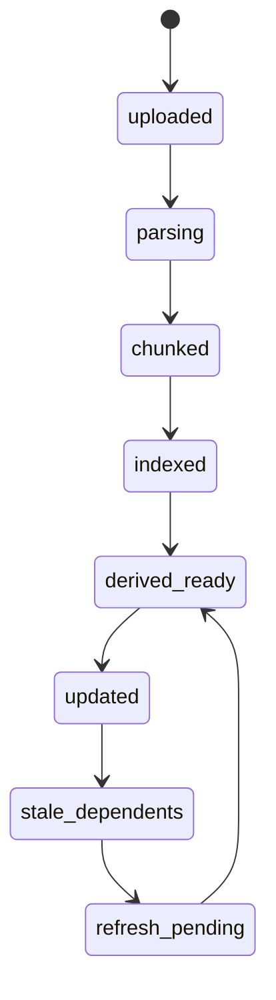

# Learning OS Implementation

This document turns the product brief into executable project output for Einstein Tutor.

The target product is a source-grounded adaptive learning OS with a unified workspace, first-class provenance, generated study artifacts, adaptive tutoring, continuous review, and explicit orchestration across sessions.

## 1. Implementation Plan With Milestones

| Milestone | Goal | Primary Deliverables | Exit Criteria |
|---|---|---|---|
| M0. Stabilize Current Refactor | Finish current modularization and static asset correctness | thin `main.py`, stable `routes/`, browser smoke tests, static asset fixes | upload/library/tutor/notes/graph/review all work in-browser |
| M1. Unified Workspace Foundation | Replace mode-heavy navigation with one progressive workspace | `UnifiedWorkspace`, `SourceRail`, `TutorCanvas`, `EvidenceRail`, `NotesWorkbench`, `ReviewPanel`, `GoalController` | user can upload, set goal, ask grounded question, inspect evidence, save note, create card without switching top-level modes |
| M2. Provenance And Memory | Make provenance explicit for every derived object | `provenance_service`, `TutorExchange`, `EvidenceReference`, note provenance, card provenance | every answer, card, note, and quiz item shows source chips and anchors |
| M3. Adaptive Tutoring Loop | Move from one-shot answers to diagnosis-driven teaching | `adaptive_tutor`, error classification, repair path generation, tutor modes | tutor produces diagnosis label, repair action, and revisit scheduling |
| M4. Review Engine | Turn review into a continuous system | `review_scheduler`, `mastery_engine`, persistent review events, missed-item reruns | review state persists across sessions and updates mastery and next-best-action |
| M5. Studio Layer | Add a NotebookLM-style artifact studio | `artifact_studio`, `ArtifactViewer`, study guide/report/FAQ/map/cards/quiz generation | artifacts are generated from explicit scope and retain provenance |
| M6. Notebook Intelligence | Add cross-source synthesis and stale detection | contradiction detection, synthesis reports, `staleness_detector` | source update marks dependent artifacts stale and offers refresh |
| M7. Session Engine | Make focus work explicit and durable | `session_engine`, session summaries, next session recommendations | every sprint generates summary, mastery delta, unresolved items, and next step |
| M8. Export Layer | Make learning outputs portable | `export_service`, Markdown/PDF/JSON/CSV exports | artifacts and flashcards can be exported with provenance preserved |
| M9. Advanced Modalities | Add high-cost artifact types behind capability flags | audio recap, infographic, slide deck, debate mode | advanced artifact jobs can be generated or intentionally deferred per capability flag |

### Sprint sequencing

| Sprint | Scope | Concrete changes |
|---|---|---|
| Sprint 1 | Finish workspace shell | remove old tab-first flow, land three-pane layout, add right-rail evidence shell |
| Sprint 2 | Grounded tutor + notes | persist tutor exchanges, add evidence chips, attach evidence to notes and cards |
| Sprint 3 | Review + mastery | persist review events, missed-item reruns, mastery deltas, next best action |
| Sprint 4 | Concept graph integration | turn map into a workspace surface with node actions and provenance |
| Sprint 5 | Studio foundation | artifact generation jobs, artifact viewer, prompt visibility, stale dependency records |
| Sprint 6 | Cross-source synthesis | agreement/tension/gap reports, contradiction surfacing, source scope controls |
| Sprint 7 | Session engine | session start/end flows, interruption tracking, summary drawer |
| Sprint 8 | Export + advanced generation | exports, deck/infographic/audio stubs, regression hardening |

## 2. Updated Architecture

### Runtime layers

| Layer | Responsibility | Concrete modules |
|---|---|---|
| Source layer | upload, sync, parsing, duplicate detection, source diagnostics | `source_ingestion`, `chunking_and_indexing` |
| Knowledge layer | concepts, claims, examples, misconceptions, graph updates | `concept_graph` |
| Grounding layer | evidence lookup, provenance hydration, contradiction checks | `provenance_service` |
| Tutor layer | diagnosis, explanation, probing, repair paths, exchange persistence | `adaptive_tutor` |
| Review layer | mastery estimation, spaced repetition scheduling, review events | `mastery_engine`, `review_scheduler` |
| Artifact layer | studio jobs, prompt capture, artifact transforms, export | `artifact_studio`, `export_service` |
| Orchestration layer | session objects, next best action, stale dependency refresh | `session_engine`, `staleness_detector` |
| UI layer | unified workspace, rails, canvas surfaces, artifact viewer, session drawer | `UnifiedWorkspace`, `SourceRail`, `EvidenceRail`, `TutorCanvas`, `ConceptMapPanel`, `StudioPanel`, `NotesWorkbench`, `ReviewPanel`, `ArtifactViewer`, `SessionSummaryDrawer`, `GoalController` |

### Target backend module map

| Module | Primary interfaces | Notes |
|---|---|---|
| `services/source_ingestion.py` | `ingest_source(file, metadata)`, `reingest_source(source_id)`, `detect_duplicates(source_id)` | wraps current document upload/parsing path |
| `services/chunking_and_indexing.py` | `chunk_source(source_id)`, `index_chunks(source_id)`, `compute_chunk_delta(source_id, version)` | owns chunk hashes and change detection |
| `services/concept_graph.py` | `extract_concepts(source_scope)`, `extract_claims(concept_scope)`, `extract_misconceptions(concept_scope)`, `refresh_graph(scope)` | replaces passive graph fetching with graph lifecycle |
| `services/provenance_service.py` | `build_evidence_reference(anchor)`, `hydrate_provenance(object_id)`, `find_contradictions(scope)` | explicit provenance subsystem |
| `services/artifact_studio.py` | `create_artifact(request)`, `refresh_artifact(artifact_id)`, `transform_artifact(artifact_id, target_kind)` | all studio generation jobs route here |
| `services/adaptive_tutor.py` | `run_exchange(request)`, `classify_response(exchange_id, learner_text)`, `build_repair_path(exchange_id)` | owns tutoring loop and modes |
| `services/mastery_engine.py` | `update_mastery(event)`, `get_mastery_state(concept_id, scope)`, `compute_mastery_delta(session_id)` | event-driven mastery layer |
| `services/review_scheduler.py` | `schedule_review(item_id, trigger)`, `complete_review(item_id, outcome)`, `get_due_queue(scope)` | continuous review instead of separate mode |
| `services/session_engine.py` | `start_session(request)`, `pause_session(session_id)`, `finish_session(session_id)`, `suggest_next_session(goal_id)` | session object lifecycle |
| `services/staleness_detector.py` | `mark_stale_for_source_change(source_id, version)`, `refresh_dependents(source_id)` | depends on source snapshot hashes |
| `services/export_service.py` | `export_artifact(artifact_id, format)`, `export_flashcards(scope, format)` | Markdown, PDF, JSON, CSV, deck PDF |

### Target frontend module map

| Module | Responsibility | Primary state inputs |
|---|---|---|
| `UnifiedWorkspace` | layout, surface switching, action routing | `workspace.surface`, `scope`, `active_session_id` |
| `SourceRail` | sources, filters, source diagnostics, stale banners | `sources`, `source_scope`, `source_health` |
| `EvidenceRail` | excerpts, confidence, contradictions, related evidence, provenance actions | `active_evidence`, `evidence_scope`, `contradictions` |
| `TutorCanvas` | grounded tutor, modes, diagnosis loop, evidence-backed actions | `active_exchange`, `tutor_mode`, `classification` |
| `ConceptMapPanel` | mastery-aware graph, node actions, unresolved questions | `graph`, `mastery_states`, `graph_scope` |
| `StudioPanel` | artifact generation and transforms | `artifact_requests`, `artifact_scope`, `artifact_jobs` |
| `NotesWorkbench` | persistent notes, note types, transforms | `notes`, `selected_note_id`, `note_filters` |
| `ReviewPanel` | due queue, missed reruns, confidence-aware review | `review_queue`, `review_session` |
| `SessionSummaryDrawer` | end-of-session summary and next action | `session_summary`, `mastery_delta`, `follow_up_plan` |
| `ArtifactViewer` | prompt visibility, artifact status, stale markers, export | `artifacts`, `artifact_versions`, `artifact_exports` |
| `GoalController` | goal management and scope alignment | `goals`, `active_goal_id` |

### Unified workspace surface states

| Surface | Entry triggers | Main actions | Exit triggers |
|---|---|---|---|
| `ingestion` | first upload, parsing in progress, source update | inspect parser diagnostics, set goal, approve scope | parsing complete |
| `tutor` | ask question, open next best action, session start | inspect evidence, save note, convert to card, probe learner | learner requests other artifact or review |
| `concept` | select graph node, unresolved concept, contradiction | teach, quiz, compare, note, inspect evidence | concept complete or switch node |
| `review` | due queue, missed items, sprint recommendation | rate items, rerun misses, inspect linked evidence | queue empty or pause session |
| `session` | focus sprint | guided workflow, interruption tracking | session complete |
| `synthesis` | artifact generation, compare sources, report flow | generate study guide/report/FAQ/deck | artifact opened or exported |

## 3. Database And Schema Changes

### Entity mapping

| Target entity | Current state | Migration approach |
|---|---|---|
| `Source` | current `documents` | keep table, extend metadata and versioning |
| `SourceChunk` | current `chunks` | keep table, add chunk hash and version alignment |
| `Concept` | current `concepts` | extend with counts and canonical fields |
| `Claim` | missing | new table |
| `Example` | missing | new table |
| `Misconception` | partial heuristic only | new table |
| `Note` | current `notes` | extend note type, goal, session, provenance |
| `Flashcard` | current `srs_cards` | extend provenance and source snapshot support |
| `Quiz` | current `questions` | extend provenance and artifact linkage |
| `Artifact` | missing | new table |
| `Session` | partial dialogue session only | new session table separate from Socratic dialogue log |
| `Goal` | settings key only | new goals table |
| `TutorExchange` | implicit in chat payloads | new table |
| `EvidenceReference` | implicit | new table |
| `MasteryState` | implicit concept mastery float | new table |
| `StaleDependency` | missing | new table |

### Schema deliverable

The concrete SQL migration lives in:

- `/Users/madu/Desktop/Codex/migrations/20260412_learning_os.sql`

### Ownership model

| Object | Owned by | Version basis |
|---|---|---|
| source summary | `documents.source_hash` | source version |
| concept graph node/edge | source snapshot hash | source version + chunk hash set |
| flashcard | concept + evidence references | concept snapshot hash |
| quiz item | concept + evidence references | concept snapshot hash |
| note | user authored, optionally derived | explicit provenance list |
| artifact | source scope + prompt + snapshot hash | artifact snapshot hash |
| session summary | session scope + outputs | session snapshot hash |

## 4. UI Component Map

### Left rail sections

| Section | Data | Actions |
|---|---|---|
| Sources | source list, health, sync state, duplicates | upload, filter, select scope, inspect diagnostics |
| Goals | goal list, active goal | create, switch, archive |
| Notes | note list, note filters | open, create, convert |
| Sessions | active, recent, suggested | resume, start sprint, inspect summary |
| Artifacts | ready, generating, stale | open, refresh, export |
| Filters | source scope, concept scope, strictness, difficulty | update workspace context |

### Center canvas surfaces

| Surface | Primary widget | Supporting widgets |
|---|---|---|
| grounded tutor | answer thread | diagnosis bar, evidence actions, follow-up probes |
| concept view | concept detail card | related graph branch, misconceptions, open questions |
| review | active card queue | missed queue, source excerpt drawer |
| studio | generator form + artifact viewer | prompt preview, stale badge, transform chain |
| synthesis | report canvas | compare sources, contradictions, gaps, export |
| session sprint | step list | timer, interruption log, mastery delta panel |

### Right rail sections

| Section | Data | Actions |
|---|---|---|
| Evidence | excerpts, anchors, pages, chunk IDs | open excerpt, open full context, copy citation |
| Confidence | model confidence, evidence density, learner confidence | change strictness, inspect weak grounding |
| Contradictions | conflicting claims or terminology mismatch | compare sources, open tension report |
| Related concepts | graph neighbors, dependent concepts | teach this, compare, quiz |
| Next actions | orchestration suggestions | start sprint, generate artifact, review due items |

## 5. State Machine Definitions

### Source lifecycle

### Tutor exchange lifecycle

| State | Entry | Exit |
|---|---|---|
| `idle` | no question yet | submit question |
| `retrieving` | question submitted | evidence ranked |
| `answering` | evidence ready | answer emitted |
| `inspecting_evidence` | user opens evidence rail | save/convert/compare |
| `probing` | tutor asks follow-up | learner reply submitted |
| `classified` | learner reply scored | repair path or promotion |
| `repairing` | misconception/omission detected | revisit scheduled |
| `promoted` | robust answer | longer interval scheduled |

### Artifact lifecycle

| State | Meaning | Trigger to next |
|---|---|---|
| `draft` | request created, not yet run | queue job |
| `generating` | worker executing | output ready |
| `ready` | current and viewable | source change or prompt change |
| `stale` | dependent source snapshot no longer current | refresh requested |
| `regenerating` | stale artifact being rebuilt | new version created |
| `archived` | hidden from active workspace | restore |

### Session lifecycle

| State | Stored fields |
|---|---|
| `planned` | objective, scope, duration, difficulty |
| `active` | start time, interruptions, current surface |
| `paused` | pause timestamp, interruption reason |
| `completed` | mastery delta, cards generated, unresolved items |
| `follow_up_suggested` | next session recommendation, stretch question |

### Review item lifecycle

| State | Transition rules |
|---|---|
| `new` | first review event |
| `learning` | missed or shallow answer |
| `review` | correct answer, stable recall |
| `relearning` | error after review |
| `mastered` | repeated robust performance across intervals |

## 6. Provenance Model

### EvidenceReference contract

| Field | Type | Description |
|---|---|---|
| `id` | string | stable provenance object ID |
| `source_id` | string | owning source |
| `chunk_id` | string | source chunk anchor |
| `concept_id` | string nullable | linked concept |
| `anchor_text` | text | exact cited excerpt |
| `anchor_start` | integer nullable | character offset or page-local start |
| `anchor_end` | integer nullable | character offset or page-local end |
| `page_num` | integer nullable | PDF or paginated source anchor |
| `section_label` | string nullable | human-readable anchor |
| `confidence` | real | grounding confidence |
| `contradiction_group` | string nullable | linked contradiction cluster |
| `snapshot_hash` | string | source snapshot used when reference was created |

### Provenance rules

| Rule | Enforcement |
|---|---|
| every tutor answer must emit at least one `EvidenceReference` when evidence exists | fail closed to "needs more evidence" state |
| every flashcard and quiz item must retain provenance | store join rows from card/question to `EvidenceReference` |
| every artifact must retain prompt text and source snapshot hash | store on artifact version |
| every note can be either freeform or citation-backed | `note_type` plus optional provenance join rows |
| contradictions are evidence-linked, not heuristic-only strings | contradiction clusters point to at least two evidence refs |

## 7. Artifact Generation Pipeline

### Pipeline stages

| Stage | Input | Output |
|---|---|---|
| scope resolution | selected sources, concepts, goal, audience, difficulty | normalized generation scope |
| retrieval | scope + evidence strictness | ranked chunks and evidence refs |
| synthesis plan | scope + retrieval set + artifact kind | structured generation prompt |
| generation | synthesis plan | artifact body + structured metadata |
| provenance binding | artifact output + evidence refs | artifact-evidence joins |
| version snapshot | artifact + source hash set + prompt | immutable artifact version |
| stale registration | artifact version + source snapshot hashes | `stale_dependencies` rows |
| transform chain | artifact kind + target kind | derived artifact linked to parent |

### Required artifact kinds

| Kind | Status |
|---|---|
| study guide | phase 2 ship |
| briefing | phase 2 ship |
| report | phase 2 ship |
| FAQ | phase 2 ship |
| concept map | phase 1/2 bridge |
| flashcards | phase 1 ship |
| quiz | phase 1 ship |
| audio recap | phase 3 |
| slide deck | phase 3 |
| infographic | phase 3 |

### Transform chain rules

| From | To |
|---|---|
| tutor answer | note, flashcard, quiz item |
| note | flashcard, quiz item, outline, study guide input |
| concept map node | tutor prompt, quiz, compare prompt |
| report | slide deck, briefing, FAQ |
| study guide | flashcards, quiz, export package |

## 8. Review Scheduling Logic

### Inputs

| Signal | Source |
|---|---|
| response correctness | review action, tutor evaluation |
| response label | omission, misconception, wrong relation, wrong example, shallow, robust |
| learner confidence | explicit slider or response metadata |
| evidence density | count and quality of supporting evidence refs |
| source volatility | whether the linked source snapshot changed recently |
| session context | sprint objective and duration |

### Scheduling policy

| Outcome | Interval policy | Next action |
|---|---|---|
| omission | keep or shorten to 1 day | concise recap plus evidence excerpt |
| misconception | 10-30 minute revisit within session, then 1 day | contrastive explanation and counterexample |
| wrong relation | same session revisit | dependency/causal visual |
| wrong example | 1 day | corrected example and counterexample |
| shallow but correct | modest growth, 2-3 day interval | application question |
| robust and transferable | strong growth, 5-14 day interval | promote and reduce coaching |

### MasteryState shape

| Field | Meaning |
|---|---|
| `recall_score` | retention estimate |
| `transfer_score` | ability to apply beyond definition |
| `misconception_risk` | probability of specific error recurrence |
| `confidence_alignment` | mismatch between reported and observed confidence |
| `last_evidence_quality` | density and diversity of grounding |
| `next_due_at` | review scheduler output |

## 9. Regression Test Plan

### Backend tests

| Area | Cases |
|---|---|
| ingestion | upload, duplicate detection, parser diagnostics, re-upload changes |
| provenance | tutor answer emits evidence refs, card/question provenance joins, citation copy payload |
| concept graph | node lineage, contradiction group assignment, stale edge refresh |
| review | interval changes per classification label, missed-item reruns, source-linked scheduling |
| artifacts | prompt capture, version snapshot hash, stale dependency creation |
| sessions | start/pause/finish session, mastery delta generation, next session suggestion |

### Browser or UI tests

| Flow | Assertions |
|---|---|
| upload to first study cycle | summary, concept map, notes, cards, quiz visible without tab hunting |
| tutor answer to durable memory | evidence rail opens, note saved, card created, due item scheduled |
| concept repair | wrong answer classification, repair panel, revisit queued |
| source update | stale badge appears on affected artifacts, refresh action regenerates new version |

### Fixture matrix

| Fixture type | Purpose |
|---|---|
| single short text file | happy-path upload |
| two overlapping sources | cross-source synthesis and contradictions |
| revised source version | stale detection |
| noisy PDF | parser diagnostics and health |
| misconception-heavy study guide | tutor repair and review scheduling |

## 10. Migration Plan From Current Product State

| Step | Action |
|---|---|
| 1 | freeze current route behavior and keep compatibility shims in `main.py` |
| 2 | apply additive migration for goals, sessions, artifacts, evidence, mastery, stale dependencies |
| 3 | backfill `documents` as `Source`, `chunks` as `SourceChunk`, existing `notes`, `questions`, and `srs_cards` into provenance-ready shape |
| 4 | start writing all new tutor outputs through `TutorExchange` and `EvidenceReference` |
| 5 | replace old top-nav-first flow with `UnifiedWorkspace` and route old tabs to internal surfaces |
| 6 | move flashcards/quizzes from isolated review surface into continuous due queue widgets |
| 7 | introduce studio job creation behind feature flags while preserving existing note/card generation |
| 8 | enable stale artifact detector after source hash backfill is complete |
| 9 | add exports and advanced modalities behind capability flags |

### Backfill priorities

| Priority | Backfill |
|---|---|
| P0 | source hashes, source versions, chunk hashes |
| P1 | note/card/question provenance joins |
| P2 | mastery states from existing review history |
| P3 | artifact records for legacy summaries, quizzes, and cards |

## 11. Final Checklist

| Capability | Covered now | Delivery phase |
|---|---|---|
| source upload and parsing | yes | phase 1 |
| source-grounded tutoring with visible evidence | yes | phase 1 |
| cross-source synthesis | yes | phase 2 |
| interactive concept maps | yes | phase 1/2 |
| generated study artifacts | yes | phase 2 |
| adaptive practice and spaced repetition | yes | phase 1 |
| persistent notes and memory | yes | phase 1 |
| session orchestration | yes | phase 1 |
| stale artifact detection | yes | phase 2 |
| exportable learning artifacts | yes | phase 2 |
| audio recap | intentionally deferred | phase 3 |
| infographic generation | intentionally deferred | phase 3 |
| slide deck generation | intentionally deferred | phase 3 |
| debate mode | intentionally deferred | phase 3 |

## 12. End-To-End User Flows

### Flow A: upload to first study cycle

1. `POST /api/sources/upload`
2. source enters `parsing`
3. chunking and indexing complete
4. concept graph, starter notes, starter flashcards, starter quiz, and source summary are created
5. goal prompt appears in `GoalController`
6. workspace computes next best action
7. center canvas opens grounded tutor or sprint surface

### Flow B: tutor answer to durable memory

1. user submits tutor prompt
2. `adaptive_tutor.run_exchange()` retrieves evidence
3. answer and `EvidenceReference` rows persist
4. user opens right rail excerpt
5. user saves citation-backed note
6. note converts into flashcard or quiz item
7. review scheduler creates or updates due item
8. mastery state updates

### Flow C: concept repair

1. learner answers incorrectly
2. tutor classifies error
3. repair path and evidence surface open
4. learner gets contrastive follow-up
5. revisit is scheduled
6. concept node shows new misconception or unresolved badge

### Flow D: source update and stale artifact handling

1. source is re-uploaded or synced
2. changed chunk hashes are computed
3. `staleness_detector` marks dependent artifacts stale
4. workspace shows refresh actions in left rail and artifact viewer
5. regenerated artifact stores new snapshot hash and preserves version history

## Appendix: Explicit mode controls

Every major tutor or studio action must expose:

| Control | Values |
|---|---|
| source scope | selected sources, all sources |
| concept scope | selected concept, related concepts, all concepts |
| depth | quick, standard, rigorous |
| mode | explain, test, compare, challenge, synthesize |
| evidence strictness | light, normal, citation-heavy, citation-only |
| output format | prose, bullets, table, cards, outline |
| difficulty | intro, standard, exam, advanced |
| audience | self, peer, beginner, expert |
| session length | 5, 10, 20, 45 minutes |

## Related deliverable

Detailed API contracts live in:

- `/Users/madu/Desktop/Codex/implementation/LEARNING_OS_API_V2.md`
